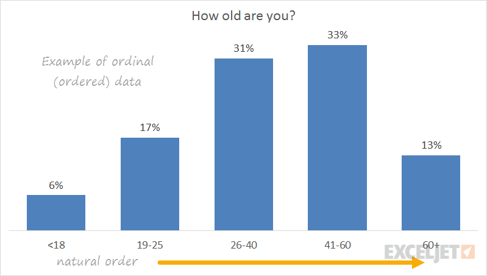

# Data Types in Statistics

## Contents

 - [01 - Qualitative Data (Aka, categorical)](#qualitative-data)
   - [01.1 - Nominal data (Are "names" for some "characteristic" "groups")](#nominal-data)
   - [01.2 - Ordinal data (Indicate some kind (tipo) of inherent order or hierarchy)](#ordinal-data)
   - [01.3 - Binary data (Variables that represents binarization: True/False, Yes/No, 0/1)](#binary-data)
 - [02 - Quantitative Data (Aka, numerical)](#quantitative-data)
   - [02.1 - Continuous data (We measure (medimos) instead counting)](#continuous-data)
   - [02.2 - Discrete data (It's something we count instead of measuring)](#discrete-data)

---

## 01 - Qualitative Data (aka, categorical)

> This **type of data is categorical** - It is used to **categorize** or **identify** the **entity** being observed:

---

### 01.1 - Nominal data (Are "names" for some "characteristic" "groups")

You can see some **nominal data** in the images below:

  
  

**NOTE:**  
See we have categorical groups, however, this group doesn't inherent order, ranking or sequence. 

> **NOTE:**  
> Just represents characteristic groups.

---

### 01.2 - Ordinal data (Indicate some kind (tipo) of inherent order or hierarchy)

  
  
  

---

### 01.3 - Binary data (Variables that represents binarization: True/False, Yes/No, 0/1)

How description says, the **binary data are variables that represent binarization**:

 - **True** or **False**
 - **Yes** or **No**
 - **1** or **0**

---

## 02 - Quantitative Data (Aka, numerical)

Now let's turn our attention to features that indicate some sort of:

 - Amount.
 - Or measure.

---

## 02.1 - Continuous data (We measure (medimos) instead counting)

  
  

---

## 02.2 - Discrete data (It's something we count instead of measuring)

  

---

**REFERENCES:**  
[Essential Math for Machine Learning: Python Edition](https://learning.edx.org/course/course-v1:Microsoft+DAT256x+2T2018/home)  

---

Ro**drigo** **L**eite da **S**ilva - **drigols**
