# Descriptive Statistics

## Contents

 - **Motivation and Importance of Descriptive Statistics:**
   - [Motivation to use Descriptive Statistics](#motivation)
   - [Relationship between CRISP-DM methodology and Descriptive Statistics](#crips-dm-rel)
   - [Some types of observations in a Descriptive Analysis](#observations-types)
 - **Sampling Methods:**
   - [Intro to sampling methods](#intro)
   - **Probability Sampling:**
     - [Simple Random Sampling](#srs)
     - [Stratified Sampling](#ss)
     - [Cluster Sampling](#cs)
     - [Systematic Sampling](#systematic)
     - [Multistage Sampling](#multistage)
   - **Non-Probability Sampling:**
     - [Convenience Sampling](#convenience)
     - [Voluntary Sampling](#voluntary)
     - [Snowball Sampling](#snowball)
     - [Quota Sampling](#quota)
     - [Judgmental or Purposive Sampling](#jps)
 - **Types of Variables in Statistics:**
   - [**Qualitative Data (Aka, categorical)**](#qualitative-data)
     - [Nominal data (Are "names" for some "characteristic" "groups")](#nominal-data)
     - [Ordinal data (Indicate some kind (tipo) of inherent order or hierarchy)](#ordinal-data)
     - [Binary data (Variables that represents binarization: True/False, Yes/No, 0/1)](#binary-data)
   - [**Quantitative Data (Aka, numerical)**](#quantitative-data)
     - [Continuous data (We measure (medimos) instead counting)](#continuous-data)
     - [Discrete data (It's something we count instead of measuring)](#discrete-data)
 - **Frequency Distribution:**
   - **Qualitative variables:**
     - [Creating a frequency table for categorical variables](#frequency-table-categorical-variables)
     - [Formula to calculate absolute and relative frequency table](#calculate-absolute-relative)
     - [Relative frequency observation](#relative-frequency-observation)
     - [Visualizing a frequency table with Bar Chart](#ft-w-bar-graph)
     - [Stacked Bar Chart](#stacked-bar-chart)
     - [Frequency table with two categorical variables](#ft-two-cv)
     - [Creating a Stacked Bar Chart for two categorical variables](#sbcftcv)
     - [Create a Bart Chart for two categorical variables](#cbcftcv)
     - [TIP: When uses each kind of chart (PT-BR notes)](#when-use-fqv)
     - [TIP: Nominal vs. Ordinal variables in Frequency tables](#normal-ordinal-ft)
   - **Quantitative variables:**
     - [Frequency table for quantitative variables (amplitude)](#ft-for-qv)
     - [Creating a histogram for quantitative variables](#histogram-for-qv)
     - [TIP: Number of "class amplitude"](#tip-clas-amplitude)
 - **Tips & Tricks:**
   - [Population vs. Sample](#pop-vs-sample)

---

<div id="motivation"></div>

## Motivation to use Descriptive Statistics

To start with **Descriptive Statistics**, let's get started with the follow problem. Imagine we have some **x<sub>n</sub>** and **y<sub>n</sub>** variables:

  

**NOTE:**  
Looking at the data (olhando para os dados) above, it's hard to understand the patterns and the relationship between this variable.

> **NOTE:**  
> The **Descriptive Statistics** focus on visual approach to see this patterns and relationship more easily.

For example, see the visual approach below:

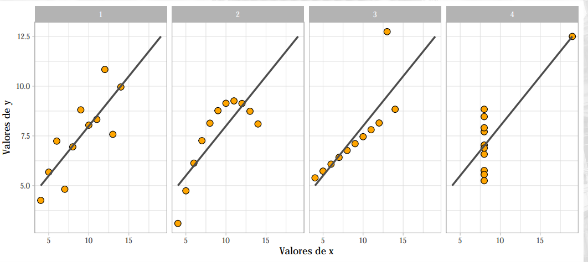  

---

<div id="crips-dm-rel"></div>

## Relationship between CRISP-DM methodology and Descriptive Statistics

The **Descriptive Statistics** focus specifically on **step 2 (data understanding)** and **step 3 (data preparation)** in **CRISP-DM methodology**:

  

---

<div id="observations-types"></div>

## Some types of observations in a Descriptive Analysis

 - 1. Investigate the **behavior** of a variable.
 - 2. Examine the **relationship** between variables.
 - 3. Emphasize **sorting/classification** elements/categories.
 - 4. Understand the **organizational** structure of elements/categories.
 - 5. Explore the **chronological** evolution of a variable.
 - 6. Reveal **spatial** patterns in the data.
 - 7. Describe the **connection** between elements/categories.

---

<div id='intro'></div>

## Intro to sampling methods

> **"Sampling"** is the process of selecting a subset *(a predetermined number of observations)* from a larger population.

**NOTE:**  
It’s a pretty common technique wherein (em que), we run experiments and draw conclusions about the population, without the need of having to study the entire population.

The **"Sampling" Methods** are divided in two groups:

 - **Probability Sampling:**
   - Here we choose a sample based on the *Theory of Probability*.
 - **Non-Probability Sampling:**
   - Here we choose a sample based on *non-random criteria*, and not every member of the population has a chance of being included.

---

<div id="srs"></div>
## Simple Random Sampling

> Under (na) **Random sampling**, every element of the population has an **equal probability of getting selected**.

Below **fig.** shows the pictorial view of the same:

  

**NOTE:**  
All the points collectively represent the entire (inteira) population wherein (em que) every point has an equal chance of getting selected.

You can implement it using python as shown below:

[simple_random_sampling.py](src/simple_random_sampling.py)
```python
import random

population = 100
data = range(population) # Create a range (0 to 100).
simpleRandomSampling = random.sample(data, 5) # Get 5 random numbers.
print(simpleRandomSampling)
```

**OUTPUT:**  
```python
[63, 3, 9, 27, 91]
```

---

<div id="ss"></div>

## Stratified Sampling

> Under (na) **Stratified Sampling**, we group the entire population into ***subpopulations*** by some common property (prioridade).

For example — Class labels in a typical ML classification task. We then randomly sample from those groups individually, such that the groups are still maintained in the same ratio as they were in the entire population.

Below fig. shows a pictorial view of the same:

  

We have two groups with a count ratio of **x** and **3x** based on the colour, we randomly sample from *yellow* and *green* sets separately and represent the final set in the same ratio of these groups.

**Scikit-Learn example:**  
```python
from sklearn.model_selection import train_test_split

stratified_sample, _ = train_test_split(
  population,
  test_size=0.9,
  stratify=population[['label']]
)

print (stratified_sample)
```

**Example 1: Stratified Sampling Using Counts**  
Suppose we have the following pandas DataFrame that contains data about:

 - 8 basketball players.
 - On 2 different teams.

[ss_using_count.py](src/ss_using_count.py)
```python
import pandas as pd

# Create DataFrame
df = pd.DataFrame(
    {
        'team': ['A', 'A', 'A', 'A', 'B', 'B', 'B', 'B'], # Two teams (A and B).
        'position': ['G', 'G', 'F', 'G', 'F', 'F', 'C', 'C'],
        'assists': [5, 7, 7, 8, 5, 7, 6, 9],
        'rebounds': [11, 8, 10, 6, 6, 9, 6, 10]
    }
)

# view DataFrame
print(df)
```

**OUTPUT:**  
```python
  team position  assists  rebounds
0    A        G        5        11
1    A        G        7         8
2    A        F        7        10
3    A        G        8         6
4    B        F        5         6
5    B        F        7         9
6    B        C        6         6
7    B        C        9        10
```

**NOTE:**  
Each row (8) represent a sample (player/instance).

Now, the following code shows how to perform **Stratified Random Sampling** by randomly `selecting 2 players from each team to be included in the sample`:

[ss_using_count.py](src/ss_using_count.py)
```python
# Apply Stratified Random Sampling.
stratifiedRandomSampling = df.groupby(
    'team',
    group_keys=False
).apply(lambda x: x.sample(2))

print(stratifiedRandomSampling)
```

**OUTPUT:**  
```python
  team position  assists  rebounds
0    A        G        5        11
1    A        G        7         8
6    B        C        6         6
5    B        F        7         9
```

**NOTE:**  
 - Notice that two players from each team are included in the stratified sample.
 - Observe que **dois jogadores de cada equipe estão incluídos na amostra estratificada**.

**Example 2: Stratified Sampling Using Proportions**  
Once again suppose we have the following pandas DataFrame that contains data about 8 basketball players on 2 different teams:

[ss_using_proportions.py](src/ss_using_proportions.py)
```python
import pandas as pd

# Create DataFrame
df = pd.DataFrame(
    {
        'team': ['A', 'A', 'B', 'B', 'B', 'B', 'B', 'B'],
        'position': ['G', 'G', 'F', 'G', 'F', 'F', 'C', 'C'],
        'assists': [5, 7, 7, 8, 5, 7, 6, 9],
        'rebounds': [11, 8, 10, 6, 6, 9, 6, 10]
    }
)

# View DataFrame
print(df)
```

**OUTPUT:**  
```python
  team position  assists  rebounds
0    A        G        5        11
1    A        G        7         8
2    B        F        7        10
3    B        G        8         6
4    B        F        5         6
5    B        F        7         9
6    B        C        6         6
7    B        C        9        10
```

**Notice that now:**

 - 6 of the 8 players (75%) in the DataFrame are on team B.
 - And 2 out of the 8 players (25%) are on team A.

The following code shows how to perform **stratified random sampling** such that the proportion of players in the sample from each team matches the proportion of players from each team in the larger DataFrame:

[ss_using_proportions.py](src/ss_using_proportions.py)
```python
import pandas as pd
import numpy as np

# Create DataFrame
df = pd.DataFrame(
    {
        'team': ['A', 'A', 'B', 'B', 'B', 'B', 'B', 'B'],
        'position': ['G', 'G', 'F', 'G', 'F', 'F', 'C', 'C'],
        'assists': [5, 7, 7, 8, 5, 7, 6, 9],
        'rebounds': [11, 8, 10, 6, 6, 9, 6, 10]
    }
)

# View DataFrame.
# print(df)

# Define total sample size desired.
N = 4

# Perform Stratified Random Sampling.
perform = df.groupby(
    'team',
    group_keys=False
).apply(lambda x: x.sample(int(np.rint(N*len(x)/len(df))))).sample(frac=1).reset_index(drop=True)

print(perform)
```

**OUTPUT:**  
```python
  team position  assists  rebounds
0    B        F        7         9
1    B        G        8         6
2    B        C        6         6
3    A        G        5        11
```

**NOTE:**  

 - Notice that the proportion of players from team A in the stratified sample (25%) matches the proportion of players from team A in the larger DataFrame.
 - Similarly, the proportion of players from team B in the stratified sample (75%) matches the proportion of players from team B in the larger DataFrame.

---

<div id="cs"></div>

## Cluster Sampling

> In **Cluster sampling**, we **divide the entire population into subgroups**, wherein, **each of those subgroups has similar characteristics to that of the population when considered in totality**.

**NOTE:**  
Also, instead of sampling individuals, we **randomly select the entire subgroups**. For example, see the example below:

  

**NOTE:**  
As you can be seen in the above **fig.** that we had **4 clusters** with similar properties (size and shape), we randomly select two clusters and treat them as samples.

---

<div id="systematic"></div>

## Systematic Sampling

> **Systematic sampling** is about sampling items from the population at regular predefined intervals (basically fixed and periodic intervals).

**NOTE:**  
For example — Every 5th element, 21st element and so on.

This sampling method tends to be more effective than the **vanilla random sampling method** in general. Below fig. shows a pictorial view of the same — We sample every 9th and 7th element in order and then repeat this pattern:

  

---

<div id="multistage"></div>

## Multistage Sampling

> Under (na) **Multistage sampling**, we **stack multiple sampling methods (like: Random Sampling, Stratified Sampling, Cluster Sampling...)** one after the other.

For example:

 - At the first stage, **Cluster Sampling** can be used to choose clusters from the population.
 - And then we can perform **Random Sampling** to choose elements from each cluster to form the final set.

Below **fig.** shows a pictorial view of the same:

  

---

<div id="convenience"></div>

## Convenience Sampling

> Under (na) **Convenience Sampling**, the researcher includes only those **individuals who are most accessible and available to participate in the study**.

The below **fig.** shows the pictorial view of the same:

  

 - The **Blue dot** is the `researcher`;
 - And **orange dots** are the **most accessible set of people in orange’s vicinity**.

---

<div id="voluntary"></div>

## Voluntary Sampling

> Under (na) **Voluntary sampling**, **interested people usually take part by themselves** by filling in some sort of survey forms.

**A good example of this is the youtube survey about:**

```
“Have you seen any of these ads”
```

**NOTE:**  
The researcher who is conducting the survey has no right to choose anyone.

The below **fig.** shows the pictorial view of the same:

  

 - The **Blue dot** is the **researcher**.
 - **Orange one’s** are those who **voluntarily agreed to take part in the study**.

---

<div id="snowball"></div>

## Snowball Sampling

> Under (na) **Snowball sampling**, the final set is chosen via other participants, i.e. The researcher asks other known contacts to find people who would like to participate in the study.

The below **fig.** shows the pictorial view of the same:

  

 - The **blue dot** is the **researcher**.
 - **orange ones** are **known contacts (of the researcher)**.
 - And **yellow ones (orange’s contacts)** are **other people that got ready to participate in the study**.

---

<div id="quota"></div>

## Quota Sampling

x

---

<div id="jps"></div>

## Judgmental or Purposive Sampling

x

---

<div id=""></div>

## x

x

---

<div id="qualitative-data"></div>

## Qualitative Data (aka, categorical)

> This **type of data is categorical** - It is used to **categorize** or **identify** the **entity** being observed:

---

<div id="nominal-data"></div>

### Nominal data (Are "names" for some "characteristic" "groups")

You can see some **nominal data** in the images below:

  
  

**NOTE:**  
See we have categorical groups, however, this group doesn't inherent order, ranking or sequence. 

> **NOTE:**  
> Just represents characteristic groups.

---

<div id="ordinal-data"></div>

### Ordinal data (Indicate some kind (tipo) of inherent order or hierarchy)

  
  
  

---

<div id="binary-data"></div>

### Binary data (Variables that represents binarization: True/False, Yes/No, 0/1)

How description says, the **binary data are variables that represent binarization**:

 - **True** or **False**
 - **Yes** or **No**
 - **1** or **0**

---

<div id="quantitative-data"></div>

## Quantitative Data (Aka, numerical)

Now let's turn our attention to features that indicate some sort of:

 - Amount.
 - Or measure.

---

<div id="continuous-data"></div>

## Continuous data (We measure (medimos) instead counting)

  
  

**NOTE:**  
We also say that **Continuous data** are:

> **Infinite** values from **an interval**.

For example:

 - **The income:**
   - per month of investment.
 - **Consumption:**
   - energy per month.

**NOTE:**  
See we have **infinite** values from **an interval**.

---

<div id="discrete-data"></div>

## Discrete data (It's something we count instead of measuring)

  

**NOTE:**  
We also say that **Discrete data** are:

> **Finite** values from **an interval**.

For example:

 - **Products sold:**
   - per day.
 - **Goals:**
   - By match.
 - **Passengers:**
   - per flight
 - **Eggs Broken:**
   - by dozen

**NOTE:**  
See we have some ranges like **day**, **match**, **flight** and **dozen** and our discrete variables are in this ranges.

---

<div id="frequency-table-categorical-variables"></div>

## Creating a frequency table for categorical variables

To understand how create a **frequency table** for categorical variables imagine we have the following data to analyze:

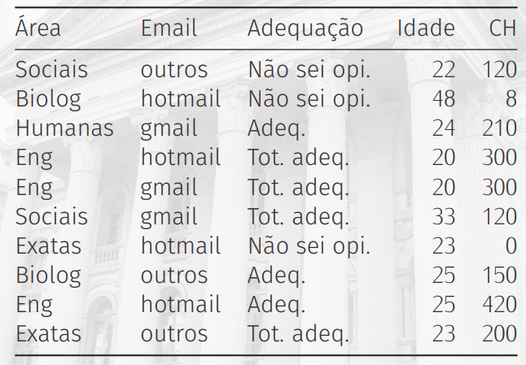  

To understand how to create a frequency table first, let's sorting Area variable:


see that the categorical variable Area has some categories:

 - Biolog
 - Eng
 - Exatas
 - Humanas
 - Sociais

There are two approach to create a frequency table:

 - **Absolute Frequency:**
   - Total for each category.
 - **Relative Frequency:**
   - Percent each category represent from total categories

For example, see the frequency table below, referent to our **Area variable**:

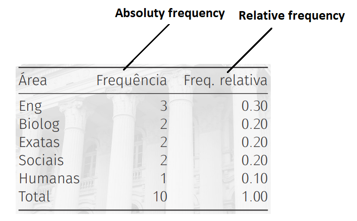  

---

<div id="calculate-absolute-relative"></div>

## Formula to calculate absolute and relative frequency table

To calculate absolute and relative frequency table we use the following formulas: 

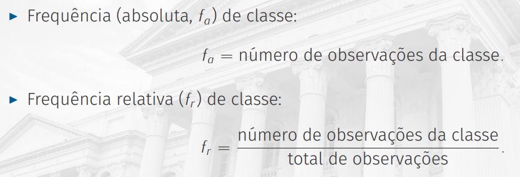

---

<div id="relative-frequency-observation"></div>

## Relative frequency observation

See that relative frequency never pass from **1.0** (that's 100% data).

  

> **NOTE:**
> The **range of relative frequency** is always from **0.00 (0% data)** to **1.00 (100% data)**.

For example, to see which percent represent each category take relative frequency and multiply per 100 (100%):

  

**NOTE:**  
See that **"Eng" category** represents **30%** of the data.

---

<div id="ft-w-bar-graph"></div>

## Visualizing a frequency table with Bar Chart

> One of the most common graphs to analyze qualitative (categorical) variables is a Bar graph.

For example, see the **Bar graph** below representing our categorical variable Area:

  

 - **The axis-x:**
   - Represent the category.
 - **The axis-y:**
   - Represent how many time each category appears.
   - Range 0 to 250.

We also can represent graph bar for categorical variables horizontal:

  

This approach is advised when:

 - You have very large variables names.
 - Many categories to analyze.

**NOTE:**  
That's because when each of the above cases happens the variable names overlap.

---

<div id="stacked-bar-chart"></div>

## Stacked Bar Chart

> Another approach is to use a **Stacked Bar Chart**.

For example, see the **Stacked Bar Chart** below for our **Area variables**:

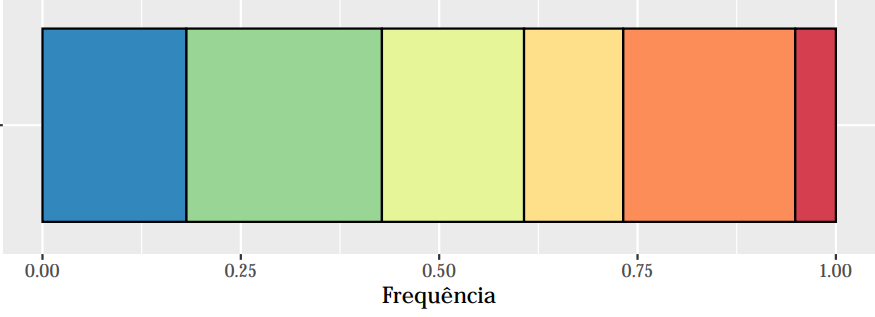  

**NOTE:**  
See we have stacked bar where each bar is a category percent. You also can represent each bar by category numbers.

---

<div id="ft-two-cv"></div>

## Frequency table with two categorical variables

Now, let's consider two categorical variables to make a frequency table. For example, **Area** and **Email**:

  

**NOTE:**  
Ok, now to calculate the frequency table, we focus on Area and Email combinations:

  

> **NOTE:**  
> See that only **Eng** and **hotmail** category has more one frequency.

Now we have the following **frequency table (absolute)** to **Area** and **Email** categorical variables:

  

**NOTE:**  
See we count possible combinations between **Area** and **Email** variables. Another observation is that the table represents an **Absolute Frequency Table**.

**NOTE:**  
Another crucial observation is that we have a sum for each combination set:

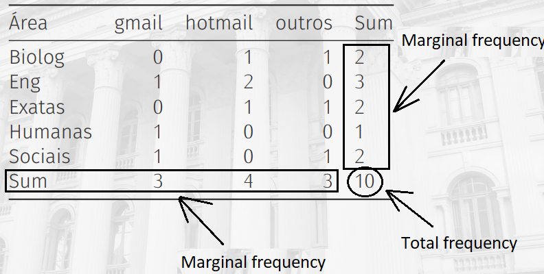  

Yes, we have two marginal frequencies on the sides and total frequency.

**NOTE:**  
You can also see this representation like a matrix:

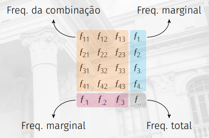

> Ok, but how I convert this **Absolute Frequency Table** to **Relative Frequency Table**?

Easy, just **divide** each combination between **Area** and **Email** variables by total frequencies:

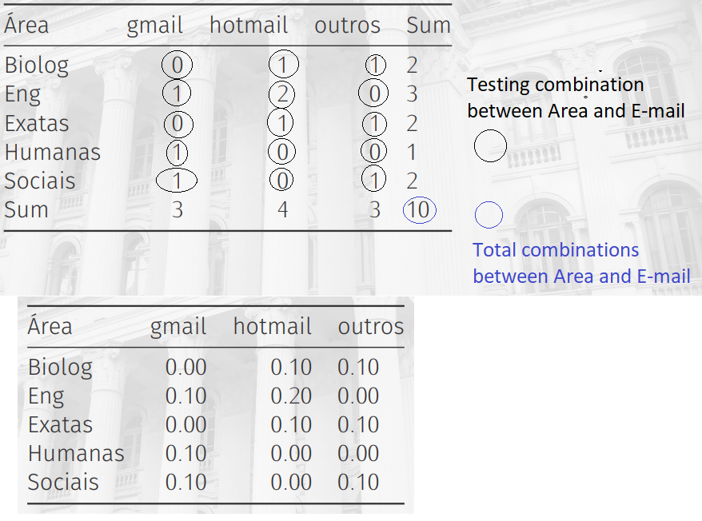  

---

<div id="sbcftcv"></div>

## Creating a Stacked Bar Chart for two categorical variables

> **Ok, create frequency tables for two categorical variable is easy. However, is hard to identify patterns.**

To identify patterns is recommender use visual approah. For example, **Stacked Bar Chart**:

  

> **NOTE:**  
> See that now we have a more intuitive approach to find patterns between **Area** and **Email** variables.

We can also use a **relative** approach to see by percent:

  

---

<div id="cbcftcv"></div>

## Create a Bart Chart for two categorical variables

> **Another approach is to create a **Bar chart**.**

For example, see the **Bar Chart** below:

  

---

<div id="when-use-fqv"></div>

## TIP: When uses each kind of chart (PT-BR notes)

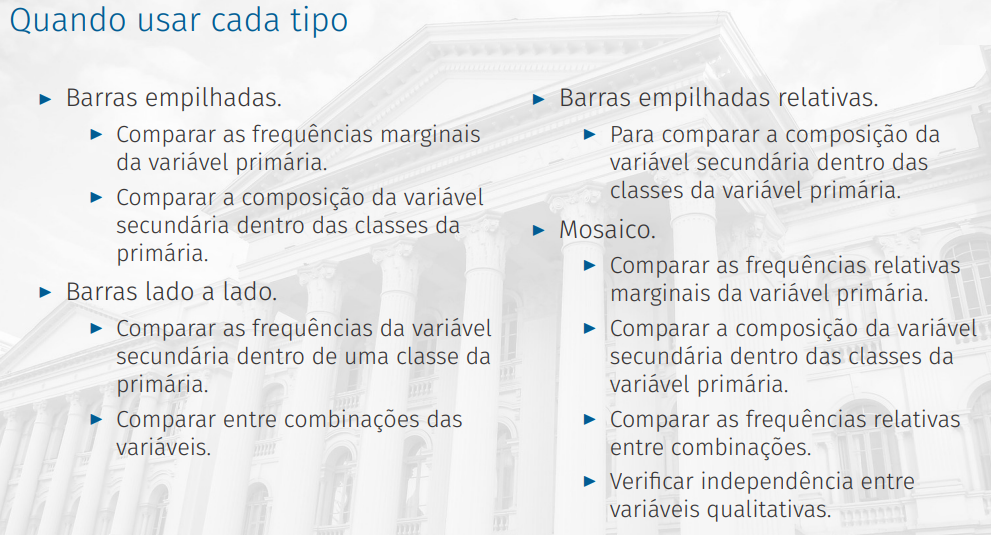  

---

<div id="normal-ordinal-ft"></div>

## TIP: Nominal vs. Ordinal variables in Frequency tables (charts)

Here some tips when use nominal and ordinal variables in Frequency tables (charts):

 - **Nominal:**
   - There is no natural ordering of classes.
   - There is no order for displaying class frequencies.
   - Alphabetical order helps to search by class when there are too many.
   - Sorting by frequency helps to identify predominant and minority classes.
 - **Ordinal:**
   - There is a natural ordering of classes.
   - Try to maintain the order of the classes for a coherent display.
   - When applicable, it can be sorted by frequency.

---

<div id="ft-for-qv"></div>

## Frequency table for quantitative variables (amplitude)

> To create a frequency table for quantitative variables, first we need create group values into classes.

For example, when a variable is quantitative not necessary the values repeat.

> **Even more when the variable is continuous (We measure (medimos) instead counting).**

Knowing this we need group values into classes to create a frequency table. For example, see the image below:

  

**NOTE:**  
Above each **y<sub>n<sub>** represent a class group. See that each group has some values.

For example, let's go count how many values appear in each  class group **y<sub>n<sub>**:

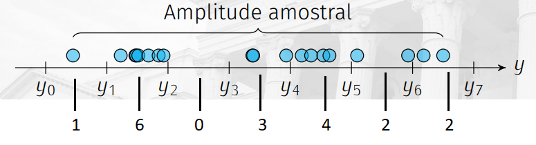  

> **This groups range is what we know as "class amplitude".**

Now, imagine we have the follow table to create a frequency table:

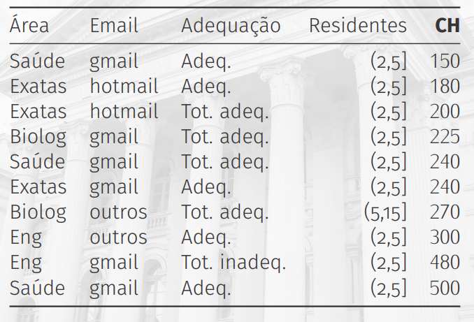  

> **NOTE:**  
> The quantitative variable CH represent the **workload (carga horária)**.

Now, let's create a **class amplitude** to generate a frequency table. However, first, let's go sorting the data:

```python
150   180   200   225   240   240   270   300   480   500
```

Now, some information:

 - **Data numbers:** 10
 - **Less value:** 150
 - **High value:** 500
 - **Amplitude:** 350
   - To calculate the amplitude divide "high value" per "less value".
   - 500 - 150 = 350
 - **Classe amplitude:**
   - Some value to multiply by the "amplitude".

---

<div id="histogram-for-qv"></div>

## Creating a histogram for quantitative variables

> To analyze quantitative variables, one of the most common charts is a **histogram**.

For example, see the **histogram** below for our **CH** quantitative variable:

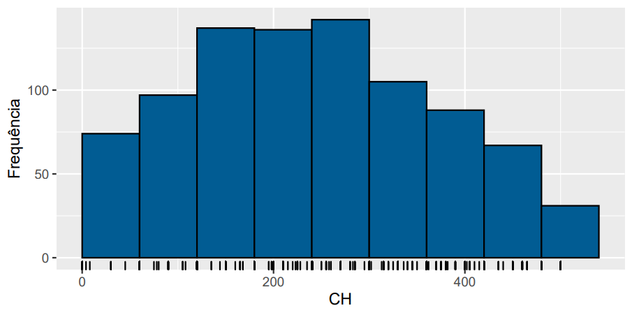  

> **NOTE:**  
> - See that different from **bar chart** the **histogram** has not interval between the bars.
> - That makes sense because quantitative variables have not an interval.
>   - Even more when the variable is continuous (We measure (medimos) instead counting).

**NOTE:**  
However, depend you problem, you can also  make a **histogram** by the interval:

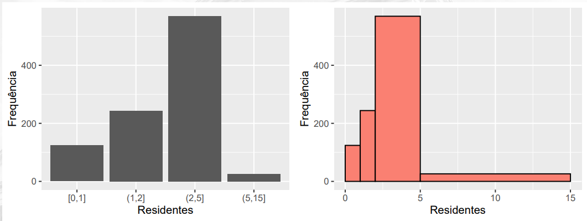

---

<div id=""></div>

## x

x


---

<div id="tip-clas-amplitude"></div>

## TIP: Number of "class amplitude"

How we know **"class amplitude"** are group of values from our quantitative variables. For example:

  

**NOTE:**  
However, the more **"amplitude class"** we have, the more **"noise (ruído)"** our chart will have.

For example, see the examples below:

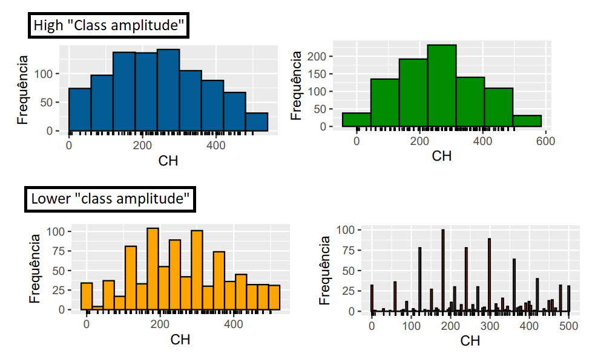  

**NOTE:**  
See that the more **"class amplitude"** we have more hard to analyze the chart.


---

<div id="pop-vs-sample"></div>

## Population vs. Sample

> Before starting with *Sampling Methods*, let's learn what's difference between **Population** and **Sample** in statistics.

Briefly (resumidamente):

 - **Population:**
   - A **population** is a set of sample units *(e.g. people, objects, transactions or events)* that we are interested in studying.
 - **Sample:**
   - A sample is a subset of the sample units of a population.  

See the image below to understand more easily:

  

---

**REFERENCES:**  
[Essential Math for Machine Learning: Python Edition](https://learning.edx.org/course/course-v1:Microsoft+DAT256x+2T2018/home)  
[Stratified Sampling in Pandas (With Examples)](https://www.statology.org/stratified-sampling-pandas/)  
[8 Types of Sampling Techniques](https://towardsdatascience.com/8-types-of-sampling-techniques-b21adcdd2124)  
[ESTATÍSTICA BÁSICA](http://www.leg.ufpr.br/~paulojus/estbas/)

---

Ro**drigo** **L**eite da **S**ilva - **drigols**
