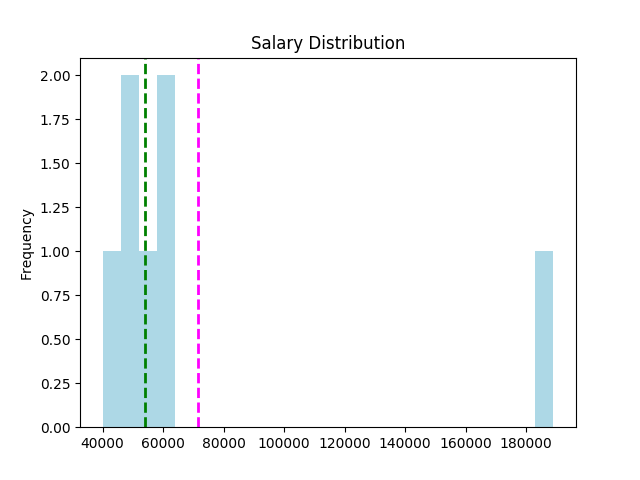
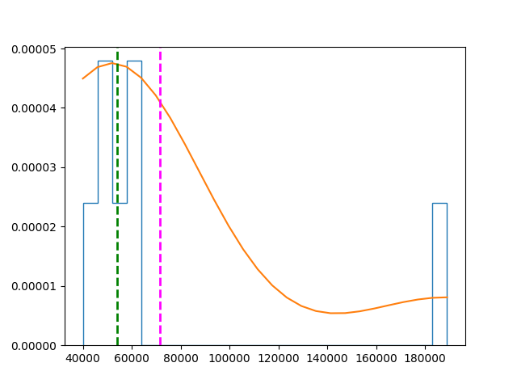
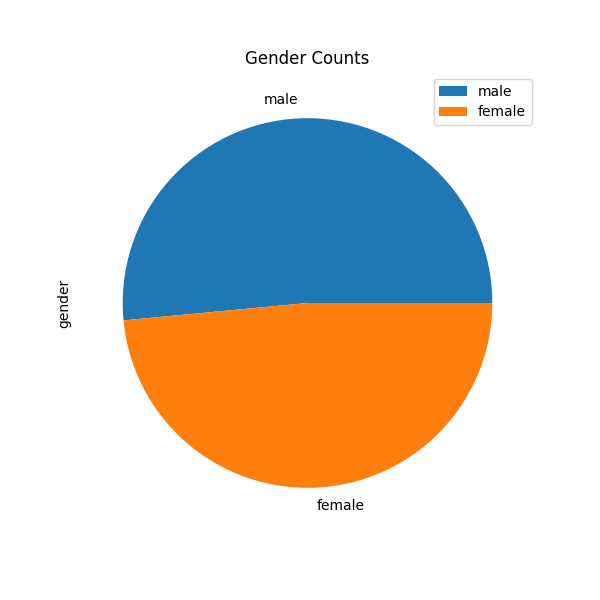

# Distribuição & Densidade de dados

## Conteúdo

 - [01 - Introdução e problema](#01)
 - [02 - Introdução a Distribuição de dados (Min e Max)](#02)
 - [03 - Visualização gráfica de uma distribuição de dados](#03)
 - [04 - Introdução a Densidade (ou linha de densidade) Assimétrica](#04)
 - [05 - Introdução a Densidade (ou linha de densidade) Simétrica](#05)

---

<div id='01'></div>

## 01 - Introdução e problema

Para entender melhor o conceito de **Distribuição & densidade** em um conjunto de dados vamos seguir com o seguinte exemplo...

> Por exemplo, suponha que você decida realizar um estudo sobre os salários comparativos de pessoas que se formaram na mesma escola. Serão esses: 

| Nome     | Salário     |
|----------|-------------|
| Dan      | 50,000      |
| Joann    | 54,000      |
| Pedro    | 50,000      |
| Rosie    | 189,000     |
| Ethan    | 55,000      |
| Vicky    | 40,000      |
| Frederic | 59,000      |

Agora vamos transformar esse nosso exemplo em um **DataFrame Pandas**:

[example.py](src/example.py)
```python
def create_df(**df):
  my_df = {}
  import pandas as pd
  my_df = pd.DataFrame(df)
  return my_df

if __name__ =='__main__':
  students = {
    'Name': ['Dan', 'Joann', 'Pedro', 'Rosie', 'Ethan', 'Vicky', 'Frederic'],
    'Salary':[50000, 54000, 50000, 189000, 55000, 40000, 59000]
  }

  my_df = create_df(**students)
  print(my_df)
```

**OUTPUT:**  

```python
       Name  Salary
0       Dan   50000
1     Joann   54000
2     Pedro   50000
3     Rosie  189000
4     Ethan   55000
5     Vicky   40000
6  Frederic   59000
```

<div id='02'></div>

## 02 - Introdução a Distribuição de dados (Min e Max)

Supondo que vocês já conhecem o mínimo sobre encontrar o **centro (média, mediana e moda)**, podemos começar a explorar como os dados são distribuídos em torno dele *(o centro)*. O que nos interessa aqui é entender a *"forma"* geral da distribuição de dados, de modo que possamos começar a ter uma ideia do que um valor *"típico"* poderia ser esperado.

> Podemos começar por encontrar os extremos - **o mínimo** e **o máximo**.

No caso de nossos dados salariais:

 - **Com menor remuneração de nossa escola é Vicky, com um salário de 40.000;**
 - **O(a) mais bem pago é Rosie, com 189.000.**

A classe pandas.dataframe possui funções **min()** e **max()** para retornar esses valores.

[min_max.py](src/min_max.py)
```python
def create_df(**df):
  my_df = {}
  import pandas as pd
  my_df = pd.DataFrame(df)
  return my_df

if __name__ =='__main__':
  students = {
    'Name': ['Dan', 'Joann', 'Pedro', 'Rosie', 'Ethan', 'Vicky', 'Frederic'],
    'Salary':[50000, 54000, 50000, 189000, 59000, 40000, 59000]
  }

  my_df = create_df(**students)
  print ('Min: ' + str(my_df['Salary'].min())) # Pega o menor salário/elmento da lista.
  print ('Mode: ' + str(my_df['Salary'].mode()[0])) # Encontra a moda (o/os mais frequente(s)).
  print ('Median: ' + str(my_df['Salary'].median())) # Encontra a mediana (median).
  print ('Mean: ' + str(my_df['Salary'].mean())) # Encontra a média (mean)
  print ('Max: ' + str(my_df['Salary'].max())) # Pega o maior salário/elemento da lista.
```

**OUTPUT:**  
```
Min: 40000
Mode: 50000
Median: 54000.0
Mean: 71571.42857142857
Max: 189000
```

Podemos examinar esses valores e ter uma ideia de como os dados são distribuídos. Por exemplo, podemos ver que a média está mais próxima do máximo e que a mediana está mais próximos do mínimo que do máximo.

---

<div id='03'></div>

## 03 - Visualização gráfica de uma distribuição de dados

No entanto, geralmente é mais fácil ter uma noção da distribuição visualizando os dados. Vamos começar criando um histograma dos salários, destacando:

 - A média (mean) de salários;
 - Os salários medianos (median);
 - O min(), max() são bastante evidentes, um do lado esquerdo e o outro do lado direito, respectivamente **(você pode ver isso no eixo "x")**;
 - A moda é onde a barra é mais alta está **(mesmo não desenhado uma linha, mas você pode ver que é onde tem mais dados frequentes)**.

[graph_model-01.py](src/graph_model-01.py)
```python
def create_df(**df):
  my_df = {}
  import pandas as pd
  my_df = pd.DataFrame(df)
  return my_df

if __name__ =='__main__':

  import matplotlib.pyplot as plt

  students = {
    'Name': ['Dan', 'Joann', 'Pedro', 'Rosie', 'Ethan', 'Vicky', 'Frederic'],
    'Salary':[50000, 54000, 50000, 189000, 59000, 40000, 59000]
  }

  my_df = create_df(**students)
  salary = my_df['Salary'] # Pega os salários do DataFrame e salva no objeto "salary".

  # Cria o plot/gráfico.
  salary.plot.hist(title='Salary Distribution', color='lightblue', bins=25) # Cria o Histogram a partir de "salary".
  plt.axvline(salary.mean(), color='magenta', linestyle='dashed', linewidth=2) # Adiciona mean() lane no plot.
  plt.axvline(salary.median(), color='green', linestyle='dashed', linewidth=2) # Adiciona median() lane no plot.
  plt.savefig('../images/plot-02.png', format='png')
  plt.show()
```

**OUTPUT:**  
  

A ***Média (mean)*** e a ***Mediana (median)*** são mostradas como linhas tracejadas. Observe o seguinte:

 - O salário é um valor de dados contínuo - os graduados poderiam potencialmente ganhar qualquer valor ao longo da escala, até mesmo uma fração de centavo;
 - O número de bins no histograma determina o tamanho de cada faixa salarial para a qual estamos contando as freqüências. **Menos bins significam juntar mais salários individuais para serem contados como um grupo**;
 - A maioria dos dados está no lado esquerdo do histograma, refletindo o fato de que a maioria dos formandos ganha entre 4**0.000** e **55.000**;
 - A média (mean) é um valor mais alto que a mediana(median) e a moda(mode);
 - Existem lacunas no histograma das faixas salariais que ninguém ganha.

---

<div id='04'></div>

## 04 - Introdução a Densidade (ou linha de densidade) Assimétrica

O histograma mostra a frequência relativa de cada faixa salarial, com base no número de bins. Também nos dá uma noção da ***densidade*** dos dados para cada ponto da escala salarial.

> Com pontos de dados suficientes e bins pequenas o suficiente, poderíamos ver essa ***densidade*** como uma linha que mostra a forma da distribuição de dados.

[density.py](src/density.py)
```python
def create_df(**df):
  my_df = {}
  import pandas as pd
  my_df = pd.DataFrame(df)
  return my_df


if __name__ =='__main__':

  import matplotlib.pyplot as plt
  import scipy.stats as stats

  students = {
    'Name': ['Dan', 'Joann', 'Pedro', 'Rosie', 'Ethan', 'Vicky', 'Frederic'],
    'Salary':[50000, 54000, 50000, 189000, 59000, 40000, 59000]
  }

  my_df = create_df(**students)
  salary = my_df['Salary'] # Pega os salários do DataFrame e salva no objeto "salary".
  density = stats.gaussian_kde(salary) # Pega a densidade dos salários.

  # Cria o plot/gráfico.
  n, x, _ = plt.hist(salary, histtype='step', density=True, bins=25) # Cria o Histograma.
  plt.plot(x, density(x)*5) # Cria a linha de densidade no plot.
  plt.axvline(salary.mean(), color='magenta', linestyle='dashed', linewidth=2) # Adiciona mean() lane no plot.
  plt.axvline(salary.median(), color='green', linestyle='dashed', linewidth=2) # Adiciona median() lane no plot.
  plt.savefig('../images/density-01.png', format='png')
  plt.show()
```

**OUTPUT:**  
  

Observe que a linha de densidade assume a forma de uma curva assimétrica que tem um *pico* à esquerda e uma cauda longa à direita
 
> Descrevemos esse tipo de distribuição de dados como distorcida; ou seja, os dados não são distribuídos simetricamente, mas sim "agrupados" de um lado.

Nesse caso, os dados são agrupados à esquerda, criando uma cauda longa à direita; e é descrito como sendo inclinado para a direita porque alguns valores altos que ocorrem raramente estão puxando a média para a direita.

Vamos dar uma olhada em outro conjunto de dados. Sabemos quanto dinheiro nossos alunos fazem, mas quantas horas por semana eles precisam trabalhar para ganhar seus salários? Aqui estão os dados:

| Name     | Hours |
|----------|-------|
| Dan      | 41    |
| Joann    | 40    |
| Pedro    | 36    |
| Rosie    | 30    |
| Ethan    | 35    |
| Vicky    | 39    |
| Frederic | 40    |


[density_hours.py](src/density_hours.py)
```python
def create_df(**df):
  my_df = {}
  import pandas as pd
  my_df = pd.DataFrame(df)
  return my_df

if __name__ =='__main__':

  import matplotlib.pyplot as plt
  import scipy.stats as stats

  students = {
    'Name': ['Dan', 'Joann', 'Pedro', 'Rosie', 'Ethan', 'Vicky', 'Frederic'],
    'Hours':[41, 40, 36, 30, 35, 39, 40]
  }

  my_df = create_df(**students)
  hours = my_df['Hours'] # Pega as horas trabalhadas por semana de cada aluno.
  density = stats.gaussian_kde(hours) # Pega a densidade das horas.

  # Cria o plot/gráfico.
  n, x, _ = plt.hist(hours, histtype='step', density=True, bins=25) # Cria o Histograma.
  plt.plot(x, density(x)*7) # Cria a linha de densidade no plot.
  plt.axvline(hours.mean(), color='magenta', linestyle='dashed', linewidth=2) # Adiciona mean() lane no plot.
  plt.axvline(hours.median(), color='green', linestyle='dashed', linewidth=2) # Adiciona median() lane no plot.
  plt.savefig('../images/density-02.png', format='png')
  plt.show()
```

**OUTPUT:**  
  

> Mais uma vez, a distribuição é distorcida, mas desta vez é distorcida a esquerda.

Note que a curva é assimétrica com a ***média (mean)*** à esquerda da ***mediana (median)*** e a moda(mode); e a média de horas de trabalho semanais desviadas para a extremidade inferior.

---

<div id='05'></div>

## 05 - Introdução a Densidade (ou linha de densidade) Simétrica

Mais uma vez, Rosie parece estar recebendo o melhor do negócio. Ela ganha mais do que seus ex-colegas de classe por trabalhar menos horas. Talvez uma olhada nas pontuações do teste que os alunos alcançaram na nota final da escola possa ajudar a explicar seu sucesso:

| Name     | Grade |
|----------|-------|
| Dan      | 50    |
| Joann    | 50    |
| Pedro    | 46    |
| Rosie    | 95    |
| Ethan    | 50    |
| Vicky    | 5     |
| Frederic | 57    |

Vamos dar uma olhada na distribuição dessas notas:

[density_grade.py](src/density_grade.py)
```python
def create_df(**df):
  my_df = {}
  import pandas as pd
  my_df = pd.DataFrame(df)
  return my_df

if __name__ =='__main__':

  import matplotlib.pyplot as plt
  import scipy.stats as stats

  students = {
    'Name': ['Dan', 'Joann', 'Pedro', 'Rosie', 'Ethan', 'Vicky', 'Frederic'],
    'Grade': [50, 50, 46, 95, 50, 5,57]
  }

  my_df = create_df(**students)
  grade = my_df['Grade'] # Pega as notas/grades de todos os alunos.
  density = stats.gaussian_kde(grade) # Pega a densidade das notas.

  # Cria o plot/gráfico.
  n, x, _ = plt.hist(grade, histtype='step', density=True, bins=25) # Cria o Histograma.
  plt.plot(x, density(x)*7.5) # Cria a linha de densidade no plot.
  plt.axvline(grade.mean(), color='magenta', linestyle='dashed', linewidth=2) # Adiciona mean() lane no plot.
  plt.axvline(grade.median(), color='green', linestyle='dashed', linewidth=2) # Adiciona median() lane no plot.
  plt.savefig('../images/density-04.png', format='png')
  plt.show()
```

**OUTPUT:**  
  

> Desta vez, a distribuição é simétrica, formando uma curva ***"em forma de sino"***. A ***média (mean)***, ***mediana (median)*** e moda(mode) estão no mesmo local, e os dados caem uniformemente em ambos os lados de um pico central.

Os estatísticos chamam isso de uma **distribuição normal (ou às vezes uma distribuição gaussiana)**, e ocorre bastante comumente em muitos cenários devido a algo chamado `Teorema do Limite Central`, que reflete a maneira como a probabilidade contínua funciona.

---

**REFERENCES:**  
[Distribuição - Simétrica vs Assimétrica](https://www.youtube.com/watch?v=yhWyPiMi-i4)  
[Distribuição Normal](https://www.youtube.com/watch?v=MoGes4OzsIk)  
[Essential Math for Machine Learning: Python Edition](https://learning.edx.org/course/course-v1:Microsoft+DAT256x+2T2018/home)
