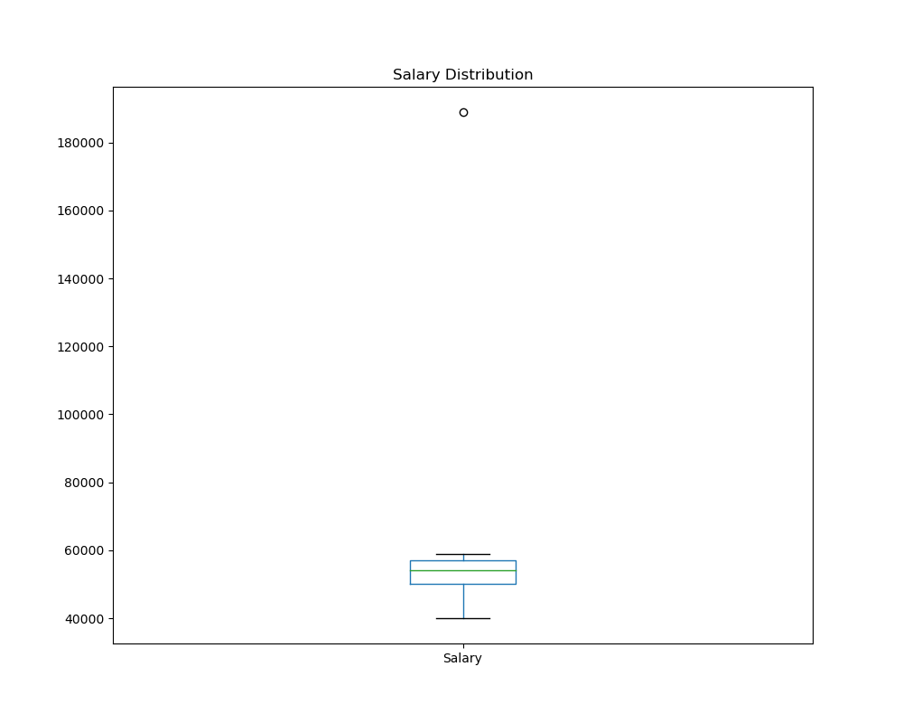
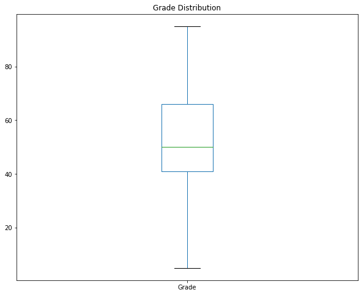

# Medidas de Variação (Intervalo, Percentil, Quartil, Boxplot & Outliers)

## Conteúdo

 - [01 - Introdução e problema](#01)
 - [02 - Intervalo (range)](#02)
   - [02.1 - Calculando intervalos (range) sem importar bibliotecas externas](#02-1)
 - [03 - Percentil](#03)
 - [04 - Quartil](#04)
   - [04.1 - Pegando os 3 Quartils com a função quantile() do Pandas](#04-1)
 - [05 - Analisando Quartils com um Box Plot (gráfico de caixa)](#05)
 - [06 - Analisando "Outliers" com um Box Plot (gráfico de caixa)](#06)

---

<div id='01'></div>

## 01 - Introdução e problema

Para entender melhor o conceito de **Medidas de Variação** em um conjunto de dados vamos seguir com o seguinte exemplo...

> Por exemplo, suponha que você decida realizar um estudo sobre os salários comparativos de pessoas que se formaram na mesma escola. Serão esses: 

| Nome     | Salário     |
|----------|-------------|
| Dan      | 50,000      |
| Joann    | 54,000      |
| Pedro    | 50,000      |
| Rosie    | 189,000     |
| Ethan    | 55,000      |
| Vicky    | 40,000      |
| Frederic | 59,000      |

Agora vamos transformar esse nosso exemplo em um **DataFrame Pandas**:

[example.py](src/example.py)
```python
def create_df(**df):
  my_df = {}
  import pandas as pd
  my_df = pd.DataFrame(df)
  return my_df

if __name__ =='__main__':

  students = {
    'Name': ['Dan', 'Joann', 'Pedro', 'Rosie', 'Ethan', 'Vicky', 'Frederic'],
    'Salary':[50000, 54000, 50000, 189000, 55000, 40000, 59000]
  }

  my_df = create_df(**students)
  print(my_df)
```

**OUTPUT:**  

```python
       Name  Salary
0       Dan   50000
1     Joann   54000
2     Pedro   50000
3     Rosie  189000
4     Ethan   55000
5     Vicky   40000
6  Frederic   59000
```

---

<div id='02'></div>

## 02 - Intervalo (range)

> Uma maneira simples de quantificar a variação em um conjunto de dados é identificar a diferença entre os valores mais baixo e mais alto. Isso é chamado de intervalo e é calculado `subtraindo` o **valor máximo** do **valor mínimo**.

Veja o código a seguir para ver como é simples:

[test_interval.py](src/test_interval.py)
```python
import pandas as pd

df = pd.DataFrame(
  {
  'Name': ['Dan', 'Joann', 'Pedro', 'Rosie', 'Ethan', 'Vicky', 'Frederic'],
  'Salary':[50000, 54000, 50000, 189000, 55000, 40000, 59000],
  'Hours':[41, 40, 36, 30, 35, 39, 40],
  'Grade':[50, 50, 46, 95, 50, 5,57]
  }
)

# Cria uma lista para representar as labels/colunas do DataFrame.
numcols = ['Salary', 'Hours', 'Grade']

# Itera pelo for e para cada label/coluna do DataFrame
# imprime os intervalos(ranges).
for col in numcols:
  print(df[col].name + ' range: ' + str(df[col].max() - df[col].min()))
```

**OUTPUT:**  
```
Salary range: 149000
Hours range: 11
Grade range: 90
```

O ***intervalo (range)*** é fácil de calcular, mas não é uma estatística particularmente útil.

 - Por exemplo, um intervalo(range) de 149.000 entre o salário mais baixo e o mais alto não nos diz qual valor dentro desse intervalo um graduado provavelmente ganhará;  
 - Não nos diz nada sobre como os salários são distribuídos em torno da média dentro desse intervalo;
 - O intervalo (range) nos diz muito pouco sobre a posição comparativa de um valor individual dentro da distribuição.

Por exemplo, Frederic marcou 57 em sua nota final na escola; que é uma boa pontuação (é mais do que todos, menos um de seus colegas); mas isso não é imediatamente aparente a partir de uma pontuação de 57 e alcance de 90.

<div id='02-1'></div>

## 02.1 - Calculando intervalos (range) sem importar bibliotecas externas

Para esse exemplo vamos imaginar que recebemos um conjunto de dados referente a doações e precisamos saber o intervalo (range) dessas doações.

O código vai ser o seguinte:

[my_range.py](src/my_range.py)
```python
def find_range(numbers):
  lowest = min(numbers)
  highest = max(numbers)
  r = highest-lowest
  return lowest, highest, r

if __name__ == '__main__':
  donations = [100, 60, 70, 900, 100, 200, 500, 500, 503, 600, 1000, 1200]    
  lowest, highest, r = find_range(donations)
  print('Menor doação: {0} | Maior doação: {1} | Intervalo(range): {2}'.format(lowest, highest, r))
```

**OUTPUT:**  
```python
Menor doação: 60 | Maior doação: 1200 | Intervalo(range): 1140
```

---

<div id='03'></div>

## 03 - Percentil

> Percentil tem haver com ***posições (ª)*** & ***porcentagem (%)***.

Como Percentil tem have rcom ***porcentagem (%)*** é como se nós dividíssemos a nossa amostra de dados em 100 partes ou em porcentos:

 - 100% dos dados;
 - 50% dos dados;
 - 25% dos dados;
 - 1% dos dados...

Como são descritos esses percentils?

Se eu falar:

 - **10º percentil ->** Eu estou falando dos 10% dos dados (ou da amostra de dados);
 - **20º percentil ->** Eu estou falando dos 20% dos dados (ou da amostra de dados);
 - **2º percentil ->** Eu estou falando dos 2% dos dados (ou da amostra de dados)...

> Veja que nós temos uma *associação* de ***posições (percentilª)*** e ***porcentagem***. 

Vamos examinar a nota de Frederic usando essa abordagem. Sabemos que ele marcou 57, mas como ele está em relação aos seus colegas?

 - Bem, há sete alunos no total;
 - E cinco deles tiveram menos que Frederic.

então podemos calcular o percentil da nota de Frederic assim:  
  
  
  
> Então, a pontuação de Frederic o coloca no 71º percentil de sua classe.

No Python, você pode usar a função **percentileofscore()** do pacote scipy.stats para calcular o percentil de um determinado valor em um conjunto de valores:

[percentileofscore.py](src/percentileofscore.py)
```python
import pandas as pd
from scipy import stats

df = pd.DataFrame(
  {
    'Name': ['Dan', 'Joann', 'Pedro', 'Rosie', 'Ethan', 'Vicky', 'Frederic'],
    'Salary':[50000,54000,50000,189000,55000,40000,59000],
    'Hours':[41,40,36,30,35,39,40],
    'Grade':[50,50,46,95,50,5,57]
  }
)

# função percentileofscore() recebe como argumento:
# - A label/coluna/lista em que vamos trabalhar;
# - A nota do aluno Frederic;
# - Define a função como 'strict' - Ou seja, compara apenas com os valores menores;
# - E retorna a classificação n° percentil do valor/dado/aluno.
print(stats.percentileofscore(df['Grade'], 57, 'strict'))
```

**OUTPUT:**  
```
71.42857142857143
```

Nós usamos a definição estrita (strict) de percentil; mas às vezes é calculado como sendo a porcentagem de valores que são **menores ou iguais** ao **valor que você está comparando**.

> Nesse caso, o cálculo do percentil de Frederic incluiria sua própria pontuação:

  

Você pode calcular dessa meneira no Python apenas definindo a função **percentileofscore()** como **"weak"**:

[weak.py](src/weak.py)
```python
import pandas as pd
from scipy import stats

df = pd.DataFrame(
  {
    'Name': ['Dan', 'Joann', 'Pedro', 'Rosie', 'Ethan', 'Vicky', 'Frederic'],
    'Salary':[50000,54000,50000,189000,55000,40000,59000],
    'Hours':[41,40,36,30,35,39,40],
    'Grade':[50,50,46,95,50,5,57]
  }
)

# A mesma abordagem, porém para valores MENORES ou IGUAIS.
print(stats.percentileofscore(df['Grade'], 57, 'weak'))
```

**OUTPUT:**  
```
85.71428571428571
```

Consideramos o percentil do grau de Frederic e o usamos para classificá-lo em comparação com seus colegas. Então, e sobre Dan, Joann e Ethan? Como eles se comparam ao resto da turma? Eles obtiveram o mesmo grau (50), portanto, de certo modo, eles compartilham um percentil.

Para lidar com esse cenário agrupado, podemos calcular a média das classificações percentuais para as pontuações correspondentes. Tratamos metade das pontuações que correspondem àquelas que classificamos como se estivessem abaixo dela e metade como se estivessem acima dela. Nesse caso, havia três pontuações correspondentes de 50, e para cada uma delas calculamos o percentil como se 1 estivesse abaixo e 1 estivesse acima. Portanto, o cálculo de um percentil para Joann com base em pontuações menores ou iguais a 50 é:

  

O valor de __4__ consiste nas duas pontuações que estão abaixo da pontuação de 50 de Joann, na pontuação de Joann e em metade das pontuações que são as mesmas de Joann (das quais existem duas, portanto, contamos uma).

No Python, a função ***percentileofscore()*** tem uma atributo de classificação **"rank"** que calcula percentis agrupados como este:

[percentil_rank.py](src/percentil_rank.py)
```python
import pandas as pd
from scipy import stats

df = pd.DataFrame(
  {
    'Name': ['Dan', 'Joann', 'Pedro', 'Rosie', 'Ethan', 'Vicky', 'Frederic'],
    'Salary':[50000,54000,50000,189000,55000,40000,59000],
    'Hours':[41,40,36,30,35,39,40],
    'Grade':[50,50,46,95,50,5,57]
  }
)

print(stats.percentileofscore(df['Grade'], 50, 'rank'))
```

**OUTPUT:**  
```
57.14285714285714
```

---

<div id='04'></div>

## 04 - Quartil

Bem, agora vamos aprender como trabalhar com *Quartil* e como os dados são divididos em um *Quartil*.

 - **1ª -** Nós vamos dividir nossos dados em 4 partes (quartil):
   - 25%;
   - 50%;
   - 75%;
   - 100%.
 - **2ª -** Vamos ter um valor **mínimo** e um valor **máximo**:
 - **3ª -** Vamos ter *3 Quartis* predefinido:
   - Q<sub>1</sub> - 25%
   - Q<sub>2</sub> - 50%
   - Q<sub>3</sub> - 75%

Falando assim pode parecer bem difícil de entender, mas veja essa abstração visual para entender como é fácil:

  

**NOTE:**  
Vale salientar que quando estamos trabalhando com Percentil/Quartil os dados vão está *sempre ordenados*, ou seja:

 - O **Primeiro Quartil** / 25%:
   - Representa 25% dos *menores valores* da amostra de dados.
 - O **Segundo Quartil** / 50%:
   - Representa 50% dos *menores valores* da amostra de dados.  
 - O **Terceiro Quartil** / 75%:
   - Representa 75% dos *menores valores* da amostra de dados.
 - O **Quarto Quartil** / 25%:
   - Representa 25% dos *MAIORES VALORES*.

Agora, suponha que nós temos o seguinte conjunto (amostra) de dados:

```python
{13, 25, 69, 72, 33, 41, 28, 17, 65}
```

A primeira coisa que precisamos fazer é *ordenar esse dados*. Porque para trabalhar com Percentils/Quartil primeiro nós devemos ordenar os dados:

```python
{13, 17, 25, 28, 33, 41, 65, 69, 72}
```

Agora que já ordenamos os dados (a nossa amostra) como encontrar esses Quartis?

***2ª Quartil -*** Vamos pegar a mediana de toda nossa amostra de dados que vai representar o **Segundo Quartil**, ou seja, os **50%** da nossa amostra:

```python
{13, 17, 25, 28, >>33<<, 41, 65, 69, 72}
                   |
                   |
                  Q2 (Mediana)
```

***1ª ou 3ª Quartil -*** O **1ª** e **3ª** Quartils são tirados seguindo a mesma abordagem:
 - **1ª Quartil -** *Mediana dos dados que sobraran para o lado esquerdo*;
 - **3ª Quartil -** *Mediana dos dados que sobraram para o lado direito*.

```python
{13, 17, 25, 28, >>33<<, 41, 65, 69, 72}
 --------------    |     --------------
       |           |            |
       |          Q2 (Mediana)  |
       |                        |
       |                        |
       |                        |
Q1 (Mediana)               Q2 (Mediana)
```

Resumindo nós temos os seguintes quartis como resultados:

 - **Q1 =** 21
 - **Q2 =** 33
 - **Q3 =** 67

<div id='04-1'></div>

## 04.1 - Pegando os 3 Quartils com a função quantile() do Pandas

Vamos a outro exemplo agora, porém agora vamos utilizar o Python para nós ajudar. O código a seguir encontra os limites quartil para as horas semanais trabalhadas pelos nossos ex-alunos:

[quantile.py](src/quantile.py)
```python
import pandas as pd

df = pd.DataFrame(
  {
    'Name': ['Dan', 'Joann', 'Pedro', 'Rosie', 'Ethan', 'Vicky', 'Frederic'],
    'Salary':[50000,54000,50000,189000,55000,40000,59000],
    'Hours':[41,40,36,17,35,39,40],
    'Grade':[50,50,46,95,50,5,57]
  }
)

# Passa uma lista com os porcentos % que vão representar cada quartil;
# 0.25 = 25%, 0.5 = 50%, 0.75 = 75%;
# O retorno como nós sabemos vai ser a mediana de cada quartil.
print(df['Hours'].quantile([0.25, 0.5, 0.75]))
```

**OUTPUT:**  
```
0.25    35.5
0.50    39.0
0.75    40.0
Name: Hours, dtype: float64
```

No Python, você pode usar a função ***quantile()*** da classe pandas.dataframe para encontrar os valores limite nos percentis 25, 50 e 75 *(quantile é um termo genérico para uma posição classificada, como um percentil ou quartil)*.

---

<div id='05'></div>

## 05 - Analisando Quartils com um Box Plot (gráfico de caixa)

Geralmente é mais fácil entender como os dados são distribuídos pelos quartis visualizando-os. Você pode usar um histograma, mas muitos cientistas de dados usam um tipo de visualização chamado ***box plot*** *(ou box and whiskers plot)*.

Vamos criar um gráfico de caixa ***(Box Plot)*** para as horas semanais:

[first_boxplot.py](src/first_boxplot.py)
```python
import pandas as pd
from matplotlib import pyplot as plt

df = pd.DataFrame(
  {
    'Name': ['Dan', 'Joann', 'Pedro', 'Rosie', 'Ethan', 'Vicky', 'Frederic'],
    'Salary':[50000, 54000, 50000, 189000, 55000, 40000, 59000],
    'Hours':[41, 40, 36, 30, 35, 39, 40],
    'Grade':[50, 50, 46, 95, 50, 5,57]
  }
)

# Cria um plot/gráfico do tipo (kind) "box" a partir das horas trabalhas dos ex-alunos.
df['Hours'].plot(kind='box', title='Weekly Hours Distribution', figsize=(10, 8))
plt.savefig('../images/first-boxplot-01.png', format='png')
plt.show()
```

**OUTPUT:**  
  

O box plot consiste em:  
  
 - Uma caixa retangular que mostra onde estão os dados entre o 25º e o 75º percentil __(o segundo e o terceiro quartil)__. Essa parte da distribuição é geralmente chamada de intervalo interquartílico - ela contém os 50 valores de dados intermediários.
 - Bigodes que se estendem da caixa até o final do primeiro quartil e o topo do quarto quartil para mostrar toda a gama de dados.
 - Uma linha na caixa que mostra a localização da mediana (o percentil 50, que também é o limite entre o segundo e o terceiro quartil)
  
O resultado vai ser o seguinte:  
  
 - __O valor mínimo__ - 30;
 - __O primeiro quartil__ - 35;
 - __O segundo quartil__ - 39 (mediana)
 - __O terceiro quartil__ - 40
 - __O valor máximo__ - 41
  
Nesse caso, você pode ver que o intervalo interquartílico está entre 35 e 40, com a mediana mais próxima do topo desse intervalo. O intervalo do primeiro quartil é de cerca de 30 a 35, e o quarto quartil é de 40 a 41.

<div id='06'></div>

## 06 - Analisando "Outliers" com um Box Plot (gráfico de caixa)

Vamos dar uma olhada em outro ***Gráfico de Caixa (Box Plot)*** - desta vez mostrando a distribuição dos salários ganhos pelos nossos ex-colegas:

[outliers-v1.py](src/outliers-v1.py)
```python
import pandas as pd
from matplotlib import pyplot as plt

df = pd.DataFrame(
  {
    'Name': ['Dan', 'Joann', 'Pedro', 'Rosie', 'Ethan', 'Vicky', 'Frederic'],
    'Salary':[50000, 54000, 50000, 189000, 55000, 40000, 59000],
    'Hours':[41, 40, 36, 30, 35, 39, 40],
    'Grade':[50, 50, 46, 95, 50, 5,57]
  }
)

# Cria um plot/gráfico do tipo(kind) "box" a partir dos salários dos ex-alunos.
df['Salary'].plot(kind='box', title='Salary Distribution', figsize=(10, 8))
plt.savefig('../images/first-boxplot-02.png', format='png')
plt.show()
```

**OUTPUT:**  
  

Então, o que está acontecendo aqui?

Bem, como já notamos, Rosie ganha muito mais do que seus ex-colegas. Tanto mais que o salário dela foi identificado como um __outlier (quando há valores discrepantes)__.

Um __outlier (quando há valores discrepantes)__ é um valor tão distante do centro da distribuição comparado a outros valores que distorce a distribuição afetando a média. Há vários motivos pelos quais você pode ter valores discrepantes em seus dados, incluindo:

 - Erros de entrada de dados;
 - Falhas em sensores ou equipamentos;
 - Geradores de dados ou valores genuinamente anômalos.

Então, o que devemos fazer sobre isso?
  
Isso realmente depende dos dados e do que você está tentando usar. Neste caso, vamos supor que estamos tentando descobrir o que é uma expectativa razoável de salário para um graduado de nossa escola ganhar. Ignorando por enquanto que temos um conjunto de dados extremamente pequeno sobre o qual basear nosso julgamento, parece que o salário de Rosie poderia ser um erro (talvez ela tenha digitado errado na forma usada para coletar dados) ou uma anomalia genuína (talvez ela se tornou uma atleta profissional ou algum outro trabalho extremamente bem remunerado). De qualquer maneira, não parece representar um salário que um graduado típico possa ganhar.

Vamos ver como é a distribuição dos dados sem o outlier:

[outliers-v2.py](src/outliers-v2.py)
```python
import pandas as pd
from matplotlib import pyplot as plt

df = pd.DataFrame(
  {
    'Name': ['Dan', 'Joann', 'Pedro', 'Rosie', 'Ethan', 'Vicky', 'Frederic'],
    'Salary':[50000, 54000, 50000, 189000, 55000, 40000, 59000],
    'Hours':[41, 40, 36, 17, 35, 39, 40],
    'Grade':[50, 50, 46, 95, 50, 5,57]
  }
)

# Utiliza o atributo showfliers = False - Ou seja, ignora dados discrepantes.
df['Salary'].plot(kind='box', title='Salary Distribution', figsize=(10,8), showfliers=False)
plt.savefig('../images/first-boxplot-03.png', format='png')
plt.show()
```

**OUTPUT:**  
  

Agora parece que há uma distribuição mais equilibrada dos salários. Ainda não é bem simétrico, mas há muito menos variação geral. Há potencialmente alguma causa aqui para desconsiderar os dados salariais de Rosie quando comparamos os salários, já que isso tende a distorcer a análise.

> Então está tudo bem? Podemos simplesmente ignorar um valor de dados que não gostamos?

**NOTE:**  
Mais uma vez, depende do que você está analisando. Vamos dar uma olhada na distribuição das notas finais:

[outliers-v3.py](src/outliers-v3.py)
```python
import pandas as pd
from matplotlib import pyplot as plt

df = pd.DataFrame(
  {
    'Name': ['Dan', 'Joann', 'Pedro', 'Rosie', 'Ethan', 'Vicky', 'Frederic'],
    'Salary':[50000,54000,50000,189000,55000,40000,59000],
    'Hours':[41,40,36,17,35,39,40],
    'Grade':[50,50,46,95,50,5,57]
  }
)

# Cria um plot/gráfico do tipo (kind) "box" para as notas finais dos alunos.
df['Grade'].plot(kind='box', title='Grade Distribution', figsize=(10,8))
plt.savefig('../images/first-boxplot-04.png', format='png')
plt.show()
```

**OUTPUT:**  
  

Mais uma vez, existem __outliers (quando há valores discrepantes)__, __desta vez em ambas as extremidades da distribuição__. No entanto, pense no que esses dados representam. Se assumirmos que a nota para o teste final é baseada em uma pontuação de 100, parece razoável esperar que alguns alunos pontuem muito baixo (talvez até 0) e alguns irão pontuar muito bem (talvez até 100); mas a maioria terá uma pontuação em algum lugar no meio. A razão pela qual as pontuações baixas e altas aqui parecem outliers pode ser apenas porque temos tão poucos pontos de dados.

__NOTE:__  
Vamos ver o que acontece se incluirmos mais alguns alunos em nossos dados:

[outliers-v4.py](src/outliers-v4.py)
```python
import pandas as pd
from matplotlib import pyplot as plt

df = pd.DataFrame(
  {
    'Name': ['Dan', 'Joann', 'Pedro', 'Rosie', 'Ethan', 'Vicky', 'Frederic', 'Jimmie', 'Rhonda', 'Giovanni', 'Francesca', 'Rajab', 'Naiyana', 'Kian', 'Jenny'],
    'Grade':[50, 50, 46, 95, 50, 5,57, 42, 26, 72, 78, 60, 40, 17, 85]
  }
)

# Cria um plot/gráfico do tipo (kind) "box" para as notas finais dos alunos.
df['Grade'].plot(kind='box', title='Grade Distribution', figsize=(10,8))
plt.savefig('../images/first-boxplot-05.png', format='png')
plt.show()
```

**OUTPUT:**  
  

Com mais dados, existem algumas pontuações mais altas e baixas; então, não consideramos mais os casos isolados como outliers.

**NOTE:**  
O ponto-chave a ser levado em consideração é que você realmente precisa entender os dados e o que está tentando fazer com eles, e precisa garantir que tenha um tamanho razoável de amostra antes de determinar o que fazer com os valores discrepantes.

---

**REFERENCES:**  
[Essential Math for Machine Learning: Python Edition](https://learning.edx.org/course/course-v1:Microsoft+DAT256x+2T2018/home)
