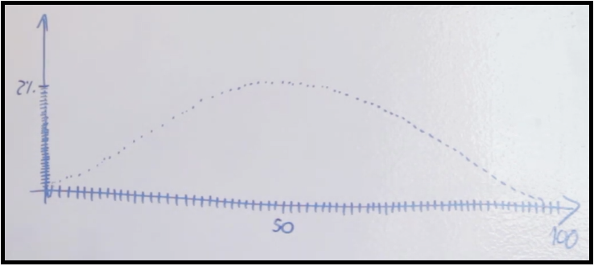

# Distribuição Normal (De onde vem e Para que serve)

## Conteúdo

 - [01 - Introdução e Probabilidade de acerta arremessos de basquete](#01)
   - [01.1 - Evento discreto](#01-1)

---

## 01 - Introdução e Probabilidade de acerta arremessos de basquete

Agora nós vamos aprender o básico sobre **Distribuição Normal** também conhecida como **Distribuição Gaussiana** ou ainda **Curva Gaussiana**.Todos esses termos representam a mesma coisa.

Vamos imaginar que um jogador de Basquete fez 10 arremessos para acertar a cesta de basquete.

> **Qual a probabilidade dele acertar *1 arremesso*, *2 arremessos* ou até mesmo os *10 arremessos*?**

Suponha (é só um exemplo) que nós temos o seguinte gráfico que representar essa probabilidade:

  

**NOTE:**  
Seguindo a lógica do gráfico (barras/histograma) acima nós temos que entre os 10 arremessos as probabilidades de acerta de 1 a 10 arremessos são às seguintes:

 - A probabilidade de nós acertamos apenas 1 arremesso é de 5%;
 - A probabilidade de nós acertamos 2 arremessos é de 8%;
 - A probabilidade de nós acertamos 3 arremessos é de 12%;
 - A probabilidade de nós acertamos 4 arremessos é de 15%;
 - A probabilidade de nós acertamos 5 arremessos é de 20%:
   - **Essa é a maior probabilidade de todas: Acertar 5 arremessos de 10 = 20%**
 - A probabilidade de nós acertamos 6 arremessos é de 15%;
 - A probabilidade de nós acertamos 7 arremessos é de 12%;
 - A probabilidade de nós acertamos 8 arremessos é de 8%;
 - A probabilidade de nós acertamos 9 arremessos é de 5%;
 - A probabilidade de nós acertamos 10 arremesso é de 3% *(mais ou menos)*;

## 01.1 - Evento discreto

A primeira coisa que você tem que ter em mente é que esse tipo de vento que nós estamos imaginando (arremessos de basquete) é um **evento discreto**. Ou seja, não tem números intermediários entre um e outro. Por exemplo, não tem como arremessar uma bola e meia ou duas bolas e meia, vai ser sempre um número natural inteiro.

??

Agora imagine que o mesmo jogador agora está treinando para uma final de basquete e fez **100 arremessos** que nos resultou no seguinte gráfico *(é só um exemplo)*:

  

Veja que nós agora temos vários pontos que representam vários arremessos de **1** a **100**. Veja também que agora o meu ponto máximo de acertos *(50)* é de **2%**. O motivo disso é que agora eu tenho muito mais arremessos *(amostras)*.

Uma observação muito importante é que quanto mais arremessos *(amostras)* o jogador fizer menor vai ser a probabilidade do ponto máximo. Isso, porque o eixo-y vai diminuindo se fomos aumentando o número de arremessos *(amostras)*. *Ou seja, a curva vai ficar cada vez mais baixa*.

**NOTE:**  
Outra observação ainda mais importante é que quanto maior o número de arremessos *(amostras)*, mais difícil vai ser de certa um número certinho. Por exemplo, acertar **500** arremessos de **1000**.

---

**REFERÊNCIAS:**  
[Entenda a essência da Distribuição Normal (de onde vem, para que serve)](https://www.youtube.com/watch?v=OtDgQuDBgGk)
