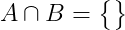
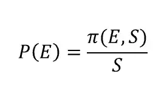
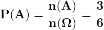
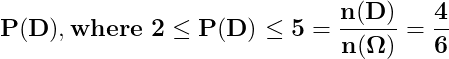

# Probability (English notes)

## Contents

 - Phenomenon types in Probability:
   - [Deterministic Phenomenon](#deterministicf)
   - [Random Phenomenon](#randomf)
 - [Sample Space (Espaço Amostral)](#sample-space)
 - [Sample Points (Pontos Amostral)](#sample-point)
 - [Events](#events)
 - [Operations with Events](#op-events)
   - [Empty Set](#empty-set)
   - [Union](#union-set)
   - [Intersection](#intersection-set)
   - [Disjoint (Mutually Exclusive)](#disjoint)
   - [Complement of Sets](#complement-set)
   - [Example: Operations with Events (toss a dice)](#ex-event)
 - [Probability Axioms (definition)](#probability-axioms)
 - [Approaches of Probability](#approaches-probability)
   - [Classical approach](#classicala)
   - [Frequency-based (or empirical) approach](#frequencya)
   - [Subjective approach](#subjectivea)
   - [Example: Tossing a dice](#paex-tossing-dice)
 - [Addition Rule in Probability](#addition-rule)

---

<div id="deterministicf"></div>

## Deterministic Phenomenon

We say that a **Phenomenon (experiment) is deterministic** when repeated many times on same (or similar) condition, leads an outcome (result) essentially identical.

For example:

 - Gravity acceleration.
 - Some physical (classical mechanics) or chemistry laws.

> **In general, are things that you repeat under (sob) the same condition, generate always the same results.**

---

<div id="randomf"></div>

## Random Phenomenon

The **phenomenon (experiment)** obtained under (sob) the same condition that generates different outcomes are called **Random Phenomenon (experiment)**.

For example:

 - toss a dice (or similar).
 - Sportive event results.
 - Climatic conditions for the next Sunday.

---

<div id="sample-space"></div>

## Sample Space (Espaço Amostral)

The **sample space** is:

> **A set of all possible outcomes (results) of a *Random  Experiment*.**

**SAMPLE SPACE NOTATION:**  
To denote the sample space we'll use the **omega (Ω)** Greek letter.

**NOTE:**  
This sample space can contain a **finite** or **infinite** number of sample points.

Examples of **sample space** are:

 - **Flip (toss) a coin:**
   - *Sample space:* {heads, tails}
 - **Toss a dice:**
   - *Sample space:* {1, 2, 3, 4, 5, 6}

**NOTE:**  
See that we have the set of all possible outcomes (results) to each sample space.

---

<div id="sample-point"></div>

## Sample Points (Pontos Amostral)

> The elements that compose a *sample space (Ω*) are called **Sample Points**.

**SAMPLE POINTS NOTATION:**  
To denote a single sample point we use lowercase Greek letter **Omega (ω)**.

For example:

 - **Flip (toss) a coin:**
   - **Sample space:**
     - {heads, tails}
   - **Sample points:**
     - ω<sub>1</sub> = heads, ω<sub>2</sub> = tails

**NOTE:**  
For example, when analyzing a chart with all  experiment samples *(sample space Ω)*, a *sample point (ω)* could be a single point on the chart.

---

<div id="events"></div>

## Events

> All outcome or subset of outcomes from a Random Experiment is an **Event**.

**EVENT NOTATION:**  
To denote Events from a sample space (Ω) we use upper letters: **A**, **B**, **C**,...., **Z**.

Some Events examples can be:

 - **Flip (toss) a coin:**
   - **Sample space:** {heads, tails}
   - **Sample points:** ω<sub>1</sub> = heads, ω<sub>2</sub> = tails
   - **Event:** A = "Heads face", B = "Tails face".
 - **Toss a dice:**
   - **Sample space:** {1, 2, 3, 4, 5, 6}
   - **Sample points:** ω<sub>1</sub> = 1, ω<sub>2</sub> = 2, ω<sub>3</sub> = 3, ω<sub>4</sub> = 4, ω<sub>5</sub> = 5, ω<sub>6</sub> = 6.
   - **Event:** A = "Even", B = "Odd" 

---

<div id="op-events"></div>

## Operations with Events

We use the **Set Theory** to define operations with Events.

---

<div id="empty-set"></div>

## Empty Set

> It is the set without elements, denoted by **0 (zero)**.


---

<div id="union-set"></div>

## Union

> It is the Event that consists of the **Union of all the sample points** of the events that compose it.

We call the *Union* of event **A** with event **B** by **AUB**:

  
  

**NOTE:**  
See that by definition a **sample point (ω)** can:

 - Belongs (pertencer) to Event **A**.
 - Belongs (pertencer) to Event **B**.
 - Or can belongs under (ao) Events **A** and **B** simultaneously.

---

<div id="intersection-set"></div>

## Intersection

> It is the Event composed of the sample points common to the Events that compose it.


**NOTE:**  
See that different of the Union, the intersection is composed of all common sample points in all Events.

> **NOTE:**  
> That is, the sample points that appear simultaneously in Events **A** and **B**.

---

<div id="disjoint"></div>

## Disjoint (Mutually Exclusive)

Are **Events** that have **null Intersection**, that is:




> **Wikipedia Definition:**  
> In logic and probability theory, two events (or propositions) are **mutually exclusive** or **disjoint** if they cannot both occur at the same time.
> - A clear example is the set of outcomes of a single coin toss, which can result in either heads or tails, but not both.

---

<div id="complement-set"></div>

## Complement of Sets

**Complement of a set A (Event A)**, denoted by **A<sup>c</sup>**, is the set of all elements that:

 - Belongs (pertencem) to sample space.
 - But does not belong (pertencem) to set A (Event A).

 

**NOTE:**  
That is, they are part of the sample space, but do not belong to Event A.

---

<div id="ex-event"></div>

## Example: Operations with Events (toss a dice)

Consider the experiment of toss a dice and the Events are:

 - A = {1, 2, 3, 4}
 - B = {ω : ω <=3}
 - C = "Even face"
 - D = "Prime face"

Now we have to solve the follows operations with Events:

 - **UNION:**
   - **AUB =** {1, 2, 3, 4} *or* {1, 2, 3} = {1, 2, 3, 4}
   - **AUC =** {1, 2, 3, 4} *or* {2, 4, 6} = {1, 2, 3, 4, 6}
   - **AUD =** {1, 2, 3, 4} *or* {2, 3, 5} = {1, 2, 3, 4, 5}
 - **INTERSECTION:**
   - **A∩B =** {1, 2, 3, 4} *and* {1, 2, 3} = {1, 2, 3}
   - **A∩C =** {1, 2, 3, 4} *and* {2, 4, 6} = {2, 4}
   - **A∩D =** {1, 2, 3, 4} *and* {2, 3, 5} = {2, 3}
 - **COMPLEMENT OF SETS:**
   - **A<sup>c</sup> =** {5, 6}
   - **B<sup>c</sup> =** {ω : ω > 3}
   - **C<sup>c</sup> =** {1, 3, 5}
   - **D<sup>c</sup> =** Knowing that D = {2, 3, 5}, then D<sup>c</sup> = {1, 4, 6}

---

<div id="probability-axioms"></div>

## Probability Axioms (definition)

> **Probability is a function P()** that **attributes numerical values to Events of the sample space (Ω)** follow some rules.

**NOTE:**  
Knowing that a probability function **P()** attributes numerical values to Events of the *sample space (Ω)* and this function need follow some axiomatical rules, let's see which are these rules.

 - **FIRST AXIOM: 0 <= P(A) <= 1, ∀A ∈ Ω:**
   - The first axiom tells us that given a function **P()** that receives an **Event "A"**, the value (probability) to this Event must be:
     - Higher or equal zero:
       - 0 <= P(A)
     - Less or equal one:
       - P(A) <= 1 
   - To all Event (∀) "A" that belongs under sample space (Ω):
     - ∀A ∈ Ω
 - **SECONT AXIOM: P(Ω) = 1:**
   - The second axiom tells us that the probability to happen (acontecer) *omega (Ω)* is 1.
   - That is, Some Event inside sample (Ω) space will happen (vai acontecer).

---

<div id="approaches-probability"></div>

## Approaches of Probability

Now, the ask is:

> **How to attributes probability to the elements of the sample space (Ω)?**

The most common approaches are:

 - Classical approach
 - Frequency-based (or empirical) approach
 - Subjective approach

---

<div id="classicala"></div>

## Classical approach

This approach traces back to the field where probability was first sistematically employed, which is gambling *(flipping coins, tossing dice and so forth)*. Gambling problems are characterized by *random experiments* which have **"n"** possible outcomes, equally likely to occur.

 - It means that none of them is more or less likely to occur than other ones, hence they are said to be in a **symmetrical** position.
 - The idea of the classical approach is that, given a collection of **k** elements out of **"n"** (where 0 ≤ k ≤n), the probability of occurrence of the event **E** represented by that collection is equal to:

For example, imagine you toss a dice, the **sample space (Ω)** are:

```
(Ω) = {1, 2, 3, 4, 5, 6}
```

 - Assume that the dice is honesty (not addicted/não viciado) we can say that:
   - **P(1) = P(2) = P(3) = ... = P(6) = 1/6** 
 - That is, all dice sides have the same probability to occur:
   - **1/6**

---

<div id="frequencya"></div>

## Frequency-based (or empirical) approach

Imagine you did a Random Experiment **"n"** times and count how many times the **Event A** occur, **n(A)**.

Thus, the **relative frequency** of **Event A** in **"n"** repeats are:


**NOTE:**  
See that here we have a **relative frequency-based** approach not classical approach.

However, when we do this experiment the big number of times, for example, when **"n"** tends to *infinity (∞)*, our **Event A** will tend a constant probability:

  

For example, imagine we tossed a dice to the very big value from **"n"** and count how many times the side 4 (Event A) occurred... Now, imagine that the outcomes generates the following relative frequency graph of **Event A** (that is, the side 4):

  

See that:

 - **The greater the number (n) of experiments:**
   - Less the variability, staying close to constant (ficando perto de constante).
 - **The lower the number (n) of experiments:**
   - Greater the variability.
 - **The red line means the probability: 1/6**

---

<div id="subjectivea"></div>

## Subjective approach

Developed by **probabilist B. de Finetti**, this is the most intuitive definition of probability. Indeed, according to that approach, the probability of an event is the degree of belief a person attaches to that event, based on his/her available information. This reasoning holds only under the assumption of rationality, which assumes that people act coherently.

Let’s provide a more specific definition. Imagine a lottery where you can win an amount of money equal to S if event E occurs. To participate, you have to buy one ticket. Now, which is the price you would be willing to pay to participate in the lottery? If you indicate that price as π(E, S), the probability of event E is given by:

  

Imagine you want to predict the probability that your favorite football team will win the match tomorrow. You have the possibility to participate in a lottery where, if the team wins, you obtain a prize of 1000€, otherwise you gain nothing. Which is the price you would be willing to pay to participate? Let’s say you are very confident about your team capabilities and you are willing to pay 700€. Hence, the probability your team wins the match tomorrow is:


This last approach does not count serious criticisms, since it resolves some pitfalls of the previous approaches (like the impossibility of repeating experiments under equivalent conditions, because of the uniqueness of many events) and, at the same time, does not contrast with other theories. Indeed, the evaluator who has to decide the price of the lottery is not prevented from running experiments, compute the frequency of successes and use this information to propose a price.

Basically, what in other approaches was a rule, in the subjective approach is an option.

---

<div id="paex-tossing-dice"></div>

## Example: Tossing a dice

Consider tossing a dice (honest), the **sample space (Ω)** is:

```
(Ω) = {1, 2, 3, 4, 5, 6}
```

What probability of Event **A = "Side even"**?

  

What probability of Event **B = "Side greater than 4"**?

  

What probability of Event **C = "Greater than 2 and less than 5"**

  

What probability of Event **D = "Greater than or equal to 2 and less than or equal to 5"**

  

---

<div id="addition-rule"></div>

## Addition Rule in Probability

The probability of the **union** between any two events, **A** and **B**, is given by the **Addition Rule in Probability**:


**NOTE:**  
See also that the addition rule can be simplified **if and only if (⟺)** events **A** and **B** are **disjoint (or mutually exclusive)**:


---

<div id=""></div>

## x

x


---

<div id=""></div>

## x

x


---

<div id=""></div>

## x

x


---

<div id=""></div>

## x

x


---

<div id=""></div>

## x

x


---

<div id=""></div>

## x

x


---

<div id=""></div>

## x

x


---

<div id=""></div>

## x

x


---

<div id=""></div>

## x

x


---

<div id=""></div>

## x

x


---

<div id=""></div>

## x

x


---

<div id=""></div>

## x

x


---

<div id=""></div>

## x

x


---

<div id=""></div>

## x

x


---

<div id=""></div>

## x

x


---

<div id=""></div>

## x

x


---

<div id=""></div>

## x

x


---

<div id=""></div>

## x

x


---

**REFERENCES:**  
[ESTATÍSTICA BÁSICA (DEST/UFPR)](http://www.leg.ufpr.br/~paulojus/estbas/)

---

Ro**drigo** **L**eite da **S**ilva - **drigols**
