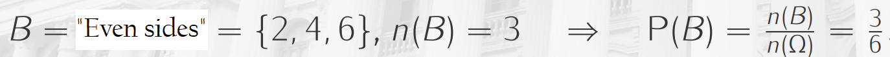
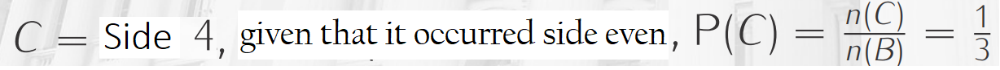
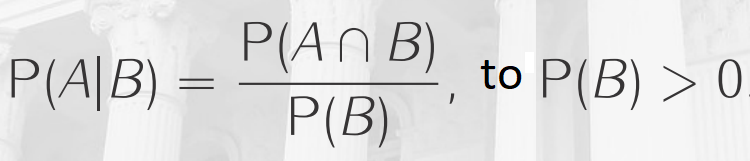

# Probability (ENG/+PT-BR)

## Contents

 - **PART I (ENG notes):**
   - **Phenomenon types in Probability:**
     - [Deterministic Phenomenon](#deterministicf)
     - [Random Phenomenon](#randomf)
   - [Sample Space (Espaço Amostral)](#sample-space)
   - [Sample Points (Pontos Amostral)](#sample-point)
   - [Events](#events)
   - [Operations with Events](#op-events)
     - [Empty Set](#empty-set)
     - [Union](#union-set)
     - [Intersection](#intersection-set)
     - [Disjoint (Mutually Exclusive)](#disjoint)
     - [Complement of Sets](#complement-set)
     - [Example: Operations with Events (toss a dice)](#ex-event)
   - [Probability Axioms (definition)](#probability-axioms)
   - [Approaches of Probability](#approaches-probability)
     - [Classical approach](#classicala)
     - [Frequency-based (or empirical) approach](#frequencya)
     - [Subjective approach](#subjectivea)
     - [Example: Tossing a dice](#paex-tossing-dice)
   - [Addition Rule in Probability](#addition-rule)
   - **Conditional Probability:**
     - [Intro to Conditional Probability](#intro-cp)
     - [Conditional Probability (definition)](#conditional-probability-def)
 - **PART II (PT-BR notes):**
   - **[01 - Noções básicas de probabilidade:](#01)**
      - [01.1 - Experimento ou Test - (experiment or trial)](#01-1)
      - [01.2 - Espaço amostral - (sample space)](#01-2)
      - [01.3 - Ponto de amostra - (sample point)](#01-3)
      - [01.4 - Evento - (Event)](#01-4)
      - [01.5 - Probabilidade de um evento](#01-5)
    - **[02 - Notação de Probabilidade](#02)**
    - **[03 - O complemento de um evento](#03)**
    - **[04 - Bias - (Viés)](#04)**
    - **[05 - Probabilidade Condicional e Dependência:](#05)**
      - [05.1 - Eventos Independentes](#05-1)
        - [05.1.1 - Combinando eventos independentes](#05-1-1)
        - [05.1.2 - Árvores de probabilidade](#05-1-2)
        - [05.1.3 - Notação de probabilidade de eventos combinados](#05-1-3)
        - [05.1.4 - Combinando eventos com diferentes probabilidades](#05-1-4)
        - [05.1.5 - Intersecções e Uniões](#05-1-5)
      - [05.2 - Eventos Dependentes](#05-2)
        - [05.2.1 - Calculando probabilidades para eventos dependentes](#05-2-1)
      - [5.3 - Eventos mutuamente exclusivos](#05-3)

---

<div id="deterministicf"></div>

## Deterministic Phenomenon

We say that a **Phenomenon (experiment) is deterministic** when repeated many times on same (or similar) condition, leads an outcome (result) essentially identical.

For example:

 - Gravity acceleration.
 - Some physical (classical mechanics) or chemistry laws.

> **In general, are things that you repeat under (sob) the same condition, generate always the same results.**

---

<div id="randomf"></div>

## Random Phenomenon

The **phenomenon (experiment)** obtained under (sob) the same condition that generates different outcomes are called **Random Phenomenon (experiment)**.

For example:

 - toss a dice (or similar).
 - Sportive event results.
 - Climatic conditions for the next Sunday.

---

<div id="sample-space"></div>

## Sample Space (Espaço Amostral)

The **sample space** is:

> **A set of all possible outcomes (results) of a *Random  Experiment*.**

**SAMPLE SPACE NOTATION:**  
To denote the sample space we'll use the **omega (Ω)** Greek letter.

**NOTE:**  
This sample space can contain a **finite** or **infinite** number of sample points.

Examples of **sample space** are:

 - **Flip (toss) a coin:**
   - *Sample space:* {heads, tails}
 - **Toss a dice:**
   - *Sample space:* {1, 2, 3, 4, 5, 6}

**NOTE:**  
See that we have the set of all possible outcomes (results) to each sample space.

---

<div id="sample-point"></div>

## Sample Points (Pontos Amostral)

> The elements that compose a *sample space (Ω*) are called **Sample Points**.

**SAMPLE POINTS NOTATION:**  
To denote a single sample point we use lowercase Greek letter **Omega (ω)**.

For example:

 - **Flip (toss) a coin:**
   - **Sample space:**
     - {heads, tails}
   - **Sample points:**
     - ω<sub>1</sub> = heads, ω<sub>2</sub> = tails

**NOTE:**  
For example, when analyzing a chart with all  experiment samples *(sample space Ω)*, a *sample point (ω)* could be a single point on the chart.

---

<div id="events"></div>

## Events

> All outcome or subset of outcomes from a Random Experiment is an **Event**.

**EVENT NOTATION:**  
To denote Events from a sample space (Ω) we use upper letters: **A**, **B**, **C**,...., **Z**.

Some Events examples can be:

 - **Flip (toss) a coin:**
   - **Sample space:** {heads, tails}
   - **Sample points:** ω<sub>1</sub> = heads, ω<sub>2</sub> = tails
   - **Event:** A = "Heads face", B = "Tails face".
 - **Toss a dice:**
   - **Sample space:** {1, 2, 3, 4, 5, 6}
   - **Sample points:** ω<sub>1</sub> = 1, ω<sub>2</sub> = 2, ω<sub>3</sub> = 3, ω<sub>4</sub> = 4, ω<sub>5</sub> = 5, ω<sub>6</sub> = 6.
   - **Event:** A = "Even", B = "Odd" 

---

<div id="op-events"></div>

## Operations with Events

We use the **Set Theory** to define operations with Events.

---

<div id="empty-set"></div>

## Empty Set

> It is the set without elements, denoted by **0 (zero)**.


---

<div id="union-set"></div>

## Union

> It is the Event that consists of the **Union of all the sample points** of the events that compose it.

We call the *Union* of event **A** with event **B** by **AUB**:

  
  

**NOTE:**  
See that by definition a **sample point (ω)** can:

 - Belongs (pertencer) to Event **A**.
 - Belongs (pertencer) to Event **B**.
 - Or can belongs under (ao) Events **A** and **B** simultaneously.

---

<div id="intersection-set"></div>

## Intersection

> It is the Event composed of the sample points common to the Events that compose it.


**NOTE:**  
See that different of the Union, the intersection is composed of all common sample points in all Events.

> **NOTE:**  
> That is, the sample points that appear simultaneously in Events **A** and **B**.

---

<div id="disjoint"></div>

## Disjoint (Mutually Exclusive)

Are **Events** that have **null Intersection**, that is:


> **Wikipedia Definition:**  
> In logic and probability theory, two events (or propositions) are **mutually exclusive** or **disjoint** if they cannot both occur at the same time.
> - A clear example is the set of outcomes of a single coin toss, which can result in either heads or tails, but not both.

---

<div id="complement-set"></div>

## Complement of Sets

**Complement of a set A (Event A)**, denoted by **A<sup>c</sup>**, is the set of all elements that:

 - Belongs (pertencem) to sample space.
 - But does not belong (pertencem) to set A (Event A).

 

**NOTE:**  
That is, they are part of the sample space, but do not belong to Event A.

---

<div id="ex-event"></div>

## Example: Operations with Events (toss a dice)

Consider the experiment of toss a dice and the Events are:

 - A = {1, 2, 3, 4}
 - B = {ω : ω <=3}
 - C = "Even face"
 - D = "Prime face"

Now we have to solve the follows operations with Events:

 - **UNION:**
   - **AUB =** {1, 2, 3, 4} *or* {1, 2, 3} = {1, 2, 3, 4}
   - **AUC =** {1, 2, 3, 4} *or* {2, 4, 6} = {1, 2, 3, 4, 6}
   - **AUD =** {1, 2, 3, 4} *or* {2, 3, 5} = {1, 2, 3, 4, 5}
 - **INTERSECTION:**
   - **A∩B =** {1, 2, 3, 4} *and* {1, 2, 3} = {1, 2, 3}
   - **A∩C =** {1, 2, 3, 4} *and* {2, 4, 6} = {2, 4}
   - **A∩D =** {1, 2, 3, 4} *and* {2, 3, 5} = {2, 3}
 - **COMPLEMENT OF SETS:**
   - **A<sup>c</sup> =** {5, 6}
   - **B<sup>c</sup> =** {ω : ω > 3}
   - **C<sup>c</sup> =** {1, 3, 5}
   - **D<sup>c</sup> =** Knowing that D = {2, 3, 5}, then D<sup>c</sup> = {1, 4, 6}

---

<div id="probability-axioms"></div>

## Probability Axioms (definition)

> **Probability is a function P()** that **attributes numerical values to Events of the sample space (Ω)** follow some rules.

**NOTE:**  
Knowing that a probability function **P()** attributes numerical values to Events of the *sample space (Ω)* and this function need follow some axiomatical rules, let's see which are these rules.

 - **FIRST AXIOM: 0 <= P(A) <= 1, ∀A ∈ Ω:**
   - The first axiom tells us that given a function **P()** that receives an **Event "A"**, the value (probability) to this Event must be:
     - Higher or equal zero:
       - 0 <= P(A)
     - Less or equal one:
       - P(A) <= 1 
   - To all Event (∀) "A" that belongs under sample space (Ω):
     - ∀A ∈ Ω
 - **SECONT AXIOM: P(Ω) = 1:**
   - The second axiom tells us that the probability to happen (acontecer) *omega (Ω)* is 1.
   - That is, Some Event inside sample (Ω) space will happen (vai acontecer).

---

<div id="approaches-probability"></div>

## Approaches of Probability

Now, the ask is:

> **How to attributes probability to the elements of the sample space (Ω)?**

The most common approaches are:

 - Classical approach
 - Frequency-based (or empirical) approach
 - Subjective approach

---

<div id="classicala"></div>

## Classical approach

This approach traces back to the field where probability was first sistematically employed, which is gambling *(flipping coins, tossing dice and so forth)*. Gambling problems are characterized by *random experiments* which have **"n"** possible outcomes, equally likely to occur.

 - It means that none of them is more or less likely to occur than other ones, hence they are said to be in a **symmetrical** position.
 - The idea of the classical approach is that, given a collection of **k** elements out of **"n"** (where 0 ≤ k ≤n), the probability of occurrence of the event **E** represented by that collection is equal to:

For example, imagine you toss a dice, the **sample space (Ω)** are:

```
(Ω) = {1, 2, 3, 4, 5, 6}
```

 - Assume that the dice is honesty (not addicted/não viciado) we can say that:
   - **P(1) = P(2) = P(3) = ... = P(6) = 1/6** 
 - That is, all dice sides have the same probability to occur:
   - **1/6**

---

<div id="frequencya"></div>

## Frequency-based (or empirical) approach

Imagine you did a Random Experiment **"n"** times and count how many times the **Event A** occur, **n(A)**.

Thus, the **relative frequency** of **Event A** in **"n"** repeats are:


**NOTE:**  
See that here we have a **relative frequency-based** approach not classical approach.

However, when we do this experiment the big number of times, for example, when **"n"** tends to *infinity (∞)*, our **Event A** will tend a constant probability:

  

For example, imagine we tossed a dice to the very big value from **"n"** and count how many times the side 4 (Event A) occurred... Now, imagine that the outcomes generates the following relative frequency graph of **Event A** (that is, the side 4):

  

See that:

 - **The greater the number (n) of experiments:**
   - Less the variability, staying close to constant (ficando perto de constante).
 - **The lower the number (n) of experiments:**
   - Greater the variability.
 - **The red line means the probability: 1/6**

---

<div id="subjectivea"></div>

## Subjective approach

Developed by **probabilist B. de Finetti**, this is the most intuitive definition of probability. Indeed, according to that approach, the probability of an event is the degree of belief a person attaches to that event, based on his/her available information. This reasoning holds only under the assumption of rationality, which assumes that people act coherently.

Let’s provide a more specific definition. Imagine a lottery where you can win an amount of money equal to S if event E occurs. To participate, you have to buy one ticket. Now, which is the price you would be willing to pay to participate in the lottery? If you indicate that price as π(E, S), the probability of event E is given by:

  

Imagine you want to predict the probability that your favorite football team will win the match tomorrow. You have the possibility to participate in a lottery where, if the team wins, you obtain a prize of 1000€, otherwise you gain nothing. Which is the price you would be willing to pay to participate? Let’s say you are very confident about your team capabilities and you are willing to pay 700€. Hence, the probability your team wins the match tomorrow is:


This last approach does not count serious criticisms, since it resolves some pitfalls of the previous approaches (like the impossibility of repeating experiments under equivalent conditions, because of the uniqueness of many events) and, at the same time, does not contrast with other theories. Indeed, the evaluator who has to decide the price of the lottery is not prevented from running experiments, compute the frequency of successes and use this information to propose a price.

Basically, what in other approaches was a rule, in the subjective approach is an option.

---

<div id="paex-tossing-dice"></div>

## Example: Tossing a dice

Consider tossing a dice (honest), the **sample space (Ω)** is:

```
(Ω) = {1, 2, 3, 4, 5, 6}
```

What probability of Event **A = "Side even"**?

  

What probability of Event **B = "Side greater than 4"**?

  

What probability of Event **C = "Greater than 2 and less than 5"**

  

What probability of Event **D = "Greater than or equal to 2 and less than or equal to 5"**

  

---

<div id="addition-rule"></div>

## Addition Rule in Probability

The probability of the **union** between any two events, **A** and **B**, is given by the **Addition Rule in Probability**:


**NOTE:**  
See also that the addition rule can be simplified **if and only if (⟺)** events **A** and **B** are **disjoint (or mutually exclusive)**:


---

<div id="intro-cp"></div>

## Intro to Conditional Probability

> Some experiments can happen (acontecer) in steps, where **what happens in one step can affect the outcome of others**.

For example, imagine that a dice (honest) were tossed, what probability occurred **side 4 (Event A)**?

  

Now, imagine that you toss a dice (honest), however, without knowing the outcome *(the dice stay inside a cup)*, you receive the information that the **side is even** *(someone saw inside the cup and say to you)*:

> **What is the probability that "side 4" came out with this new information?**

Well, now our *sample space (Ω)* was changed because we have only **even sides**, let's call this sides **Event B**:

  

But, on top (em cima) of this *new sample space (Ω)* we want to know what the probability is of being **side 4 (Event C)**:



**NOTE:**  
See we have *steps (Event B)* that **affect** others *steps (Event 1)*.

---

<div id="conditional-probability-def"></div>

## Conditional Probability (definition)

Given two events **A** and **B**, the conditional probability of occur **A**, **given that occurred B**, is represented by **P(A|B)** and given by:

  

> **NOTE:**  
> We read this **"|"** how: **"given that occurred B (event)"**.

For example:

  

**NOTE**  
Another observation is that case **P(B) = 0**, we define **P(A|B) = P(A)**.

Back to our toss a dice example explained in [Intro to Conditional Probability](#intro-cp) and following the **Conditional Probability definition** we have:


---

<div id='01'></div>

## 01 - Noções básicas de probabilidade

> Muitos dos problemas que tentamos resolver usando estatísticas têm a ver com probabilidade.

Por exemplo:

 - Qual é o salário provável de um graduado que obteve uma pontuação __x__ no exame final na escola?
 - Ou, qual é a altura provável de uma criança dada a altura de seus pais?

Vamos começar com algumas definições e princípios básicos:

---

<div id='01-1'></div>

### 01.1 - Experimento ou Test - (experiment or trial)

Um __experimento__ ou __teste__ é uma ação com um `resultado incerto`:
 - Como jogar uma moeda, você não sabe o resultado até que a moeda caia, ou seja é __incerto__ o resultado:  


---

<div id='01-2'></div>

### 01.2 - Espaço amostral - (sample space)

Um __Espaço amostral__ é o `conjunto de todos os resultados possíveis de um experimento`:
 - Em um lance de uma moeda, há um conjunto de 2 resultados possíveis - __(Cara ou Coroa)__.
 - Em uma jogada de um dado, há um conjunto de 6 resultados possíveis - __(1, 2, 3, 4, 5, 6)__.


---

<div id='01-3'></div>

### 01.3 - Ponto de amostra - (sample point)

Corresponde a **QUALQUER um dos resultados possíveis**, **DENTRO DO ESPAÇO AMOSTRAL**. Por exemplo:  
 - Jogando 1 moeda há 2 resultados possíveis - __(cara ou coroa)__.  
 - Jogando 1 dado há 6 resultados possíveis - __(1, 2, 3, 4, 5, 6)__.
 - Jogando 2 dados simultâneos há 36 resultados possíveis - __(veremos a seguir)__.

Veja a seguir os __pontos de amostra__ quando jogamos 2 dados simultâneos - __36 pontos de amostra__:

<table style='font-size:36px;'>
<tr><td>&#9856;+&#9856;</td><td>&#9856;+&#9857;</td><td>&#9856;+&#9858;</td><td>&#9856;+&#9859;</td><td>&#9856;+&#9860;</td><td>&#9856;+&#9861;</td></tr>
<tr><td>&#9857;+&#9856;</td><td>&#9857;+&#9857;</td><td>&#9857;+&#9858;</td><td>&#9857;+&#9859;</td><td>&#9857;+&#9860;</td><td>&#9857;+&#9861;</td></tr>
<tr><td>&#9858;+&#9856;</td><td>&#9858;+&#9857;</td><td>&#9858;+&#9858;</td><td>&#9858;+&#9859;</td><td>&#9858;+&#9860;</td><td>&#9858;+&#9861;</td></tr>
<tr><td>&#9859;+&#9856;</td><td>&#9859;+&#9857;</td><td>&#9859;+&#9858;</td><td>&#9859;+&#9859;</td><td>&#9859;+&#9860;</td><td>&#9859;+&#9861;</td></tr>
<tr><td>&#9860;+&#9856;</td><td>&#9860;+&#9857;</td><td>&#9860;+&#9858;</td><td>&#9860;+&#9859;</td><td>&#9860;+&#9860;</td><td>&#9860;+&#9861;</td></tr>
<tr><td>&#9861;+&#9856;</td><td>&#9861;+&#9857;</td><td>&#9861;+&#9858;</td><td>&#9861;+&#9859;</td><td>&#9861;+&#9860;</td><td>&#9861;+&#9861;</td></tr>
</table>

__NOTE:__  
 - O __Ponto de Amostra__ é `QUALQUER um desses resultados de conjuntos de 2 dados` - 36 resultados.
 - E o __Espaço Amostral__ é o conjunto completo de `todos os resultados possíveis`.
 - Ou seja, o __Ponto de Amostra__ é um __subconjunto do Espaço Amostral__.

---

<div id='01-4'></div>

### 01.4 - Evento - (Event)

Um __Evento__ corresponde a qualquer __subconjunto__ do __Espaço amostral__.


---

<div id='01-5'></div>

### 01.5 - Probabilidade de um evento

Probabilidade é um valor entre 0 e 1 que indica a probabilidade de um determinado evento:
 - __0__ Significando que o evento é impossível;
 - __1__ Significando que o evento é inevitável.

Em termos gerais, é calculado assim:

  

Vamos usar o exemplo de jogar __2 dados simultâneos__ para exemplificar o calculo de __Probabilidade de um evento__ - Suponha que nós jogamos 2 dados e queremos obter o número 7:

#### Probabilidade de um evento:
Um numero que queremos saber a probabilidade de ocorre jogando 2 dados simultâneos - __O número 7 no nosso exemplo__:

  

#### Número de Pontos de Amostra que produzem o Evento:  
Ou seja, `DENTRO DE TODOS OS PONTOS DE AMOSTRA` quais `PRODUZEM O EVENTO`? Jogando 2 dados simultâneos quais os subconjutos prozudem o valor 7?

<table style='font-size:36px;'>
<tr><td style='color:lightgrey;'>&#9856;+&#9856;</td><td style='color:lightgrey;'>&#9856;+&#9857;</td><td style='color:lightgrey;'>&#9856;+&#9858;</td><td style='color:lightgrey;'>&#9856;+&#9859;</td><td style='color:lightgrey;'>&#9856;+&#9860;</td><td>&#9856;+&#9861;</td></tr>
<tr><td style='color:lightgrey;'>&#9857;+&#9856;</td><td style='color:lightgrey;'>&#9857;+&#9857;</td><td style='color:lightgrey;'>&#9857;+&#9858;</td><td style='color:lightgrey;'>&#9857;+&#9859;</td><td>&#9857;+&#9860;</td><td style='color:lightgrey;'>&#9857;+&#9861;</td></tr>
<tr><td style='color:lightgrey;'>&#9858;+&#9856;</td><td style='color:lightgrey;'>&#9858;+&#9857;</td><td style='color:lightgrey;'>&#9858;+&#9858;</td><td>&#9858;+&#9859;</td><td style='color:lightgrey;'>&#9858;+&#9860;</td><td style='color:lightgrey;'>&#9858;+&#9861;</td></tr>
<tr><td style='color:lightgrey;'>&#9859;+&#9856;</td><td style='color:lightgrey;'>&#9859;+&#9857;</td><td>&#9859;+&#9858;</td><td style='color:lightgrey;'>&#9859;+&#9859;</td><td style='color:lightgrey;'>&#9859;+&#9860;</td><td style='color:lightgrey;'>&#9859;+&#9861;</td></tr>
<tr><td style='color:lightgrey;'>&#9860;+&#9856;</td><td>&#9860;+&#9857;</td><td style='color:lightgrey;'>&#9860;+&#9858;</td><td style='color:lightgrey;'>&#9860;+&#9859;</td><td style='color:lightgrey;'>&#9860;+&#9860;</td><td style='color:lightgrey;'>&#9860;+&#9861;</td></tr>
<tr><td>&#9861;+&#9856;</td><td style='color:lightgrey;'>&#9861;+&#9857;</td><td style='color:lightgrey;'>&#9861;+&#9858;</td><td style='color:lightgrey;'>&#9861;+&#9859;</td><td style='color:lightgrey;'>&#9861;+&#9860;</td><td style='color:lightgrey;'>&#9861;+&#9861;</td></tr>
</table>

Ou seja, o __O número de Pontos de Amostra que produzem o evento__ é 7 é o número 6. Então, o numerador da nossa equação vai ser o número __6__.

#### Número TOTAL de Pontos de Amostra, no Espaço de Amostral:
__TODOS os Pontos de Amostra__, Ou seja,  todos os resultados possíveis, porque um Ponto de Amostra pode ser `QUALQUER resultado DENTRO DO ESPAÇO AMOSTRAL`:

<table style='font-size:36px;'>
<tr><td>&#9856;+&#9856;</td><td>&#9856;+&#9857;</td><td>&#9856;+&#9858;</td><td>&#9856;+&#9859;</td><td>&#9856;+&#9860;</td><td>&#9856;+&#9861;</td></tr>
<tr><td>&#9857;+&#9856;</td><td>&#9857;+&#9857;</td><td>&#9857;+&#9858;</td><td>&#9857;+&#9859;</td><td>&#9857;+&#9860;</td><td>&#9857;+&#9861;</td></tr>
<tr><td>&#9858;+&#9856;</td><td>&#9858;+&#9857;</td><td>&#9858;+&#9858;</td><td>&#9858;+&#9859;</td><td>&#9858;+&#9860;</td><td>&#9858;+&#9861;</td></tr>
<tr><td>&#9859;+&#9856;</td><td>&#9859;+&#9857;</td><td>&#9859;+&#9858;</td><td>&#9859;+&#9859;</td><td>&#9859;+&#9860;</td><td>&#9859;+&#9861;</td></tr>
<tr><td>&#9860;+&#9856;</td><td>&#9860;+&#9857;</td><td>&#9860;+&#9858;</td><td>&#9860;+&#9859;</td><td>&#9860;+&#9860;</td><td>&#9860;+&#9861;</td></tr>
<tr><td>&#9861;+&#9856;</td><td>&#9861;+&#9857;</td><td>&#9861;+&#9858;</td><td>&#9861;+&#9859;</td><td>&#9861;+&#9860;</td><td>&#9861;+&#9861;</td></tr>
</table>

Ou seja, o __Número TOTAL de Pontos de Amostra, no Espaço Amostral__ jogando 2 dados simultâneos é 36, logo, o denominador da nossa equação vai ser o número __36__.

Logo, a probabilidade de obter um 7 é <sup>6</sup>/<sub>36</sub>, que pode ser simplificado para <sup>1</sup>/<sub>6</sub> ou de aproximadamente __0,167 (16,7%)__.

---

<div id='02'></div>

## 02 - Notação de Probabilidade

Quando expressamos probabilidade, usamos um __P__ maiúsculo para indicar probabilidade e uma letra maiúscula para representar o evento. Então, para expressar a probabilidade de jogar um 7 como um evento chamado __A__, poderíamos escrever:


---

<div id='03'></div>

## 03 - O complemento de um evento

O complemento de um evento é o __conjunto de Pontos de Amostra que `NÃO` resultam no evento__.

Por exemplo, suponha que você tenha um baralho padrão de cartas de baralho, e você tira uma carta, à espera de uma de espada. Nesse caso:

 - Tiragem de uma carta é o __experimento (ou test)__;
 - E o __evento__ é pegar uma carta de espada.

Existem 13 cartas de cada naipe no baralho. Portanto, o __Espaço de Amostra__ contém 52 __pontos de amostra__:

<table>
<tr><td>13 x <span style='font-size:32px;color:red;'>&hearts;</span></td><td>13 x <span style='font-size:32px;color:black;'>&spades;</span></td><td>13 x <span style='font-size:32px;color:black;'>&clubs;</span></td><td>13 x <span style='font-size:32px;color:red;'>&diams;</span></td></tr>
</table>

Existem 13 __Pontos de amostra__ que satisfariam os requisitos do evento:

<table>
<tr><td style='color:lightgrey;'>13 x <span style='font-size:32px;'>&hearts;</span></td><td>13 x <span style='font-size:32px;'>&spades;</span></td><td style='color:lightgrey;'>13 x <span style='font-size:32px;'>&clubs;</span></td><td style='color:lightgrey;'>13 x <span style='font-size:32px'>&diams;</span></td></tr>
</table>

Assim, a probabilidade do evento (pegar uma carta de espada) é <sup>13</sup>/<sub>52</sub>, que é <sup>1</sup>/<sub>4</sub> ou __0,25 (25%)__.

O complemento do evento é todos os possíveis resultados que não resultam em pegar uma carta de espada:

<table>
<tr><td>13 x <span style='font-size:32px;color:red;'>&hearts;</span></td><td style='color:lightgrey;'>13 x <span style='font-size:32px;'>&spades;</span></td><td>13 x <span style='font-size:32px;color:black;'>&clubs;</span></td><td>13 x <span style='font-size:32px;color:red;'>&diams;</span></td></tr>
</table>

Existem 39 pontos de amostra no complemento (3 x 13), de modo que a probabilidade do complemento é <sup>39</sup>/<sub>52</sub> que é <sup>3</sup>/<sub>4</sub> ou __0,75 (75%)__.

> Note que a probabilidade de um evento e a probabilidade de seu complemento __sempre somam 1 (100%)__.

Este fato pode ser útil em alguns casos. Por exemplo, suponha que você jogue dois dados e queira saber a probabilidade de jogar/lançar mais de 4 (valores que resultem maior do que o número 4). Você pode contar todos os resultados que produziriam esse resultado, mas há muitos deles.

Pode ser mais fácil identificar os que não produzem esse resultado __(em outras palavras, o complemento)__:  

<table style='font-size:36px;'>
<tr><td>&#9856;+&#9856;</td><td>&#9856;+&#9857;</td><td>&#9856;+&#9858;</td><td style='color:lightgrey;'>&#9856;+&#9859;</td><td style='color:lightgrey;'>&#9856;+&#9860;</td><td style='color:lightgrey;'>&#9856;+&#9861;</td></tr>
<tr><td>&#9857;+&#9856;</td><td>&#9857;+&#9857;</td><td style='color:lightgrey;'>&#9857;+&#9858;</td><td style='color:lightgrey;'>&#9857;+&#9859;</td><td style='color:lightgrey;'>&#9857;+&#9860;</td><td style='color:lightgrey;'>&#9857;+&#9861;</td></tr>
<tr><td>&#9858;+&#9856;</td><td style='color:lightgrey;'>&#9858;+&#9857;</td><td style='color:lightgrey;'>&#9858;+&#9858;</td><td style='color:lightgrey;'>&#9858;+&#9859;</td><td style='color:lightgrey;'>&#9858;+&#9860;</td><td style='color:lightgrey;'>&#9858;+&#9861;</td></tr>
<tr><td style='color:lightgrey;'>&#9859;+&#9856;</td><td style='color:lightgrey;'>&#9859;+&#9857;</td><td style='color:lightgrey;'>&#9859;+&#9858;</td><td style='color:lightgrey;'>&#9859;+&#9859;</td><td style='color:lightgrey;'>&#9859;+&#9860;</td><td style='color:lightgrey;'>&#9859;+&#9861;</td></tr>
<tr><td style='color:lightgrey;'>&#9860;+&#9856;</td><td style='color:lightgrey;'>&#9860;+&#9857;</td><td style='color:lightgrey;'>&#9860;+&#9858;</td><td style='color:lightgrey;'>&#9860;+&#9859;</td><td style='color:lightgrey;'>&#9860;+&#9860;</td><td style='color:lightgrey;'>&#9860;+&#9861;</td></tr>
<tr><td style='color:lightgrey;'>&#9861;+&#9856;</td><td style='color:lightgrey;'>&#9861;+&#9857;</td><td style='color:lightgrey;'>&#9861;+&#9858;</td><td style='color:lightgrey;'>&#9861;+&#9859;</td><td style='color:lightgrey;'>&#9861;+&#9860;</td><td style='color:lightgrey;'>&#9861;+&#9861;</td></tr>
</table>

De um total de 36 Pontos de Amostra no Espaço da Amostral, há __6 Pontos de Amostra__ em que você joga/lança 4 ou menos:

 - 1 + 1
 - 1 + 2
 - 1 + 3
 - 2 + 1
 - 2 + 2
 - 3 + 1
 
Assim a probabilidade do complemento é <sup>6</sup>/<sub>36</sub>, que é <sup>1</sup>/<sub>6</sub>  ou de aproximadamente __0,167 (16,7%)__.

Agora está um pouco mais inteligente. Desde a probabilidade do complemento e o evento em si devem somar 1, a probabilidade do evento deve ser <sup>5</sup>/<sub>6</sub> ou __0,833 (83,3%)__.

Nós indicamos o complemento de um evento adicionando um  a `( ´ )` letra atribuída a ele, então:

  

---

<div id='04'></div>

## 04 - Bias - (Viés)

Muitas vezes, os Pontos de Amostra no Espaço Amostral não têm a mesma probabilidade, portanto há um bias(viés) que torna um resultado mais provável do que outro. Por exemplo, suponha que o seu meteorologista local indique o tempo predominante para cada dia da semana da seguinte forma:

<table>
<tr><td style='text-align:center'>Mon</td><td style='text-align:center'>Tue</td><td style='text-align:center'>Wed</td><td style='text-align:center'>Thu</td><td style='text-align:center'>Fri</td><td style='text-align:center'>Sat</td><td style='text-align:center'>Sun</td></tr>
<tr style='font-size:32px'><td>&#9729;</td><td>&#9730;</td><td>&#9728;</td><td>&#9728;</td><td>&#9728;</td><td>&#9729;</td><td>&#9728;</td></tr>
</table>

Este previsão é bastante típico para a sua área nesta época do ano. De fato, historicamente o clima é ensolarado em 60% dos dias, nublado em 30% dos dias e chuvoso em apenas 10% dos dias. Em qualquer dia, o Espaço Amostral para o clima contém 3 pontos de amostra:

 - Ensolarado;
 - Nublado;
 - Chuvoso.

Mas as probabilidades para esses Pontos de Amostra não são os mesmos. Se atribuirmos:

 - A letra __A__ a um evento de dia Ensolarado;
 - A letra, __B__ a um evento de dia Nublado;
 - E a letra __C__ a um evento de dia chuvoso.

Poderemos escrever essas probabilidades assim:

  

O complemento de __A__ (um dia de sol) é qualquer dia em que `não esteja ensolarado` - está nublado ou chuvoso. Podemos calcular a probabilidade disso de duas maneiras: podemos subtrair a probabilidade de __A__ de 1:

  

Ou podemos somar as probabilidades de todos os eventos que não resultam em um dia ensolarado:

  

De qualquer forma, há __40%__ de chance de não ser ensolarado!

---

<div id='05'></div>

## 05 - Probabilidade Condicional e Dependência

Eventos podem ser:

 - **Independente** - (eventos que não são afetados por outros eventos);
 - **Dependente** - (eventos condicionais em outros eventos);
 - **Mutuamente Exclusivo** - (eventos que não podem ocorrer juntos).

---

<div id='05-1'></div>

### 05.1 - Eventos Independentes

Imagine você jogar uma moeda. O Espaço Amostral contém dois possíveis resultados: Cara ( <span style='font-size:42px;color:gold;'><sub>&#10050;</sub></span> ) ou Coroa ( <span style='font-size:42px;color:gold;'><sub>&#9854;</sub></span> ).

A probabilidade de obter cara é <sup>1</sup>/<sub>2</sub>, e a probabilidade de obter coroa também é <sup>1</sup>/<sub>2</sub>. Vamos jogar uma moeda...

<span style='font-size:48px;color:gold;'>&#10050;</span>

OK, então temos cara. Agora, vamos jogar a moeda novamente:

<span style='font-size:48px;color:gold;'>&#10050;</span>

Parece que temos cara de novo. Se jogássemos a moeda pela terceira vez, qual seria a probabilidade de obtermos cara novamente?

Embora você possa se sentir tentado a pensar que uma coroa está atrasada, o fato é que __cada moeda é um evento independente__. O resultado do primeiro sorteio não afeta o segundo sorteio (ou o terceiro, ou qualquer outro lance de moeda). Para cada sorteio independente, a probabilidade de obter cara (ou coroa) permanece <sup>1</sup>/<sub>2</sub>, ou __50%__.

Vamos ver o seguinte exemplo em Python para simular `10.000 lançamentos de moeda`, atribuindo um valor aleatório:

 - De **0** para `cara`;
 - E **1** para `coroa`.

Cada vez que a moeda é lançada, a probabilidade de obter `cara` ou `coroa` é de __50%__, então você deve esperar que aproximadamente metade dos resultados sejam `cara` e metade como `coroa` (não será exatamente a metade, devido a uma pequena variação aleatória mas deve estar perto):

[test_flipACoin.py](src/test_flipACoin.py)
```python
from matplotlib import pyplot as plt
import random

# Cria uma lista com 2 elementos (para Cara(0) e Coroa(1)).
# Nós vamos adicionar elementos nessa lista pelo os índices Cara(0) e Coroa(1).
heads_tails = [0, 0]

# Variáveis para controlar o loop de 0(trial) até 10000(trials).
trials = 10000
trial = 0

while trial < trials:
  trial = trial + 1 # Incrementa +1 n a variável trial.
  toss = random.randint(0,1) # Cria um sorteio(toss) de números aleatórios entre 0(cara) e 1 (coroa).
  heads_tails[toss] = heads_tails[toss] + 1 # Adiciona o número sorteado Cara(0) ou Coroa(1) pelo índice.

# Imprime o número de Caras e Coroas na lista.
print(heads_tails)

# Cria um plot/gráfico do tipo Pie Chart (Gráfico de Pizza).
plt.figure(figsize=(5, 5))
plt.pie(heads_tails, labels=['Cara', 'Coroa'])
plt.legend()
plt.savefig('../images/plot-01.png', format='png')
plt.show()
```

**OUTPUT:**  
```
[4945, 5055]
```

  

---

<div id='05-1-1'></div>

### 05.1.1 - Combinando eventos independentes

Agora, vamos fazer uma pergunta um pouco diferente. Qual é a probabilidade de conseguir três caras seguidas?

Desde a probabilidade de uma cara em cada lance independente é <sup>1</sup>/<sub>2</sub>, você pode ser tentado a pensar que a mesma probabilidade aplica-se a obtenção de três caras em uma fileira; mas, na verdade, precisamos tratar de obter três caras como se fosse um evento próprio, que é a combinação de três eventos independentes. Para combinar eventos independentes como esse, precisamos multiplicar a probabilidade de cada evento. Assim:

<span style='font-size:48px;color:gold;'><sub>&#10050;</sub></span> = <sup>1</sup>/<sub>2</sub>

<span style='font-size:48px;color:gold;'><sub>&#10050;&#10050;</sub></span> = <sup>1</sup>/<sub>2</sub> x <sup>1</sup>/<sub>2</sub>

<span style='font-size:48px;color:gold;'><sub>&#10050;&#10050;&#10050;</sub></span> = <sup>1</sup>/<sub>2</sub> x <sup>1</sup>/<sub>2</sub> x <sup>1</sup>/<sub>2</sub>

Assim, a probabilidade de jogar três `caras` em fila é:

> 0,5 x 0,5 x 0,5

Ou seja, __0,125 (ou 12,5%)__.

---

<div id='05-1-2'></div>

### 05.1.2 - Árvores de probabilidade

Você pode representar uma série de eventos e suas probabilidades como uma árvore de probabilidade:

                         ____H(0.5)  : 0.5 x 0.5 x 0.5 = 0.125
                        /
                   ____H(0.5)
                  /     \____T(0.5)  : 0.5 x 0.5 x 0.5 = 0.125
                 /        
              __H(0.5)   ____H(0.5)  : 0.5 x 0.5 x 0.5 = 0.125
             /   \      / 
            /     \____T(0.5)
           /            \____T(0.5)  : 0.5 x 0.5 x 0.5 = 0.125
          /              
    _____/              _____H(0.5)  : 0.5 x 0.5 x 0.5 = 0.125
         \             / 
          \        ___H(0.5)
           \      /    \_____T(0.5)  : 0.5 x 0.5 x 0.5 = 0.125
            \    /       
             \__T(0.5)  _____H(0.5)  : 0.5 x 0.5 x 0.5 = 0.125
                 \     /
                  \___T(0.5)
                       \_____T(0.5)  : 0.5 x 0.5 x 0.5 = 0.125
                                                         _____
                                                          1.0

Começando à esquerda, você pode seguir os galhos na árvore que representam cada evento (neste caso, um resultado de cara ou coroa em cada galho). Multiplicar a probabilidade de cada ramificação de seu caminho pela árvore fornece a probabilidade combinada de um evento composto de todos os eventos no caminho. Neste caso, você pode ver a árvore que você é a mesma probabilidade de obter qualquer seqüência de três caras ou coroas resultados (assim três caras é tão provável quanto três coroas, que é tão provável como cara-coroa-cara, coroa-cara-coroa, ou qualquer outra combinação!)

Observe que a probabilidade total de todos os caminhos na árvore é de até 1.

---

<div id='05-1-3'></div>

### 05.1.3 - Notação de probabilidade de eventos combinados

Ao calcular a probabilidade de eventos combinados, atribuímos uma letra como __A__ ou __B__ a cada evento, e usamos o símbolo de interseção (**&cap;**) para indicar que queremos a probabilidade combinada de vários eventos. Assim, poderíamos atribuir as letras __A__, __B__ e __C__ a cada moeda independente lançadas em nossa sequência de três lançamentos e expressar a probabilidade combinada da seguinte forma:

  

---

<div id='05-1-4'></div>

### 05.1.4 - Combinando eventos com diferentes probabilidades

Imagine que você criou um novo jogo que mistura a emoção de `jogar moedas` com a emoção de `jogar dados(die-rolling)`! O objetivo do jogo é rolar um dado e obter 6, e jogar uma moeda e ganhar cara:

<div style='text-align:center'><span style='font-size:48px;'>&#9861;</span><span style='font-size:42px;'> + </span><span style='font-size:48px;color:gold;'>&#10050;</span></div>

Em cada turno do jogo, um jogador rola o dado e joga a moeda.

Como podemos calcular a probabilidade de ganhar?

Há dois eventos independentes necessários para vencer:

 - Um lançamento de um dado e obter 6 (que chamaremos de evento A)
 - E um sorteio de uma moeda e obter caras (que chamaremos de evento B)

Nossa fórmula para eventos independentes combinados é:

  

O probablilty de obter 6 em um jogo justo é <sup>1</sup>/<sub>6</sub> ou 0,167; e a probabilidade de lançamento de uma moeda e ficando como cara é <sup>1</sup>/<sub>2</sub> ou 0,5:

  

Então, em cada turno, há uma chance de __8,3%__ de ganhar o jogo.

---

<div id='05-1-5'></div>

### 05.1.5 - Intersecções e Uniões

Anteriormente você viu que usamos o símbolo de interseção (**&cap;**) para representar "e" quando combinar probabilidades de evento. Essa notação vem de um ramo da matemática chamado __Teoria dos conjuntos__, no qual trabalhamos com conjuntos de valores. vamos examinar isso com um pouco mais de detalhes.

Aqui está o nosso baralho de cartas, com o Espaço Amostral completo para pegar/tirar qualquer carta:

<table style='font-size:18px;'>
<tr><td style='color:red;'>A &hearts;</td><td style='color:black;'>A &spades;</td><td style='color:black;'>A &clubs;<td style='color:red;'>A &diams;</td></tr>
<tr><td style='color:red;'>K &hearts;</td><td style='color:black;'>K &spades;</td><td style='color:black;'>K &clubs;<td style='color:red;'>K &diams;</td></tr>
<tr><td style='color:red;'>Q &hearts;</td><td style='color:black;'>Q &spades;</td><td style='color:black;'>Q &clubs;<td style='color:red;'>Q &diams;</td></tr>
<tr><td style='color:red;'>J &hearts;</td><td style='color:black;'>J &spades;</td><td style='color:black;'>J &clubs;<td style='color:red;'>J &diams;</td></tr>
<tr><td style='color:red;'>10 &hearts;</td><td style='color:black;'>10 &spades;</td><td style='color:black;'>10 &clubs;<td style='color:red;'>10 &diams;</td></tr>
<tr><td style='color:red;'>9 &hearts;</td><td style='color:black;'>9 &spades;</td><td style='color:black;'>9 &clubs;<td style='color:red;'>9 &diams;</td></tr>
<tr><td style='color:red;'>8 &hearts;</td><td style='color:black;'>8 &spades;</td><td style='color:black;'>8 &clubs;<td style='color:red;'>8 &diams;</td></tr>
<tr><td style='color:red;'>7 &hearts;</td><td style='color:black;'>7 &spades;</td><td style='color:black;'>7 &clubs;<td style='color:red;'>7 &diams;</td></tr>
<tr><td style='color:red;'>6 &hearts;</td><td style='color:black;'>6 &spades;</td><td style='color:black;'>6 &clubs;<td style='color:red;'>6 &diams;</td></tr>
<tr><td style='color:red;'>5 &hearts;</td><td style='color:black;'>5 &spades;</td><td style='color:black;'>5 &clubs;<td style='color:red;'>5 &diams;</td></tr>
<tr><td style='color:red;'>4 &hearts;</td><td style='color:black;'>4 &spades;</td><td style='color:black;'>4 &clubs;<td style='color:red;'>4 &diams;</td></tr>
<tr><td style='color:red;'>3 &hearts;</td><td style='color:black;'>3 &spades;</td><td style='color:black;'>3 &clubs;<td style='color:red;'>3 &diams;</td></tr>
<tr><td style='color:red;'>2 &hearts;</td><td style='color:black;'>2 &spades;</td><td style='color:black;'>2 &clubs;<td style='color:red;'>2 &diams;</td></tr>
</table>

Agora, vamos ver dois eventos potenciais:

 - Pegar/tirar ás ( A )
 - Pegar/tirar uma carta vermelho ( B )

O conjunto de Pontos de Amostra para o evento A (pegar/tirar um ás) é:

<table style='font-size:18px;'>
<tr><td style='color:red;'>A &hearts;</td><td style='color:black;'>A &spades;</td><td style='color:black;'>A &clubs;<td style='color:red;'>A &diams;</td></tr>
<tr style='color:lightgrey;'><td>K &hearts;</td><td style='color:lightgrey;'>K &spades;</td><td style='color:lightgrey;'>K &clubs;<td>K &diams;</td></tr>
<tr style='color:lightgrey;'><td>Q &hearts;</td><td>Q &spades;</td><td>Q &clubs;<td>Q &diams;</td></tr>
<tr style='color:lightgrey;'><td>J &hearts;</td><td>J &spades;</td><td>J &clubs;<td>J &diams;</td></tr>
<tr style='color:lightgrey;'><td>10 &hearts;</td><td>10 &spades;</td><td>10 &clubs;<td>10 &diams;</td></tr>
<tr style='color:lightgrey;'><td>9 &hearts;</td><td>9 &spades;</td><td>9 &clubs;<td>9 &diams;</td></tr>
<tr style='color:lightgrey;'><td>8 &hearts;</td><td>8 &spades;</td><td>8 &clubs;<td>8 &diams;</td></tr>
<tr style='color:lightgrey;'><td>7 &hearts;</td><td>7 &spades;</td><td>7 &clubs;<td>7 &diams;</td></tr>
<tr style='color:lightgrey;'><td>6 &hearts;</td><td>6 &spades;</td><td>6 &clubs;<td>6 &diams;</td></tr>
<tr style='color:lightgrey;'><td>5 &hearts;</td><td>5 &spades;</td><td>5 &clubs;<td>5 &diams;</td></tr>
<tr style='color:lightgrey;'><td>4 &hearts;</td><td>4 &spades;</td><td>4 &clubs;<td>4 &diams;</td></tr>
<tr style='color:lightgrey;'><td>3 &hearts;</td><td>3 &spades;</td><td>3 &clubs;<td>3 &diams;</td></tr>
<tr style='color:lightgrey;'><td>2 &hearts;</td><td>2 &spades;</td><td>2 &clubs;<td>2 &diams;</td></tr>
</table>

Então a probabilidade de pegar/tirar um ás é:

  

Agora vamos olhar para o conjunto de Pontos de Amostra para o evento B (pegar/tirar uma carta vermelho):

<table style='font-size:18px;'>
<tr><td style='color:red;'>A &hearts;</td><td style='color:lightgrey;'>A &spades;</td><td style='color:lightgrey;'>A &clubs;<td style='color:red;'>A &diams;</td></tr>
<tr><td style='color:red;'>K &hearts;</td><td style='color:lightgrey;'>K &spades;</td><td style='color:lightgrey;'>K &clubs;<td style='color:red;'>K &diams;</td></tr>
<tr><td style='color:red;'>Q &hearts;</td><td style='color:lightgrey;'>Q &spades;</td><td style='color:lightgrey;'>Q &clubs;<td style='color:red;'>Q &diams;</td></tr>
<tr><td style='color:red;'>J &hearts;</td><td style='color:lightgrey;'>J &spades;</td><td style='color:lightgrey;'>J &clubs;<td style='color:red;'>J &diams;</td></tr>
<tr><td style='color:red;'>10 &hearts;</td><td style='color:lightgrey;'>10 &spades;</td><td style='color:lightgrey;'>10 &clubs;<td style='color:red;'>10 &diams;</td></tr>
<tr><td style='color:red;'>9 &hearts;</td><td style='color:lightgrey;'>9 &spades;</td><td style='color:lightgrey;'>9 &clubs;<td style='color:red;'>9 &diams;</td></tr>
<tr><td style='color:red;'>8 &hearts;</td><td style='color:lightgrey;'>8 &spades;</td><td style='color:lightgrey;'>8 &clubs;<td style='color:red;'>8 &diams;</td></tr>
<tr><td style='color:red;'>7 &hearts;</td><td style='color:lightgrey;'>7 &spades;</td><td style='color:lightgrey;'>7 &clubs;<td style='color:red;'>7 &diams;</td></tr>
<tr><td style='color:red;'>6 &hearts;</td><td style='color:lightgrey;'>6 &spades;</td><td style='color:lightgrey;'>6 &clubs;<td style='color:red;'>6 &diams;</td></tr>
<tr><td style='color:red;'>5 &hearts;</td><td style='color:lightgrey;'>5 &spades;</td><td style='color:lightgrey;'>5 &clubs;<td style='color:red;'>5 &diams;</td></tr>
<tr><td style='color:red;'>4 &hearts;</td><td style='color:lightgrey;'>4 &spades;</td><td style='color:lightgrey;'>4 &clubs;<td style='color:red;'>4 &diams;</td></tr>
<tr><td style='color:red;'>3 &hearts;</td><td style='color:lightgrey;'>3 &spades;</td><td style='color:lightgrey;'>3 &clubs;<td style='color:red;'>3 &diams;</td></tr>
<tr><td style='color:red;'>2 &hearts;</td><td style='color:lightgrey;'>2 &spades;</td><td style='color:lightgrey;'>2 &clubs;<td style='color:red;'>2 &diams;</td></tr>
</table>

A probabilidade de pegar/tirar uma carta vermelho é portanto:

  

### Intersecções

Podemos pensar nos `Espaços Amostral` para esses eventos como dois conjuntos e podemos mostrá-los como um diagrama de Venn:

<br/>
<div style='text-align:center'>Event A<span style='font-size:120px'>&#9901;</span>Event B</div>

Cada círculo no diagrama de Venn representa um conjunto de Pontos de amostra. O conjunto à esquerda contém os Pontos de Amostra para o evento A (pegar/tirar um ás) e o conjunto à direita contém os Pontos de Amostra para o evento B (pegar/tirar uma carta vermelho). Note-se que os círculos se sobrepõem, criando uma intersecção que contém apenas os pontos de amostragem que se aplicam ao evento __A__ e evento __B__.

Este Espaço Amostral cruzado se parece com isto:

<table style='font-size:18px;'>
<tr><td style='color:red;'>A &hearts;</td><td style='color:lightgrey;'>A &spades;</td><td style='color:lightgrey;'>A &clubs;<td style='color:red;'>A &diams;</td></tr>
<tr style='color:lightgrey;'><td>K &hearts;</td><td style='color:lightgrey;'>K &spades;</td><td style='color:lightgrey;'>K &clubs;<td>K &diams;</td></tr>
<tr style='color:lightgrey;'><td>Q &hearts;</td><td>Q &spades;</td><td>Q &clubs;<td>Q &diams;</td></tr>
<tr style='color:lightgrey;'><td>J &hearts;</td><td>J &spades;</td><td>J &clubs;<td>J &diams;</td></tr>
<tr style='color:lightgrey;'><td>10 &hearts;</td><td>10 &spades;</td><td>10 &clubs;<td>10 &diams;</td></tr>
<tr style='color:lightgrey;'><td>9 &hearts;</td><td>9 &spades;</td><td>9 &clubs;<td>9 &diams;</td></tr>
<tr style='color:lightgrey;'><td>8 &hearts;</td><td>8 &spades;</td><td>8 &clubs;<td>8 &diams;</td></tr>
<tr style='color:lightgrey;'><td>7 &hearts;</td><td>7 &spades;</td><td>7 &clubs;<td>7 &diams;</td></tr>
<tr style='color:lightgrey;'><td>6 &hearts;</td><td>6 &spades;</td><td>6 &clubs;<td>6 &diams;</td></tr>
<tr style='color:lightgrey;'><td>5 &hearts;</td><td>5 &spades;</td><td>5 &clubs;<td>5 &diams;</td></tr>
<tr style='color:lightgrey;'><td>4 &hearts;</td><td>4 &spades;</td><td>4 &clubs;<td>4 &diams;</td></tr>
<tr style='color:lightgrey;'><td>3 &hearts;</td><td>3 &spades;</td><td>3 &clubs;<td>3 &diams;</td></tr>
<tr style='color:lightgrey;'><td>2 &hearts;</td><td>2 &spades;</td><td>2 &clubs;<td>2 &diams;</td></tr>
</table>

Como você viu anteriormente, nós escrevemos isso como **A &cap; B**, e podemos calcular sua probabilidade assim:

  

Então, quando você pega/tira uma carta de um baralho inteiro, há __3,85%__ de chance de ser um ás vermelho.

### Uniões

A interseção descreve o espaço de amostra para o evento __A__ e o evento __B__; mas e se quiséssemos olhar para a probabilidade de pegar/tirar um ás ou uma carta vermelho? Em outras palavras, qualquer Ponto de Amostra que esteja em um dos círculos de digrama de Venn.

Este conjunto de pontos de amostra é assim:

<table style='font-size:18px;'>
<tr><td style='color:red;'>A &hearts;</td><td style='color:black;'>A &spades;</td><td style='color:black;'>A &clubs;<td style='color:red;'>A &diams;</td></tr>
<tr><td style='color:red;'>K &hearts;</td><td style='color:lightgrey;'>K &spades;</td><td style='color:lightgrey;'>K &clubs;<td style='color:red;'>K &diams;</td></tr>
<tr><td style='color:red;'>Q &hearts;</td><td style='color:lightgrey;'>Q &spades;</td><td style='color:lightgrey;'>Q &clubs;<td style='color:red;'>Q &diams;</td></tr>
<tr><td style='color:red;'>J &hearts;</td><td style='color:lightgrey;'>J &spades;</td><td style='color:lightgrey;'>J &clubs;<td style='color:red;'>J &diams;</td></tr>
<tr><td style='color:red;'>10 &hearts;</td><td style='color:lightgrey;'>10 &spades;</td><td style='color:lightgrey;'>10 &clubs;<td style='color:red;'>10 &diams;</td></tr>
<tr><td style='color:red;'>9 &hearts;</td><td style='color:lightgrey;'>9 &spades;</td><td style='color:lightgrey;'>9 &clubs;<td style='color:red;'>9 &diams;</td></tr>
<tr><td style='color:red;'>8 &hearts;</td><td style='color:lightgrey;'>8 &spades;</td><td style='color:lightgrey;'>8 &clubs;<td style='color:red;'>8 &diams;</td></tr>
<tr><td style='color:red;'>7 &hearts;</td><td style='color:lightgrey;'>7 &spades;</td><td style='color:lightgrey;'>7 &clubs;<td style='color:red;'>7 &diams;</td></tr>
<tr><td style='color:red;'>6 &hearts;</td><td style='color:lightgrey;'>6 &spades;</td><td style='color:lightgrey;'>6 &clubs;<td style='color:red;'>6 &diams;</td></tr>
<tr><td style='color:red;'>5 &hearts;</td><td style='color:lightgrey;'>5 &spades;</td><td style='color:lightgrey;'>5 &clubs;<td style='color:red;'>5 &diams;</td></tr>
<tr><td style='color:red;'>4 &hearts;</td><td style='color:lightgrey;'>4 &spades;</td><td style='color:lightgrey;'>4 &clubs;<td style='color:red;'>4 &diams;</td></tr>
<tr><td style='color:red;'>3 &hearts;</td><td style='color:lightgrey;'>3 &spades;</td><td style='color:lightgrey;'>3 &clubs;<td style='color:red;'>3 &diams;</td></tr>
<tr><td style='color:red;'>2 &hearts;</td><td style='color:lightgrey;'>2 &spades;</td><td style='color:lightgrey;'>2 &clubs;<td style='color:red;'>2 &diams;</td></tr>
</table>

Chamamos isso de __união dos conjuntos__, e nós escrevemos como **A &cup; B**.

Para calcular a probabilidade de um cartão ser um ás (de qualquer cor) ou um cartão vermelho (de qualquer valor), podemos calcular a probabilidade de __A__, adicioná-la à probabilidade de __B__ e subtrair a probabilidade de __A &cap; B__ (para evitar a contagem dupla dos ases vermelhos):

  

Assim:

  

Então, quando você pegar/tirar uma carta de um baralho completo, há uma probabilidade de __53,85%__ de ser um ás ou um carta vermelho.

---

<div id='05-2'></div>

### 05.2 - Eventos Dependentes

Vamos voltar ao nosso baralho de 52 cartas do qual vamos pegar/tirar uma carta. O Espaço Amostral pode ser resumido assim:

<table>
<tr><td>13 x <span style='font-size:32px;color:red;'>&hearts;</span></td><td>13 x <span style='font-size:32px;color:black;'>&spades;</span></td><td>13 x <span style='font-size:32px;color:black;'>&clubs;</span></td><td>13 x <span style='font-size:32px;color:red;'>&diams;</span></td></tr>
</table>

Há dois ternos pretos (espadas e paus) e dois ternos vermelhos (copas e ouro); com 13 cartas em cada naipe. Assim, a probabilidade de pegar uma carta preta (evento A) e a probabilidade de pegar uma carta vermelho (evento B) pode ser calculada da seguinte forma:


Agora vamos pegar uma carta do baralho:

<div><span style='font-size:32px;color:red;'>&hearts;</span></div>

Nós pegamos uma carta de copas, que é vermelha. Então, assumindo que não vamos colocar de volta a carta no deck, isso altera o Espaço de Amostra da seguinte forma:

<table>
<tr><td>12 x <span style='font-size:32px;color:red;'>&hearts;</span></td><td>13 x <span style='font-size:32px;color:black;'>&spades;</span></td><td>13 x <span style='font-size:32px;color:black;'>&clubs;</span></td><td>13 x <span style='font-size:32px;color:red;'>&diams;</span></td></tr>
</table>

As probabilidades para __A__ e __B__ são agora:

  

Agora vamos pegar uma segunda carta:

<div><span style='font-size:32px;color:red;'>&diams;</span></div>

Nós pegamos uma carta de ouro, então, novamente, isso muda o Espaço de Amostral para o próximo sorteio:

<table>
<tr><td>12 x <span style='font-size:32px;color:red;'>&hearts;</span></td><td>13 x <span style='font-size:32px;color:black;'>&spades;</span></td><td>13 x <span style='font-size:32px;color:black;'>&clubs;</span></td><td>12 x <span style='font-size:32px;color:red;'>&diams;</span></td></tr>
</table>

As probabilidades para __A__ e __B__ são agora:

  

__NOTE:__  
Então está claro que um evento pode afetar outro; neste caso, a probabilidade de se pegar uma carta de uma determinada cor no segundo sorteio depende da cor da carta pegada no sorteio anterior. __Nós chamamos esses Eventos Dependentes__.

As árvores de probabilidade são particularmente úteis quando se olha para `Eventos Dependentes`. Aqui está uma árvore de probabilidade para pegar cartas vermelhas ou pretas como as três primeiras cartas de um baralho de cartas:

                         _______R(0.48) 
                        /
                   ____R(0.49)
                  /     \_______B(0.52) 
                 /        
              __R(0.50)  _______R(0.50) 
             /   \      / 
            /     \____B(0.51)
           /            \_______B(0.50) 
          /              
    _____/              ________R(0.50) 
         \             / 
          \        ___R(0.51)
           \      /    \________B(0.50) 
            \    /       
             \__B(0.50) ________R(0.52) 
                 \     /
                  \___B(0.49)
                       \________B(0.48)  

---

<div id='05-2-1'></div>

### 05.2.1 - Calculando probabilidades para eventos dependentes

Imagine um jogo em que você tem que prever a cor da próxima carta a ser pegada/tirada. Suponha que a primeira carta pegada seja uma de espada, que é preta. Qual é a probabilidade da próxima carta ser vermelha?

A notação para isso é:

  
  
Você pode interpretar isso como a *probabilidade de B, dado A*. Em outras palavras, dado que o evento A (pegar uma carta preta) já aconteceu, qual é a probabilidade de B (pegar uma carta vermelha). Isto é comumente referido como a probabilidade condicional de B dado A; e a fórmula é:  

  

Então, para voltar ao nosso exemplo, a probabilidade do segunda carta ser vermelha, dado que a primeira carta era preto é:

  

O que simplifica para:

  

Qual é o que nós calculamos anteriormente - então a fórmula funciona!

Porque esta é uma expressão algébrica, podemos reorganizá-lo assim:

  
  
Podemos usar essa fórmula para calcular a probabilidade de que as duas primeiras cartas retiradas de um baralho completo sejam ambas valetes(jack). Nesse caso, o evento __A__ está atraindo uma ficha para a primeira carta e o evento __B__ está atraindo uma ficha para a segunda carta.  
  
A probabilidade de que a primeira carta sorteado seja um valete(jack) é:  

  

Nós pegamos a primeira carta:

<br/>
<div><span style='font-size:32px;color:black;'>J &clubs;</span></div>

Sucesso! é o valete de paus. Nossas chances de as duas primeiras cartas serem valetes estão parecendo boas até agora.

Agora. sabemos que agora restam apenas 3 valetes, num baralho de 51 cartas restantes `(O Espaço Amostral foi diminuído)`; então a probabilidade de tirar um valete como segunda carta, dado que sacamos um valete como a primeira carta é:

  

Assim, podemos calcular a probabilidade de tirar dois valetes de um baralho como este:

  

Portanto, há uma probabilidade de __1__ em __221 (0,45%)__ de que as duas primeiras cartas retiradas de um baralho completo sejam valetes.

---

<div id='05-3'></div>

### 5.3 - Eventos mutuamente exclusivos

Nós falamos sobre eventos `dependentes` e `independentes`, mas há uma terceira categoria a ser considerada: __Eventos mutuamente exclusivos__.

Por exemplo, ao jogar uma moeda, qual é a probabilidade de que, __em uma única jogada__, o resultado seja __cara e coroa ao mesmo tempo__? A resposta é claro, 0; um jogada de uma única moeda só pode resultar em cara ou coroa; não ambos!

Para __Eventos mutuamente exclusivos__, a probabilidade de uma interseção é:

  

A probabilidade de uma união é:

  

Note que não precisamos subtrair a probabilidade de interseção (*e*) para calcular a probabilidade de união (*ou*) como fizemos anteriormente, porque não há risco de contar duas vezes os pontos de amostra que estão em ambos os eventos - não há nenhum. (A probabilidade de intersecção para eventos mutuamente exclusivos é sempre 0, então você pode subtrair se quiser - você ainda obterá o mesmo resultado!)

Vamos ver outros dois eventos mutuamente exclusivos baseados no rolamento de um dado:

 - Rolando um 6 (evento __A__)
 - Rolando um número ímpar (evento __B__)

As probabilidades para esses eventos são:

  

Qual é a probabilidade de lançar um 6 e um número ímpar em um único lançamento? Estes são mutuamente exclusivos, então:

  

Qual é a probabilidade de rolar um número 6 ou um número ímpar:

  

---

**REFERENCES:**  
[Essential Math for Machine Learning: Python Edition](https://learning.edx.org/course/course-v1:Microsoft+DAT256x+1T2019a/home)  
[ESTATÍSTICA BÁSICA (DEST/UFPR)](http://www.leg.ufpr.br/~paulojus/estbas/)

---

Ro**drigo** **L**eite da **S**ilva - **drigols**
