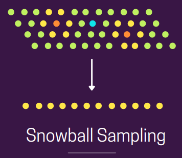

# "Sampling" Methods (+Population vs. Sample)

# Contents

 - [**Population vs. Sample**](#pop-vs-sample)
 - [**Intro to Sampling Methods**](#intro)
 - **Probability Sampling:**
   - [Simple Random Sampling](#srs)
   - [Stratified Sampling](#ss)
   - [Cluster Sampling](#cs)
   - [Systematic Sampling](#systematic)
   - [Multistage Sampling](#multistage)
 - **Non-Probability Sampling:**
   - [Convenience Sampling](#convenience)
   - [Voluntary Sampling](#voluntary)
   - [Snowball Sampling](#snowball)
   - [Quota Sampling](#quota)
   - [Judgmental or Purposive Sampling](#jps)

---

<div id="pop-vs-sample"></div>

## Population vs. Sample

> Before starting with *Sampling Methods*, let's learn what's difference between **Population** and **Sample** in statistics.

Briefly (resumidamente):

 - **Population:**
   - A **population** is a set of sample units *(e.g. people, objects, transactions or events)* that we are interested in studying.
 - **Sample:**
   - A sample is a subset of the sample units of a population.  

See the image below to understand more easily:

  

---

<div id='intro'></div>

## Intro to "Sampling" Methods

> **"Sampling"** is the process of selecting a subset *(a predetermined number of observations)* from a larger population.

**NOTE:**  
It’s a pretty common technique wherein (em que), we run experiments and draw conclusions about the population, without the need of having to study the entire population.

The **"Sampling" Methods** are divided in two groups:

 - **Probability Sampling:**
   - Here we choose a sample based on the *Theory of Probability*.
 - **Non-Probability Sampling:**
   - Here we choose a sample based on *non-random criteria*, and not every member of the population has a chance of being included.

---

<div id="srs"></div>
## Simple Random Sampling

> Under (na) **Random sampling**, every element of the population has an **equal probability of getting selected**.

Below **fig.** shows the pictorial view of the same:

  

**NOTE:**  
All the points collectively represent the entire (inteira) population wherein (em que) every point has an equal chance of getting selected.

You can implement it using python as shown below:

[simple_random_sampling.py](src/simple_random_sampling.py)
```python
import random

population = 100
data = range(population) # Create a range (0 to 100).
simpleRandomSampling = random.sample(data, 5) # Get 5 random numbers.
print(simpleRandomSampling)
```

**OUTPUT:**  
```python
[63, 3, 9, 27, 91]
```

---

<div id="ss"></div>

## Stratified Sampling

> Under (na) **Stratified Sampling**, we group the entire population into ***subpopulations*** by some common property (prioridade).

For example — Class labels in a typical ML classification task. We then randomly sample from those groups individually, such that the groups are still maintained in the same ratio as they were in the entire population.

Below fig. shows a pictorial view of the same:

  

We have two groups with a count ratio of **x** and **3x** based on the colour, we randomly sample from *yellow* and *green* sets separately and represent the final set in the same ratio of these groups.

**Scikit-Learn example:**  
```python
from sklearn.model_selection import train_test_split

stratified_sample, _ = train_test_split(
  population,
  test_size=0.9,
  stratify=population[['label']]
)

print (stratified_sample)
```

**Example 1: Stratified Sampling Using Counts**  
Suppose we have the following pandas DataFrame that contains data about:

 - 8 basketball players.
 - On 2 different teams.

[ss_using_count.py](src/ss_using_count.py)
```python
import pandas as pd

# Create DataFrame
df = pd.DataFrame(
    {
        'team': ['A', 'A', 'A', 'A', 'B', 'B', 'B', 'B'], # Two teams (A and B).
        'position': ['G', 'G', 'F', 'G', 'F', 'F', 'C', 'C'],
        'assists': [5, 7, 7, 8, 5, 7, 6, 9],
        'rebounds': [11, 8, 10, 6, 6, 9, 6, 10]
    }
)

# view DataFrame
print(df)
```

**OUTPUT:**  
```python
  team position  assists  rebounds
0    A        G        5        11
1    A        G        7         8
2    A        F        7        10
3    A        G        8         6
4    B        F        5         6
5    B        F        7         9
6    B        C        6         6
7    B        C        9        10
```

**NOTE:**  
Each row (8) represent a sample (player/instance).

Now, the following code shows how to perform **Stratified Random Sampling** by randomly `selecting 2 players from each team to be included in the sample`:

[ss_using_count.py](src/ss_using_count.py)
```python
# Apply Stratified Random Sampling.
stratifiedRandomSampling = df.groupby(
    'team',
    group_keys=False
).apply(lambda x: x.sample(2))

print(stratifiedRandomSampling)
```

**OUTPUT:**  
```python
  team position  assists  rebounds
0    A        G        5        11
1    A        G        7         8
6    B        C        6         6
5    B        F        7         9
```

**NOTE:**  
 - Notice that two players from each team are included in the stratified sample.
 - Observe que **dois jogadores de cada equipe estão incluídos na amostra estratificada**.

**Example 2: Stratified Sampling Using Proportions**  
Once again suppose we have the following pandas DataFrame that contains data about 8 basketball players on 2 different teams:

[ss_using_proportions.py](src/ss_using_proportions.py)
```python
import pandas as pd

# Create DataFrame
df = pd.DataFrame(
    {
        'team': ['A', 'A', 'B', 'B', 'B', 'B', 'B', 'B'],
        'position': ['G', 'G', 'F', 'G', 'F', 'F', 'C', 'C'],
        'assists': [5, 7, 7, 8, 5, 7, 6, 9],
        'rebounds': [11, 8, 10, 6, 6, 9, 6, 10]
    }
)

# View DataFrame
print(df)
```

**OUTPUT:**  
```python
  team position  assists  rebounds
0    A        G        5        11
1    A        G        7         8
2    B        F        7        10
3    B        G        8         6
4    B        F        5         6
5    B        F        7         9
6    B        C        6         6
7    B        C        9        10
```

**Notice that now:**

 - 6 of the 8 players (75%) in the DataFrame are on team B.
 - And 2 out of the 8 players (25%) are on team A.

The following code shows how to perform **stratified random sampling** such that the proportion of players in the sample from each team matches the proportion of players from each team in the larger DataFrame:

[ss_using_proportions.py](src/ss_using_proportions.py)
```python
import pandas as pd
import numpy as np

# Create DataFrame
df = pd.DataFrame(
    {
        'team': ['A', 'A', 'B', 'B', 'B', 'B', 'B', 'B'],
        'position': ['G', 'G', 'F', 'G', 'F', 'F', 'C', 'C'],
        'assists': [5, 7, 7, 8, 5, 7, 6, 9],
        'rebounds': [11, 8, 10, 6, 6, 9, 6, 10]
    }
)

# View DataFrame.
# print(df)

# Define total sample size desired.
N = 4

# Perform Stratified Random Sampling.
perform = df.groupby(
    'team',
    group_keys=False
).apply(lambda x: x.sample(int(np.rint(N*len(x)/len(df))))).sample(frac=1).reset_index(drop=True)

print(perform)
```

**OUTPUT:**  
```python
  team position  assists  rebounds
0    B        F        7         9
1    B        G        8         6
2    B        C        6         6
3    A        G        5        11
```

**NOTE:**  

 - Notice that the proportion of players from team A in the stratified sample (25%) matches the proportion of players from team A in the larger DataFrame.
 - Similarly, the proportion of players from team B in the stratified sample (75%) matches the proportion of players from team B in the larger DataFrame.

---

<div id="cs"></div>

## Cluster Sampling

> In **Cluster sampling**, we **divide the entire population into subgroups**, wherein, **each of those subgroups has similar characteristics to that of the population when considered in totality**.

**NOTE:**  
Also, instead of sampling individuals, we **randomly select the entire subgroups**. For example, see the example below:

  

**NOTE:**  
As you can be seen in the above **fig.** that we had **4 clusters** with similar properties (size and shape), we randomly select two clusters and treat them as samples.

---

<div id="systematic"></div>

## Systematic Sampling

> **Systematic sampling** is about sampling items from the population at regular predefined intervals (basically fixed and periodic intervals).

**NOTE:**  
For example — Every 5th element, 21st element and so on.

This sampling method tends to be more effective than the **vanilla random sampling method** in general. Below fig. shows a pictorial view of the same — We sample every 9th and 7th element in order and then repeat this pattern:

  

---

<div id="multistage"></div>

## Multistage Sampling

> Under (na) **Multistage sampling**, we **stack multiple sampling methods (like: Random Sampling, Stratified Sampling, Cluster Sampling...)** one after the other.

For example:

 - At the first stage, **Cluster Sampling** can be used to choose clusters from the population.
 - And then we can perform **Random Sampling** to choose elements from each cluster to form the final set.

Below **fig.** shows a pictorial view of the same:

  

---

<div id="convenience"></div>

## Convenience Sampling

> Under (na) **Convenience Sampling**, the researcher includes only those **individuals who are most accessible and available to participate in the study**.

The below **fig.** shows the pictorial view of the same:

  

 - The **Blue dot** is the `researcher`;
 - And **orange dots** are the **most accessible set of people in orange’s vicinity**.

---

<div id="voluntary"></div>

## Voluntary Sampling

> Under (na) **Voluntary sampling**, **interested people usually take part by themselves** by filling in some sort of survey forms.

**A good example of this is the youtube survey about:**

```
“Have you seen any of these ads”
```

**NOTE:**  
The researcher who is conducting the survey has no right to choose anyone.

The below **fig.** shows the pictorial view of the same:

  

 - The **Blue dot** is the **researcher**.
 - **Orange one’s** are those who **voluntarily agreed to take part in the study**.

---

<div id="snowball"></div>

## Snowball Sampling

> Under (na) **Snowball sampling**, the final set is chosen via other participants, i.e. The researcher asks other known contacts to find people who would like to participate in the study.

The below **fig.** shows the pictorial view of the same:

  

 - The **blue dot** is the **researcher**.
 - **orange ones** are **known contacts (of the researcher)**.
 - And **yellow ones (orange’s contacts)** are **other people that got ready to participate in the study**.

---

<div id="quota"></div>

## Quota Sampling

x

---

<div id="jps"></div>

## Judgmental or Purposive Sampling

x

---

**REFERENCES:**  
[Stratified Sampling in Pandas (With Examples)](https://www.statology.org/stratified-sampling-pandas/)  
[8 Types of Sampling Techniques](https://towardsdatascience.com/8-types-of-sampling-techniques-b21adcdd2124)  

---

Ro**drigo** **L**eite da **S**ilva - **drigols**
