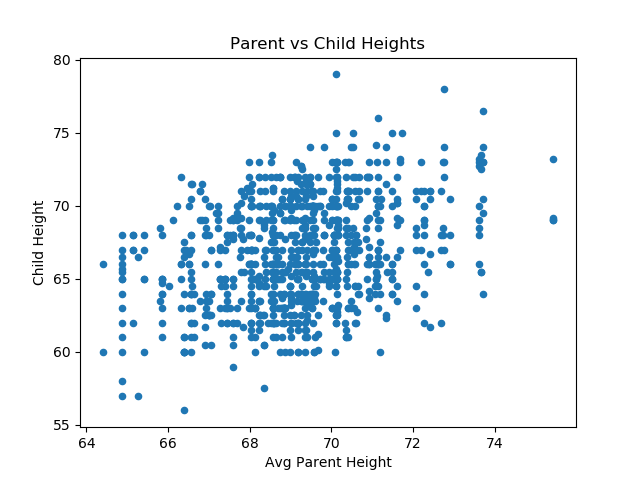

# Gráficos de Dispersão (Scatter Plots)

## Conteúdo

 - [01 - Introdução ao Gráficos de dispersão (Scatter Plots)](#01)
 - [02 - Gráficos de dispersão (Scatter Plots) na prática com Python, Matplotlib e Statsmodels](#02)

---

<div id="01"></div>

## 01 - Introdução ao Gráficos de dispersão (Scatter Plots)

> **Muitas vezes você vai querer comparar valores quantitativos.**

Isso pode ser especialmente útil em cenários de ciência de dados em que você está explorando dados antes de criar um modelo de `Machine Learning (Aprendizado de máquina)`, pois ele pode ajudar a identificar relações aparentes entre recursos numéricos.

> Gráficos de dispersão também podem ajudar a identificar possíveis valores discrepantes - **valores que estão significativamente fora do intervalo normal de valores - Outliers**.

---

<div id="02"></div>

## 02 - Gráficos de dispersão (Scatter Plots) na prática com Python, Matplotlib e Statsmodels

O código Python a seguir cria um gráfico de dispersão que plota os pontos de interseção para __midparentHeight__ no eixo *x* e __childHeight__ no eixo *y* do Dataset de **Galton**:

[scatter-plot.py](src/scatter-plot.py)
```python
from matplotlib import pyplot as plt
import statsmodels.api as sm

df = sm.datasets.get_rdataset('GaltonFamilies', package='HistData').data
parentHeights = df[['midparentHeight', 'childHeight']] # Take "midparentHeight" and "childHeight" data.

parentHeights.plot(kind='scatter', title='Parent vs Child Heights', x='midparentHeight', y='childHeight')
plt.xlabel('Avg Parent Height')
plt.ylabel('Child Height')
plt.savefig('../images/scatter-plot.png', format='png')
plt.show()
```

**OUTPUT:**  


Em um `Gráfico de Dispersão(Scatter Plot)`, __cada ponto marca o ponto de interseção dos dois valores sendo plotados__. Neste gráfico, a maioria das alturas está agrupada em torno do centro; o que indica que a maioria dos pais e filhos tendem a ter uma altura que está em algum lugar no meio do intervalo de alturas observadas.

 - __No canto inferior esquerdo__, há um pequeno aglomerado de pontos que mostra alguns pais da extremidade mais curta do grupo que têm filhos que também são mais curtos do que seus pares.  
 - __No canto superior direito__, há alguns pais extremamente altos que têm filhos extremamente altos.  
 - Também é interessante notar que a __parte superior esquerda__ e a __parte inferior direita do gráfico__ __`estão vazias`__ - não há casos de pais extremamente curtos com filhos extremamente altos ou vice-versa.

---

**REFERÊNCIA:**  
[Essential Math for Machine Learning: Python Edition](https://learning.edx.org/course/course-v1:Microsoft+DAT256x+2T2018/home)  
