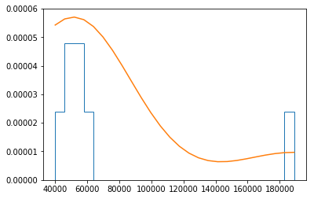
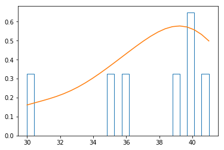

# Assimetria & Curtose

## Conteúdo

 - [01 - Introdução e problema](#01)
 - [02 -  Introdução a Assimetria & Curtose](#02)
 - [03 - Analisando a distribuição do Dataset de Galton (Galton Families)](#03)

---

<div id='01'></div>

## 01 - Introdução e problema

Para entender melhor o conceito de **Assimetria & Curtose** em um conjunto de dados vamos seguir com o seguinte exemplo...

> Por exemplo, suponha que você decida realizar um estudo sobre os salários comparativos de pessoas que se formaram na mesma escola. Serão esses: 

| Nome     | Salário     |
|----------|-------------|
| Dan      | 50,000      |
| Joann    | 54,000      |
| Pedro    | 50,000      |
| Rosie    | 189,000     |
| Ethan    | 55,000      |
| Vicky    | 40,000      |
| Frederic | 59,000      |

Agora vamos transformar esse nosso exemplo em um **DataFrame Pandas**:

[example.py](src/example.py)
```python
def create_df(**df):
  my_df = {}
  import pandas as pd
  my_df = pd.DataFrame(df)
  return my_df

if __name__ =='__main__':
  students = {
    'Name': ['Dan', 'Joann', 'Pedro', 'Rosie', 'Ethan', 'Vicky', 'Frederic'],
    'Salary':[50000, 54000, 50000, 189000, 55000, 40000, 59000]
  }

  my_df = create_df(**students)
  print(my_df)
```

**OUTPUT:**  

```python
       Name  Salary
0       Dan   50000
1     Joann   54000
2     Pedro   50000
3     Rosie  189000
4     Ethan   55000
5     Vicky   40000
6  Frederic   59000
```

---

<div id='02'></div>

## 02 -  Introdução a Assimetria & Curtose

Você pode medir:

 - A __Assimetria (Skewness)__ - (Em que direção os dados estão distorcidos e em que grau);
 - A __Curtose (Kurtosis)__ - (Como os dados são "pontiagudos").

Para ter uma idéia da forma da distribuição de dados.  

**NOTE:**  
No Python, você pode usar as funções:

 - __skew()__ - Para Assimétria (Skewness);
 - __kurt()__ - Para Curtose (Kurtosis).

[skew_kurt-v1.py](src/skew_kurt-v1.py)
```python
import pandas as pd
import numpy as np
from matplotlib import pyplot as plt
import scipy.stats as stats

df = pd.DataFrame({
  'Name': ['Dan', 'Joann', 'Pedro', 'Rosie', 'Ethan', 'Vicky', 'Frederic'],
  'Salary':[50000, 54000, 50000, 189000, 55000, 40000, 59000],
  'Hours':[41, 40, 36, 30, 35, 39, 40],
  'Grade':[50, 50, 46, 95, 50, 5, 57]
})

# Cria uma lista que vai representar os labels do nosso DataFrame:
# - Salary;
# - Hours;
# - Grade.
numcols = ['Salary', 'Hours', 'Grade'] 

# O laço for vai passar por cada item na nosssa lista de labels(numcols) fazendo o seguinte:
# - Imprimindo a assimétria (skewness);
# - Imprimindo a curtose (kurtosis);
# - Pegando a densidade da label;
# - Criando um Histograma para a label;
# - Adicionando a densidade/linha de densidade no plot/histograma.
for col in numcols:
  print(df[col].name + ' skewness: ' + str(df[col].skew())) # Imprime a Assimetria do label/coluna no laço for.
  print(df[col].name + ' kurtosis: ' + str(df[col].kurt())) # Imprime a Curtose do label/coluna no laço for.
  density = stats.gaussian_kde(df[col]) # Pega a densidade do label/coluna no laço for.
  n, x, _ = plt.hist(df[col], histtype='step', density=True, bins=25) # Cria o plot do label/coluna no laço for.
  plt.plot(x, density(x)*6) # Cria a linha de densidade do label no laço for.
  plt.show()
  print('\n')
```

**OUTPUT:**  
```
Salary skewness: 2.57316410755049
Salary kurtosis: 6.719828837773431
```

  

**OUTPUT:**  
```
Hours skewness: -1.194570307262883
Hours kurtosis: 0.9412265624999989
```



**OUTPUT:**  
```
Grade skewness: -0.06512433009682762
Grade kurtosis: 2.7484764913773034
```

  

---

<div id='03'></div>

## 03 - Analisando a distribuição do Dataset de Galton (Galton Families)

Agora vamos olhar para a distribuição de um conjunto de dados real - vamos ver no estudo de Galton como as alturas do pais e das crianças estão distribuídas.

[galton_distribution.py](src/galton_distribution.py)
```python
import pandas as pd
import matplotlib.pyplot as plt
import numpy as np
import scipy.stats as stats

import statsmodels.api as sm

# Importa o dataset de Galton.
df = sm.datasets.get_rdataset('GaltonFamilies', package='HistData').data

fathers = df['father'] # Pega a label/coluna que contém ás altuas dos pais.
density = stats.gaussian_kde(fathers) # Pega a densidade de altura dos pais.

n, x, _ = plt.hist(fathers, histtype='step', density=True, bins=50) # Cria o Histograma.
plt.plot(x, density(x)*2.5) # Adiciona a densidade/linha de densidade no plot/Histograma.
plt.axvline(fathers.mean(), color='magenta', linestyle='dashed', linewidth=2) # Adiciona a mean() lane no plot.
plt.axvline(fathers.median(), color='green', linestyle='dashed', linewidth=2) # Adiciona a median() lane no plot.
plt.show()
```


**NOTE:**  
Como você pode ver, as medidas de altura do pai são aproximadamente normalmente distribuídas - em outras palavras, elas formam uma distribuição mais ou menos normal que é simétrica em torno da média.

---

**REFERENCES:**  
[Essential Math for Machine Learning: Python Edition](https://learning.edx.org/course/course-v1:Microsoft+DAT256x+2T2018/home)
