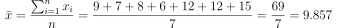
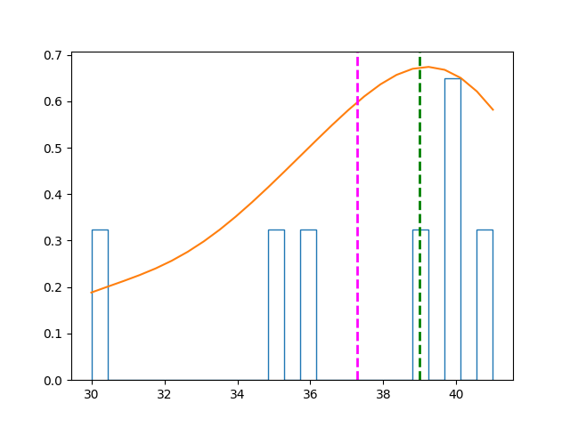
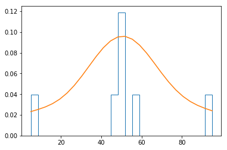
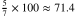
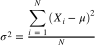
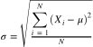
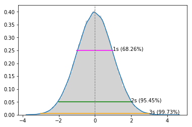
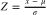
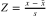

# Fundamentos de Estatísticas

As estatísticas são principalmente sobre a ***análise de amostras de dados***, e isso começa com a compreensão da distribuição de dados em uma amostra.

# Contents

 - [01 - Medidas da Tendência Central (mean)](#01)
 - [02 - Média (mean)](#02)
 - [03 - Mediana (median)](#03)
   - [BONUS: Média vs Mediana](#04)
 - [04 - Moda (mode)](#05)
 - [05 - Dados Multimodais](#06)
 - [06 - Distribuição & densidade](#07)
 - [07 - Assimetria & curtose](#08)
 - [08 - Medidas de variação (Intervalo, Percentil & Quartil)](#09)
 - [09 - Outliers](#10)
 - [10 - Variância & Desvio Padrão](#11)
 - [11 - Z Score](#12)
 - [BONUS - Resumindo a distribuição de dados no Python](#13)

<div id='01'></div>

## 01 - Medidas da Tendência Central (mean)
O termo medidas de tendência central soa um pouco grande, mas na verdade é apenas uma maneira elegante de dizer que __estamos interessados em saber onde está o valor intermediário em nossos dados__. 

> Por exemplo, suponha que você decida realizar um estudo sobre os salários comparativos de pessoas que se formaram na mesma escola. Você pode gravar os resultados assim: 

| Nome     | Salário     |
|----------|-------------|
| Dan      | 50,000      |
| Joann    | 54,000      |
| Pedro    | 50,000      |
| Rosie    | 189,000     |
| Ethan    | 55,000      |
| Vicky    | 40,000      |
| Frederic | 59,000      |

Agora, alguns dos ex-alunos podem ganhar muito e outros podem ganhar menos; mas qual é o salário no meio do intervalo de todos os salários?

<div id='02'></div>

## 02 - Média (mean)

Uma maneira comum de definir o valor central é usar a média , geralmente chamada de *mean/average*. Isso é calculado como a soma dos valores no conjunto de dados, dividido pelo número de observações no conjunto de dados. Quando o conjunto de dados consiste na população total, a média é representada pelo símbolo grego ***&mu;*** (*mu*) e a fórmula é escrita assim: 

  

Mais comumente, ao trabalhar com uma amostra, a média é representada por ***x&#772;*** (*x-bar*), e a fórmula é escrita assim (observe as letras minúsculas usadas para indicar valores de uma amostra):

  

No caso da nossa lista de salários, isso pode ser calculado como: 

  

Qual é **71,000**. 

Em Python, ao trabalhar com dados com **pandas.dataframe**, você pode usar a função **mean()**, assim:

[create_dataframe.py](src/create_dataframe.py)  
```python
def create_df(**df):
  my_df = {}
  import pandas as pd
  my_df = pd.DataFrame(df)
  return my_df

if __name__ =='__main__':
  students = {
    'Name': ['Dan', 'Joann', 'Pedro', 'Rosie', 'Ethan', 'Vicky', 'Frederic'],
    'Salary':[50000,54000,50000,189000,55000,40000,59000]
    }

  my_df = create_df(**students)
  print(my_df)
  print("Média salarial: ", my_df['Salary'].mean())
```

**OUTPUT:**  
```
       Name  Salary
0       Dan   50000
1     Joann   54000
2     Pedro   50000
3     Rosie  189000
4     Ethan   55000
5     Vicky   40000
6  Frederic   59000
Média salarial:  71000.0
```

Então, __71.000__ é realmente o valor central? Ou, em outras palavras, seria razoável para um graduado desta escola esperar ganhar 71 mil dólares? Afinal, esse é o salário médio de um graduado desta escola.

**NOTE:**  
> Se você observar de perto os salários, verá que, dos sete ex-alunos, seis ganham menos do que o salário médio. ***Os dados são distorcidos* pelo fato de que Rosie conseguiu encontrar um trabalho bem mais bem remunerado do que seus colegas de classe**. Como resolver isso ? - *Mediana (median)*.

<div id='03'></div>

## 03 - Mediana (median)

OK, vamos ver se podemos encontrar outra definição para o valor central que reflita mais de perto o potencial de ganho esperado dos alunos que frequentam a nossa escola. Outra medida de tendência central que podemos usar é a **mediana (median)**.

Para calcular a mediana (median):
 - **1ª -** Precisamos **ordenar** os valores em **ordem crescente**;
 - **2ª -** Encontrar o valor do meio.

**QUANDO O UM NÚMERO DE OBSERVAÇÕES FOR *ÍMPAR*:**  
Você pode encontrar a posição do valor mediano quando o número de observações for **ímpar** usando a seguinte fórmula **(onde n é o número de observações)**:

  

**QUANDO O NÚMERO DE OBSERVAÇÕES FOR *PAR:***  
Se o número de observações for **par**, as coisas são um pouco (mas não muito) mais complicadas. Nesse caso, você calcula a mediana como ***a média dos dois valores intermediários***, que são encontrados assim:

  

Ou seja, vamos tirar a média das 2 observações do meio. A equação complete vai ficar algo parecido com isso:

  

Então, para os nossos salários de pós-graduação; primeiro vamos ordenar o conjunto de dados:  
  
| Salary      |
|-------------|
| 40,000      |
| 50,000      |
| 50,000      |
| 54,000      |
| 55,000      |
| 59,000      |
| 189,000     |

Há um número ímpar de observações (7), portanto, o valor mediano (median) está na posição **(7 + 1) ÷ 2**; em outras palavras, posição **4**:

| Salary      |
|-------------|
| 40,000      |
| 50,000      |
| 50,000      |
|***>54,000*** |
| 55,000      |
| 59,000      |
| 189,000     |

Então, o salário médio é de __54.000__.

A classe **pandas.dataframe** tem uma função **median()** para encontrar a mediana. Vamos utilizar o mesmo código em [create_dataframe.py](src/create_dataframe.py), porém agora vamos tirar a **Mediana (median)**:

[create_dataframe.py](src/create_dataframe.py)  
```python
def create_df(**df):
  my_df = {}
  import pandas as pd
  my_df = pd.DataFrame(df)
  return my_df

if __name__ =='__main__':
  students = {
    'Name': ['Dan', 'Joann', 'Pedro', 'Rosie', 'Ethan', 'Vicky', 'Frederic'],
    'Salary':[50000,54000,50000,189000,55000,40000,59000]
    }

  my_df = create_df(**students)
  print(my_df)
  print("Média salarial: ", my_df['Salary'].mean(), "\n")

  my_df = my_df.sort_values('Salary')
  print("DataFrame Ordenado por salários: \n", my_df)
  print("Mediana dos salarios: ", my_df['Salary'].median())
```

**OUTPUT:**  
```
       Name  Salary
0       Dan   50000
1     Joann   54000
2     Pedro   50000
3     Rosie  189000
4     Ethan   55000
5     Vicky   40000
6  Frederic   59000
Média salarial:  71000.0 

DataFrame Ordenado por salários: 
        Name  Salary
5     Vicky   40000
0       Dan   50000
2     Pedro   50000
1     Joann   54000
4     Ethan   55000
6  Frederic   59000
3     Rosie  189000
Mediana dos salarios:  54000.0
```

Veja que realmente bateu com a nossa tabela e nossos cálculos.

<div id='04'></div>

## BONUS: Média vs Mediana

Bem, agora vamos fazer uma comparação entre os métodos de **Média** e **Mediana** e analisar alguns casos.

> Suponha que nós estamos tirando a média de quantas horas de sono determina(s) pessoas dormem por semana.

Digamos que uma das nossas amostras (pessoa) teve as seguintes horas dormidas por semana:

| Sunday | Monday | Tuesday | Wednesday | Thursday | Friday | Saturday |
|--------|--------|---------|-----------|----------|--------|----------|
|   9    |    7   |    8    |     6     |    12    |    12  |    15    |  

O cálculo da média para esse exemplo vai ser algo parecido com isso:

  

O interessante de você trabalhar com o método da média é que ela considera todos os valores *(diferente da mediana que depois do valor do meio os dados são ignorados)*.

Mas isso tem um impacto muito grande? Claro, vamos demonstrar isso agora. Suponha que você tenha 2 amostras de 2 pessoas com suas respectivas horas dorminas por semana *(Vamos dá os dados já ordenados porque para trabalhar com a mediana primeiro devemos ordenar os dados)*:

**PESSOA "A":**  
| Sunday | Monday | Tuesday | Wednesday | Thursday | Friday | Saturday |
|--------|--------|---------|-----------|----------|--------|----------|
|   6    |    6   |    7    | **>>8**   |    8     |    8   |    9     |


**PESSOA "B":**  
| Sunday | Monday | Tuesday | Wednesday | Thursday | Friday | Saturday |
|--------|--------|---------|-----------|----------|--------|----------|
|   6    |    7   |    8    | **>>8**   |   *12*   |   *12* |   *15*   |

Veja que o nosso valor médio de uma Mediana para ambas as amostras das pessoas **"A"** e **"B"** é **8**. Mas tem um outro detalhe que nós não podemos deixar passar nessas 2 amostras:

> Na segunda amostra **(Pessoa B)** se você prestar atenção os valores depois da Mediana são bem maiores do que os da primeira amostra **(Pessoa A)**. Ou seja, a segunda pessoa dormiu bem mais.

**NOTE:**  
E o que isso que dizer?
 - **1ª -** Isso que dizer que os dados **não são bem distribuídos**;
 - **2ª -** Nesse caso seria melhor aplicar a *Média* - **Já que ela considera TODOS os valores de amostras**.

Mas quando temos muitos dados para trabalhar talvez seja difícil ver essa diferença não é? Não porque nós temos os **plots** que nos dão uma ***abstração visual***.

Vamos criar um plot em Python para visualizar essas 2 amostras **A** e **B**:

[mean_median_graph.py](src/mean_median_graph.py)
```python
from create_dataframe import create_df

if __name__ =='__main__':
  import matplotlib.pyplot as plt

  sleep_search = {
    'A': [6, 6, 7, 8, 8, 8, 9],
    'B': [6, 7, 8, 8, 12, 12, 15]
  }

  my_df = create_df(**sleep_search)
  print(my_df)

  plt.plot(my_df, marker='o')
  plt.title("Comparação entre as amostras (variáveis) A & B")
  plt.xlabel("Dias da Semana - x")
  plt.ylabel("Horas dormida - x")
  plt.legend(['A', 'B'])
  plt.savefig('../images/plot-01.png', format='png')
  plt.show()
```

**OUTPUT:**  
```
   A   B
0  6   6
1  6   7
2  7   8
3  8   8
4  8  12
5  8  12
6  9  15
```

  

**NOTE:**  
Viram como a médiana entre as duas amostras realmente batem, porém, depois da médiana os dados das amostras se distanciam muito um do outro - **Isso porque a segunda pessoa dormiu bem mais**.

Ok, então a média vai ser sempre melhor do que a mediana? Não. Suponha que nós temos um conjunto de dados relativamente distribuído, ou seja:

 - Os **valores menores** estarão sempre puxando para a **esquerda**;
 - E os **valores maiores** estarão sempre puxando para a **direita**;
 - E na mediana vão está os valores central.

Quando nós trabalharmos com esse conjunto distribuído a mediana tende a ignorar **dados muito distorcidos (Outliers)** - **Isso tende a ser uma vantagem em relação a Média porque ela considera todos os dados na amostra**.

> **OBS:** Lembre que isso é para uma *amostra bem distribuído* com *ALGUNS pontos fora da curva*.

É algo parecido com isso:


<div id='05'></div>

## 04 - Moda (mode)

Outra estatística relacionada é a moda (mode), __que indica o valor mais frequente__. Se você pensar sobre isso, isso é potencialmente um bom indicador de quanto um aluno pode esperar ganhar quando se formar na escola; de todos os salários que estão sendo ganhos por ex-alunos, a moda (mode) é ganho por mais do que qualquer outro.

Olhando para a nossa lista de salários, há duas instâncias de ex-alunos que ganham __50.000__, mas apenas uma instância para cada outro salário:

| Salary      |
|-------------|
| 40,000      |
|***>50,000***|
|***>50,000***|
| 54,000      |
| 55,000      |
| 59,000      |
| 189,000     |

A moda(mode) é, portanto, __50.000__.

Como você poderia esperar, a classe pandas.dataframe tem uma função __mode()__ para retornar a moda:

[moda.py](src/moda.py)
```python
from create_dataframe import create_df

if __name__ =='__main__':
  students = {
    'Name': ['Dan', 'Joann', 'Pedro', 'Rosie', 'Ethan', 'Vicky', 'Frederic'],
    'Salary':[50000,54000,50000,189000,55000,40000,59000]
    }

  my_df = create_df(**students)
  moda = my_df['Salary'].mode()
  print("O salário mais frequente é: {0}".format(moda))
```

**OUTPUT:**  
```
O salário mais frequente é: 0    50000
dtype: int64
```

<div id='06'></div>

## 05 - Dados Multimodais

Não é incomum que um conjunto de dados tenha mais de um valor como a moda. Por exemplo, suponha que receba um aumento que leve seu salário a __59.000__:

| Salary      |
|-------------|
| 40,000      |
|***>50,000***|
|***>50,000***|
| 54,000      |
|***>59,000***|
|***>59,000***|
| 189,000     |
  
Agora existem dois valores com a frequência mais alta. __Este conjunto de dados é bimodal__. Mais geralmente, quando há mais de um valor da moda, os dados são considerados __multimodais__.  
  
A função __mode()__ do pandas.dataframe retorna todas as modas:

[multimodal.py](src/multimodal.py)
```python
from create_dataframe import create_df

if __name__ =='__main__':
  students = {
    'Name': ['Dan', 'Joann', 'Pedro', 'Rosie', 'Ethan', 'Vicky', 'Frederic'],
    'Salary':[50000,54000,50000,189000,59000,40000,59000]
  }

  my_df = create_df(**students)
  moda = my_df['Salary'].mode()
  print("O salário mais frequente é: {0}".format(moda))
```

**OUTPUT:**  
```
0    50000
1    59000
dtype: int64
```

<div id='07'></div>

## 06 - Distribuição & densidade

Agora que sabemos algo sobre encontrar o centro, podemos começar a explorar como os dados são distribuídos em torno dele (o centro). O que nos interessa aqui é entender a *"forma"* geral da distribuição de dados, de modo que possamos começar a ter uma ideia do que um valor *"típico"* poderia ser esperado.

Podemos começar por encontrar os extremos - **o mínimo** e **o máximo**. No caso de nossos dados salariais:

 - **Com menor remuneração de nossa escola é Vicky, com um salário de 40.000;**
 - **O(a) mais bem pago é Rosie, com 189.000.**

A classe pandas.dataframe possui funções **min()** e **max()** para retornar esses valores.

[min_max.py](src/min_max.py)
```python
from create_dataframe import create_df

if __name__ =='__main__':
  students = {
    'Name': ['Dan', 'Joann', 'Pedro', 'Rosie', 'Ethan', 'Vicky', 'Frederic'],
    'Salary':[50000,54000,50000,189000,59000,40000,59000]
  }

  my_df = create_df(**students)
  print ('Min: ' + str(my_df['Salary'].min())) # Pega o menor salário/elmento da lista.
  print ('Mode: ' + str(my_df['Salary'].mode()[0])) # Encontra o mode (o/os mais frequente(s)).
  print ('Median: ' + str(my_df['Salary'].median())) # Encontra a mediana (median).
  print ('Mean: ' + str(my_df['Salary'].mean())) # Encontra a média (mean)
  print ('Max: ' + str(my_df['Salary'].max())) # Pega o maior salário/elemento da lista.
```

**OUTPUT:**  
```
Min: 40000
Mode: 50000
Median: 54000.0
Mean: 71571.42857142857
Max: 189000
```

Podemos examinar esses valores e ter uma ideia de como os dados são distribuídos. Por exemplo, podemos ver que a média está mais próxima do máximo, que a mediana está mais próximos do mínimo que do máximo.

**NOTE:**  
No entanto, geralmente é mais fácil ter uma noção da distribuição visualizando os dados. Vamos começar criando um histograma dos salários, destacando:

 - A média (mean) de salários;
 - Os salários medianos (median);
 - O min(), max() são bastante evidentes, um do lado esquerdo e o outro do lado direito, respectivamente **(você pode ver isso no eixo "x")**;
 - A moda é onde a barra é mais alta está **(mesmo não desenhado uma linha, mas você pode ver que é onde tem mais dados frequentes)**.

[graph_model-01.py](src/graph_model-01.py)
```python
from create_dataframe import create_df
import matplotlib.pyplot as plt

if __name__ =='__main__':


  students = {
    'Name': ['Dan', 'Joann', 'Pedro', 'Rosie', 'Ethan', 'Vicky', 'Frederic'],
    'Salary':[50000,54000,50000,189000,59000,40000,59000]
  }

  my_df = create_df(**students)
  salary = my_df['Salary'] # Pega os salários do DataFrame e salva no objeto "salary".

  # Cria o plot/gráfico.
  salary.plot.hist(title='Salary Distribution', color='lightblue', bins=25) # Cria o Histogram a partir de "salary".
  plt.axvline(salary.mean(), color='magenta', linestyle='dashed', linewidth=2) # Adiciona mean() lane no plot.
  plt.axvline(salary.median(), color='green', linestyle='dashed', linewidth=2) # Adiciona median() lane no plot.
  plt.savefig('../images/plot-02.png', format='png')
  plt.show()
```

**OUTPUT:**  
  

A ***Média (mean)*** e a ***Mediana (median)*** são mostradas como linhas tracejadas. Observe o seguinte:

 - O salário é um valor de dados contínuo - os graduados poderiam potencialmente ganhar qualquer valor ao longo da escala, até mesmo uma fração de centavo;
 - O número de bins no histograma determina o tamanho de cada faixa salarial para a qual estamos contando as freqüências. **Menos bins significam juntar mais salários individuais para serem contados como um grupo**;
 - A maioria dos dados está no lado esquerdo do histograma, refletindo o fato de que a maioria dos formandos ganha entre 4**0.000** e **55.000**;
 - A média (mean) é um valor mais alto que a mediana(median) e a moda(mode);
 - Existem lacunas no histograma das faixas salariais que ninguém ganha.

O histograma mostra a frequência relativa de cada faixa salarial, com base no número de bins. Também nos dá uma noção da densidade dos dados para cada ponto da escala salarial.

> Com pontos de dados suficientes e bins pequenas o suficiente, poderíamos ver essa ***densidade*** como uma linha que mostra a forma da distribuição de dados.

[density.py](src/density.py)
```python
from create_dataframe import create_df
import matplotlib.pyplot as plt
import scipy.stats as stats

if __name__ =='__main__':


  students = {
    'Name': ['Dan', 'Joann', 'Pedro', 'Rosie', 'Ethan', 'Vicky', 'Frederic'],
    'Salary':[50000,54000,50000,189000,59000,40000,59000]
  }

  my_df = create_df(**students)
  salary = my_df['Salary'] # Pega os salários do DataFrame e salva no objeto "salary".
  density = stats.gaussian_kde(salary) # Pega a densidade dos salários.

  # Cria o plot/gráfico.
  n, x, _ = plt.hist(salary, histtype='step', density=True, bins=25) # Cria o Histograma.
  plt.plot(x, density(x)*5) # Cria a linha de densidade no plot.
  plt.axvline(salary.mean(), color='magenta', linestyle='dashed', linewidth=2) # Adiciona mean() lane no plot.
  plt.axvline(salary.median(), color='green', linestyle='dashed', linewidth=2) # Adiciona median() lane no plot.
  plt.savefig('../images/plot-03.png', format='png')
  plt.show()
```

**OUTPUT:**  
  

Observe que a linha de densidade assume a forma de uma curva assimétrica que tem um *pico* à esquerda e uma cauda longa à direita
 
> Descrevemos esse tipo de distribuição de dados como distorcida; ou seja, os dados não são distribuídos simetricamente, mas sim "agrupados" de um lado.

Nesse caso, os dados são agrupados à esquerda, criando uma cauda longa à direita; e é descrito como sendo inclinado para a direita porque alguns valores altos que ocorrem raramente estão puxando a média para a direita.

Vamos dar uma olhada em outro conjunto de dados. Sabemos quanto dinheiro nossos alunos fazem, mas quantas horas por semana eles precisam trabalhar para ganhar seus salários? Aqui estão os dados:

| Name     | Hours |
|----------|-------|
| Dan      | 41    |
| Joann    | 40    |
| Pedro    | 36    |
| Rosie    | 30    |
| Ethan    | 35    |
| Vicky    | 39    |
| Frederic | 40    |


[density_hours.py](src/density_hours.py)
```python
from create_dataframe import create_df
import matplotlib.pyplot as plt
import scipy.stats as stats

if __name__ =='__main__':


  students = {
    'Name': ['Dan', 'Joann', 'Pedro', 'Rosie', 'Ethan', 'Vicky', 'Frederic'],
    'Hours':[41, 40, 36, 30, 35, 39, 40]
  }

  my_df = create_df(**students)
  hours = my_df['Hours'] # Pega as horas trabalhadas por semana de cada aluno.
  density = stats.gaussian_kde(hours) # Pega a densidade das horas.

  # Cria o plot/gráfico.
  n, x, _ = plt.hist(hours, histtype='step', density=True, bins=25) # Cria o Histograma.
  plt.plot(x, density(x)*7) # Cria a linha de densidade no plot.
  plt.axvline(hours.mean(), color='magenta', linestyle='dashed', linewidth=2) # Adiciona mean() lane no plot.
  plt.axvline(hours.median(), color='green', linestyle='dashed', linewidth=2) # Adiciona median() lane no plot.
  plt.savefig('../images/plot-04.png', format='png')
  plt.show()
```

**OUTPUT:**  
  

> Mais uma vez, a distribuição é distorcida, mas desta vez é distorcida a esquerda.

Note que a curva é assimétrica com a ***média (mean)*** à esquerda da ***mediana (median)*** e a moda(mode); e a média de horas de trabalho semanais desviadas para a extremidade inferior.

Mais uma vez, Rosie parece estar recebendo o melhor do negócio. Ela ganha mais do que seus ex-colegas de classe por trabalhar menos horas. Talvez uma olhada nas pontuações do teste que os alunos alcançaram na nota final da escola possa ajudar a explicar seu sucesso:

| Name     | Grade |
|----------|-------|
| Dan      | 50    |
| Joann    | 50    |
| Pedro    | 46    |
| Rosie    | 95    |
| Ethan    | 50    |
| Vicky    | 5     |
| Frederic | 57    |

Vamos dar uma olhada na distribuição dessas notas:

[density_grade.py](src/density_grade.py)
```python
from create_dataframe import create_df
import matplotlib.pyplot as plt
import scipy.stats as stats

if __name__ =='__main__':

  students = {
    'Name': ['Dan', 'Joann', 'Pedro', 'Rosie', 'Ethan', 'Vicky', 'Frederic'],
    'Grade': [50, 50, 46, 95, 50, 5,57]
  }

  my_df = create_df(**students)
  grade = my_df['Grade'] # Pega as notas/grades de todos os alunos.
  density = stats.gaussian_kde(grade) # Pega a densidade das notas.

  # Cria o plot/gráfico.
  n, x, _ = plt.hist(grade, histtype='step', density=True, bins=25) # Cria o Histograma.
  plt.plot(x, density(x)*7.5) # Cria a linha de densidade no plot.
  plt.axvline(grade.mean(), color='magenta', linestyle='dashed', linewidth=2) # Adiciona mean() lane no plot.
  plt.axvline(grade.median(), color='green', linestyle='dashed', linewidth=2) # Adiciona median() lane no plot.
  plt.savefig('../images/plot-05.png', format='png')
  plt.show()
```

**OUTPUT:**  
  

> Desta vez, a distribuição é simétrica, formando uma curva ***"em forma de sino"***. A ***média (mean)***, ***mediana (median)*** e moda(mode) estão no mesmo local, e os dados caem uniformemente em ambos os lados de um pico central.

Os estatísticos chamam isso de uma **distribuição normal (ou às vezes uma distribuição gaussiana)**, e ocorre bastante comumente em muitos cenários devido a algo chamado `Teorema do Limite Central`, que reflete a maneira como a probabilidade contínua funciona.

<div id='08'></div>

## 07 - Assimetria & curtose

Você pode medir:

 - A __Assimetria (Skewness)__ - (Em que direção os dados estão distorcidos e em que grau);
 - A __Curtose (Kurtosis)__ - (como os dados são "pontiagudos").

Para ter uma idéia da forma da distribuição de dados.  

**NOTE:**  
No Python, você pode usar as funções:

 - __skew()__ - Para Assimétria (Skewness);
 - __kurt()__ - Para curtose (Kurtosis).

```python
import pandas as pd
import numpy as np
from matplotlib import pyplot as plt
import scipy.stats as stats

df = pd.DataFrame({
  'Name': ['Dan', 'Joann', 'Pedro', 'Rosie', 'Ethan', 'Vicky', 'Frederic'],
  'Salary':[50000,54000,50000,189000,55000,40000,59000],
  'Hours':[41,40,36,30,35,39,40],
  'Grade':[50,50,46,95,50,5,57]
  })

# Cria uma lista que vai representar os labels do nosso DataFrame:
# - Salary;
# - Hours;
# - Grade.
numcols = ['Salary', 'Hours', 'Grade'] 

# O laço for vai passar por cada item na nosssa lista de labels(numcols) fazendo o seguinte:
# - Imprimindo a assimétria(skewness);
# - Imprimindo a curtose(kurtosis);
# - Pegando a densidade da label;
# - Criando um Histograma para a label;
# - Adicionando a densidade/linha de densidade no plot/histograma.
for col in numcols:
    print(df[col].name + ' skewness: ' + str(df[col].skew())) # Imprime a Assimetria do label/coluna no laço for.
    print(df[col].name + ' kurtosis: ' + str(df[col].kurt())) # Imprime a Curtose do label/coluna no laço for.
    density = stats.gaussian_kde(df[col]) # Pega a densidade do label/coluna no laço for.
    n, x, _ = plt.hist(df[col], histtype='step', density=True, bins=25) # Cria o plot do label/coluna no laço for.
    plt.plot(x, density(x)*6) # Cria a linha de densidade do label no laço for.
    plt.show()
    print('\n')
```

**OUTPUT:**  
```
Salary skewness: 2.57316410755049
Salary kurtosis: 6.719828837773431
```

  

**OUTPUT:**  
```
Hours skewness: -1.194570307262883
Hours kurtosis: 0.9412265624999989
```


**OUTPUT:**  
```
Grade skewness: -0.06512433009682762
Grade kurtosis: 2.7484764913773034
```

  

Agora vamos olhar para a distribuição de um conjunto de dados real - vamos ver no estudo de Galton como as alturas do pais e das crianças estão distribuídas.


```python
import pandas as pd
import matplotlib.pyplot as plt
import numpy as np
import scipy.stats as stats

import statsmodels.api as sm

# Importa o dataset de Galton.
df = sm.datasets.get_rdataset('GaltonFamilies', package='HistData').data


fathers = df['father'] # Pega a label/coluna que contém ás altuas dos pais.
density = stats.gaussian_kde(fathers) # Pega a densidade de altura dos pais.

n, x, _ = plt.hist(fathers, histtype='step', density=True, bins=50) # Cria o Histograma.
plt.plot(x, density(x)*2.5) # Adiciona a densidade/linha de densidade no plot/Histograma.
plt.axvline(fathers.mean(), color='magenta', linestyle='dashed', linewidth=2) # Adiciona a mean() lane no plot.
plt.axvline(fathers.median(), color='green', linestyle='dashed', linewidth=2) # Adiciona a median() lane no plot.
plt.show()
```


Como você pode ver, as medidas de altura do pai são aproximadamente normalmente distribuídas - em outras palavras, elas formam uma distribuição mais ou menos normal que é simétrica em torno da média.

<div id='09'></div>

## 08 - Medidas de variação (Intervalo, Percentil & Quartil)

Podemos ver nos gráficos de distribuição de nossos dados que os valores em nosso conjunto de dados podem variar bastante. Podemos usar várias medidas para quantificar essa variação.

### 08.1 - Intervalo (range)

> Uma maneira simples de quantificar a variação em um conjunto de dados é identificar a diferença entre os valores mais baixo e mais alto. Isso é chamado de intervalo e é calculado `subtraindo` o **valor máximo** do **valor mínimo**.

Veja o código a seguir para ver como é simples:

[test_interval.py](src/test_interval.py)
```python
import pandas as pd

df = pd.DataFrame({
  'Name': ['Dan', 'Joann', 'Pedro', 'Rosie', 'Ethan', 'Vicky', 'Frederic'],
  'Salary':[50000, 54000, 50000, 189000, 55000, 40000, 59000],
  'Hours':[41, 40, 36, 30, 35, 39, 40],
  'Grade':[50, 50, 46, 95, 50, 5,57]
  })

# Cria uma lista para representar as labels/colunas do DataFrame.
numcols = ['Salary', 'Hours', 'Grade']

# Itera pelo for e para cada label/coluna do DataFrame
# imprime os intervalos(ranges).
for col in numcols:
  print(df[col].name + ' range: ' + str(df[col].max() - df[col].min()))
```

**OUTPUT:**  
```
Salary range: 149000
Hours range: 11
Grade range: 90
```

O ***intervalo (range)*** é fácil de calcular, mas não é uma estatística particularmente útil.

 - Por exemplo, um intervalo(range) de 149.000 entre o salário mais baixo e o mais alto não nos diz qual valor dentro desse intervalo um graduado provavelmente ganhará;  
 - Não nos diz nada sobre como os salários são distribuídos em torno da média dentro desse intervalo;
 - O intervalo (range) nos diz muito pouco sobre a posição comparativa de um valor individual dentro da distribuição.

Por exemplo, Frederic marcou 57 em sua nota final na escola; que é uma boa pontuação (é mais do que todos, menos um de seus colegas); mas isso não é imediatamente aparente a partir de uma pontuação de 57 e alcance de 90.

### 08.2 - Percentil

> Percentil tem haver com ***posições(ª)*** & ***porcentagem (%)***.

Como Percentil tem have rcom ***porcentagem (%)*** é como se nós dividíssemos a nossa amostra de dados em 100 partes ou em porcentos:

 - 100% dos dados;
 - 50% dos dados;
 - 25% dos dados;
 - 1% dos dados...

Como são descritos esses percentils?

Se eu falar:

 - **10º percentil ->** Eu estou falando dos 10% dos dados (ou da amostra de dados);
 - **20º percentil ->** Eu estou falando dos 20% dos dados (ou da amostra de dados);
 - **2º percentil ->** Eu estou falando dos 2% dos dados (ou da amostra de dados)...

> Veja que nós temos uma *associação* de ***posições (percentilª)*** e ***porcentagem***. 

Vamos examinar a nota de Frederic usando essa abordagem. Sabemos que ele marcou 57, mas como ele está em relação aos seus colegas?

 - Bem, há sete alunos no total;
 - E cinco deles tiveram menos que Frederic.

então podemos calcular o percentil da nota de Frederic assim:  
  
  
  
> Então, a pontuação de Frederic o coloca no 71º percentil de sua classe.

No Python, você pode usar a função **percentileofscore()** no pacote scipy.stats para calcular o percentil de um determinado valor em um conjunto de valores:

[percentileofscore.py](src/percentileofscore.py)
```python
import pandas as pd
from scipy import stats

df = pd.DataFrame({
  'Name': ['Dan', 'Joann', 'Pedro', 'Rosie', 'Ethan', 'Vicky', 'Frederic'],
  'Salary':[50000,54000,50000,189000,55000,40000,59000],
  'Hours':[41,40,36,30,35,39,40],
  'Grade':[50,50,46,95,50,5,57]
  })

# função percentileofscore() recebe como argumento:
# - A label/coluna/lista em que vamos trabalhar;
# - A nota do aluno Frederic;
# - Define a função como 'strict' - Ou seja, compara apenas com os valores menores;
# - E retorna a classificação n° percentil do valor/dado/aluno.
print(stats.percentileofscore(df['Grade'], 57, 'strict'))
```

**OUTPUT:**  
```
71.42857142857143
```

Nós usamos a definição estrita (strict) de percentil; mas às vezes é calculado como sendo a porcentagem de valores que são **menores ou iguais** ao **valor que você está comparando**.

> Nesse caso, o cálculo do percentil de Frederic incluiria sua própria pontuação:

  

Você pode calcular dessa meneira no Python apenas definindo a função **percentileofscore()** como **"weak"**:

[weak.py](src/weak.py)
```python
import pandas as pd
from scipy import stats

df = pd.DataFrame({
  'Name': ['Dan', 'Joann', 'Pedro', 'Rosie', 'Ethan', 'Vicky', 'Frederic'],
  'Salary':[50000,54000,50000,189000,55000,40000,59000],
  'Hours':[41,40,36,30,35,39,40],
  'Grade':[50,50,46,95,50,5,57]
  })

# A mesma abordagem, porém para valores MENORES ou IGUAIS.
print(stats.percentileofscore(df['Grade'], 57, 'weak'))
```

**OUTPUT:**  
```
85.71428571428571
```

Consideramos o percentil do grau de Frederic e o usamos para classificá-lo em comparação com seus colegas. Então, e sobre Dan, Joann e Ethan? Como eles se comparam ao resto da turma? Eles obtiveram o mesmo grau (50), portanto, de certo modo, eles compartilham um percentil.

Para lidar com esse cenário agrupado, podemos calcular a média das classificações percentuais para as pontuações correspondentes. Tratamos metade das pontuações que correspondem àquelas que classificamos como se estivessem abaixo dela e metade como se estivessem acima dela. Nesse caso, havia três pontuações correspondentes de 50, e para cada uma delas calculamos o percentil como se 1 estivesse abaixo e 1 estivesse acima. Portanto, o cálculo de um percentil para Joann com base em pontuações menores ou iguais a 50 é:

  

O valor de __4__ consiste nas duas pontuações que estão abaixo da pontuação de 50 de Joann, na pontuação de Joann e em metade das pontuações que são as mesmas de Joann (das quais existem duas, portanto, contamos uma).

No Python, a função ***percentileofscore()*** tem uma atributo de classificação **"rank"** que calcula percentis agrupados como este:

[percentil_rank.py](src/percentil_rank.py)
```python
import pandas as pd
from scipy import stats

df = pd.DataFrame({
  'Name': ['Dan', 'Joann', 'Pedro', 'Rosie', 'Ethan', 'Vicky', 'Frederic'],
  'Salary':[50000,54000,50000,189000,55000,40000,59000],
  'Hours':[41,40,36,30,35,39,40],
  'Grade':[50,50,46,95,50,5,57]
  })

print(stats.percentileofscore(df['Grade'], 50, 'rank'))
```

**OUTPUT:**  
```
57.14285714285714
```

### 08.3 - Quartil

Bem, agora vamos aprender como trabalhar com *Quartil* e como os dados são divididos em um *Quartil*.

 - **1ª -** Nós vamos dividir nossos dados em 4 partes (quartil):
   - 25%;
   - 50%;
   - 75%;
   - 100%.
 - **2ª -** Vamos ter um valor **mínimo** e um valor **máximo**:
 - **3ª -** Vamos ter *3 Quartis* predefinido:
   - Q<sub>1</sub> - 25%
   - Q<sub>2</sub> - 50%
   - Q<sub>3</sub> - 75%

Falando assim pode parecer bem difícil de entender, mas veja essa abstração visual para entender como é fácil:

  

**NOTE:**  
Vale salientar que quando estamos trabalhando com Percentil/Quartil os dados sempre vão está *sempre ordenados*, ou seja:

 - O **Primeiro Quartil** / 25%:
   - Representa 25% dos *menores valores* da amostra de dados.
 - O **Segundo Quartil** / 50%:
   - Representa 50% dos *menores valores* da amostra de dados.  
 - O **Terceiro Quartil** / 75%:
   - Representa 75% dos *menores valores* da amostra de dados.
 - O **Quarto Quartil** / 25%:
   - Representa 25% dos *MAIORES VALORES*.

Agora, suponha que nós temos o seguinte conjunto (amostra) de dados:

```python
{13, 25, 69, 72, 33, 41, 28, 17, 65}
```

A primeira coisa que precisamos fazer é *ordenar esse dados*. Porque para trabalhar com Percentils/Quartil primeiro nós devemos ordenar os dados:

```python
{13, 17, 25, 28, 33, 41, 65, 69, 72}
```

Agora que já ordenamos os dados (a nossa amostra) como encontrar esses Quartis?

***2ª Quartil -*** Vamos pegar a mediana de toda nossa amostra de dados que vai representar o **Segundo Quartil**, ou seja, os **50%** da nossa amostra:

```python
{13, 17, 25, 28, >>33<<, 41, 65, 69, 72}
                   |
                   |
                  Q2 (Mediana)
```

***1ª ou 3ª Quartil -*** O **1ª** e **3ª** Quartils são tirados seguindo a mesma abordagem:
 - **1ª Quartil -** *Mediana dos dados que sobraran para o lado esquerdo*;
 - **3ª Quartil -** *Mediana dos dados que sobraram para o lado direito*.

```python
{13, 17, 25, 28, >>33<<, 41, 65, 69, 72}
 --------------    |     --------------
       |           |            |
       |          Q2 (Mediana)  |
       |                        |
       |                        |
       |                        |
Q1 (Mediana)               Q2 (Mediana)
```

Resumindo nós temos os seguintes quartis como resultados:

 - **Q1 =** 21
 - **Q2 =** 33
 - **Q3 =** 67

Vamos a outro exemplo agora, porém agora vamos utilizar o Python para nós ajudar. O código a seguir encontra os limites quartil para as horas semanais trabalhadas pelos nossos ex-alunos:

```python
import pandas as pd

df = pd.DataFrame({
  'Name': ['Dan', 'Joann', 'Pedro', 'Rosie', 'Ethan', 'Vicky', 'Frederic'],
  'Salary':[50000,54000,50000,189000,55000,40000,59000],
  'Hours':[41,40,36,17,35,39,40],
  'Grade':[50,50,46,95,50,5,57]
  })

print(df['Hours'].quantile([0.25, 0.5, 0.75]))
```

**OUTPUT:**  
```
0.25    35.5
0.50    39.0
0.75    40.0
Name: Hours, dtype: float64
```

No Python, você pode usar a função ***quantile()*** da classe pandas.dataframe para encontrar os valores limite nos percentis 25, 50 e 75 *(quantile é um termo genérico para uma posição classificada, como um percentil ou quartil)*.

**NOTE:**  
Geralmente é mais fácil entender como os dados são distribuídos pelos quartis visualizando-os. Você pode usar um histograma, mas muitos cientistas de dados usam um tipo de visualização chamado ***box plot*** *(ou box and whiskers plot)*.

Vamos criar um gráfico de caixa ***(Box Plot)*** para as horas semanais:

[first_boxplot.py](src/first_boxplot.py)
```python
import pandas as pd
from matplotlib import pyplot as plt

df = pd.DataFrame({
  'Name': ['Dan', 'Joann', 'Pedro', 'Rosie', 'Ethan', 'Vicky', 'Frederic'],
  'Salary':[50000, 54000, 50000, 189000, 55000, 40000, 59000],
  'Hours':[41, 40, 36, 30, 35, 39, 40],
  'Grade':[50, 50, 46, 95, 50, 5,57]
  })

# Cria um plot/gráfico do tipo(kind) "box" a partir das horas trabalhas dos ex-alunos.
df['Hours'].plot(kind='box', title='Weekly Hours Distribution', figsize=(10,8))
plt.savefig('../images/plot-06.png', format='png')
plt.show()
```

**OUTPUT:**  
  

O box plot consiste em:  
  
 - Uma caixa retangular que mostra onde estão os dados entre o 25º e o 75º percentil __(o segundo e o terceiro quartil)__. Essa parte da distribuição é geralmente chamada de intervalo interquartílico - ela contém os 50 valores de dados intermediários.
 - Bigodes que se estendem da caixa até o final do primeiro quartil e o topo do quarto quartil para mostrar toda a gama de dados.
 - Uma linha na caixa que mostra a localização da mediana (o percentil 50, que também é o limite entre o segundo e o terceiro quartil)
  
O resultado vai ser o seguinte:  
  
 - __O valor mínimo__ - 30;
 - __O primeiro quartil__ - 35;
 - __O segundo quartil__ - 39 (mediana)
 - __O terceiro quartil__ - 40
 - __O valor máximo__ - 41
  
Nesse caso, você pode ver que o intervalo interquartílico está entre 35 e 40, com a mediana mais próxima do topo desse intervalo. O intervalo do primeiro quartil é de cerca de 30 a 35, e o quarto quartil é de 40 a 41.

<div id='10'></div>

## 09 - Outliers

Vamos dar uma olhada em outro ***Gráfico de Caixa (Box Plot)*** - desta vez mostrando a distribuição dos salários ganhos pelos nossos ex-colegas:

```python
import pandas as pd
from matplotlib import pyplot as plt

df = pd.DataFrame({
  'Name': ['Dan', 'Joann', 'Pedro', 'Rosie', 'Ethan', 'Vicky', 'Frederic'],
  'Salary':[50000, 54000, 50000, 189000, 55000, 40000, 59000],
  'Hours':[41, 40, 36, 30, 35, 39, 40],
  'Grade':[50, 50, 46, 95, 50, 5,57]
  })

# Cria um plot/gráfico do tipo(kind) "box" a partir dos salários dos ex-alunos.
df['Salary'].plot(kind='box', title='Salary Distribution', figsize=(10,8))
plt.show()
```

**OUTPUT:**  
  

Então, o que está acontecendo aqui?

Bem, como já notamos, Rosie ganha muito mais do que seus ex-colegas. Tanto mais que o salário dela foi identificado como um __outlier (quando há valores discrepantes)__.

Um __outlier (quando há valores discrepantes)__ é um valor tão distante do centro da distribuição comparado a outros valores que distorce a distribuição afetando a média. Há vários motivos pelos quais você pode ter valores discrepantes em seus dados, incluindo:

 - Erros de entrada de dados;
 - Falhas em sensores ou equipamentos;
 - Geradores de dados ou valores genuinamente anômalos.

Então, o que devemos fazer sobre isso?
  
Isso realmente depende dos dados e do que você está tentando usar. Neste caso, vamos supor que estamos tentando descobrir o que é uma expectativa razoável de salário para um graduado de nossa escola ganhar. Ignorando por enquanto que temos um conjunto de dados extremamente pequeno sobre o qual basear nosso julgamento, parece que o salário de Rosie poderia ser um erro (talvez ela tenha digitado errado na forma usada para coletar dados) ou uma anomalia genuína (talvez ela se tornou uma atleta profissional ou algum outro trabalho extremamente bem remunerado). De qualquer maneira, não parece representar um salário que um graduado típico possa ganhar.

Vamos ver como é a distribuição dos dados sem o outlier:

```python
import pandas as pd
from matplotlib import pyplot as plt

df = pd.DataFrame({
  'Name': ['Dan', 'Joann', 'Pedro', 'Rosie', 'Ethan', 'Vicky', 'Frederic'],
  'Salary':[50000, 54000, 50000, 189000, 55000, 40000, 59000],
  'Hours':[41, 40, 36, 17, 35, 39, 40],
  'Grade':[50, 50, 46, 95, 50, 5,57]
  })

# Utiliza o atributo showfliers = False - Ou seja, ignora dados discrepantes.
df['Salary'].plot(kind='box', title='Salary Distribution', figsize=(10,8), showfliers=False)
plt.show()
```

**OUTPUT:**  
  

Agora parece que há uma distribuição mais equilibrada dos salários. Ainda não é bem simétrico, mas há muito menos variação geral. Há potencialmente alguma causa aqui para desconsiderar os dados salariais de Rosie quando comparamos os salários, já que isso tende a distorcer a análise.

Então está tudo bem? Podemos simplesmente ignorar um valor de dados que não gostamos?

Mais uma vez, depende do que você está analisando. Vamos dar uma olhada na distribuição das notas finais:

```python
import pandas as pd
from matplotlib import pyplot as plt

df = pd.DataFrame({
  'Name': ['Dan', 'Joann', 'Pedro', 'Rosie', 'Ethan', 'Vicky', 'Frederic'],
  'Salary':[50000,54000,50000,189000,55000,40000,59000],
  'Hours':[41,40,36,17,35,39,40],
  'Grade':[50,50,46,95,50,5,57]
  })

# Cria um plot/gráfico do tipo(kind) "box" para as notas finais dos alunos.
df['Grade'].plot(kind='box', title='Grade Distribution', figsize=(10,8))
plt.show()
```

**OUTPUT:**  
  

Mais uma vez, existem __outliers (quando há valores discrepantes)__, __desta vez em ambas as extremidades da distribuição__. No entanto, pense no que esses dados representam. Se assumirmos que a nota para o teste final é baseada em uma pontuação de 100, parece razoável esperar que alguns alunos pontuem muito baixo (talvez até 0) e alguns irão pontuar muito bem (talvez até 100); mas a maioria terá uma pontuação em algum lugar no meio. A razão pela qual as pontuações baixas e altas aqui parecem outliers pode ser apenas porque temos tão poucos pontos de dados.

__NOTE:__  
Vamos ver o que acontece se incluirmos mais alguns alunos em nossos dados:

```python
import pandas as pd
from matplotlib import pyplot as plt

df = pd.DataFrame({
  'Name': ['Dan', 'Joann', 'Pedro', 'Rosie', 'Ethan', 'Vicky', 'Frederic', 'Jimmie', 'Rhonda', 'Giovanni', 'Francesca', 'Rajab', 'Naiyana', 'Kian', 'Jenny'],
  'Grade':[50, 50, 46, 95, 50, 5,57, 42, 26, 72, 78, 60, 40, 17, 85]})

# Cria um plot/gráfico do tipo(kind) "box" para as notas finais dos alunos.
df['Grade'].plot(kind='box', title='Grade Distribution', figsize=(10,8))
plt.show()
```

**OUTPUT:**  
  

Com mais dados, existem algumas pontuações mais altas e baixas; então, não consideramos mais os casos isolados como outliers.

O ponto-chave a ser levado em consideração é que você realmente precisa entender os dados e o que está tentando fazer com eles, e precisa garantir que tenha um tamanho razoável de amostra antes de determinar o que fazer com os valores discrepantes.

<div id='11'></div>

## 10 - Variância & Desvio Padrão

### 10.1 - Variância

Para entender melhor como funciona a variância vamos voltar ao exemplo de horas dormidas por uma pessoa que nós vimos antes. Suponha que nós temos a seguinte amostra:

| Sunday | Monday | Tuesday | Wednesday | Thursday | Friday | Saturday |
|--------|--------|---------|-----------|----------|--------|----------|
|   7    |    8   |    6    |     0     |     7    |    7   |    10    |

As equações para uma *população complete* e *uma amostra* são as seguintes:

> Para uma **população completa**, é indicada por uma letra grega quadrada *sigma* (***&sigma;<sup>2</sup>***) e calculada assim:

  

> Para **uma amostra**, é indicada como ***s<sup>2</sup>*** calculado da seguinte forma:

  

> Em ambos os casos, somamos a diferença entre os valores de dados individuais e a média e o quadrado do resultado.

 - Para **uma população completa**, apenas dividimos pelo número de itens de dados para obter a média.
 - Para **uma amostra**, `dividimos pelo número total de itens menos 1 para corrigir o viés da amostra`.

Vamos ver como ficaria isso para a nossa amostra de horas dormidas por uma pessoa. Primeiro vamos tirar a média das horas dormidas (para uma amostra):

  

Agora vamos:

 - Subtrair as horas dormidas todos os dias pelo a média tirada antes - **6.42**;
 - E elevar as subtrações ao quadrado - **n<sup>2</sup>**;
 - Somar todos os resultados - **Σ**.

Vai ficar algo parecido com isso:

  

E para que server a **variância** afinal?

> ***A variância server para mostrar quão distante está meus dados (amostra) da média.***

Ou seja:

 - Quando **mais distantes** os meus valores estiverem uns dos outros (em relação a média) - **Maior vai ser a variância**;
 - Quando **menos distantes** os meus valores estiverem uns dos outros (em relação a média) - **Menor vai ser a variância**.
 - Quando a **variância é pequena** eu sei que meus dados (amostra) é **Uniformemente distribuído**:
   - Ou seja, eles estão muito próximos uns dos outros.

**NOTE:**  
No Python, você pode usar a função **var()** da classe **pandas.dataframe** para calcular a variação de uma coluna em um dataframe. Vamos testar a variação/variância das notas dos alunos de uma escola:

```python
import pandas as pd

df = pd.DataFrame({
  'Name': ['Dan', 'Joann', 'Pedro', 'Rosie', 'Ethan', 'Vicky', 'Frederic'],
  'Salary':[50000, 54000, 50000, 189000, 55000, 40000, 59000],
  'Hours':[41, 40, 36, 17, 35, 39, 40],
  'Grade':[50, 50, 46, 95, 50, 5,57]
  })

# Pega a label/coluna "Grade" do DataFrame
# e calcula a variância com a função var(). 
print(df['Grade'].var())
```

**OUTPUT:**  
```
685.6190476190476
```

### 10.2 - Desvio Padrão

> O **Desvio Padrão** é simplesmente a Raiz quadrada da variação (variância).

Nós também seguimos o mesmo modelo para uma **população complete** e **uma amostra**:

  

Ou assim, para um exemplo (amostra):

  

**NOTE:**  
Note que em ambos os casos, é apenas a raiz quadrada da *variante da fórmula correspondente*!

Ou seja, para a nossa *variância* de horas dormidas por uma amostra **s** o ***Desvio Padrão*** vai ser:

  

No Python nós utilizamos a função **std()** do Pandas para realizar o Desvio Padrão. Vamos ver o Desvio Padrão das notas de uma classe de alunos:

```python
import pandas as pd

df = pd.DataFrame({
  'Name': ['Dan', 'Joann', 'Pedro', 'Rosie', 'Ethan', 'Vicky', 'Frederic'],
  'Salary':[50000, 54000, 50000, 189000, 55000, 40000, 59000],
  'Hours':[41, 40, 36, 17, 35, 39, 40],
  'Grade':[50, 50, 46, 95, 50, 5,57]
  })

# Calcula o Desvio Padrão das notas.
print(df['Grade'].std())
```

**OUTPUT:**  
```
26.184328282754315
```

**PARA QUE SERVER O *DESVIO PADRÃO***?  

> O objetivo do **Desvio Padrão** é trazer a minha *variância* para uma ordem de grandeza que que fique mais próximo dos meus valores de amostra.

Voltando para a nossa amostra de horas dormidas de uma amostra:

| Sunday | Monday | Tuesday | Wednesday | Thursday | Friday | Saturday |
|--------|--------|---------|-----------|----------|--------|----------|
|   7    |    8   |    6    |     0     |     7    |    7   |    10    |

Com a variança **(10.38)** por sí só não vai dar para enxergar o que ele significa com relação aos nossos dados de horas dormidas. Talvez para várias amostras de pessoas **s** seja possível encontrar uma relação de horas dormidas e suas variâncias. Mas para uma pessoa só fica difícil.

É ai que entra o **Desvio Padrão**. Ou seja, vamos trazer a **variância (10.38)** para a ordem de grandeza dos nossos dados:

  

Então, com o nosso **Desvio Padrão (3.22)**, podemos *tentar* comparar com horas dormidas de uma única amostra para *ver uma variância em uma grandeza mais próxima*.

O que isso significa na prática?

 - Podemos imaginar que uma pessoa dormiu *para mais* ou *para menos* **3.22** horas:
   - Isso pode nós dizer que talvez a nossa amostra não esteja *Uniformemente Distribuída*;
 - Se o meu **Desvio Padrão** fosse de 0.5 horas pode nós dizer que a pessoa dormiu apenas 30m/meia hora *para mais* ou *para menos*:
   - Ou seja, talvez a nossa amostra esteja *Uniformemente Distribuída*.

**Média vs Desvio Padrão:**  

 - *A Média* da uma ordem de grandeza - **Como os dados estão distribuídos**;
 - *O Desvio Padrão* vai mostrar quanto eles estão distantes desta média **- Da distribuição**.

## 10.3 Desvio padrão em uma distribuição normal

Em estatística e ciência de dados, gastamos muito tempo considerando distribuições normais; porque eles ocorrem com muita frequência. O __Desvio Padrão__ tem uma relação importante para jogar em uma distribuição normal.

Veja o seguinte histograma que representa uma __distribuição normal padrão__ `(que é uma distribuição com uma média de 0 e um desvio padrão de 1)`:

```python
import pandas as pd
import matplotlib.pyplot as plt
import numpy as np
import scipy.stats as stats

# Cria uma distribuição normal padrão aleatória com np.random.randn() e salva no DataFrame - df:
# - Os argumentos para a função random.randn() são as dimensões: (100000, 1) = 100.000 linhas por 1 coluna.
# - columns=['Grade'] é onde armazenar os dados no df. Se não específicar o df não vai ter uma label específico.
df = pd.DataFrame(np.random.randn(100000, 1), columns=['Grade'])

grade = df['Grade'] # Pega a distribuição criada no label/coluna "Grade".
density = stats.gaussian_kde(grade) # Pega a densidade da distribuição.

n, x, _ = plt.hist(grade, color='lightgrey', density=True, bins=100) # Cria o Histograma. 
plt.plot(x, density(x)) # Adiciona a densidade/linha de densidade no plot/gráfico.

s = df['Grade'].std() # Pega o Desvio Padrão da distribuição normal padrão criada.
m = df['Grade'].mean() # Pega a média da distribuição normal padrão criada.

# Annotate 1 stdev
x1 = [m-s, m+s]
y1 = [0.25, 0.25]
plt.plot(x1,y1, color='magenta')
plt.annotate('1s (68.26%)', (x1[1],y1[1]))

# Annotate 2 stdevs
x2 = [m-(s*2), m+(s*2)]
y2 = [0.05, 0.05]
plt.plot(x2,y2, color='green')
plt.annotate('2s (95.45%)', (x2[1],y2[1]))

# Annotate 3 stdevs
x3 = [m-(s*3), m+(s*3)]
y3 = [0.005, 0.005]
plt.plot(x3,y3, color='orange')
plt.annotate('3s (99.73%)', (x3[1],y3[1]))

# Adiciona a média(mean) no plot/gráfico.
plt.axvline(grade.mean(), color='grey', linestyle='dashed', linewidth=1)
plt.show()
```

**OUTPUT:**  
  

As linhas coloridas horizontais mostram a porcentagem de dados dentro de 1, 2 e 3 desvios padrão da média (mais ou menos).

Em qualquer distribuição normal:

 - Aproximadamente 68,26% dos valores estão dentro de um desvio padrão da média.
 - Aproximadamente 95,45% dos valores estão dentro de dois desvios padrão da média.
 - Aproximadamente 99,73% dos valores estão dentro de três desvios padrão da méddia.

<div id='12'></div>

## 11 - Z Score

Portanto, em uma distribuição normal (ou próxima do normal), o desvio padrão fornece uma maneira de avaliar a que distância de uma média um determinado intervalo de valores cai, permitindo comparar onde um determinado valor está dentro da distribuição. Por exemplo, suponha que Rosie lhe diga que ela foi a aluna de maior pontuação entre suas amigas - isso não nos ajuda realmente a avaliar o quão bem ela marcou. Ela pode ter marcado apenas uma fração de um ponto acima do segundo maior aluno de pontuação. Mesmo se soubermos que ela estava no quartil superior; Se não sabemos como o resto das notas são distribuídas, ainda não está claro o quão bem ela se apresentou em comparação com seus amigos.

No entanto, se ela disser quantos desvios padrão são maiores do que a média de sua pontuação, isso ajudará você a comparar sua pontuação com a de seus colegas de classe.

Então, como sabemos quantos desvios padrão estão acima ou abaixo da média de um determinado valor? Nós chamamos isso de Z Score , e é calculado assim para uma população completa:

  

ou assim para uma amostra:

  

Então, vamos examinar a nota de Rosie de 95. Agora que sabemos que a nota média é 50,43 e o desvio padrão é 26,184, podemos calcular a pontuação Z para essa nota assim:

  

Portanto, o grau de Rosie é de 1,702 desvios-padrão acima da média.

<div id='13'></div>

## BONUS - Resumindo a distribuição de dados no Python

Vimos como obter estatísticas individuais em Python, mas você também pode usar a função describe para recuperar estatísticas de resumo de todas as colunas numéricas em um dataframe. Estas estatísticas resumidas incluem muitas das estatísticas que examinamos até agora __(embora seja importante notar que a mediana não está incluída)__:


```python
import pandas as pd

df = pd.DataFrame({
  'Name': ['Dan', 'Joann', 'Pedro', 'Rosie', 'Ethan', 'Vicky', 'Frederic'],
  'Salary':[50000, 54000, 50000, 189000, 55000, 40000, 59000],
  'Hours':[41, 40, 36, 17, 35, 39, 40],
  'Grade':[50, 50, 46, 95, 50, 5,57]
  })

# Pega um resumo estatístico de todas as colunas.
print(df.describe())
```

**OUTPUT:**  
```
        Grade      Hours         Salary
count   7.000000   7.000000       7.000000
mean   50.428571  35.428571   71000.000000
std    26.184328   8.423324   52370.475143
min     5.000000  17.000000   40000.000000
25%    48.000000  35.500000   50000.000000
50%    50.000000  39.000000   54000.000000
75%    53.500000  40.000000   57000.000000
max    95.000000  41.000000  189000.000000
```

---

**REFERENCES:**  
[Distribuição - Simétrica vs Assimétrica](https://www.youtube.com/watch?v=yhWyPiMi-i4)  
[Gráfico de Caixa - Box Plot](https://www.youtube.com/watch?v=_kVF1VOe140)  
[Lendo Gráficos de Caixa - Box plot](https://www.youtube.com/watch?v=jbut5E7543k&t=5s)  
[Variância & Desvio Padrão](https://www.youtube.com/watch?v=I2r2HPE8L7Q)  
[Distribuição Normal](https://www.youtube.com/watch?v=MoGes4OzsIk)  
[Média x Mediana: qual é melhor?](https://www.youtube.com/watch?v=jKZ2WSFagcU&t=3s)  
[Variância e desvio padrão: como calcular e para que serve?](https://www.youtube.com/watch?v=pKwL379DdCg&t=5s)

---

**Rodrigo Leite** *- Software Engineer*
