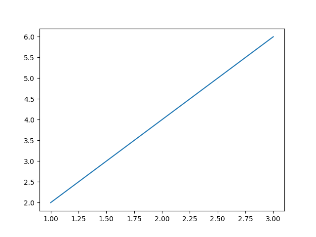
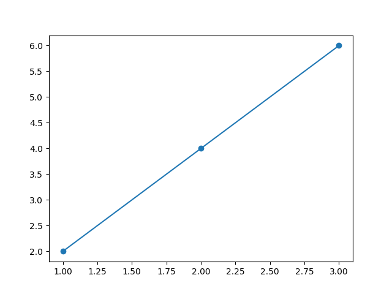
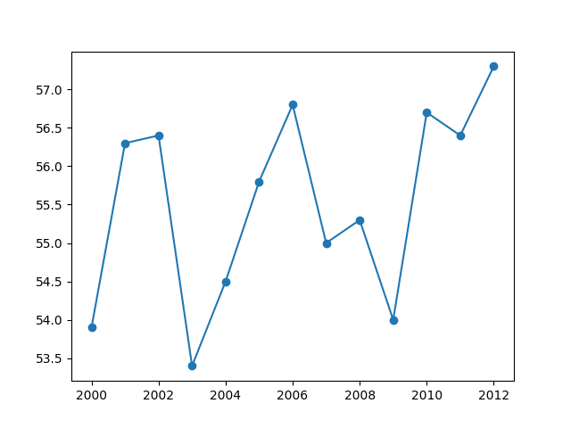
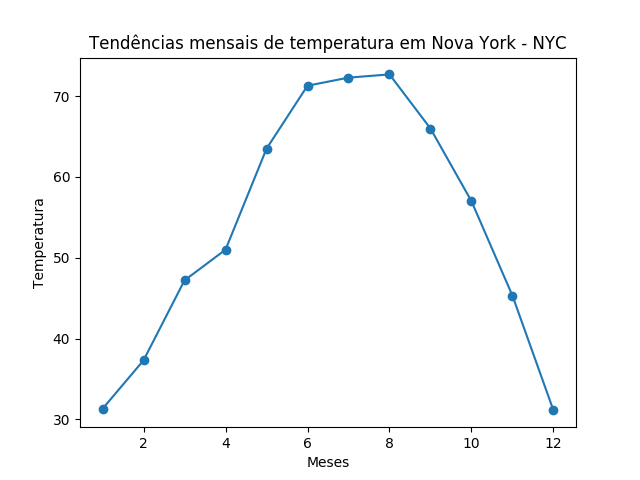
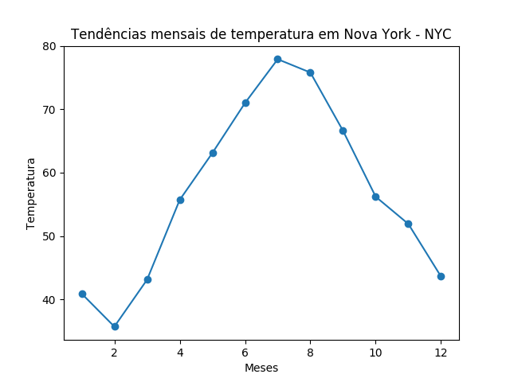
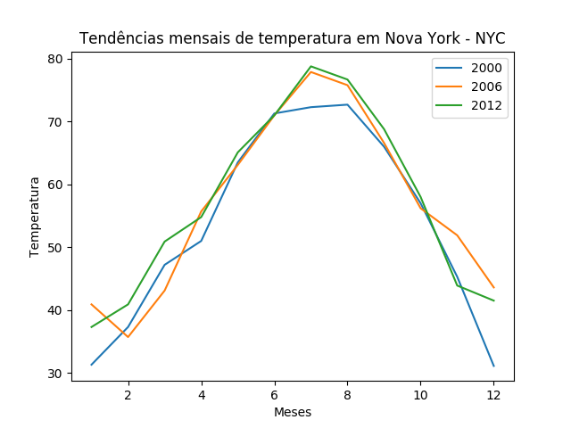

# Visualizando dados com Gráficos

# Contents

 - **PART I - Introdução básica:**
   - [01 - Criando Gráficos com Matplotlib](#01)
   - [02 - Marcando pontos de Intersecção no seu Gráfico](#02)
 - **PART II - Um exemplo Real:**
   - [01 - Representando graficamente a temperatura média anual em Nova York](#03)
   - [02 - Comparando as tendências mensais de temperatura da cidade de Nova York](#04)

# PART I - Introdução básica

<div id='01'></div>

## 01 - Criando Gráficos com Matplotlib

Vamos começar com um gráfico bem simples e com o passar do tutorial vamos adicionando novas funcionalidades:

[plot-v01.py](src/plot-v01.py)
```python
def create_plot(x, y):
  from pylab import plot, show, savefig
  plot(x, y)
  savefig('../images/plot-01.png', format='png')
  show()  

if __name__ =='__main__':
  x_numbers = [1, 2, 3] # Cria uma lista para representar as coordenadas "X".
  y_numbers = [2, 4, 6] # Cria uma lista para representar as coordenadas "Y".

  create_plot(x_numbers, y_numbers)
```

**OUTPUT:**  


Veja que nós temos um plot bem simples, só passamos as coordenadas **x**, **y**, salvamos e exibimos o plot.

<div id='02'></div>

## 02 - Marcando pontos de Intersecção no seu Gráfico

Bem, como já está no título vamos marcar a *intersecção* entre os pontos **x** e **y**. Para marcar o ponto de *intersecção* nós utilizamos o atributo **"marker"** para criar pontos de Intersecção no seu gráfico

[plot-v02.py](src/plot-v02.py)
```python
def create_plot(x, y):
  from pylab import plot, show, savefig
  plot(x, y, marker='o')
  savefig('../images/plot-02.png', format='png')
  show()  

if __name__ =='__main__':
  x_numbers = [1, 2, 3] # Cria uma lista para representar as coordenadas "X".
  y_numbers = [2, 4, 6] # Cria uma lista para representar as coordenadas "Y".

  create_plot(x_numbers, y_numbers)
```

**OUTPUT:**  


**NOTE:**  
O atributo **"marker"** pode receber como argumento: **o**, **`*`**, **x**, ...

# PART II - Um exemplo Real

<div id='03'></div>

## 01 - Representando graficamente a temperatura média anual em Nova York

Agora já imaginou criar um gráfico/plot para representar a **relação** entre as variáveis **anos (years)** e **temperatura média por ano**?

Veja o exemplo abaixo:

[nyc_average.py](src/nyc_average.py)
```python
def create_plot(x, y):
  import matplotlib.pyplot as plt

  # Exibe para cada ano "x" a temperatura média "y".
  for year, average_temp in zip(x, y):
    print("In year {0} the average New York temperature was {1}°".format(year, average_temp))

  plt.plot(x, y, marker='o')
  plt.savefig('../images/plot-03.png', format='png')
  plt.show()


if __name__ =='__main__':
  # Cria uma lista de temperatura de New York durante os anos de 2000-2012.
  nyc_temp = [53.9, 56.3, 56.4, 53.4, 54.5, 55.8, 56.8, 55.0, 55.3, 54.0, 56.7, 56.4, 57.3]

  # Utiliza a função range() para criar uma lista com range predefinido - (2000-2012).
  # OBS: Lembra que a função range() nunca imprime o último elemento? Por isso de 2000-2013
  years = range(2000, 2013)

  # Cria o gráfico/plot com a função create_plot().
  create_plot(years, nyc_temp)
```

**OUTPUT:**  
```python
In year 2000 the average New York temperature was 53.9°
In year 2001 the average New York temperature was 56.3°
In year 2002 the average New York temperature was 56.4°
In year 2003 the average New York temperature was 53.4°
In year 2004 the average New York temperature was 54.5°
In year 2005 the average New York temperature was 55.8°
In year 2006 the average New York temperature was 56.8°
In year 2007 the average New York temperature was 55.0°
In year 2008 the average New York temperature was 55.3°
In year 2009 the average New York temperature was 54.0°
In year 2010 the average New York temperature was 56.7°
In year 2011 the average New York temperature was 56.4°
In year 2012 the average New York temperature was 57.3°
```



Veja que a nossa relação corresponde tanto na saíde de anos **x** e suas respectivas temperaturas **y** com o nosso gráfico/plot.

<div id='04'></div>

## 02 - Comparando as tendências mensais de temperatura da cidade de Nova York

Bem, nós já fizemos uma **relação** entre as variáveis **anos (years)** e **temperatura média por ano**.

> Agora vamos fazer a **relação** entre as variáveis de **meses do ano (x)** e suas respectivas **temperaturas dos meses do ano (y)**.

O código vai mudar pouco, veja a seguir:

[year_average.py](src/year_average.py)
```python
def create_plot(x, *y):
  import matplotlib.pyplot as plt
  image_number = 1

  # Imprime as relações entre meses do ano e suas respectivas temperaturas (por ano "y" dado)
  for actual_month_of_year_y in y:
    for actual_month, actual_temp in zip(x, actual_month_of_year_y):
      print("In Month {0} the average New York temperature was {1}°".format(actual_month, actual_temp))
    print("")
    # Para cada ano, vai ser exibido um plot com a relação entre seus meses e temperaturas.
    plt.plot(x, actual_month_of_year_y, marker='o')
    plt.title('Tendências mensais de temperatura em Nova York - NYC')
    plt.xlabel('Meses')
    plt.ylabel('Temperatura')
    plt.savefig('../images/year-{0}.png'.format(image_number), format='png')
    plt.show()
    image_number += 1

if __name__ =='__main__':

  # Cria uma lista para representar as temperaturas de New York no ano de 2000
  nyc_temp_2000 = [31.3, 37.3, 47.2, 51.0, 63.5, 71.3, 72.3, 72.7, 66.0, 57.0, 45.3, 31.1]

  # Cria uma lista para representar as temperaturas de New York no ano de 2006
  nyc_temp_2006 = [40.9, 35.7, 43.1, 55.7, 63.1, 71.0, 77.9, 75.8, 66.6, 56.2, 51.9, 43.6]

  # Cria uma lista para representar as temperaturas de New York no ano de 2012
  nyc_temp_2012 = [37.3, 40.9, 50.9, 54.8, 65.1, 71.0, 78.8, 76.7, 68.8, 58.0, 43.9, 41.5]

  # Months representation
  months = range(1, 13)

  # Cria o gráfico/plot com a função create_plot().
  create_plot(months, nyc_temp_2000, nyc_temp_2006, nyc_temp_2012)
```

**OUTPUT:**  
```python
In Month 1 the average New York temperature was 31.3°
In Month 2 the average New York temperature was 37.3°
In Month 3 the average New York temperature was 47.2°
In Month 4 the average New York temperature was 51.0°
In Month 5 the average New York temperature was 63.5°
In Month 6 the average New York temperature was 71.3°
In Month 7 the average New York temperature was 72.3°
In Month 8 the average New York temperature was 72.7°
In Month 9 the average New York temperature was 66.0°
In Month 10 the average New York temperature was 57.0°
In Month 11 the average New York temperature was 45.3°
In Month 12 the average New York temperature was 31.1°
```

  

```
In Month 1 the average New York temperature was 40.9°
In Month 2 the average New York temperature was 35.7°
In Month 3 the average New York temperature was 43.1°
In Month 4 the average New York temperature was 55.7°
In Month 5 the average New York temperature was 63.1°
In Month 6 the average New York temperature was 71.0°
In Month 7 the average New York temperature was 77.9°
In Month 8 the average New York temperature was 75.8°
In Month 9 the average New York temperature was 66.6°
In Month 10 the average New York temperature was 56.2°
In Month 11 the average New York temperature was 51.9°
In Month 12 the average New York temperature was 43.6°
```

  

```
In Month 1 the average New York temperature was 37.3°
In Month 2 the average New York temperature was 40.9°
In Month 3 the average New York temperature was 50.9°
In Month 4 the average New York temperature was 54.8°
In Month 5 the average New York temperature was 65.1°
In Month 6 the average New York temperature was 71.0°
In Month 7 the average New York temperature was 78.8°
In Month 8 the average New York temperature was 76.7°
In Month 9 the average New York temperature was 68.8°
In Month 10 the average New York temperature was 58.0°
In Month 11 the average New York temperature was 43.9°
In Month 12 the average New York temperature was 41.5°
```

  

Olha que lindo o nosso código não? Para cada ano ele exibe:
 - As temperaturas dos seus respectivos meses;
 - Um gráfico/plot exibindo a **relação** entre as variáveis **mês** e **temperatura do mês**.

**NOTE:**  
Muito lindo não? Mas, tipo da para criar um gráfico com essas 3 linhas, ou seja, esses 3 anos? Na programação quase tudo é possível né?

Veja o código a seguir:

[complete_graph.py](src/complete_graph.py)
```python
import matplotlib.pyplot as plt

# Cria uma lista para representar as temperaturas de New York no ano de 2000
nyc_temp_2000 = [31.3, 37.3, 47.2, 51.0, 63.5, 71.3, 72.3, 72.7, 66.0, 57.0, 45.3, 31.1]

# Cria uma lista para representar as temperaturas de New York no ano de 2006
nyc_temp_2006 = [40.9, 35.7, 43.1, 55.7, 63.1, 71.0, 77.9, 75.8, 66.6, 56.2, 51.9, 43.6]

# Cria uma lista para representar as temperaturas de New York no ano de 2012
nyc_temp_2012 = [37.3, 40.9, 50.9, 54.8, 65.1, 71.0, 78.8, 76.7, 68.8, 58.0, 43.9, 41.5]

# Months representation
months = range(1, 13)

plt.plot(months, nyc_temp_2000, months, nyc_temp_2006, months, nyc_temp_2012)
plt.legend([2000, 2006, 2012]) # Adiciona legenda para cada ano respectivamente.
plt.title('Tendências mensais de temperatura em Nova York - NYC')
plt.xlabel('Meses')
plt.ylabel('Temperatura')
plt.savefig('../images/plot-05.png', format='png')
plt.show()
```

**OUTPUT:**  


---

**Rodrigo Leite** *- Software Engineer*
