# Statistics, Probability and Financial Math

## Contents

 - **Statistics:**
   - **Descriptive Statistics:**
     - [Motivation to use Descriptive Statistics](#motivation)
     - [Relationship between CRISP-DM methodology and Descriptive Statistics](#crips-dm-rel)
     - [Some types of observations in a Descriptive Analysis](#observations-types)
     - **Types of Variables in Statistics:**
       - [**Qualitative Data (Aka, categorical)**](#qualitative-data)
         - [Nominal data (Are names for some characteristic groups)](#nominal-data)
         - [Ordinal data (Indicate some kind of "inherent order" or "hierarchy")](#ordinal-data)
         - [Binary data (Variables that represents binarization: True/False, Yes/No, 0/1)](#binary-data)
       - [**Quantitative Data (Aka, numerical)**](#quantitative-data)
         - [Continuous data (We measure instead of counting)](#continuous-data)
         - [Discrete data (It's something we count instead of measuring)](#discrete-data)
     - **Frequency Distribution:**
       - [Frequency](#intro-to-frequency)
       - [Relative Frequency](#intro-to-relative-frequency)
       - [Cumulative Relative Frequency](#intro-to-cumulative-relative-frequency)
       - **Frequency Distribution for Qualitative Variables:**
         - [Creating a frequency table for categorical variables](#frequency-table-categorical-variables)
         - [Formula to calculate absolute and relative frequency table](#calculate-absolute-relative)
         - [Relative frequency observation](#relative-frequency-observation)
         - [Visualizing a frequency table with "Bar Chart"](#ft-w-bar-graph)
         - **Comparing the Relationship between Qualitative Variables:**
           - [Frequency table for two categorical variables](#ft-two-cv)
           - [Create a "Bar Chart" for two categorical variables](#cbcftcv)
       - **Frequency Distribution for Quantitative Variables:**
         - [Frequency Table for Quantitative Variables](#ft-for-qv)
         - [Creating a "histogram" for Quantitative Variables](#histogram-for-qv)
   - **Statistics - Tips & Tricks:**
     - [Population vs. Sample](#pop-vs-sample)
 - **Probability:**
   - **Phenomenon types in Probability:**
     - [Deterministic Phenomenon](#deterministicf)
     - [Random Phenomenon (Non-Deterministic)](#randomf)
   - [Sample Space (Ω)](#sample-space)
   - [Sample Points (ω)](#sample-point)
   - [Events (A, B, C, ...., Z)](#events)
     - [Complement of an Event](#complement-of-an-event)
     - **Operations with Events:**
       - [Empty Set](#empty-set)
       - [Union](#union-set)
       - [Intersection](#intersection-set)
       - [Disjoint (Mutually Exclusive)](#disjoint)
       - [Complement of a Sets](#complement-set)
       - **Practice Problems on Operations with Events:**
         - [Roll a die](#oweq-toss-a-dice)
   - [Probability Axioms (definition)](#probability-axioms)
   - [Bias](#intro-to-bias)
   - **Conditional Probability and Dependence (Types of Events):**
     - [Independent Events (Events that are not affected by other events)](#independent-events)
     - [Dependent Events (Events that are conditional on other events)](#dependent-events)
     - [Mutually Exclusive Events (Events that can't occur together)](#mutually-exclusive-events)
 - **Financial Math:**
   - [**Percents:**](#percents)
   - [Finding the percentage of a part $(\frac{part}{whole} \times 100)$](#percentage-part)


     - [Decimals to Percents (Move the decimal point 2 places to the right / →)](#decimals-to-percents)
     - [Percents to Decimals (Move the decimal point 2 places to the left / ←)](#percents-to-decimals)
     - **Percents - Tips & Tricks:**
       - [Percentages calculus are Symmetry (or Bidirectional)](#percentages-calculus-symmetry)
     - **Percentages Questions:**
       - [Apples percentage question](#apple-question)
 - [**Settings**](#settings)
 - [**REFERENCES**](#ref)


<!--- ( Statistics/Descriptive Statistics ) --->

---

<div id="motivation"></div>

## Motivation to use Descriptive Statistics

To start with **Descriptive Statistics**, let's get started with the follow problem. Imagine we have some **x<sub>n</sub>** and **y<sub>n</sub>** variables:

  

**NOTE:**  
Looking at the data above, it's hard to understand the patterns and the relationship between these variables.

> **NOTE:**  
> The **Descriptive Statistics** focus on visual approaches to see these patterns and relationship more easily.

For example, see the visual approach below:

  

> **NOTE:**  
> See that easier to find patterns and relationships between variables visually.

---

<div id="crips-dm-rel"></div>

## Relationship between CRISP-DM methodology and Descriptive Statistics

The **Descriptive Statistics** focus specifically on **step 2 (data understanding)** and **step 3 (data preparation)** in **CRISP-DM methodology**:

  

---

<div id="observations-types"></div>

## Some types of observations in a Descriptive Analysis

 - Investigate the **behavior** of a variable.
 - Examine the **relationship** between variables.
 - Emphasize **sorting/classification** elements/categories.
 - Understand the **organizational** structure of elements/categories.
 - Explore the **chronological** evolution of a variable.
 - Reveal **spatial** patterns in the data.
 - Describe the **connection** between elements/categories.

---

<div id="qualitative-data"></div>

## Qualitative Data (aka, categorical)

> This **type of data is categorical** - It is used to **categorize** or **identify** the **entity** being observed.

---

<div id="nominal-data"></div>

### Nominal data (Are names for some characteristic groups)

You can see some **nominal data** in the images below:

  
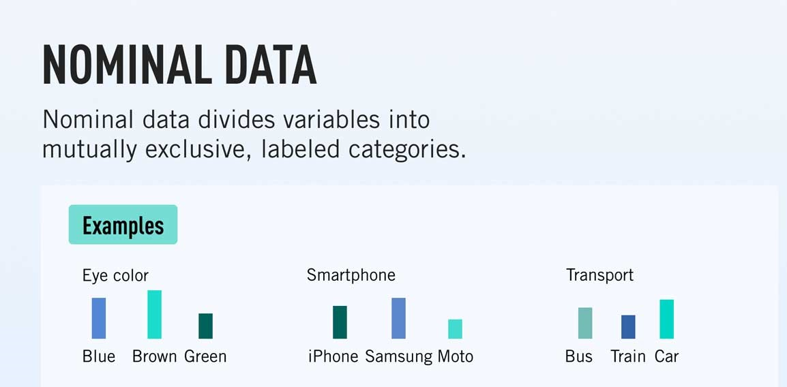  

**NOTE:**  
See we have categorical groups, however, this group doesn't *inherent order*, *ranking* or *sequence*. 

> **NOTE:**  
> Just represents characteristic groups.

---

<div id="ordinal-data"></div>

### Ordinal data (Indicate some kind of "inherent order" or "hierarchy")

  
  

---

<div id="binary-data"></div>

### Binary data (Variables that represents binarization: True/False, Yes/No, 0/1)

How description says, the **binary data are variables that represent binarization**:

 - **True** or **False**
 - **Yes** or **No**
 - **1** or **0**

---

<div id="quantitative-data"></div>

## Quantitative Data (Aka, numerical)

Now let's turn our attention to features that indicate some kind of:

 - Amount.
 - Measure.

---

<div id="continuous-data"></div>

## Continuous data (We measure instead of counting)

  

**NOTE:**  
We also say that **Continuous data** are:

> **Infinite** values from **an interval**.

For example:

 - **The income:**
   - per month of investment.
 - **Consumption:**
   - energy per month.

**NOTE:**  
See we have **infinite** values from **an interval**.

---

<div id="discrete-data"></div>

## Discrete data (It's something we count instead of measuring)

  

**NOTE:**  
We also say that **Discrete data** are:

> **Finite** values from **an interval**.

For example:

 - **Products sold:**
   - per day.
 - **Goals:**
   - By match.
 - **Passengers:**
   - per flight
 - **Eggs Broken:**
   - by dozen

**NOTE:**  
See we have some ranges like **day**, **match**, **flight** and **dozen** and our discrete variables are in this ranges.

---

<div id="intro-to-frequency"></div>

## Frequency

Twenty students were asked how many hours they worked per day. Their responses, in hours, are as follows:

```python
5, 6, 3, 3, 2, 4, 7, 5, 2, 3, 5, 6, 5, 4, 4, 3, 5, 2, 5, 3.
```

The **Frequency Table** for our example is:

  

 - A **frequency** is the *number of times* a *value of the data occurs*.
 - The **sum of the values in the "frequency" column**, 20, **represents the total number of students included in the sample**:

---

<div id="intro-to-relative-frequency"></div>

## Relative Frequency

> A **Relative Frequency** is the **ratio (fraction or proportion)** of the number of times a value of the data occurs in the set of all outcomes to the total number of outcomes.

For example, to our student table to find the **relative frequencies**:

 - Divide each frequency;
 - By the total number of students in the sample, in this case, 20.

  

**NOTE:**  

 - See that each **Relative Frequency** represents the frequency percent (%) in the set of outcomes.
 - The sum of each **Relative Frequency** is always 100% of the data.

---

<div id="intro-to-cumulative-relative-frequency"></div>

## Cumulative Relative Frequency

> The **Cumulative relative frequency** is the accumulation of the previous relative frequencies.

To find the **cumulative relative frequencies**, add all the previous relative frequencies to the relative frequency for the current row, as shown in table below:

  

---

<div id="frequency-table-categorical-variables"></div>

## Creating a frequency table for categorical variables

To understand how create a **frequency table** for categorical variables imagine we have the following data to analyze:

  

To understand how to create a frequency table first, let's sorting **"Area"** variable:


See that the categorical variable **"Area"** has some categories:

 - Biolog (2 samples)
 - Eng (3 samples)
 - Exatas (2 samples)
 - Humanas (1 sample)
 - Sociais (2 samples)

There are two approach to create a frequency table:

 - **Absolute Frequency:**
   - Total for each category.
 - **Relative Frequency:**
   - Percentage of each category.

For example, see the frequency table below, referent to our **Area variable**:

  

Remember that to obtain the Relative Frequency we:

 - Divide the Absolute Frequency;
 - By the total number of samples (10).

---

<div id="calculate-absolute-relative"></div>

## Formula to calculate absolute and relative frequency table

To calculate **absolute** and **relative frequency table** we can use the following formulas: 


---

<div id="relative-frequency-observation"></div>

## Relative frequency observation

See that relative frequency never pass from **1.0** (that's 100% data).

  

> **NOTE:**  
> The **range of relative frequency** is always from **0.00 (0% data)** to **1.00 (100% data)**.

For example, to see which percent represent each category take relative frequency and multiply per 100 (100%):

  

> **NOTE:**  
> See that **"Eng" category** represents **30%** of the data.

---

<div id="ft-w-bar-graph"></div>

## Visualizing a frequency table with "Bar Chart"

> One of the most common graphs to analyze qualitative (categorical) variables is a Bar graph.

For example, see the **Bar graph** below representing our categorical variable **Area**:

  

 - **The axis-x:**
   - Represent the category.
 - **The axis-y:**
   - Represent how many time each category appears.
   - Range 0 to 250.

We also can represent graph bar for categorical variables horizontal:

  

This approach is advised when:

 - You have very large variables names.
 - Many categories to analyze.

**NOTE:**  
That's because when each of the above cases happens the variable names overlap.

---

<div id="ft-two-cv"></div>

## Frequency table for two categorical variables

Sometimes we need to compare the relationship between categorical variables. For example, imagine we need to compare the relationship between **"Area"** and **"Email"** variables:

  

To create a *Frequency Table* for the **“Area”** and **“Email”** variables, we need to see the combinations between these variables:

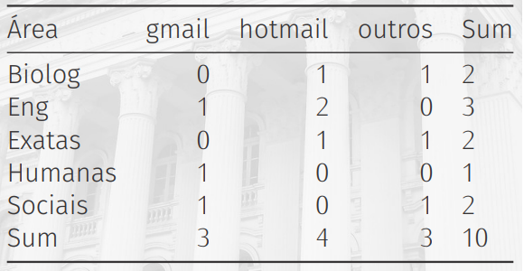  

See that:

 - The rows represent the **"Area"** variable.
 - The columns represent the **"Email"** variable.
 - The table is an **"Absolute Frequency Table"**.

**NOTE:**  
If you pay attention, you can see that the table has the sum of frequencies on the sides:

  

See that:

 - We also have two marginal frequencies on the sides.
 - And a *total frequency*.

**NOTE:**  
You can also see this representation as an **"Adjacency Matrix"**:


> Ok, but how do I convert this **Absolute Frequency Table** to a **Relative Frequency Table**?

**NOTE:**
Easy, just divide each combination between **"Area"** and **"Email"** variables by *total of frequencies*:

  

---

<div id="cbcftcv"></div>

## Create a "Bar Chart" for two categorical variables

A common approach to compare categorical variables is to use a **Bar Chart**:

  

---

<div id="ft-for-qv"></div>

## Frequency Table for Quantitative Variables

 - To create a Frequency Table for Quantitative variables, first, we need to separate the values into classes (groups).
 - This is because, when a variable is quantitative, not necessary the values repeat:
   - **NOTE:** Even more when the variable is continuous (We measure instead of counting).

Knowing this, we need to group values into classes to create a Frequency Table. For example, see the image below:

  

 - See that we have many groups of classes separated by range.
 - Each **y<sub>n<sub>** range represents a group of class:
   - See that each group has some values.

For example, let's go count how many values appear in each  class group **y<sub>n<sub>**:

  

> **This groups range is what we know as "class amplitude (or Class Range/Interval)".**

Now, imagine we have the follow table to create a frequency table:

  

> **NOTE:**  
> The quantitative variable **CH** represent the **workload (carga horária)**.

Now, let's create a **"class amplitude (or Class Range/Interval)"** to generate a Frequency Table.

> **NOTE:**  
> However, first, let's sort the data.

```python
150   180   200   225   240   240   270   300   480   500
```

Now, some information:

 - **Data numbers:** 10
 - **Lower value:** 150
 - **Highest value:** 500
 - **Amplitude (Range/Interval):** 350
   - To calculate the *Amplitude (Range/Interval)* subtract the **"highest value"** by **"lower value"**: `500 - 150 = 350`
 - **Class Amplitude (Range/Interval):**
   - Some value to multiply by the *"amplitude"*.

---

<div id="histogram-for-qv"></div>

## Creating a "histogram" for Quantitative Variables

> To analyze *"Quantitative Variables"*, one of the most common charts is a **"Histogram"**.

For example, see the **"histogram"** below for our **"CH"** Quantitative Variable:

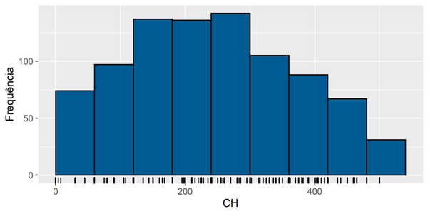  

 - See that different from **"Bar Chart"** the **Histogram** has not interval between the bars.
 - That makes sense because quantitative variables have not an interval:
   - Even more when the variable is continuous (We measure instead of counting).

> **NOTE:**  
> However, depend you problem, you can also  make a **"Histogram"** by the interval:


<!--- ( Statistics/Statistics - Tips & Tricks ) --->

---

<div id="pop-vs-sample"></div>

## Population vs. Sample

Briefly (resumidamente):

 - **Population:**
   - A **"population"** is a set of sample units *(e.g. people, objects, transactions or events)* that we are interested in studying.
 - **Sample:**
   - A **"sample"** is a subset of the sample units of a population.  

See the image below to understand more easily:

  


<!--- ( Probability/Phenomenon types in Probability ) --->

---

<div id="deterministicf"></div>

## Deterministic Phenomenon

We say that a **Phenomenon (experiment) is deterministic** when repeated many times on same (or similar) condition, leads an outcome (result) essentially identical.

For example:

 - Gravity acceleration.
 - Some physical (classical mechanics) or chemistry laws.

> **In general, are things that you repeat under (sob) the same condition, generate always the same results.**

**NOTE:**  
In *mathematics* we say that a **Phenomenon is Deterministic** when, for a given entry in the system, all its results are always the same.

---

<div id="randomf"></div>

## Random Phenomenon (Non-Deterministic)

The **phenomenon (experiment)** obtained under (sob) the same condition that generates different outcomes are called **"Random Phenomenon (experiment)"**.

For example:

 - Roll a die (or similar).
 - Sportive event results.
 - Climatic conditions for the next Sunday.

**NOTE:**  
In *mathematics* we say that a **Phenomenon is Non-Deterministic (Random)** when, for a given entry in the system, its results vary uncertainly. For example, when tossing a coin, the upward tossing process can be repeated, but the result (heads or tails) varies in an unpredictable way.


<!--- ( Probability/Sample Space (Ω) ) --->

---

<div id="sample-space"></div>

## Sample Space (Ω)

The **sample space** is:

> **A set of all possible outcomes (results) of a *Random  Experiment*.**

**SAMPLE SPACE NOTATION:**  
To denote the sample space we'll use the **omega (Ω)** Greek letter.

**NOTE:**  
This sample space can contain a **"finite"** or **"infinite"** number of sample points.

Examples of **"Sample Spaces"** are:

 - **Flip a coin:**
   - *Sample space (Ω):* {heads, tails}
 - **Rolling a die:**
   - *Sample space (Ω):* {1, 2, 3, 4, 5, 6}

Now, imagine we *rolling two dice simultaneously*, the **Sample Space (Ω)** will be:

  

We can also represent it as tuples:


**NOTE:**  
See that we have 36 (6x6=36) possible outcomes (results).


<!--- ( Probability/Sample Points (ω) ) --->

---

<div id="sample-point"></div>

## Sample Points (ω)

> The elements that compose a *sample space (Ω)* are called **Sample Points**.

**SAMPLE POINTS NOTATION:**  
To denote *"a single sample"* point we use lowercase Greek letter **Omega (ω)**.

For example:

 - **Flip (toss) a coin:**
   - **Sample Space (Ω):**
     - {heads, tails}
   - **Sample Points (ω):**
     - ω<sub>1</sub> = heads, ω<sub>2</sub> = tails

> **NOTE:**  
> For example, when analyzing a *chart* with all  experiment samples *(sample space Ω)*, a *sample point (ω)* could be *"a single point on the chart"*.


<!--- ( Probability/Events ) --->

---

<div id="events"></div>

## Events (A, B, C, ...., Z)

> All outcome or subset of outcomes from a Random Experiment is an **Event**.

**EVENT NOTATION:**  
To denote Events from a sample space (Ω) we use upper letters: **A**, **B**, **C**,...., **Z**.

Some **"Events"** examples can be:

 - **Flip (toss) a coin:**
   - **Sample Space (Ω):** {heads, tails}
   - **Sample Points (ω):** ω<sub>1</sub> = heads, ω<sub>2</sub> = tails
   - **Event:** A = "Heads face", B = "Tails face".
 - **Roll a die:**
   - **Sample Space (Ω):** {1, 2, 3, 4, 5, 6}
   - **Sample Points (ω):** ω<sub>1</sub> = 1, ω<sub>2</sub> = 2, ω<sub>3</sub> = 3, ω<sub>4</sub> = 4, ω<sub>5</sub> = 5, ω<sub>6</sub> = 6.
   - **Event:** A = "Even", B = "Odd" 

---

<div id="complement-of-an-event"></div>

## Complement of an Event

> The **complement of an event** is **"the set of sample points that do *not* result in the event"**.

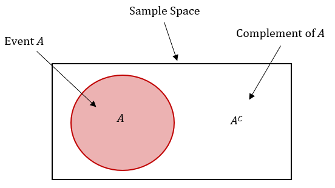  

For example, consider rolling two dice simultaneously:

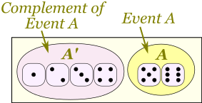

---

<div id="empty-set"></div>

## Empty Set

> It is the set without elements, denoted by **0 (zero)**.


---

<div id="union-set"></div>

## Union

> It is the Event that consists of the **Union of all the sample points** of the events that compose it.

We call the *Union* of event **A** with event **B** by **AUB**:

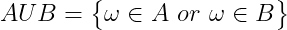  
  

**NOTE:**  
See that by definition a **sample point (ω)** can:

 - Belongs (pertencer) to Event **A**.
 - Belongs (pertencer) to Event **B**.
 - Or can belongs under (ao) Events **A** and **B** simultaneously.

---

<div id="intersection-set"></div>

## Intersection

> It is the Event composed of the sample points common to the Events that compose it.


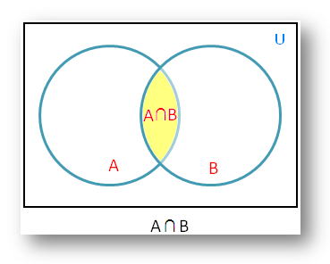

**NOTE:**  
See that different of the Union, the intersection is composed of all common sample points in all Events.

> **NOTE:**  
> That is, the sample points that appear simultaneously in Events **A** and **B**.

---

<div id="disjoint"></div>

## Disjoint (Mutually Exclusive)

Are **Events** that have **null Intersection**, that is:


 - In logic and probability theory, two events (or propositions) are **mutually exclusive** or **disjoint** if they cannot both occur at the same time:
   - A clear example is the set of outcomes of a single coin toss, which can result in either heads or tails, but not both.

---

<div id="complement-set"></div>

## Complement of a Sets

**Complement of a set A (Event A)**, denoted by **A<sup>c</sup>**, is the set of all elements that:

 - Belongs (pertencem) to sample space.
 - But does not belong (pertencem) to set A (Event A).

 

**NOTE:**  
That is, they are part of the sample space, but do not belong to Event A.

<!--- ( Probability/Operations with Events/Questions ) --->

---

<div id="oweq-toss-a-dice"></div>

## Roll a die

Consider the experiment of **"roll a die"** and the Events are:

 - A = {1, 2, 3, 4}
 - B = {ω : ω <=3}
 - C = "Even face"
 - D = "Prime face"

Now we have to solve the following **"Events operations"**:

 - **UNION:**
   - **AUB =** {1, 2, 3, 4} *or* {1, 2, 3} = {1, 2, 3, 4}
   - **AUC =** {1, 2, 3, 4} *or* {2, 4, 6} = {1, 2, 3, 4, 6}
   - **AUD =** {1, 2, 3, 4} *or* {2, 3, 5} = {1, 2, 3, 4, 5}
 - **INTERSECTION:**
   - **A∩B =** {1, 2, 3, 4} *and* {1, 2, 3} = {1, 2, 3}
   - **A∩C =** {1, 2, 3, 4} *and* {2, 4, 6} = {2, 4}
   - **A∩D =** {1, 2, 3, 4} *and* {2, 3, 5} = {2, 3}
 - **COMPLEMENT OF A SETS:**
   - **A<sup>c</sup> =** {5, 6}
   - **B<sup>c</sup> =** {ω : ω > 3}
   - **C<sup>c</sup> =** {1, 3, 5}
   - **D<sup>c</sup> =** Knowing that D = {2, 3, 5}, then D<sup>c</sup> = {1, 4, 6}


<!--- ( Probability/Axioms (Definition) ) --->

---

<div id="probability-axioms"></div>

## Probability Axioms (definition)

To express a probability, we use:

 - An **upper-case "P"** to *indicate probability*:
   - E.g. `P()`
 - And an **upper-case letter (A, B, C,....)** to *represent the Event*:
   - e.g. `A`

For example, to express the probability of throwing a 7 as an event called **"A"**, we could write:

$P(A) = 0.167$

> Briefly, **Probability is a function P()** that **attributes numerical values to "Events" of the "Sample Space (Ω)"** follow some *rules*.

Now, let's see what are these **rules (axioms)**.

 - **FIRST AXIOM: 0 <= P(A) <= 1, ∀A ∈ Ω:**
   - The first axiom tells us that given a function **P()** that receives an **Event "A"**, the value (probability) to this Event must be:
     - Higher or equal zero:
       - 0 <= P(A)
     - Less or equal one:
       - P(A) <= 1 
   - To all Event (∀) "A" that belongs under sample space (Ω):
     - ∀A ∈ Ω
 - **SECONT AXIOM: P(Ω) = 1:**
   - The second axiom tells us that the probability to happen (acontecer) *omega (Ω)* is 1.
   - **NOTE:** That is, some Event inside sample (Ω) space will happen (vai acontecer).

Knowing this, the *Probability* is a value between **"0"** and **"1"** that indicates the probability of a certain *Event*:

 - **"0"** meaning that *"the event is impossible"*.
 - **"1"** meaning that *"the event is inevitable"*.

In general terms, it's calculated like this:

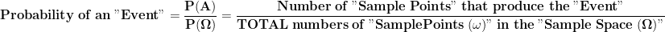  
<!--- 
\mathbf{
Probability \ of \ an \ "Event" = \frac{P(A)}{P(\Omega)} = \frac{Number \ of \ "Sample \ Points" \ that \ produce \ the \ "Event"}{TOTAL \ numbers \ of \ "Sample Points (\omega)" \ in \ the \ "Sample \ Space \ (\Omega)"}
}
--->


<!--- ( Probability/Bias ) --->

---

<div id="intro-to-bias"></div>

## Bias

> Often (Muitas vezes), the **Sample Points (ω)** in the **Sample Space (Ω)** do not have the same probability, so there is a **"bias"** that makes one outcome more likely than another.

For example, suppose your local weather forecaster indicates the predominant weather for each day of the week like this:

<table>
<tr><td style='text-align:center'>Mon</td><td style='text-align:center'>Tue</td><td style='text-align:center'>Wed</td><td style='text-align:center'>Thu</td><td style='text-align:center'>Fri</td><td style='text-align:center'>Sat</td><td style='text-align:center'>Sun</td></tr>
<tr style='font-size:32px'><td>&#9729;</td><td>&#9730;</td><td>&#9728;</td><td>&#9728;</td><td>&#9728;</td><td>&#9729;</td><td>&#9728;</td></tr>
</table>

This forceast is pretty typical for your area at this time of the year. In fact, historically the weather is sunny on **60%** of days, cloudy on **30%** of days, and rainy on only 10% of days. On any given day, the sample space for the weather contains 3 sample points (sunny, cloudy, and rainy); *"*but the probabities for these sample points are not the same*"*.

If we assign:

 - The letter **"A"** to a sunny day event.
 - **"B"** to a cloudy day event.
 - And **"C"** to a rainy day event.

Then we can write these probabilities like this:

 - **P(A) =** *0.6*
 - **P(B) =** *0.3*
 - **P(C) =** *0.1*


<!--- ( Probability/Conditional Probability and Dependence (Types of Events) ) --->

---

<div id="independent-events"></div>

## Independent Events (Events that are not affected by other events)

> Coming soon...

---

<div id="dependent-events"></div>

## Dependent Events (Events that are conditional on other events)

> Coming soon...

---

<div id="mutually-exclusive-events"></div>

## Mutually Exclusive Events (Events that can't occur together)

> Coming soon...


<!--- ( Financial Math/Percents ) --->

---

<div id="percents"></div>

## Percents

> When we say **"Percent"** we are really saying **"per 100"**.

For example, one percent (1%) means 1 per 100:

  

To understand more easily, let's take a look at the examples below:

**50% means 50 per 100:**
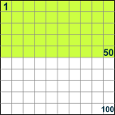  

**25% means 25 per 100:**


Because **"Percent"** means **"per 100"** think:

> **"This should be divided by 100"**

**NOTE:**  
So, **75%** really means $\frac{75}{100}$.

---

<div id="percentage-part"></div>

## Finding the percentage of a part $(\frac{part}{whole} \times 100)$

To determine the percentage of a number, we need to:

 - Divide the *"given value (part)"*;
 - By the *"total value (whole)"*;
 - And then *"multiply the resultant by 100"*.

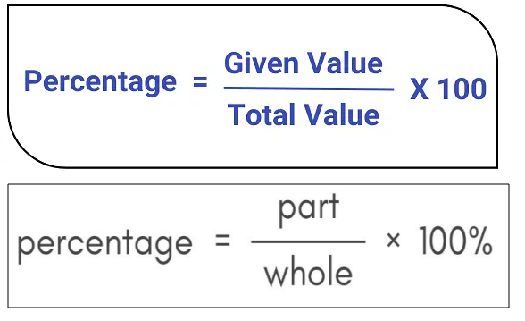  

For example, imagine we have *200 apples* and *10* of them are bad...

> **What is the percentage those 10 apples represent?**

Using our formula we have:

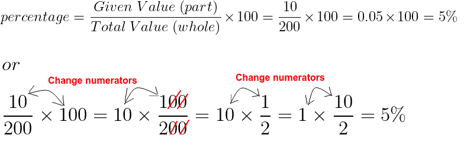  

---

<div id=""></div>

## x

x


Imagine we have 200 apples...

> ***15%* of *200* apples are bad. How many apples are bad?**

  

**NOTE:**  
So, 30 apples are bad.


  


---

<div id="decimals-to-percents"></div>

## Decimals to Percents (Move the decimal point 2 places to the right / →)

> To convert from decimal to percentage, we need to **"multiply the decimal number by 100** and **add the “%” sign**.

For example:

  

**NOTE:**  
Another easy way to multiply by 100 is to move the decimal point 2 places to the right. For example:

  
**Move the decimal point 2 places to the right (and add the "%" sign!)**

**Example-01: Convert 0.35 to percent**  
```md
0.35 → 3.5 (zero here is removed) → 35.
Answer 0.35 = 35%
```

**Example: Convert 0.985 to percent**  
```md
0.985 → 9.85 (zero here is removed) → 98.5
Answer 0.985 = 98.5%
```

**Example: Convert 1.2 to percent**
```md
1.2 → 12. → 120.
Answer 1.2 = 120%

NOTE: See that here we had to adds a zero and not remove it.
```

---

<div id="percents-to-decimals"></div>

## Percents to Decimals (Move the decimal point 2 places to the left / ←)

> To convert from percentage to decimal, we need to **divide the percentage (%) by 100** and **remove the “%” sign**.

For example, let's convert **75%** to decimal:

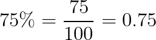  

**NOTE:**  
Another easy way to divide by 100 is to move the decimal point 2 places to the left. For example:

  
**Move the decimal point 2 places to the left, and remove the *"%"* sign.**  

**Example-01: Convert 8.5% to decimal**  
```md
8.5 → 0.85 → 0.085
```

**NOTE:**  
Note how we inserted an extra **"0"** as needed. So, the answer is **8.5% = 0.085**.

**Example-02: Convert 250% to decimal**  
```md
Move the decimal point two places to the left:
250. → 25. (zero here is removed, that's, not use 25.0) → 2.5
```

So, the answer is **250% = 2.5**.

---

<div id="percentages-calculus-symmetry"></div>

## Percentages calculus are Symmetry (or Bidirectional)

This little rule can make some percentage calculations easier:

**x% of y = y% of x**

For example:

 - **8% of 50** is the same as **50% of 8**:
   - If **50%** of **8** is **4**.
   - So, **8% of 50** is also **4**.

---

<div id="apple-question"></div>

## Apples percentage question


<!--- ( Settings ) --->

---

<div id="settings"></div>

## Settings

**CREATE VIRTUAL ENVIRONMENT:**  
```bash
python -m venv math-environment
```

**ACTIVATE THE VIRTUAL ENVIRONMENT (LINUX):**  
```bash
source math-environment/bin/activate
```

**ACTIVATE THE VIRTUAL ENVIRONMENT (WINDOWS):**  
```bash
source math-environment/Scripts/activate
```

**UPDATE PIP:**
```bash
python -m pip install --upgrade pip
```

**INSTALL PYTHON DEPENDENCIES:**  
```bash
pip install -U -v --require-virtualenv -r requirements.txt
```

**Now, Be Happy!!!** 😬


<!--- ( REFERENCES ) --->

---

<div id="ref"></div>

## REFERENCES

 - **Statistics:**
   - **Descriptive Statistics:**
     - [Essential Math for Machine Learning: Python Edition](https://learning.edx.org/course/course-v1:Microsoft+DAT256x+2T2018/home)
     - [Stratified Sampling in Pandas (With Examples)](https://www.statology.org/stratified-sampling-pandas/)  
     - [8 Types of Sampling Techniques](https://towardsdatascience.com/8-types-of-sampling-techniques-b21adcdd2124)  
     - [ESTATÍSTICA BÁSICA](http://www.leg.ufpr.br/~paulojus/estbas/)
 - **Probability:**
   - [Essential Math for Machine Learning: Python Edition](https://learning.edx.org/course/course-v1:Microsoft+DAT256x+1T2019a/home)
   - [ESTATÍSTICA BÁSICA (DEST/UFPR)](http://www.leg.ufpr.br/~paulojus/estbas/)
   - [5.3: How to Calculate Classical Probability](https://stats.libretexts.org/Bookshelves/Introductory_Statistics/Inferential_Statistics_and_Probability_-_A_Holistic_Approach_(Geraghty)/05%3A_Probability/5.03%3A_How_to_Calculate_Classical_Probability)
 - **Financial Math:**
   - **Percents:**
     - [Percent example](https://www.instagram.com/p/Cw0qpWVPA46/)
     - [Percents (%)](https://www.mathsisfun.com/percentage.html)
     - [Convert Percents to Decimals](https://www.mathsisfun.com/converting-percents-decimals.html)
     - [Convert Decimals to Percents](https://www.mathsisfun.com/converting-decimals-percents.html)

---

Ro**drigo** **L**eite da **S**ilva - **drigols**
