# Descriptive Statistics

## Contents

 - **Introduction to Descriptive Statistics:**
   - [Motivation to use Descriptive Statistics](#motivation)
   - [Relationship between CRISP-DM methodology and Descriptive Statistics](#crips-dm-rel)
   - [Some types of observations in a Descriptive Analysis](#observations-types)
 - **Types of Variables in Statistics:**
   - [**Qualitative Data (Aka, categorical)**](#qualitative-data)
     - [Nominal data (Are names for some characteristic groups)](#nominal-data)
     - [Ordinal data (Indicate some kind of "inherent order" or "hierarchy")](#ordinal-data)
     - [Binary data (Variables that represents binarization: True/False, Yes/No, 0/1)](#binary-data)
   - [**Quantitative Data (Aka, numerical)**](#quantitative-data)
     - [Continuous data (We measure instead of counting)](#continuous-data)
     - [Discrete data (It's something we count instead of measuring)](#discrete-data)
 - [**Frequency Distribution:**](#frequency-distribution)
   - [Frequency](#intro-to-frequency)
   - [Relative Frequency](#intro-to-relative-frequency)
   - [Cumulative Relative Frequency](#intro-to-cumulative-relative-frequency)
   - **Frequency Distribution for Qualitative Variables:**
     - [Creating a frequency table for categorical variables](#frequency-table-categorical-variables)
     - [Formula to calculate absolute and relative frequency table](#calculate-absolute-relative)
     - [Relative frequency observation](#relative-frequency-observation)
     - [Visualizing a frequency table with "Bar Chart"](#ft-w-bar-graph)
     - **Comparing the Relationship between Qualitative Variables:**
       - [Frequency table for two categorical variables](#ft-two-cv)
       - [Create a "Bar Chart" for two categorical variables](#cbcftcv)
   - **Frequency Distribution for Quantitative Variables:**
     - [Frequency Table for Quantitative Variables](#ft-for-qv)
     - [Creating a "histogram" for Quantitative Variables](#histogram-for-qv)
 - [**Measures of Position/Location:**](#measures-of-position-location)
   - [Mean](#intro-to-mean)
     - [Alumni (ex-alunos) problem](#alumni-mean-problem)
     - [Data distribution (variability) problem on the mean](#ddbotm)
   - [Median](#intro-to-median)


 - [**Settings**](#settings)
 - [**REFERENCES**](#ref)


<!--- ( Introduction to Descriptive Statistics ) --->

---

<div id="motivation"></div>

## Motivation to use Descriptive Statistics

To start with **Descriptive Statistics**, let's get started with the follow problem... Imagine we have some **x<sub>n</sub>** and **y<sub>n</sub>** variables:

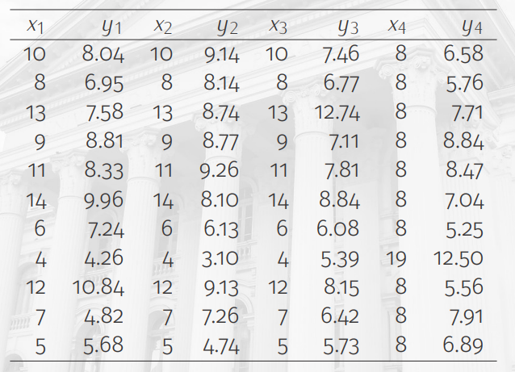  

**NOTE:**  
Looking at the data above, it's hard to understand the patterns and the relationship between these variables.

> **NOTE:**  
> The **Descriptive Statistics** focus on visual approaches to see these patterns and relationship more easily.

For example, see the visual approach below:

  

> **NOTE:**  
> See that easier to find patterns and relationships between variables visually.

---

<div id="crips-dm-rel"></div>

## Relationship between CRISP-DM methodology and Descriptive Statistics

The **Descriptive Statistics** focus specifically on **step 2 (data understanding)** and **step 3 (data preparation)** in **CRISP-DM methodology**:

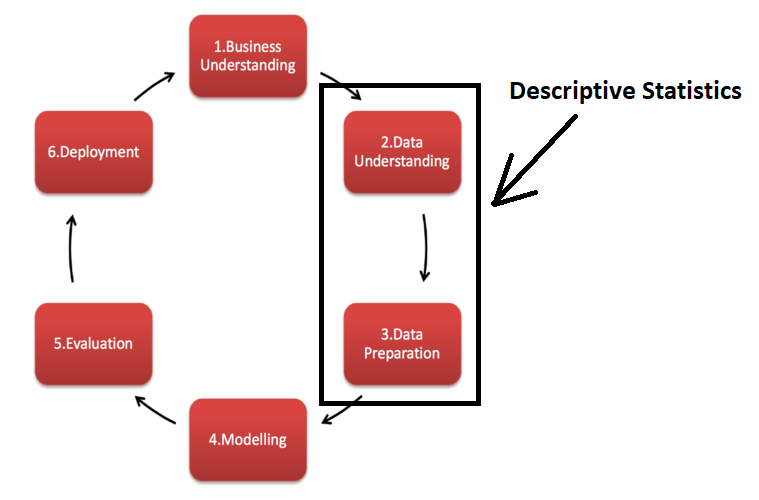  

---

<div id="observations-types"></div>

## Some types of observations in a Descriptive Analysis

 - Investigate the **behavior** of a variable.
 - Examine the **relationship** between variables.
 - Emphasize **sorting/classification** elements/categories.
 - Understand the **organizational** structure of elements/categories.
 - Explore the **chronological** evolution of a variable.
 - Reveal **spatial** patterns in the data.
 - Describe the **connection** between elements/categories.


<!--- ( Types of Variables in Statistics/Qualitative Data (Aka, categorical) ) --->

---

<div id="qualitative-data"></div>

## Qualitative Data (aka, categorical)

> This **type of data is categorical** - It is used to **categorize** or **identify** the **entity** being observed.

---

<div id="nominal-data"></div>

### Nominal data (Are names for some characteristic groups)

You can see some **nominal data** in the images below:

  
  

**NOTE:**  
See we have categorical groups, however, this group doesn't *inherent order*, *ranking* or *sequence*. 

> **NOTE:**  
> Just represents characteristic groups.

---

<div id="ordinal-data"></div>

### Ordinal data (Indicate some kind of "inherent order" or "hierarchy")

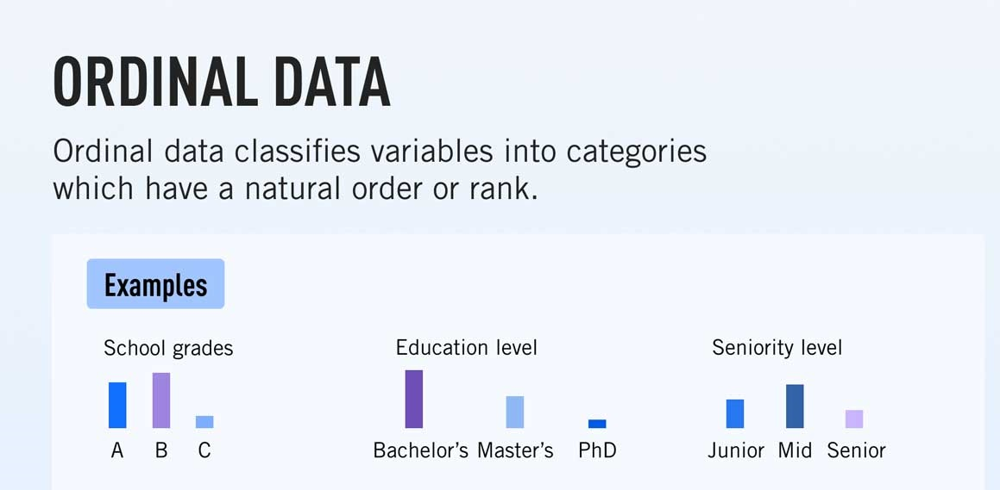  
  

---

<div id="binary-data"></div>

### Binary data (Variables that represents binarization: True/False, Yes/No, 0/1)

How description says, the **binary data are variables that represent binarization**:

 - **True** or **False**
 - **Yes** or **No**
 - **1** or **0**


<!--- ( Types of Variables in Statistics/Quantitative Data (Aka, numerical) ) --->

---

<div id="quantitative-data"></div>

## Quantitative Data (Aka, numerical)

Now let's turn our attention to features that indicate some kind of:

 - Amount.
 - Measure.

---

<div id="continuous-data"></div>

## Continuous data (We measure instead of counting)

  

We also say that **Continuous data** are:

> **Infinite** values from **an interval**.

For example:

 - **The income (renda):**
   - per month of investment.
 - **Consumption:**
   - energy per month.

> **NOTE:**  
> See we have **infinite** values from **an interval**.

---

<div id="discrete-data"></div>

## Discrete data (It's something we count instead of measuring)

  

We also say that **Discrete data** are:

> **Finite** values from **an interval**.

For example:

 - **Products sold:**
   - per day.
 - **Goals:**
   - By match.
 - **Passengers:**
   - per flight
 - **Eggs Broken:**
   - by dozen

> **NOTE:**  
> See we have some ranges like **day**, **match**, **flight** and **dozen** and our discrete variables are in this ranges.


<!--- ( Frequency Distribution ) --->

---

<div id="frequency-distribution"></div>

## Frequency Distribution

To work with **Frequency Distribution** we have two frequency types:

 - **Absolute Frequency.:**
 - **Relative Frequency.**

For example, see the *Frequency Table* below:

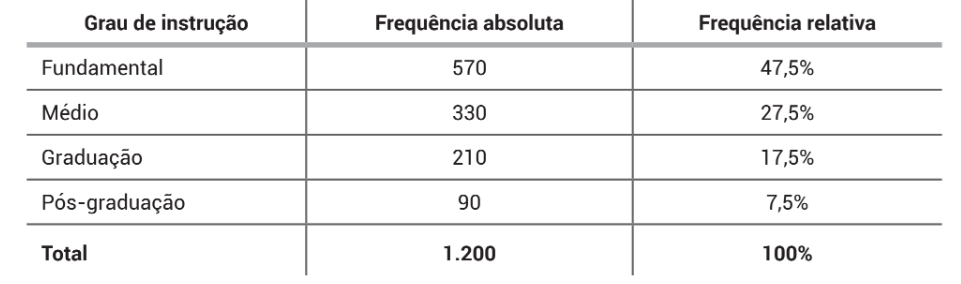  

In the *Frequency Table* above:

 - **The Absolute Frequency:**
   - Represents the number of samples by variable.
 - **The Relative Frequency:**
   - Represents how much percent the *"absolute value"* represents of the total samples.

---

<div id="intro-to-frequency"></div>

## Frequency

Twenty students were asked how many hours they worked per day. Their responses, in hours, are as follows:

```python
5, 6, 3, 3, 2, 4, 7, 5, 2, 3, 5, 6, 5, 4, 4, 3, 5, 2, 5, 3.
```

The **Frequency Table** for our example is:

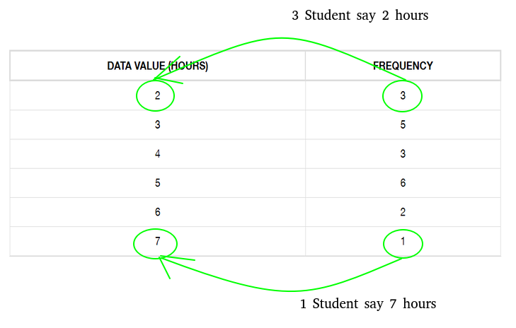  

 - A **frequency** is the *number of times* a *value of the data occurs*.
 - The **sum of the values in the "frequency" column**, 20, **represents the total number of students included in the sample**:

---

<div id="intro-to-relative-frequency"></div>

## Relative Frequency

> A **Relative Frequency** is the **ratio (fraction or proportion)** of the number of times a value of the data occurs in the set of all outcomes to the total number of outcomes.

For example, to our student table to find the **relative frequencies**:

 - Divide each frequency;
 - By the total number of students in the sample, in this case, 20.

  

**NOTE:**  

 - See that each **Relative Frequency** represents the frequency percent (%) in the set of outcomes.
 - The sum of each **Relative Frequency** is always 100% of the data.

---

<div id="intro-to-cumulative-relative-frequency"></div>

## Cumulative Relative Frequency

> The **Cumulative relative frequency** is the accumulation of the previous relative frequencies.

To find the **cumulative relative frequencies**, add all the previous relative frequencies to the relative frequency for the current row, as shown in table below:

  


<!--- ( Frequency Distribution/Frequency Distribution for Qualitative Variables ) --->

---

<div id="frequency-table-categorical-variables"></div>

## Creating a frequency table for categorical variables

To understand how create a **frequency table** for categorical variables imagine we have the following data to analyze:

  

To understand how to create a frequency table first, let's sorting **"Area"** variable:

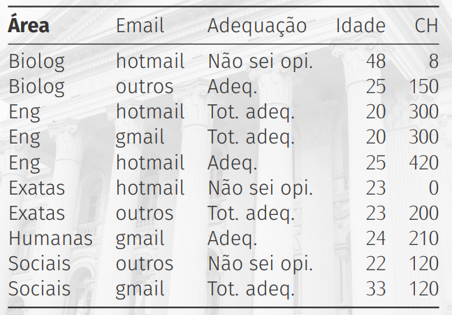

See that the categorical variable **"Area"** has some categories:

 - Biolog (2 samples)
 - Eng (3 samples)
 - Exatas (2 samples)
 - Humanas (1 sample)
 - Sociais (2 samples)

There are two approach to create a frequency table:

 - **Absolute Frequency:**
   - Total for each category.
 - **Relative Frequency:**
   - Percentage of each category.

For example, see the frequency table below, referent to our **Area variable**:

  

Remember that to obtain the Relative Frequency we:

 - Divide the Absolute Frequency;
 - By the total number of samples (10).

---

<div id="calculate-absolute-relative"></div>

## Formula to calculate absolute and relative frequency table

To calculate **absolute** and **relative frequency table** we can use the following formulas: 


---

<div id="relative-frequency-observation"></div>

## Relative frequency observation

See that relative frequency never pass from **1.0** (that's 100% data).

  

> **NOTE:**  
> The **range of relative frequency** is always from **0.00 (0% data)** to **1.00 (100% data)**.

For example, to see which percent represent each category take relative frequency and multiply per 100 (100%):

  

> **NOTE:**  
> See that **"Eng" category** represents **30%** of the data.

---

<div id="ft-w-bar-graph"></div>

## Visualizing a frequency table with "Bar Chart"

> One of the most common graphs to analyze qualitative (categorical) variables is a Bar graph.

For example, see the **Bar graph** below representing our categorical variable **Area**:

  

 - **The axis-x:**
   - Represent the category.
 - **The axis-y:**
   - Represent how many time each category appears.
   - Range 0 to 250.

We also can represent graph bar for categorical variables horizontal:

  

This approach is advised when:

 - You have very large variables names.
 - Many categories to analyze.

**NOTE:**  
That's because when each of the above cases happens the variable names overlap.

---

<div id="ft-two-cv"></div>

## Frequency table for two categorical variables

Sometimes we need to compare the relationship between categorical variables. For example, imagine we need to compare the relationship between **"Area"** and **"Email"** variables:

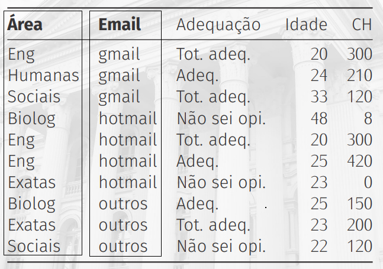  

To create a *Frequency Table* for the **“Area”** and **“Email”** variables, we need to see the combinations between these variables:

  

See that:

 - The rows represent the **"Area"** variable.
 - The columns represent the **"Email"** variable.
 - The table is an **"Absolute Frequency Table"**.

**NOTE:**  
If you pay attention, you can see that the table has the sum of frequencies on the sides:

  

See that:

 - We also have two marginal frequencies on the sides.
 - And a *total frequency*.

**NOTE:**  
You can also see this representation as an **"Adjacency Matrix"**:


> Ok, but how do I convert this **Absolute Frequency Table** to a **Relative Frequency Table**?

**NOTE:**
Easy, just divide each combination between **"Area"** and **"Email"** variables by *total of frequencies*:

  

---

<div id="cbcftcv"></div>

## Create a "Bar Chart" for two categorical variables

A common approach to compare categorical variables is to use a **Bar Chart**:

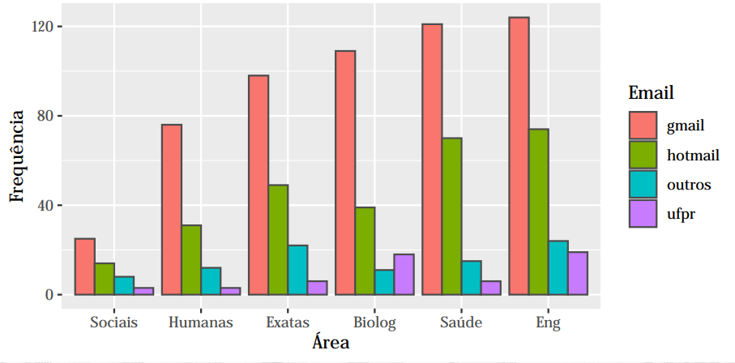  


<!--- ( Frequency Distribution/Frequency Table for Quantitative Variables ) --->

---

<div id="ft-for-qv"></div>

## Frequency Table for Quantitative Variables

 - To create a Frequency Table for Quantitative variables, first, we need to separate the values into classes (groups).
 - This is because, when a variable is quantitative, not necessary the values repeat:
   - **NOTE:** Even more when the variable is continuous (We measure instead of counting).

Knowing this, we need to group values into classes to create a Frequency Table. For example, see the image below:

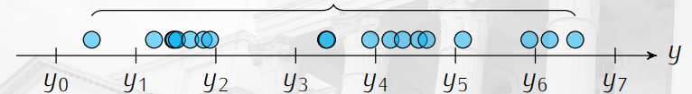  

 - See that we have many groups of classes separated by range.
 - Each **y<sub>n<sub>** range represents a group of class:
   - See that each group has some values.

For example, let's go count how many values appear in each  class group **y<sub>n<sub>**:

  

> **This groups range is what we know as "class amplitude (or Class Range/Interval)".**

Now, imagine we have the follow table to create a frequency table:

  

> **NOTE:**  
> The quantitative variable **CH** represent the **workload (carga horária)**.

Now, let's create a **"class amplitude (or Class Range/Interval)"** to generate a Frequency Table.

> **NOTE:**  
> However, first, let's sort the data.

```python
150   180   200   225   240   240   270   300   480   500
```

Now, some information:

 - **Data numbers:** 10
 - **Lower value:** 150
 - **Highest value:** 500
 - **Amplitude (Range/Interval):** 350
   - To calculate the *Amplitude (Range/Interval)* subtract the **"highest value"** by **"lower value"**: `500 - 150 = 350`
 - **Class Amplitude (Range/Interval):**
   - Some value to multiply by the *"amplitude"*.

---

<div id="histogram-for-qv"></div>

## Creating a "histogram" for Quantitative Variables

> To analyze *"Quantitative Variables"*, one of the most common charts is a **"Histogram"**.

For example, see the **"histogram"** below for our **"CH"** Quantitative Variable:

  

 - See that different from **"Bar Chart"** the **Histogram** has not interval between the bars.
 - That makes sense because quantitative variables have not an interval:
   - Even more when the variable is continuous (We measure instead of counting).

> **NOTE:**  
> However, depend you problem, you can also  make a **"Histogram"** by the interval:


<!--- ( Measures of Position/Location ) --->

---

<div id="measures-of-position-location"></div>

## Measures of Position/Location

> The **Measures of Position (also called Measures of Location)** present *"centrality measurements"* or describe *"positioning"* characteristics of a variable.

The most common **Measures of Position/Location** are:

 - **Mean.**
 - **Median.**
 - **Mode.**

---

<div id="intro-to-mean"></div>

## Mean

> The best-known *Measure of Position* is the **Mean (also called mean value)** which constitutes a measure of the central position of the data.

Mathematically, the **Mean** is the *sum* of measurements divided by the number of individuals (samples), and can be given by:

  

Where:

  

For example, imagine we decide to conduct a study on the comparative salaries of individuals who graduated from the same school. You might record the results like this:

| Name     | Salary      |
|----------|-------------|
| Dan      | 50.000      |
| Joann    | 54.000      |
| Pedro    | 50.000      |
| Rosie    | 189.000     |
| Ethan    | 55.000      |
| Vicky    | 40.000      |
| Frederic | 59.000      |

 - Some of the alumni (ex-alunos) may earn a lot.
 - And others may earn less.

> But what is the salary in the *middle* of the range of all salaries?

To solve that we can use the *Measure of Position/Location* **"Mean"**:

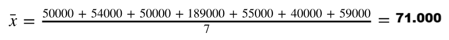  

---

<div id="alumni-mean-problem"></div>

## Alumni (ex-alunos) problem

Back to our alumni problem, we have the following table:

| Name     | Salary      |
|----------|-------------|
| Dan      | 50.000      |
| Joann    | 54.000      |
| Pedro    | 50.000      |
| Rosie    | 189.000     |
| Ethan    | 55.000      |
| Vicky    | 40.000      |
| Frederic | 59.000      |

And the **"Mean"** was **71.000**.

 - So, is `$71.000` really the central value?
 - Or, in other words, would it be reasonable for a graduate from this school to expect to earn `$71.000`?
   - **NOTE:** After all (afinal), that's the mean salary of a graduate from this school.

If you look closely at the salaries, you'll see that:

 - Out of the seven alumni, six earn less than the average salary.
 - The data is skewed (distorcidos):
   - By the fact that Rosie found a much higher-paying job than her classmates.

---

<div id="ddbotm"></div>

## Data distribution (variability) problem on the mean

Now, imagine we have grades for two student classes:

 - **Class A:**
   - (5, 5, 5, 5)
 - **Class B:**
   - (0, 0, 10, 10)

If you look closely at the data, you'll see that the **"Mean"** is **5.00** for both classes.

 - At this point, with individual observation of the data, it becomes clear that the two classes are not equal:
   - **NOTE:** Although the average in both is, in fact, equal (Embora a média em ambos seja, de fato, igual).
 - The first consideration is that exclusive inspection of the mean can lead to erroneous conclusions (for example, concluding that the two classes behave the same because they have equal mean).

> **This type of problem is commonly called "data Dispersion" or "variability":**  
> Although (embora) the means are the same, the data distributions are different.

---

<div id="intro-to-median"></div>

## Median

> The **"Median"** is the measurement that occupies the *central position* of a set of data, *"when they are ordered in ascending order"*.

In other words, it is the measurement that divides the data set:

 - 50% of individuals (samples) have measurements below the median
 - 50% of individuals (samples) have superior measurements.

For example, see the image below to understand more easily:

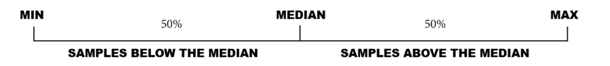  

> **NOTE:**  
> Remember, here we are talking about **"ordered data"**.

 - **Median:**
   - It should be noted that the "median" does not take into account for its calculation the absolute measurement of each individual (sample), but the position that each one occupies when ordered in increasing order.
 - **Mean:**
   - The "mean", in turn, is more susceptible to extreme measurements, because it takes into account for its calculation the absolute measurement of individuals (samples).

Mathematically, the **"position of the median"** is obtained using the following formulas:

**WHEN THE NUMBER OF OBSERVATIONS (SAMPLES) IS ODD (ÍMPAR):**  
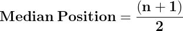  

**WHEN THE NUMBER OF OBSERVATIONS (SAMPLES) IS EVEN (PAR):**  
  

**NOTE:**  
In other words, let's take the mean of the 2 middle observations. The complete equation will look something like this:

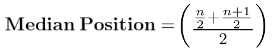  

For example, imagine we decide to conduct a study on the comparative salaries of individuals who graduated from the same school. You might record the results like this:

| Name     | Salary      |
|----------|-------------|
| Dan      | 50.000      |
| Joann    | 54.000      |
| Pedro    | 50.000      |
| Rosie    | 189.000     |
| Ethan    | 55.000      |
| Vicky    | 40.000      |
| Frederic | 59.000      |

Using the **"Median"** formula we have:

 - There are an odd (ímpar) number of observations (samples) = 7.
 - Therefore the median value is at position (7 + 1) ÷ 2.
 - In other words, position 4.

| Salary      |
|-------------|
| 40.000      |
| 50.000      |
| 50.000      |
|***>54.000***|
| 55.000      |
| 59.000      |
| 189.000     |

> **NOTE:**  
> So, the **"Median"** salary is **"54.000"**.


<!--- ( Settings ) --->

---

<div id="settings"></div>

## Settings

**CREATE VIRTUAL ENVIRONMENT:**  
```bash
python -m venv math-environment
```

**ACTIVATE THE VIRTUAL ENVIRONMENT (LINUX):**  
```bash
source math-environment/bin/activate
```

**ACTIVATE THE VIRTUAL ENVIRONMENT (WINDOWS):**  
```bash
source math-environment/Scripts/activate
```

**UPDATE PIP:**
```bash
python -m pip install --upgrade pip
```

**INSTALL PYTHON DEPENDENCIES:**  
```bash
pip install -U -v --require-virtualenv -r requirements.txt
```

**Now, Be Happy!!!** 😬


<!--- ( REFERENCES ) --->

---

<div id="ref"></div>

## REFERENCES

 - [Essential Math for Machine Learning: Python Edition](https://learning.edx.org/course/course-v1:Microsoft+DAT256x+2T2018/home)
 - [Stratified Sampling in Pandas (With Examples)](https://www.statology.org/stratified-sampling-pandas/)  
 - [Pós-graduação em Estatística Aplicada](https://faculdadefocus.com.br/curso/pos-graduacao-em-estatistica-aplicada)
 - [8 Types of Sampling Techniques](https://towardsdatascience.com/8-types-of-sampling-techniques-b21adcdd2124)  
 - [ESTATÍSTICA BÁSICA](http://www.leg.ufpr.br/~paulojus/estbas/)

---

Ro**drigo** **L**eite da **S**ilva - **drigols**
