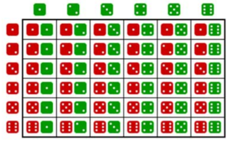
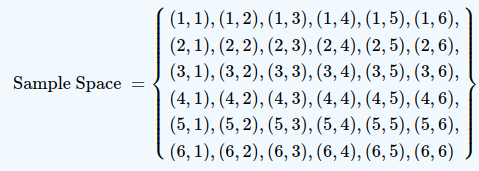
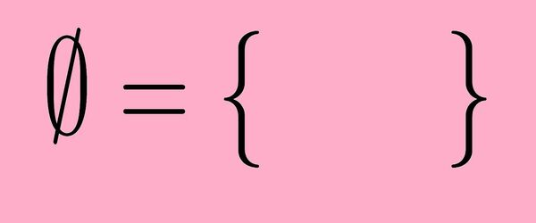
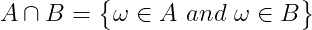
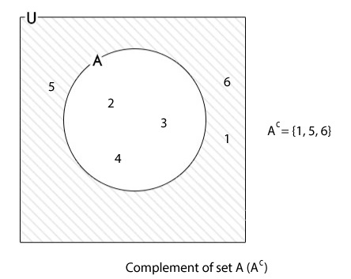

# Probability

## Contents

 - **Phenomenon types in Probability:**
   - [Deterministic Phenomenon](#deterministicf)
   - [Random Phenomenon (Non-Deterministic)](#randomf)
 - [Sample Space (Ω)](#sample-space)
 - [Sample Points (ω)](#sample-point)
 - [Events (A, B, C, ...., Z)](#events)
   - [Complement of an Event](#complement-of-an-event)
   - **Operations with Events:**
     - [Empty Set](#empty-set)
     - [Union](#union-set)
     - [Intersection](#intersection-set)
     - [Disjoint (Mutually Exclusive)](#disjoint)
     - [Complement of a Sets](#complement-set)
     - **Practice Problems on Operations with Events:**
       - [Roll a die](#oweq-toss-a-dice)
 - [Probability Axioms (definition)](#probability-axioms)
 - [Bias](#intro-to-bias)
 - **Conditional Probability and Dependence (Types of Events):**
   - [Independent Events (Events that are not affected by other events)](#independent-events)
   - [Dependent Events (Events that are conditional on other events)](#dependent-events)
   - [Mutually Exclusive Events (Events that can't occur together)](#mutually-exclusive-events)
 - [**Settings**](#settings)
 - [**REFERENCES**](#ref)


<!--- ( Phenomenon types in Probability ) --->

---

<div id="deterministicf"></div>

## Deterministic Phenomenon

We say that a **Phenomenon (experiment) is deterministic** when repeated many times on same (or similar) condition, leads an outcome (result) essentially identical.

For example:

 - Gravity acceleration.
 - Some physical (classical mechanics) or chemistry laws.

> **In general, are things that you repeat under (sob) the same condition, generate always the same results.**

**NOTE:**  
In *mathematics* we say that a **Phenomenon is Deterministic** when, for a given entry in the system, all its results are always the same.

---

<div id="randomf"></div>

## Random Phenomenon (Non-Deterministic)

The **phenomenon (experiment)** obtained under (sob) the same condition that generates different outcomes are called **"Random Phenomenon (experiment)"**.

For example:

 - Roll a die (or similar).
 - Sportive event results.
 - Climatic conditions for the next Sunday.

**NOTE:**  
In *mathematics* we say that a **Phenomenon is Non-Deterministic (Random)** when, for a given entry in the system, its results vary uncertainly. For example, when tossing a coin, the upward tossing process can be repeated, but the result (heads or tails) varies in an unpredictable way.


<!--- ( Sample Space (Ω) ) --->

---

<div id="sample-space"></div>

## Sample Space (Ω)

The **sample space** is:

> **A set of all possible outcomes (results) of a *Random  Experiment*.**

**SAMPLE SPACE NOTATION:**  
To denote the sample space we'll use the **omega (Ω)** Greek letter.

**NOTE:**  
This sample space can contain a **"finite"** or **"infinite"** number of sample points.

Examples of **"Sample Spaces"** are:

 - **Flip a coin:**
   - *Sample space (Ω):* {heads, tails}
 - **Rolling a die:**
   - *Sample space (Ω):* {1, 2, 3, 4, 5, 6}

Now, imagine we *rolling two dice simultaneously*, the **Sample Space (Ω)** will be:

  

We can also represent it as tuples:



**NOTE:**  
See that we have 36 (6x6=36) possible outcomes (results).


<!--- ( Sample Points (ω) ) --->

---

<div id="sample-point"></div>

## Sample Points (ω)

> The elements that compose a *sample space (Ω)* are called **Sample Points**.

**SAMPLE POINTS NOTATION:**  
To denote *"a single sample"* point we use lowercase Greek letter **Omega (ω)**.

For example:

 - **Flip (toss) a coin:**
   - **Sample Space (Ω):**
     - {heads, tails}
   - **Sample Points (ω):**
     - ω<sub>1</sub> = heads, ω<sub>2</sub> = tails

> **NOTE:**  
> For example, when analyzing a *chart* with all  experiment samples *(sample space Ω)*, a *sample point (ω)* could be *"a single point on the chart"*.


<!--- ( Events ) --->

---

<div id="events"></div>

## Events (A, B, C, ...., Z)

> All outcome or subset of outcomes from a Random Experiment is an **Event**.

**EVENT NOTATION:**  
To denote Events from a sample space (Ω) we use upper letters: **A**, **B**, **C**,...., **Z**.

Some **"Events"** examples can be:

 - **Flip (toss) a coin:**
   - **Sample Space (Ω):** {heads, tails}
   - **Sample Points (ω):** ω<sub>1</sub> = heads, ω<sub>2</sub> = tails
   - **Event:** A = "Heads face", B = "Tails face".
 - **Roll a die:**
   - **Sample Space (Ω):** {1, 2, 3, 4, 5, 6}
   - **Sample Points (ω):** ω<sub>1</sub> = 1, ω<sub>2</sub> = 2, ω<sub>3</sub> = 3, ω<sub>4</sub> = 4, ω<sub>5</sub> = 5, ω<sub>6</sub> = 6.
   - **Event:** A = "Even", B = "Odd" 

---

<div id="complement-of-an-event"></div>

## Complement of an Event

> The **complement of an event** is **"the set of sample points that do *not* result in the event"**.

  

For example, consider rolling two dice simultaneously:


---

<div id="empty-set"></div>

## Empty Set

> It is the set without elements, denoted by **0 (zero)**.



---

<div id="union-set"></div>

## Union

> It is the Event that consists of the **Union of all the sample points** of the events that compose it.

We call the *Union* of event **A** with event **B** by **AUB**:

  
  

**NOTE:**  
See that by definition a **sample point (ω)** can:

 - Belongs (pertencer) to Event **A**.
 - Belongs (pertencer) to Event **B**.
 - Or can belongs under (ao) Events **A** and **B** simultaneously.

---

<div id="intersection-set"></div>

## Intersection

> It is the Event composed of the sample points common to the Events that compose it.




**NOTE:**  
See that different of the Union, the intersection is composed of all common sample points in all Events.

> **NOTE:**  
> That is, the sample points that appear simultaneously in Events **A** and **B**.

---

<div id="disjoint"></div>

## Disjoint (Mutually Exclusive)

Are **Events** that have **null Intersection**, that is:


 - In logic and probability theory, two events (or propositions) are **mutually exclusive** or **disjoint** if they cannot both occur at the same time:
   - A clear example is the set of outcomes of a single coin toss, which can result in either heads or tails, but not both.

---

<div id="complement-set"></div>

## Complement of a Sets

**Complement of a set A (Event A)**, denoted by **A<sup>c</sup>**, is the set of all elements that:

 - Belongs (pertencem) to sample space.
 - But does not belong (pertencem) to set A (Event A).

 

**NOTE:**  
That is, they are part of the sample space, but do not belong to Event A.


<!--- ( Operations with Events/Questions ) --->

---

<div id="oweq-toss-a-dice"></div>

## Roll a die

Consider the experiment of **"roll a die"** and the Events are:

 - A = {1, 2, 3, 4}
 - B = {ω : ω <=3}
 - C = "Even face"
 - D = "Prime face"

Now we have to solve the following **"Events operations"**:

 - **UNION:**
   - **AUB =** {1, 2, 3, 4} *or* {1, 2, 3} = {1, 2, 3, 4}
   - **AUC =** {1, 2, 3, 4} *or* {2, 4, 6} = {1, 2, 3, 4, 6}
   - **AUD =** {1, 2, 3, 4} *or* {2, 3, 5} = {1, 2, 3, 4, 5}
 - **INTERSECTION:**
   - **A∩B =** {1, 2, 3, 4} *and* {1, 2, 3} = {1, 2, 3}
   - **A∩C =** {1, 2, 3, 4} *and* {2, 4, 6} = {2, 4}
   - **A∩D =** {1, 2, 3, 4} *and* {2, 3, 5} = {2, 3}
 - **COMPLEMENT OF A SETS:**
   - **A<sup>c</sup> =** {5, 6}
   - **B<sup>c</sup> =** {ω : ω > 3}
   - **C<sup>c</sup> =** {1, 3, 5}
   - **D<sup>c</sup> =** Knowing that D = {2, 3, 5}, then D<sup>c</sup> = {1, 4, 6}


<!--- ( Axioms (Definition) ) --->

---

<div id="probability-axioms"></div>

## Probability Axioms (definition)

To express a probability, we use:

 - An **upper-case "P"** to *indicate probability*:
   - E.g. `P()`
 - And an **upper-case letter (A, B, C,....)** to *represent the Event*:
   - e.g. `A`

For example, to express the probability of throwing a 7 as an event called **"A"**, we could write:

$P(A) = 0.167$

> Briefly, **Probability is a function P()** that **attributes numerical values to "Events" of the "Sample Space (Ω)"** follow some *rules*.

Now, let's see what are these **rules (axioms)**.

 - **FIRST AXIOM: 0 <= P(A) <= 1, ∀A ∈ Ω:**
   - The first axiom tells us that given a function **P()** that receives an **Event "A"**, the value (probability) to this Event must be:
     - Higher or equal zero:
       - 0 <= P(A)
     - Less or equal one:
       - P(A) <= 1 
   - To all Event (∀) "A" that belongs under sample space (Ω):
     - ∀A ∈ Ω
 - **SECONT AXIOM: P(Ω) = 1:**
   - The second axiom tells us that the probability to happen (acontecer) *omega (Ω)* is 1.
   - **NOTE:** That is, some Event inside sample (Ω) space will happen (vai acontecer).

Knowing this, the *Probability* is a value between **"0"** and **"1"** that indicates the probability of a certain *Event*:

 - **"0"** meaning that *"the event is impossible"*.
 - **"1"** meaning that *"the event is inevitable"*.

In general terms, it's calculated like this:

  
<!--- 
\mathbf{
Probability \ of \ an \ "Event" = \frac{P(A)}{P(\Omega)} = \frac{Number \ of \ "Sample \ Points" \ that \ produce \ the \ "Event"}{TOTAL \ numbers \ of \ "Sample Points (\omega)" \ in \ the \ "Sample \ Space \ (\Omega)"}
}
--->


<!--- ( Bias ) --->

---

<div id="intro-to-bias"></div>

## Bias

> Often (Muitas vezes), the **Sample Points (ω)** in the **Sample Space (Ω)** do not have the same probability, so there is a **"bias"** that makes one outcome more likely than another.

For example, suppose your local weather forecaster indicates the predominant weather for each day of the week like this:

<table>
<tr><td style='text-align:center'>Mon</td><td style='text-align:center'>Tue</td><td style='text-align:center'>Wed</td><td style='text-align:center'>Thu</td><td style='text-align:center'>Fri</td><td style='text-align:center'>Sat</td><td style='text-align:center'>Sun</td></tr>
<tr style='font-size:32px'><td>&#9729;</td><td>&#9730;</td><td>&#9728;</td><td>&#9728;</td><td>&#9728;</td><td>&#9729;</td><td>&#9728;</td></tr>
</table>

This forceast is pretty typical for your area at this time of the year. In fact, historically the weather is sunny on **60%** of days, cloudy on **30%** of days, and rainy on only 10% of days. On any given day, the sample space for the weather contains 3 sample points (sunny, cloudy, and rainy); *"*but the probabities for these sample points are not the same*"*.

If we assign:

 - The letter **"A"** to a sunny day event.
 - **"B"** to a cloudy day event.
 - And **"C"** to a rainy day event.

Then we can write these probabilities like this:

 - **P(A) =** *0.6*
 - **P(B) =** *0.3*
 - **P(C) =** *0.1*


<!--- ( Conditional Probability and Dependence (Types of Events) ) --->

---

<div id="independent-events"></div>

## Independent Events (Events that are not affected by other events)

> Coming soon...

---

<div id="dependent-events"></div>

## Dependent Events (Events that are conditional on other events)

> Coming soon...

---

<div id="mutually-exclusive-events"></div>

## Mutually Exclusive Events (Events that can't occur together)

> Coming soon...


<!--- ( Settings ) --->

---

<div id="settings"></div>

## Settings

**CREATE VIRTUAL ENVIRONMENT:**  
```bash
python -m venv math-environment
```

**ACTIVATE THE VIRTUAL ENVIRONMENT (LINUX):**  
```bash
source math-environment/bin/activate
```

**ACTIVATE THE VIRTUAL ENVIRONMENT (WINDOWS):**  
```bash
source math-environment/Scripts/activate
```

**UPDATE PIP:**
```bash
python -m pip install --upgrade pip
```

**INSTALL PYTHON DEPENDENCIES:**  
```bash
pip install -U -v --require-virtualenv -r requirements.txt
```

**Now, Be Happy!!!** 😬


<!--- ( REFERENCES ) --->

---

<div id="ref"></div>

## REFERENCES

 - [Essential Math for Machine Learning: Python Edition](https://learning.edx.org/course/course-v1:Microsoft+DAT256x+1T2019a/home)
 - [ESTATÍSTICA BÁSICA (DEST/UFPR)](http://www.leg.ufpr.br/~paulojus/estbas/)
 - [5.3: How to Calculate Classical Probability](https://stats.libretexts.org/Bookshelves/Introductory_Statistics/Inferential_Statistics_and_Probability_-_A_Holistic_Approach_(Geraghty)/05%3A_Probability/5.03%3A_How_to_Calculate_Classical_Probability)

---

Ro**drigo** **L**eite da **S**ilva - **drigols**
