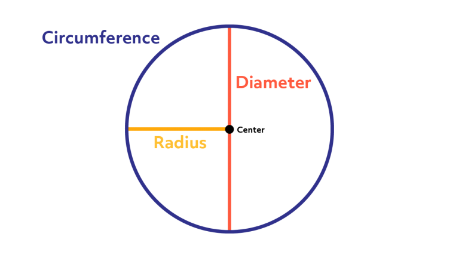
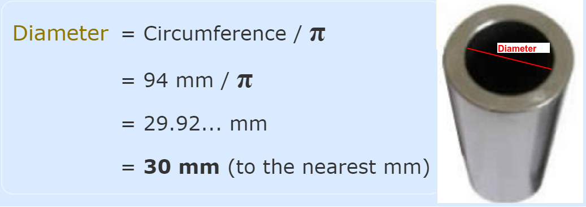
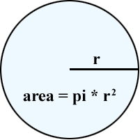

# Trigonometry

## Contents

 - **Prerequisites:**
   - **Angles:**
     - [Rays and Angles](#rays-and-angles)
     - [Angles and Greek Letters](#angles-greek-letters)
     - [Angle: Initial and Terminal sides](#angle-initial-terminal-sides)
     - [Measure of Angles](#measure-of-angles)
   - **Circles:**
     - [Measurement of a Circle](#circle-measurement)
     - [Pi (π) = Circumference/Diameter](#phi-calc)
     - [Circumference = Pi (π) x Diameter](#circumference-calc)
     - [Diameter = Circumference / Pi (π)](#diameter-calc)
     - [Radius = Diameter / 2](#radius-calc)
     - [Radian = Arc that has the same length as the radius](#radian)
   - [**Unit Circle:**](#Unit-Circle)


 - [**Sine**](#intro-to-sine)
 - [**Cosine**](#intro-to-cosine)
 - [**Tangent**](#intro-to-tangent)
 - [**Settings**](#settings)
 - [**REFERENCES**](#ref)


<!--- ( Prerequisites/Angles ) -->

---

<div id="rays-and-angles"></div>

## Rays and Angles

Before learning about **Angles**, we need to understand **Rays**.

> A **"Ray"** is a directed line segment.

For example, see the **Ray** below:


See that a ***"Ray"*** has:

 - **An "Endpoint":** The first point is called the *"endpoint"* of the *"Ray"*
   - The starting point of the ray.
 - **A "Direction":** We can also define the direction of the *"Ray"*
   - We define a arrow under the endpoint and the final point: $\overrightarrow{EF}$
   - **NOTE:** See that is similar to a Vector.

<!---
\overrightarrow{EF}
--->

> An **"Angle"** is the **"union of two rays"** having a *common endpoint*.

For example, see the **"Angle"** below:

  

See that:

 - **We have an endpoint "E":**
   - Common to rays **"D"** and **"F"**.
 - **Two rays "D" and "F" have a common endpoint "E".**
 - **The endpoint "E" is called the "vertex" of the angle:**
   - And the two rays are the sides of the angle.
 - **The angle to our image is formed:**
   - From $\overrightarrow{ED}$ and $\overrightarrow{EF}$

---

<div id="angles-greek-letters"></div>

## Angles and Greek Letters

> **Greek letters** are often (frequentemente) used as variables for the measure of an angle.

For example, see the common Greek letters used to measure angles:

| θ     | φ or ϕ | α     | β    | γ     |
|-------|--------|-------|------|-------|
| Theta | Phi    | Alpha | Beta | Gamma |

---

<div id="angle-initial-terminal-sides"></div>

## Angle: Initial and Terminal sides

Angle creation is a **dynamic process**... We start with two rays lying on top of one another.

 - **We leave one fixed in place:**
   - The fixed ray is the *"initial side"*
 - **And rotate the other:**
   - The rotated ray is the *"terminal side"*.

In order to identify the different sides, we indicate the rotation with a small arrow close to the vertex as the image below:

  

---

<div id="measure-of-angles"></div>

## Measure of Angles

> The **measure of an angle** is the **amount of rotation from the initial side to the terminal side**.

Probably the most familiar unit of angle measurement is the **"degree"**.

 - One **degree** is $\frac{1}{360}$ of a circular rotation.
 - So a complete circular rotation contains **360 degrees**.

> **NOTE:**  
> An angle measured in degrees should always include the unit “degrees” after the number, or include the degree symbol `°`.

For example:

```bash
90 degrees = 90°
```

 - If the angle is measured in a **"counterclockwise direction"** from the initial side to the terminal side, the angle is said to be a **"positive angle"**.
 - If the angle is measured in a **"clockwise direction"**, the angle is said to be a **"negative angle"**.

For example, see the images below to understand more easily:

  

To place the terminal side of the angle, we must calculate the fraction of a full rotation the angle represents. We do that by dividing the angle measure in degrees by **"360°"**.

For example:

 - To draw a **"90°"** angle, we calculate that $\frac{90}{360} = \frac{1}{4} = 0.25$.
   - So, the terminal side will be *one-fourth* of the way around the circle, moving counterclockwise from the positive x-axis.
 - To draw a **"360°"** angle, we calculate that $\frac{360}{360} = 1$.

See the image below to understand more easily:

  


<!--- ( Prerequisites/Circles ) -->

---

<div id="circle-measurement"></div>

## Measurement of a Circle

To measure a **Circle** we have four important concepts:

  

 - **Center of the circle:**
   - The center is the fixed point inside the circle that is the same distance away from all points on the circle's edge (circumference). 
 - **Circumference:**
   - The circumference is the total length around (bounded) the edge of the circle.
 - **Radius:**
   - The radius is any line segment that connects the center of the circle to a point on the edge (circumference). All **radii (radii = plural of radius, it's the plural form of radius, indicating there are more than one of these lines)** of a circle have the same length.
 - **Diameter:**
   - The diameter is a straight line that passes through the center of the circle and touches opposite ends of the circle's edge. **Its length is equal to twice the radius**.

---

<div id="phi-calc"></div>

## Pi (π) = Circumference/Diameter

> Independently, the length of the *"circumference"* or *"diameter"* of a circle, **if we divide the circumference by the diameter the result is always Pi (π)**.

  

> **NOTE:**  
> This is interesting to know because we will always have a *constant (pi π)* that can be used to discover other values from it.

---

<div id="circumference-calc"></div>

## Circumference = Pi (π) x Diameter

To find the circumference of a circle, we need to know the **"Pi (π)"** and the **"Diameter"**.

The formula is:

  

> **For example, imagine you walk around a circle which has a diameter of 100 m, how far have you walked?**

  

---

<div id="diameter-calc"></div>

## Diameter = Circumference / Pi (π)

To find the diameter of a circle is very simple. For example, see the formula below:

  

> **For example, imagine you measured 94 mm around the *outside of a pipe (parte externa de um tubo)*... what is its diameter?**

  

---

<div id="radius-calc"></div>

## Radius = Diameter / 2

> A **Radius** is **half of the diameter**.

  

> **NOTE:**  
> Knowing that we can say that the *"radius"* is the *"diameter divided by two"*.

A Circle can have an uncountable number of Radius. For example:


Looking at the first Circle, we see that we have many Radii with different spaces between them, but they all have the same length.

---

<div id="radian"></div>

## Radian = Arc that has the same length as the radius

> A **Radian** is an Arc that has the same length as the radius.


---

<div id="area-calc"></div>

## Area = π x r^2

> The area of a shape refers to how much space it occupies.

 - When **"estimating"** the **area of a circle** we use the formula: `A = 3r²`.
   - Where `r` is the radius.
 - When **"calculating"** the **area of a circle** we use the formula: `A = πr²`.
   - Where `r` is the radius.

  


<!--- ( Prerequisites/Unit Circle ) -->

---

<div id="Unit-Circle"></div>

## Unit Circle

 - A **"Unit Circle"** is a circle *"on the Cartesian Plane"* that *"has a radius of 1 unit"*.
 - And is *centered* at the *origin (0, 0)*.

  

See that our circle:

 - Has a *"radius of 1"*.
 - Is centered at the *"origin (0, 0)"*.

---


<!--- ( Single ) -->

---

<div id="intro-to-sine"></div>

## Sine

The ***Sine /saɪn/* formula** is:

  

For example, given the triangle below:

  

Find the value of **sin t**:

 - The side **opposite** to the angle **t** is **7**.
 - And the **hypotenuse** of the triangle is **15**.
 - Then, **sin(t) = 7/25**.

> **Ok, but why the Sine formula is (Opposite/Hypotenuse)?**


<!--- ( Cosine ) -->

---

<div id="intro-to-cosine"></div>

## Cosine

The **Cosine /ˈkoʊ.saɪn/ formula** is:

  

<div id="tangent"></div>

For example, given the triangle below:

  

Find the value of **cos α**:

 - The side **adjacent** to the angle is **15**.
 - And the **hypotenuse** of the triangle is **17**.
 - Then, **cos(α) = 15/17**.

> **Ok, but why the Tangent formula is (Adjacent/Adjacent)?**


<!--- ( Tangent ) -->

---

<div id="intro-to-tangent"></div>

## Tangent

The **Tangent /ˈtæn.dʒənt/ formula** is:

  

> **Ok, but why the Tangent formula is (Opposite/Adjacent)?**


<!--- ( Settings ) --->

---

<div id="settings"></div>

## Settings

**CREATE VIRTUAL ENVIRONMENT:**  
```bash
python -m venv math-environment
```

**ACTIVATE THE VIRTUAL ENVIRONMENT (LINUX):**  
```bash
source math-environment/bin/activate
```

**ACTIVATE THE VIRTUAL ENVIRONMENT (WINDOWS):**  
```bash
source math-environment/Scripts/activate
```

**UPDATE PIP:**
```bash
python -m pip install --upgrade pip
```

**INSTALL PYTHON DEPENDENCIES:**  
```bash
pip install -U -v --require-virtualenv -r requirements.txt
```

**Now, Be Happy!!!** 😬


<!--- ( References ) -->

---

<div id="references"></div>

## REFERENCES

 - [Clockwise and Counterclockwise](https://www.mathsisfun.com/geometry/clockwise-counterclockwise.html)
 - [Angles](https://www.mathsisfun.com/angles.html)
 - [Degrees (Angles)](https://www.mathsisfun.com/geometry/degrees.html)
 - [7.1 Angles](https://openstax.org/books/algebra-and-trigonometry-2e/pages/7-1-angles)
 - [Triangles](https://www.mathsisfun.com/triangle.html)
 - [Right-Angled Triangles](https://www.mathsisfun.com/right_angle_triangle.html)
 - [Pi (π)](https://www.mathsisfun.com/numbers/pi.html)
 - [Radians](https://www.mathsisfun.com/geometry/radians.html)
 - [What are radians?](https://jarnowouda.com/what-are-radians/)

---

Ro**drigo** **L**eite da **S**ilva - **drigols**


> ***Trigonometry*** (from Greek **trigonon "triangle"** + **metron "measure"**.

 - The most interest triangle in the Trigonometry is the *Right-Angled Triangle*.
 - The **right angle** is shown by the little box in the corner (canto):

For example, see the **Right-Angled Triangle** below:

  

 - **The angle is often labeled (frequentemente rotulado) *"θ"*, and the three sides are then called:**
   - **Opposite:** opposite to the angle **θ**.
   - **Adjacent:** adjacent (next to) the angle **θ**.
   - **Hypotenuse:** The longest side is the *Hypotenuse*.
