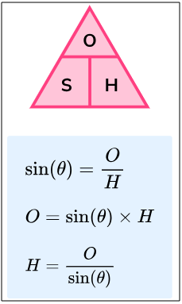
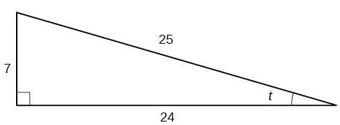
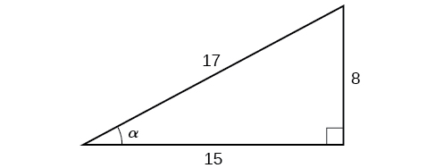
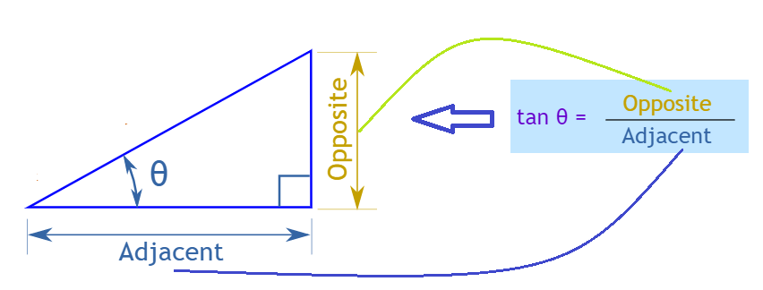
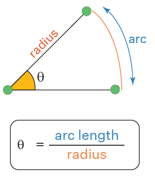
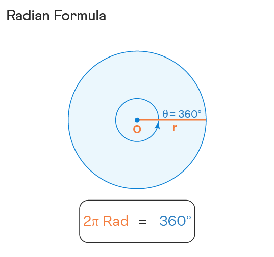

# Trigonometry

## Contents

 - **Prerequisites:**
   - **Angles:**
     - [Rays and Angles](#rays-and-angles)
     - [Angle: Initial and Terminal sides](#angle-initial-terminal-sides)
     - [Measure of Angles](#measure-of-angles)
     - [Angles and Greek Letters](#angles-greek-letters)
   - **Circles:**
     - [Components of a Circle](#circle-components)
     - [Unit Circle](#Unit-Circle)
     - [Radius and Radian as a measure](#radius-and-radians)
     - [Degrees to Radians](#degrees-to-radians)
 - [**Sine**](#intro-to-sine)
 - [**Cosine**](#intro-to-cosine)
 - [**Tangent**](#intro-to-tangent)
 - [**Settings**](#settings)
 - [**REFERENCES**](#ref)


<!--- ( Prerequisites/Angles ) -->

---

<div id="rays-and-angles"></div>

## Rays and Angles

Before learning about **Angles**, we need to understand **Rays**.

> A **"Ray"** is a directed line segment.

For example, see the **Ray** below:


See that a ***"Ray"*** has:

 - **An "Endpoint":** The first point is called the *"endpoint"* of the *"Ray"*
   - The starting point of the ray.
 - **A "Direction":** We can also define the direction of the *"Ray"*
   - We define a arrow under the endpoint and the final point: $\overrightarrow{EF}$
   - **NOTE:** See that is similar to a Vector.

<!---
\overrightarrow{EF}
--->

> An **"Angle"** is the **"union of two rays"** having a *common endpoint*.

For example, see the **"Angle"** below:

  

See that:

 - **We have an endpoint "E":**
   - Common to rays **"D"** and **"F"**.
 - **Two rays "D" and "F" have a common endpoint "E".**
 - **The endpoint "E" is called the "vertex" of the angle:**
   - And the two rays are the sides of the angle.
 - **The angle to our image is formed:**
   - From $\overrightarrow{ED}$ and $\overrightarrow{EF}$

---

<div id="angle-initial-terminal-sides"></div>

## Angle: Initial and Terminal sides

Angle creation is a **dynamic process**... We start with two rays lying on top of one another.

 - **We leave one fixed in place:**
   - The fixed ray is the *"initial side"*
 - **And rotate the other:**
   - The rotated ray is the *"terminal side"*.

In order to identify the different sides, we indicate the rotation with a small arrow close to the vertex as the image below:

  

---

<div id="measure-of-angles"></div>

## Measure of Angles

> The **measure of an angle** is the **amount of rotation from the initial side to the terminal side**.

Probably the most familiar unit of angle measurement is the **"degree"**.

 - One **degree** is $\frac{1}{360}$ of a circular rotation.
 - So a complete circular rotation contains **360 degrees**.

> **NOTE:**  
> An angle measured in degrees should always include the unit “degrees” after the number, or include the degree symbol `°`.

For example:

```bash
90 degrees = 90°
```

 - If the angle is measured in a **"counterclockwise direction"** from the initial side to the terminal side, the angle is said to be a **"positive angle"**.
 - If the angle is measured in a **"clockwise direction"**, the angle is said to be a **"negative angle"**.

For example, see the images below to understand more easily:

  

To place the terminal side of the angle, we must calculate the fraction of a full rotation the angle represents. We do that by dividing the angle measure in degrees by **"360°"**.

For example:

 - To draw a **"90°"** angle, we calculate that $\frac{90}{360} = \frac{1}{4} = 0.25$.
   - So, the terminal side will be *one-fourth* of the way around the circle, moving counterclockwise from the positive x-axis.
 - To draw a **"360°"** angle, we calculate that $\frac{360}{360} = 1$.

See the image below to understand more easily:

  

It's common to learn that angles can be measured in degrees:

  

> **NOTE:**  
> Looking at the image above, pay attention that the focus is on the **“angles”** and **"not the number of radius"**.

See the image again to understand the focus more easily:

  

See that:

 - **We have many Angles in degree.**
 - **The blue Circle is the ["Unit Circle"](#Unit-Circle):**
   - Has a *"radius of 1"*.
   - Is centered at the *"origin (0, 0)"*.

For example, let's see some of these angles above separated:

  

---

<div id="angles-greek-letters"></div>

## Angles and Greek Letters

> **Greek letters** are often (frequentemente) used as variables for the measure of an angle.

For example, see the common Greek letters used to measure angles:

| θ     | φ or ϕ | α     | β    | γ     |
|-------|--------|-------|------|-------|
| Theta | Phi    | Alpha | Beta | Gamma |


<!--- ( Prerequisites/Circles ) -->

---

<div id="circle-components"></div>

## Components of a Circle

To work with a **Circle** we have some important components:

  

 - **Center of the circle (Central Vertex):**
   - The center is the fixed point inside the circle that is the same distance away from all points on the circle's edge (circumference). 
 - **Circumference:**
   - The circumference is the total length around (bounded) the edge of the circle.
 - **Radius:**
   - The radius is any line segment that connects the center of the circle to a point on the edge (circumference). All **radii (radii = plural of radius, it's the plural form of radius, indicating there are more than one of these lines)** of a circle have the same length.
 - **Diameter:**
   - The diameter is a straight line that passes through the center of the circle (0, 0) and touches opposite ends of the circle's edge. **Its length is equal to twice the radius**.

**NOTE:**  
Now let's look at some components of a circle that may look the same but are different:

 - **Radius (Raio):**
   - A **Radius (Raio)** is a line segment that starts from the *center of the circle (0, 0)* and ends on a point on the circle's edge (circumference).
   - It's typically denoted by the letter **"r"** in mathematical formulas.
 - **Ray (Também é "raio" em inglês):**
   - A **Ray (Também é "raio" em inglês)** is a part of a line that starts at the *center of the circle (0, 0)* and *"extends infinitely"* outward in one direction. 
 - **Arc:**
   - Part of the *circumference* of a *circle*.


---

<div id="Unit-Circle"></div>

## Unit Circle

When we study Angles, it is common to draw a circle between the rays to find the Angle.

> This circle is known as the **"Unit Circle"**.

 - A **"Unit Circle"** is a circle *"on the Cartesian Plane"* that *"has a radius of 1 unit"*.
 - And is *centered* at the *origin (0, 0)*.

  

See that our circle:

 - Has a *"radius of 1"*.
 - Is centered at the *"origin (0, 0)"*.

**NOTE:**  
Pay attention that, the focus here is the *"circle"*, not the arcs (or rays) length. That's the circle with a radius of 1.

---

<div id="radius-and-radians"></div>

## Radius and Radian as a measure

> A **Radius** is **half a diameter**.

  

> **NOTE:**  
> Knowing that we can say that the *"radius"* is the *"diameter divided by two"*.

A Circle can have an uncountable number of Radius. For example:


Looking at the first Circle, we see that we have many Radii with different spaces between them, but they all have the same length.

### Radian

I like to say (but not formally) that:

> A **"Radian"** is an **"Angle"** in which the *Arc* has the same length as the *Radius*.

  

> **What would happen if we were to rotate around the circle continuing to add radians?**

  

See that:

 - **We have 6 radians.**
   - And a little bit more.
 - **These 6 radians can be used to measure angles:**
   - That is, now we use *"radians"* instead of *"degrees"* to measure angles.

---

<div id="degrees-to-radians"></div>

## Degrees to Radians

Before learning to convert degrees into radians, let's recall some Geometry concepts. But first, let's make some aliases for some concepts:

 - **C =** Circumference.
 - **π =** Pi = 3.14159...
 - **r =** Radius = Diameter / 2.
 - **D =** Diameter = 2 * r.

Now, the question is:

> **How to find the circumference of a circle?**

 - **If you know the *"diameter (D)"* of the circle, you can use the formula:**
   - `C = π*D` → `C = πD`
 - **If you know the *"radius (r)"* of the circle, you can use the formula:**
   - `C = 2*π*r` → `C = 2πr`

Recall from geometry that:

> The **"arc length of a complete rotation (or 360 degrees)"** is the **"circumference"**, where the formula is equal to: `C = 2πr`.

 - **"2π"** is approximately 6.28, so the *circumference* is a little more than 6 radius lengths.
 - Or, in **"terms of radian measure"**, a complete rotation (360 degrees) is **2π radians (or 2πr)**.

For example, let's compare a complete circle rotation in degrees and radians:


Now, think with me... If the complete circle rotation in degrees and radians are: 360° (or 360 degrees) and 2π, then:


<!--- ( Single ) -->

---

<div id="intro-to-sine"></div>

## Sine

The ***Sine /saɪn/* formula** is:

  

For example, given the triangle below:

  

Find the value of **sin t**:

 - The side **opposite** to the angle **t** is **7**.
 - And the **hypotenuse** of the triangle is **15**.
 - Then, **sin(t) = 7/25**.

> **Ok, but why the Sine formula is (Opposite/Hypotenuse)?**


<!--- ( Cosine ) -->

---

<div id="intro-to-cosine"></div>

## Cosine

The **Cosine /ˈkoʊ.saɪn/ formula** is:

  

<div id="tangent"></div>

For example, given the triangle below:

  

Find the value of **cos α**:

 - The side **adjacent** to the angle is **15**.
 - And the **hypotenuse** of the triangle is **17**.
 - Then, **cos(α) = 15/17**.

> **Ok, but why the Tangent formula is (Adjacent/Adjacent)?**


<!--- ( Tangent ) -->

---

<div id="intro-to-tangent"></div>

## Tangent

The **Tangent /ˈtæn.dʒənt/ formula** is:

  

> **Ok, but why the Tangent formula is (Opposite/Adjacent)?**


<!--- ( Settings ) --->

---

<div id="settings"></div>

## Settings

**CREATE VIRTUAL ENVIRONMENT:**  
```bash
python -m venv math-environment
```

**ACTIVATE THE VIRTUAL ENVIRONMENT (LINUX):**  
```bash
source math-environment/bin/activate
```

**ACTIVATE THE VIRTUAL ENVIRONMENT (WINDOWS):**  
```bash
source math-environment/Scripts/activate
```

**UPDATE PIP:**
```bash
python -m pip install --upgrade pip
```

**INSTALL PYTHON DEPENDENCIES:**  
```bash
pip install -U -v --require-virtualenv -r requirements.txt
```

**Now, Be Happy!!!** 😬


<!--- ( References ) -->

---

<div id="ref"></div>

## REFERENCES

 - [Clockwise and Counterclockwise](https://www.mathsisfun.com/geometry/clockwise-counterclockwise.html)
 - [Angles](https://www.mathsisfun.com/angles.html)
 - [Degrees (Angles)](https://www.mathsisfun.com/geometry/degrees.html)
 - [7.1 Angles](https://openstax.org/books/algebra-and-trigonometry-2e/pages/7-1-angles)
 - [Triangles](https://www.mathsisfun.com/triangle.html)
 - [Right-Angled Triangles](https://www.mathsisfun.com/right_angle_triangle.html)
 - [Pi (π)](https://www.mathsisfun.com/numbers/pi.html)
 - [Radians](https://www.mathsisfun.com/geometry/radians.html)
 - [What are radians?](https://jarnowouda.com/what-are-radians/)

---

Ro**drigo** **L**eite da **S**ilva - **drigols**


> ***Trigonometry*** (from Greek **trigonon "triangle"** + **metron "measure"**.

 - The most interest triangle in the Trigonometry is the *Right-Angled Triangle*.
 - The **right angle** is shown by the little box in the corner (canto):

For example, see the **Right-Angled Triangle** below:

  

 - **The angle is often labeled (frequentemente rotulado) *"θ"*, and the three sides are then called:**
   - **Opposite:** opposite to the angle **θ**.
   - **Adjacent:** adjacent (next to) the angle **θ**.
   - **Hypotenuse:** The longest side is the *Hypotenuse*.

---

We have already learned that 1 radian is equal to the angle made by the arc of a circle whose length is the same as the radius of the circle.

For example:

  

Thus, the angle subtended by an arc in radians of a circle is defined as the ratio (razão) of the arc length to the radius of the circle:

  

 - If we consider the **"arc"** to be the total circumference of the circle, then **arc length = 2πr**.
 - Also, we know that the angle subtended at the center of the circle by its circumference is **360°**.

Thus, the formula of radians is **2π = 360°**.

  

---


<div id="degrees-to-radians"></div>

## Degrees to Radians

Before learning how to convert degrees into radians, what would happen if we were to rotate around the circle continuing to add **radius lengths**?

For example:

  

> **NOTE:**  
> Note that it takes a little more than 6 of them to complete the rotation.

Recall from geometry that the **"arc length of a complete rotation (or 360 degrees)"** is the **"circumference"**, where the formula **"2π (where pi = circumference / diameter)"** *times (x)* **"the length of the radius"**.

 - **2π** is approximately **6.28**, so the *circumference* is a little more than 6 radius lengths.
 - Or, in terms of radian measure, a complete rotation (360 degrees) is **2π radians**.

That's:

$360 \ degrees = 2π \ radians$

