# Sine, Cosine, and Tangent Table: 0 to 360 degrees

## Contents

 - [**00 to 90**](#00-to-90)
 - [**91 to 180**](#91-to-180)
 - [**181 to 270**](#181-to-270)
 - [**271 to 360**](#271-to-360)
 - [**REFERENCES**](#ref)

<!--- ( 00 to 90 ) -->

---

## 00 to 90

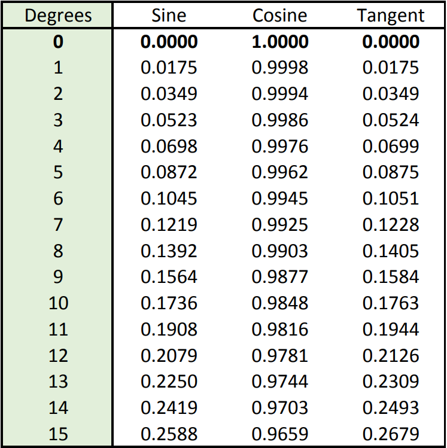  
  
  
  
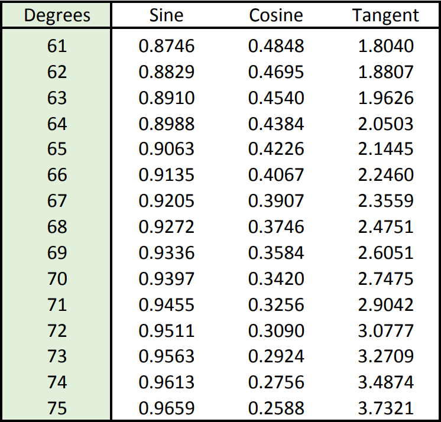  
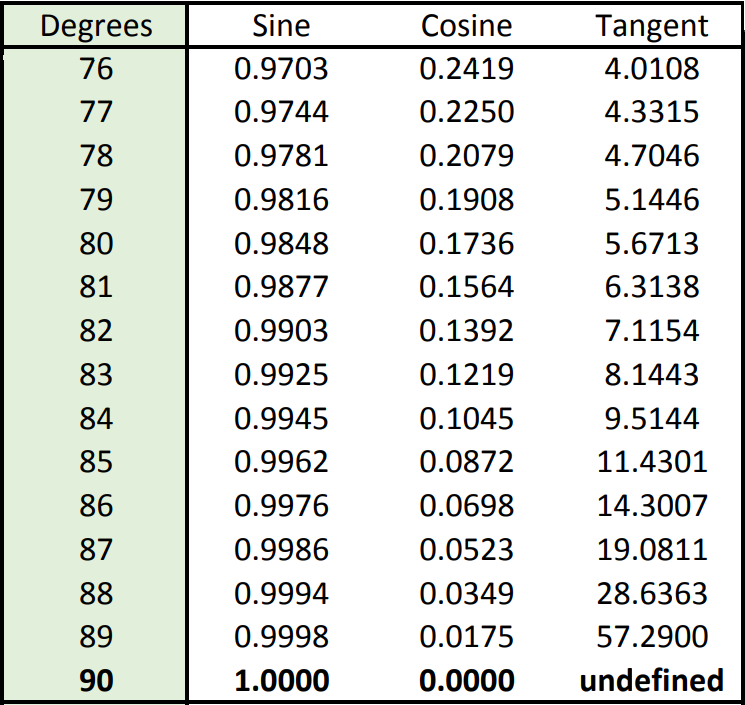  

<!--- ( 91 to 180 ) -->

---

## 91 to 180

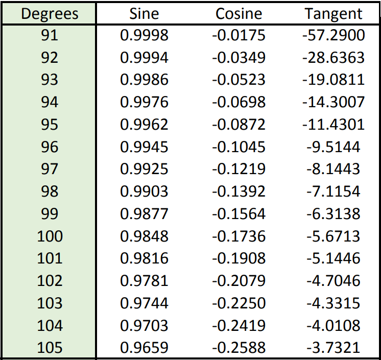  
  
  
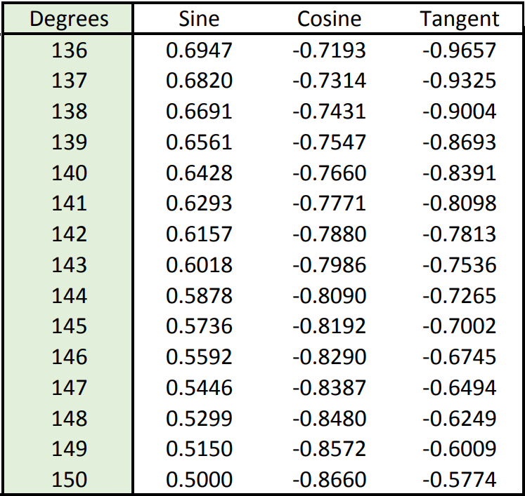  
  
  

<!--- ( 181 to 270 ) -->

---

## 181 to 270

  
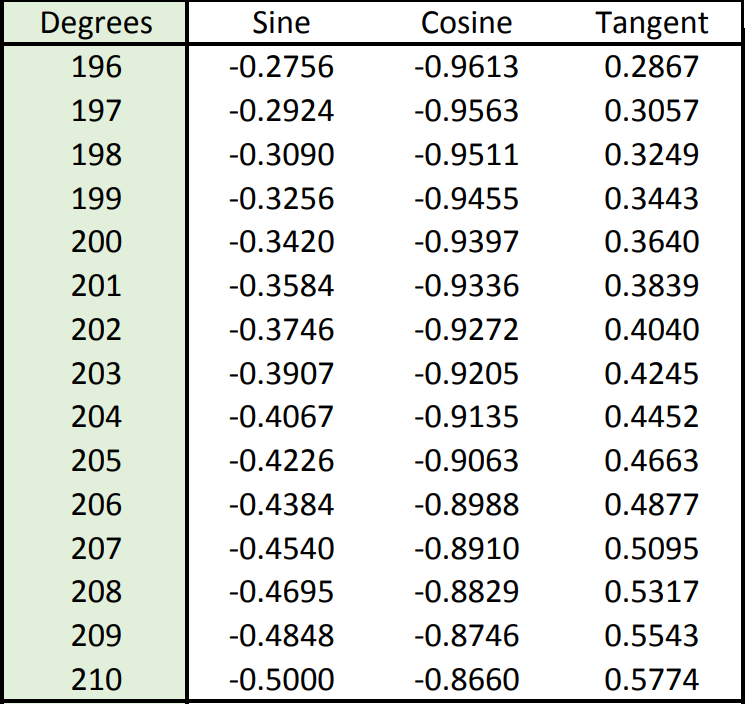  
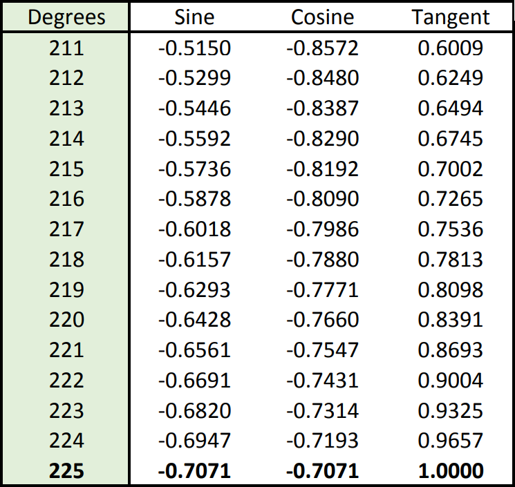  
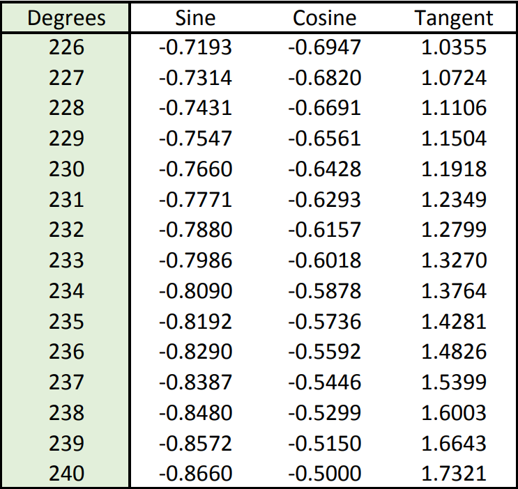  
  
  

<!--- ( 271 to 360 ) -->

---

## 271 to 360

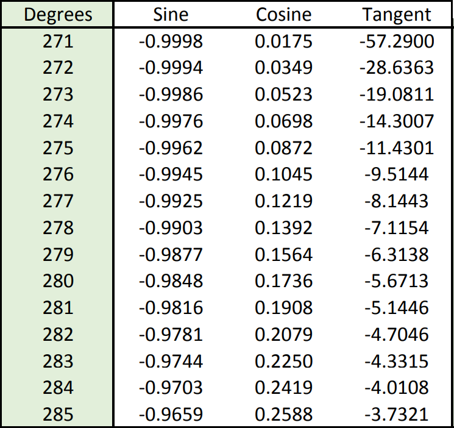  
  
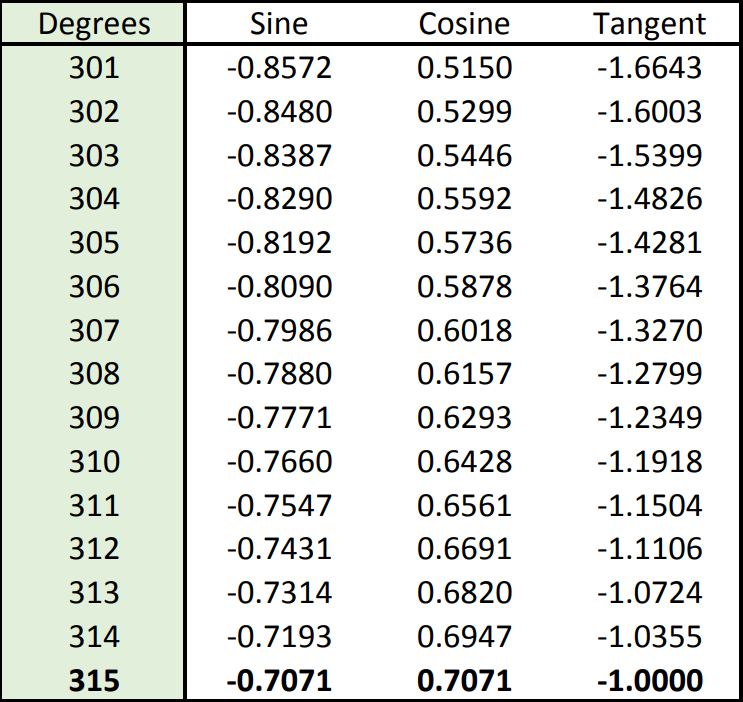  
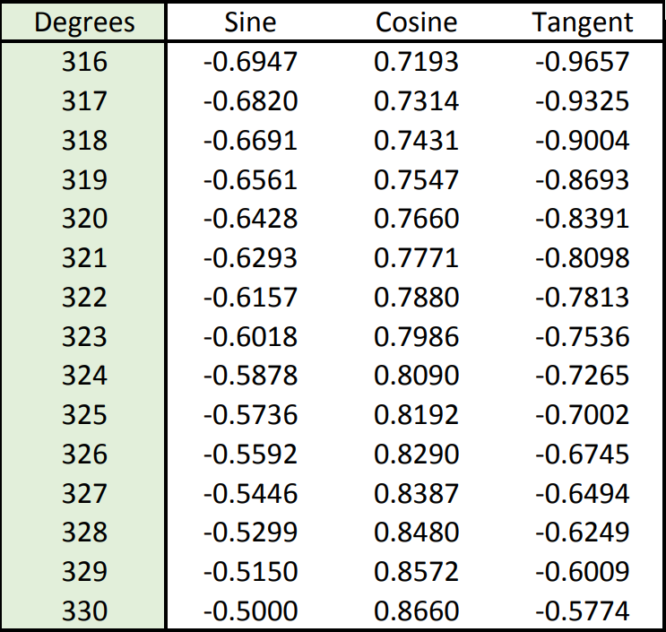  
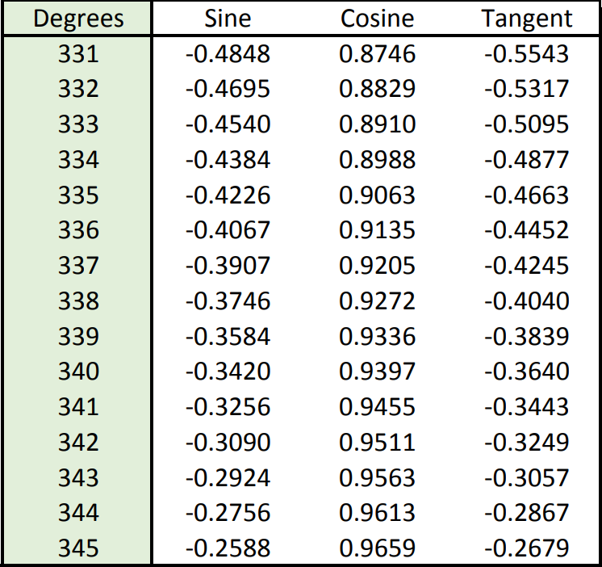  
  

<!--- ( References ) -->

---

## REFERENCES

 - [**Sine, Cosine, and Tangent Table: 0 to 360 degrees**](https://digitalcommons.unl.edu/cgi/viewcontent.cgi?article=1011&context=mathclass)

---

Ro**drigo** **L**eite da **S**ilva - **drigols**
