# Adição, Subtração, Multiplicação e Divisão

## Conteúdo

 - **Adição:**
   - [Como fazer adição com números que tem vírgula?](#add-w-comma)
 - **Subtração:**
   - [Como aplicar o conceito de pegar emprestado na subtração](#sub-with-borrow)
 - **Divisão:**
   - [Quais são os compoenentes de uma divisão?](#div-components)
   - [Regra da vírgula no quociente](#comma-rule)
   - [Divisão onde o dividendo tem mais de uma casa decimal](#div-more-units-01)
   - [Algumas divisões necessitam pegar mais de um digito por vez](#div-more-units-2)
   - [Regra do elevador](#elevator-rule)
   - [Como fazer divisão com números decimais?](#div-w-decimals)
 - [**REFERÊNCIA**](#ref)
<!--- ( Questões Abertas ) --->
<!--- ( Questões do ENEM ) --->
<!--- ( Questões de Concurso ) --->
<!---
[WHITESPACE RULES]
- Same topic = "10" Whitespace character.
- Different topic = "200" Whitespace character.
--->


<!--- ( Adição ) --->

---

<div id="add-w-comma"></div>

## Como fazer adição com números que tem vírgula?

> Como se faz uma adição de um ou mais números com virgula?

Por exemplo:

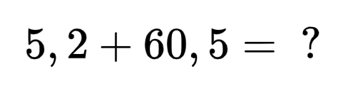  

<details>

<summary>RESPOSTA</summary>

<br/>

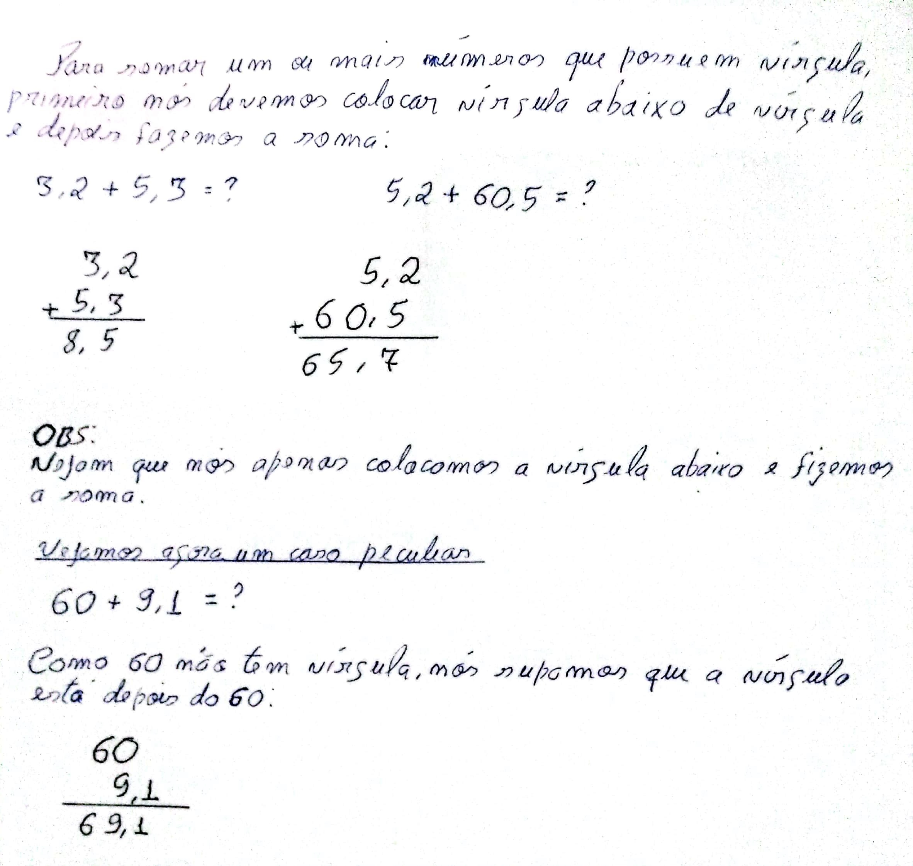  

</details>


<!--- ( Subtração ) --->

---

<div id="sub-with-borrow"></div>

## Como aplicar o conceito de pegar emprestado na subtração

> Como faz quando em uma subtração não é possível diminuir uma unidade, pois ela é menor do que o que queremos diminuir?

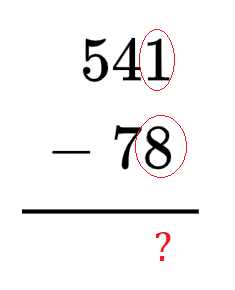  
<!---
\begin{array}{r}
  541 \\
- \ 78 \\
\hline
\end{array}
--->

<details>

<summary>RESPOSTA</summary>

<br/>

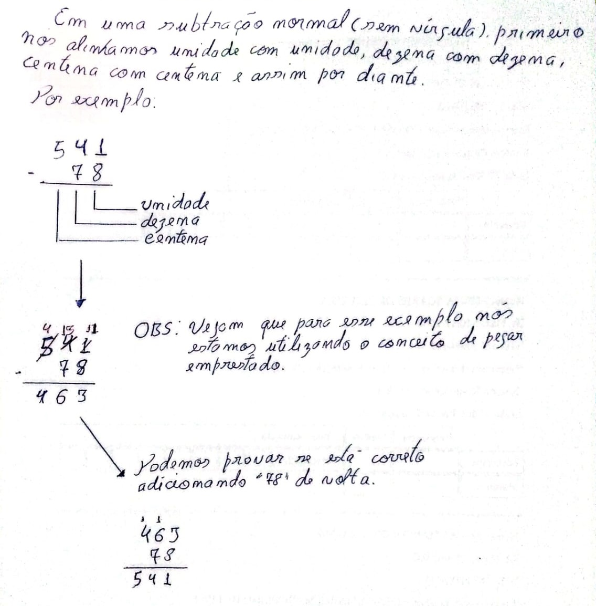  

</details>


<!--- ( Divisão ) --->

---

<div id="div-components"></div>

## Quais são os compoenentes de uma divisão?

<details>

<summary>RESPOSTA</summary>

<br/>

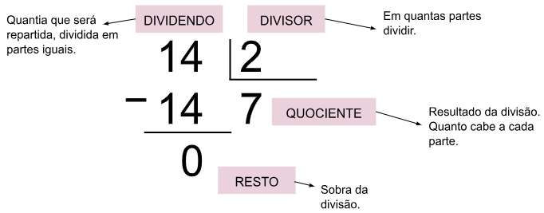  

</details>


---

<div id="comma-rule"></div>

## Regra da vírgula no quociente

Em alguns casos de divisão não seria possível terminar a divisão por completa porque o nosso resto não será iguala zero.

> **Como resolver?**

Por exemplo:

$9 \div 2$

<details>

<summary>RESPOSTA</summary>

<br/>

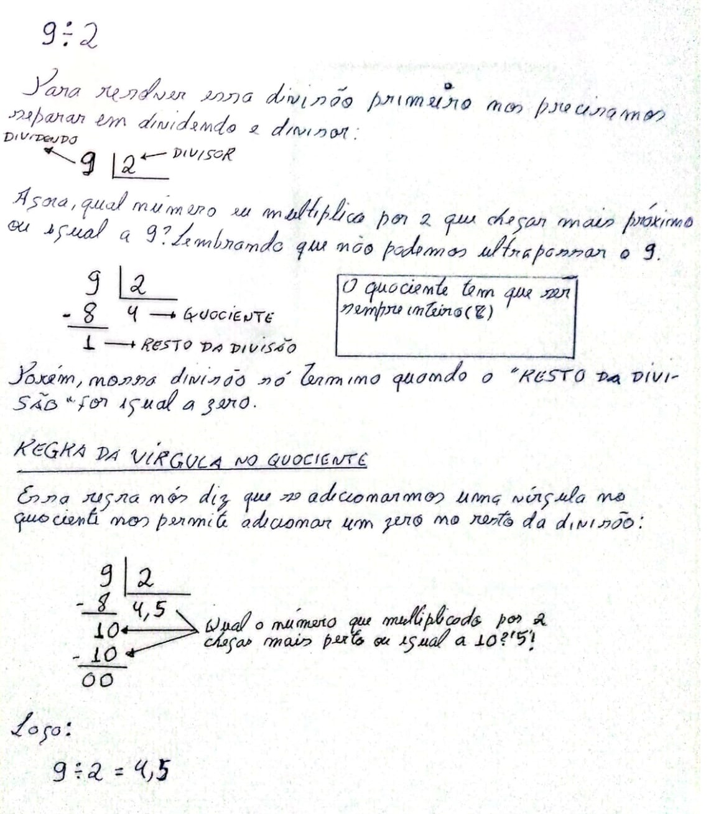  

</details>


---

<div id="div-more-units-01"></div>

## Divisão onde o dividendo tem mais de uma casa decimal

> **Como fazemos uma divisão, onde o dividendo tem mais de uma casa decimal?**

Por exemplo:

$438 \div 2$

<details>

<summary>RESPOSTA</summary>

<br/>

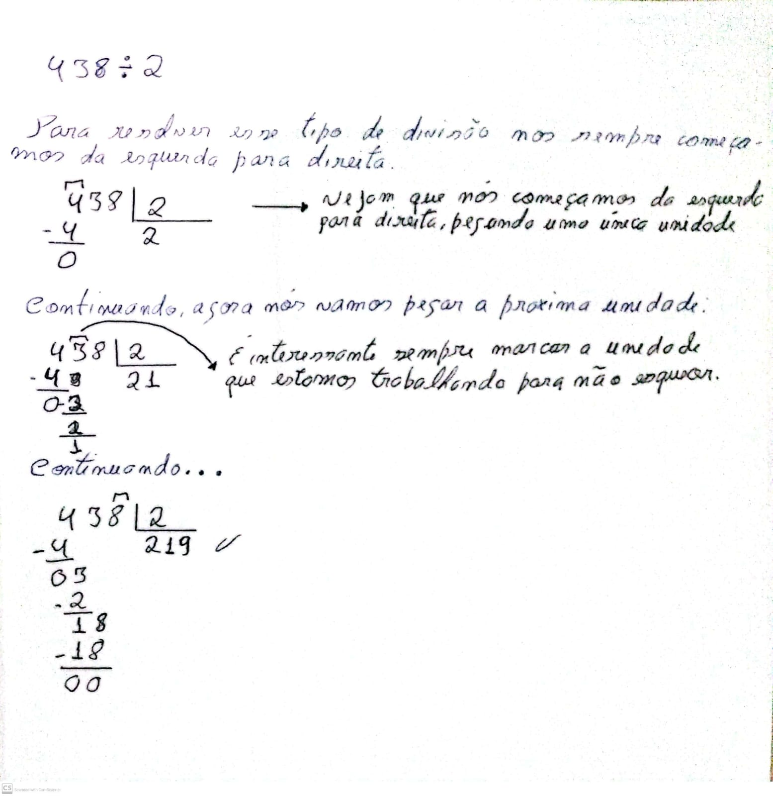

</details>


---

<div id="div-more-units-2"></div>

## Algumas divisões necessitam pegar mais de um digito por vez

> Em algumas divisões se faz necessário pegar mais de um digito (unidade) por vez para fazer a divisão.

Por exemplo:

$5674 \div 20$

<details>

<summary>RESPOSTA</summary>

<br/>

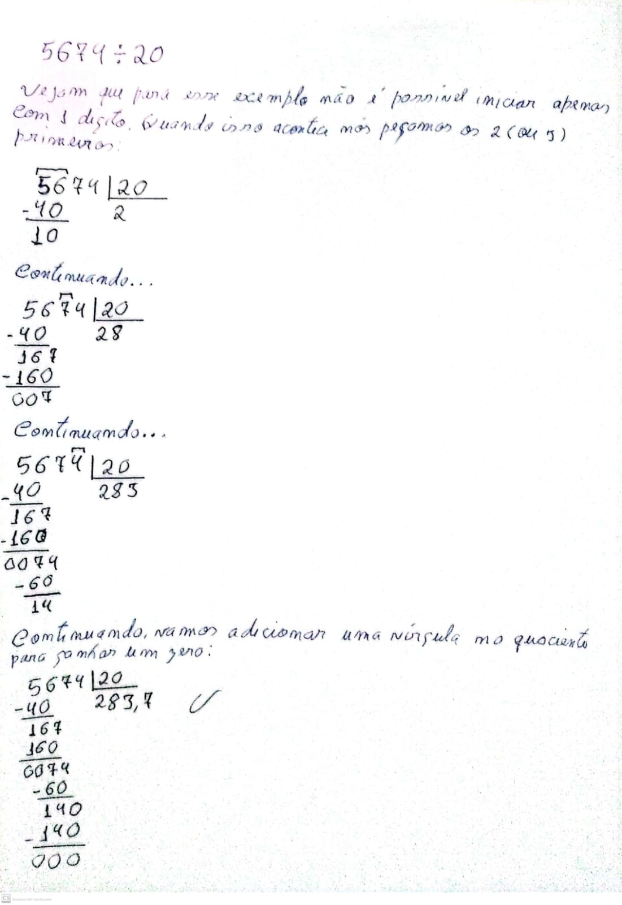  

</details>


---

<div id="elevator-rule"></div>

## Regra do elevador

Para entender a **regra do elevador** imagine que nós temos a seguinte divisão:

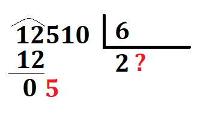  

E agora? Se nós multiplicarmos por 1 vai dá 6 que é maior do que 5.

> **Como resolver agora?**

<details>

<summary>RESPOSTA</summary>

<br/>

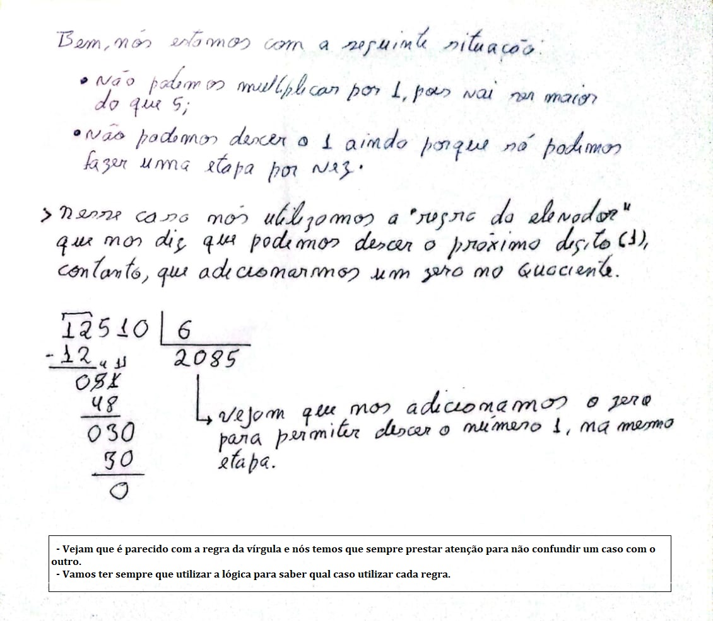  

</details>


---

<div id="div-w-decimals"></div>

## Como fazer divisão com números decimais?

Como fazer divisão de números que contenham casas decimais, por exemplo:

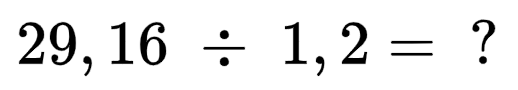  

<details>

<summary>RESPOSTA</summary>

<br/>

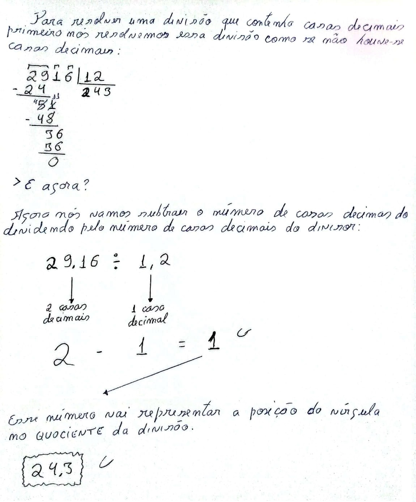  

</details>


<!--- ( REFERÊNCIA ) --->

---

<div id="ref"></div>

## REFERÊNCIA

 - **Cursos:**
   - [Licenciatura - Matemática](https://www.faculdadeunica.com.br/graduacao/ead/matematica-3080)
 - **Livros:**
   - [Fundamentos Matemáticos Para a Ciência da Computação](https://www.amazon.com.br/Fundamentos-Matem%C3%A1ticos-Para-Ci%C3%AAncia-Computa%C3%A7%C3%A3o/dp/8521614225)
 - **Youtubers:**
   - [Rota do Enem](https://www.youtube.com/@rotadoenemjp/videos)

---

**Rodrigo** **L**eite da **S**ilva - **rodrigols89**

<details>

<summary></summary>

<br/>

RESPOSTA

```bash

```

  

</details>
