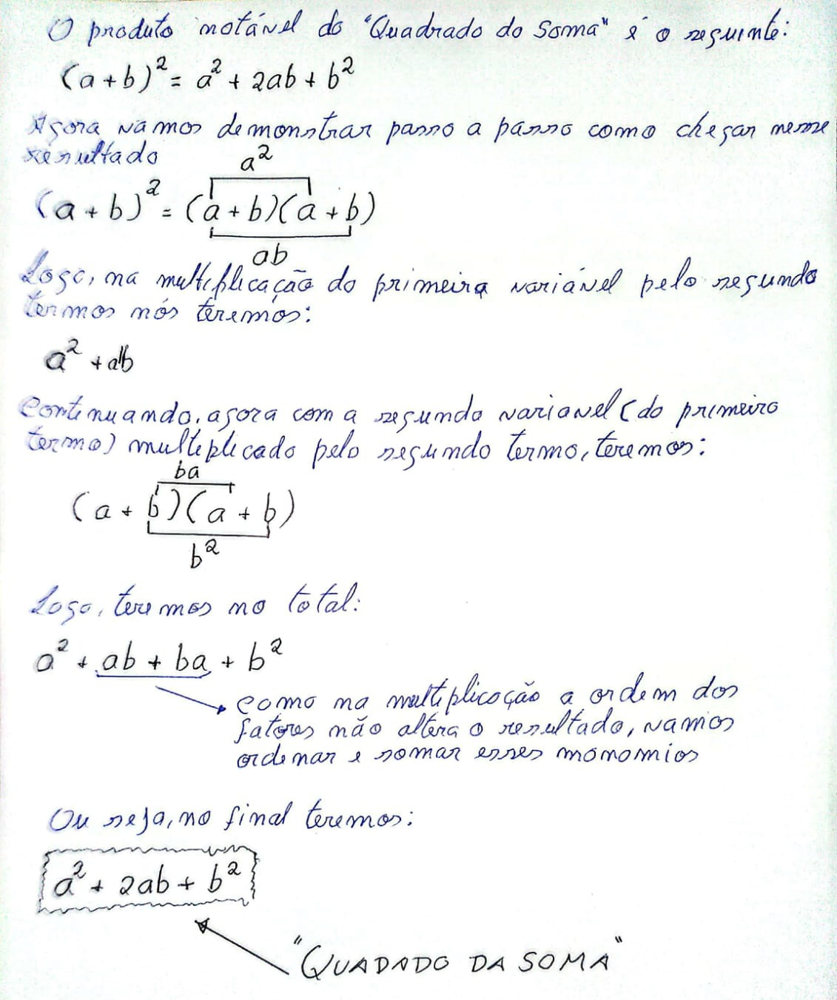
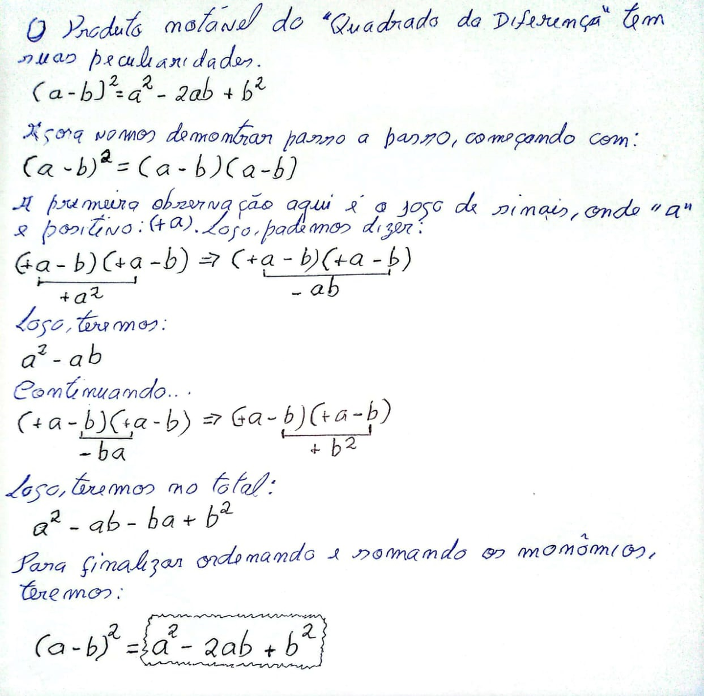
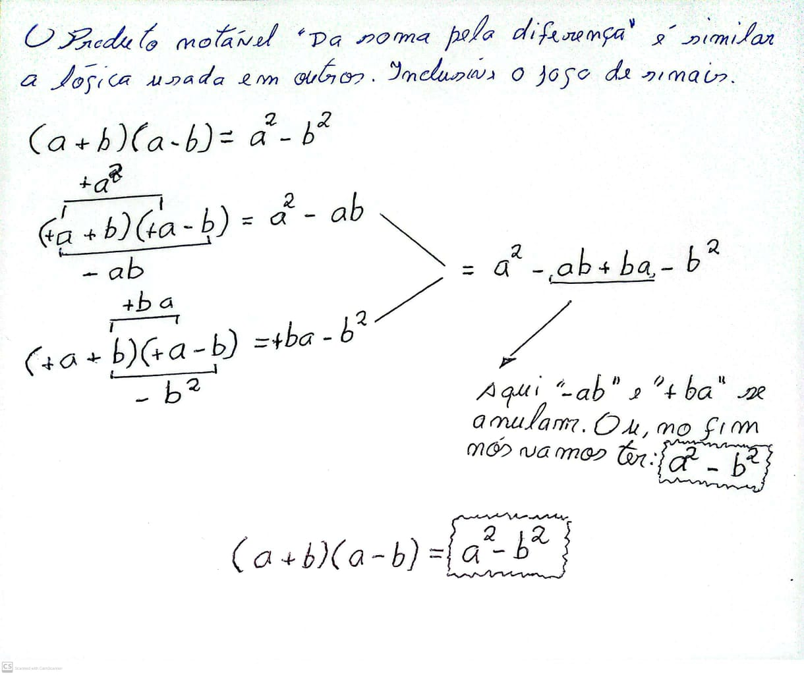
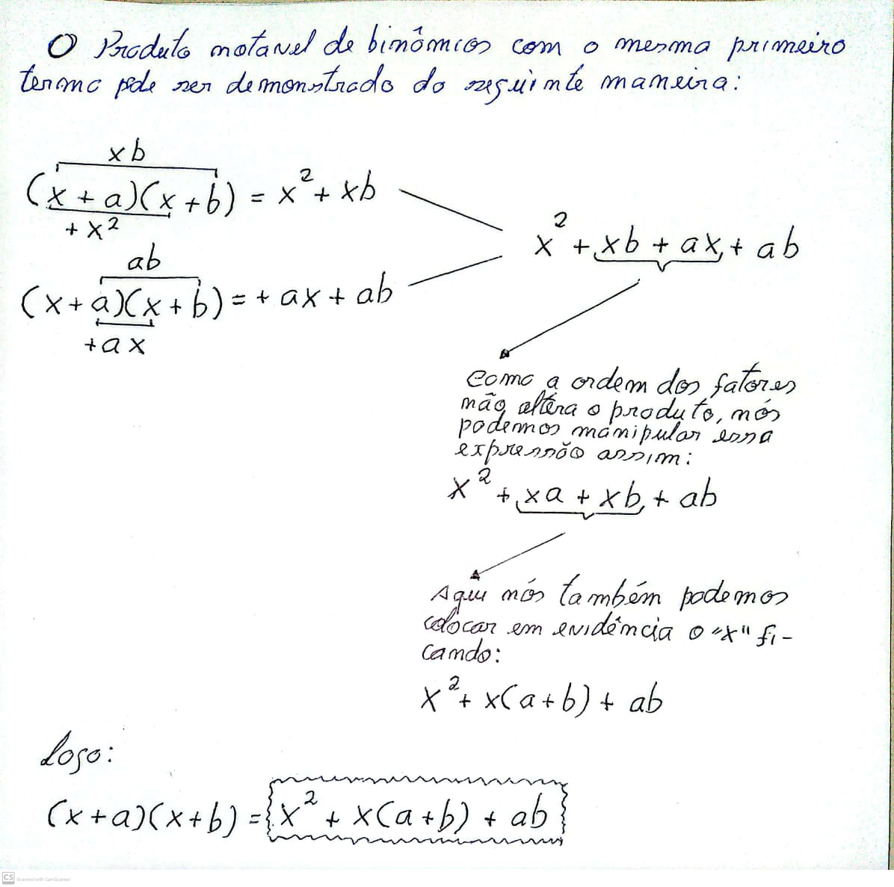

# Expressões Algébricas: Manipulações, Fatorações

## Conteúdo

 - [**O que é um monômio?**](#what-is-a-monomial)
 - [**O que é um polinômio?**](#what-is-a-polinomial)
 - [**O que é por em evidência?**](#por-em-evidencia)
   - [O que é fator comum polinomial (binomial em evidência)?](#binomial-in-evidence)
   - [O que é Fatoração por Agrupamento?](#factor-by-grouping)
   - [Como colocar em evidência um fator negativo?](#putting-negative-factors-in-evidence)
 - [**O que são Produtos Notáveis?**](#notable-products)
   - [Qual o Produto Notável do "Quadrado da soma"?](#sum-of-squares)
   - [Qual o Produto Notável do "Quadrado da Diferença"?](#difference-of-squares)
   - [Produto da soma pela diferença](#product-of-sum-by-difference)
   - [Binômios com mesmo primeiro termo](#binomials-with-same-first-term)
 - [**REFERÊNCIA**](#ref)
<!--- ( Questões Abertas ) --->
<!--- ( Questões do ENEM ) --->
<!--- ( Questões de Concurso ) --->
<!---
[WHITESPACE RULES]
- Same topic = "20" Whitespace character.
- Different topic = "200" Whitespace character.
--->


<!--- ( Por em evidência ) --->

---

<div id="what-is-a-monomial"></div>

## O que é um monômio?

> **O que é um monômio?**

<details>

<summary>RESPOSTA</summary>

<br/>

Um **monômio** é uma **expressão algébrica** que contém:
- um **número** (coeficiente),
- multiplicado por **letras** (variáveis),
- que podem estar elevadas a **expoentes inteiros não negativos**.

Ou seja:  

> 👉 É um **único termo algébrico** formado por multiplicação de números e letras.  

**EXEMPLO-01:**

$5$  
(um monômio com coeficiente $5$ e nenhuma variável).

<br/>

**EXEMPLO-02:**

$x$  
(um monômio com coeficiente $1$ e variável $x$).

<br/>

**EXEMPLO-03:**

$-7y$  
(um monômio com coeficiente $-7$ e variável $y$).

<br/>

**EXEMPLO-04:**

$3x^2$  
(um monômio com coeficiente $3$ e variável $x^2$).

**EXEMPLO-05:**

$-2ab$  
(um monômio com coeficiente $-2$, variáveis $a$ e $b$).

</details>


<!--- ( Polinômios ) --->

---

<div id="what-is-a-polinomial"></div>

## O que é um polinômio?

> **O que é um polinômio?**

<details>

<summary>RESPOSTA</summary>

<br/>

> Um **polinômio** é uma **expressão algébrica** formada pela **soma ou subtração de monômios**.

**EXEMPLO-01:**

$7x^2$  
(apesar de ter só um termo, ainda é considerado um polinômio: um **monômio**).

<br/>

**EXEMPLO-02:**

$3x + 5$  
(pol. com 2 termos: um com variável, outro constante).

<br/>

**EXEMPLO-03:**

$y^2 - 4$  
(pol. com 2 termos → chamado **binômio**).

<br/>

**EXEMPLO-04:**

$2a + 3b - 7$  
(pol. com 3 termos → chamado **trinômio**).

<br/>

**EXEMPLO-05:**

$4x^3 + 2x^2 - x + 9$  
(pol. com 4 termos → não tem nome especial, apenas **polinômio**).

<br/>

**EXEMPLO-06:**

$\frac{1}{2}x^2 - \frac{3}{4}x + \frac{5}{6}$

<br/>

**EXEMPLO-07:**

$6x^5 - 3x^3 + x^2 - 8$

#### 📌 Observações importantes

1. **Polinômio ≠ Monômio**  
   - Monômio → um termo.  
   - Polinômio → dois ou mais termos (soma/subtração).  

2. **Grau do polinômio**  
   - O grau é o **maior grau entre os seus monômios**.  
   - Exemplo:  
     $2x^3 + 5x^2 - x + 7$ → grau $3$.  

3. **Tipos de polinômios por número de termos**  
   - **Monômio** → 1 termo.  
   - **Binômio** → 2 termos.  
   - **Trinômio** → 3 termos.  
   - **Polinômio** → 4 ou mais termos.  

4. **Coeficientes e termos independentes**  
   - Em $3x^2 + 2x - 5$:  
     - Coeficientes: $3$, $2$ e $-5$.  
     - Termo independente: $-5$.  

#### 🚀 Conclusão

 - Polinômios são **somas ou subtrações de monômios**.  
 - São classificados pelo **número de termos** e pelo **grau**.  
 - Representam a base para estudos de **equações, fatoração e produtos notáveis**.

</details>


<!--- ( Por em evidência ) --->

---

<div id="por-em-evidencia"></div>

## O que é por em evidência?

> **O que é por em evidência uma expressão?**

<details>

<summary>RESPOSTA</summary>

<br/>

Bem, para entender esse conceito vamos partir da *Propriedade Distributiva*:

$a(b + c) = a \cdot b + a \cdot c$

> **Mas qual relação essa propriedade (distributiva) tem com "Port em evidência"?**

Vamos partir da seguinte expressão:

$7 \cdot 4 + 3 \cdot 4$

> **Agora, qual termo aparece em comum nas 2 expressões?**  
> "4".

Vocês concordam que nós poderíamos fazer:

$7 \cdot 4 + 3 \cdot 4 = 4(7 + 3)$

> **What?**  
> Isso mesmo nós fizemos o caminho inverso da *"Propriedade Distributiva"*.

Vamos ver outros exemplos para ficar mais claro...

**EXEMPLO-01:**
$4 \cdot π \cdot 3 + 2 \cdot  π =  π(4 \cdot 3 + 2)$

**EXEMPLO-02:**
$ 8 \sqrt{2} - 3 \sqrt{2} = \sqrt{2}(8 - 3)$

**EXEMPLO-03:**
$(x + 1)(6 - x) + (x + 1)(7) = (x + 1)[(6 - 1) + 7]$

**EXEMPLO-04:**
$4 \sqrt{3} + \frac{\sqrt{3}}{2}$

**NOTE:**  
Bem, essa expressão acima é peculiar... vocês concordam que a segunda parte da expressão acima poderia se escrita assim:

$\frac{\sqrt{3}}{2} = \sqrt{3} \cdot \frac{1}{2} $

Isso porque existe uma propriedade fundamental da divisão que é a seguinte:

$a \div b = a \cdot  \frac{1}{b}, \ b \neq 0$

Ou seja, na nossa expressão, onde $a = \sqrt{3}$ e $b = 2$ nós teríamos:

$\sqrt{3} \div 2 = \sqrt{3} \cdot \frac{1}{2} = \frac{\sqrt{3}}{2}$

Continuando, agora nossa expressão vai ser a seguinte:

$4 \sqrt{3} + \sqrt{3} \cdot \frac{1}{2}$

Agora, sabendo que o temro $\sqrt{3}$ aparece nas 2 expressões, podemos por em evidência assim:

$4 \sqrt{3} + \sqrt{3} \cdot \frac{1}{2} = \sqrt{3}(4 + \frac{1}{2})$

> **NOTE:**  
> Uma observação é que essa regra se aplica as 4 operações matemáticas: `+`, `-`, `*`, `/`.

</details>


---

<div id="binomial-in-evidence"></div>

## O que é fator comum polinomial (binomial em evidência)?

> **O que é fator comum polinomial  (binomial em evidência)?**

<details>

<summary>RESPOSTA</summary>

<br/>

Muitas vezes o fator comum não é um número ou variável, e sim um **polinômio inteiro**.

 - **Monômio:**
   - Um monômio é simplesmente um *termo algébrico único*, formado por um número (coeficiente) multiplicado por variáveis com expoentes inteiros não negativos.
 - **Polinômio:**
   - Soma de monômios, com variáveis elevadas a expoentes inteiros não negativos.
 - **Polinômio inteiro**:
   - É um polinômio que **não aparece com a variável no denominador** (ou seja, está escrito de forma "limpa", como soma de monômios).”

A ideia é a mesma de **"Por em evidência" simples**:

$A \cdot P(x) + B\cdot P(x) = P(x)(A + B)$

**EXEMPLO-01:**

$2(x + 1) + 3(x + 1)$

👉 Fator comum: $(x + 1)$.

$(2+3)(x+1) = 5(x+1)$

**EXEMPLO-02:**

$x(x + 2) + 5(x + 2)$

👉 Fator comum: $(x + 2)$

$(x + 5)(x + 2)$

**EXEMPLO-03:**

$(x^2+1)(x-3) - 4(x^2+1)$
  
👉 Fator comum: $(x^2+1)$

$(x^2+1)\big((x-3)-4\big) = (x^2+1)(x-7)$

</details>


---

<div id="factor-by-grouping">

## O que é Fatoração por Agrupamento?

> **O que é Fatoração por Agrupamento?**

<details>

<summary>RESPOSTA</summary>

<br/>

> Às vezes, não existe **um único fator comum** em **todos os termos** da expressão.

 - Nesse caso, podemos **agrupar** os termos em pares (ou blocos) e colocar em evidência dentro de cada grupo (bloco).
 - Depois, se sobrar um fator comum polinomial, conseguimos fatorar de forma completa.

**EXEMPLO-01:**

$ax + ay + bx + by$
  
👉 Agrupando em bloco nós teremos: 

$(ax + ay) + (bx + by)$

👉 Colocando em evidência dentro de cada bloco:  

$a(x+y) + b(x+y)$
  
👉 Agora o fator comum é $(x + y)$:

$(x+y)(a+b)$

<br/>

**EXEMPLO-02:**

$ab + ac + db + dc$
  
👉 Agrupando em bloco nós teremos:

$(ab + ac) + (db + dc)$

👉 Colocando em evidência:

$a(b+c) + d(b+c)$
  
👉 Fator comum: $(b+c)$:

$(b+c)(a+d)$

<br/>

**EXEMPLO-03:**

$2x^2 + 6x + 5x + 15$
  
👉 Agrupando em bloco nós teremos:

$(2x^2+6x) + (5x+15)$

👉 Colocando em evidência:

$2x(x+3) + 5(x+3)$
  
👉 Fator comum: $(x+3)$:

$(x+3)(2x+5)$

<br/>

**EXEMPLO-04:**

$x^3+3x^2+2x+6$
  
👉 Agrupando em bloco nós teremos:

$(x^3+3x^2)+(2x+6)$
  
👉 Colocando em evidência:

$x^2(x+3)+2(x+3)$

👉 Fator comum: $(x+3)$:

$(x+3)(x^2+2)$

<br/>

**EXEMPLO-05:**

$a^3+2a^2+3a+6$

👉 Agrupando em bloco nós teremos:

$(a^3+2a^2)+(3a+6)$

👉 Colocando em evidência:

$a^2(a+2)+3(a+2)$
  
👉 Fator comum: $(a+2)$:

$(a+2)(a^2+3)$

<br/>

**EXEMPLO-06:**

$2x^3+4x^2+3x+6$

👉 Agrupando em bloco nós teremos:

$(2x^3+4x^2)+(3x+6)$

👉 Colocando em evidência:

$2x^2(x+2)+3(x+2)$
  
👉 Fator comum: $(x+2)$:

$(x+2)(2x^2+3)$

#### 🚀 Conclusão

Se vocês prestarem atenção vão ver que nessa abordagem:

 - Primeiro, nós separaramos (agrupamos) os termos em blocos;
 - Depois colocamos em evidência esses agrupamentos (blocos):
   - Claro, fazendo com que apareçam termos semelhantes que possam ser colocados em evidência.
   - E isso é feito realizando manipulações algébricas.

</details>


---

<div id="putting-negative-factors-in-evidence">

## Como colocar em evidência um fator negativo?

> Como colocar em evidência um fator negativo?

<details>

<summary>RESPOSTA</summary>

<br/>

Até agora, vimos como colocar fatores positivos em evidência.  
Mas também podemos **colocar em evidência um fator negativo** quando isso ajuda a simplificar a expressão.  

> ➡️ O truque é **"puxar" o sinal negativo para fora dos parênteses**, o que inverte o sinal de todos os termos dentro.

**EXEMPLO-01:**

$-x - y = -(x + y)$

**EXEMPLO-02:**

$-a - b - c = -(a + b + c)$

**EXEMPLO-03:**

$-2x + 4 = -(2x - 4)$

**EXEMPLO-04:**

$-x^2 - 3x = -(x^2 + 3x)$

**EXEMPLO-05:**

$-m^2 + n^2 = -(m^2 - n^2)$

**EXEMPLO-06:**

$-4x^2 - 8x = -4(x^2 + 2x)$

**EXEMPLO-07:**

$-a^3 - 2a^2 - a = -(a^3 + 2a^2 + a)$

**EXEMPLO-08:**

$-3x^2y - 6xy^2 = -3xy(x + 2y)$

**EXEMPLO-09:**

$-x^3 - x^2 - x - 1 = -(x^3 + x^2 + x + 1)$

**EXEMPLO-10:**

$-2x^3 - 4x^2 - 6x = -2(x^3 + 2x^2 + 3x)$

#### 🚀 Conclusão

 - Colocar um **fator negativo em evidência** é útil para simplificar expressões e preparar uma fatoração mais organizada.  
 - A regra prática é:
   - Se todos os termos têm sinal negativo, podemos colocar **$-1$** em evidência.
   - Se todos os termos têm um fator comum **e negativo**, podemos colocá-lo em evidência (ex: $-2$, $-3x$, etc.).  

</details>


<!--- ( Produtos notáveis ) --->

---

<div id="notable-products"></div>

## O que são Produtos Notáveis?

> **O que são Produtos Notáveis?**

<details>

<summary>RESPOSTA</summary>

<br/>

 - *Produtos Notáveis* são multiplicações de expressões (geralmente binômios) que seguem *padrões fixos*.  
 - **NOTE:** Eles derivam da **propriedade distributiva** e servem como *atalhos* para expandir (multiplicar) ou reconhecer *fatorações*.

#### ✅ Resumindo, Produtos Notáveis são (é)
 
 - *Padrões de multiplicação* que vêm da *distributiva*.
 - Servem para *expandir rápido* e para *fatorar reconhecendo padrões*.

</details>


---

<div id="sum-of-squares"></div>

## Qual o Produto Notável do "Quadrado da soma"?

> **Qual o Produto Notável do "Quadrado da soma" (demonstre)?**

<details>

<summary>RESPOSTA</summary>

<br/>

  

</details>


---

<div id="difference-of-squares"></div>

## Qual o Produto Notável do "Quadrado da Diferença"?

> **Qual o Produto Notável do "Quadrado da Diferença" (demonstre)?**

<details>

<summary>RESPOSTA</summary>

<br/>

  

</details>


---

<div id="product-of-sum-by-difference"></div>

## Produto da soma pela diferença

> **O que é (demonstre) o produto da soma pela diferença?**

<details>

<summary>RESPOSTA</summary>

<br/>

  

</details>


---

<div id="binomials-with-same-first-term"></div>

## Binômios com mesmo primeiro termo

> **O que é (demonstre) Binômios com mesmo primeiro termo?**

<details>

<summary>RESPOSTA</summary>

<br/>



</details>


<!--- ( REFERÊNCIA ) --->

---

<div id="ref"></div>

## REFERÊNCIA

 - **Cursos:**
   - [Licenciatura - Matemática](https://www.faculdadeunica.com.br/graduacao/ead/matematica-3080)

---

**Rodrigo** **L**eite da **S**ilva - **rodrigols89**

<details>

<summary></summary>

<br/>

RESPOSTA

```bash

```

  

</details>
