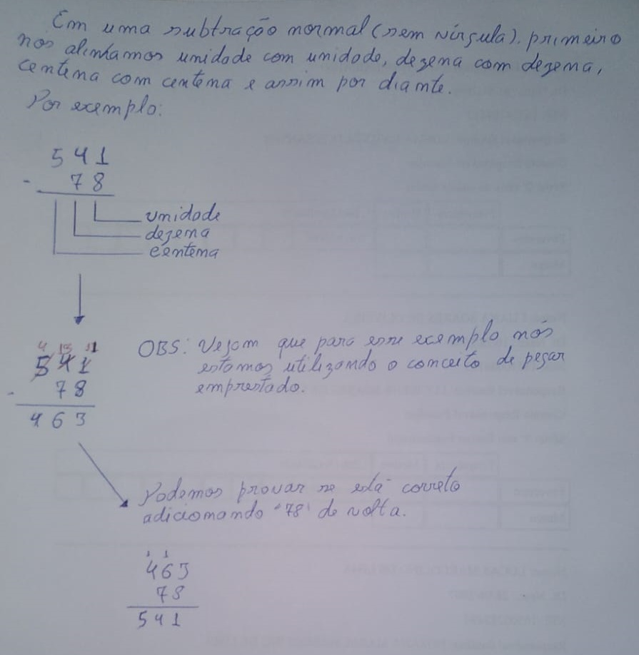
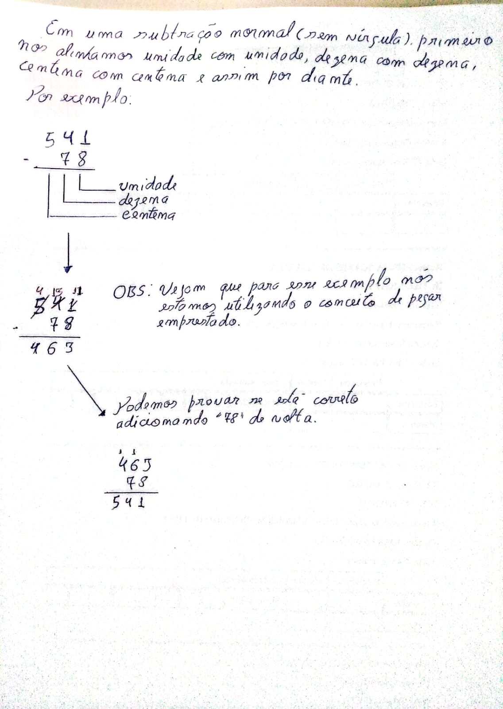

# Adição, Subtração, Multiplicação e Divisão

## Conteúdo

<!---
[WHITESPACE RULES]
- Same topic = "20" Whitespace character.
- Different topic = "200" Whitespace character.
--->

<!--- ( Lógica das Proposições ) --->

---

## Teste

Resposta

RESPOSTA

 

  

RESPOSTA

 

  

RESPOSTA

 

  

<!--- ( REFERÊNCIA ) --->

---

## REFERÊNCIA

 - **Cursos:**
   - [Licenciatura - Matemática](https://www.faculdadeunica.com.br/graduacao/ead/matematica-3080)
 - **Livros:**
   - [Fundamentos Matemáticos Para a Ciência da Computação](https://www.amazon.com.br/Fundamentos-Matem%C3%A1ticos-Para-Ci%C3%AAncia-Computa%C3%A7%C3%A3o/dp/8521614225)

---

**Rodrigo** **L**eite da **S**ilva - **rodrigols89**
