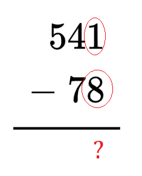

# Adição, Subtração, Multiplicação e Divisão

## Conteúdo

 - **Adição:**
   - [Como fazer adição com números que tem vírgula?](#add-w-comma)
 - **Subtração:**
   - [Como aplicar o conceito de pegar emprestado na subtração](#sub-with-borrow)
<!---
[WHITESPACE RULES]
- Same topic = "20" Whitespace character.
- Different topic = "200" Whitespace character.
--->

<!--- ( Adição ) --->

---

## Como fazer adição com números que tem vírgula?

> Como se faz uma adição de um ou mais números com virgula?

Por exemplo:

  

RESPOSTA

 

  

<!--- ( Subtração ) --->

---

## Como aplicar o conceito de pegar emprestado na subtração

> Como faz quando em uma subtração não é possível diminuir uma unidade, pois ela é menor do que o que queremos diminuir?

  
<!---
\begin{array}{r}
  541 \\
- \ 78 \\
\hline
\end{array}
--->

RESPOSTA

 

  

<!--- ( REFERÊNCIA ) --->

---

## REFERÊNCIA

 - **Cursos:**
   - [Licenciatura - Matemática](https://www.faculdadeunica.com.br/graduacao/ead/matematica-3080)
 - **Livros:**
   - [Fundamentos Matemáticos Para a Ciência da Computação](https://www.amazon.com.br/Fundamentos-Matem%C3%A1ticos-Para-Ci%C3%AAncia-Computa%C3%A7%C3%A3o/dp/8521614225)
 - **Youtubers:**
   - [Rota do Enem](https://www.youtube.com/@rotadoenemjp/videos)

---

**Rodrigo** **L**eite da **S**ilva - **rodrigols89**

 

