# Análise Combinatória

## Conteúdo

 - [**O que é o Princípio da Multiplicação (Eventos Conjuntos)?**](#multiplication-principle)
   - [Quantos números de quatro dígitos (Repetidos ou não existem)?](#phone-number-last-4-digits)
   - [Quantos números de quatro dígitos (Se um mesmo digito não pode ser repetido)?](#phone-number-last-4-digits-2)
   - [Como escolher 3 representates em um grupo de 25 pessoas?](#choosing-3-representatives-in-25-people)
   - [De quantas maneiras podemos escolher três representantes, para três comissões?](#choosing-3-representatives-for-3-commissions)
   - [De quantas maneiras uma pessoa pode fazer seu prato em um restaurante](#choosing-a-dish-in-a-restaurant)
   - [Quantas possibilidades de chegada existem entre 3 cavalos de corrida](#horse-racing)
   - [Quantos inteiros de três digitos (números entre 100 e 999) são pares?](#three-digit-integers-between-100-and-999)
   - [Combinações em um exame de múltipla escolha](#multiple-choice-exam)
   - [Quantas senhas diferentes existem (com 3 letras e 2 digitos)](#passwords-qa01)
   - [Quantos números de 3 digitos menores que 600 com os algarismos 8, 6, 4 e 2](#600-less-8642)
 - [**O que é o Princípio da Adição (Eventos Disjuntos)?**](#addition-principle)
   - [De quantas maneiras podemos escolher uma sobremesa entre 3 tortas e 4 bolos?](#choosing-a-dessert-between-3-tarts-and-4-cakes)
   - [Quantas escolhas possíveis um consumidor pode escolher entre dois tipos de veículos?](#choosing-a-car)
 - **Questões usando o Princípio da Multiplicação + Princípio da Adição:**
   - [Quantos números de quatro dígitos começam com 4 e 5?](#4-5-digits)
   - [De quantas maneiras uma mulher pode se vestir 7 blusas, 5 saias, 3 vestidos?](#7-blusas-5-saias-3-vestidos)
 - [**O que são Permutações?**](#permutations)
 - [**REFERÊNCIA**](#ref)
<!--- ( Questões Abertas ) --->
<!--- ( Questões do ENEM ) --->
<!--- ( Questões de Concurso ) --->
<!---
[WHITESPACE RULES]
- Same topic = "10" Whitespace character.
- Different topic = "200" Whitespace character.
--->


<!--- ( Princípio da Multiplicação (ou Regra do Produto) ) --->

---

<div id="multiplication-principle"></div>

## O que é o Princípio da Multiplicação (Eventos Conjuntos)?

> **O que é o Princípio da Multiplicação (Eventos Conjuntos)?"?**

<details>

<summary>RESPOSTA</summary>

<br/>

#### ✅ O que é?

O Princípio da Multiplicação é uma regra da contagem que diz:

> Se uma tarefa pode ser feita em “n” etapas, e cada etapa tem um número fixo de opções, o total de possibilidades é o produto desses números.

#### 📌 Quando usar?

 - As etapas são **"independentes"** (ou seja, uma escolha não interfere na outra).
 - Você quer saber quantas combinações diferentes podem ser feitas com essas escolhas.

#### 🧠 Fórmula geral

Se:

 - A 1ª etapa pode ser feita de `a` maneiras;
 - A 2ª etapa pode ser feita de `b` maneiras;
 - A 3ª etapa de `c` maneiras;

Então o total de maneiras de realizar as 3 etapas é:

```bash
a x b x c
```

</details>


---

<div id="phone-number-last-4-digits"></div>

## Quantos números de quatro dígitos (Repetidos ou não existem)?

> **A última parte do seu número de telefone contem quatro dígitos.**  
> Quantos desses números de quatro dígitos existem `(repetidos ou não)`?


<details>

<summary>RESPOSTA</summary>

<br/>

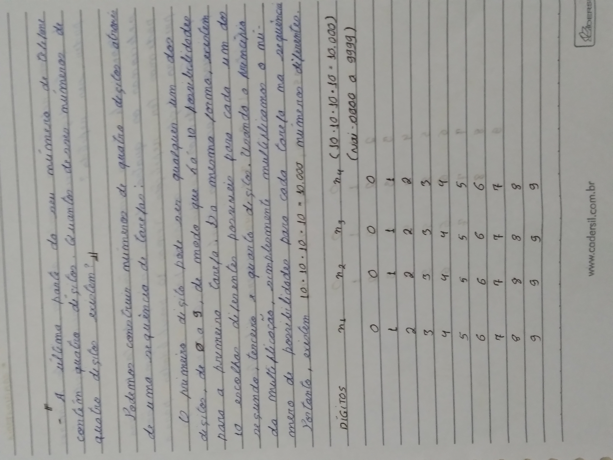  

</details>


---

<div id="phone-number-last-4-digits-2"></div>

## Quantos números de quatro dígitos (Se um mesmo digito não pode ser repetido)?

> **A última parte do seu número de telefone contem quatro dígitos.**  
> Quantos números de quatro digitos, existme se um `mesmo digito não pode ser repetido`?

<details>

<summary>RESPOSTA</summary>

<br/>

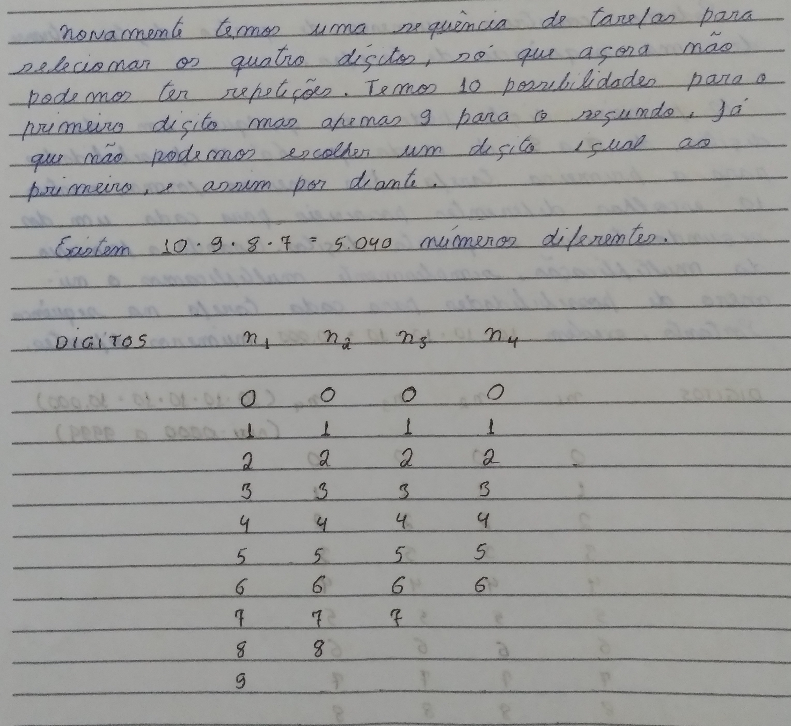  

</details>


---

<div id="choosing-3-representatives-in-25-people"></div>

## Como escolher 3 representates em um grupo de 25 pessoas

> De quantas maneiras podemos escolher três representantes em um grupo de 25 pessoas?

<details>

<summary>RESPOSTA</summary>

<br/>

 - Uma observação inicial aqui é que nós não podemos ter representantes iguais (repetidos).
 - Isso porque nós só temos um grupo/opção de escolha, *3 selecionados entre os 25 pessoas*.

  

</details>


---

<div id="choosing-3-representatives-for-3-commissions"></div>

## De quantas maneiras podemos escolher três representantes, para três comissões?

> De quantas maneiras podemos escolher três representantes, para três comissões, em um grupo de 25 pessoas, se um representate pode participar de mais de uma comissão?

<details>

<summary>RESPOSTA</summary>

<br/>

 - Uma observação aqui é que diferente da questão acima, nesse nós temos 3 grupos/opções de escolha:
   - Comissão A, comissão B e comissão C.
 - Porém, aqui nos é permitido *"que um representante participe de mais de uma comissão"*.

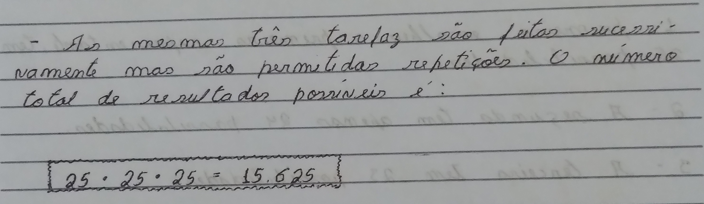  

</details>


---

<div id="choosing-a-dish-in-a-restaurant"></div>

## De quantas maneiras uma pessoa pode fazer seu prato em um restaurante

> **Um restaurante oferece no cardápio 2 saladas distintas, 4 tipos de carne, 5 variedades de bebidas e 3 sobremesas distintas.**

 - Uma pessoa deseja uma salada, um tipo de carne, uma bebida e uma sobremesa.
 - De quantas maneiras a pessoa poderá fazer seu pedido?

<details>

<summary>RESPOSTA</summary>

<br/>

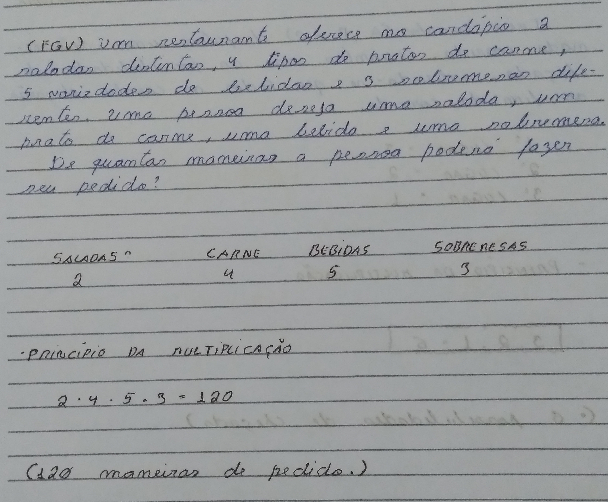  

</details>


---

<div id="horse-racing"></div>

## Quantas possibilidades de chegada existem entre 3 cavalos de corrida

> **Três cavalos (A, B e C) disputam uma determinada corrida. Quantas são as possibilidades de chegada, sabendo-se que todos os cavalos chegarão até o fim da corrida?**

<details>

<summary>RESPOSTA</summary>

<br/>

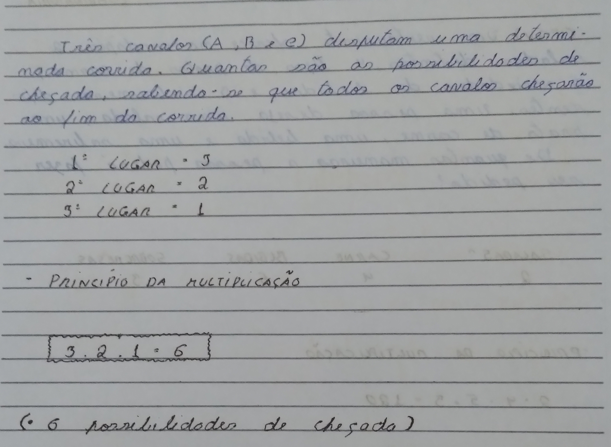  

</details>


---

<div id="three-digit-integers-between-100-and-999"></div>

## Quantos inteiros de três digitos (números entre 100 e 999) são pares?

> **Quantos inteiros de três digitos (números entre 100 e 999) são pares?**

<details>

<summary>RESPOSTA</summary>

<br/>

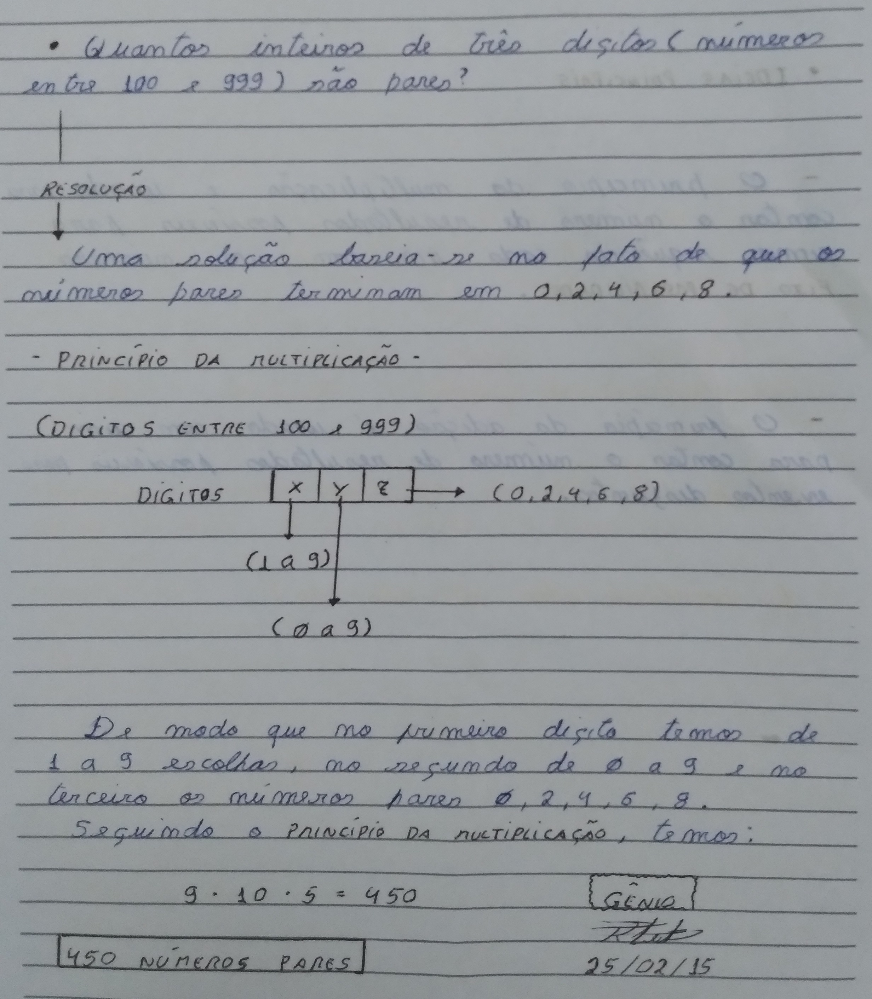  

</details>


---

<div id="multiple-choice-exam"></div>

## Combinações em um exame de múltipla escolha

> **Um exame de múltipla escolha tem 20 questões, cada uma com quatro respostas possíveis, e 10 questões adicionais, cada uma com cinco respostas possíveis.**

Quantas folhas diferentes de respostas são possíveis?

<details>

<summary>RESPOSTA</summary>

<br/>

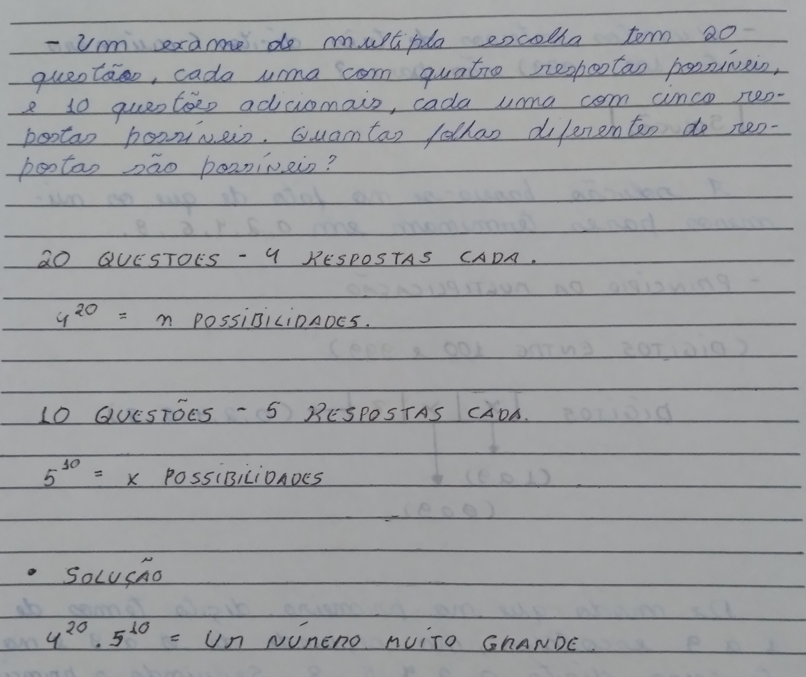  

</details>


---

<div id="passwords-qa01"></div>

## Quantas senhas diferentes existem (com 3 letras e 2 digitos)

> **Uma senha de usuário para acessar um sistema computacional consiste em 3 letras seguidas de 2 digitos.**

Quantas senhas diferentes existem?

<details>

<summary>RESPOSTA</summary>

<br/>

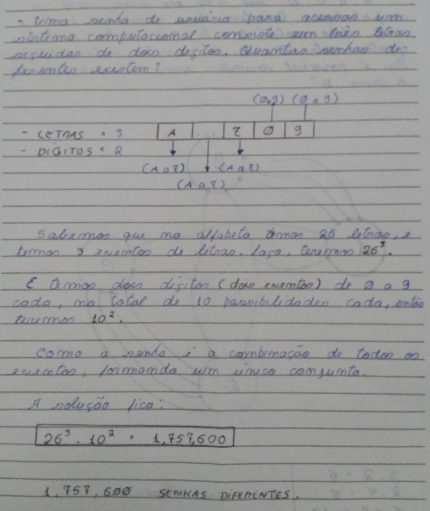  

</details>


---

<div id="600-less-8642></div>

## Quantos números de 3 digitos menores que 600 com os algarismos 8, 6, 4 e 2

> **Quantos números de três digitos menores do que 600 podem ser formados usando-se os algarismos 8, 6, 4 e 2?**

<details>

<summary>RESPOSTA</summary>

<br/>

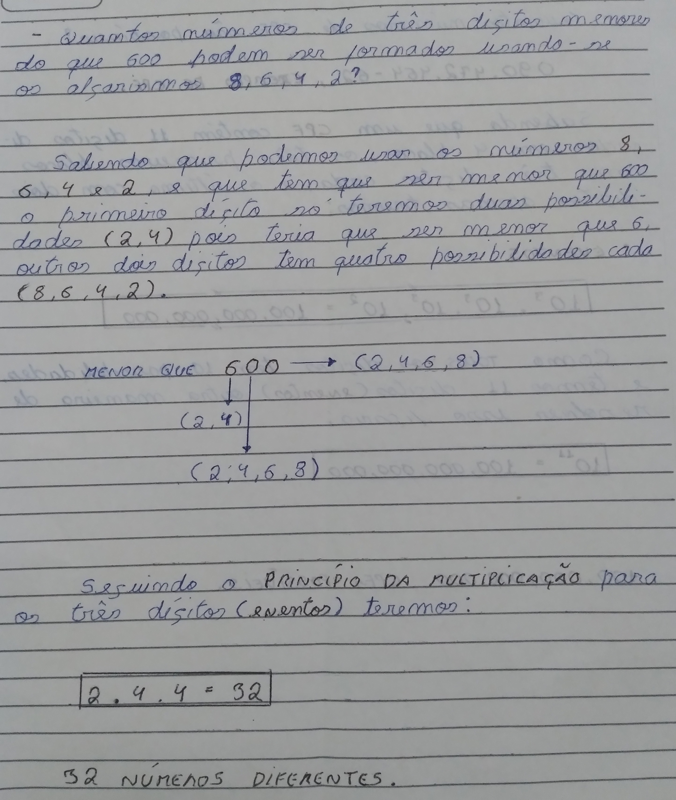  

</details>


<!--- ( Princípio da Adição ) --->

---

<div id="addition-principle"></div>

## O que é o Princípio da Adição (Eventos Disjuntos)?

> **O que é o "Princípio da Adição (ou Regra da Soma)"?**

<details>

<summary>RESPOSTA</summary>

<br/>

#### ✅ O que é?

O Princípio da Adição é uma regra de contagem que diz:

> Se uma tarefa pode ser feita de duas ou mais formas diferentes, **e apenas uma delas será escolhida**, então o total de possibilidades é a soma das opções.

#### 📌 Quando usar?

 - Você precisa escolher **uma entre várias opções diferentes**, que **não acontecem ao mesmo tempo**.
 - As opções são **mutuamente exclusivas** (ou seja, **não se sobrepõem**).

#### 🚫 Quando NÃO usar?

 - Quando a pessoa pode **usar mais de uma opção ao mesmo tempo**.
 - Quando **as opções se repetem ou se cruzam**:
   - Nesse caso é preciso ter cuidado para não contar algo duas vezes — usamos o **princípio da inclusão-exclusão** nesses casos.

#### 🧠 Fórmula geral

Se:

 - A 1ª opção pode ser feita de `a` maneiras;
 - A 2ª opção de `b` maneiras;

Então o total de maneiras de **fazer uma** ou **outra** é:

```bash
a + b
```

</details>


---

<div id="choosing-a-dessert-between-3-tarts-and-4-cakes"></div>

## De quantas maneiras podemos escolher uma sobremesa entre 3 tortas e 4 bolos?

> **Suponha que queremos selecionar uma sobremesa entre três tortas e quatro bolos.**
> De quantas maneiras isso pode ser feito?

<details>

<summary>RESPOSTA</summary>

<br/>

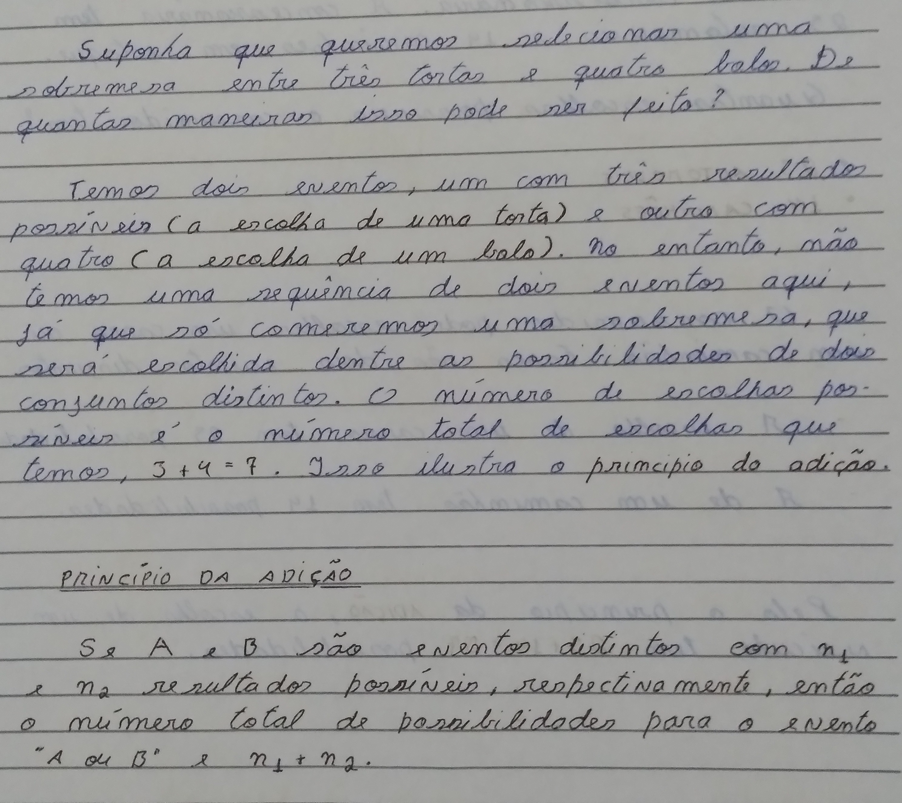  

</details>


---

<div id="choosing-a-car"></div>

## Quantas escolhas possíveis um consumidor pode escolher entre dois tipos de veículos?

> **Um consumidor deseja comprar um veículo de uma concessionária. A concessionária tem "23 automóveis" e "14 caminhões" em estoque.**
> Quantas escolher possíveis o consumidor tem?

<details>

<summary>RESPOSTA</summary>

<br/>

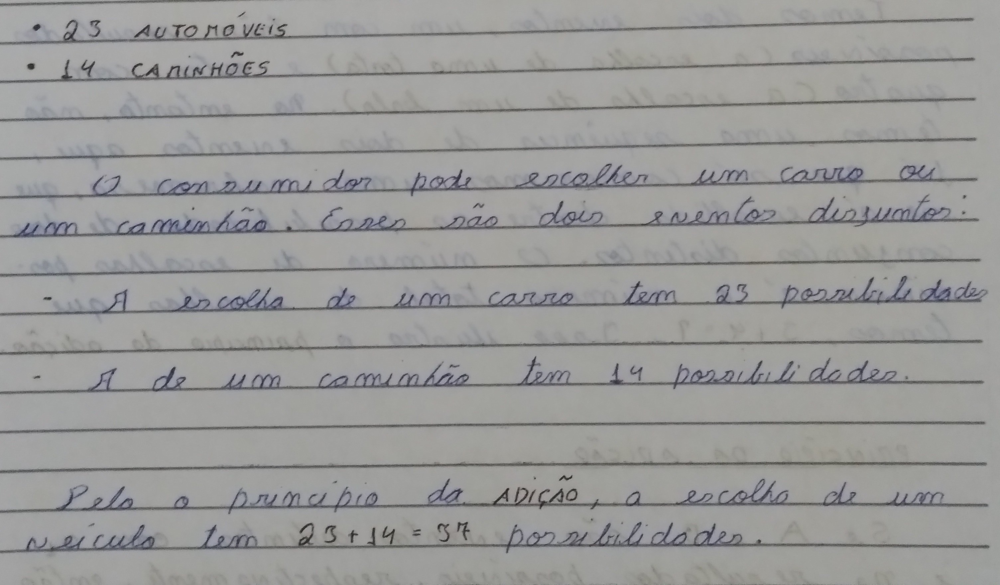  

</details>


<!--- ( Questões usando o Princípio da Multiplicação + Princípio da Adição ) --->

---

<div id="4-5-digits"></div>

## Quantos números de quatro dígitos começam com 4 e 5?

> **Quantos números de quatro dígitos comecam com 4 e 5?**

<details>

<summary>RESPOSTA</summary>

<br/>

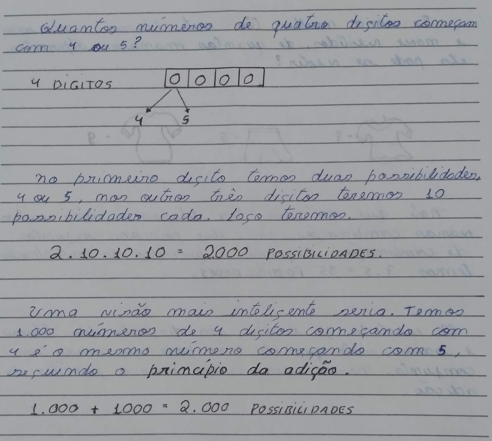  

</details>


---

<div id="7-blusas-5-saias-3-vestidos"></div>

## De quantas maneiras uma mulher pode se vestir 7 blusas, 5 saias, 3 vestidos?

> **Se uma mulher tem 7 blusas, 5 saias e 9 vestidos, de quantas maneiras diferentes ela pode se vestir?**

<details>

<summary>RESPOSTA</summary>

<br/>

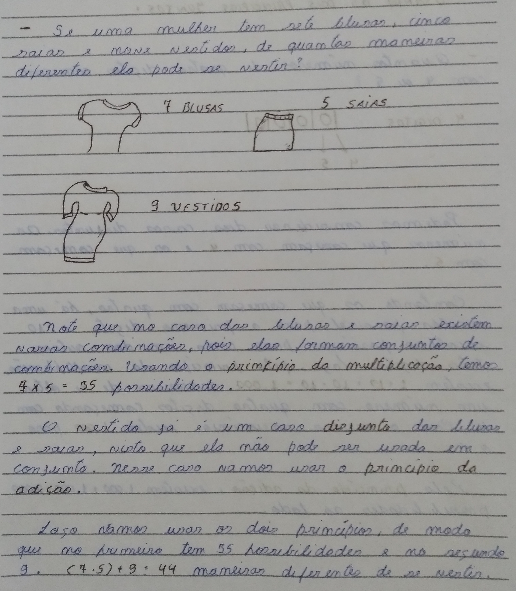  

</details>


<!--- ( Permutations ) --->

---

<div id="permutations"></div>

## O que são Permutações?

> **O que são Permutações?**

<details>

<summary>RESPOSTA</summary>

<br/>

#### O que são Permutações?

> Permutar significa **trocar de posição**, ou seja, **mudar a ordem dos elementos**.  
> Na Análise Combinatória, a Permutação conta quantas maneiras diferentes é possível organizar (reorganizar) um grupo de elementos.

#### 🧠 Fórmula da Permutação

Se temos **n** elementos distintos para organizar:

$P(n) = n!$

#### 📍 Exemplo 1 – Organizar livros

> De quantas maneiras posso organizar 4 livros diferentes numa estante?

$P(4) = 4! = 4 \cdot 3 \cdot 2 \cdot 1 = 24 \ maneiras$

#### 📍 Exemplo 2 – Senhas com letras

> Quantas senhas diferentes posso formar com as letras A, B e C (sem repetir letras)?

$P(3) = 3! = 3 \cdot 2 \cdot 1 = 6 \ senhas \ possíveis$

> **NOTE:**  
> As senhas são: ABC, ACB, BAC, BCA, CAB, CBA

#### 📍 Exemplo 3 – ANAGRAMAS

>  Quantas palavras (com ou sem sentido) eu posso formar a partir da palavra **AMOR**?

 - Esse é um problema de *ANAGRAMAS* que em outras palavras é a quantidade de novas palvras formadas utilizando as letras de outra palavra.
 - **NOTE:** Faz sentido utilizar permutações visto que se trata de um problema de **troca de posições (ou mudar a ordem dos elementos)**.

Logo:

 - AMOR = 4 letras (A, M, O, R)
 - $4!$  = $4 \cdot 3 \cdot 2 \cdot 1 = 24$  

> **NOTE:**  
> Ou seja, nós conseguiremos formar 24 palavras com ou sem sentido a partir da palavra **AMOR**.

#### E quando elementos se repetem?

**🔹 Permutação com repetição**  
Se alguns elementos se repetem, a fórmula muda:

$P(n; a, b, c,...) = \frac{n!}{a! \cdot b! \cdot c! ...}$

#### 📍 Exemplo 1 – Quantas permutações tem a palavra ANA?

 - Temos 3 letras: A, N, A;
 - → 𝑛 = 3, com 2 letras "A" iguais.

Logo:

$P = \frac{3!}{2!} = \frac{6}{2} = 3 \ maneiras$

</details>


<!--- ( REFERÊNCIA ) --->

---

<div id="ref"></div>

## REFERÊNCIA

 - **Cursos:**
   - [Licenciatura - Matemática](https://www.faculdadeunica.com.br/graduacao/ead/matematica-3080)

---

**Rodrigo** **L**eite da **S**ilva - **rodrigols89**

<details>

<summary></summary>

<br/>

RESPOSTA

```bash

```

  

</details>
