# Ensinando Estatística Divertidamente (EED)

> Minhas notas do curso ["Ensinando Estatística Divertidamente"](https://lp.asn.rocks/eed-b/)

## Conteúdo

 - **Fundamentos:**
   - `Ninguém cria nada se não tiver um problema (Profa. Adriana Silva).`
   - [`Qual a diferença de um Modelo (equação) Deterministico vs. Estatístico?`](#deterministic-vs-statistic-model)
   - [`Defina (com exemplos) o que são dados, observações, variáveis e contexto?`](#data-observation-variable-context)
   - [`Popoulação vs. Amostra`](#population-vs-sample)
   - [`Parâmetro vs. Estatística`](#parameter-vs-statistic)
   - [`Medidas de Posição vs. Dispersão`](#position-vs-dispersion)
 - **Medidas de Posição:**
   - [`Média`](#intro-to-mean)
   - [`Mediana`](#intro-to-median)
   - [`Percentis e Quartis`](#percentis-and-quartis)
     - [`Quiz 01`](#percentis-and-quartis-quizz-01)
   - [`Moda`](#intro-to-mode)
 - **Medidas de Dispersão:**
   - [`Amplitude`](#intro-to-amplitude)
   - [`Variância e Desvio Padrão`](#intro-to-var-std)
   - [`Coeficiente de Variação`](#intro-to-coef-var)
 - [**REFERÊNCIAS**](#ref)
<!---
[WHITESPACE RULES]
- Same topic = "10" Whitespace character.
- Different topic = "200" Whitespace character.
--->


<!--- ( Fundamentos ) --->

---

<div id="deterministic-vs-statistic-model"></div>

## `Qual a diferença de um Modelo (equação) Deterministico vs. Estatístico?`

> **Você saberia me responder qual a diferença entre em um *Modelo (Equação) Determinístico* e um *Estatístico*?**

<details>

<summary>RESPOSTA</summary>

<br/>

Em resumo:

 - Um **Modelo (Equação) Determinístico** é *sempre a mesma coisa*, *não existe uma mudança*, *não existe uma variação*:
   - A minha equação é perfeita;
   - Onde acontecer muito isso? Na física:
     - "Se eu jogar uma pedrinha em uma posição x, quanto tempo ela levar para chegar no chão?"
     - Bem, se você souber o peso do objeto e a distância do projeto você consegue "determinar" o tempo.
     - **NOTE:** Ou seja, é sempre o mesmo modelo (equação) que sempre funciona sem variabilidade.
 - Um **Modelo (Equação) Estatístico** é aquele que por mais que eu queira eu não consigo ter uma equação precisa o tempo inteiro:
   - Vai ter momentos que nós vamos errar um pouco para cima; vai ter momento que nós vamos errar um pouco para baixo.
   - **NOTE:** Ou seja, um modelo (equação) estatístico é aquele que carrega um `erro`.

</details>


---

<div id="data-observation-variable-context"></div>

## `Defina (com exemplos) o que são dados, observações, variáveis e contexto?`

> **Qual a diferença entre *"dados"*, *"observações"*, *"variáveis"* e *"contexto"*?**

<details>

<summary>RESPOSTA</summary>

<br/>

Bem, em resumo:

 - **Dados:**
   - Os dados também conhecidos como *"Base de Dados"*, tem.
     - `Linhas:`
       - Linhas são os nossos `objetos de estudo` que nada mas são do que as nossas `observações`.
       - Por que `objeto de estudo`? Porque é aquele *"negócio"* que eu estou interessado em gerar alguma análise.
       - Que "negócio" é esse? Pode ser um indivíduo, um produto, pode ser qualquer coisa (vai depender do contexto).
     - `Colunas:`
       - São `informações` sobre os nossos `objeto de estudo`.
       - Isso é o que nós conhecemos na estatística/programação/matématica de `variáveis/atributos/features`.
 - **Observações:**
   - São as entidades a respeito das quais se coletam os dados *(objeto de estudo)*.
 - **Variáveis:**
   - Variáveis são aquilo que descrevem o nosso `objeto de estudo`.
 - **Contexto:**
   - É a `lógica desses dados`, sem isso você não consegue interpretar nada! Tudo é Contexto!

</details>


---

<div id="population-vs-sample"></div>

## `Popoulação vs. Amostra`

> **Qual a diferença entre *"população"* e *"amostra"*?**

<details>

<summary>RESPOSTA</summary>

<br/>

Bem, em resumo:

 - **Uma População:**
   - É o *"todo do seu estudo"*.
   - É o *"todo do seu problema"*.
   - É o *"todo do seu contexto"*.
   - EXEMPLO-01:
 - **Uma Amostra:**
   - É um *"pedaço desse todo"*.

Vejam a tabela abaixo para ficar mais claro:

| **Situação**                                                             | **População (conjunto total de interesse)**              | **Amostra (parte representativa da população)**               |
| ------------------------------------------------------------------------ | -------------------------------------------------------- | ------------------------------------------------------------- |
| 1️⃣ Pesquisa sobre hábitos alimentares de estudantes de uma universidade | Todos os estudantes matriculados na universidade         | 200 estudantes escolhidos aleatoriamente de diferentes cursos |
| 2️⃣ Estudo sobre a renda familiar em uma cidade                          | Todas as famílias residentes na cidade                   | 300 famílias selecionadas de forma aleatória por bairro       |
| 3️⃣ Avaliação do desempenho de alunos do ensino médio em matemática      | Todos os alunos do ensino médio de um estado             | 10 escolas sorteadas e todos os alunos dessas escolas         |
| 4️⃣ Pesquisa de satisfação de clientes de uma empresa                    | Todos os clientes que compraram na empresa no último ano | 500 clientes que responderam a um questionário online         |
| 5️⃣ Análise da produtividade de uma fábrica                              | Todos os funcionários da fábrica                         | 50 funcionários escolhidos de diferentes turnos de trabalho   |

#### 💡 Resumidamente

 - **População** → O todo que queremos estudar.
 - **Amostra** → Uma parte desse todo, usada quando não é viável estudar todos os elementos.

</details>


---

<div id="parameter-vs-statistic"></div>

## `Parâmetro vs. Estatística`

> **Qual a diferença entre *"parâmetro"* e *"estatística"*?**

<details>

<summary>RESPOSTA</summary>

<br/>

Em resumo:

 - **Parâmetro** → É uma medida usada para descrever uma característica da População.
 - **Estatística** → Vem de uma *amostra*.

#### 🎯 1️⃣ Conceito básico

| Termo           | Definição                                                                                                   | Onde se aplica |
| --------------- | ----------------------------------------------------------------------------------------------------------- | -------------- |
| **Parâmetro**   | É uma **medida numérica** que descreve uma **característica da população** (ou seja, do todo).              | População      |
| **Estatística** | É uma **medida numérica** que descreve uma **característica da amostra** (ou seja, da parte que estudamos). | Amostra        |

#### 📊 2️⃣ Exemplo prático

Imagine que queremos saber a média de altura dos estudantes de uma universidade:

| Situação                                                                | Tipo            | Descrição                                                                              |
| ----------------------------------------------------------------------- | --------------- | -------------------------------------------------------------------------------------- |
| A **média verdadeira da altura** de todos os estudantes da universidade | **Parâmetro**   | Representa o valor real da população (geralmente desconhecido, pois não medimos todos) |
| A **média de altura** dos 200 estudantes escolhidos aleatoriamente      | **Estatística** | É o valor calculado a partir da amostra — usado para **estimar o parâmetro**           |

🧠 3️⃣ Outros exemplos

| Exemplo                                                  | Parâmetro                             | Estatística                                           |
| -------------------------------------------------------- | ------------------------------------- | ----------------------------------------------------- |
| Percentual de eleitores que votariam em um candidato     | Percentual real de todos os eleitores | Percentual obtido em uma pesquisa com 1.000 eleitores |
| Média de renda mensal de todas as famílias de uma cidade | Média verdadeira da cidade            | Média calculada com base em 300 famílias pesquisadas  |
| Desvio padrão do peso de todos os alunos de uma escola   | Desvio padrão real (de toda a escola) | Desvio padrão dos 50 alunos medidos                   |

> **E como diferenciar um parâmetro de uma estatística em um estudo?**

É comum usarmos letras gregas para representar parâmetros e letras latinas para representar estatísticas:

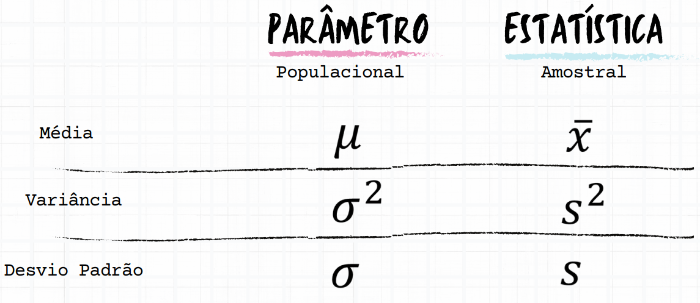  

</details>

---

<div id="position-vs-dispersion"></div>

## `Medidas de Posição vs. Dispersão`

 - **Medidas de Posição:**
   - Medidas que nos dão uma posição na régua.
   - *Média*, *Mediana*, *Percentis*, *Moda*.
 - **Medidas de Dispersão:**
   - Nos diz quão os dados estão dispersos na régua.
   - *Amplitude*, *Variância*, *Desvio Padrão* e *Coeficiente de Variação*.


<!--- ( Medidas de Posição ) --->

---

<div id="intro-to-mean"></div>

## `Média`

> **A Média nasce com uma missão de *"generalização"*.**

**Como assim?**  
Bem, se você tiver que chutar algo (algum lugar), chute na média.

Para entendermos melhor, imagine que nós temos o `objeto de estudo`, *"estudantes"*, e estamos analisando a variável *"idades"* desses alunos em uma régua:

  

Vejam que os dados (variável "idade") estão um pouco distantes uns dos outros.

> **Então, por que eu deveria utilizar a média nesse caso?**  
> Porque a média é a única medida do mundo que tem a *"capacidade de equilibrar essa régua (dados)"*.

**Mas por que?**  
Imagine que entrou um aluno de 105 anos, vocês concordam que a régua aumentou?

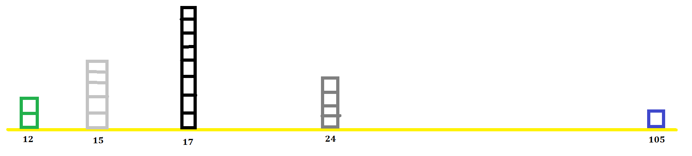  

 - Como esse dado (aluno de 105) está muito distante dos demais a *média* tem a capacidade de equilibrar essa régua.
 - Ou seja, a média é influenciada por todos os valores que estão em cima da régua.

> **E como eu posso usar isso na vida real?**

Bem, digamos que você tirou a média desses alunos, que foi 32 anos (é só um exemplo), então eu poderia dizer:

> **"Professora *"chuta"* essa idade e conta piada para alunos nessa faixa de idade"**.

**Agora vocês concordam que ela pode se sentir desconfortável com isso?**  
Então, quando ela se sentir desconfortável com isso é que surge a necessidade de outras medidas.

> **Isso porque a média tem um ponto de vista, que é o "equilíbrio" entre os dados.**

**Mas o equilíbrio nem sempre me diz que vai tomar a melhor decisão.**  
Ai que a gente começa a entender que não é só a média que resolver todos os nossos problemas.

> **Por exemplo, não é sua mãe que resolver todos os seus problemas.**  
> Não é porque ela é a "mãezona" que está perto de todos os filhos (dados) que ela vai resolver todos os seus problemas.

#### Exemplo 02

Agora, imagine que nós temos o estudo de um determinado número de ciclistas que percorrem uma distância (em quilômetros) em x horas:

  

Vejam que na nossa `base de dados` acima:

 - Cada linha (objeto de estudo) representa um aluno.
 - E a coluna/variável/feature que nós coletamos foi a quilometragem que o aluno andou com a bicicleta em um determinado período de tempo:
   - Isso pode ser visto como o nosso contexto de negócio.

> **Mas, como eu calcularia a média de quilometragem que os alunos percorreram em x horas?**

Bem, nós somaríamos a quilometragem de todos os alunos e dividirmos pelo total de alunos:

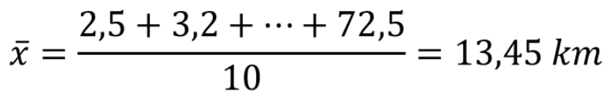  

Olhando para o cálculo acima e imaginando que os ciclistas tinham 2h para percorrer (contexto), nós podemos dizer que em média esses ciclistas percorrem 13,45 km em 2h.

> **Ela me diz quantos quilômetros cada ciclista corre?**  
> NÃO!

A média é uma medida **"generalista"**, ela dá uma visão do `equilíbrio` entre de tempo percorrido entre os ciclistas (dados).

> **NOTE:**  
> O equilíbrio não significa que é o melhor valor para todo mundo, mas é o melhor valor que você poderia dar se **"tivesse que chutar"** quantos quilômetros os ciclistas iriam percorrer.

#### Fórmula da média

Por fim, a fórmula da `média` é a seguinte:

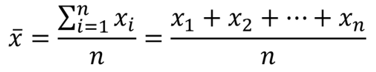


---

<div id="intro-to-median"></div>

## `Mediana`

> Se a `média` é o **"ponto de equilíbrio"** da nossa régua, quem poderia me ajudar a saber se esse ponto de equilíbrio está sendo *"puxado/influenciado"* por algum dos extremos?

A `mediana` quem pode nos ajudar a resolver esse problema e para isso, imagine que nós temos o estudo de um determinado número de ciclistas que percorrem uma distância (em quilômetros) em x horas:

  

Vamos começar dividindo em 2 caixas (volumes) esses ciclistas:

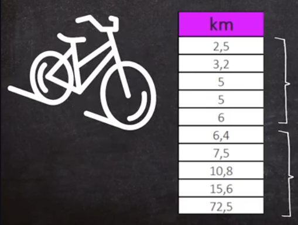  

Vejam que agora:

 - Primeiro, nós ordenamos os dados (esse passo já estava feito, senão teria que ser feito);
 - Segundo, dividimos em duas caixas (partes) de volume:
   - Os indivíduos que *menos conseguiram percorrer a distância* ficaram na primeira caixa (volume);
   - Os indivíduos que mais *conseguiram percorrer a distância* ficaram na segunda caixa (volume).

> **Mas qual a vantagem de dividir em 2 caixas (volumes)?**

Agora nós podemos:

 - Pegar o **maior valor** da primeira caixa;
 - Pegar o **menor valor** da segunda caixa;
 - Por fim, **tirar a média desses 2 valores**.

  

> **Mas o que isso significa?**

 - Significa, que *"metade dos nossos ciclista"* correram **ATÉ 6,2 quilômetros em x horas**:
   - Primeira caixa (volume).
 - Outra metade, conseguiu correr **A PARTIR DE 6,2 quilômetros em x horas**.
   - Segunda caixa (volume).

Agora pensem comigo:

 - Se usando a `média` nós tivemos 13,45 quilômetros em x horas;
 - E usando a `mediana` tivemos 6,2 quilômetros em x horas.

> **O que isso significa?**

 - Isso significa que nós temos algum valor *"puxando/influenciando"* a régua para a extremidade de *"maior quilometragem"*:
   - Da mesma forma, se a média fosse 2 ou 1 teria algum valor *"puxando/influenciando"* a extremidade de *"menor quilometragem"*.
 - Ou seja, quando a média está muito longe da mediana quer dizer que ela foi influenciada por uma das extremidades.
 - Nesse, nosso caso ela foi influenciada pelo o valor extremo: *"72,5"*.

> **Com isso, qual o objetivo da mediana?**

O objetivo da `mediana` pode ser visto como:

 - Metade dos indivíduos VAI ATÉ ONDE?
 - A outra metade VAI A PARTIR DE ONDE?
 - **NOTE:** Por fim, alguma das extremidades está *"puxando/influenciando"* a `média`?

Só para fim de análise sobre a `mediana` tenha o seguinte em mente:

 - O valor da `mediana` vai ser sempre o **ponto central** da nossa `base de dados`.
 - Se tem alguma extremidade *"puxando/influenciando"* a `média` você quem vai ter que analisar (identificar).

#### E se o número de linhas (objeto de estudos) for ímpar?

Bem, nesse caso nós utilizamos a seguinte fórmula:

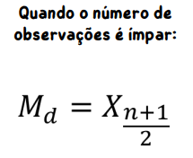  

> **NOTE:**  
> Vejam que nesse caso o número do meio (ponto central) que vai representar a mediana. Nós não precisamos tirar a média do maior valor da primeira caixa (volume) pelo menor valor da segunda caixa (volume).


---

<div id="percentis-and-quartis"></div>

## `Percentis e Quartis`

> Percentil tem haver com **posições (ª)** ou **porcentagem (%)**.

Como Percentil tem haver com porcentagem (%) é como se nós dividíssemos a nossa amostra de dados em 100 partes ou em por centos:

 - 100% dos dados;
 - 50% dos dados;
 - 25% dos dados;
 - 1% dos dados...

Mas existem outras nomencaturas para essas porcentagens:

 - **Percentis:**
   - De 1 em 1 por cento (%).
 - **Decis:**
   - De 10 em 10 por cento (%).
 - **Quartis:**
   - De 25 em 25 por cento (%).

Agora imagine que você tirou 7,5 em uma prova e eu diga que você:

 - **Está no percentil 94:**
   - Ótimo, isso que dizer que você ficou entre os 6% melhores.
 - **Está no percentil 5:**
   - Bem, agora você não está tão bem qualificado como gostaria.
   - Por mais que você esteja provado, você está entre os 5% piores.

> **NOTE:**  
> Vejam que existe uma relativação (contexto) que nós devemos analisar.

Para entender mais sobre **percentis** vamos começar revisando a `mediana` que divide os dados em 2 caixas (volumes):

  

> **E os percentis?**  
> Os percentis nos diz em quantas caixas (volumes) iguais nós vamos dividir nossos dados.

Por exemplo, imagine que nós dividimos nossos dados acima em 4 caixas (volumes) iguais, cada uma representando 25%:

  

> **Olhando para as divisões (caixas/volumes) acima o que nós podemos dizer (interpretar)?**

 - **Na primeira caixa (que nós conhecemos como "Primeiro Quartil (Q1)" | 25% dos dados):**
   - **NOTE:** Como nesses 25% nós tinhamos um número *"ímpar"* de objetos de estudo, o valor do meio é o **ponto central**.
   - Ou seja, 25% (Q1) dos ciclista correram `ATÉ 5 quílometros em x horas`.
 - **Na segunda caixa (que nós conhecemos como "Segundo Quartil (Q2)/ou a Mediana" | 50% dos dados):**
   - **NOTE:** Como nesses 25% nós tinhamos um número *"par"* de objetos de estudo, nós precisamos tirar a média do maior valor desses 25% pelo menor valor dos próximos 25%.
   - Ou seja, os outros 25% (Q2) dos ciclista conseguiram correram `DE 5 ATÉ 6,2 quílometros em x horas`.
 - **Na terceira caixa (que nós conhecemos como "Terceiro Quartil (Q3)" | 75% dos dados):**
   - **NOTE:** Como nesses 25% nós tinhamos um número *"ímpar"* de objetos de estudo, o valor do meio é o **ponto central**.
   - Ou seja, os outros 25% (Q3) dos ciclista correram `DE 6,2 ATÉ 10,8 quílometros em x horas`.
 - **Na quarta caixa (que nós conhecemos como "Quarto Quartil (Q4)" | 100% dos dados):**
   - Ou seja, os outros 25% (Q4) dos ciclista correram `MAIS DE 10,8 quílometros em x horas`.

> **NOTE:**  
> Uma observação aqui é que os "quartis" nunca vão lhe dizer nada sobre os valores extremos (mínimo ou máximo).

---

<div id="percentis-and-quartis-quizz-01"></div>

## `Quiz 01`

> **Se a nota de um aluno foi classificada no percentil 90, o que isso significa?**

 - **A)** O percentil 90 da nota significa que o aluno obteve apenas 9% da pontuação total possível.
 - **B)** O percentil 90 da nota indica que o aluno está entre os 90% com a nota mais baixa da turma.
 - **C)** O percentil 90 da nota representa que o aluno tem uma nota maior que 9.
 - **D)** O percentil 90 da nota significa que o aluno obteve uma pontuação melhor que 90% dos demais estudantes da turma.

<details>

<summary>RESPOSTA</summary>

<br/>

A resposta correta é a letra `D`.

> "O percentil 90 da nota significa que o aluno obteve uma pontuação melhor que 90% dos demais estudantes da turma."

</details>


---

<div id="intro-to-mode"></div>

## `Moda`

Para entender o que é a `moda` imagine que nós temos o estudo de um determinado número de ciclistas que percorrem uma distância (em quilômetros) em x horas:

  

> **Qual valor mais aparece, ou é mais recorrente nesse estudo?**  
> É o "5".

 - Ou seja, o **"5"** é a moda.
 - **NOTE:** Por exemplo, a moda é o que todo mundo está usando.

Algumas observações aqui são:

 - Essa medida não é tão "sensual" para variáveis quantitativas (números):
   - Mas, lembre-se que depende do contexto.
 - Essa medida é mais utilizada em variáveis qualitativas (categóricas).

Por exemplo:

  

**NOTE:**  
Outra observação aqui é que nesse tipo de variável nós não conseguimos tirar a média, mediana ou percentil. Nós só conseguimos "contar" quantas vezes um certo valor aparece.

Agora pense comigo:

> **A `moda` é a média entre dados qualitativos (categóricos).**  
> Por exemplo, se você tivesse que **"chutar"** o hobby que um novo ciclista mais gosta, a moda nos daria essa **"generalização"**.


<!--- ( Medidas de Dispersão ) --->

---

<div id="intro-to-amplitude"></div>

## `Amplitude`

A amplitude é definida como sendo a **"diferença entre o maior e o menor valor do conjunto de dados"**.

> **Mas para que serve essa medida?**

Por exemplo, imagine que nós estamos analisando o `objeto de estudo` "alunos" e de início nós pedimos a *amplitude* da variável "idade". Ou seja, **"a maior idade menos a menor idade"**.

Digamos que a amplitude foi **2**...

> **O que isso significa?**

Bem, 2 anos de idade entre o aluno mais velho e o mais novo pode nos dizer que TALVEZ:

 - A média e a mediana estão próximas;
 - Os dados podem estar bem distribuídos...

> **NOTE:**  
> Por fim, mas não menos importante, vale lembrar que a "amplitude" só é utilizada com variáveis numéricas (números). Não faz sentido utilizar a amplitude em variáveis qualitativas (categóricas).

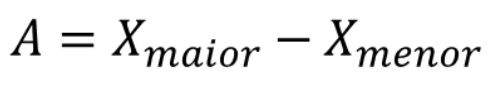  

#### Exemplo 02

Imagine que nós temos os seguintes dados de um estudo de ciclistas que percorrem uma distância (em quilômetros) em x horas:

  

Digamos que a `média` e a `mediana` foram as seguintes:

 - `Média:`
   - 13,45
 - `Mediana:`
   - 6,2

Agora, imagine que a Amplitude foi a seguinte:

 - `Amplitude:`
   - A = 72,5 - 2,5 = 70 Km

Bem, vamos refletir sobre essas informações:

 - `Média + Mediana`
   - Começando pelo a `mediana`:
     - Nós temos que metade dos ciclistas correram acima de 6,2 quilômetros em x horas.
     - E a outra metade correu abaixo de 6,2 quilômetros em x horas.
   - Agora, pense comigo... se a metade correu abaixo (menos) de 6,2 quilômetros em x horas, **"como a `média` foi 13,45?"**
   - **NOTE:** Isso dá uma *sensação* de que algum valor está *puxando/influenciando* a `média`.
 - `Amplitude`
   - Se nós já tínhamos uma *sensação* que algo estava *puxando/influenciando* a `média`;
   - Agora com a amplitude de 70 Km isso só se concretiza mais.
   - *Por que?*
     - Porque o menor valor para o maior valor nós estamos falando de 70 km.


---

<div id="intro-to-var-std"></div>

## `Variância e Desvio Padrão`

Para entender sobre a `Variância e Desvio Padrão`, imagine que nós temos os seguintes dados, de ciclistas que percorrem uma distância (em quilômetros) em x horas:

  

Agora, o dono da competição precisa escolher um local adequado para essa corrida, com base nesses dados.

> **Qual o tamanho do local adequado?**

Bem, como nós não temos muitas informações, e apenas uma variável, o melhor "chute" que nós poderíamos dar seria a `média`:

  

**Mas, *"qual o risco"* eu tenho desses ciclistas darem várias vezes no local que nós escolhemos?**  
Ou seja, *"qual o risco"* eu tenho da minha decisão está errada, com base na `média`?

Para calcular esse risco, nós precisaríamos de:

> **Uma medida que mensuraria o quanto nós erramos ao usar a `média` para tomar uma decisão!**

Isso, porque no momento que nós **"chutamos" a média"** para tomar uma decisão é como se a partir de agora nós chutassemos a `média` para todo mundo:

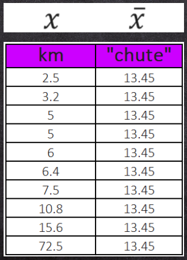  

O que significa isso?

 - **O cara que correu 2.5 quilômetros:**
   - Eu estou "chutando" que ele aguenta 13,45 quilômetros em x horas.
 - **O cara que correu 3.2 quilômetros:**
   - Eu estou "chutando" que ele aguenta 13,45 quilômetros em x horas.
 - **O cara que correu 5.2 quilômetros:**
   - Eu estou "chutando" que ele aguenta 13,45 quilômetros em x horas.
 - **O cara que correu 72.5 quilômetros:**
   - Eu estou "chutando" que ele aguenta 13,45 quilômetros em x horas.

Vocês concordam comigo que **se a gente calcular a distância** do meu **$x$** e **$\bar{x}$**, ou seja, do valor do **$x$** verdadeiro para o chute **$\bar{x}$** nós estamos tendo uma visão de `erro`?

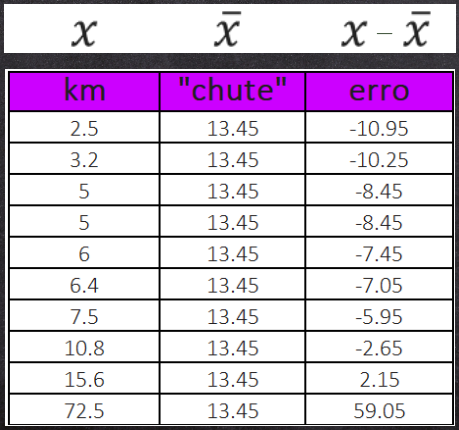  

Pense comigo:

 - Se na primeira amostra o ciclista correu 2.5 e eu estou dizendo que ele aguenta 13,45 quilômetros em x horas:
   - Eu estou errando em -10.95 quilômetros.

> **O problema para essa mensuração é que se eu tiver 1000 ciclistas eu vou ter 1000 linhas de erro!**  
> Como eu vou tomar uma decisão com 1000 erros diferentes?

Uma alternativa seria calcular a `média` dos erros:

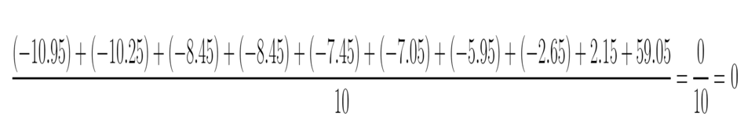  

Olhando para o cálculo acima nos deparamos com outro problema agora:

> **A `média` dos erros $(x - \bar{x})$ sempre resultará em 0.**  

**Como assim?**  
Lembram que a `média` é o ponto de equilíbrio entre os dados (ou pontos na régua), por isso, a soma dos erros sempre resultará em zero (0).

### `Variância`

Bem, como nós temos valores positivos e negativos uns anulando os outros, uma alternativa para resolver esse problema seria:

> **Elevar os erros ao quadrado.**  

A partir do momento que nós elevamos todos os erros ao quadrado, nós:

 - Tornamos os erros negativos em positivos;
 - Porém, também levamos todos os erros para uma outra dimensão:
   - Pelo menos em termos numéricos em relação ao erro original.

  

> **NOTE:**  
> Agora é só tirar a média desses erros que nós não teremos mais um erro nulo (zero).

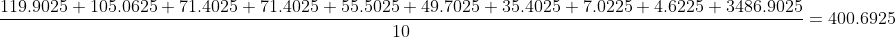  

Esses processos de:

 - **Elevar os erros ao quadrado:**
   - Tornando os erros negativos em positivos.
 - **Tirar a média desses erros.**

> **É o que nós conhecemos como `Variância`.**

A fórmula real da **variância (amostral)** é a seguinte:

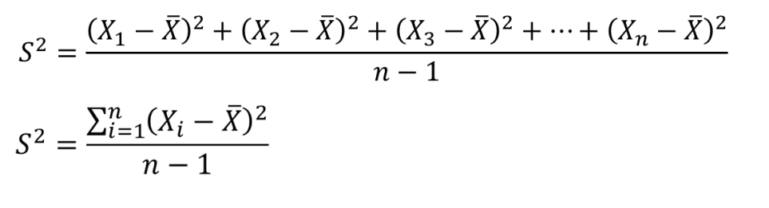  

> **Ué, mas por que nós temos esse "n - 1" no denominador e não apenas n?**

Pense comigo:

 - Se eu tenho uma população enorme (100 mil pessoas);
 - E nós pegamos apenas uma pequena parte dela (1000 pessoas).
 
> **Vocês concordam que nós vamos ter um certo receio (medo) de prever algo com essa pequena amostra?**

Agora, se eu aumentar para 50 mil pessoas:

> **Vocês concordam que o meu receio (medo) diminui?**

Esse "sentimento" é o que os matemáticos tentaram trazer para uma equação, ou seja:

> **NOTE:**  
> Quando minha *amostra é pequena* é importante que eu *penalize a minha medida*, por isso, eu uso o "n - 1" no denominador.

> **NOTE:**  
> Esse sentimento (n -1 no denominador) é o que nós conhecemos como [Correção de Bessel](https://en.wikipedia.org/wiki/Bessel%27s_correction).

### `Desvio padrão`

Agora, pense comigo:

> **Ao "elevar todos os erros ao quadrado" é como se nós levássemos esses erros para outra dimensão porque eles ficaram muito grandes.**  

É tanto que a nossa **média dos erros** ficou bem maior em relação à **média original**:

**MÉDIA ORIGINAL DOS DADOS:**  
  

**MÉDIA DOS ERROS AO QUADRADO:**
  

> **E agora como nós fazemos para trazer essa média dos erros para a dimensão original?**

Para fazer a *média dos erros* voltar para a dimensão original precisamos tirar a **raiz quadrada**:

  

> **NOTE:**  
> Essa técnica de trazer a média dos erros para a dimensão original é o que nós conhecemos como `Desvio Padrão`.

**Fórmula do Desvio Padrão:**
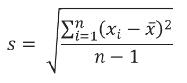

**Mas o que isso significa?**
Esse valor nos diz o **quanto nós erramos em média**, ao usar a `média` para tomar nossas decisões.

Voltando para o nosso problema de escolher o local para a corrida, podemos dizer:

> **Amigo, você pode adotar um local para 13,45 quilômetros em x horas, que é a média dos seus ciclistas.**  

Porém, o meu *erro* é que eles:

 - Podem correr 20 quilômetros a mais;
 - Ou 20 quilômetros a menos.

**Agora, pense comigo, nesse contexto esse *erro é MUITO GRANDE*!**  
O erro é muito grande para escolher um local adequado, onde em média os ciclistas correm 13,45 quilômetros em x horas e o meu erro é de 20 quilômetros para mais ou para menos.

> **Aqui o ideal seria utilizar outro método estatístico para tomar uma decisão melhor.**

Agora mudando de `contexto`, imagina que uma humorista pediu uma faixa etária de idade para contar piadas e que você fez a seguinte análise:

 - A média das pessoas (público) é de 32 anos;
 - E o erro médio é de 1,5 para mais ou para menos.

> **Nesse contexto, o nosso erro é quase nulo, porque é quase 1 ano de diferença só o erro.**

## Resumidamente

 - **Variância:**
   - `Média dos erros ao quadrado.`
   - Remove (anula) números (erros) negativos;
   - **NOTE:** Leva a **média dos erros** para uma outra dimensão.
 - **Desvio Padrão:**
   - `A raiz quadrada da variância.`
   - **NOTE:** Traz a **média dos erros** para a dimensão original.
 - **Variação vem de variabilidade que significa:**
   - Se o meu desvio padrão é pequeno é porque os meus pontos estão muito próximos da média.
   - Se o meu desvio padrão é grande é porque os meus pontos estão muito dispersos ao longo da minha régua.


---

<div id="intro-to-coef-var"></div>

## `Coeficiente de Variação`

Os principais objetivos do `Coeficiente de Variação` são:

 - Dizer quão grande é o `Desvio Padrão` em *relação* a `média`;
 - Permitir comparar variabilidade de amostras que estão em contextos diferentes.

Para entender melhor, imagine que:

 - Em um avião, lutadores de sumô estão viajando com seus bebês e colocaram todos os bebês na parte de frente e os lutadores na parte de trás do avião.
 - Em outro avião está um grupo de maratonistas:
   - Podemos imaginar que são pessoas com o mesmo porte; pesos.

> **Imagine que a média dos 2 exemplos acima foi de 75kg.**  

Vocês concordam que:

> **O `Desvio Padrão` no avião com lutadores de sumô e seus bebês vai ser maior do que o `Desvio Padrão` no avião com maratonistas.**  
> Isso porque a variação entre os dados está muito grande.

**NOTE:**  
Vejam que no exemplo acima nós comparamos a variabilidade de amostras diferentes.

Por fim, a fórmula do `Coeficiente de Variação` é a seguinte:

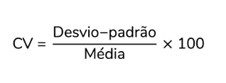  


<!--- ( REFERÊNCIA ) --->

---

<div id="ref"></div>

## REFERÊNCIA

 - **Cursos:**
   - [Licenciatura - Matemática](https://www.faculdadeunica.com.br/graduacao/ead/matematica-3080)
   - [Entendendo Estatística Divertidamente](https://lp.asn.rocks/eed-a)

---

**Rodrigo** **L**eite da **S**ilva - **rodrigols89**

<details>

<summary></summary>

<br/>

RESPOSTA

```bash

```

  

</details>
