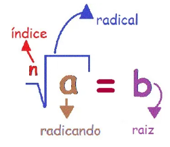
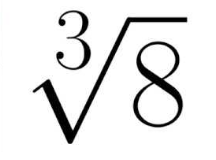

# Potenciação, Radiciação e Logaritmos

## Conteúdo

 - **Radiciação:**
   - [Quais os componentes de uma radiciação?](#rad-components)
   - [Como ler uma radiciação?](#reading-rad)
   - [Quando uma raiz (qualquer) é exata ou não?](#rad-exact-or-not)
   - [Qual a fórmula geral da radiciação?](#rad-formula)
   - [Como converter de Potenciação para Radiciação?](#exp-to-rad)
   - [Como converter de Radiciação para Potenciação?](#rad-to-exp)
   - [Propriedade da Multiplicação (Radiciação)](#rad-product-property)
   - [Propriedade da Divisão (Radiciação)](#rad-quotient-property)
   - **Questões Abertas:**
     - [Como resolver uma raiz pelo método da fatoração?](#rad-by-factorization-method)
     - [Qual a raiz cúbica de 54?](#rad-cube-54)
 - **Logaritmos:**
   - [Quais os componentes de um logaritmo?](#log-components)
   - [Como ler logaritmos?](#reading-logarithm)
   - [O que é o "Logaritmo Natural"? | log<sub>e</sub>(x) ⇔ ln(x)](#natural-log)
   - [Propriedade do Produto (Logaritmo)](#log-product-property)
   - [Propriedade do Quociente (Logaritmo)](#log-quotient-property)
   - [Propriedade da Potência (Logaritmo)](#log-power-property)
   - [Propriedade da Mudança de Base (Logaritmo)](#log-change-of-base-property)
   - [Propriedade do Recíproco (Logaritmo)](#log-reciprocal-property)
 - [**REFERÊNCIA**](#ref)
<!--- ( Questões Abertas ) --->
<!--- ( Questões do ENEM ) --->
<!--- ( Questões de Concurso ) --->
<!---
[WHITESPACE RULES]
- Same topic = "10" Whitespace character.
- Different topic = "200" Whitespace character.
--->


<!--- ( Radiciação ) --->

---

<div id="rad-components"></div>

## Quais os componentes de uma radiciação?

> **Quais os componentes de um radiciação?**

<details>

<summary>RESPOSTA</summary>

<br/>

Uma radiciação tem os seguintes componentes:



Onde:

 - **Radicando:**
   - Imagina o radicando (a) como o "x" de uma potenciação: $b^{n} = a \Leftrightarrow b^{n} = x$
 - **Índice:**
   - É Quantas vezes eu vou elevar (multiplicar) a raiz (b) para gerar o radicando (a).
 - **Raiz (ou resultado da radiciação):**
   - É a base (b) que elevada ao indice (n) gerou o radicando (a).

> **NOTE:**  
> O **"radical"** é apenas o símbolo da radiciação - √

</details>


---

<div id="reading-rad"></div>

## Como ler uma radiciação?

Imagine que temos o seguinte logaritmo:



> **Como podemos ler esse tipo de problema (radiciação)?**

<details>

<summary>RESPOSTA</summary>

<br/>

Lemos da seguinte forma:

> **Qual número (base b) que multiplicado por ele mesmo *3 vezes (índice)* resulta em 8?**  
> 2, porque 2 × 2 × 2 = 8

**NOTE:**  
Ou seja, a raiz cúbica de **8** é **2**.

</details>


---

<div id="rad-exact-or-not"></div>

## Quando uma raiz (qualquer) é exata ou não?

> **Em radiciação quando uma raiz (qualquer) é exata ou não?**

<details>

<summary>RESPOSTA</summary>

<br/>

#### ✅ O que é uma raiz exata?

Uma raiz exata é quando o resultado da raiz é um número inteiro (ou seja, sem vírgula, decimal ou fração).

**Exemplos de raiz exata:**

 - $\sqrt{25} = 5$ (5 é um número inteiro)
 - $\sqrt[3]{27} = 3$ (3 é um número inteiro)
 - $\sqrt[4]{81} = 3$  (3 é um número inteiro)

#### ❌ O que é uma raiz não exata?

Uma raiz não exata é quando o resultado da raiz **NÃO é um número inteiro**, ou seja, é decimal, fração ou infinita não periódica.

**Exemplos de raiz não exata:**

 - $\sqrt{10} \approx 3,162...$ (número decimal infinito) 
 - $\sqrt[3]{20} \approx 2,714...$ (não é exato) 
 - $\sqrt{2} \approx 1,4142...$  (irracional)

</details>


---

<div id="rad-formula"></div>

## Qual a fórmula geral da radiciação?

> **Qual a fórmula geral da radiciação?**

<details>

<summary>RESPOSTA</summary>

<br/>

$\sqrt[n]{a^m} = a^{\frac{m}{n}}$

Onde:

- $a$ é o radicando (que se torna a base da potenciação).
- $m$ é o expoente dentro da raiz (que se torna o numerador do expoente fracionário).
- $n$ é o índice da raiz (que se torna o denominador do expoente fracionário).

#### 📘 Por que o expoente da potência vira uma fração?

$a^{\frac{m}{n}} = \sqrt[n]{a^m}$

 - 𝑚 = Potência (o número de vezes que a base será multiplicada por ela mesma).
 - 𝑛 = Índice da raiz (qual tipo de raiz está sendo tirada: quadrada, cúbica, etc).

**🧠 Interpretação:**  

$a^{\frac{m}{n}} = (\sqrt[n]{a})^{m} = \sqrt[n]{a^{m}}$

Por exemplo:

$a^{\frac{3}{2}} = (\sqrt[]{a})^{3} = \sqrt[]{a^{3}}$

**NOTE:**  
No exemplo acima, **todas essas expressões são equivalentes!**

Vamos ver outro exemplo:

$8^{\frac{2}{3}} = \sqrt[3]{8^2} = \sqrt[3]{64} = 4$

</details>


---

<div id="exp-to-rad"></div>

## Como converter de Potenciação para Radiciação?

> **Como converter de Potenciação para Radiciação?**

<details>

<summary>RESPOSTA</summary>

<br/>

Para converter uma potenciação em radiciação, usamos a seguinte relação:

$a^{\frac{m}{n}} = \sqrt[n]{a^m}$

Onde:
- $a$ é a base da potenciação (que se torna o radicando).
- $m$ é o expoente da potenciação (que se torna o expoente dentro da raiz).
- $n$ é o denominador do expoente fracionário (que se torna o índice da raiz).

Exemplo:

$8^{\frac{2}{3}} = \sqrt[3]{8^2} = \sqrt[3]{64} = 4$

</details>


---

<div id="rad-to-exp"></div>

## Como converter de Radiciação para Potenciação?

> **Como converter de Radiciação para Potenciação?**

<details>

<summary>RESPOSTA</summary>

<br/>

Para converter uma radiciação em potenciação, usamos a mesma relação, mas no sentido inverso:

$\sqrt[n]{a^m} = a^{\frac{m}{n}}$

Onde:
- $a$ é o radicando (que se torna a base da potenciação).
- $m$ é o expoente dentro da raiz (que se torna o numerador do expoente fracionário).
- $n$ é o índice da raiz (que se torna o denominador do expoente fracionário).

Exemplo:

$\sqrt[4]{16^3} = 16^{\frac{3}{4}}$

</details>


---

<div id="rad-product-property"></div>

## Propriedade da Multiplicação (Radiciação)

> **Qual a Propriedade da Multiplicação para Radiciação?**

<details>

<summary>RESPOSTA</summary>

<br/>

A Propriedade da Multiplicação para Radiciação diz que a raiz de um produto é igual ao produto das raízes dos fatores.

$\sqrt[n]{a \cdot b} = \sqrt[n]{a} \cdot \sqrt[n]{b}$

Onde:
- $a$ e $b$ são os radicandos.
- $n$ é o índice da raiz.

Exemplo:

$\sqrt{4 \cdot 9} = \sqrt{36} = 6$
$\sqrt{4} \cdot \sqrt{9} = 2 \cdot 3 = 6$

</details>


---

<div id="rad-quotient-property"></div>

## Propriedade da Divisão (Radiciação)

> **Qual a Propriedade da Divisão para Radiciação?**

<details>

<summary>RESPOSTA</summary>

<br/>

#### Divisão de radicais com o mesmo índice

$\frac{\sqrt[n]{a}}{\sqrt[n]{b}} = \sqrt[n]{\frac{a}{b}} \quad (com \ b \neq 0)$

Por exemplo:

$\frac{\sqrt[4]{32}}{\sqrt[4]{2}} = \sqrt[4]{\frac{32}{2}} = \sqrt[4]{16} = 2$

#### Divisão de radicais com índices diferentes

$\frac{\sqrt[n]{a}}{\sqrt[m]{b}} = \sqrt[n \cdot m]{\frac{a^m}{b^n}} \quad (com \ b \neq 0)$

Por exemplo:

$\frac{\sqrt[2]{7}}{\sqrt[3]{5}} = \sqrt[6]{\frac{7^3}{5^2}} = \sqrt[6]{\frac{343}{25}}$

</details>


---

<div id="rad-by-factorization-method"></div>

## Como resolver uma raiz pelo método da fatoração?

> **Como resolver uma raiz pelo método da fatoração?**

<details>

<summary>RESPOSTA</summary>

<br/>

Por exemplo imagine que nós queremo a raiz de $\sqrt{144}$

> Ou seja, qual o número (ou base b) que multiplicado por ele mesmo 2 vezes (raiz quadrada) resulta em 144?

**🟦 Passo 1: Fatore o radicando (número dentro da raiz, 44) em primos:**  
Use a fatoração clássica, como se faz no MMC.

```bash
144 | 2
72  | 2
36  | 2
18  | 2
9   | 3
3   | 3
```

**🟦 Passo 2: Agrupe os fatores primos em potências:**  
Agrupe os fatores iguais usando expoentes (ex: 2³, 3², etc).

$144 = 2^{4} \cdot \ 3^{2}$  

$\sqrt{144} = \sqrt{2^{4} \cdot 3^{2}}$

**🟦 Passo 3: Divida os expoentes pelo índice da raiz:**  
Para cada fator (grupo de potências), divida o expoente pelo índice da raiz (que é 2 no nosso caso).

$= 2^{4} \cdot 3^{2} = 2^{2} \cdot 3^{1} = 4 \cdot 3 = 12$

Ou seja, a raiz quadra de *144* é: **"12"**.

$\sqrt{144} = 12$

</details>

---

<div id="rad-cube-54"></div>

## Qual a raiz cúbica de 54?

> **Qual a raiz cúbica de 54?**

<details>

<summary>RESPOSTA</summary>

<br/>

Para descobrir a raiz cúbica de 54, primeiro vamos fatorar o radicando:

```bash
54 | 2
27 | 3
9  | 3
3  | 3
1  |
```

Logo, nós vamos ter que:

$54 = 2^{1} \cdot 3^{3}$

Aplicando na raiz, nós temos:

$\sqrt[3]{54} = \sqrt[3]{2^{1} \cdot 3^{3}}$

Agora aplicando a **Propriedade da Multiplicação**, temos:

$\sqrt[n]{a \cdot b} = \sqrt[n]{a} \cdot \sqrt[n]{b}$  
  
$\sqrt[3]{2^{1} \cdot 3^{3}} = \sqrt[3]{2^{1}} \cdot \sqrt[3]{3^{3}}$

Continuando, vamos resolver apenas as raizes exatas e vamos ter:

$\sqrt[3]{2^{1}} \cdot \sqrt[3]{3^{3}} = 3 \cdot \sqrt[3]{3^{3}}$

Ou seja, a raiz cúbica de 54 é:

$\sqrt[3]{54} = 3 \cdot \sqrt[3]{3^{3}}$

 - A raiz **não é exata** porque 2 não tem raiz cúbica exata.
 - **NOTE** Mas foi simplificada ao máximo com a fatoração.

</details>


<!--- ( Logaritmos ) --->

---

<div id="log-components"></div>

## Quais os componentes de um logaritmo?

> **Quais os componentes de um logaritmo?**

<details>

<summary>RESPOSTA</summary>

<br/>

Um logaritmo tem 3 componentes:


Onde:

 - **Base:**
   - O número que será elevado a uma potência (logaritmo x) ➔ b<sup>x</sup>.
 - **Logaritmando:**
   - O número que resulta da base elevada ao logaritmo ➔ b<sup>x</sup> = logaritmando.
 - **Logaritmo (ou expoente):**
   - Potência (logaritmo) à qual a base deve ser elevada para gerar o logaritmando.

</details>


---

<div id="reading-logarithm"></div>

## Como ler logaritmos?

Imagine que temos o seguinte logaritmo:


> **Como podemos ler esse tipo de problema (logaritmo)?**

<details>

<summary>RESPOSTA</summary>

<br/>

Lemos da seguinte forma:

> **Quantas vezes precisamos multiplicar 2 para obter 8?**  
> 3, porque 2 × 2 × 2 = 8.

Ou seja, nosso logaritmo é 3:


</details>


---

<div id="natural-log"></div>

## O que é o "Logaritmo Natural"? | log<sub>e</sub>(x) ⇔ ln(x)

> **O que é o "Logaritmo Natural"?**

<details>

<summary>RESPOSTA</summary>

<br/>

O Logaritmo Natural é quando a base do logaritmo é o número de Euler ($e ≈ 2,71828$).


Quando a base do logaritmo é $e$, usamos a notação $ln(x)$ (Lê-se: "Logaritmo Natural de x").


Assim, quando ver $ln(x)$, saiba que se trata de um logaritmo com a base $e$.

</details>


---

<div id="log-product-property"></div>

## Propriedade do Produto (Logaritmo)

> **Qual a Propriedade do Produto para Logaritmos?**

<details>

<summary>RESPOSTA</summary>

<br/>

A Propriedade do Produto diz que o logaritmo de um produto é a soma dos logaritmos dos fatores.


Exemplo:


</details>


---

<div id="log-quotient-property"></div>

## Propriedade do Quociente (Logaritmo)

> **Qual a Propriedade do Quociente para Logaritmos?**

<details>

<summary>RESPOSTA</summary>

<br/>

A Propriedade do Quociente diz que o logaritmo de um quociente é a diferença dos logaritmos do dividendo e do divisor.


Exemplo:


</details>


---

<div id="log-power-property"></div>

## Propriedade da Potência (Logaritmo)

> **Qual a Propriedade da Potência para Logaritmos?**

<details>

<summary>RESPOSTA</summary>

<br/>

A Propriedade da Potência diz que o logaritmo de uma potência é o produto do expoente pelo logaritmo da base.


Exemplo:


</details>


---

<div id="log-change-of-base-property"></div>

## Propriedade da Mudança de Base (Logaritmo)

> **Qual a Propriedade da Mudança de Base para Logaritmos?**

<details>

<summary>RESPOSTA</summary>

<br/>

A Propriedade da Mudança de Base diz que o logaritmo de um número em uma base é igual ao quociente entre o logaritmo desse número em outra base e o logaritmo da base original na mesma nova base.


Exemplo:


Ou seja:


</details>


---

<div id="log-reciprocal-property"></div>

## Propriedade do Recíproco (Logaritmo)

> **Qual a Propriedade do Recíproco para Logaritmos?**

<details>

<summary>RESPOSTA</summary>

<br/>

A Propriedade do Recíproco diz que o logaritmo de um número em uma base é igual ao oposto do logaritmo do inverso desse número na mesma base.


Exemplo:


</details>


---

<div id="ref"></div>

## REFERÊNCIA

 - **Cursos:**
   - [Licenciatura - Matemática](https://www.faculdadeunica.com.br/graduacao/ead/matematica-3080)
 - **Logaritmos:**
   - [O que é logaritmo?](https://www.youtube.com/watch?v=_tX_rYVkRx8)
   - [ILS2.1 Logarithms](https://learninglab.rmit.edu.au/content/ils21-logarithms.html)
   - [Properties of Logarithms](https://byjus.com/maths/properties-of-logarithms/)

---

**Rodrigo** **L**eite da **S**ilva - **rodrigols89**

<details>

<summary></summary>

<br/>

RESPOSTA

```bash

```

  

</details>