# Potenciação, Radiciação e Logaritmos

## Conteúdo


 - **Logaritmos:**
   - [Quais os componentes de um logaritmo?](#log-components)
   - [Como ler logaritmos?](#reading-logarithm)
   - [O que é o "Logaritmo Natural"? | log<sub>e</sub>(x) ⇔ ln(x)](#natural-log)
   - [Propriedade do Produto](#log-product-property)
   - [Propriedade do Quociente](#log-quotient-property)
   - [Propriedade da Potência](#log-power-property)
   - [Propriedade da Mudança de Base](#log-change-of-base-property)
   - [Propriedade do Recíproco](#log-reciprocal-property)
 - [**REFERÊNCIA**](#ref)
<!--- ( Questões Abertas ) --->
<!--- ( Questões do ENEM ) --->
<!--- ( Questões de Concurso ) --->
<!---
[WHITESPACE RULES]
- Same topic = "10" Whitespace character.
- Different topic = "200" Whitespace character.
--->


<!--- ( Logaritmos ) --->

---

<div id="log-components"></div>

## Quais os componentes de um logaritmo?

> **Quais os componentes de um logaritmo?**

<details>

<summary>RESPOSTA</summary>

<br/>

Um logaritmo tem 3 componentes:

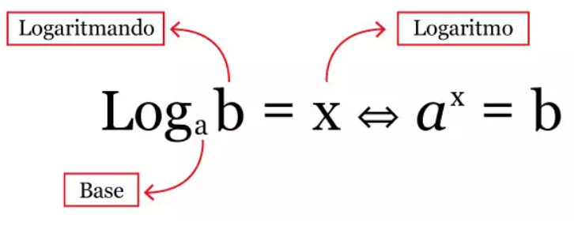

Onde:

 - **Base:**
   - O número que será elevado a uma potência (logaritmo x) ➔ b<sup>x</sup>.
 - **Logaritmando:**
   - O número que resulta da base elevada ao logaritmo ➔ b<sup>x</sup> = logaritmando.
 - **Logaritmo (ou expoente):**
   - Potência (logaritmo) à qual a base deve ser elevada para gerar o logaritmando.

</details>


---

<div id="reading-logarithm"></div>

## Como ler logaritmos?

Imagine que temos o seguinte logaritmo:

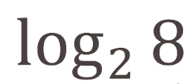

> **Como podemos ler esse tipo de problema (logaritmo)?**

<details>

<summary>RESPOSTA</summary>

<br/>


Lemos da seguinte forma:

> **Quantas vezes precisamos multiplicar 2 para obter 8?**  
> 3, porque 2 × 2 × 2 = 8.

Ou seja, nosso logaritmo é 3:


</details>


---

<div id="natural-log"></div>

## O que é o "Logaritmo Natural"? | log<sub>e</sub>(x) ⇔ ln(x)

> **O que é e de onde vem o "Logaritmo Natural?"**

<details>

<summary>RESPOSTA</summary>

<br/>

Para entender o **ln(x)**, primeiro precisamos entender o **log<sub>e</sub>(x)**.

> **Mas o que é "e"?**

 - Em ciência, *vários problemas*, *vários fenômenos físicos*, *vários problemas matemáticos* chegam ao valor **"2,718281828459..."**.
 - Para que os cientistas não precisem repetir esse número toda vez, foi criada uma constante para representá-lo: **"e = 2,718281828459..."**

Portanto:


> **Sabendo disso, o que é *"ln(x)"*?**

Vários problemas científicos passaram a resultar em **log<sub>e</sub>(x)**. Para evitar repetir esse logaritmo toda vez, os cientistas decidiram criar um logaritmo especial para ele: **"ln(x)"**.

Portanto:

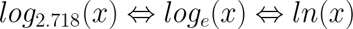

> **OBSERVAÇÃO:**  
> Esse logaritmo é conhecido como **"Logaritmo Natural"**.

</details>


---

<div id="log-product-property"></div>

## Propriedade do Produto

> **Como se aplica a "Propriedade do Produto" em logaritmos?**

<details>

<summary>RESPOSTA</summary>

<br/>

A **"Propriedade do Produto"** dos logaritmos é:

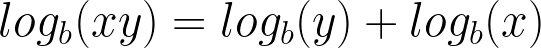

**EXEMPLO-01:**

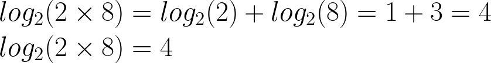

</details>


---

<div id="log-quotient-property"></div>

## Propriedade do Quociente

> **Como se aplica a "Propriedade do Quociente" em logaritmos?**

<details>

<summary>RESPOSTA</summary>

<br/>

A **"Propriedade do Quociente"** dos logaritmos é:

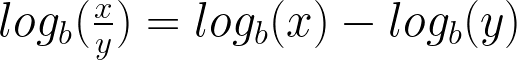

**EXEMPLO-01:**

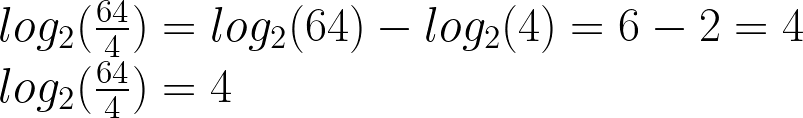

</details>


---

<div id="log-power-property"></div>

## Propriedade da Potência

> **Como se aplica a "Propriedade da Potência" em logaritmos?**

<details>

<summary>RESPOSTA</summary>

<br/>

A **"Propriedade da Potência"** dos logaritmos é:


**EXEMPLO-01:**

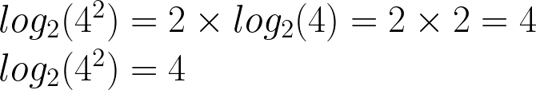

</details>


---

<div id="log-change-of-base-property"></div>

## Propriedade da Mudança de Base

> **Como se aplica a "Propriedade da Mudança de Base" em logaritmos?**

<details>

<summary>RESPOSTA</summary>

<br/>

Para entender a propriedade **"Propriedade da Mudança de Base"**, imagine que temos o seguinte logaritmo para resolver:

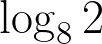

> **O quê?**  
> Sim, temos um problema!

Para resolver esse problema podemos usar a propriedade **"Regra da Mudança de Base"**:

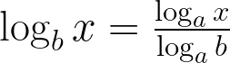

Onde:

 - O `numerador` é o logaritmo de `x (logaritmando)`.
 - O `denominador` é o logaritmo de `b (base)`.

> **E a base "a"?**  
> A **base "a"** deve resolver o logaritmo do numerador e do denominador ao mesmo tempo.

**EXEMPLO-01:**

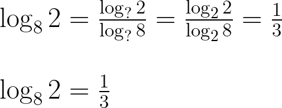

</details>


---

<div id="log-reciprocal-property"></div>

## Propriedade do Recíproco

> **Como se aplica a "Propriedade do Recíproco" em logaritmos?**

<details>

<summary>RESPOSTA</summary>

<br/>

A **"Propriedade do Recíproco"** dos logaritmos é:

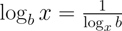

> **OBSERVAÇÃO:**  
> Veja que trocamos a *base* com o *logaritmando*.

**EXEMPLO-01:**

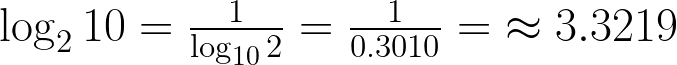

</details>


<!--- ( REFERÊNCIA ) --->

---

<div id="ref"></div>

## REFERÊNCIA

 - **Cursos:**
   - [Licenciatura - Matemática](https://www.faculdadeunica.com.br/graduacao/ead/matematica-3080)
 - **Logaritmos:**
   - [O que é logaritmo?](https://www.youtube.com/watch?v=_tX_rYVkRx8)
   - [ILS2.1 Logarithms](https://learninglab.rmit.edu.au/content/ils21-logarithms.html)
   - [Properties of Logarithms](https://byjus.com/maths/properties-of-logarithms/)

---

**Rodrigo** **L**eite da **S**ilva - **rodrigols89**

<details>

<summary></summary>

<br/>

RESPOSTA

```bash

```

  

</details>
