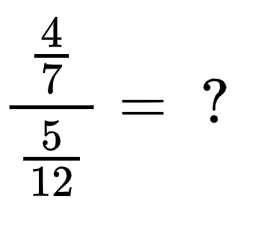

# Frações

## Conteúdo

 - **Tipos de Frações:**
   - [Frações Próprias](#intro-to-proper-fractions)
   - [Frações Impróprias](#intro-to-improper-fractions)
   - [Frações Mistas](#intro-to-mixed-fractions)
 - **Operações com Frações:**
   - **Adição e Subtração de Frações:**
     - [Adição/Subtração de frações com denominadores diferentes](#add-sub-diff-denominators)
   - **Divisão de Frações:**
     - [Como dividir duas frações?](#dividing-two-fractions)
 - **Conversão de Frações:**
   - [Como converter um número com vírgula em fração?](#comma-to-fraction)
   - [Como converter uma "Fração Imprópria" em uma "Fração Mista"](#convert-improper-to-mixed)
    - [Como converter uma "Fração Mista" em uma "Fração Imprópria"](#convert-mixed-to-improper)
 - [**Manipulação de Frações**](#fraction-manipulation)
<!---
[WHITESPACE RULES]
- Same topic = "20" Whitespace character.
- Different topic = "200" Whitespace character.
--->

<!--- ( Tipos de Frações ) --->

---

## Frações Próprias

> Quando uma *fração* é considerada **"própria"**?

RESPOSTA

 

Uma fração é `própria` quando o **numerador é "menor que" o denominador**.

Por exemplo:

  

 - Isso significa que a fração representa uma quantidade menor que um inteiro:
   - Ou seja, ela é representa uma "fração" de um todo.
 - **NOTE:** Isso significa que o valor da fração é menor que 1.

---

## Frações Impróprias

> Quanto uma *fração* é considerada **"imprópria"**?

RESPOSTA

 

Uma fração é `imprópria` quando o **numerador é "maior que" o denominador**.

Por exemplo:

  

 - Essas frações representam **um todo completo** ou **mais do que um**.
 - **NOTE:** Isso significa que o valor da fração é maior ou igual a 1.

---

## Frações Mistas

> Quanto uma *fração* é considerada **"mista"**?

RESPOSTA

 

Uma fração é considerada mista quando combina **um número inteiro** com uma **fração própria**.

Por exemplo:

  

<!--- ( Operações com Frações ) --->

---

## Adição/Subtração de frações com denominadores diferentes

> Quando precisarmos adicionar/subtrair 2 (ou mais) frações, primeiro precisamos garantir que as mesmas devem ter o mesmo denominador.

Por exemplo:

  

Vejam que nesse caso:

 - Primeiro, nós repetimos os denominadores, pois, são iguais;
 - E somamos (ou subtraimos se for o caso) os numeradores.

> **E quando os denominadores forem diferentes?**

  

RESPOSTA

 

  

---

## Como dividir duas frações?

Como dividir 2 frações? Por exemplo:

  

RESPOSTA

 

A maneira mais simples e prática de dividir duas frações é:

 - **Multiplicar a primeira:**
   - Numerador.
 - **Pelo inverso da segunda:**
   - Denominador.   

  

<!--- ( Conversão de Frações ) --->

---

## Como converter um número com vírgula em fração?

> Como converter números que contenham vírgula para uma fração?

RESPOSTA

 

  

---

## Como converter uma Fração Mista em uma Fração Imprópria

> Como converter uma **fração mista** em uma **fração imprópria**?

RESPOSTA

 

Para converter uma **fração mista** em uma **fração imprópria**, nós:

- Multiplicar a parte inteira pelo denominador;
- E depois somamos o resultado ao numerador.

Por exemplo:

- Isso nos dá o novo numerador da fração imprópria.
- **NOTE:** O denominador permanece o mesmo.

Outro exemplo simples:

<!--- ( REFERÊNCIA ) --->

---

## REFERÊNCIA

 - **Cursos:**
   - [Licenciatura - Matemática](https://www.faculdadeunica.com.br/graduacao/ead/matematica-3080)
 - **Youtubers:**
   - [Rota do Enem](https://www.youtube.com/@rotadoenemjp/videos)

---

**Rodrigo** **L**eite da **S**ilva - **rodrigols89**

RESPOSTA
 

