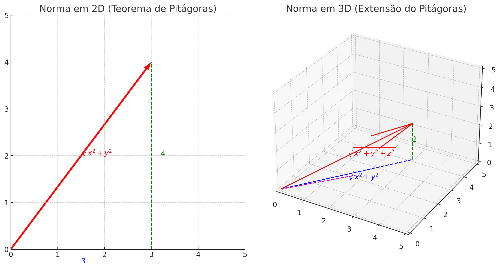
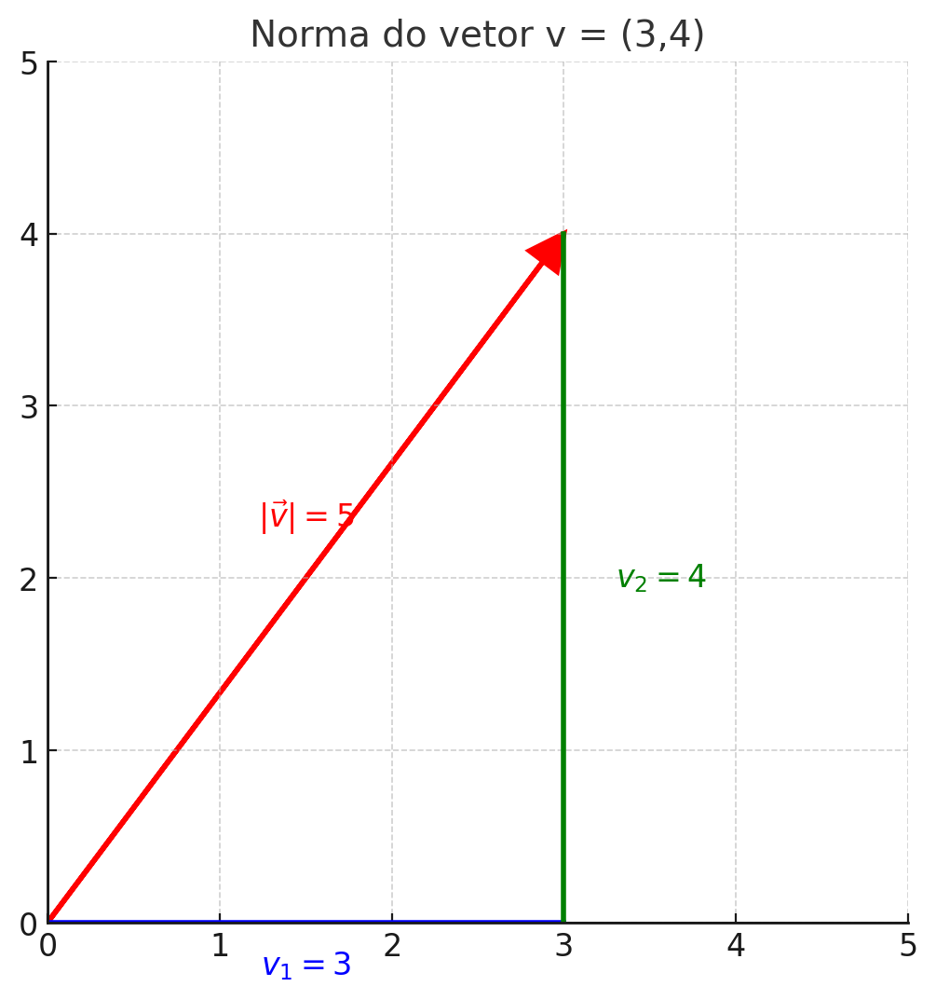
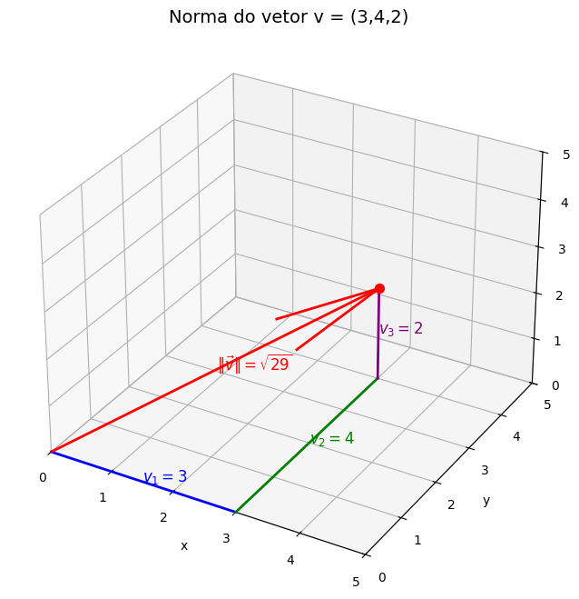

# Algebra Linear

## Conteúdo

 - [O que é a "norma" de um Vetor?](#vector-norm)
 - [**REFERÊNCIA**](#ref)
<!--- ( Questões Abertas ) --->
<!--- ( Questões do ENEM ) --->
<!--- ( Questões de Concurso ) --->
<!---
[WHITESPACE RULES]
- Same topic = "10" Whitespace character.
- Different topic = "200" Whitespace character.
--->


<!--- ( ??? ) --->

---

<div id="vector-norm"></div>

## O que é a "norma" de um Vetor?

> **O que é a "norma" de um Vetor?**

<details>

<summary>RESPOSTA</summary>

<br/>

> A **norma** é **uma função que mede o tamanho (ou comprimento)** de um vetor.

**No espaço 2D:**

$||\vec{v}|| = \sqrt{x^{2} + y^{2}}$

**No espaço 3D:**

$||\vec{v}|| = \sqrt{x^{2} + y^{2} + z^{2}}$

#### De onde vem essa fórmula?

 - **A raiz quadrada aparece** porque a *norma* é baseada no **"Teorema de Pitágoras"**.
 - Os quadrados (𝑥², 𝑦², 𝑧²) vêm dos catetos.
 - A raiz é necessária para calcular o comprimento real da seta, já que o Tereoma de Pitágoras sempre te dá a hipotenusa ao quadrado.

Aqui está o desenho esquemático que mostra de onde vem a raiz:

  

Vejam que:

 - As linhas tracejadas (catetos):
   - Eixo-x e eixo-y;
   - São utilizadas para encontrar a *hipotenusa (norma)*.

#### Para que serve a norma?

A norma tem muitas aplicações, como:

 - ✅ Medir distâncias
   - A distância entre dois pontos 𝐴 = (𝑥<sub>1</sub>, 𝑦<sub>1</sub>) e B = (𝑥<sub>1</sub>, 𝑦<sub>1</sub>) é a norma do vetor diferença: d(A, B) = ||A - B||
 - ✅ Normalizar vetores
   - Às vezes você não quer o tamanho do vetor, mas apenas sua direção.
   - Para isso, você divide o vetor pela sua norma: $\vec{v} = \frac{\vec{v}}{||\vec{v}||}$
   - **NOTE:** Assim, $\vec{v}$  passa a ter tamanho 1.

#### Fórmula geral

A fórmula geral da *norma* é a seguinte:

$||\vec{v}|| = \sqrt{v^{2}_{1} + v^{2}_{2} + v^{2}_{n}}$

> Mas o que são esses $v_{1}, v_{2}, v_{n}$?

 - Eles são as componentes do vetor $\vec{v}$.
 - Ou seja, cada número $v_{i}$ é uma coordenada do vetor em uma das dimensões do espaço.

**👉 Exemplo prático em 2D:**

$\vec{v} = (v_{1}, v_{2}) = (3, 4)$

Aqui:

 - $v_{1}$ = 3 → componente no eixo x
 - $v_{2}$ = 4 → componente no eixo y

Logo, nós vamos ter a seguinte fórmula para esse exemplo (2D):

$||\vec{v}|| = \sqrt{3^{2} + 4^{2}} = \sqrt{9 + 16} = \sqrt{25} = 5$

  

**👉 Exemplo prático em 3D:**

$\vec{v} = (v_{1}, v_{2}, v_{3}) = (3, 4, 2)$

Aqui:

 - $v_{1}$ = 3 → componente no eixo x
 - $v_{2}$ = 4 → componente no eixo y
 - $v_{3}$ = 2 → componente no eixo z

Logo, nós vamos ter a seguinte fórmula para esse exemplo (3D):

$||\vec{v}|| = \sqrt{3^{2} + 4^{2} + 2^{2}} = \sqrt{9 + 16 + 4} = \sqrt{29}$

  

</details>


<!--- ( REFERÊNCIA ) --->

---

<div id="ref"></div>

## REFERÊNCIA

 - **Cursos:**
   - [Licenciatura - Matemática](https://www.faculdadeunica.com.br/graduacao/ead/matematica-3080)

---

**Rodrigo** **L**eite da **S**ilva - **rodrigols89**

<details>

<summary></summary>

<br/>

RESPOSTA

```bash

```

  

</details>
