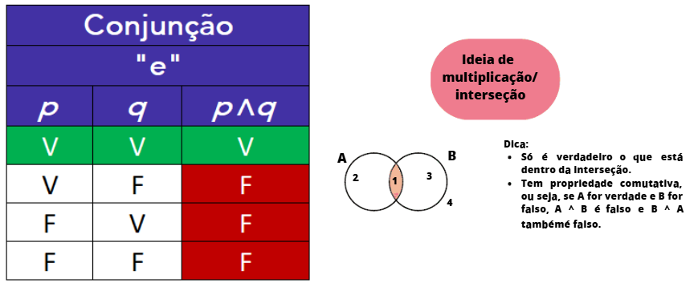
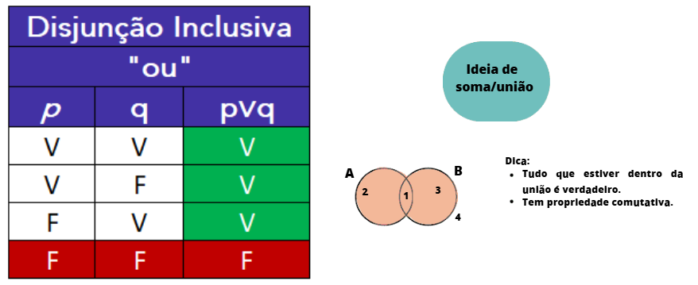
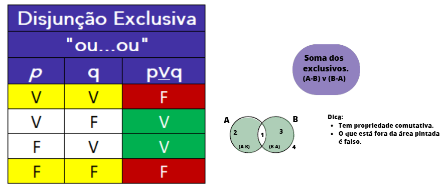
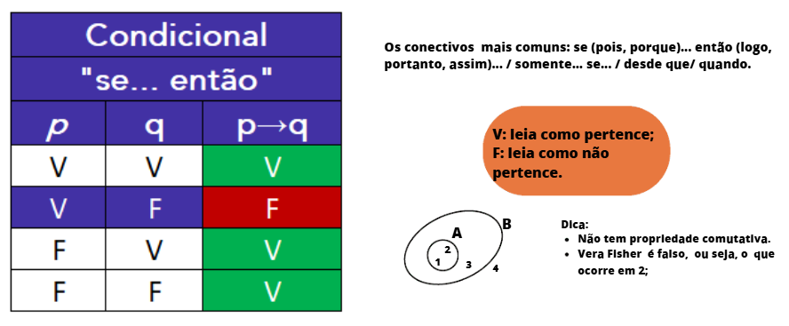
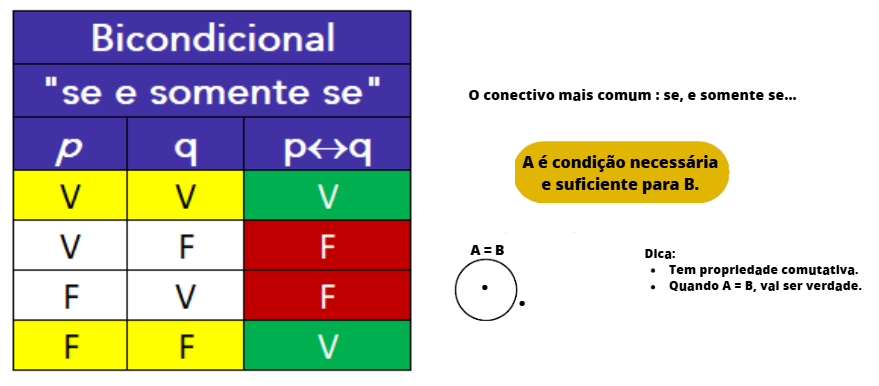

# Raciocínio Lógico

## Conteúdo

 - **Lógica das Proposições:**
   - **Fundamentos de Proposições Lógicas:**
     - [Quando uma sentença é declarativa e sua relação com proposições lógicas?](#declarative-sentences)
     - [Sentenças: Abertas e Fechadas](#open-and-closed)
     - [Quais são os Princípios Fundamentais do Pensamento lógico?](#principles-of-logic)
     - [Tautologia, Contradição, Silogismo, Contingência e Equivalência](#tcsce)
   - **Tabela-Verdade:**
     - **Questões:**
       - [Conjunção: Quando é verdadeiro?](#conjunction-table)
       - [Disjunção Inclusiva: Quando é verdadeiro?](#disjunction-inclusive-table)
       - [Disjunção Exclusiva: Quando é verdadeiro?](#disjunction-inclusive-table)
       - [Condicional: Quando é verdadeiro?](#conditional-table)
       - [Bicondicional: Quando é verdadeiro?](#biconditional-table)
       - [Como saber quantas linhas e quais valores V/F em cada linha de uma Tabela-Verdade de "n" letras de proposições?](#n-letters-count)
       - [`A ∨ B' ⇒ (A ∨ B)'`](#qal-01)
       - [`(A ∨ A') ⇒ (B ∧ B')`](#qal-02)
       - [`[(A ∧ B') ⇒ C']'`](#qal-03)
<!---
[WHITESPACE RULES]
- Same topic = "20" Whitespace character.
- Different topic = "200" Whitespace character.
--->


<!--- ( Lógica das Proposições ) --->

---

<div id="declarative-sentences"></>

## Quando uma sentença é declarativa e sua relação com proposições lógicas?

> Sabendo que proposições lógicas utilizam sentenças declarativas, o que são sentenças declarativas?

<details>

<summary>RESPOSTA</summary>

<br/>

> Uma sentença declarativa é um tipo de frase usada para **afirmar** ou **negar algo**.

Seu principal objetivo é transmitir uma *informação*, *opinião* ou *fato*. Ela sempre termina com ponto final (.) e pode ser:

 - **Afirmativa – quando declara algo positivamente:**
   - O céu está azul.
   - Eu gosto de matemática.
   - Maria viajou para o interior.
   - Nós estudamos para a prova.
 - **Negativa – quando declara algo de forma negativa:**
   - O céu não está azul.
   - Eu não gosto de matemática.
   - Maria não viajou para o interior.
   - Nós não estudamos para a prova.

</details>

<br/>

> Qual a relação de uma sentença é declarativa e proposições lógicas?

<details>

<summary>RESPOSTA</summary>

<br/>

> Proposição lógica é uma sentença declarativa que pode ser classificada como verdadeira ou falsa (mas nunca as duas ao mesmo tempo).

 - ✅ **Exemplos de sentenças declarativas que são proposições:**
   - "A água ferve a 100 °C." → Verdadeira (em condições normais).
   - "2 + 2 = 4." → Verdadeira.
   - "O Brasil fica na América do Sul." → Verdadeira.
   - "A Lua é feita de queijo." → Falsa, mas é uma proposição.
 - ⚠️ **Exemplos de sentenças declarativas que não são proposições:**
   - "Esta frase é falsa." → Paradoxo: não pode ser verdadeira nem falsa de forma consistente.
   - "João é alto." → Ambígua: depende de contexto (quanto mede João? Qual o critério de “alto”?).

</details>


---

<div id="open-and-closed">

## Sentenças: Abertas e Fechadas

> **Sentenças declarativas podem ser *abertas* ou *fechadas*.**
> E qual é considera uma proposição lógica?

<details>

<summary>RESPOSTA</summary>

<br/>

 - **Sentenças Abertas:**
   - São afirmações que contêm uma ou mais variáveis ou termos indefinidos (como pronomes demonstrativos ou advérbios sem referente claro).
   - Não é possível atribuir um valor lógico definitivo (V ou F) a elas até que as variáveis sejam substituídas por valores específicos ou os termos indefinidos sejam esclarecidos.
   - **NOTE:** *Não são consideradas proposições lógicas em seu estado original*.
   - **Exemplos de Sentenças Abertas:**
     - "Ele é um bom jogador de futebol." (O valor lógico depende de quem "ele" seja)
     - "x > 5." (O valor lógico depende do valor de x)
     - "Esta cidade é muito bonita." (O valor lógico depende de qual cidade está sendo referida)
     - "y + 3 = 10." (O valor lógico depende do valor de y)
     - "Alguém na sala é médico." (O valor lógico depende de quem está na sala)
 - **Sentenças Fechadas (ou Proposições):**
   - São afirmações que expressam um pensamento completo e sobre as quais é possível atribuir um valor lógico, ou seja, podem ser verdadeiras (V) ou falsas (F).
   - Não contêm variáveis ou termos indefinidos que impeçam a determinação de seu valor lógico.
   - **NOTE:** *São o principal objeto de estudo da lógica proposicional*.
   - **Exemplos de Sentenças Fechadas:**
     - "O céu é azul." (Pode ser V ou F, dependendo do momento e local)
     - "2 + 2 = 4." (É sempre V)
     - "Paris é a capital da Inglaterra." (É sempre F)
     - "Todo ser humano é mortal." (É sempre V)

</details>


---

<div id="principles-of-logic">

## Quais são os Princípios Fundamentais do Pensamento lógico?

De acordo com a lógica:

> Quais são os Princípios Fundamentais do Pensamento lógico?

<details>

<summary>RESPOSTA</summary>

<br/>

 - **Princípio da Identidade:**
   - **O que diz:**
     - Uma coisa é sempre igual a si mesma.
     - Em outras palavras, se algo é *"A"*, então é sempre *"A"* e não pode ser *"não-A"* ao mesmo tempo e **no mesmo sentido**.
   - **Exemplo:**
     - Se você diz: **"Esta maçã é vermelha"**, então essa mesma maçã, no mesmo instante e sob as mesmas condições, continua sendo vermelha.
     - Ela não pode, simultaneamente, ser verde e vermelha ao mesmo tempo.
     - **NOTE:** Na lógica formal, podemos representar isso como `A ⟹ A`.
 - **Princípio da Não Contradição:**
   - **O que diz:**
     - Uma **proposição (A)** e **sua negação (¬A)** não podem ser ambas verdadeiras ao mesmo tempo e no mesmo sentido.
     - Se uma afirmação é verdadeira, sua negação é necessariamente falsa, e vice-versa.
   - **Exemplo:**
     - A afirmação **"Está chovendo agora (A)"** e a afirmação **"Não está chovendo agora (¬A)"** não podem ser verdadeiras simultaneamente no mesmo lugar.
     - Uma delas deve ser falsa.
     - **NOTE:** Formalmente, isso pode ser expresso como `¬(A ∧ ¬A)`, que significa *"não é o caso que A e não-A sejam verdadeiras ao mesmo tempo"*.
 - **Princípio do Terceiro Excluído:**
   - **O que diz:**
     - Para qualquer proposição, ou ela é verdadeira, ou sua negação é verdadeira; não existe uma terceira possibilidade intermediária.
     - Não há meio-termo entre uma afirmação e sua negação em termos de valor de verdade.
   - **Exemplo:**
     - Considere a afirmação: **"O Sol está brilhando"**.
     - Ou essa afirmação é verdadeira, ou sua negação ("O Sol não está brilhando") é verdadeira.
     - Não existe uma terceira opção em que a afirmação seja parcialmente verdadeira ou algo diferente.
     - **NOTE:** Na lógica formal, representamos isso como `A ∨ ¬A`, que significa *"A é verdadeira ou não-A é verdadeira"*.

</details>


---

<div id="tcsce">

## Tautologia, Contradição, Silogismo, Contingência e Equivalência

### Tautologia

> **Quando uma proposição é considerada uma "tautologia"?**

<details>
<summary>RESPOSTA</summary>
<br/>

> Uma proposição é considerada uma **tautologia** quando ela é **sempre verdadeira**, independentemente dos valores lógicos de suas variáveis. Na tabela-verdade, todas as linhas da coluna final resultam em **V (verdadeiro)**.

**Exemplo 1: `A ∨ A'` (Disjunção com a negação)**  
Este é um exemplo clássico, pois uma *"proposição ou sua negação (`A ∨ A'`)"* sempre será verdadeira:

| A   | A'  | A ∨ A' |
|-----|-----|--------|
| V   | F   | **V**  |
| F   | V   | **V**  |

**Por que isso é útil?**  
Tautologias são fundamentais em lógica, pois *representam verdades universais*. Elas aparecem em provas lógicas e na simplificação de circuitos digitais.

</details>


### Contradição

> **Quando uma proposição é considerada uma "contradição"?**

<details>
<summary>RESPOSTA</summary>
<br/>

> Uma proposição é considerada uma **contradição** quando ela é **sempre falsa**, independentemente dos valores lógicos de suas variáveis. Na tabela-verdade, todas as linhas da coluna final resultam em **F (falso)**.

**Exemplo 1: `A ∧ A'` (Conjunção com a negação)**  
Este é um exemplo clássico, pois uma *"proposição e sua negação (`A ∧ A'`)"* nunca podem ser verdadeiras ao mesmo tempo:

| A   | A'  | A ∧ A' |
|-----|-----|--------|
| V   | F   | **F**  |
| F   | V   | **F**  |

**Explicação**:  
Para `A ∧ A'` ser verdadeiro, tanto `A` quanto `A'` precisam ser verdadeiros, mas isso é impossível, pois `A'` é a negação de `A`.

**Por que isso é útil?**  
Contradições são importantes para identificar argumentos inválidos ou condições impossíveis em sistemas lógicos, como em verificação de software ou matemática.

</details>


### Silogismo

> **O que é um silogismo na lógica?**

<details>
<summary>RESPOSTA</summary>
<br/>

> Um **silogismo** é uma forma de raciocínio dedutivo que consiste em duas premissas (ou proposições) que levam a uma conclusão lógica. Na lógica proposicional, um silogismo pode ser representado por uma implicação (→) que é sempre verdadeira, ou seja, uma tautologia.

Um exemplo simples de silogismo é:

- **Premissa 1:** Se chove, então a rua fica molhada. (P → Q)  
- **Premissa 2:** Está chovendo. (P)  
- **Conclusão:** Portanto, a rua está molhada. (Q)  

Na lógica, isso é representado por [(P → Q) ∧ P] → Q. Veja a tabela-verdade:

| P   | Q   | P → Q | (P → Q) ∧ P | [(P → Q) ∧ P] → Q |
|-----|-----|-------|-------------|-------------------|
| V   | V   | V     | V           | **V**            |
| V   | F   | F     | F           | **V**            |
| F   | V   | V     | F           | **V**            |
| F   | F   | V     | F           | **V**            |

**Explicação**:  
Como a última coluna é sempre V (verdadeiro), isso confirma que o silogismo é uma tautologia.

</details>


### Contingência

> **Quando uma proposição é considerada uma "contingência"?**

<details>
<summary>RESPOSTA</summary>
<br/>

> Uma proposição é considerada uma **contingência** quando ela não é nem uma tautologia nem uma contradição, ou seja, quando seu valor lógico depende dos valores das variáveis proposicionais. Em sua tabela-verdade, há pelo menos uma linha onde a proposição é verdadeira e pelo menos uma linha onde é falsa.

Um exemplo simples de contingência é `A ∧ B`:

| A   | B   | A ∧ B |
|-----|-----|-------|
| V   | V   | **V** |
| V   | F   | **F** |
| F   | V   | **F** |
| F   | F   | **F** |

**Explicação**:  
Aqui, `A ∧ B` é verdadeira apenas quando A e B são verdadeiras, e falsa nos outros casos. Portanto, é uma contingência.

</details>


### Equivalência

> **O que significa "equivalência" entre duas proposições?**

<details>
<summary>RESPOSTA</summary>
<br/>

> Duas proposições são **equivalentes** se elas tiverem os mesmos valores de verdade para todas as possíveis combinações de valores das variáveis proposicionais.  
> Suas tabelas-verdade são idênticas.

Um exemplo de equivalência é a lei de De Morgan: `(A ∧ B)' ≡ A' ∨ B'`:

| A   | B   | A ∧ B | 👉 (A ∧ B)' | A'  | B'  | 👉 A' ∨ B' |
|-----|-----|-------|----------|-----|-----|--------|
| V   | V   | V     | **F**    | F   | F   | **F**  |
| V   | F   | F     | **V**    | F   | V   | **V**  |
| F   | V   | F     | **V**    | V   | F   | **V**  |
| F   | F   | F     | **V**    | V   | V   | **V**  |

**Explicação**:  
As colunas de `(A ∧ B)'` e `A' ∨ B'` são idênticas, confirmando que as proposições são equivalentes.

</details>


---

## Operadores proposicionais e seus correspondentes

### Conjunção (^)

> Quais operações podem corresponder ao operador da conjunção (^)?

<details>

<summary>RESPOSTA</summary>

<br/>

 - **Símbolo lógico:** `P ^ Q`
 - **Equivalente matemático:** `P * Q (multiplicação booleana)`

| P | Q | P ^ Q |
|---|---|-------|
| 1 | 1 | 1     |
| 1 | 0 | 0     |
| 0 | 1 | 0     |
| 0 | 0 | 0     |

> **NOTE:**  
> 1 = VERDADEIRO, 0 = FALSO.

Outros exemplos de uso são na **Teoria dos Conjuntos** e **Álgebra Booleana (Relação Matemática)**:

 - **Teoria dos conjuntos:**
   - A conjunção corresponde à **"interseção de conjuntos"**, denotada por `A ∩ B`.
   - A interseção contém os elementos que pertencem a ambos os conjuntos `A e B`.
   - **Exemplo:**
     - Se A = `{1, 2, 3}` e `B = {2, 3, 4}`, então `A ∩ B = {2, 3}`, pois esses são os elementos comuns aos dois conjuntos.
 - **Álgebra booleana (Relação Matemática):**
   - A conjunção é representada pela operação `AND (multiplicação booleana)`.
   - Onde, `1 ^ 1 = 1`, e qualquer outra combinação `(1 ^ 0, 0 ^ 1, 0 ^ 0)` resulta em `0`.
   - **Exemplo:**
     - P = 1, Q = 1: P ^ Q = `1 x 1 = 1`
     - P = 1, Q = 0: P ^ Q = `1 x 0 = 0`
     - P = 0, Q = 0: P ^ Q = `0 x 0 = 0`

</details>


### Disjunção (v)

> Quais operações podem corresponder ao operador da disjunção (v)?

<details>

<summary>RESPOSTA</summary>

<br/>

 - **Símbolo lógico:** `P v Q`
 - **Equivalente matemático:** `P + Q` com a regra booleana de que `1 + 1 = 1` (não 2!)

| P | Q | P v Q |
|---|---|-------|
| 1 | 1 | 1     |
| 1 | 0 | 1     |
| 0 | 1 | 1     |
| 0 | 0 | 0     |

> **NOTE:**  
> 1 = VERDADEIRO, 0 = FALSO.

Outros exemplos de uso são na **Teoria dos Conjuntos** e **Álgebra Booleana (Relação Matemática)**:

 - **Teoria dos conjuntos:**
   - A disjunção corresponde à **"união de conjuntos"**, denotada por `A ∪ B`.
   - `A` união contém todos os elementos que estão em `A`, em `B` ou em ambos.
   - **Exemplo:**
     - Usando os mesmos conjuntos `A = {1, 2, 3}` e `B = {2, 3, 4}`, temos `A ∪ B = {1, 2, 3, 4}`,
 - **Álgebra booleana (Relação Matemática):**
   - A disjunção é representada pela operação `OR (adição booleana)`.
   - Onde, `0 v 0 = 0`, e qualquer outra combinação `(1 v 0, 0 v 1, 1 v 1)` resulta em `1`.
   - No entanto, pode ser aproximada como uma **"soma saturada"**, onde `P v Q = min(P + Q, 1)`, ou expressa como `P + Q - P * Q`.
   - **Exemplo:**
     - P = 0, Q = 0: P v Q = `0 + 0 = 0`
     - P = 0, Q = 1: P v Q = `0 + 1 = 1`
     - P = 1, Q = 1: P v Q = `1 + 1 - 1 * 1 = 1`

</details>


### Condicional (→)

> Quais operações podem corresponder ao operador Condicional (→)?

<details>

<summary>RESPOSTA</summary>

<br/>

 - **Símbolo lógico:** `P → Q`
 - **Equivalente matemático:** `¬P + Q`

| P | Q | P → Q |
|---|---|-------|
| 1 | 1 | 1     |
| 1 | 0 | 0     |
| 0 | 1 | 1     |
| 0 | 0 | 1     |

> **NOTE:**  
> 1 = VERDADEIRO, 0 = FALSO.

Outros exemplos de uso são na **Teoria dos Conjuntos** e **Álgebra Booleana (Relação Matemática)**:

 - **Teoria dos conjuntos:**
   - O condicional está relacionado à **"inclusão de conjuntos"**.
   - Se `A ⊆ B (A é subconjunto de B)`, significa que todo elemento de `A` também está em `B`, o que é análogo a `"se x ∈ A, então x ∈ B"`.
   - **Exemplo:**
     - Se `A = {2, 4}` e `B = {1, 2, 3, 4}`, então `A ⊆ B`, pois todos os elementos de `A` estão em `B`.
     - Isso reflete o condicional: se um elemento pertence a A, ele obrigatoriamente pertence a B.
 - **Álgebra booleana (Relação Matemática):**
   - Não há correspondência direta com `+`, `-`, ou `*`.
   - Porém, `P → Q` pode ser reescrito como `¬P v Q`, que, em termos matemáticos, é equivalente a `max(1 - P, Q)`.

</details>


### Bicondicional (↔)

> Quais operações podem corresponder ao operador Bicondicional (↔)?

<details>

<summary>RESPOSTA</summary>

<br/>

 - **Símbolo lógico:** `P ↔ Q`
 - **Equivalente matemático:** `(P * Q) + (¬P * ¬Q)` (Ou também: P = Q | valores iguais → verdadeiro)

| P | Q | P ↔ Q |
|---|---|-------|
| 1 | 1 | 1     |
| 1 | 0 | 0     |
| 0 | 1 | 0     |
| 0 | 0 | 1     |

> **NOTE:**  
> 1 = VERDADEIRO, 0 = FALSO.

Outros exemplos de uso são na **Teoria dos Conjuntos** e **Álgebra Booleana (Relação Matemática)**:

 - **Teoria dos conjuntos:**
   - O bicondicional corresponde à **"igualdade de conjuntos"**.
   - `A = B` se e somente se `A ⊆ B` e `B ⊆ A`, ou seja, os conjuntos têm exatamente os mesmos elementos.
   - **Exemplo:**
     - Se `A = {1, 2}` e `B = {1, 2}`, então `A = B`, pois possuem os mesmos elementos.
     - Isso reflete o bicondicional: "x ∈ A se e somente se x ∈ B" é verdadeiro para todo x.
 - **Álgebra booleana (Relação Matemática):**
   - O bicondicional pode ser expresso como `(P → Q) ^ (Q → P)` ou como `(P ^ Q) v (¬P ^ ¬Q)`.

</details>


---

<div id="conjunction-table"></>

## Conjunção: Quando é verdadeiro?

> Quando na Tabela-Verdade da **"conjunção"** seus valores lógicos são verdadeiros?

<details>

<summary>RESPOSTA</summary>

<br/>

> A Tabela-Verdade da *conjunção* só retorna *verdadeiro (V)* quando as proposições são verdadeiras *simultaneamente*.

  

</details>


---

<div id="disjunction-inclusive-table"></>

## Disjunção Inclusiva: Quando é verdadeiro?

> Quando na Tabela-Verdade da **"Disjunção Inclusiva"** seus valores lógicos são verdadeiros?

<details>

<summary>RESPOSTA</summary>

<br/>

> Na Tabela-Verdade da **Disjunção Inclusiva**, basta que apenas uma das proposições seja *verdadeira (V)* para que seu retorno seja verdadeiro.

  

> **NOTE:**  
> Veja que a **Disjunção Inclusiva** só é *falsa (F)* quanto as proposições são falsas simultaneamente.

</details>


---

<div id="disjunction-inclusive-table"></>

## Disjunção Exclusiva: Quando é verdadeiro?

> Quando na Tabela-Verdade da **"Disjunção Exclusiva"** seus valores lógicos são verdadeiros?

<details>

<summary>RESPOSTA</summary>

<br/>

> Na Tabela-Verdade da **Disjunção Exclusiva** seus valores lógicos só são verdadeiros quando uma proposição é *verdadeira (V)* e a outra é *falsa (F)*.

  

</details>


---

<div id="conditional-table"></>

## Condicional: Quando é verdadeiro?

> Quando na Tabela-Verdade **"Condicional"** seus valores lógicos são verdadeiros?

<details>

<summary>RESPOSTA</summary>

<br/>

> A Tabela-Verdade **Condicional** só retorna falso se a primeira proposição for *verdadeira (V)* e a segunda *falsa (F)*.

  

> **Mas por quê?**

Uma condicional (também chamada de "implicação lógica") tem a forma:

```bash
𝑝 → 𝑞
```

onde:

 - 𝑝 é a hipótese (ou antecedente);
 - 𝑞 é a conclusão (ou consequente).

Nesse caso, a condicional é considerada falsa apenas quando:

 - A **hipótese** (𝑝) é **verdadeira, mas**;
 - A **conclusão** (𝑞) é **falsa**.

> **Por quê?**  
> Porque quando você afirma `"Se 𝑝, então 𝑞"`, você está garantindo que sempre que 𝑝 acontecer, 𝑞 também acontecerá.

Então:

 - Se você cumpre 𝑝 (verdadeiro) e 𝑞 não acontece (falso), você **quebra a promessa da condicional**:
   - Portanto, ela é falsa.
 - Mas, se 𝑝 é falso, não importa o que acontece com 𝑞:
   - A **promessa não foi "testada"**, então a condicional continua considerada verdadeira. (não houve quebra da promessa).

</details>


---

<div id="biconditional-table"></>

## Bicondicional: Quando é verdadeiro?

> Quando na Tabela-Verdade **"Bicondicional"** seus valores lógicos são verdadeiros?

<details>

<summary>RESPOSTA</summary>

<br/>

> A Tabela-Verdade **Bicondicional** só retorna verdadeiro se as 2 proposições forem *verdadeiras (V)*; ou as 2 proposições forem *falsas (F)*.

  

> **Mas por quê?**

Uma bicondicional tem a forma:

```bash
𝑝 ↔ 𝑞
```

onde:

 - 𝑝 é a **hipótese**;
 - 𝑞 é a **conclusão**.

A bicondicional é considerada verdadeira apenas quando:

 - A *hipótese (𝑝)* e a *conclusão (𝑞)* **têm o mesmo valor lógico**.

> **Por quê?**  
> Porque na bicondicional você está fazendo uma promessa dupla.

 - **Prometo que 𝑝 e 𝑞 acontecem juntos:**
   - Se um é verdadeiro, o outro também será;
   - Se um é falso, o outro também será.

Logo:

 - Se a *hipótese (𝑝)* e a *conclusão (𝑞)* são iguais (ambas verdadeiras ou ambas falsas):
   - A promessa foi cumprida → resultado *verdadeiro (V)*.
 - Mas, se a hipótese e a conclusão são diferentes (um verdadeiro e o outro falso e vice-versa):
   - A promessa foi quebrada → resultado *falso (F)*.

</details>


---

<div id="n-letters-count"></div>

## Como saber quantas linhas e quais valores V/F em cada linha de uma Tabela-Verdade de "n" letras de proposições?

Saber quantas linhas e valores V/F de cada linha para uma proposição de 1 ou 2 letras de proposição é simples:

**Exemplo:** 1 letra de proposição:
| A |
|---|
| V |
| F |

**Exemplo:** 2 letras de proposição:
| A | B |
|---|---|
| V | V |
| V | F |
| F | V |
| F | F |

> **Mas para uma proposição de "n" letras de proposição, como saber quantas linhas e quais valores V/F da Tabela-Verdade?**

<details>

<summary>RESPOSTA</summary>

<br/>

> Uma maneira interessante é criar uma tabela-verdade é utilizando o conceito de *"árvore matemática"*.

Por exemplo, vamos criar uma *tabela-verdade* para 2 letras de proposição utilizando o conceito de *árvore matemática*:

```bash
                   nº de letras     nº de
                   proposição       possibilidades (linhas)
       •          
     /   \        
    V     F        2¹               2
   / \   / \
  V   F  V  F      2²               4
```

**Exemplo:** 2 letras de proposição:
| A | B |
|---|---|
| V | V |
| V | F |
| F | V |
| F | F |

**NOTE:**  
Como podem ver a fórmula para calcular o número de possibilidades (linhas) com base no número de letras de proposição é a seguinte: **2<sup>n</sup>** , sendo **“n”** o número de letras de proposição.

> **E se a proposição tiver 3 letras?**

```bash
                              nº de letras     nº de
                              proposição       possibilidades (linhas)
            •   
       /        \
      V           F           2¹               2
    /   \       /   \
   V     F     V      F       2²               4
  / \   / \   / \    / \
 V   F  V  F  V  F   V  F     2³               8
```

**Exemplo:** 3 letras de proposição:
| A | B | C |
|---|---|---|
| V | V | V |
| V | V | F |
| V | F | V |
| V | F | F |
| F | V | V |
| F | V | F |
| F | F | V |
| F | F | F |

</details>


---

<div id="qal-01"></div>

## `A ∨ B' ⇒ (A ∨ B)'`

Qual a tabela-verdade para a seguinte *fórmula bem formada (fbf)*: `A ∨ B' ⇒ (A ∨ B)'`

<details>
<summary>RESPOSTA</summary>

<br/>

| A | B | B' | A ∨ B' | (A ∨ B) | (A ∨ B)' | A ∨ B' ⇒ (A ∨ B)' |
|:-:|:-:|:--:|:------:|:-------:|:--------:|:-----------------:|
| V | V | F  | V      | V       | F        | F                 |
| V | F | V  | V      | V       | F        | F                 |
| F | V | F  | F      | V       | F        | V                 |
| F | F | V  | V      | F       | V        | V                 |

</details>


---

<div id="qal-02"></div>

## `(A ∨ A') ⇒ (B ∧ B')`

Qual a tabela-verdade para a seguinte fórmula bem formada (fbf): `(A ∨ A') ⇒ (B ∧ B')`

<details>

<summary>RESPOSTA</summary>

<br/>

| A | B | A' | B' | A ∨ A' | B ∧ B' | (A ∨ A') ⇒ (B ∧ B') |
|:-:|:-:|:--:|:--:|:------:|:------:|:-------------------:|
| V | V |  F |  F |   V    |   F    |          F          |
| V | F |  F |  V |   V    |   F    |          F          |
| F | V |  V |  F |   V    |   F    |          F          |
| F | F |  V |  V |   V    |   F    |          F          |

</details>


---

<div id="qal-03"></div>

## `[(A ∧ B') ⇒ C']'`

Qual a tabela-verdade para a seguinte fórmula bem formada (fbf): `[(A ∧ B') ⇒ C']'`

<details>

<summary>RESPOSTA</summary>

<br/>

| A | B | C | ¬B | A ∧ ¬B | ¬C | (A ∧ ¬B) ⇒ ¬C | [(A ∧ ¬B) ⇒ ¬C]' |
|:-:|:-:|:-:|:--:|:------:|:--:|:------------------:|:------------------------:|
| F | F | F |  V |    F    |  V  |         V         |           F            |
| F | F | V |  V |    F    |  F  |         V         |           F            |
| F | V | F |  F |    F    |  V  |         V         |           F            |
| F | V | V |  F |    F    |  F  |         V         |           F            |
| V | F | F |  V |    V    |  V  |         V         |           F            |
| V | F | V |  V |    V    |  F  |         F         |           V            |
| V | V | F |  F |    F    |  V  |         V         |           F            |
| V | V | V |  F |    F    |  F  |         V         |           F            |

</details>


<!--- ( REFERÊNCIA ) --->

---

<div id="ref"></div>

## REFERÊNCIA

 - **Cursos:**
   - [Licenciatura - Matemática](https://www.faculdadeunica.com.br/graduacao/ead/matematica-3080)
 - **Livros:**
   - [Fundamentos Matemáticos Para a Ciência da Computação](https://www.amazon.com.br/Fundamentos-Matem%C3%A1ticos-Para-Ci%C3%AAncia-Computa%C3%A7%C3%A3o/dp/8521614225)

---

**Rodrigo** **L**eite da **S**ilva - **rodrigols89**
