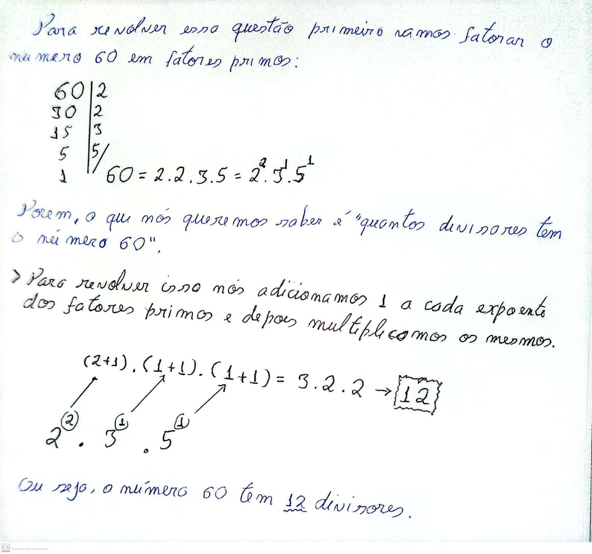
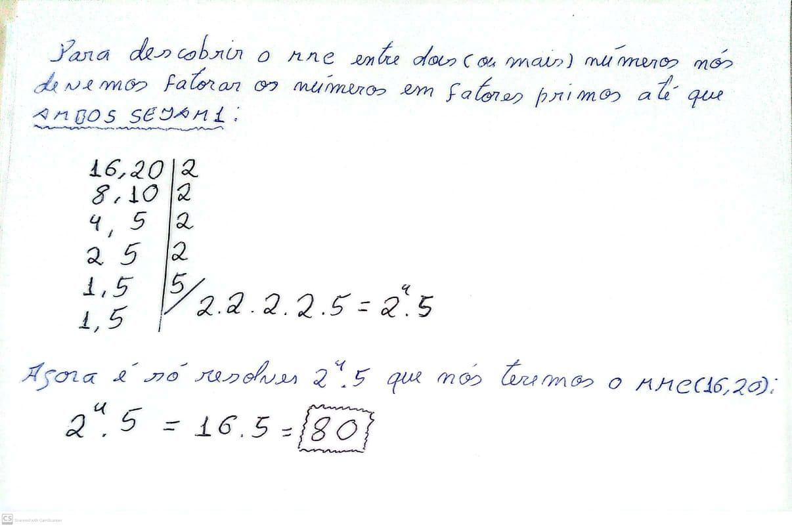
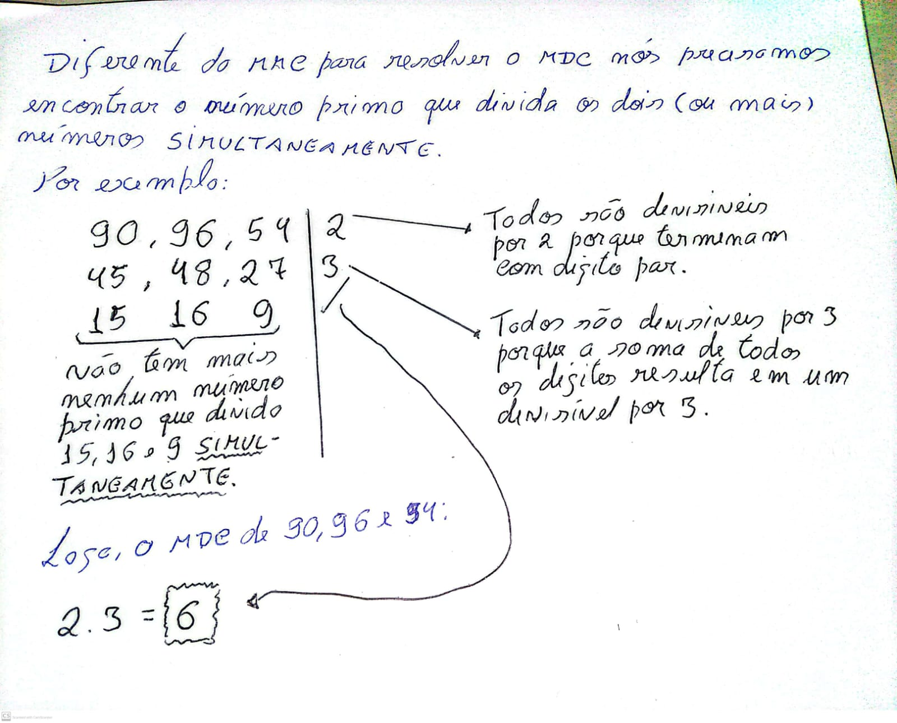

# Teoria dos Números

## Conteúdo

 - [**Dividores (O que são divisores de um número?)**](#divisors)
   - [O número 1 é divisor de todos os números (Inteiros ou Não-Inteiros)?](#1-divisor)
   - [Quando um número é divisível por "2"?](#divisible-by-2)
   - [Quando um número é divisível por "3"?](#divisible-by-3)
   - [Quando um número é divisível por "5"?](#divisible-by-5)
   - [Quando um número é divisível por "6"?](#divisible-by-6)
   - [Quando um número é divisível por "9"?](#divisible-by-9)
 - [**Multiplos (O que são multiplos de um número?)**](#multiples)
 - [**Números Primos**](#prime-numbers)
   - [O número "1" é primo?](#prime-number-1)
   - [Podemos formar qualquer número natural com a multiplicação de primos?](#prime-multiplication)
 - [**Fatoração "numérica"**](#numerical-factorization)
   - [Quantos divisores tem o número 60?](#60-divisors-number)
 - [**O que é o "MMC (Mínimo Multiplo Comum)"?**](#mmc)
   - [Quais tipos de problemas são resolvidos com MMC?](#mmc-problems)
   - [Qual o mínimo múltiplo comum entre 16 e 20?](#mmc-16-20)
 - [**O que é o "MDC (Máximo Divisor Comum)"?**](#mdc)
   - [Quais tipos de problemas são resolvidos com MDC?](#mdc-problems)
   - [Qual o máximo divisor comum entre 90, 96 e 54?](#mdc-90-96-54)
 - **Questões Abertas:**
   - [(OBMEP – Adaptado) Divisão de pedaços de rolos de arame](#obmep-rolos-de-arame)
   - [(OBMEP – Adaptado) Encontro de dois ciclistas](#obmep-encontro-de-dois-ciclistas)
   - [Menor número inteiro de três algarismos divisível por 4, 8 e 10](#menor-numero-inteiro-de-tres-algarismos-divisivel-por-4-8-e-10)
 - **Questões do ENEM:**
 - **Questões de Concurso:**
<!---
[WHITESPACE RULES]
- Same topic = "10" Whitespace character.
- Different topic = "100" Whitespace character.
--->


<!--- ( Dividores ) --->

---

<div id="divisors"></div>

## Dividores (O que são divisores de um número?)

> O que são divisores de um número?

<details>

<summary>RESPOSTA</summary>

<br/>

**📌 Definição formal:**  
Um número 𝑑 é divisor de 𝑛 se:

```bash
𝑛 ÷ 𝑑 tem resto 0 (ou seja, 𝑛 mod 𝑑 = 0)
```

**Exemplo 01:** Divisores de 12  

 - ✅ 12 ÷ 1 = 12 *(resto/mod 0)*
 - ✅ 12 ÷ 2 = 6 *(resto/mod 0)*
 - ✅ 12 ÷ 3 = 4 *(resto/mod 0)*
 - ✅ 12 ÷ 4 = 3 *(resto/mod 0)*
 - ✅ 12 ÷ 6 = 2 *(resto/mod 0)*
 - ✅ 12 ÷ 12 = 1 *(resto/mod 0)*

> **NOTE:**  
> Lembrando que esse processo *inicia dividindo por 1* e *termina dividindo por ele mesmo*.

Logo, os divisores de **12** são:

```bash
{1, 2, 3, 4, 6, 12}
```

</details>


---

<div id="1-divisor"></div>

## O número 1 é divisor de todos os números (Inteiros ou Não-Inteiros)?

> **O número 1 é divisor de todos os números (Inteiros ou Não-Inteiros)?**

<details>

<summary>RESPOSTA</summary>

<br/>

 - ❌ NÃO.
   - Se o número não for inteiro, o conceito de divisor não se aplica da mesma forma.
 - ✅ SIM.
   - Se o número for inteiro sim porque qualquer número dividido por 1 dá ele mesmo, sem deixar resto.

### 🧠 Pensamento-chave:

 - Divisores pertencem ao *"universo dos números inteiros"*.  
 - Se você usa números decimais, o conceito vira divisão comum (aritmética real), e não divisibilidade.

</details>


---

<div id="divisible-by-2"></div>

## Quando um número é divisível por "2"?

> Qual a condição para um número ser divisível por "2"?

<details>

<summary>RESPOSTA</summary>

<br/>

> Um número é divisível por "2" quando o último dígito (algarismo) é par (0, 2, 4, 6, 8):

Por exemplo:

 - 4**0** ÷ 2 = 20
 - 25**2** ÷ 2 = 126
 - 48**6** ÷ 2 = 243
 - 127**8** ÷ 2 = 639

</details>


---

<div id="divisible-by-3"></div>

## Quando um número é divisível por "3"?

> Qual a condição para um número ser divisível por "3"?

<details>

<summary>RESPOSTA</summary>

<br/>

> Um número é divisível por "3" quando a soma dos digitos (algarismos) é múltiplo de 3.

Por exemplo:

```bash
36 = 3 + 6 = 9 (múltiplo de 3 porque 3x3 = 9)
216 = 2 + 1 + 6 = 9 (múltiplo de 3 porque 3x3 = 9)
468 = 4 + 6 + 8 = 18 (múltiplo de 3 porque 3x6 = 18)
1278 = 1 + 2 + 7 + 8 = 18 (múltiplo de 3 porque 3x6 = 18)
```

</details>


---

<div id="divisible-by-5"></div>

## Quando um número é divisível por "5"?

> Qual a condição para um número ser divisível por "5"?

<details>

<summary>RESPOSTA</summary>

<br/>

> Um número é divisível por "5" quando o último digito (algarismo) é **0 ou (∨) 5**.

Por exemplo:

 - 2**5** ÷ 5 = 5
 - 62**5** ÷ 5 = 125
 - 30**0** ÷ 5 = 60
 - 48**0** ÷ 5 = 96

</details>


---

<div id="divisible-by-6"></div>

## Quando um número é divisível por "6"?

> Qual a condição para um número ser divisível por "6"?

<details>

<summary>RESPOSTA</summary>

<br/>

> Um número é divisível por "6" quando é divisível por **"2" e (∧) "3"** ao mesmo tempo.

Por exemplo:

```bash
1278 = 1 + 2 + 7 + 8 = 18 (múltiplo de 3 porque 3x6 = 18)
1278 = o último dígito é um número par.
1278 ÷ 6 = 213

156 = 1 + 5 + 6 = 12 (múltiplo de 3 porque 3x4 = 12)
156 = o último dígito é um número par.
156 ÷ 6 = 26

288 = 2 + 8 + 8 = 18 (múltiplo de 3 porque 3x6 = 18)
288 = o último dígito é um número par.
288 ÷ 6 = 48
```

</details>


---

<div id="divisible-by-9"></div>

## Quando um número é divisível por "9"?

> Qual a condição para um número ser divisível por "9"?

<details>

<summary>RESPOSTA</summary>

<br/>

> Um número é divisível por "9" quando a soma dos seus dígitos (algarismos) é múltiplo de 9.

Por exemplo:

```bash
216 = 2 + 1 + 6 = 9 (múltiplo de 3 porque 9x1 = 9)
4068 = 4 + 0 + 6 + 8 = 18 (múltiplo de 3 porque 9x2 = 18)
```

</details>


<!--- ( Multiplos ) --->

---

<div id="multiples"></div>

## Multiplos (O que são multiplos de um número?)

> O que são multiplos de um número?

<details>

<summary>RESPOSTA</summary>

<br/>

**📌 Definição formal:**  
Um número é múltiplo de outro quando ele é o resultado de uma multiplicação por esse número.

Por exemplo, para saber os múltiplos de 6, fazemos:

 - ✅ 6 × 0 = **0 (multiplo de 6)**
 - ✅ 6 × 1 = **6 (multiplo de 6)**
 - ✅ 6 × 2 = **12 (multiplo de 6)**
 - ✅ 6 × 3 = **18 (multiplo de 6)**
 - ✅ 6 × 4 = **24 (multiplo de 6)**
 - ✅ 6 × 5 = **30 (multiplo de 6)**
 - ✅ 6 × 6 = **36 (multiplo de 6)**
 - ✅ 6 × 7 = **42 (multiplo de 6)**
 - ✅ 6 × 8 = **48 (multiplo de 6)**
 - ✅ 6 × 9 = **54 (multiplo de 6)**
 - ✅ 6 × 10 = **60 (multiplo de 6)**

> **NOTE:**  
> Eles nunca terminam, porque podemos sempre multiplicar o 6 por números maiores.

</details>


<!--- ( Números Primos ) --->

---

<div id="prime-numbers"></div>

## Números Primos

> Qual a condição para um número ser considerado primo?

<details>

<summary>RESPOSTA</summary>

<br/>

> Para um número se considerado primo ele **só pode ser divisível por 1 e por ele mesmo**.

Por exemplo:

```bash
    2                 3                 5
   / \               / \               / \
  ÷   ÷             ÷   ÷             ÷   ÷
 /     \           /     \           /     \
1       2         1       3         1       5
|       |         |       |         |       |
2       1         3       1         5       1


    7                 11               13
   / \               /  \             /  \
  ÷   ÷             ÷    ÷           ÷    ÷
 /     \           /      \         /       \
1       7         1       11       1        13
|       |         |        |       |         |
7       1         11       1       13        1
```

</details>

---

<div id="prime-number-1"></div>

## O número "1" é primo?

Sabendo que um número é considerado primo de se ele é divisível por 1 e por ele mesmo.

> O número "1" é um número primo?

<details>

<summary>RESPOSTA</summary>

<br/>

#### 🧠 Regra-chave

Um número primo deve ter dois divisores **distintos**:

 - 1.
 - e ele mesmo.

Agora observe:

> O número 1 só tem um divisor, que é ele mesmo.

#### E por que essa definição é importante?

É uma questão de coerência matemática.  
Se o número 1 fosse considerado primo, quebraria várias regras e teoremas.

#### ✅ Exemplo: Teorema Fundamental da Aritmética

> Todo número inteiro maior que 1 pode ser escrito como produto de primos únicos (fatoração única).

Se o 1 fosse primo, por exemplo:

```bash
6 = 2 × 3
```

Mas também: 

```bash
6 = 1 × 2 × 3

ou

6 = 1 × 1 × 2 × 3, etc...
```

**🔁 Isso geraria infinitas fatorações diferentes!**  
😵‍💫 A matemática perderia a unicidade da fatoração.

#### 🧮 Então o número 1 é o quê?

> O número **1** é uma **“unidade”** — um número neutro da multiplicação.

Ele não é primo, nem composto, e tem papel especial:

```bash
1 × n = n
```

Ele não contribui para a estrutura de fatores primos.

#### ✅ Conclusão

 - O número 1 não é considerado primo porque não tem dois divisores distintos.
 - Além disso, chamá-lo de primo quebraria regras fundamentais da matemática, como a fatoração única.

</details>


---

<div id="prime-multiplication"></div>

## Podemos formar qualquer número natural com a multiplicação de primos?

> É possível formar qualquer número natural com a multiplicação de números primos?

<details>

<summary>RESPOSTA</summary>

<br/>

> Sim, nós podemos formar qualquer número natural com a multiplicação de números primos.

Por exemplo:

```bash
15 pode ser formado com a multiplicação dos seguintes números primos:
3 x 5 = 15

50 pode ser formado com a multiplicação dos seguintes números primos:
2 x 5 x 5 = 50
```

</details>


<!--- ( Fatoração "numérica" ) --->

---

<div id="numerical-factorization"></div>

## Fatoração "numérica"

> O que é uma "fatoração numérica"?

<details>

<summary>RESPOSTA</summary>

<br/>

Uma **Fatoração Numérica** é o processo de escrever um número como *produto (multiplicação)* de fatores menores, ou seja, quebrar algo em "peças multiplicativas".

Por exemplo:

```bash
36 = 2 × 2 × 3 × 3 = 2² × 3²
```

> **NOTE:**  
> Lembrando que essa fatoração é sempre utilizando números primos.

Por exemplo, vamos decompor o número **60** em fatores primos, com a famosa *"chave de fatoração"*:

```bash
60 | 2
30 | 2
15 | 3
 5 | 5
 1
```

Ou seja, 60 também pode ser escrito como:

```bash
60 = 2 × 2 × 3 × 5
60 = 2² × 3¹ × 5¹
```

</details>


---

<div id="60-divisors-number"></div>

## Quantos divisores tem o número 60?

> Quantos divisores tem o número 60?

<details>

<summary>RESPOSTA</summary>

<br/>

  

</details>


<!--- ( MMC ) --->

---

<div id="mmc"></div>

## O que é o "MMC (Mínimo Multiplo Comum)"?

> O que é o MMC (Mínimo Multiplo Comum) entre números?

<details>

<summary>RESPOSTA</summary>

<br/>

> O MMC de dois ou mais números é o menor número (excluindo o zero) que é múltiplo comum de todos eles ao mesmo tempo.

Por exemplo:

 - **Múltiplos de 4:**
   - 4, 8, 12, 16, **20**, 24, ...
 - **Múltiplos de 5:**
   - 5, 10, 15, **20**, 25, 30, ...

Aqui o nesse exemplo o *mínimo (menor) múltiplo comum* entre **4** e **5** é o número **20**.

</details>


---

<div id="mmc-problems"></div>

## Quais tipos de problemas são resolvidos com MMC?

> Quais tipos de problemas são resolvidos com MMC?

<details>

<summary>RESPOSTA</summary>

<br/>

> Use MMC quando tiver problemas de *encontro (sincronização)*.

Por exemplo:

 - **DOIS SEMÁFOROS:**
   - Um semáforo pisca a cada 15 segundos, e o outro a cada 20 segundos.
   - Pergunta: Depois de quanto tempo eles vão piscar juntos novamente?
   - → MMC(15, 20) = **60 segundos**
 - **ALUNOS PULANDO CORDA:**
   - Ana pula a cada 6 segundos e João a cada 8.
   - Pergunta: Quando pularão juntos pela primeira vez?
   - → MMC(6, 8) = **24 segundos**
 - **TORNEIRAS GOTEJANDO:**
   - Três torneiras gotejam a cada 9, 12 e 15 minutos.
   - Pergunta: Qual o intervalo para todas gotejarem juntas?
   - → MMC(9, 12, 15) = **180 minutos**

> **NOTE:**  
> Outro caso comum de utilização de MMC é quando temos frações com denominadores diferentes.

Por exemplo:

$\frac{1}{3} + \frac{1}{4}$

No exemplo acima nós precisamos encontrar o MMC entre 3 e 4 e igualar os denominadores.

```bash
MMC(3, 4) = 12
```

$\frac{1}{12} + \frac{1}{12}$

</details>


---

<div id="mmc-16-20"></div>

## Qual o mínimo múltiplo comum entre 16 e 20?

> Qual o mínimo múltiplo comum entre 16 e 20?

<details>

<summary>RESPOSTA</summary>

  

</details>


<!--- ( MDC ) --->

---

<div id="mdc"></div>

## O que é o "MDC (Máximo Divisor Comum)"?

> O que é o MDC (Máximo Divisor Comum) entre números?

<details>

<summary>RESPOSTA</summary>

<br/>

> O MDC entre dois ou mais números é o maior número inteiro positivo que divide todos eles ao mesmo tempo, ou seja, o maior divisor comum.

Por exemplo:

 - **Divisores de 12:**
   - 1, 2, 3, 4, **6**, 12
 - **Divisores de 18:**
   - 1, 2, 3, **6**, 9, 18

Aqui o nesse exemplo o *máximo divisor comum* entre **12** e **18** é o número **6**.

</details>


---

<div id="mdc-problems"></div>

## Quais tipos de problemas são resolvidos com MDC?

<details>

<summary>RESPOSTA</summary>

<br/>

> Use MDC quando quiser **dividir algo em partes iguais (sem sobras)**.

Por exemplo:

 - **DIVISÃO DE BOMBONS:**
   - Temos 24 bombons de morango e 36 de chocolate.
   - Pergunta: Qual o maior número de pacotes idênticos que podemos montar, sem sobras?
   - ✔️ MDC(24, 36) = 12 pacotes.
   - Cada pacote terá:
     - 24 ÷ 12 = 2 bombons de morango.
     - 36 ÷ 12 = 3 bombons de chocolate.
 - **DIVISÃO DE CAIXAS COM PEÇAS:**
   - Temos 40 parafusos e 60 porcas.
   - Pergunta: Qual o maior número de caixas idênticas que podemos montar?
   - ✔️ MDC(40, 60) = 20 caixas.
   - Cada caixa terá:
     - 40 ÷ 20 = 2 parafusos.
     - 60 ÷ 20 = 3 porcas.
 - **FORMAR TIMES:**
   - Uma escola tem 50 meninas e 65 meninos para um torneio.
   - Pergunta: Qual o maior número de times mistos idênticos que podem ser formados sem sobrar alunos?
   - ✔️ MDC(50, 65) = 5 times.
   - Cada time terá:
     - 50 ÷ 5 = 10 meninas.
     - 65 ÷ 5 = 13 meninos.
 - **KITS ESCOLARES:**
   - Temos 48 lápis e 36 canetas.
   - Pergunta: Quantos kits iguais podemos montar com todos os materiais, sem sobras?
   - ✔️ MDC(48, 36) = 12 kits.
   - Cada kit terá:
     - 48 ÷ 12 = 4 lápis.
     - 36 ÷ 12 = 3 canetas.

> **NOTE:**  
> Outro caso comum de utilização de MDC é quando temos que reduzir (simplificar) uma fração em sua forma mais simples.

Por exemplo:

$\frac{18}{24}$

```bash
MDC(18, 24) = 6
```

Aplicando o MDC de **18** e **24**, que é **6**, nós temos que podemos reduzir (simplificar) a fração para:

$\frac{18 \div 6}{24 \div 6} = \frac{3}{4}$

</details>

---

<div id="mdc-90-96-54"></div>

## Qual o máximo divisor comum entre 90, 96 e 54

> Qual o máximo divisor comum entre 90, 96 e 54?

<details>

<summary>RESPOSTA</summary>

<br/>

  

</details>


<!--- ( Questões Abertas ) --->

---

<div id="obmep-rolos-de-arame"></div>

## (OBMEP – Adaptado) Divisão de pedaços de rolos de arame


Dois rolos de arame, um de 210 metros e outro de 330 metros, devem ser cortados em pedaços de mesmo comprimento. Quantos pedaços podem ser feitos se desejamos que cada um destes pedaços tenha o maior comprimento possível?

 - a) 7 pedaços
 - b) 11 pedaços
 - c) 35 pedaços
 - d) 18 pedaços
 - e) 55 pedaços

<details>

<summary>RESPOSTA</summary>

<br/>

A primeira coisa que nós precisamos fazer é idenfiticar as **variáveis/constantes do problema** e **o que o problemar quer (solução)**:

 - **Variáveis/Constantes:**
   - *Rolo com 210 metros de arame:*
     - A = 210
   - *Rolo com 330 metros de arame:*
     - B = 330
 - **Problema:**
   - *Os arames devem ser cortados em pedaços de mesmo comprimento:*
     - Problema de divisão: MDC(210, 330)
   - *Quantos pedaços podem ser feitos?*

De início, vamos tirar o **MÁXIMO DIVISOR COMUM (MDC)** de **210** e **330** para descobrir o maior comprimento que podemos cortar (dividir) igualmente os dois rolos de arames:

```bash
210, 330 | 2
105, 165 | 3
 35,  55 | 5
  7,  11 | /  2 x 3 x 5 = 30 metros
```

Sabendo que em que cada rolo nós vamos dividir em pedaços de 30 metros:

```bash
210 ÷ 30 = 7 pedaços
330 ÷ 30 = 11 pedaços
```

Ou seja, nós vamos ter 7 + 11 pedaços, 7 + 11 = 18 pedaços.

**RESPOSTA:**  
Opção **"D"**.

</details>


---

<div id="obmep-encontro-de-dois-ciclistas"></div>

## (OBMEP – Adaptado) Encontro de dois ciclistas

(OBMEP – Adaptado) Dois ciclistas correm numa pista circular e gastam, respectivamente, 30 segundos e 35 segundos para completar uma volta na pista. Eles partem do mesmo local e no mesmo instante. Após algum tempo os dois atletas se encontram, pela primeira vez, no local de largada. Depois de quanto tempo da largada ocorrerá o encontro?

 - a) 60 segundos
 - b) 70 segundos
 - c) 90 segundos
 - d) 210 segundos
 - e) 420 segundos

<details>

<summary>RESPOSTA</summary>

<br/>

A primeira coisa que nós precisamos fazer é idenfiticar as **variáveis/constantes do problema** e **o que o problemar quer (solução)**:

 - **Variáveis/Constantes:**
   - *O ciclista A dando uma volta em 30 segundos:*
     - A = 30 segundos
   - *O ciclista B dando uma volta em 35 segundos:*
     - B = 35
 - **Problema:**
   - *Depois de quanto tempo da largada ocorrerá o encontro?*
     - Problema de encontro/sincronização: MMC(30, 35)

```bash
30, 35 | 2
15, 35 | 3
 5,  7 | 5
 1,  7 | 7
 1,  1 | / 2 x 3 x 5 x 7 = 210 segundos
```

Logo, os ciclista se encontraram depois de *210* segundos da largada.

**RESPOSTA:**  
Opção **"E"**.

</details>


---

<div id="menor-numero-inteiro-de-tres-algarismos-divisivel-por-4-8-e-10"></div>

## Menor número inteiro de três algarismos divisível por 4, 8 e 10

Determine o menor número inteiro positivo de três algarismos que é divisível, ao mesmo tempo, por 4, 8 e 10.

 - a) 80
 - b) 100
 - c) 110
 - d) 120
 - e) 160

<details>

<summary>RESPOSTA</summary>

<br/>

A primeira coisa que nós precisamos fazer é idenfiticar as **variáveis/constantes do problema** e **o que o problemar quer (solução)**:

 - **Variáveis/Constantes:**
   - A = 4
   - B = 8
   - C = 10
 - **Problema:**
   - *Menor número inteiro de três algarismos divisível por 4, 8 e 10?*

Aqui a primeira coisa que nós vamos fazer é tirar de **4**, **8** e **10**:

```bash
4   8   10 | 2
2   4   5  | 2
1   2   5  | 2
1   1   5  | 5
1   1   1  | / 2 x 2 x 2 x 5 = 2³ x 5 = 40
```

Mas, lembre-se que a questão quer:

> ** O menor número inteiro de três algarismos divisível por 4, 8 e 10**.

Quando você calcula o MMC de alguns números, como no caso:

```bash
MMC(4, 8, 10) = 40
```

> **NOTE:**  
> Isso significa que **"todos os múltiplos de 40" "também serão múltiplos de 4, 8 e 10 ao mesmo tempo"**.

Ou seja:

> Qual é o menor múltiplo de 40 (porque 40 é o MMC) que tem três algarismos?

 - 40 × 1 = 40  ❌(Só tem dois algarismos)
 - 40 × 2 = 80  ❌(Só tem dois algarismos)
 - 40 × 3 = 120 ✅(**Primeiro** múltiplo com 3 algarismos)
 - 40 × 4 = 160 ✅(*Seundo* múltiplo com 3 algarismos) 

Seguindo o que a nossa questão deseja, *Menor número inteiro de três algarismos divisível por 4, 8 e 10 é **120***.

**RESPOSTA:**  
Opção **"D"**.

</details>


<!--- ( REFERÊNCIA ) --->

---

<div id="ref"></div>

## REFERÊNCIA

 - **Cursos:**
   - [Licenciatura - Matemática](https://www.faculdadeunica.com.br/graduacao/ead/matematica-3080)

---

**Rodrigo** **L**eite da **S**ilva - **rodrigols89**

<details>

<summary></summary>

<br/>

RESPOSTA

```bash

```

  

</details>
