# Geometria Plana

## Conteúdo

 - **Ponto:**
   - [`O que são pontos colineares?`](#pontos-colineares)
 - **Retas:**
   - [`O que são retas concorrentes?`](#retas-concorrentes)
 - **Segmento de reta:**
   - [`O que é "Segmento de Reta"?`](#segmento-de-reta)
   - [`O que é uma "Semirreta"?`](#semirreta)
   - [`O que significa "Congruência de segmentos"?`](#congruencia-de-segmentos)
 - **Ângulos:**
   - [`O que é um "Ângulo" (por definição)?`](#def-angulos)
   - [`O que é a Bissetriz de um Ângulo?`](#bissetriz)
   - [`Qual a diferença os ângulos reto, agudo, obtuso?`](#angulos-reto-agudo-obtuso)
   - **Questões Abertas:**
     - [`Qual opção fornece um par de "ângulos complementar" um ao outro?`](#angulos-questao-01)
     - [`Problema de "ângulos suplementares"`](#angulos-questao-03)
     - [`Problema de "ângulo raso"`](#angulos-questao-04)
     - [`Classifique o ângulo do transferidor (régua redonda) abaixo de acordo com sua medida`](#angulos-questao-02)
     - [`Problema (01) de ângulo com variável "x"`](#angulos-questao-05)
     - [`Problema (02) de ângulo com variável "x"`](#angulos-questao-06)
     - [`Problema (01) de ângulo com variáveis "x" e "y"`](#angulos-questao-07)
     - [`Problema (02) de ângulo com variáveis "x" e "y"`](#angulos-questao-08)
 - [**REFERÊNCIA**](#ref)
<!--- ( Questões Abertas ) --->
<!--- ( Questões do ENEM ) --->
<!--- ( Questões de Concurso ) --->
<!---
[WHITESPACE RULES]
- Same topic = "10" Whitespace character.
- Different topic = "200" Whitespace character.
--->


<!--- ( Pontos ) --->

---

<div id="pontos-colineares"></div>

## `O que são pontos colineares?`

> **O que são pontos colineares?**


<details>

<summary>RESPOSTA</summary>

<br/>

> **Pontos colineares são pontos que pertencem a uma mesma reta.**

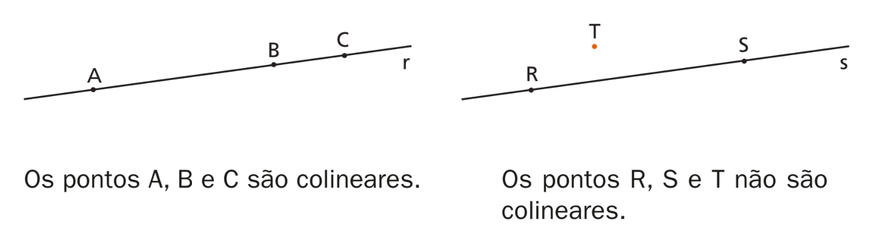  

</details>


<!--- ( Retas ) --->

---

<div id="retas-concorrentes"></div>

## `O que são retas concorrentes?`

> **O que são retas concorrentes?**

<details>

<summary>RESPOSTA</summary>

<br/>

> **Duas retas são concorrentes se, e so- mente se, elas têm um único ponto comum.**

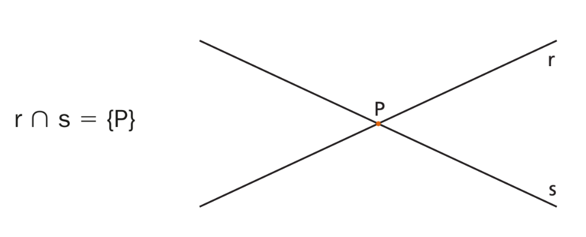  

</details>


<!--- ( Segmento de reta ) --->

---

<div id="segmento-de-reta"></div>

## `O que é "Segmento de Reta"?`

> **O que é "Segmento de Reta"?**

<details>

<summary>RESPOSTA</summary>

<br/>

 - Um **"segmento de reta"** é **"um pedaço da reta"**.
 - Ele é delimitado por **dois pontos**, **chamados extremidades**.
 - Diferente da reta, o segmento tem **começo** e **fim**.

> **👉 Representação:**  
> Se os pontos são A e B, escrevemos o segmento como $\overline{AB}$.

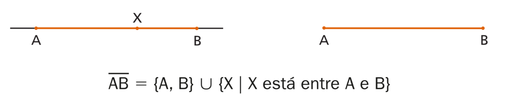  

</details>


---

<div id="semirreta"></div>

## `O que é uma "Semirreta"?`

> **O que é uma "Semirreta"?**

<details>

<summary>RESPOSTA</summary>

<br/>

 - Diferente de uma *"reta"*, **que é infinita nos dois sentidos**;
 - Uma *semirreta* tem um **início fixo**, e para indicar seu sentido ilimitado;
 - Ela é representada por uma seta em um de seus lados:
   - Ou seja, qual direção a semirreta vai seguir.

> **👉 Representação:**  
> Se o ponto inicial é A e a direção vai até B, escrevemos a semirreta como $\overrightarrow{AB}$.

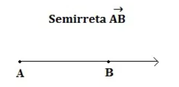  

> **NOTE:**  
> Ou seja, uma **"semirreta"** é **"um pedaço da reta que começa em um ponto e se estende infinitamente em uma direção"**.

</details>


---

<div id="congruencia-de-segmentos"></div>

## `O que significa "Congruência de segmentos"?`

> **O que significa "Congruência de segmentos"?**

<details>

<summary>RESPOSTA</summary>

<br/>

> **A palavra *"congruente"* na matemática significa *“ter a mesma medida”*.**  
> Então, quando falamos de segmentos *"congruentes"*, queremos dizer que eles (ou elas) têm o mesmo comprimento.

Ou seja, dois segmentos de reta são congruentes quando:

$Comprimento \ de \ \overline{AB} = Comprimento \ de \ \overline{CD}$

**👉 Em símbolos, escrevemos:**

$\overline{AB} \cong \overline{CD}$

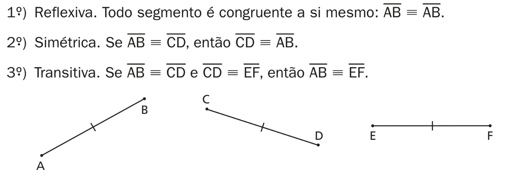  

</details>


<!--- ( Ângulos ) --->

---

<div id="def-angulos"></div>

## `O que é um "Ângulo" (por definição)?`

> **O que é um "Ângulo" (por definição)?**

<details>

<summary>RESPOSTA</summary>

<br/>

Uma definição de *"ângulo"* é a seguinte:

> Um *ângulo* é a reunião de **duas semirretas com a mesma origem**, chamadas de lados do ângulo, e o ponto comum, chamado de vértice.

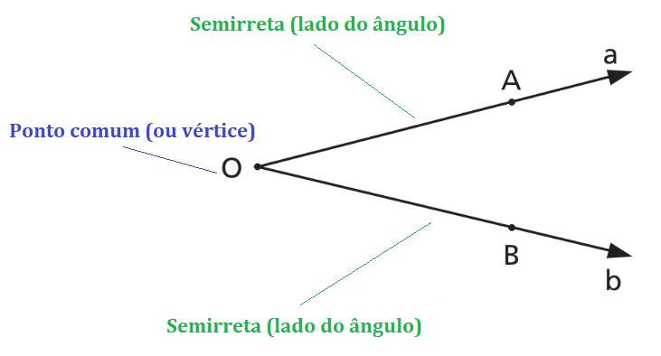  

$A\widehat{O}B = \overrightarrow{OA} \ \cup \ \overrightarrow{OB}$

Isso quer dizer:

 - O ângulo $A\widehat{O}B$ é formado pela união das duas semirretas $\overrightarrow{OA}$ e $\overrightarrow{OB}$;
 - O ponto $O$ é o vértice do ângulo;
 - Os pontos $A$ e $B$ definem a direção dos lados do ângulo:
   - Ou direções das semirretas $\overrightarrow{OA}$ e $\overrightarrow{OB}$.

> **NOTE:**  
> O “chapéuzinho” ^ (ou o símbolo ∠) serve para indicar que estamos falando de um ângulo e não apenas de três pontos.

</details>


---

<div id="bissetriz"></div>

## `O que é a Bissetriz de um Ângulo?`

> **O que é a Bissetriz de umÂngulo?**

<details>

<summary>RESPOSTA</summary>

<br/>

Antes de definir o que é a Bissetriz de um ângulo, vamos relembrar o que é um ângulo:

 - Um **ângulo** é **formado por duas semirretas** que *partem de um mesmo ponto (o vértice)*.
 - Esse ângulo possui uma medida, expressa em **"graus (°)"** ou **"radianos"**.

#### Bissetriz de um ângulo

> **A bissetriz de um ângulo é a semirreta que parte do vértice e divide o ângulo em duas partes iguais.**

Por exemplo:

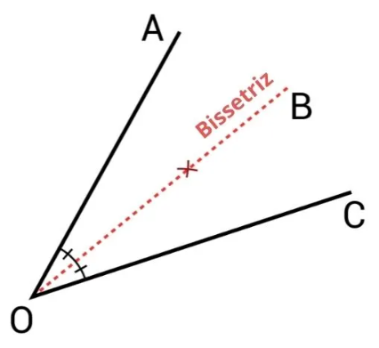  

> **👉 Em outras palavras:**  
> Se o ângulo $\angle A\widehat{O}C$ mede mede 60º, a bissetriz cria dois ângulos de 30º cada.

</details>


---

<div id="angulos-reto-agudo-obtuso"></div>

## `Qual a diferença os ângulos reto, agudo, obtuso?`

> **Qual a diferença os ângulos reto, agudo, obtuso?**

<details>

<summary>RESPOSTA</summary>

<br/>

 - **Ângulo reto** é todo ângulo congruente a seu suplementar adjacente.

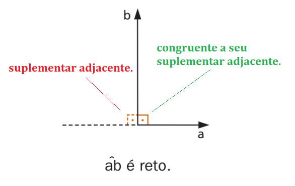  

 - **Ângulo agudo** é um ângulo menor que um ângulo reto.

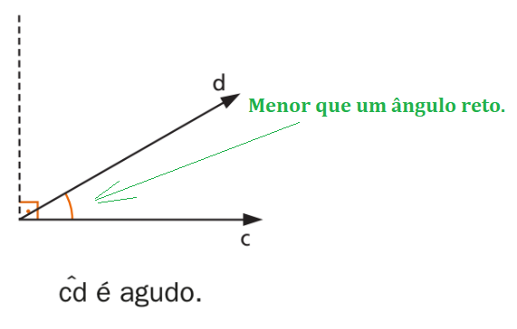  

 - **Ângulo obtuso** é um ângulo maior que um ângulo reto.

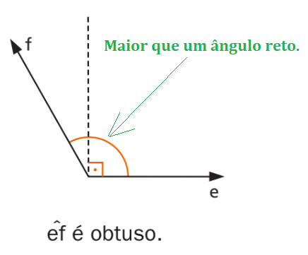

</details>


---

<div id="angulos-questao-01"></div>

## `Qual opção fornece um par de "ângulos complementar" um ao outro?`

> **Qual opção fornece um par de "ângulos complementar" um ao outro?**

 - **A)** 40º e 20º
 - **B)** 60º e 40º
 - **C)** 75º e 15º
 - **D)** 120º e 60º
 - **E)** 300º e 60º

<details>

<summary>RESPOSTA</summary>

<br/>

Sabendo que **Ângulos Complementares** são aqueles que **somados resultam em 90º**:

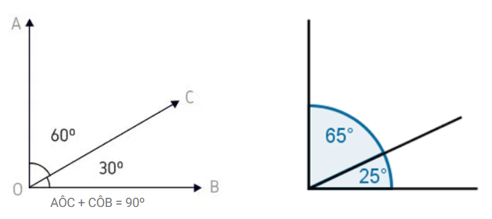  

Sendo, assim resposta **"C"**

$75º + 15º = 90º$

</details>


---

<div id="angulos-questao-03"></div>

## `Problema de "ângulos suplementares"`

> Sabendo que dois ângulos `x` e `y` são suplementares e, que o ângulo `x` possui **36º**, a medida do ângulo `y` é igual a...

 - **a)** 24º.
 - **b)** 54º.
 - **c)** 64º.
 - **d)** 144º.
 - **e)** 324º.

<details>

<summary>RESPOSTA</summary>

<br/>

> Dois ângulos são suplementares quando somam **180º**.

Ou seja:

$180º - 36º = 144º$ 

Sendo assim, a resposta seria: **"d) 64º"**

</details>


---

<div id="angulos-questao-04"></div>

## `Problema de "ângulo raso"`

Um triângulo é um polígono com três lados e três ângulos. Sabendo que ao somar os três ângulos de qualquer triângulo o resultado é sempre o **ângulo raso**, no triângulo abaixo o ângulo que está faltando é de:

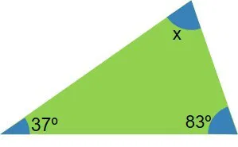  

 - **a)** 29º
 - **b)** 40º
 - **c)** 47º
 - **d)** 53º
 - **e)** 60º

<details>

<summary>RESPOSTA</summary>

<br/>

> Um **Ângulo Raso** é um ângulo de `180º`, ou meia volta.

Logo:

$x = 180º - 37º - 83º$  
$x = 60º$

Sendo assim, a resposta seria: **"e) 60º"**

</details>


---

<div id="angulos-questao-02"></div>

## `Classifique o ângulo do transferidor (régua redonda) abaixo de acordo com sua medida`

> **Classifique o ângulo do transferidor (régua redonda) abaixo de acordo com sua medida**

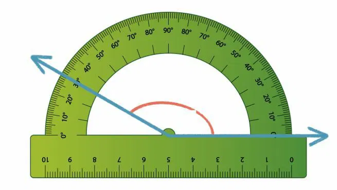  

 - **a)** Agudo
 - **b)** Reto
 - **c)** Obtuso
 - **d)** Raso
 - **e)** Não é possível determinar apenas pela figura

<details>

<summary>RESPOSTA</summary>

<br/>

Na imagem temos um ângulo de **150º**.

$90º + (90º - 30º) = 90º + 60º = 150º$

Sendo assim, a resposta seria: **"a) Agudo"**

> **Sabendo que os ângulos obtusos são maiores que 90º.**

</details>


---

<div id="angulos-questao-05"></div>

## `Problema (01) de ângulo com variável "x"`

> Sendo o ângulo `AÔC` reto, os ângulos `AÔB` e `BÔC` valem, respectivamente:

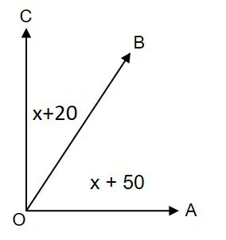  

 - **a)** 20° e 70º
 - **b)** 30° e 60º
 - **c)** 40° e 50º
 - **d)** 50° e 40º
 - **e)** 60º e 30°

<details>

<summary>RESPOSTA</summary>

<br/>

Primeiro vamos identificar as variáveis do problema:

 - Temos um ângulo reto `AÔC`:
   - Ou seja, `AÔC = 90º`.
 - Também temos dois ângulos obtusos `AÔB` e `BÔC`:
   - `AÔB = x + 50`
   - `BÔC = x + 20`

Logo, nós vamos ter a seguinte expresão:

$x + 50 + x + 20 = 90º$

Que pode ser agrupado como:

$2x + 70 = 90º$

Agora nós vamos dividir os 2 lados por dois:

$\frac{2x + 70}{2} = \frac{90}{2}$

Fazendo a divisão dos dois lados por 2 teremos:

$x + 35 = 45$

Para finalizar vamos subtrair 35 de ambos os lados:

$x + (35 - 35) = 45 - 35$

Finalizando, nosso `x` será:

$x = 10$

**NOTE:**  
Porém, nós precisamos aplicar o valor de `x` nos 2 ângulos lembra?

 - `x = 10`
 - `AÔB = x + 50 = 60`
 - `BÔC = x + 20 = 30`

Logo a resposta correta seria:

> `e) 60º e 30°`

</details>


---

<div id="angulos-questao-06"></div>

## `Problema (02) de ângulo com variável "x"`

Duas retas se cruzam no vértice `V`, formando *ângulos opostos pelo vértice* medindo `6x + 9` e `9x – 9`. Então, podemos afirmar que x é igual a:

 - **A)** 50º
 - **B)** 45º
 - **C)** 12º
 - **D)** 10º
 - **E)** 6º

<details>

<summary>RESPOSTA</summary>

<br/>

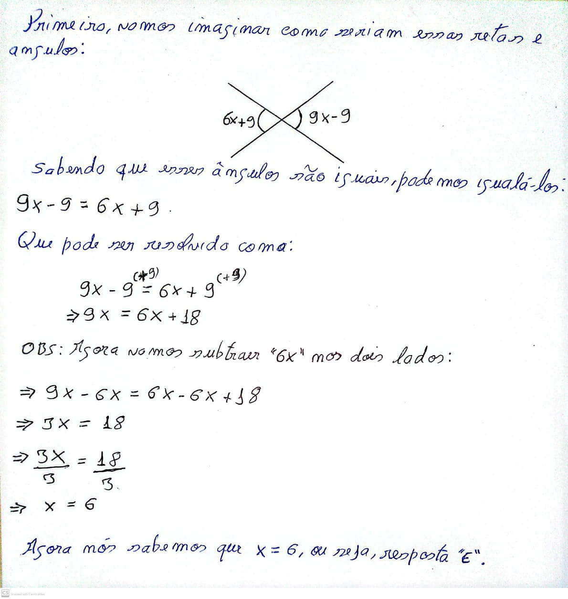  

</details>


---

<div id="angulos-questao-07"></div>

## `Problema (01) de ângulo com variáveis "x" e "y"`

Analise a imagem a seguir:

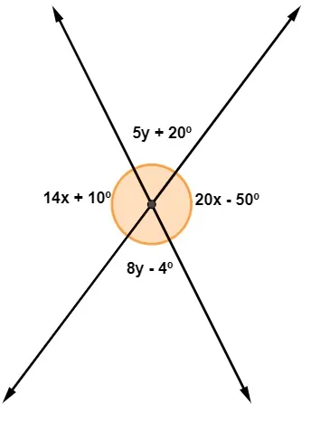

O valor da soma `x` + `y` é igual a:

 - **A)** 8º
 - **B)** 9º
 - **C)** 10º
 - **D)** 18º
 - **E)** 20º

<details>

<summary>RESPOSTA</summary>

<br/>

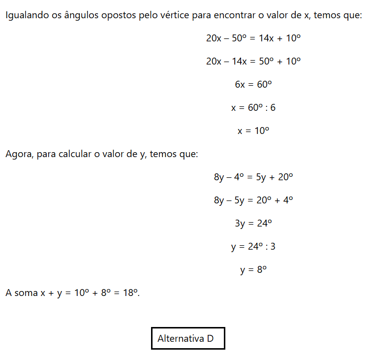  

</details>


---

<div id="angulos-questao-08"></div>

## `Problema (02) de ângulo com variáveis "x" e "y"`

  

Analisando a imagem acima, a diferença entre `y` e `x` é igual a:

 - **A)** 0
 - **B)** 1
 - **C)** 2
 - **D)** -1
 - **E)** -2

<details>

<summary>RESPOSTA</summary>

<br/>

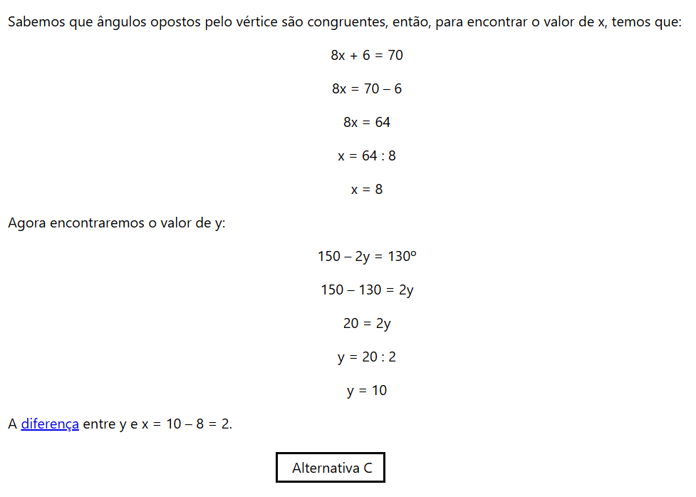  

</details>


<!--- ( Triângulos ) --->

---

<div id="def-triangulos"></div>

## O que é um "Triângulo" (por definição)?

> **O que é um "Triângulo" (por definição)?**

<details>

<summary>RESPOSTA</summary>

<br/>

Por definição (uma delas) nós podemos dizer que um triângulo é:

> Coming soon...

</details>


<!--- ( REFERÊNCIA ) --->

---

<div id="ref"></div>

## REFERÊNCIA

 - **Cursos:**
   - [Licenciatura - Matemática](https://www.faculdadeunica.com.br/graduacao/ead/matematica-3080)
 - **Useful Links:**
   - [Exercícios sobre ângulos (com questões respondidas)](https://www.todamateria.com.br/exercicios-sobre-angulos/)
   - [Exercícios sobre ângulos opostos pelo vértice](https://exercicios.mundoeducacao.uol.com.br/exercicios-matematica/exercicios-sobre-angulos-opostos-pelo-vertice.htm)

---

**Rodrigo** **L**eite da **S**ilva - **rodrigols89**

<details>

<summary></summary>

<br/>

RESPOSTA

```bash

```

  

</details>
