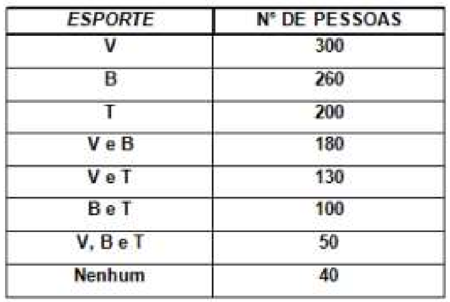
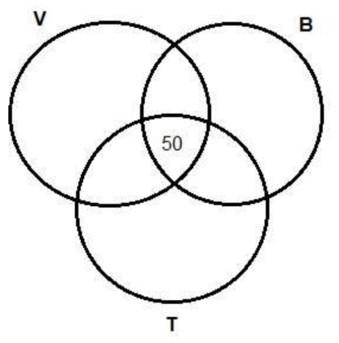
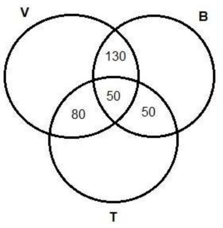
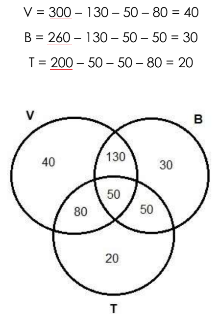

# Teoria dos Conjuntos

## Conteúdo

 - **Questões Abertas:**
   - [(UFBA) Enquete sobre as preferências esportivas](#ufba-enq-01)
 - **Questões do ENEM:**
 - **Questões de Concurso:**
<!---
[WHITESPACE RULES]
- Same topic = "10" Whitespace character.
- Different topic = "100" Whitespace character.
--->


<!--- ( Questões Abertas ) --->

---

<div id="ufba-enq-01"></div>

## (UFBA) Enquete sobre as preferências esportivas

Em uma enquete, várias pessoas foram entrevistadas acerca de suas preferências em relação a três esportes:

 - Volei (V);
 - Basquete (B);
 - Tênis (T).

Cujos dados estão indicados na tabela a seguir:

  

De acordo com esses dados, é correto afirmar que, nessa enquete, o número de pessoas entrevistadas foi:

 - a) 400
 - b) 440 
 - c) 490
 - d) 530
 - e) 570

<details>

<summary>Resposta</summary>

<br/>

Para resolver esse tipo de questão, devemos inserir os dados em um diagrama de Venn, pois as interseções devem ser analisadas no início para descobrir os valores exatos em relação aos três esportes. Primeiramente, vamos inserir o valor comum entre os três esportes, pois eles se relacionam com os demais valores:

  

Após inserir os 50 na interseção dos três esportes, devemos colocar as interseções entre dois esportes. Para isso é necessário tirar o valor que é comum dos três, assim, teremos os cálculos:

```bash
V e T = 130 – 50 = 80
V e B = 180 – 50 = 130
B e T = 100 – 50 = 50
```

  

Agora vamos descobrir os valores que faltam para completar os esportes. Realizando os cálculos, retirando os valores já inseridos em cada esporte:

  

> **OBSERVAÇÃO:**  
> Vejam que no fim nós subtraímos o total de cada categoria, por suas intersecções.

Desse modo, como todos os valores inseridos, vamos somar os valores do diagrama com o valor que representa as pessoas que não possuem preferência nenhuma e teremos:

```bash
40 + 130 + 50 + 80 + 30 + 50 + 20 + 40 = 440
```

Logo, a alternativa correta é a letra b.

> **OBSERVAÇÃO:**  
> Em uma questão como essa que tem uma categoria **"nenhuma"** é sempre interessante colocar esse valor separado para não esquecer, pois, isso pode fazer você errar a questão.

</details>


<!--- ( REFERÊNCIA ) --->

---

<div id="ref"></div>

## REFERÊNCIA

 - **Cursos:**
   - [Licenciatura - Matemática](https://www.faculdadeunica.com.br/graduacao/ead/matematica-3080)
 - **Livros:**
   - [Fundamentos Matemáticos Para a Ciência da Computação](https://www.amazon.com.br/Fundamentos-Matem%C3%A1ticos-Para-Ci%C3%AAncia-Computa%C3%A7%C3%A3o/dp/8521614225)

---

**Rodrigo** **L**eite da **S**ilva - **rodrigols89**

<details>

<summary>Resposta</summary>

<br/>


</details>

