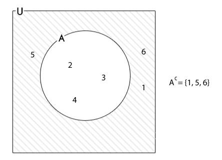
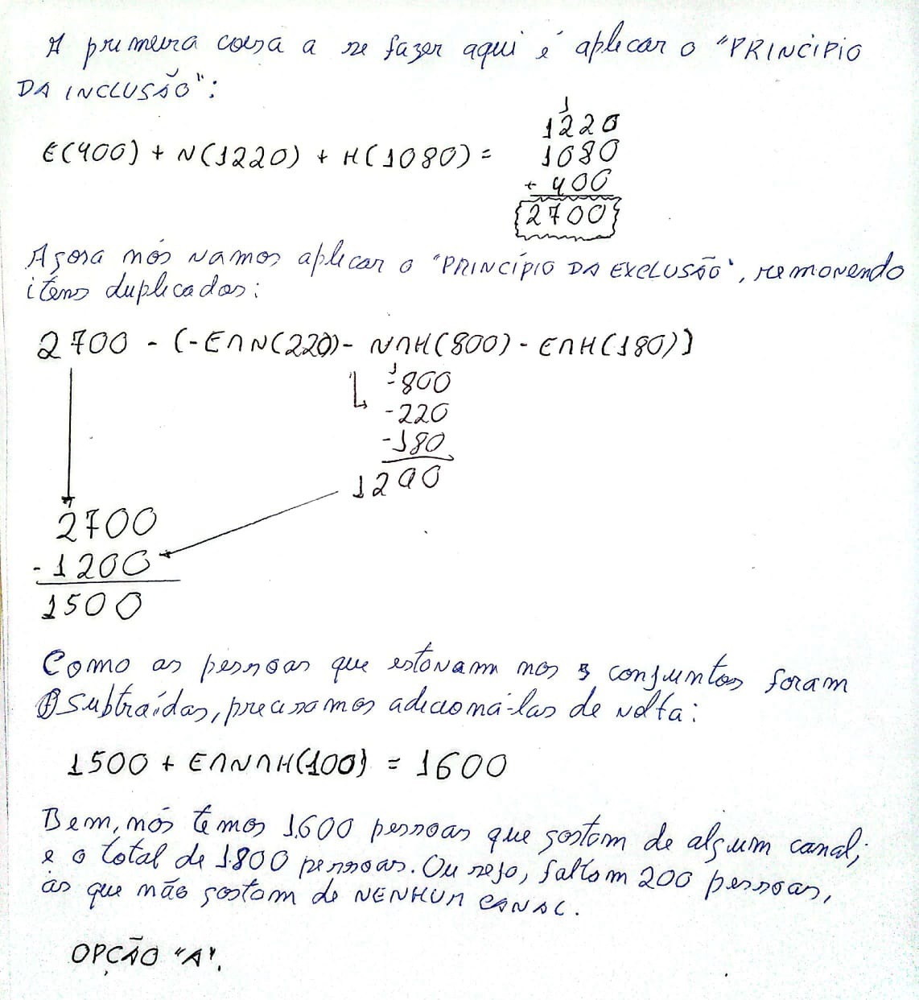

# Teoria dos Conjuntos

## Conteúdo

 - **Operações com Conjuntos:**
   - [União de Conjuntos](#union-of-set)
   - [Interseção de Conjuntos](#intersection-of-sets)
   - [Complementar de um Conjunto](#complement-of-sets)
 - **Questões Abertas:**
   - [(UFBA) Enquete sobre preferências esportivas](#ufba-enq-01)
   - [(PUC/Campinas-SP) Pesquisa de programas favoritos](#puc-campinas-sp-02)
 - **Questões do ENEM:**
 - **Questões de Concurso:**
<!---
[WHITESPACE RULES]
- Same topic = "10" Whitespace character.
- Different topic = "100" Whitespace character.
--->


<!--- ( Operações com Conjuntos ) --->

---

<div id="union-of-set"></div>

## União de Conjuntos

> O que é **União de Conjuntos** e como ela pode ser representada de forma **lógica (proposicional)**?

<details>

<summary>RESPOSTA</summary>

<br/>

A **união de conjuntos** permite combinar dois (ou mais) conjuntos em um novo conjunto que contém todos os elementos de cada um, `sem repetições`.

> **NOTAÇÃO:**  
> A união de 𝐴 e 𝐵 é denotada por 𝐴 ∪ 𝐵.

Por exemplo:

```bash
A = {2, 4}
B = {4, 6}

A ∪ B = {2, 4} ∪ {4, 6} = {2, 4, 6}
```

> **NOTE:**  
> Como conjuntos são coleções sem ordem, a sequência dos elementos não importa, e o “4” aparece apenas uma vez.

A operação de **União de Conjuntos** também pode ser representada de forma **"lógica (proposicional)"**:

 - **Abordagem lógica:** `OU`, `OR`, `||`
   - A união pode ser comparada ao operador lógico `OU`, pois um elemento pertence a `𝐴 ∪ 𝐵` se ele estiver em `A`, `B`, ou em `ambos`.
   - Vejam que faz todo sentido, pois, na lógica proposicional no `operador lógico (OR)` se apenas uma das proposições for verdadeira a setença inteira também será verdadeira.

</details>


---

<div id="intersection-of-sets"></div>

## Interseção de Conjuntos

> O que é **Interseção de Conjuntos** e como ela pode ser representada de forma **lógica (proposicional)**?

<details>

<summary>RESPOSTA</summary>

<br/>

A **Interseção de conjuntos** refere-se a encontrar os elementos comuns entre dois conjuntos simultaneamente.

> **NOTAÇÃO:**  
> É representada por **"A ∩ B"**.

Por exemplo:

```bash
A = {2, 4}
B = {4, 6}

A ∩ B = {2, 4} ∩ {4, 6} = {4}.
```

A operação de **Interseção de Conjuntos** também pode ser representada de forma **"lógica (proposicional)"**:

 - **Abordagem lógica:** `E`, `AND`, `&&`
   - Pode ser comparada ao operador lógico **"E" (AND)**, onde a interseção de dois conjuntos inclui somente os elementos presentes em ambos os conjuntos, simultaneamente.
   - Vejam que faz todo sentido, pois, na lógica proposicional no `operador lógico (AND)` a proposição só é verdadeira se amas proposições forem verdadeiras, simultanemente.

</details>


---

<div id="complement-of-sets"></div>

## Complementar de um Conjunto

> O que é o complementar de um conjunto (por exemplo conjunto A)?

<details>

<summary>RESPOSTA</summary>

<br/>

> O complementar de um conjunto **"A"** em *relação a um conjunto universal U* é o conjunto de todos os elementos em **"U"** que não estão em **"A"**.

> **NOTAÇÃO:**  
> É denotado por `A’`.

Por exemplo:

  

</details>


<!--- ( Questões Abertas ) --->

---

<div id="ufba-enq-01"></div>

## (UFBA) Enquete sobre preferências esportivas

Em uma enquete, várias pessoas foram entrevistadas acerca de suas preferências em relação a três esportes:

 - Volei (V);
 - Basquete (B);
 - Tênis (T).

Cujos dados estão indicados na tabela a seguir:

 - **ESPORTE / N DE PESSOAS:**
   - V / 300
   - B / 260
   - T / 200
   - V e B / 180
   - V e T / 130
   - B e T / 100
   - V, B e T / 50
   - Nenhum / 40

De acordo com esses dados, é correto afirmar que, nessa enquete, o número de pessoas entrevistadas foi:

 - a) 400
 - b) 440 
 - c) 490
 - d) 530
 - e) 570

<details>

<summary>RESPOSTA</summary>

<br/>

Para resolver esse tipo de problema (de intersecções) a primeira coisa que nós precisamos fazer identificar se tem **ALGUM NÚMERO QUE NÃO APARECE EM NENHUM DOS CONJUNTOS (CATEGORIA), PARA NÃO ESQUECER**:

```bash
     n((A∪B∪C)´)
          |
          |
     NENHUM(40)
```

> **NOTE:**  
> Vejam que nós estamos `negando (´)` a união de todos os conjuntos, ou seja, esse grupo não está em nenhum dos conjuntos.

Agora seguindo o `Princípio da Inclusão` vamos somar todos os elementos de cada conjunto:

```bash
     n((A∪B∪C)´)   +   n(A)   +   n(B)   +   n(C)
          |             |          |          |
          |             |          |          |
     NENHUM(40)         |          |          |
                    Volei(300)     |          |
                                   |          |
                            Basquete(260)     |
                                              |
                                          Tênis(200)
```

> **PROBLEMA:**  
> elementos que estão em mais de um conjunto *foram contados várias vezes*.

Para resolver esse problema vamos utilizar o `Princípio da Exclusão`, **subtraindo as interseções (removendo a contagens duplicadas)**:

```bash
     n((A∪B∪C)´)   +   n(A)   +   n(B)   +   n(C)   -   n(A∩B)   -   n(A∩C)   -   n(B∩C)
          |             |          |          |            |            |            |
          |             |          |          |            |            |            |
     NENHUM(40)         |          |          |            |            |            |
                    Volei(300)     |          |            |            |            |
                                   |          |            |            |            |
                            Basquete(260)     |            |            |            |
                                              |            |            |            |
                                          Tênis(200)       |            |            |
                                                           |            |            |
                                                         V/B(180)       |            |
                                                                        |            |
                                                                      V/T(130)       |
                                                                                     |
                                                                                   B/T(100)
```

> **PROBLEMA:**  
> Elementos que estão nos três conjuntos foram subtraídos duas vezes além da conta, então devem ser somados de volta.

Porém, para resolver isso é fácil. Basta adicionar a intersecção de todos os conjuntos (categorias):

```bash
     n((A∪B∪C)´)   +   n(A)   +   n(B)   +   n(C)   -   n(A∩B)   -   n(A∩C)   -   n(B∩C)   +   n(A∩B∩C)
          |             |          |          |            |            |            |             |
          |             |          |          |            |            |            |             |
     NENHUM(40)         |          |          |            |            |            |             |
                    Volei(300)     |          |            |            |            |             |
                                   |          |            |            |            |             |
                            Basquete(260)     |            |            |            |             |
                                              |            |            |            |             |
                                          Tênis(200)       |            |            |             |
                                                           |            |            |             |
                                                         V/B(180)       |            |             |
                                                                        |            |             |
                                                                      V/T(130)       |             |
                                                                                     |             |
                                                                                   B/T(100)        |
                                                                                                   |
                                                                                               V/B/T(50)
```

Logo, o resultado será:

```bash
n(A∪B∪C)   =   n((A∪B∪C)´)   +   n(A)   +   n(B)   +   n(C)   -   n(A∩B)   -   n(A∩C)   -   n(B∩C)   +   n(A∩B∩C)
   440      =       40        +   300    +   260    +   200    -    180     -    130     -   100      +      50
```

Uma maneira inteligente de resolver é somar todos os positivos e subtrair dos negativos:

```bash
(40 + 300 + 260 + 200 + 50) - (-180 - 130 - 100)
             850            -       410

 850
-410
 ---
 440
```

Logo, o número de pessoas entrevista foi **"440"**.

**RESPOSTA:**  
Opção `b`

</details>


---

<div id="puc-campinas-sp-02"></div>

## (PUC/Campinas-SP) Pesquisa de programas favoritos

(PUC/Campinas-SP) Numa comunidade constituída de 1800 pessoas, há três programas de TV favoritos: esportes (E), novelas (N) e humorismo (H). A tabela a seguir indica quantas pessoas assistem a esses programas:

| Programas     | Número de Telespectadores |
|---------------|---------------------------|
| **E**         | 400                       |
| **N**         | 1220                      |
| **H**         | 1080                      |
| **E e N**     | 220                       |
| **N e H**     | 800                       |
| **E e H**     | 180                       |
| **E e N e H** | 100                       |

Por meio desses dados, verifica-se que o número de pessoas da comunidade que não assistem a qualquer dos três tipos de programas é:

 - a) 200.
 - b) 300.
 - c) 900.
 - d) 100.
 - e) 50.

<details>

<summary>RESPOSTA</summary>

<br/>

  

</details>


<!--- ( REFERÊNCIA ) --->

---

<div id="ref"></div>

## REFERÊNCIA

 - **Cursos:**
   - [Licenciatura - Matemática](https://www.faculdadeunica.com.br/graduacao/ead/matematica-3080)
 - **Livros:**
   - [Fundamentos Matemáticos Para a Ciência da Computação](https://www.amazon.com.br/Fundamentos-Matem%C3%A1ticos-Para-Ci%C3%AAncia-Computa%C3%A7%C3%A3o/dp/8521614225)

---

**Rodrigo** **L**eite da **S**ilva - **rodrigols89**

<details>

<summary></summary>

<br/>

RESPOSTA

</details>
