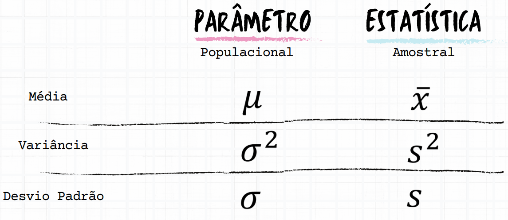
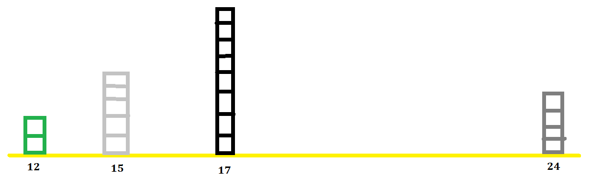
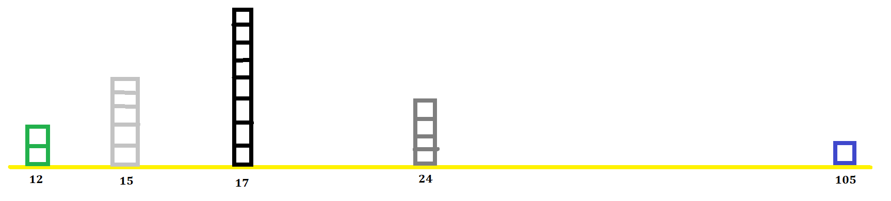
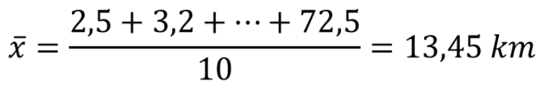
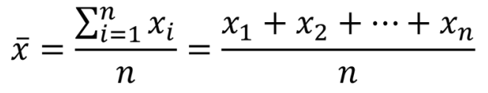
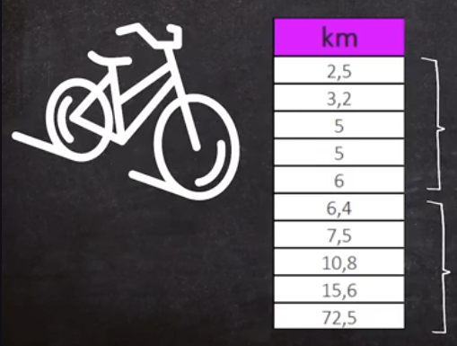
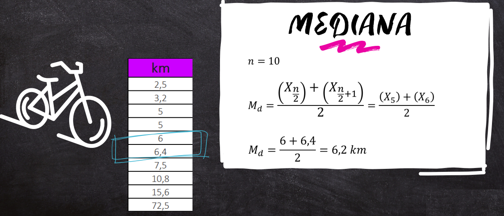
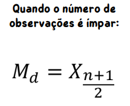

# Estatística

## Conteúdo

 - **Fundamentos:**
   - `Ninguém cria nada se não tiver um problema (Profa. Adriana Silva).`
   - [`Qual a diferença de um Modelo (equação) Deterministico vs. Estatístico?`](#deterministic-vs-statistic-model)
   - [`Defina (com exemplos) o que são dados, observações, variáveis e contexto?`](#data-observation-variable-context)
   - [`Popoulação vs. Amostra`](#population-vs-sample)
   - [`Parâmetro vs. Estatística`](#parameter-vs-statistic)
 - **Medidas de Posição:**
   - [Média](#intro-to-mean)
   - [Mediana](#intro-to-median)
 - [**REFERÊNCIAS**](#ref)
<!---
[WHITESPACE RULES]
- Same topic = "10" Whitespace character.
- Different topic = "200" Whitespace character.
--->


<!--- ( Fundamentos ) --->

---

<div id="deterministic-vs-statistic-model"></div>

## `Qual a diferença de um Modelo (equação) Deterministico vs. Estatístico?`

> **Você saberia me responder qual a diferença entre em um *Modelo (Equação) Determinístico* e um *Estatístico*?**

<details>

<summary>RESPOSTA</summary>

<br/>

Em resumo:

 - Um **Modelo (Equação) Determinístico** é *sempre a mesma coisa*, *não existe uma mudança*, *não existe uma variação*:
   - A minha equação é perfeita;
   - Onde acontecer muito isso? Na física:
     - "Se eu jogar uma pedrinha em uma posição x, quanto tempo ela levar para chegar no chão?"
     - Bem, se você souber o peso do objeto e a distância do projeto você consegue "determinar" o tempo.
     - **NOTE:** Ou seja, é sempre o mesmo modelo (equação) que sempre funciona sem variabilidade.
 - Um **Modelo (Equação) Estatístico** é aquele que por mais que eu queira eu não consigo ter uma equação precisa o tempo inteiro:
   - Vai ter momentos que nós vamos errar um pouco para cima; vai ter momento que nós vamos errar um pouco para baixo.
   - **NOTE:** Ou seja, um modelo (equação) estatístico é aquele que carrega um `erro`.

</details>


---

<div id="data-observation-variable-context"></div>

## `Defina (com exemplos) o que são dados, observações, variáveis e contexto?`

> **Qual a diferença entre *"dados"*, *"observações"*, *"variáveis"* e *"contexto"*?**

<details>

<summary>RESPOSTA</summary>

<br/>

Bem, em resumo:

 - **Dados:**
   - Os dados também conhecidos como *"Base de Dados"*, tem.
     - `Linhas:`
       - Linhas são os nossos `objetos de estudo` que nada mas são do que as nossas `observações`.
       - Por que `objeto de estudo`? Porque é aquele *"negócio"* que eu estou interessado em gerar alguma análise.
       - Que "negócio" é esse? Pode ser um indivíduo, um produto, pode ser qualquer coisa (vai depender do contexto).
     - `Colunas:`
       - São `informações` sobre os nossos `objeto de estudo`.
       - Isso é o que nós conhecemos na estatística/programação/matématica de `variáveis/atributos/features`.
 - **Observações:**
   - São as entidades a respeito das quais se coletam os dados *(objeto de estudo)*.
 - **Variáveis:**
   - Variáveis são aquilo que descrevem o nosso `objeto de estudo`.
 - **Contexto:**
   - É a `lógica desses dados`, sem isso você não consegue interpretar nada! Tudo é Contexto!

</details>


---

<div id="population-vs-sample"></div>

## `Popoulação vs. Amostra`

> **Qual a diferença entre *"população"* e *"amostra"*?**

<details>

<summary>RESPOSTA</summary>

<br/>

Bem, em resumo:

 - **Uma População:**
   - É o *"todo do seu estudo"*.
   - É o *"todo do seu problema"*.
   - É o *"todo do seu contexto"*.
   - EXEMPLO-01:
 - **Uma Amostra:**
   - É um *"pedaço desse todo"*.

Vejam a tabela abaixo para ficar mais claro:

| **Situação**                                                             | **População (conjunto total de interesse)**              | **Amostra (parte representativa da população)**               |
| ------------------------------------------------------------------------ | -------------------------------------------------------- | ------------------------------------------------------------- |
| 1️⃣ Pesquisa sobre hábitos alimentares de estudantes de uma universidade | Todos os estudantes matriculados na universidade         | 200 estudantes escolhidos aleatoriamente de diferentes cursos |
| 2️⃣ Estudo sobre a renda familiar em uma cidade                          | Todas as famílias residentes na cidade                   | 300 famílias selecionadas de forma aleatória por bairro       |
| 3️⃣ Avaliação do desempenho de alunos do ensino médio em matemática      | Todos os alunos do ensino médio de um estado             | 10 escolas sorteadas e todos os alunos dessas escolas         |
| 4️⃣ Pesquisa de satisfação de clientes de uma empresa                    | Todos os clientes que compraram na empresa no último ano | 500 clientes que responderam a um questionário online         |
| 5️⃣ Análise da produtividade de uma fábrica                              | Todos os funcionários da fábrica                         | 50 funcionários escolhidos de diferentes turnos de trabalho   |

#### 💡 Resumidamente

 - **População** → O todo que queremos estudar.
 - **Amostra** → Uma parte desse todo, usada quando não é viável estudar todos os elementos.

</details>


---

<div id="parameter-vs-statistic"></div>

## `Parâmetro vs. Estatística`

> **Qual a diferença entre *"parâmetro"* e *"estatística"*?**

<details>

<summary>RESPOSTA</summary>

<br/>

Em resumo:

 - **Parâmetro** → É uma medida usada para descrever uma característica da População.
 - **Estatística** → Vem de uma *amostra*.

#### 🎯 1️⃣ Conceito básico

| Termo           | Definição                                                                                                   | Onde se aplica |
| --------------- | ----------------------------------------------------------------------------------------------------------- | -------------- |
| **Parâmetro**   | É uma **medida numérica** que descreve uma **característica da população** (ou seja, do todo).              | População      |
| **Estatística** | É uma **medida numérica** que descreve uma **característica da amostra** (ou seja, da parte que estudamos). | Amostra        |

#### 📊 2️⃣ Exemplo prático

Imagine que queremos saber a média de altura dos estudantes de uma universidade:

| Situação                                                                | Tipo            | Descrição                                                                              |
| ----------------------------------------------------------------------- | --------------- | -------------------------------------------------------------------------------------- |
| A **média verdadeira da altura** de todos os estudantes da universidade | **Parâmetro**   | Representa o valor real da população (geralmente desconhecido, pois não medimos todos) |
| A **média de altura** dos 200 estudantes escolhidos aleatoriamente      | **Estatística** | É o valor calculado a partir da amostra — usado para **estimar o parâmetro**           |

🧠 3️⃣ Outros exemplos

| Exemplo                                                  | Parâmetro                             | Estatística                                           |
| -------------------------------------------------------- | ------------------------------------- | ----------------------------------------------------- |
| Percentual de eleitores que votariam em um candidato     | Percentual real de todos os eleitores | Percentual obtido em uma pesquisa com 1.000 eleitores |
| Média de renda mensal de todas as famílias de uma cidade | Média verdadeira da cidade            | Média calculada com base em 300 famílias pesquisadas  |
| Desvio padrão do peso de todos os alunos de uma escola   | Desvio padrão real (de toda a escola) | Desvio padrão dos 50 alunos medidos                   |

> **E como diferenciar um parâmetro de uma estatística em um estudo?**

É comum usarmos letras gregas para representar parâmetros e letras latinas para representar estatísticas:

  

</details>


<!--- ( Medidas de Posição ) --->

---

<div id="intro-to-mean"></div>

## Média

> **A Média nasce com uma missão de *"generalização"*.**  

**Como assim?**  
Bem, se você tiver que chutar algo (algum lugar), chute na média.

Para entendermos melhor, imagine que nós temos o `objeto de estudo`, *"estudantes"*, e estamos analisando a variável *"idades"* desses alunos em uma régua:

  

Vejam que os dados (variável "idade") estão um pouco distantes uns dos outros.

> **Então, por que eu deveria utilizar a média nesse caso?**  
> Porque a média é a única medida do mundo que tem a *"capacidade de equilibrar essa régua (dados)"*.

**Mas por que?**  
Imagine que entrou um aluno de 105 anos, vocês concordam que a régua aumentou?

  

 - Como esse dado (aluno de 105) está muito distante dos demais a *média* tem a capacidade de equilibrar essa régua.
 - Ou seja, a média é influenciada por todos os valores que estão em cima da régua.

> **E como eu posso usar isso na vida real?**

Bem, digamos que você tirou a média desses alunos, que foi 32 anos (é só um exemplo), então eu poderia dizer:

> **"Professora *"chuta"* essa idade e conta piada para alunos nessa faixa de idade"**.

**Agora vocês concordam que ela pode se sentir desconfortável com isso?**  
Então, quando ela se sentir desconfortável com isso é que surge a necessidade de outras medidas.

> **Isso porque a média tem um ponto de vista, que é o "equilíbrio" entre os dados.**

**Mas o equilíbrio nem sempre me diz que vai tomar a melhor decisão.**  
Ai que a gente começa a entender que não é só a média que resolver todos os nossos problemas.

> **Por exemplo, não é sua mãe que resolver todos os seus problemas.**  
> Não é porque ela é a "mãezona" que está perto de todos os filhos (dados) que ela vai resolver todos os seus problemas.

#### Exemplo 02

Agora, imagine que nós temos o estudo de um determinado número de ciclistas que percorrem uma distância (em quilometros) em x horas:

  

Vejam que na nossa `base de dados` acima:

 - Cada linha (objeto de estudo) representa um aluno.
 - E a coluna/variável/feature que nós coletamos foi a quilometragem que o aluno andou com a bicicleta em um determinado período de tempo:
   - Isso pode ser visto como o nosso `contexto de negócio`.

> **Mas, como eu calcularia a média de quilometragem que os alunos percorreram em x horas?**

Bem, nós somaríamos a quilometragem de todos os alunos e dividirmos pelo total de alunos:

  

Olhando para o cálculo acima e imaginando que os ciclista tinham 2h para percorrer (contexto), nós podemos dizer que em média esses cicclistas percorrem 13,45km em 2h.

> **Ela me diz quantos quílometros cada ciclista corre?**  
> NÃO!

A média é uma medida **"generalista"**, ela da uma visão do `equilíbrio` entre de tempo percorrido entre os ciclistas (dados).

> **NOTE:**  
> O equilíbrio não significa que é o melhor valor para todo mundo, mas é o melhor valor que você poderia dar se **"tivesse que chutar"** quantos quílometros os ciclistas iriam percorrer.

#### Fórmula da média

Por fim, a fórmula da `média` é a seguinte:




---

<div id="intro-to-median"></div>

## Mediana (Intro)

> Se a `média` é o **"ponto de equilíbrio"** da nossa régua quem poderia me ajudar a saber se esse ponto de equilíbrio está sendo *"puxado/influenciado"* por algum dos extremos?

A `mediana` quem pode nos ajudar a resolver esse problema e para isso, imagine que nós temos o estudo de um determinado número de ciclistas que percorrem uma distância (em quilometros) em x horas:

  

Vamos começar dividindo em 2 caixas (volumes) esses ciclistas:

  

Vejam que agora:

 - Primeiro, nós ordenamos os dados (esse passo já estava feito, senão teria que ser feito);
 - Segundo, dividimos em duas caixas (partes) de volume:
   - Os indivíduos que *menos conseguiram percorrer a distância* ficaram na primeira caixa (volume);
   - Os indivíduos que *mais conseguiram percorrer a distância* ficaram na segunda caixa (volume).

> **Mas qual a vantagem de dividir em 2 caixas (volumes)?**

Agora nós podemos:

 - Pegar o **maior valor** da primeira caixa;
 - Pegar o **menor valor** da segunda caixa;
 - Por fim, **tirar a media desses 2 valores**.

  

> **Mas o que isso significa?**

 - Significa, que *"metade dos nossos ciclista"* correram **ATÉ** 6,2 quílometros em x horas:
   - Primeira caixa (volume).
 - Outra metade, conseguiu correr **A PARTIR DE** 6,2 quílometros em x horas.
   - Segunda caixa (volume).

Agora pensem comigo:

 - Se usando a `média` nós tivemos 13,45 quílometros em x horas;
 - E usando a `mediana` tivemos 6,2 quílometros em x horas.

> **O que isso significa?**

 - Isso significa que nós temos algum valor *"puxando/influenciando"* a régua para a extremidade de "maior quilometragem":
   - Da mesma forma se a média fossse 2 ou 1 teria algum valor *"puxando/influenciando"* a extremidade de "menor quilometragem".
 - Ou seja, quando a média está muito longe da mediana que dizer que ela foi influenciada por uma das extremidades.  
 - Nesse, nosso caso ela foi influenciada pelo o valor extremo: *"72,5"*.

> **Com isso, qual o objetivo da mediana?**

O objetivo da `mediana` pode ser visto como:

 - Metade dos indivíduos VAI ATÉ ONDE?
 - A outra metade VAI A PARTIR DE ONDE?
 - **NOTE:** Por fim, alguma das extremidades está *"puxando/influenciando"* a `média`?

Só para fim de análise sobre a `mediana` tenha o seguinte em mente:

 - O valor da `mediana` vai ser sempre o **ponto central** da nossa `base de dados`.
 - Se tem alguma extremidade *"puxando/influenciando"* a `média` você quem vai ter que analisar (identificar).

#### E se o número de linhas (objeto de estudos) for ímpar?

Bem, nesse caso nós utilizamos a seguinte fórmula:

  

> **NOTE:**  
> Vejam que nesse caso o número do meio (ponto central) que vai representar a mediana. Nós não precisamos tirar a média do maior valor da primeira caixa (volume) pelo menor valor da segunda caixa (volume).


<!--- ( REFERÊNCIA ) --->

---

<div id="ref"></div>

## REFERÊNCIA

 - **Cursos:**
   - [Licenciatura - Matemática](https://www.faculdadeunica.com.br/graduacao/ead/matematica-3080)
   - [Entendendo Estatística Divertidamente](https://lp.asn.rocks/eed-a)

---

**Rodrigo** **L**eite da **S**ilva - **rodrigols89**

<details>

<summary></summary>

<br/>

RESPOSTA

```bash

```

  

</details>
