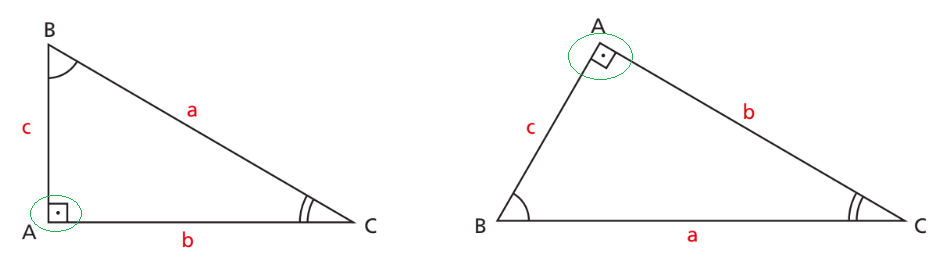
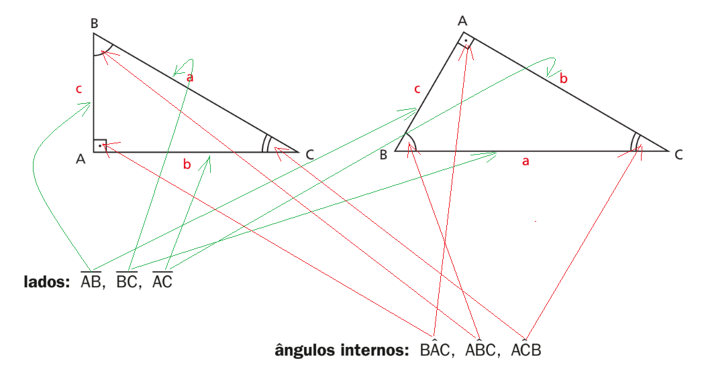
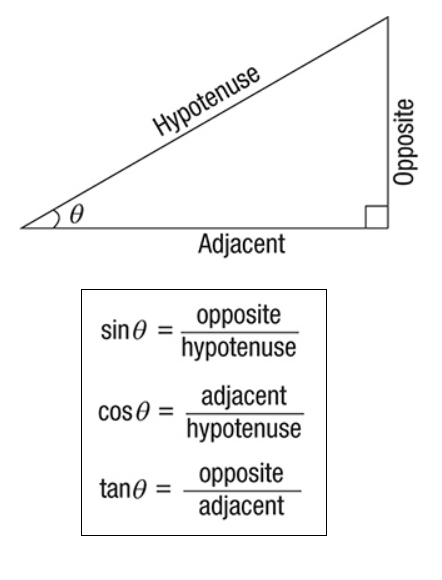
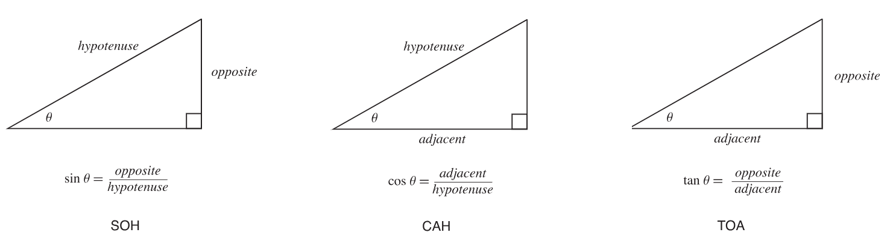
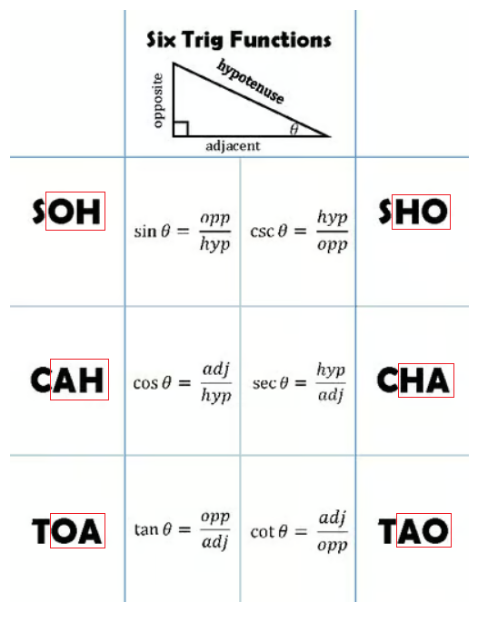

# Trigonometria

## Conteúdo

 - **Fundamentos:**
   - [`Quando um Triângulo é considerado um Triângulo Retângulo?`](#triangulo-retangulo)
   - [`Como identificar os lados e ângulos internos de um triângulo?`](#lados-e-angulos-internos)
   - [`Qual a fórmula (razão) do Seno, Cosseno e Tangente?`](#soh-cah-toa)
   - [`Qual a fórmula (razão) da Secante, Cossecante e Cotangente?`](#sho-cha-tao)
 - [**REFERÊNCIA**](#ref)
<!--- ( Questões Abertas ) --->
<!--- ( Questões do ENEM ) --->
<!--- ( Questões de Concurso ) --->
<!---
[WHITESPACE RULES]
- Same topic = "10" Whitespace character.
- Different topic = "200" Whitespace character.
--->


<!--- ( Fundamentos ) --->

---

<div id="triangulo-retangulo"></div>

## `Quando um Triângulo é considerado um Triângulo Retângulo?`

> **Quando um Triângulo é considerado um Triângulo Retângulo?**

<details>

<summary>RESPOSTA</summary>

<br/>

> Sabemos que um *triângulo* é *retângulo* quando **um de seus ângulos internos é reto (90º)**.

  

</details>


---

<div id="lados-e-angulos-internos"></div>

## `Como identificar os lados e ângulos internos de um triângulo?`

> **Como identificar os lados e ângulos internos de um triângulo?**

<details>

<summary>RESPOSTA</summary>

<br/>

  

> **NOTE:**  
> Sobre os ângulos internos, por exemplo $B\widehat{A}C$, $B$ e $C$ são as semirretas e $\widehat{A}$ o vértice, ou ângulo.

</details>


---

<div id="soh-cah-toa"></div>

## `Qual a fórmula (razão) do Seno, Cosseno e Tangente?`

> **Qual a fórmula (razão) do *Seno*, *Cosseno* e *Tangente*?**

<details>

<summary>RESPOSTA</summary>

<br/>

As razões trigonométricas de *Seno*, *Cosseno* e *Tangente* são:

  

- **Seno(θ):**  
  - Se temos o `lado oposto` e a `hipotenusa`, usamos **seno(θ)**.  
- **Cosseno(θ):**  
  - Se temos o `lado adjacente` e a `hipotenusa`, usamos **cosseno(θ)**.  
- **Tangente(θ):**  
  - Se temos o `lado oposto` e o `lado adjacente`, usamos **tangente(θ)**.  

> **OK, mas como lembrar das fórmulas?**

Para lembrar o **Seno(θ), Cosseno(θ) e Tangente(θ)**, a abordagem mais comum é relacionar essas fórmulas com **"SOH"**, **"CAH"** e **"TOA"**.

Por exemplo, veja a imagem abaixo para entender de forma mais fácil:

  

</details>


---

<div id="sho-cha-tao"></div>

## `Qual a fórmula (razão) da Secante, Cossecante e Cotangente?`

> **Qual a fórmula (razão) da *Secante*, *Cossecante* e *Cotangente*?**

<details>

<summary>RESPOSTA</summary>

<br/>

> **NOTE:**  
> As razões trigonométricas da *Secante*, *Cossecante* e *Cotangente* são o inverso das razões trigonométricas de *Seno*, *Cosseno* e *Tangente*, respectivamente.

Sabendo disso, nós podemos utilizar o inverso do **SOH**, **CAH**, **TOA** para referenciar as razões de *Secante*, *Cossecante* e *Cotangente*:

  

</details>


<!--- ( REFERÊNCIA ) --->

---

<div id="ref"></div>

## REFERÊNCIA

 - **Cursos:**
   - [Licenciatura - Matemática](https://www.faculdadeunica.com.br/graduacao/ead/matematica-3080)

---

**Rodrigo** **L**eite da **S**ilva - **rodrigols89**

<details>

<summary></summary>

<br/>

RESPOSTA

```bash

```

  

</details>
