# Trigonometria

## Contents

 - **Pré-Requisitos:**
   - [**Retas (Linhas)**](#intro-to-retas)
     - [Semirretas](#intro-to-semirretas)
     - [Segmento de Reta](#intro-to-segmento-da-reta)
   - [**Raios**](#intro-to-raios)
   - **Ângulos:**
   - **Circulos:**
   - **Radianos:**
   - **Triângulos:**
 - **História e Fundamentos:**
 - [**Configurações**](#settings)
 - [**REFERÊNCIAS**](#ref)
<!---
[WHITESPACE RULES]
- Same topic = "20" Whitespace character.
- Different topic = "100" Whitespace character.
--->


<!--- ( Pré-Requisitos ) --->

---

<div id="intro-to-retas"></div>

## Retas (Linha)

 - Uma **"reta (linha)"** é um conjunto infinito de pontos que se estende infinitamente em ambas as direções.
 - Um **"reta (linha)"** não possui começo nem fim;

Tendo em vista que as **retas (linhas) possuem infinitos pontos**, conclui-se que elas também possuem comprimento infinito.

Por exemplo:

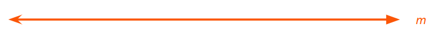  

> **NOTE:**  
> No exemplo acima, caso prosseguíssemos desenhando a *"reta m"* em qualquer de suas direções, jamais terminaríamos, pois a reta é infinita.

---

<div id="intro-to-semirretas"></div>

## Semirreta

Para entender o que são **semirretas** melhor vamos parti do ponto que temos a seguinte **reta m**:

  

a partir dessa **reta m**, vamos determinar dois pontos, **"P"** e **"Q"**, em sua extensão:

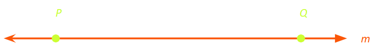  

Se considerarmos a parte **m** que tem uma origem em **"P"** e passa por **"Q"**, teremos uma *semirreta*, que indicaremo assim:

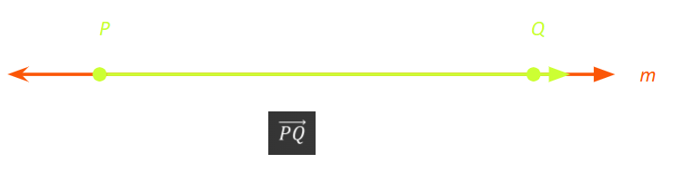  

Vejam que, denotamos a semirreta de origem em **"P"** que passa pelo ponto **"Q"** com duas letras *maiúsculas* e uma *pequena seta acima*.

> **Essa semirreta termina no ponto *"Q"*?**  
> Não, ela passa pelo ponto **Q**.

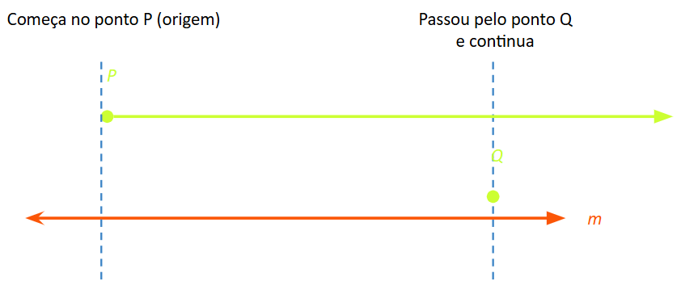  

---

<div id="intro-to-segmento-da-reta"></div>

## Segmento de Reta

Para entender o que é **Segmento de Reta** melhor vamos parti do ponto que temos a seguinte **reta m**:

  

Agora, vamos marcar alguns pontos nessa reta:

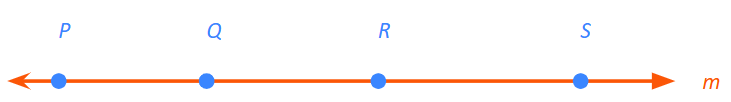  

Agora, vamos traçar um caminho entre os pontos **"P"** e **"Q"**:

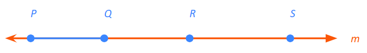  

Continuando, vamos separar esse caminho da reta:

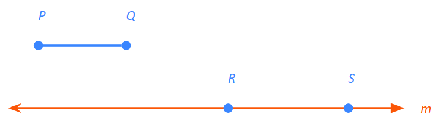  

Vamos fazer o mesmo com os pontos **"R"** e **"S"**:

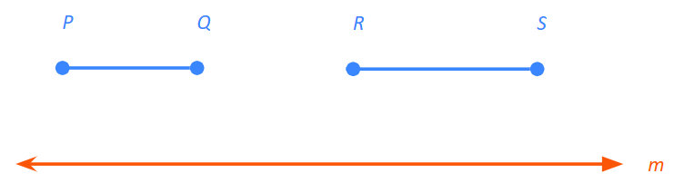  

> **Então, qual a diferença de "Semirreta" e "Segmento de reta"?**

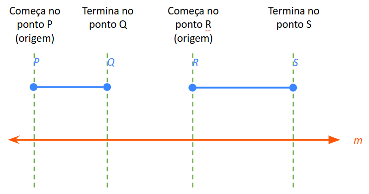  

 - Esses **"pedaços da reta m"**, é que nós conhecemos como **"segmentos de reta"**.
 - **NOTE:** Isso porque eles tem **"início"** e **"fim"**.

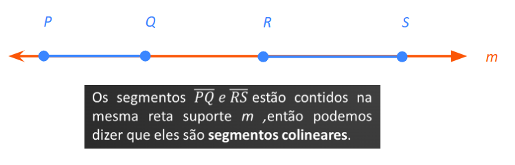  

> **NOTE:**  
> Vejam que nós também denotamos um *Segmento de reta* com letras maiúsculas, porém, agora utilizamos apenas uma **barra em cima das letras** ao *inves de uma seta*.


---

<div id="intro-to-raios"></div>

## Raios

> Um **"raio"** é a parte de uma reta (linha) que tem um ponto inicial (origem) e se estende infinitamente na direção oposta - **Como uma semirreta**.

Por exemplo:

  

Os **Raios** também podem ser exibidos dentro de uma linha:

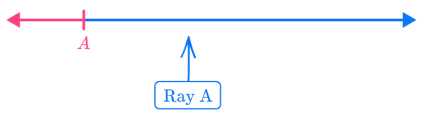  

**NOTE:**  
Quando dois **raios** *compartilham um ponto inicial (de origem) comum*, eles formam um ângulo:

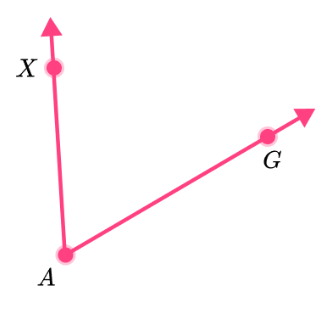  


<!--- ( Configurações ) --->

---

<div id="settings"></div>

## Configurações

**CRIANDO O AMBIENTE VIRTUAL:**
```bash
python -m venv environment
```

**ATIVANDO O AMBIENTE VIRTUAL (LINUX):**
```bash
source environment/bin/activate
```

**ATIVANDO O AMBIENTE VIRTUAL (WINDOWS):**
```bash
source environment/Scripts/activate
```

**UPDATE PIP:**
```bash
python -m pip install --upgrade pip
```

**INSTALANDO AS DEPENDÊNCIAS:**  
```bash
pip install -U -v --require-virtualenv -r requirements.txt
```

**SALVANDO NOVAS DEPENDEÊNCIAS (OU ATUALIZAÇÕES):**
```bash
pip freeze > requirements.txt --require-virtualenv
```

**Agora, seja feliz!!!** 😬


<!--- ( REFERENCES ) --->

---

<div id="ref"></div>

## REFERÊNCIAS

 - **Geral:**
   - [ChatGPT](https://chat.openai.com/)
   - [Grok](https://grok.com/)
 - **Pré-Requisitos:**
   - **Retas (Linhas):**
     - [O que é reta?](https://brasilescola.uol.com.br/o-que-e/matematica/o-que-e-reta.htm)
     - [Semirreta](https://www.todamateria.com.br/semirreta/)
   - **Raios:**
     - [Ray math](https://thirdspacelearning.com/us/math-resources/topic-guides/geometry/ray-math/)
   - **Ângulos:**
   - **Circulos:**
   - **Radianos:**
   - **Triângulos:**

---

**Rodrigo** **L**eite da **S**ilva - **rodrigols89**
