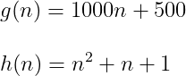
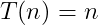

# Design and Analysis of Algorithms

## Contents

 - **Asymptotic Analysis:**
   - [Intro to Asymptotic Analysis (+Example)](#intro-to-aa)
   - [Understanding Asymptotic Behavior (+Example)](#aab)
 - **[Notations] - Big O (O), Omega (Ω), and Theta (Θ):** Describe the asymptotic behavior of a function relative to another function
   - [Big (O) ( Worst-Case | Upper Bound | The "maximum" number of statements is run! )](#big-o-notation)
   - [Omega (Ω) ( Best Case | Lower Bound | The "minimum" number of statements is run! )](#omega-notation)
   - [Theta (Θ) ( Average Case | Average Bound | The "average" number of statements is run! )](#theta-notation)
 - **Tips & Tricks:**
   - **Counts of operations (statements/instructions):**
     - [Intro to statements (simple) counting (+Example)](#intro-to-statements-counting)
 - [**References**](#ref)

<!--- ( Asymptotic Analysis ) -->

---

<div id="intro-to-aa"></div>

## Intro to Asymptotic Analysis (+Example)

> **Given two algorithms for the same task, how do we find out which one is better?**

One naive way of doing this is – to implement both the algorithms and run the two programs on your computer for different inputs and see which one takes less time. There are many problems with this approach for the analysis of algorithms.

For example:

 - It might be possible that for **some inputs**, **the first algorithm performs better than the second**:
   - And for **some inputs second performs better**.
 - It might also be possible that for **some inputs**, **the first algorithm performs better on one *machine***:
   - And **the second works better on another *machine*** for *some other inputs*.

Asymptotic Analysis is the big idea that handles the above issues in analyzing algorithms:

 - **[ENG] -** In Asymptotic Analysis, we **evaluate the performance of an algorithm in terms of input size** (we don’t measure the actual running time). We calculate, how the time (or space) taken by an algorithm increases with the input size.
 - **[PT-BR] -** Na Análise Assintótica, **avaliamos o desempenho de um algoritmo em termos de tamanho de entrada** (não medimos o tempo real de execução). Calculamos como o tempo (ou espaço) gasto por um algoritmo aumenta com o tamanho da entrada. 

For example, let us consider the **search problem (searching a given item)** in a sorted array:

  

The solution to above search problem includes:

 - **Linear Search** (order of growth is linear).
 - **Binary Search** (order of growth is logarithmic).

To understand how **Asymptotic Analysis** solves the problems mentioned above in analyzing algorithms, let us say:

 - We run the **Linear Search** on a **fast computer A**.
 - And **Binary Search** on a **slow computer B**.
 - Pick the *constant values* for the two computers so that it tells us exactly how long it takes for the given machine to perform the search in seconds.

Now, let’s say the constant for **computer A** is **0.2** and the constant for **computer B** is **1000**.

> **NOTE:**  
> Which means that **computer A** is **5000** times more powerful than **computer B**.

 - For **small values** of **input array size n**, the *fast computer (computer A)* may take less time.
 - But, **after a certain value of input array size, the Binary Search will definitely start taking less time compared to the Linear Search even though the Binary Search is being run on a slow machine**.

For example, see the table below comparing the search algorithms:

| Input Size    | Running time on computer A | Running time on computer B |
|---------------|----------------------------|----------------------------|
| 10	          | 2 sec                      | ~ 1 h                      |
| 100	          | 20 sec                     | ~ 1.8 h                    |
| 10<sup>6<sup> | ~ 55.5 h                   | ~ 5.5 h                    |
| 10<sup>9<sup>	| ~ 6.3 years                | ~ 8.3 h                    |

**NOTE:**  
See that from **n (input size) >= 10<sup>6<sup>** the **algorithm A (Linear Search)** will always take more time compared **algorithm B (Binary Search)**.

 - The reason is the **order of growth of Binary Search** with respect to input size is **logarithmic**.
 - While the **order of growth of Linear Search** is **linear**.

> **NOTE:**  
> So the machine-dependent **constants can always be ignored** after a certain value of input size.

Running times for this example:

 - **Linear Search:**
   - **Running time in seconds on computer A:** 0.2 * n.
 - **Binary Search:**
   - **Running time in seconds on computer B:** 1000*log(n).

> **Does Asymptotic Analysis always work?**  
> Asymptotic Analysis is not perfect, but that’s the best way available for analyzing algorithms.

**NOTE:**  
For example, say there are two sorting algorithms that take **1000nLogn** and **2nLogn** time respectively on a machine. Both of these algorithms are asymptotically the same **(order of growth is nLogn)**. So, With Asymptotic Analysis, we can’t judge which one is better as we ignore constants in Asymptotic Analysis.

---

<div id="aab"></div>

## Understanding Asymptotic Behavior (+Example)

Knowing that discarding all constant terms and maintaining only the highest growth, we obtain the **Asymptotic behavior**.

> **Asymptotic behavior is the behavior of a function *T(n)* when *"n"* tends to infinity.**

This happens (acontece) because the term that has the largest exponent dominates the behavior of the function **T(n)** when **"n"** tends to infinity.

To understand better, consider the following functions (algorithms):



Although (embora/apesar) the function **g(n)** has higher constants multiplying *(1000 and 500)* your terms, exist a value to **"n"** where the function (algorithms) **h(n)** will always greater than the **g(n)** function.

For example, let's test some **"n"** values to the functions **g(n)** and **h(n)**:

 - **n = 10**
   - g(n): 10.500
   - h(n): 111
 - **n = 100**
   - g(n): 100.500
   - h(n): 10.101
 - **n = 1.000**
   - g(n): 1.000.500
   - h(n): 1.001.001
 - **n = 1.500**
   - g(n): 1.500.500
   - h(n): 2.251.501
 - **n = 2.000**
   - g(n): 2.000.500
   - h(n): 4.002.001
 - **n = 2.500**
   - g(n): 2.500.500
   - h(n): 6.252.501
 - **n = 3.000**
   - g(n): 3.000.500
   - h(n): 9.003.001
 - **n = 3.500**
   - g(n): 3.500.500
   - h(n): 12.253.501
 - **n = 4.000**
   - g(n): 4.000.500
   - h(n): 16.004.001
 - **n = 4.500**
   - g(n): 4.500.500
   - h(n): 20.254.501
 - **n = 5.000**
   - g(n): 5.000.500
   - h(n): 25.005.001
 - **n = 5.500**
   - g(n): 5.500.500
   - h(n): 30.255.501
 - **n = 6.000**
   - g(n): 6.000.500
   - h(n): 36.006.001
 - **n = 6.500**
   - g(n): 6.500.500
   - h(n): 42.256.501
 - **n = 7.000**
   - g(n): 7.000.500
   - h(n): 49.007.001
 - **n = 7.500**
   - g(n): 7.500.500
   - h(n): 56.257.501
 - **n = 8.000**
   - g(n): 8.000.500
   - h(n): 64.008.001
 - **n = 8.500**
   - g(n): 8.500.500
   - h(n): 72.258.501
 - **n = 9.000**
   - g(n): 9.000.500
   - h(n): 81.009.001
 - **n = 9.500**
   - g(n): 9.500.500
   - h(n): 90.259.501
 - **n = 10.000**
   - g(n): 10.000.500
   - h(n): 100.010.001

See that for **n => 1500** the function (algorithm) **h(n)** will always be greater than the function (algorithm) **g(n)**.

> **NOTE:**
> - That is, the asymptotic behavior focuses on the largest term of a function (algorithm) because this term will describe the behavior of the function (algorithm).
> - We say that the function **h(n)** is **n<sup>2</sup>**.

See another functions and your **asymptotic behavior**:

  

**NOTE:**  
Note that the focus is always the largest term of the function.


<!--- ( Notations ) -->

---

<div id="big-o-notation"></div>

## Big (O) ( Worst-Case | Upper Bound | The "maximum" number of statements is run! )

 - **Worst Case Analysis (Mostly used):**
   - In the **Worst-Case Analysis (Big (O))**, **we calculate the upper bound on the running time of an algorithm**.
   - We must know (devemos conhecer) **the case that causes a maximum number of operations to be executed**.
   - For example, *Linear Search Algorithm*, in the **Worst Case (Big (O)) happens when the element to be searched (x) is not present in the array**:
     - When x is not present, the search() function compares it with all the elements of arr[] one by one.
     - Therefore, the worst-case time complexity of the linear search would be **O(n)**.

> **That's, the maximum number of statements is run!**

---

<div id="omega-notation"></div>

## Omega (Ω) ( Best Case | Lower Bound | The "minimum" number of statements is run! )

 - **Best Case Analysis (Very rarely used)**
   - In the **Best-Case Analysis (Omega (Ω))**, **we calculate the lower bound on the running time of an algorithm**.
   - We must know (devemos conhecer) **the case that causes a minimum number of operations to be executed**.
   - For example, in the *Linear Search Algorithm problem*, the best case occurs when x is present at the first location:
     - The number of operations in the best case is constant (not dependent on n).
     - So time complexity in the best case would be **Ω(1)**.

> **That's, the minimum number of statements is run!**

---

<div id="theta-notation"></div>

## Theta (Θ) ( Average Case | Average Bound | The "average" number of statements is run! )

 - **Average Case Analysis (Rarely used):**
   - In **Average Case Analysis (Theta (Θ))**, **we take all possible inputs and calculate the computing time for all of the inputs**.
   - **Sum all the calculated values** and **divide the sum by the total number of inputs**.
   - We must know (devemos conhece or predict) the distribution of cases.
   - For example, in the *Linear Search problem*, let us assume that all cases are [uniformly distributed](https://en.wikipedia.org/wiki/Discrete_uniform_distribution) (including the case of x not being present in the array).
   - So we sum all the cases and divide the sum by (n+1).
   - Following is the value of Average-Case time complexity.


<!--- ( Tips & Tricks/Counts of operations ) -->

---

<div id="intro-to-statements-counting"></div>

## Intro to statements (simple) counting (+Example)

To analyze an Algorithm we need to count how many statements the Algorithm run. Knowing this, let's start counting **simple statements**:

> **A simple statement is a statement that can be run directly by the CPU or something close to that (ou algo parecido)..**

 - **Statements types:**
   - Assign a value to a variable.
   - Access the value (element) of the determined array.
   - Compare arrays.
   - Increment a value.
   - Arithmetic operations:
     - Add
     - Sub
     - Div
     - Mult
 - **Let's assume that:**
   - The statements have the same cost.
   - The selections command has zero (0) cost.

For example, imagine we have an Algorithm that receives an **array "A"** with **"n"** elements and stores the higher element in **"M"** variable:

```cpp
01 int M = A[0];
02 for(int i = 0; i < n; i++)
03     if (A[i] >= M)
04         M = A[i];
```

Now, let's count how many **simple statements** the Algorithm above runs:

**LINE 01 = 1 statement to assign the value zero (0) to the "M" variable**
```cpp
                                Cost:     Times:
01 int M = A[0];                c1        1
02 for(int i = 0; i < n; i++)
03     if (A[i] >= M)
04         M = A[i];
```

**NOTE:**  
In the **LINE 02** we had the following statements to be *INITIALIZE* the **for(**) statement:

 - **Cost to INITIALIZE the for() statements is 2:**
   - The **for()** statements need be initialized:
     - **int i = 0:** 1 statements.
   - **EN -** And same that the **Array A** have size zero (0) at least (ao menos) one comparison will be run:
   - **PT -** E mesmo que o **Array A** tenha tamanho zero (0) pelo menos uma comparação será executada:
     - **i < n**; That's, another statement (+1).
```cpp
                                Cost:     Times:
01 int M = A[0];                c1        1
02 for(int i = 0; i < n; i++)   c2        2
03     if (A[i] >= M)
04         M = A[i];
```

**NOTE:**  
Ok, now we know the cost to *INITIALIZE* the **for()** statement, but what is the cost to *RUN* the **for()** statement?

 - **Cost to RUN the for() statements is 2n:**
   - At the end (ao final) of each iteration of the *for() loop*, we need:
     - Increment:
       - **i++**
     - And an statements to compare if the loop will continue:
       - **i < n**
   - The loop will be run **"n"** time, that is, the **2 statements** above will be run **"n"** times:
     - **+ 2n (statements)**.

```cpp
                                Cost:     Times:
01 int M = A[0];                c1        1
02 for(int i = 0; i < n; i++)   c2        2 + 2n
03     if (A[i] >= M)
04         M = A[i];
```

**NOTE:**  
Ignoring commands inside **for()** statement, the algorithm has **3 + 2n** statements.

 - **3** statements before *RUN* the **for()** statements.
 - **2** Statement at the end of each **for()** loop, which will be executed **"n"** times.

Thus (assim), considering an *empty loop (for)*, we can define a mathematical function that represents the cost of the Algorithm in relation to the size of the input array, like:

  

> - **EN -** Ok, but what about the statements inside the **for() loop** how do we count?
> - **PT -** Ok, mas e as instruções dentro do **loop for()** como contamos?


 - The **if()** statement has 1 comparison statement: **(A[i] >= M)**;
 - And inside the **if()** we have 1 more assignment statement: **M = A[i]**.

```cpp
                                     Cost:     Times:
01 int M = A[0];                     c1        1
02 for(int i = 0; i < n; i++)        c2        2 + 2n
03     if (A[i] >= M)                c3        1 (How many times?)
04         M = A[i];                 c4        1 (How many times?)
```

> **PROBLEM:**  
> Well, now we have a little problem, how many times these statements be executed?

 - Statements seen previously were always executed:
   - **for() loop** statements.
 - However, the statements inside **for() loop** may or may not be executed:
   - [PT] - No entanto, as instruções dentro do *loop for()* podem ou não ser executadas.

That's, before it was enough to know (antes bastava saber o tamanho do array) the size of the array **A ("n")** to define the cost function **T(n)**. Now, we also need to consider the contents of the array.

For example, look at the two arrays below:


```cpp
01 A1 = [1, 2, 3, 4]
02 A2 = [4, 3, 2, 1]
```

 - **The *array "A1"* will have more statements because:**
   - The **if()** `will always be true`:
   - Will always have a value (element) greater than another to the algorithm get.
   - That's because array **A1** is in *ascending order*.
 - **The *array "A2"* array will have less statements because:**
   - The **if()** `will always be false`:
   - How the array **A2** is in **descending order** never will have a value (element) greater than first. That is, the **if()** will always be false.

**When analyzing an Algorithm, it is very common to consider the *Worst Case possible*:**  
**EN -** The **"Worst Case"** is when the Algorithm executes as many statements as possible.  
**PT -** O **"Pior Caso"** é quando o Algoritmo executa o maior número possível de instruções.  

In our Algorithm (finding the greatest value (element) in an array) **Worst Case** occurs when the **array A** is in `ascending order`:

**INPUT:**  
```cpp
A = [1, 2, 3, 4]
```

**Algorithms cost:**  
```cpp
                                     Cost:     Times:
01 int M = A[0];                     c1        1
02 for(int i = 0; i < n; i++)        c2        2 + 2n
03     if (A[i] >= M)                c3        1 (always executed)
04         M = A[i];                 c4        1 (always executed)
```

 - The value of **"M"** is always substituted;
 - And the **for() loop** always executes the 2 inside statements **"n"** times.

Thus (assim), the cost function of the Algorithm will be:

  

**NOTE:**  
This function represents the cost of the Algorithm in relation to the size of the array **A ("n")** in the **"Worst case"**.

> **Are all terms of the *cost function* of an Algorithm necessary?**

For example, see the *Algorithm* and *cost function (worst-case)* below:

```cpp
                                     Cost:     Times:
01 int M = A[0];                     c1        1
02 for(int i = 0; i < n; i++)        c2        2 + 2n
03     if (A[i] >= M)                c3        1
04         M = A[i];                 c4        1
```

  

In fact, not all terms are necessary. We can drop certain terms in the *Cost Function* and keep only the ones that tell us what happens to the function when the input data size **("n")** grows too large.

> **NOTE:**  
> If an Algorithm is faster than another for a large set of input data, it is very likely that it will continue to be faster on a smaller data set as well *(But it's not certain, it's just likely / mas não é certo, é apenas provável)*.

Okay, now we know that not all terms are crucial, let's drop the terms that grow slowly and keep only the ones that grow faster as the *input ("n")* value gets bigger.

For example, our Cost Function **T(n) = 4n + 3** has **2 terms**:

 - **4n**
 - **3**

The **"3"** term are **initialization constants** and do not change as the *input ("n")* increases. So our Cost Function can be reduced to:

  

Another observation is that *constants that multiply* the **"n"** term of the *Cost Function* must also be discarded. This makes sense if we think about different programming languages.

For example, look at the following line of code in **Pascal Programming Language**:

```pascal
M := A[i];
```

Is equivalent to the following code in **C Programming Language**:

```c
if(i >= 0 && i < n)
    M = A[i];
```

Ignoring these multiplication constants is equivalent to ignoring the particularities of each language and analyzing only the idea of the Algorithm.

So (então), our *Cost Function* can be reduced again to:

  


<!--- ( References ) -->

---

<div id="ref"></div>

## References

 - [[ED] Aula 101 - Análise de Algoritmos - Comportamento Assintótico](https://www.youtube.com/watch?v=SClFMUpBiaw&list=PL8iN9FQ7_jt6buW7SBD3yzjIp8NnJYrZl&index=3)
 - [How to Analyse Loops for Complexity Analysis of Algorithms](https://www.geeksforgeeks.org/analysis-of-algorithms-set-4-analysis-of-loops/)
 - [Worst, Average and Best Case Analysis of Algorithms](https://www.geeksforgeeks.org/worst-average-and-best-case-analysis-of-algorithms/)
 - [Time Complexity Analysis](https://log2base2.com/courses/time-complexity-analysis)

---

Ro**drigo** **L**eite da **S**ilva - **drigols**
