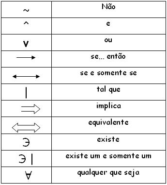
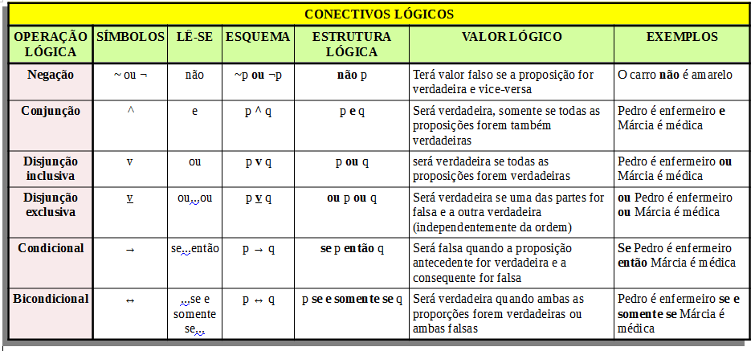
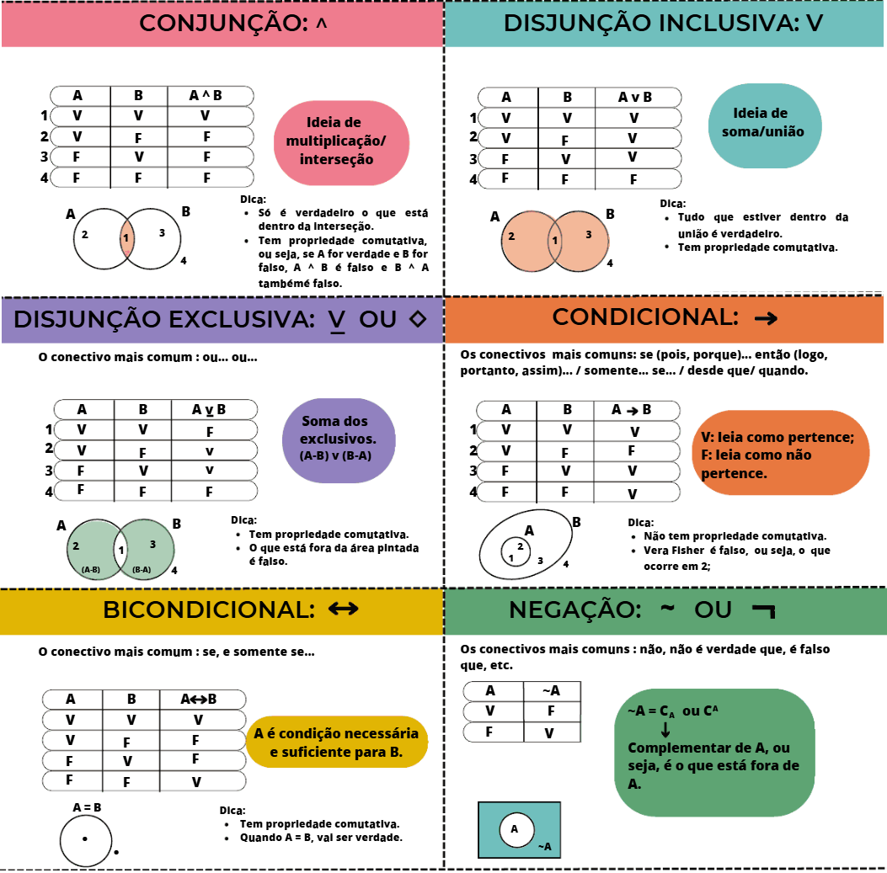

# Lógica Matemática

## Conteúdo

 - [**Conectivos lógicos:**](#logical-connectives)
   - [Tabela-verdade](#truth-table)
   - [Criando tabela-verdade com árvore matemática](#creating-truth-tables-with-trees)
   - [Tautologia & Contradição](#tautology-and-contradiction)
 - **Questões abertas (livros, tutoriais):**
   - [`A ∨ B' ⇒ (A ∨ B)'`](#qal-01)
   - [`(A ∨ A') ⇒ (B ∧ B')`](#qal-02)
   - [`[(A ∧ B') ⇒ C']'`](#qal-03)
 - **Questões de Concurso:**
   - **Fáceis:**
   - **Médias:**
   - **Dificeis:**
 - [**REFERÊNCIA**](#ref)
<!---
[WHITESPACE RULES]
- Same topic = "10" Whitespace character.
- Different topic = "100" Whitespace character.
--->


<!--- ( Conectivos lógicos ) --->

---

<div id="logical-connectives"></div>

## Conectivos lógicos

Os conectivos lógicos da matemática são os seguintes:

  

Porém, para construção de tabelas-verdade os mais comuns são esses:

  


---

<div id="truth-table"></div>

## Tabela-verdade

Agora vamos ver quais são as tabelas-verdade para os conectivos lógicos:

  


---

<div id="creating-truth-tables-with-trees"></div>

## Criando tabela-verdade com árvore matemática

> Uma maneira interessante é criar uma tabela-verdade é utilizando o conceito de *"árvore matemática"*.

Por exemplo, vamos criar uma *tabela-verdade* para 2 letras de preposição utilizando o conceito de árvore matemática:

```bash
                   nº de letras     nº de
                   proposição       possibilidades (linhas)
       •          
     /   \        
    V     F        2¹               2
   / \   / \
  V   F  V  F      2²               4
```

**Exemplo:** 1 letra de proposição:
| A |
|---|
| V |
| F |

**Exemplo:** 2 letras de proposição:
| A | B |
|---|---|
| V | V |
| V | F |
| F | V |
| F | F |

**NOTE:**  
Como podem ver a fórmula para calcular o número de possibilidades (linhas) com base no número de letras de preposição é a seguinte: **2<sup>n</sup>** , sendo **“n”** o número de letras de preposição.

> **E se a preposição tiver 3 letras?**

```bash
                              nº de letras     nº de
                              proposição       possibilidades (linhas)
            •   
       /        \
      V           F           2¹               2
    /   \       /   \
   V     F     V      F       2²               4
  / \   / \   / \    / \
 V   F  V  F  V  F   V  F     2³               8
```

**Exemplo:** 3 letras de proposição:
| A | B | C |
|---|---|---|
| V | V | V |
| V | V | F |
| V | F | V |
| V | F | F |
| F | V | V |
| F | V | F |
| F | F | V |
| F | F | F |


---

<div id="tautology-and-contradiction"></div>

## Tautologia & Contradição

### Tautologia

> Uma **Tautologia** é *intrinsecamente verdadeira* pela sua estrutura; ela é verdadeira independentemente dos valores lógicos atribuídos às suas letras de proposição.

Um exemplo mais simples de uma tautologia é `A ∨ A' (disjunção)`:

| A | A' | A ∨ A' |
|---|----|--------|
| V | F  | V      |
| F | V  | V      |

### Contradição

> Em contrapartida, uma **Contradição** é *intrinsecamente falsa* pela sua própria estrutura.

Um exemplo mais simples de uma contradição é `A ∧ A' (conjunção)`:

| A | A' | A ∧ A' |
|---|----|--------|
| V | F  | F      |
| F | V  | F      |


<!--- ( Questões abertas (livros, tutoriais)  ) --->

---

<div id="qal-01"></div>

## `A ∨ B' ⇒ (A ∨ B)'`

Qual a tabela-verdade para a seguinte *fórmula bem formada (fbf)*: `A ∨ B' ⇒ (A ∨ B)'`

<details>
<summary>RESPOSTA</summary>

<br/>

| A | B | B' | A ∨ B' | (A ∨ B) | (A ∨ B)' | A ∨ B' ⇒ (A ∨ B)' |
|:-:|:-:|:--:|:------:|:-------:|:--------:|:-----------------:|
| V | V | F  | V      | V       | F        | F                 |
| V | F | V  | V      | V       | F        | F                 |
| F | V | F  | F      | V       | F        | V                 |
| F | F | V  | V      | F       | V        | V                 |

</details>


---

<div id="qal-02"></div>

## `(A ∨ A') ⇒ (B ∧ B')`

Qual a tabela-verdade para a seguinte fórmula bem formada (fbf): `(A ∨ A') ⇒ (B ∧ B')`

<details>

<summary>RESPOSTA</summary>

<br/>

| A | B | A' | B' | A ∨ A' | B ∧ B' | (A ∨ A') ⇒ (B ∧ B') |
|:-:|:-:|:--:|:--:|:------:|:------:|:-------------------:|
| V | V |  F |  F |   V    |   F    |          F          |
| V | F |  F |  V |   V    |   F    |          F          |
| F | V |  V |  F |   V    |   F    |          F          |
| F | F |  V |  V |   V    |   F    |          F          |

</details>


---

<div id="qal-03"></div>

## `[(A ∧ B') ⇒ C']'`

Qual a tabela-verdade para a seguinte fórmula bem formada (fbf): `[(A ∧ B') ⇒ C']'`

<details>

<summary>RESPOSTA</summary>

<br/>

| A | B | C | B' | (A ∧ B') | C' | (A ∧ B') → C' | [(A ∧ B') ⇒ C']'  |
|:-:|:-:|:-:|:--:|:--------:|:--:|:-------------:|:-----------------:|
| V | V | V | F  | F        | F  | V             | F                 |
| V | V | F | F  | F        | V  | V             | F                 |
| V | F | V | V  | V        | F  | F             | V                 |
| V | F | F | V  | V        | V  | V             | F                 |
| F | V | V | F  | F        | F  | V             | F                 |
| F | V | F | F  | F        | V  | V             | F                 |
| F | F | V | V  | F        | F  | V             | F                 |
| F | F | F | V  | F        | V  | V             | F                 |

</details>


<!--- ( Questões abertas (livros, tutoriais)  ) --->

---

<div id="qcf-01"></div>

## 3312948 CEBRASPE (CESPE) - 2025 - Analista Administrativo (ANM)/Administração

Considerando a proposição **P: “Não prometo que você voltará, e, se voltar, não será o mesmo.”**, julgue o item seguinte, em relação a aspectos da lógica sentencial dessa proposição.

A tabela-verdade referente à proposição P possui mais de 15 linhas.

 - Certo
 - Errado

<details>

<summary>RESPOSTA</summary>

<br/>

Primeiro vamos identificar quais (quantas) proposições simples tem a sentença:

 - (¬a) "Não prometo que você voltará";
 - (b) "e, se voltar";
 - (¬c) "não será o mesmo".

Logo, nós teremos a seguinte proposição composta:

```bash
¬a ∧ (b → ¬c)
```

> **NOTE:**  
> Porém, a questão que saber se "A tabela-verdade referente à proposição P possui mais de 15 linhas".

Sabendo que nós temos 3 proposições simples e a formula para calcular o número de linhas de uma tabela-verdade é dada por **2<sup>n</sup>**, sendo **“n”** o número de proposições simples, temos:

```bash
2³ = 8
```

Ou seja, a resposta correta seria **"Errado"**, pois nossa tabela-verdade não terá mais 15 linhas.

</details>


---


<!--- ( REFERÊNCIA ) --->

---

<div id="ref"></div>

## REFERÊNCIA

 - **Cursos:**
   - [Licenciatura - Matemática](https://www.faculdadeunica.com.br/graduacao/ead/matematica-3080)
 - **Livros:**
   - [Fundamentos Matemáticos Para a Ciência da Computação](https://www.amazon.com.br/Fundamentos-Matem%C3%A1ticos-Para-Ci%C3%AAncia-Computa%C3%A7%C3%A3o/dp/8521614225)

---

**Rodrigo** **L**eite da **S**ilva - **rodrigols89**
