# Equations

## Contents

 - **Fundamentals:**
   - [Opposite of a number](#opposite-number)
   - [Inverse of a number](#inverse-number)
   - [Introduction to Equations (Equality)](#introduction-to-equations)
   - [Understanding equations equality](#understanding-equations-equality)
 - [**First-Degree Eequations:**](#intro-to-fde)
 - [**Second-Degree Equations (Quadratic Equations):**](#intro-to-sde)
   - [Quadratic Formula (Bhaskara)](#quadratic-formula)
   - [Complete Second-Degree Equation](#complete-sde)
   - [Incomplete Second-Degree Equation](#incomplete-sde)
   - **Questions:**
     - [4x<sup>2</sup> - 8x - 32 = 0](#question-01)
 - [**Exponential Equations (a<sup>x</sup> = b):**](#exponential-equations)
   - [The inverse of the Exponential = Logarithm](#exponential-to-logarithms)
 - [**References**](#ref)
<!--- 
[WHITESPACE RULES]
- Same topic = "5" Whitespace character.
- Different topic = "50" Whitespace character.
--->


<!--- ( Fundamentals ) --->

---

<div id="opposite-number"></div>

## Opposite of a number

> To understand *"equations"* we first need to understand the **"opposite of a number"**.

For example:

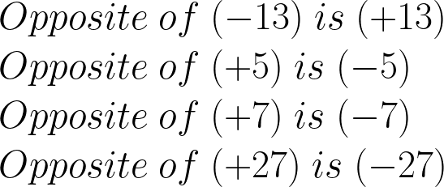
<!---
\\Opposite \ of \ (-13) \ is \ (+13)
\\Opposite \ of \ (+5) \ is \ (-5)
\\Opposite \ of \ (+7) \ is \ (-7)
\\Opposite \ of \ (+27) \ is \ (-27)
--->

**NOTE:**  
Another thing is that the **"sum of a number"** and **"its opposite"** **"is always zero"**.

For example:

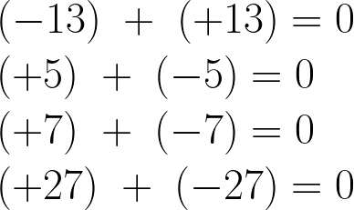  
<!---
\\(-13) \ + \ (+13) = 0
\\(+5) \ + \ (-5) = 0
\\(+7) \ + \ (-7) = 0
\\(+27) \ + \ (-27) = 0
--->


---

<div id="inverse-number"></div>

## Inverse of a number

> To understand *"equations"* we first need to understand the **"inverse of a number"**.

For example:

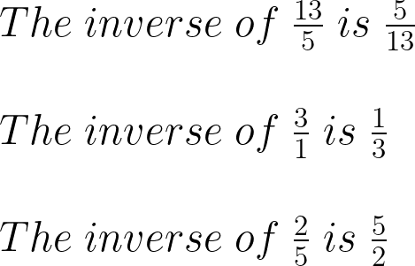
<!---
\\The \ inverse \ of \ \frac{13}{5} \ is \ \frac{5}{13}
\\The \ inverse \ of \ \frac{3}{1}\ is \ \frac{1}{3}
\\The \ inverse \ of \ \frac{2}{5} \ is \ \frac{5}{2}
--->

**NOTE:**  
Another thing is that the **"multiplication of a number"** and **"its inverse"** **"is always 1"**.

For example:

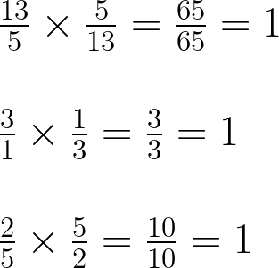
<!---
\\\frac{13}{5} \times \frac{5}{13} = \frac{65}{65} = 1
\\
\\\frac{3}{1} \times \frac{1}{3} = \frac{3}{3} = 1
\\
\\\frac{2}{5} \times \frac{5}{2} = \frac{10}{10} = 1
---->


---

<div id="introduction-to-equations"></div>

### Introduction to Equations (Equality)

> We always talk about **"equations"**, we talk about **"Equality (igualdade)"**.

For example:

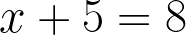  
<!---
x + 5 = 8
--->

In the example above:

 - *we are stating (estamos afirmando)* that `x + 5` is *"equal"* to `8`.
 - **NOTE:** And we need to know the value of `x` to solve the equation.

> **Ok, how do we can isolate *"x"*?**
> Well, we can add the number 5 and its opposite to make it zero.

Something like this:

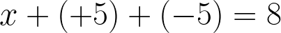  
<!---
\\x + (+5) + (-5) = 8
--->

**NOTE:**  
Before removing the number 5 from the equality (igualdade) think with me... If **"x + 5"** is *"equal"* to **8**, then if I remove 5 from one side I need to remove 5 from the other side.

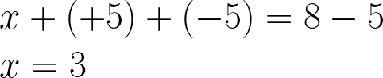  
<!---
\\x + (+5) + (-5) = 8 - 5
\\x = 3
--->

> **NOTE:**  
> See that we apply **(-5)** to both sides of the equality (igualdade).


---

<div id="understanding-equations-equality"></div>

## Understanding equations equality

To make it clearer that equations are about *equalities (igualdades)*, imagine that we have the following equation:

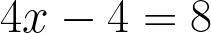  
<!---
\\4x - 4 = 8
--->

Knowing that **"4x - 4"** is equal to **"8"** we can divide both sides by 4 (since they are equal):

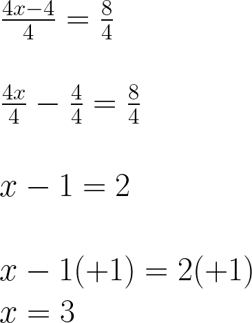  
<!---
\\\frac{4x - 4 }{4} = \frac{8}{4}
\\
\\\frac{4x}{4} - \frac{4}{4} = \frac{8}{4}
\\
\\x - 1 = 2
\\
\\x - 1 (+1) = 2 (+1)
\\x = 3
--->


<!--- ( First-Degree Eequations ) --->

---

<div id="intro-to-fde"></div>

## First-Degree Eequations

> A **First-Degree Equation** is an *equation* where the *"largest exponent of the unknown (icógnita)"* is *equal* to *"1"*.

For example:

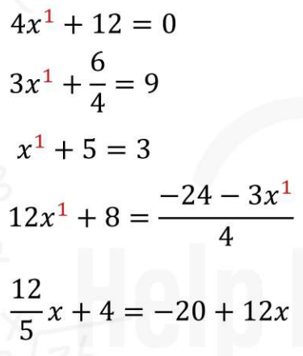  

> **NOTE:**  
> Remember that, if there is nothing in the exponent, it is because the exponent is equal to *"1"*.


<!--- ( Second-Degree Equations ) --->

---

<div id="intro-to-sde"></div>

## Second-Degree Equations (Quadratic Equations)

> A **Second-Degree Equation (Quadratic Equation)** is an equation where the *"largest exponent of the unknown (icógnita)"* is equal to *"2"*.

**NOTE:**  
A **Second-Degree Equation (Quadratic Equation)** can have the terms **"a"**, **"b"**, and **"c"** in the equation, where:

 - **"a"** is the term that multiplies the **x<sup>2</sup> (or x squared)**.
 - **"b"** is the term that multiplies the **x<sup>1</sup>**.
 - **"c"** is the term that stands alone.

For example:

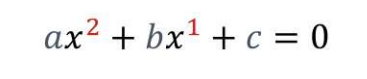  


---

<div id="quadratic-formula"></div>

## Quadratic Formula (Bhaskara)

> **NOTE:**  
> In Brazil this formula is known as "Bhaskara's Formula".

The most common approach to solving a **Second-Degree Equation (Quadratic Equation)** is to use the `Quadratic Formula (Bhaskara)`.

**Quadratic Formula (Bhaskara):**  

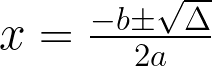  
<!---
x = \frac{-b \pm \sqrt{\Delta}}{2a}
--->

Where **"Δ (Delta)"** is:

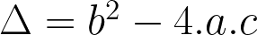  
<!---
\Delta = b^{2}-4.a.c
--->

 - If `Δ > 0`, there are two real and distinct solutions.
 - If `Δ = 0`, there is one real solution (two equal).
 - If `Δ < 0`, there are no real solutions (only complex solutions).


---

<div id="complete-sde"></div>

## Complete Second-Degree Equation

> A **Second-Degree Equation (Quadratic Equation)** is `complete` when it has the 3 terms **"a"**, **"b"**, **"c"** in the *equation*.

For example:

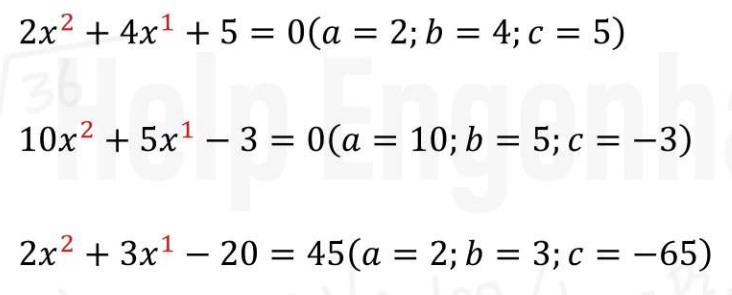  


---

<div id="incomplete-sde"></div>

## Incomplete Second-Degree Equation

> A **Second-Degree Equation (Quadratic Equation)**  is `incomplete` when the term **"b"** or **"c"** is `missing` from the *equation*.

For example:

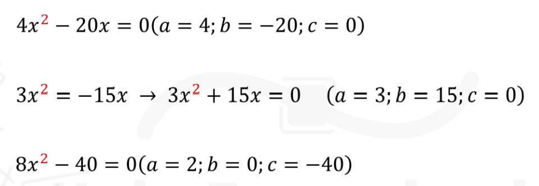

> **NOTE:**  
> When an equation is `missing a term b or c` we say that term is **"0"**.


---

<div id="question-01"></div>

## 4x<sup>2</sup> - 8x - 32 = 0

Imagine we have the following **Second-Degree Equation (Quadratic Equation)**:

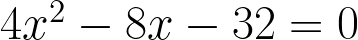  
<!---
4x^{2} - 8x - 32 = 0
--->

**Now, think with me... How can I make this equation more easy?**  
Well, we can simplify this equation by dividing the two sides by the same number.

For example 4:

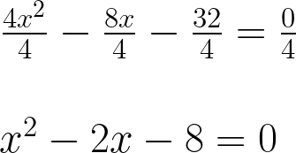  
<!---
\\\frac{4x^{2}}{4} - \frac{8x}{4} - \frac{32}{4} = \frac{0}{4}
\\
\\x^{2} - 2x - 8 = 0
--->

> **Did you see that now we have an equation with terms that are easier to work with?**

Continuing... Now let's define the values ​​of the terms a, b, and c:

```bash
a = 1 (When the variable is alone, it is 1)
b = -2
c = -8
```

Continuing... Now let's solve **"Δ (Delta)"**:

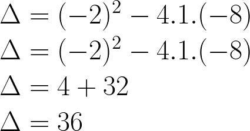  
<!---
\Delta = b^{2}-4.a.c
--->

Ok, now let's put the values of **"Δ (Delta)"** in the formula:

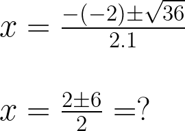  
<!---
\\x = \frac{-(-2) \pm \sqrt{36}}{2.1}
\\
\\x = \frac{2 \pm \sqrt{6}}{2}
--->

From here we will have two results:

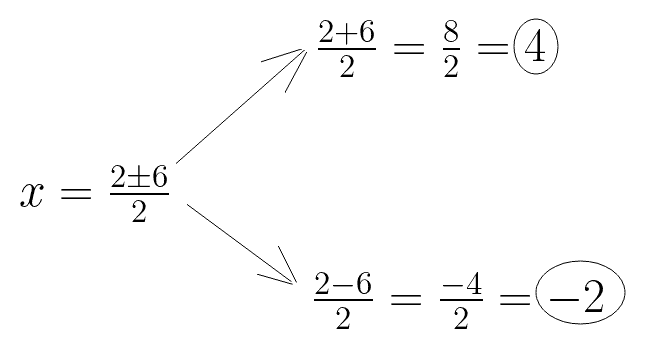  
<!---
\\\frac{2 + 6}{2} = \frac{8}{2} = 4
\\
\\x = \frac{2 \pm 6}{2}
\\
\\\frac{2 - 6}{2} = \frac{-4}{2} = -2
--->

Knowing this, the solutions of the equation **"4x<sup>2</sup> - 8x - 32 = 0"** are **"x = 4"** and **"x = -2"**.


<!--- ( Exponential Equations ) --->

---

<div id="exponential-equations"></div>

## Exponential Equations (a<sup>x</sup> = b)

> An equation is exponential when it has at least one unknown in the exponent.

For example:

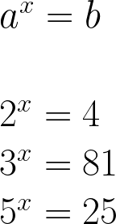  
<!---
\\a^{x} = b
\\
\\2^{x} = 4
\\3^{x} = 81
\\5^{x} = 25
--->

### Example-01

Now, imagine we have the following **Exponential Equation**:

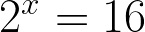  
<!---
\\2^{x} = 16
--->

**NOTE:**  
Knowing that **2<sup>x</sup>** is *"equal"* to **16**, we can apply some math to both sides to find **"x"** more easily.

> **What math can we apply?**  

For example, we can apply the `logarithm of the same base` to `both sides of the equation`:

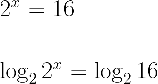  
<!---
\\2^{x} = 16
\\
\\\log_{2}2^{x} = \log_{2}16
--->

Now, we can apply the **"Power Rule"** to make **"x"** descend from the *exponent* and finally find the value of **"x"**:

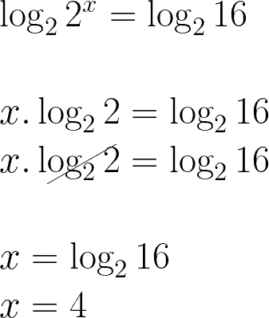  
<!---
\\\log_{2}2^{x} = \log_{2}16
\\
\\x.\log_{2}2 = \log_{2}16
\\x.\log_{2}2 = \log_{2}16
\\
\\x = \log_{2}16
\\x = 4
--->


---

<div id="exponential-to-logarithms"></div>

## The inverse of the Exponential = Logarithm

Now think with me... If I'm looking for a value in the `exponent` I'm talking about `logarithms`.

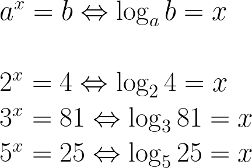  
<!---
\\a^{x} = b \Leftrightarrow \log_{a} b = x
\\
\\2^{x} = 4 \Leftrightarrow \log_{2} 4 = x
\\3^{x} = 81 \Leftrightarrow \log_{3} 81 = x
\\5^{x} = 25 \Leftrightarrow \log_{5} 25 = x
--->

### Example-01

For example, imagine we have the following **Exponential Equation**:

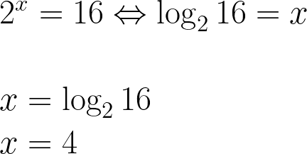  
<!---
\\2^{x} = 16 \Leftrightarrow \log_{2} 16 = x
\\
\\x = \log_{2} 16
\\x = 4
--->


<!--- ( References ) --->

---

<div id="ref"></div>

## References

 - [What is a quadratic equation?](https://uniskills.library.curtin.edu.au/numeracy/algebra/quadratic-equations/)
 - [Help Engenharia](https://helpengenharia.com/)

---

**Rodrigo** **L**eite da **S**ilva
