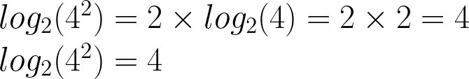
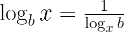

# Logarithms

## Contents

 - **Fundamentals:**
   - [Intro to Logarithms (Increase)](#intro-to-logarithms)
   - [Reading Logarithms](#reading-logarithm)
   - [Understanding "Natural Logarithm" |  loge(x) ⇔ ln(x)](#understanding-ln-x)
 - **Properties of Logarithms:**
   - [Product Property | logb(xy) = logb(x) + logb(y)](#product-property)
   - [Quotient Property | logb(x/y) = logb(x) - logb(y)](#quotient-property)
   - [Power Rule | logb(xy) = y * logb(x)](#power-rule)
   - [Change of Base Rule | logb(x) = loga(x)/loga(b)](#change-of-base-rule)
   - [Reciprocal Rule | logb(x) = 1/logx(y)](#reciprocal-rule)
 - [**References**](#ref)
<!--- 
[WHITESPACE RULES]
- Same topic = "10" Whitespace character.
- Different topic = "50" Whitespace character.
--->

<!--- ( Fundamentals ) --->

---

## Intro to Logarithms (Growth)

> **Logarithms mean *"Growth"*.**  
> What's?

This is because whenever (or almost always) I have a problem involving `logarithms`, that problem is about the `growth of something`.

For example:

 - Growth of bacteria.
 - Growth of interest rates.
 - Growth of population.
 - Growth of a virus.
 - **NOTE:** For example: *"How long do I need to invest my wealth (patrimônio) to double it?"*

---

## Reading Logarithms

Imagine we have the following Logarithm:

  

We read as:

> **How many times do we need to grow (crescer) 2 to get to 8?**  
> 3 because, 2 x 2 x 2 = 8.

In other words, our Logarithm is 3:

  

---

## Understanding "Natural Logarithm" |  loge(x) ⇔ ln(x)

To understand the **ln(x)**, we first must understand the **loge(x)**.

> **But, what's "e"?**

 - In science, *several problems*, *several physical phenomena*, *several mathematical problems* arrive at a value of **"2.718281828459..."**.
 - So that scientists don't have to repeat this number every time, a constant was created to represent this number: **"e = 2.718281828459..."**

That's:

> **Knowing that, what's *"ln(x)"*?**

Several problems in science began (começaram) to result in **loge(x)**. In order to avoid repeating this logarithm every time, scientists decided to create a special logarithm for it: **"ln(x)"**.

That's:

  

> **NOTE:**  
> This logarithm is known as **"Natural Logarithm"**.

<!--- ( Properties of Logarithms ) --->

---

## Product Property | logb(xy) = logb(x) + logb(y)

The **"Product Property"** of *logarithms* is:

  

**EXAMPLE-01:**  

  
<!---
\\log_{2}(2\times8) = log_{2}(2) + log_{2}(8) = 1 + 3 = 4
\\log_{2}(2\times8) = 4
--->

---

## Quotient Property | logb(x/y) = logb(x) - logb(y)

The **"Quotient Property"** of *logarithms* is:

<!---
log_{b}(\frac{x}{y}) = log_{b}(x) - log_{b}(y)
--->

**EXAMPLE-01:**  

  
<!---
\\log_{2}(\frac{64}{4}) = log_{2}(64) - log_{2}(4) = 6 - 2 = 4
\\log_{2}(\frac{64}{4}) = 4
--->

---

## Power Rule | logb(xy) = y * logb(x)

The **"Power Rule"** of *logarithms* is:

  
<!---
log_{b}(x^{y}) = y \times log_{b}(x)
--->

**EXAMPLE-01:**  

  
<!---
\\log_{2}(4^{2}) = 2 \times log_{2}(4) = 2 \times 2 = 4
\\log_{2}(4^{2}) = 4 
--->

---

## Change of Base Rule | logb(x) = loga(x)/loga(b)

To understand the **"Change of Base Rule"** property, imagine we have the following logarithm to solve:

  
<!---
log_{8}(2)
--->

> **What?**  
> Yes, we have a problem!

To solve that problem we can use the **"Change of Base Rule"** property:

  
<!---
\log_b{x} = \frac{\log_a{x}}{\log_a{b}}
--->

Where:

 - The `numerator` is the *logarithm* of `x (logarithmizing)`.
 - The `denominator` is the *logarithm* of `b (base)`.

> **And the base "a"?**  
> The **base "a"** needs to solve the logarithm of the *numerator* and *denominator* simultaneously.

**EXAMPLE-01:**  

  
<!---
\\\log_8{2} = \frac{\log_?{2}}{\log_?{8}} = \frac{\log_2{2}}{\log_2{8}} = \frac{1}{3}
\\
\\\log_8{2} = \frac{1}{3}
--->

---

## Reciprocal Rule | logb(x) = 1/logx(y)

The **"Reciprocal Rule"** of *logarithms* is:

  
<!---
\log_b{x} = \frac{1}{\log_x{b}
--->

> **NOTE:**  
> See that, we *"change"* the *base* by the *logarithmizing*.

**EXAMPLE-01:**  

  
<!---
\log_2{10} = \frac{1}{\log_{10}{2}} = \frac{1}{0.3010} = \ \approx 3.3219
--->

---

## References

 - **Logarithms:**
   - [O que é logaritmo?](https://www.youtube.com/watch?v=_tX_rYVkRx8)
   - [ILS2.1 Logarithms](https://learninglab.rmit.edu.au/content/ils21-logarithms.html)
   - [Properties of Logarithms](https://byjus.com/maths/properties-of-logarithms/)

---

**Rodrigo** **L**eite da **S**ilva
