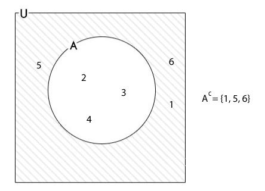

# Set Theory

## Contents

 - **Fundamentals of Set Theory:**
   - [Set Theory Symbols](#set-theory-symbols)
 - **Types of Set:**
   - [Empty Set](#empty-set)
   - [Singleton set](#singleton-set)
   - [Finite Set](#finite-set)
   - [Infinite set](#infinite-set)
   - [Power set](#power-set)
   - [Overlapping set](#overlapping-set)
   - [Universal set](#universal-set)
   - [Disjoint set](#disjoint-set)
 - **Set Operation:**
   - [Union of Sets](#union-of-set)
   - [Intersection of Sets](#intersection-of-sets)
   - [Difference of Sets](#difference-of-sets)
   - [Complement of Sets](#complement-of-sets)
   - [Cartesian Product of Sets](#cartesian-product-of-sets)


<!--- ( Fundamentals of Set Theory ) --->

---

<div id="set-theory-symbols"></div>

## Set Theory Symbols

**Relational symbols in Set Theory:**

| Symbol            | Name                     | Meaning/Definition       | Example                                                   |
|-------------------|--------------------------|--------------------------|-----------------------------------------------------------|
| **x ∈ A**         | x is an element of set A | Element is member of set | If A={12, 17, 18, 27}, then 27 ∈ A.                       |
| **x ∉ A**         | x is not an element of set A | Element not in set   | If B={c, d, g, h, 32, 54, 59}, then 18 ∉ B.               |
| **A = B**         | Equality Relation | Sets are equivalent           | If P={16, 22, a} and Q={16, 22, a}, then P = Q.           |
| **A ⊆ B**         | Subset           | A is subset of B              | If A={31, b} and B={a, b, 31, 54}, then A ⊆ B.           |
| **A ⊂ B**         | Proper Subset    | A is proper subset of B       | If A={24, c} and B={a, c, 24, 50}, then A ⊂ B.           |
| **A ⊄ B**         | Not a Subset     | A is not subset of B          | If A={67,52} and B={42,34,12}, then A ⊄ B.               |
| **A ⊇ B**         | Superset         | A is superset of B            | If A={14, 18, 26} and B={14, 18, 26}, then A ⊇ B.         |
| **A ⊃ B**         | Proper Superset  | A is proper superset of B     | If A={14, 18, 26, 42} and B={18, 26}, then A ⊃ B.        |
| **A ⊅ B**         | Not a Superset   | A is not superset of B        | If A={11, 12, 16} and B={11, 19}, then A ⊅ B.            |
| **∅ or Φ**        | Empty Set        | Set with no elements          | If {22, y} ∩ {33, a} = Ø.                                |
| **U**             | Universal Set    | Set containing all elements   | If A={a,b,c} and B={1,2,3,b,c}, then U={1,2,3,a,b,c}.    |
| **\|A\|, n(A), n{A}** | Cardinality of a Set | Number of elements in set | If A={17, 31, 45, 59, 62}, then \|A\|=5 (5 elements). |
| **P(X)**          | Power Set        | Set of all subsets of X       | If X={12, 16, 19}, then P(X)={{}, {12}, {16}, {19}, {12, 16}, {16, 19}, {12, 19}, {12, 16, 19}}. |

**Operator-based Symbols in Set Theory:**

| Symbol | Name                        | Meaning/Definition                                     | Example                                                                                                  |
|--------|-----------------------------|--------------------------------------------------------|----------------------------------------------------------------------------------------------------------|
| **A ∪ B** | Union of Sets               | Combines all components from provided sets             | If A={p, q, u, v, w} and B={r, s, x, y}, then A ∪ B = {p, q, u, v, w, r, s, x, y}                        |
| **A ∩ B**  | Intersection of Sets       | Includes common components of both sets               | If A={4, 8, a, b} and B={3, 8, c, b}, then A ∩ B = {8, b}                                                 |
| **X<sup>c</sup> or X<sup>’</sup>** | Complement of a set      | All elements not in the provided set                  | If A is universal set and A={3, 6, 8, 13, 15, 17, 18, 19, 22, 24} and B={13, 15, 17, 18, 19}, then X′ = A - B ⇒ X′ = {3, 6, 8, 22, 24}    |
| **A − B**  | Set Difference             | Contains items from one set not in another            | If A={12, 13, 15, 19} and B={13, 14, 15, 16, 17}, then A − B = {12, 19}                                   |
| **A × B**  | Cartesian Product of Sets  | Product of ordered components of sets                 | If A={4, 5, 6} and B={r}, then A × B = {(4, r), (5, r), (6, r)}                                            |
| **A ∆ B**  | Symmetric Difference       | (A − B) U (B − A) denotes symmetric difference       | If A={13, 19, 25, 28, 37} and B={13, 25, 55, 31}, then A ∆ B = {19, 28, 37, 55, 31}                       |

**Another useful set theory symbols are:**

| Symbol | Name                | Meaning/Definition                                 | Example                |
|--------|---------------------|----------------------------------------------------|------------------------|
| **{}** | Set                 | Brackets containing elements/numbers/alphabets     | {15, 22, c, d}         |
| **\|** | Such that (tal que) | Specifies what is contained within a set           | { q \| q > 6}          |
| **:**  | Such that (tal que) | Alternative symbol for "Such that"                 | {q : q > 6}            |
| **∃ or ∄** | **There exist** or **there doesn’t exist** | If set exists or does not exist | {q ∃ q > 6}    |


<!--- ( types of set ) --->


---

<div id="empty-set"></div>

## Empty Set

> A *set* that has no elements inside it is called an **"Empty Set"**.

**NOTE:**  
Empty *Sets* are also known as **"Null Sets"**.

> We can represent an empty set as Φ or {}.

---

<div id="singleton-set"></div>

## Singleton set

> A *set* that has only one element inside it is called a **"Singleton Set"**.

---

<div id="finite-set"></div>

## Finite Set

> A *set* that has a fixed or finite number of elements inside it is called a **"Finite Set"**.

**NOTE:**  
The number of elements present in a finite *set* is called the *Cardinal Number of a finite set*. It is given as **"n(A)"**.

---

<div id="infinite-set"></div>

## Infinite set

> A *set* that has an indefinite or infinite number of elements inside it is called a **"Finite Set"**.

For example:

```bash
A = {x : x is an even number l} then A = {2, 4, 6, 8……}
```

Here **A** has unlimited elements, hence (portanto) **A** is an **infinite set**.

---

<div id="power-set"></div>

## Power set

> A *set* that contains all the subsets as its element is called the **"Power Set"**.

For example:

```bash
if set A = {1, 3, 5}

Then its subsets are:
{Φ}, {1}, {2}, {3}, {1, 3}, {3, 5}, {1, 5} and {1, 3, 5}

Then its Power Set is given as:
P(A) = {{Φ}, {1}, {2}, {3}, {1, 3}, {3, 5}, {1, 5}, {1, 3, 5}}
```

**NOTE:**  
As we know the number of possible subsets for a finite *set* containing **"n"** elements is given by 2<sup>n</sup>.

> Then the number of elements in the power set is also 2<sup>n</sup>.

---

<div id="overlapping-set"></div>

## Overlapping set

> If *at least any (pelo menos qualquer)* one element of the two sets are the same then the two sets are said to be **"Overlapping Sets"**.

For example:

```bash
set A = {1, 2, 3}
set B = {3, 4, 5}
```

**NOTE:**  
See that **"3"** is the common element between **set A** and **set B** hence (portanto), **set A** and **set B** are **"Overlapping Sets"**.

---

<div id="universal-set"></div>

## Universal set

> The *set* that *"contains all the sets"* in it is called a **"Universal Set"**.

For example:

```bash
set A = {1, 2, 3}
set B = {4, 5}
set C = {6, 7}

Then Universal Set is given as U = {1, 2, 3, 4, 5, 6, 7}
```

---

<div id="disjoint-set"></div>

## Disjoint set

> If none of the elements between two *sets* are common then they are called the **"Disjoint Sets"**.

For example:

```bash
set A = {1, 2, 3}
set B = {4, 5, 6}
```

> **NOTE:**  
> Observe that there is no common element between **"set A"** and **"set B"** hence (portanto), **set A** and **B** are **"Disjoint Sets"**.


<!--- ( Set Operation ) --->

---

<div id="union-of-set"></div>

## Union of Sets

> **Union of Sets** basically refers to uniting two sets and writing their elements in a single set without repeating elements if common elements are present.

**NOTE:**  
The union of sets is given by **"A ∪ B"**.

For example:

```bash
set A = {2, 4}
set B = {4, 6}

Then A ∪ B = {2, 4} ∪ {4, 6} = {2, 4, 6}
```

The **"Union of Sets"** operation also can be used to represent mathematical or logical formulas:

 - **Mathematical approach:** `Union (∪)`
   - It can be compared to the addition operator **("+")**, where it combines elements from two sets into a single set without duplicating elements.
   - For example, if:
     - set **A = {1, 2, 3}**
     - set **B = {3, 4, 5}**
     - Then **A ∪ B = {1, 2, 3, 4, 5}**, just like **2 + 3 = 5**.
 - **Logical approach:** `Union (∪)`
   - It can be compared to the logical operator **"OR"**, where the union of two sets includes all elements from both sets.
   - For example, if:
     - set **A = {1, 2, 3}**
     - set **B = {3, 4, 5}**
     - Then **A ∪ B = {1, 2, 3, 4, 5}**, much like **A OR B is true if either set A or set B is true**.

---

<div id="intersection-of-sets"></div>

## Intersection of Sets

> **Intersection of sets** refers to finding the common elements between two sets.

**NOTE:**  
It is given by **"A ∩ B"**.

For example:

```bash
set A = {2, 4}
set B = {4, 6}

Then A ∩ B = {2, 4} ∩ {4, 6} = {4}.
```

The **"Intersection of Sets"** operation also can be used to represent mathematical or logical formulas:

 - **Mathematical approach:** `Intersection (∩)`
   - It can be compared to the subtraction operator **("-")**, where only elements common to both sets remain.
   - For example, if:
     - set **A = {1, 2, 3}**
     - set **B = {3, 4, 5}**
     - Then **A ∩ B = {3}**, just like **5 - 2 = 3**.
 - **Logical approach:** `Intersection (∩)`
   - It can be compared to the logical operator **"AND"**, where the intersection of two sets includes only the elements that are present in both sets.
   - For example, if:
     - set **A = {1, 2, 3}**
     - set **B = {3, 4, 5}**
     - Then **A ∩ B = {3}**, much like **A AND B is true only if both sets A and B are true**.

---

<div id="difference-of-sets"></div>

## Difference of Sets

> The difference of sets **"A"** and **"B"**, denoted as **"A - B"**, consists of all elements that are in **"A"** but not in **"B"**.

For example:

```bash
set A = {2, 4}
set B = {4, 6}

Then A – B = {2}
```

---

<div id="complement-of-sets"></div>

## Complement of Sets

> The complement of a set **"A"** with *respect to a universal set **U*** is the set of all elements in **"U"** that are not in **"A"**.

**NOTE:**  
It is denoted by `A’`.

For example:

  

---

<div id="cartesian-product-of-sets"></div>

## Cartesian Product of Sets

> A **Cartesian Product** of two sets is the set of all pairs of elements that are from the sets.

> **Cartesian Product of Sets** refers to the product between the elements of two sets in ordered pair.

**NOTE:**  
It is given as **"A ✕ B"**.

For example:

```bash
set A = {2, 4}
set B = {4, 6}

Then A ✕ B = {(2,4), (2,6), (4,4), (4,6)}.
```

See that:

 - We always multiply each element of the *first set (set A)* with every element of the *second set (set B)*.
 - The reverse does not happen. In other words, it multiplies the elements of the *second set (set B)* with those of the *first set (set A)*.


<!--- ( Settings ) --->

---

<div id="settings"></div>

## Settings

**CREATE VIRTUAL ENVIRONMENT:**  
```bash
python -m venv math-environment
```

**ACTIVATE THE VIRTUAL ENVIRONMENT (LINUX):**  
```bash
source math-environment/bin/activate
```

**ACTIVATE THE VIRTUAL ENVIRONMENT (WINDOWS):**  
```bash
source math-environment/Scripts/activate
```

**UPDATE PIP:**
```bash
python -m pip install --upgrade pip
```

**INSTALL PYTHON DEPENDENCIES:**  
```bash
pip install -U -v --require-virtualenv -r requirements.txt
```

**Now, Be Happy!!!** 😬


<!--- ( REFERENCES ) --->

---

<div id="ref"></div>

## REFERENCES

 - **General:**
   - [ChatGPT](https://chat.openai.com/chat)
   - [Gemini](https://gemini.google.com/app)
   - [ELEMENTS OF SET THEORY](https://docs.ufpr.br/~hoefel/ensino/CM304_CompleMat_PE3/livros/Enderton_Elements%20of%20set%20theory_%281977%29.pdf)
   - [Set Theory – Definition, Types of Sets, Symbols & Examples](https://www.geeksforgeeks.org/set-theory/)

---

Ro**drigo** **L**eite da **S**ilva - **drigols**
