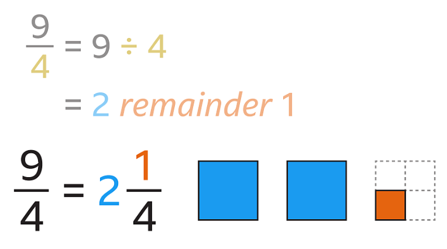
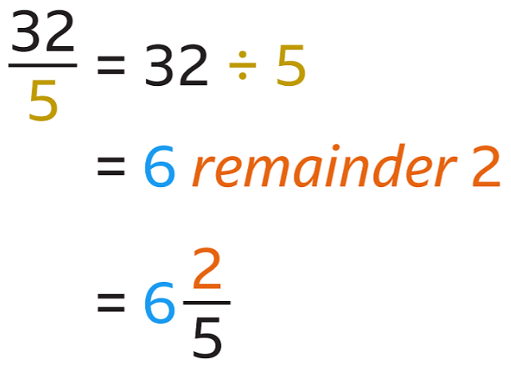
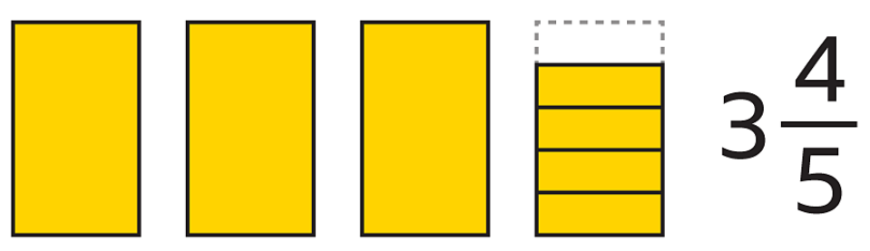
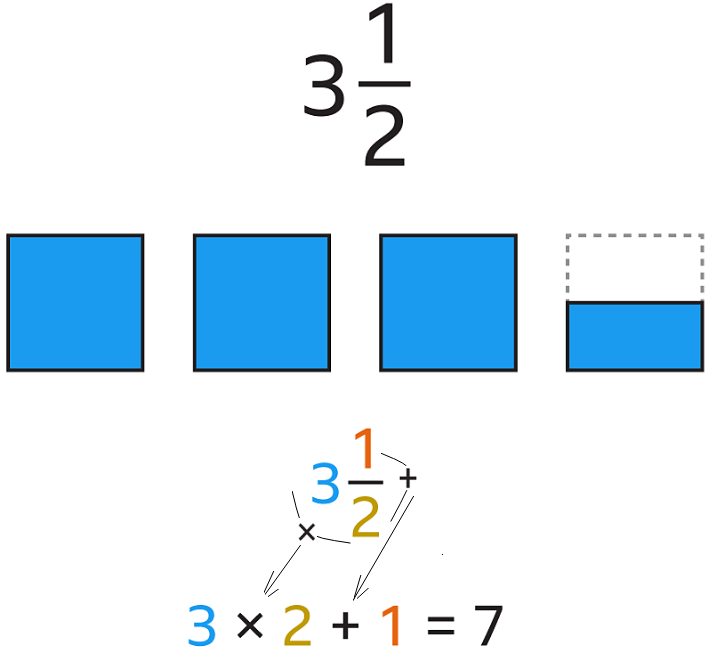
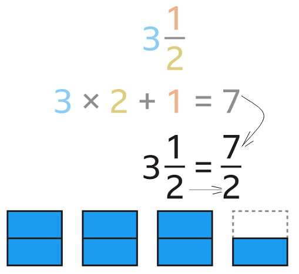
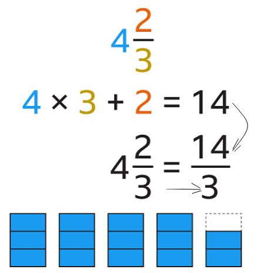
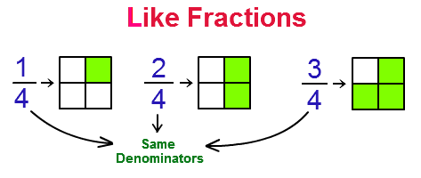
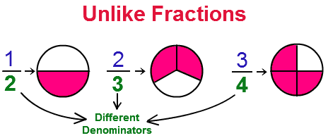
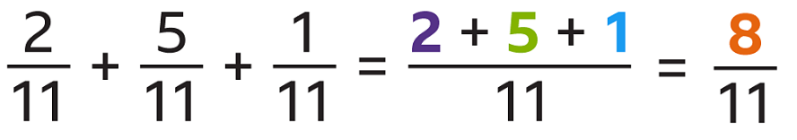

# Fractions

## Contents

 - **Types of Fractions:**
   - [Proper Fractions](#intro-to-proper-fractions)
   - [Improper Fractions](#intro-to-improper-fractions)
     - [How to convert an "Improper Fraction" to a "Mixed Fraction"](#convert-improper-to-mixed)
   - [Mixed Fractions](#intro-to-mixed-fractions)
     - [How to convert a "Mixed Fraction" to an "Improper Fraction"](#convert-mixed-to-improper)
 - **Like and Unlike Fractions:**
   - [Like Fractions](#intro-to-like-fractions)
   - [Unlike Fractions](#intro-to-unlike-fractions)
 - **Operations with Fractions:**
   - **Addition of Fractions:**
     - [Adding fractions with the same denominators (Like Fractions)](#add-like-fractions)
   - **Subtraction of Fractions:**
   - **Multiplication of Fractions:**
   - **Division of Fractions:**
 - Fractional numbers
 - Simplifying Fractions
 - [**References**](#ref)
<!--- 
[WHITESPACE RULES]
- Same topic = "5" Whitespace character.
- Different topic = "50" Whitespace character.
--->

<!--- ( Types of Fractions ) --->

---

## Proper Fractions

> A fraction is `proper` if the **numerator is "smaller than" the denominator**.

For example:

  

---

## Improper Fractions

> A fraction is `improper` if the **numerator is "greater than" the denominator**.

For example:

  

---

## How to convert an "Improper Fraction" to a "Mixed Fraction"

To convert an **"Improper Fraction"** to a **"Mixed Fraction"**, we need to:

 - Divide the numerator by the denominator.
 - The whole number is the integer part of the mixed number.
 - **NOTE:** The remainder is the numerator of the Mixed Fraction (new fraction).
 - **NOTE:** The denominator stays the same.

For example:

  

To finish, let's look at another simple example:

  

---

## Mixed Fractions

> A `Mixed Fraction` is a *combination* of **whole (todo)** and **part (parte)**.

For example:

  

---

## How to convert a "Mixed Fraction" to an "Improper Fraction"

To convert a **"Mixed Fraction"** to an **"Improper Fraction"**, we need to:

 - Multiply the integer by the denominator.
 - And add the numerator.

For example:

  

 - This gives the numerator of the Improper Fraction.
 - And the denominator stays the same.

  

To finish, let's look at another simple example:

  

<!--- ( Like and Unlike Fractions ) --->

---

## Like Fractions

> When we have two or more fractions with the *same denominator*, we call them `Like Fractions`.

For example:

---

## Unlike Fractions

> When we have two or more fractions with the *different denominators*, we call them `Unlike Fractions`.

<!--- ( Operations with Fractions ) --->

---

## Adding fractions with the same denominators (Like Fractions)

> To add two or more fractions with the *same denominators* we only **repeat the denominator** and **sum the numerators**.

For example:

  

<!--- ( References ) --->

---

## References

 - [Fractions: Operations and Properties](https://www.cuemath.com/learn/maths-olympiad-fractions-operations/)
 - [Types of Fractions](https://byjus.com/maths/types-of-fraction/)
 - [Mixed numbers, proper and improper fractions](https://www.bbc.co.uk/bitesize/topics/zsxhfg8/articles/zyxsf82)

---

**Rodrigo** **L**eite da **S**ilva
