# Trigonometry

> **Trigonometry is a branch of mathematics that studies the `relationships` between the `sides` and `angles` of a *"triangle"*.**  
> These *relationships* can be used to `find missing sides` or `angles` of a Triangle.

## Contents

 - **Fundamentals:**
   - [Angles can be represented as Greek Letters](#angles-greek-letters)
   - [The sum of all the angles of "any triangle" = 180 degrees (180°)](#tsaat)
   - [Right Triangle (Triângulo Retângulo) and their Components](#right-triangle)
   - [**Pythagorean Theorem (Find *"sides"* of a Right-Angled Triangle):**](#pythagorean-theorem)
     - [When is the "Pythagorean Theorem" useful?](#when-pt-useful)
     - [Find different sides of a Right-Angled Triangle](#fdsrat)
   - [Sine, Cosine, and Tangent Table: 0 to 360 degrees](images/sine-cosine-tangent-table.md)
 - [**Sine(θ) | SOH**](#intro-to-sine)
   - [Finding a missing side using sin(θ) ratio](#missing-side-sine)
   - [Finding a missing angle using sin-1(x)](#missing-angle-sine)
 - [**Cosine(θ) | CAH**](#intro-to-cosine)
   - [Finding a missing side using cos(θ) ratio](#missing-side-cosine)
   - [Finding a missing angle using cos-1(x)](#missing-angle-cosine)
 - [**Tangent(θ) | TOA**](#intro-to-tangent)
   - [Finding a missing side using tan(θ) ratio](#missing-side-tangent)
   - [Finding a missing angle using tan-1(x)](#missing-angle-tangent)
 - **Tips & Tricks:**
   - [When to use trigonometric ratios (SOH, CAH, TOA)?](#when-to-use-sohcahtoa)
   - [When to use the "Standard" or "Inverse Trigonometric" function?](#when-to-use-standard-or-inverse)
 - [**REFERENCES**](#ref)
<!---
[WHITESPACE RULES]
- Same topic = "10" Whitespace character.
- Different topic = "50" Whitespace character.
--->

<!--- ( Fundamentals ) --->

---

## Angles can be represented as Greek Letters

> **"Angles"** are often (frequentemente) represented as **"Greek Letters"**.

For example, let's see some common **"Greek letters"** used to represent the angles of a triangle:

| Greek Letter | Description |
|--------------|-------------|
| **α**        | Alpha       |
| **β**        | Beta        |
| **θ**        | Theta       |

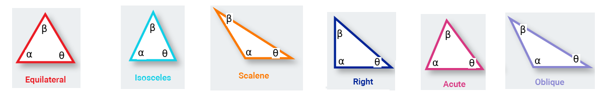  

---

## The sum of all the angles of "any triangle" = 180 degrees (180°)

> The sum of all the angles of `any triangle` results in *180 degrees (180°)*.

**EXAMPLE-01:**  
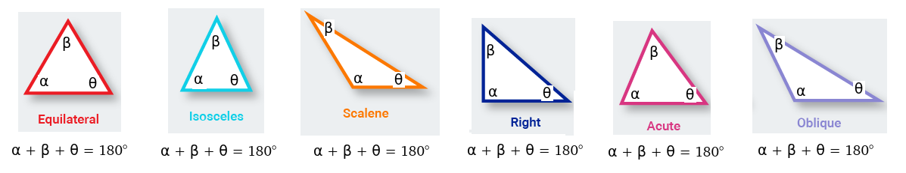  

**EXAMPLE-02:**  
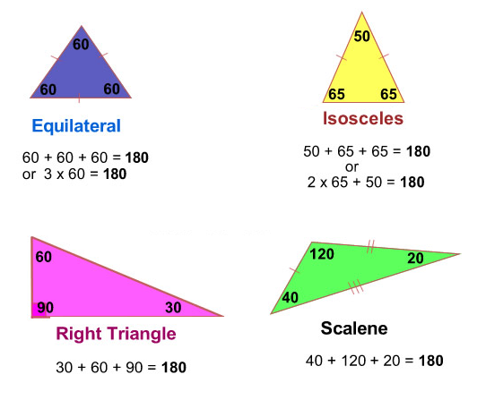  

---

## Right Triangle (Triângulo Retângulo) and their Components

> A **"Right Triangle" (also called a "Right-Angled Triangle")** has a **right angle (90°)** in it.

For example, see the **Right-Angled Triangle** below:

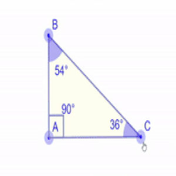  

See that:

 - **We have "3 Angles".**
 - **We have a "Right-Angled (90° angle)":**
   - Independent we change the other Angles the **Right-Angled** always has *90° (or 90 degrees)*.

### Right Triangle Components

> A **"Right Triangle"** has the following components:

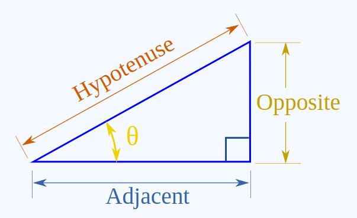  

 - **θ**
   - **"θ"** is the *"angle label"*.
 - **Opposite**
   - The **opposite side (O)** is opposite to the *angle (θ)*.
 - **Adjacent**
   - The **adjacent side (A)** is next to the *angle (θ)*.
 - **Hypotenuse**
   - The **hypotenuse (H)** is the longest side *(always the side facing the right-angle/90°)*.

Let's see some different examples of **"Opposite"** and **"Adjacent"**:

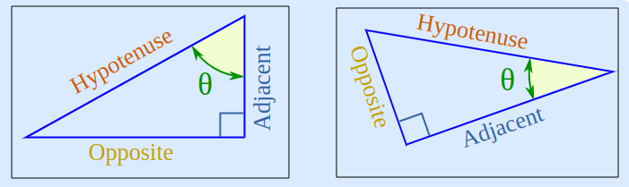  

> **NOTE:**  
> Note that the reference for the **"Opposite"** of the **"Adjacent"** is always the *angle (θ)*.

<!--- ( Pythagorean Theorem ) --->

---

## Pythagorean Theorem

Over 2000 years ago there was an amazing discovery about triangles...

 - When a triangle has a **right angle (90°)**;
 - And squares are made on each of the three sides:
   - **PT-NOTE:** E são feitos quadrados em cada um dos três lados.
 - Then the biggest square has the exact same area as the other two squares put together:
   - **PT-NOTE:** Então o maior quadrado tem exatamente a mesma área que os outros dois quadrados juntos.

See the image below to understand more easily:

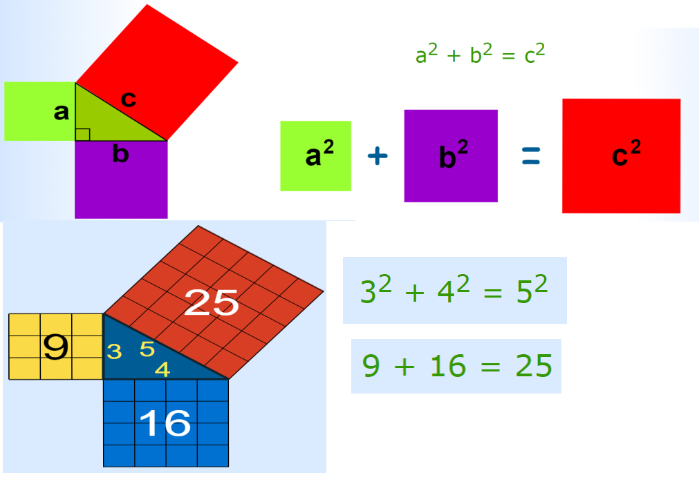  

> **NOTE:**  
> It is called the **"Pythagorean theorem"**.

 - **"c"** is the longest side of the triangle:
   - The longest side of the triangle is called the **"hypotenuse"**.
 - **"a"** and **"b"** are the other two sides.

---

## When is the "Pythagorean Theorem" useful?

> If we know the lengths of two sides of a **"Right Angled Triangle"**, we can find the length of the *third side* (But remember it only works on *"Right Angled Triangles"*).

For example, see the question below:

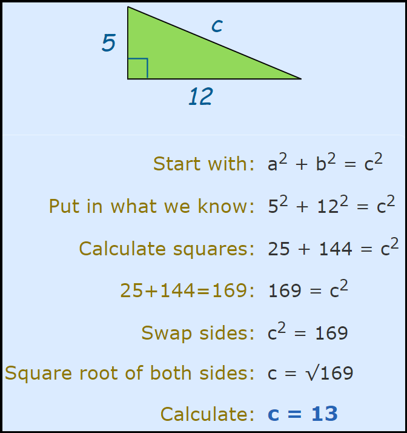

---

## Find different sides of a Right-Angled Triangle

> Is the **"Pythagorean Theorem"** just used to find the longest side of the *Right-Angled Triangle* (c, hypotenuse)?

**NOT!**  
We can use the **"Pythagorean Theorem"** to find any side of the *Right-Angled Triangle*.

> **NOTE:**  
> However, we need to know *at least (pelo menos)* two sides first.

For example, see the example below:

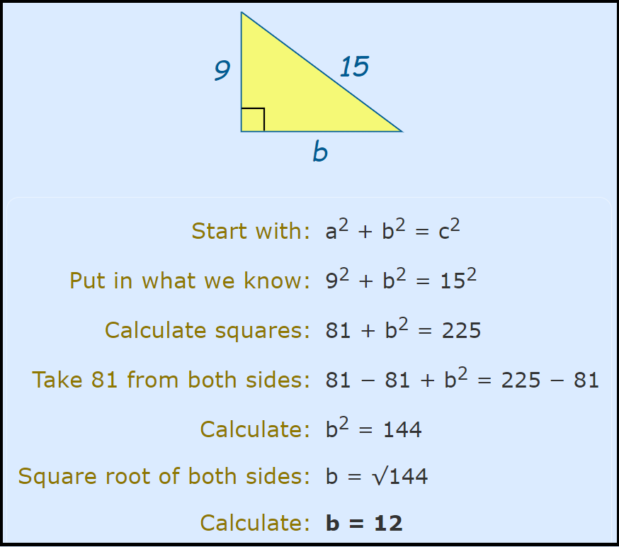

<!--- ( Sine(θ) ) --->

---

## Sine(θ) | SOH

> If we have the `opposite side` and the `hypotenuse`, use the **sine(θ)** ratio.

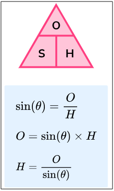  

> **NOTE:**  
> See that also we can change the formula to solve specific problems.

---

## Finding a missing side using sin(θ) ratio

Let's imagine we have the following Triangle:

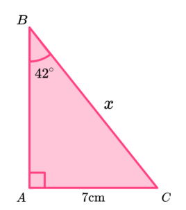  

Now, the question is:

> **What is the value of the missing side "x"?**

The first thing we need to do is *"map/label the sides of the triangle"* in *"relation to the angle"*:

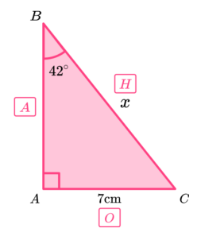

Knowing that:

 - **θ = 42°**.
 - **O = 7cm**.
 - **H = x**

**NOTE:**  
We can use the `sine(θ) ratio (SOH)` to determine the missing length of the *"hypotenuse (x)"*:

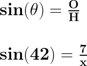  

Now, let's multiply the both sides of the equation by **"x"**:

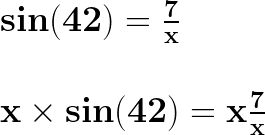  

First, let's solve $x\frac{7}{x}$ separately:

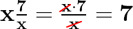  

> **NOTE:**  
> When we multiply a number by a fraction, we multiply the number by the numerator of the fraction and repeat the denominator.

Now we have:

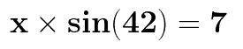  

If we divide both sides of the equation by sin(42), we get:

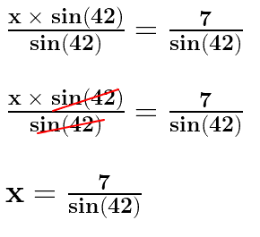  

The **sin(42)** is approximately equal to **"0.6691"**:

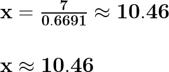  

> **NOTE:**  
> The length of the *hypotenuse* **"x = 10.46 cm (2dp)"**.

---

## Finding a missing angle using sin-1(x)

Let's imagine we have the following Triangle:

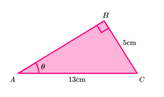  

Now, the question is:

> **What is the value of the missing angle (θ)?**

The first thing we need to do is *"map/label the sides of the triangle"* in *"relation to the angle"*:

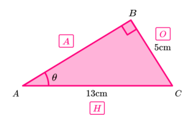

Knowing that:

 - **O = 5cm.**
 - **H = 13cm.**

**NOTE:**  
We can use the `sine(θ) ratio (SOH)` to determine the angle (θ) value:

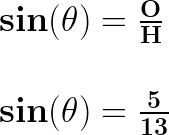  

> **NOTE:**  
> However we need to use the **"inverse sine function"** as we need to calculate the angle (θ).

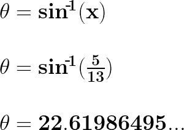  

> **NOTE:**  
> So the *angle* **θ = 22.6° (1dp)**.

<!--- ( Cosine(θ) ) --->

---

## Cosine(θ) | CAH

> If we have the `adjacent side` and the `hypotenuse`, use the **cosine(θ)** ratio.

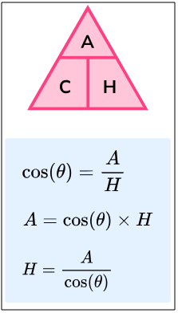  

> **NOTE:**  
> See that also we can change the formula to solve specific problems.

---

## Finding a missing side using cos(θ) ratio

Let's imagine we have the following Triangle:

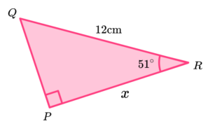  

Now, the question is:

> **What is the value of the missing side "x"?**

The first thing we need to do is *"map/label the sides of the triangle"* in *"relation to the angle"*:

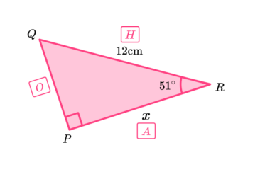

Knowing that:

 - **θ = 51°**.
 - **A = x**.
 - **H = 12cm**.

**NOTE:**  
We can use the `cosine(θ) ratio (CAH)` to determine the missing length of the *"Adjacent (x)"*:

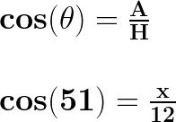  

Now, let's multiply the both sides of the equation by **"12"**:

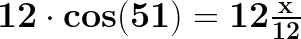  

First, let's solve $12\frac{x}{12}$ separately:

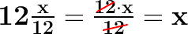  

> **NOTE:**  
> When we multiply a number by a fraction, we multiply the number by the numerator of the fraction and repeat the denominator.

Now we have:

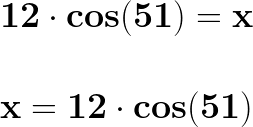  

The **cosine(51)** is approximately equal to **"0.6293"**:

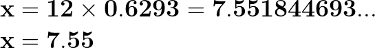  

> **NOTE:**  
> The length of the *adjacent side* **"x = 7.55 cm (2dp)"**.

---

## Finding a missing angle using cos-1(x)

Let's imagine we have the following Triangle:

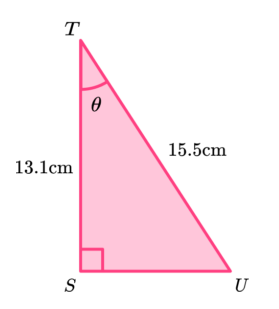  

Now, the question is:

> **What is the value of the missing angle (θ)?**

The first thing we need to do is *"map/label the sides of the triangle"* in *"relation to the angle"*:

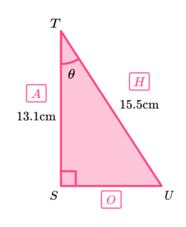

Knowing that:

 - **A = 13.1cm.**
 - **H = 15.5cm.**

**NOTE:**  
We can use the `cosine(θ) ratio (CAH)` to determine the angle (θ) value:

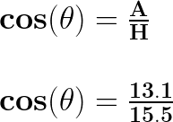  

> **NOTE:**  
> However we need to use the **"inverse cosine function"** as we need to calculate the angle (θ).

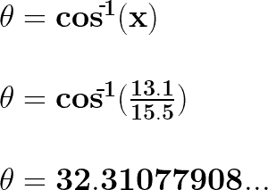  

> **NOTE:**  
> So the *angle* **θ = 32.3° (1dp)**.

<!--- ( Tangent(θ) ) --->

---

## Tangent(θ) | TOA

> If we have the `opposite side` and the `adjacent side`, use the **tangent(θ)** ratio.

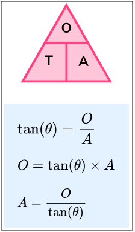  

> **NOTE:**  
> See that also we can change the formula to solve specific problems.

---

## Finding a missing side using tan(θ) ratio

Let's imagine we have the following Triangle:

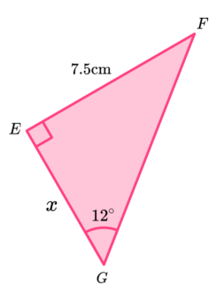  

Now, the question is:

> **What is the value of the missing side "x"?**

The first thing we need to do is *"map/label the sides of the triangle"* in *"relation to the angle"*:

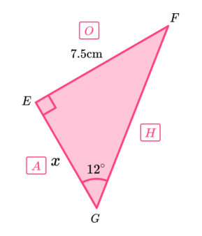

Knowing that:

 - **θ = 12**.
 - **O = 7.5cm**
 - **A = x**.

**NOTE:**  
We can use the `Tangent(θ) ratio (TOA)` to determine the missing length of the *"Adjacent (x)"*:

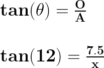  

Now, let's multiply the both sides of the equation by **"x"**:

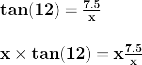  

First, let's solve $x\frac{7.5}{x}$ separately:

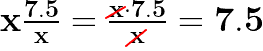  

> **NOTE:**  
> When we multiply a number by a fraction, we multiply the number by the numerator of the fraction and repeat the denominator.

Now we have:

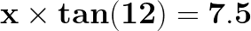  

If we divide both sides of the equation by tan(12), we get:

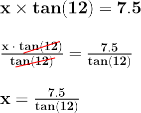  

The **tan(12)** is approximately equal to **"0.2126"**:

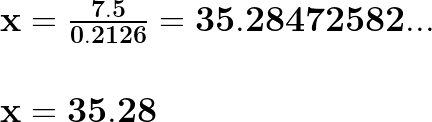  

> **NOTE:**  
> The length of the *adjacent side* **"x = 35.28 cm (2dp)"**.

---

## Finding a missing angle using tan-1(x)

Let's imagine we have the following Triangle:

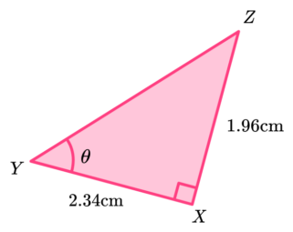  

Now, the question is:

> **What is the value of the missing angle (θ)?**

The first thing we need to do is *"map/label the sides of the triangle"* in *"relation to the angle"*:

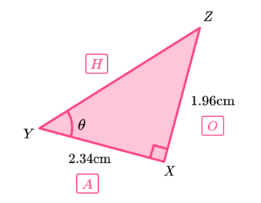

Knowing that:

 - **O = 1.96cm.**
 - **A = 2.34cm.**

**NOTE:**  
We can use the `tangent(θ) ratio (TOA)` to determine the angle (θ) value:

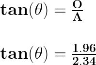  

> **NOTE:**  
> However we need to use the **"inverse tangent function"** as we need to calculate the angle (θ).

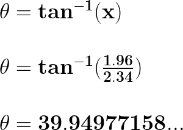  

> **NOTE:**  
> So the *angle* **θ = 39.9° (1dp)**.

<!--- ( Tips & Tricks ) --->

---

## When to use trigonometric ratios (SOH, CAH, TOA)?

We can use **trigonometric ratios (SOH, CAH, TOA)** to find a `missing side` of a triangle when we have:

 - A angle (θ) as reference.
 - The length of at least one side of the triangle.

We can use **trigonometric ratios (SOH, CAH, TOA)** to find a `missing angle` of a triangle when we have:

 - The length of two sides of the triangle.

---

## When to use the "Standard" or "Inverse trigonometric" function?

 - **Standard:**
   - We use **"standard trig"** functions when we know the angle.
 - **Inverse:**
   - We have to use the **"inverse trig"** functions when we don’t know the angle.

<!--- ( REFERENCES ) --->

---

## REFERENCES

 - [O QUE É UM TRIÂNGULO? Trigonometria - Matemática Básica](https://www.youtube.com/watch?v=f8cJU41R68U)
 - [Angle Sum in a Triangle](https://passyworldofmathematics.com/angle-sum-in-a-triangle/)
 - [Sin Cos Tan](https://thirdspacelearning.com/gcse-maths/geometry-and-measure/sin-cos-tan/)

---

**Rodrigo** **L**eite da **S**ilva
