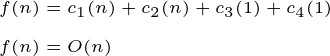
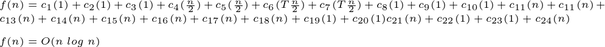
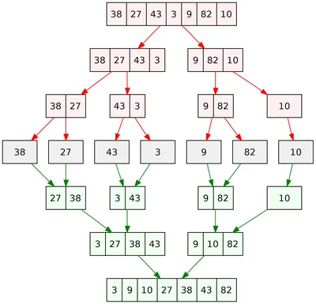
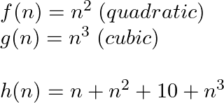
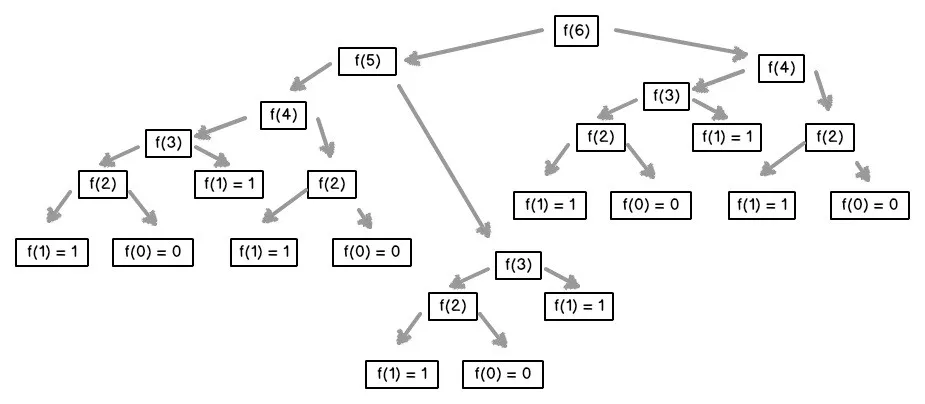
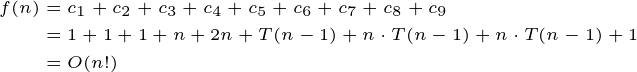
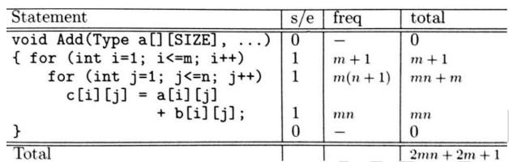

# Design and Analysis of Algorithms

## Contents

 - **Asymptotic Analysis:**
   - [Intro to Asymptotic Analysis (+Example)](#intro-to-aa)
   - **Types of Asymptotic Notations:**
     - [Big(O), Worst-Case](#big-o-notation)
     - [Omega(Ω), Best Case](#omega-notation)
     - [Theta(Θ), Average Case](#theta-notation)
   - **Asymptotic Classes:**
     - [Constant, O(1)](#intro-to-constant-approach)
     - [Logarithmic, O(log n)](#intro-to-logarithmic-approach)
     - [Linear, O(n)](#intro-to-linear-approach)
     - [Loglinear, O(n log n)](#intro-to-loglinear-approach)
     - [Polynomial, O(n<sup>k</sup>), e.g. O(n<sup>2</sup>), O(n<sup>3</sup>)](#intro-to-polynomial-approach)
     - [Exponential, O(a<sup>n</sup>) or O(b<sup>n</sup>)](#intro-to-exponential-approach)
     - [Factorial, O(n!)](#intro-to-factorial-approach)
 - **Step Count Method (or Frequency Count):**
   - [Intro to Step Count Method](#intro-to-step-count-method)
 - **Math for Algorithms:**
   - **Arithmetic Series:**
     - [Sum of the first "n" natural numbers](#sum-of-the-first-n-natural-numbers)
   - **Logarithms:**
     - [Intro to Logarithms](#intro-to-log)
     - [How Logarithms are used in Analysis of Algorithms](#logarithms-in-aoa)
 - [**References**](#ref)


<!--- ( Asymptotic Analysis ) -->

---

<div id="intro-to-aa"></div>

## Intro to Asymptotic Analysis (+Example)

> **Given two algorithms "g" and "h" for the same task, how do we find out which one is better?**

One naive (ingênua) way of doing this is – to implement both algorithms and run the two programs on your computer for different inputs and see which one takes less time.

**NOTE:**  
However, there are many problems with this approach for the analysis of algorithms.

 - It might be possible that for some inputs, the algorithm **"g"** performs better than the algorithm **"h"**.
 - And for another input, the algorithm **"h"** performs better than the algorithm **"g"**.
 - **NOTE:** For example, a search algorithm depends on how the data (elements) are distributed. Is the searched element at the beginning, middle, or end of the list?

Asymptotic Analysis is the big idea *that handles (que lida)* the above issues in analyzing algorithms:

 - In *Asymptotic Analysis*, we evaluate the performance of an algorithm in **terms of input size**.
 - We calculate how the time (or space) for an algorithm *increases as (aumenta a medida que)* the input size increases.

To understand more easily, imagine that the Algorithms **"g"** and **"h"** are the following functions:

  

Some importants points here are:

 - **The "g" function has constants with greater values than the "h" function**
   - *Constants of the "g" function:* 100 and 500.
   - *Constants of the "h" function:* 1
 - **However, the "h" function has variables with orders of magnitude (magnitude) greater than the "g" function:**
   - *"g" function variables:* n
   - *"h" function variables:* n and n<sup>2</sup>

Now, let's test some **"n"** values to the functions (Algorithms) **g(n)** and **h(n)**:

 - **n = 10**
   - g(n): 10.500
   - h(n): 111
 - **n = 100**
   - g(n): 100.500
   - h(n): 10.101
 - **n = 1.000**
   - `g(n): 1.000.500` ←
   - `h(n): 1.001.001` ←
 - **n = 1.500**
   - g(n): 1.500.500
   - h(n): 2.251.501
 - **n = 2.000**
   - g(n): 2.000.500
   - h(n): 4.002.001
 - **n = 2.500**
   - g(n): 2.500.500
   - h(n): 6.252.501
 - **n = 3.000**
   - g(n): 3.000.500
   - h(n): 9.003.001
 - **n = 3.500**
   - g(n): 3.500.500
   - h(n): 12.253.501

Some important points here are:

 - For **"n >= 1000"** the function (algorithm) **h(n)** will always be greater than the function (algorithm) **g(n)**.
 - Although (embora/apesar) the function **g(n)** has higher constants multiplying (1000 and 500) your terms, there exists a value to **"n"** where the function (algorithms) **h(n)** will always be greater than the **g(n)** function.

> **NOTE:**  
> Therefore (portanto), *Asymptotic Analysis* **focuses on terms of input size**, **not constant values**.

For example, let's see other functions (algorithms) and their Asymptotic Analysis:

  

> **NOTE:**  
> Note that the focus is always the largest term of the function.

---

<div id="big-o-notation"></div>
 
## Big(O), Worst-Case

> The **Big(O) notation (also called Worst-Case)** is the most common approach used to describe the asymptotic complexity of an algorithm.

 - In the **Big(O)**, we calculate the *upper bound* on the running time of an algorithm.
 - **NOTE:** We must know (devemos conhecer) the case that causes *a maximum number of operations to be executed*.

For example, *Linear Search* algorithm, in the **Big(O)** occurs when the element to be searched is not present in the array:

 - When the element is not present, the search() function compares it with all the elements of `arr[]` one by one.
 - Therefore, the worst-case time complexity of the linear search would be **O(n)**.

> **Briefly, the *Big(n)* occurs when the *maximum* number of statements is run!**

---

<div id="omega-notation"></div>

## Omega(Ω), Best Case

> The **Omega(Ω) notation (also called Best Case)** is also a common approach used to describe the asymptotic complexity of an algorithm.

 - In the **Omega(Ω)**, we calculate the *lower bound* on the running time of an algorithm.
 - **NOTE:** We must know (devemos conhecer) the case that causes *a minimum number of operations to be executed*.

For example, in the *Linear Search* algorithm problem, the best case occurs when x is present at the first location:

 - The number of operations in the best case is constant (not dependent on n).
 - So time complexity in the best case would be **Ω(1)**.

> **Briefly, the *Omega(Ω)* occurs when the *minimum* number of statements is run!**

---

<div id="theta-notation"></div>

## Theta(Θ), Average Case

> The **Theta(Θ) notation (also called Average Case)** is the rarely used approach to describing the asymptotic complexity of an algorithm.

 - In **Theta(Θ)**, we take all possible inputs and calculate the computing time (tempo de computação) for all of the inputs.


---

<div id="intro-to-constant-approach"></div>

## Constant, O(1)

> An algorithm is considered constant, denoted as **O(1)**, if its execution time remains the same, regardless (independentemente) of the size of the input data.

 - This means that the execution time is not dependent on the size of the input data.
 - In other words, no matter how much data you feed the algorithm, it will always take the same amount of time to complete its operation.
 - *Time complexity:* The time complexity of a constant algorithm is always **O(1)**, which means the execution time is independent of the input size.
 - *Space complexity:* The space complexity of a constant algorithm is also usually **O(1)**, as it only needs to store a fixed amount of data.

For example:

[swap.py](src/python/swap.py)
```python
def swap_variables(x, y):
    x = x + y    # c1, 1
    y = x - y    # c2, 1
    x = x - y    # c3, 1
    return x, y  # c4, 1

if __name__ == "__main__":

    x = 10
    y = 5
    print(f"Before Swapping: x = {x}, y = {y}")

    x, y = swap_variables(x, y)
    print(f"After Swapping: x = {x}, y = {y}")
```

**OUTPUT:**  
```bash
Before Swapping: x = 10, y = 5
After Swapping: x = 5, y = 10
```

  

See that, independently of the input (n) size the **swap_variables()** function will always have the same running time.

**Examples of *"Constant Time Complexity"* functions:**


---

<div id="intro-to-logarithmic-approach"></div>

## Logarithmic, O(log n)

> An algorithm is said to have a *logarithmic time complexity* when it **reduces the size of the input data in each step (that's, don't need to look at all input (n) values)**.

For example:

[binary_search.py](src/python/binary_search.py)
```python
def binary_search(data, value):
    n = len(data)                                 # c1,  1
    left = 0                                      # c2,  1
    right = n - 1                                 # c3,  1
    while left <= right:                          # c4,  log2(n) + 1
        middle = (left + right) // 2              # c5,  log2(n)
        if value < data[middle]:                  # c6,  1
            right = middle - 1                    # c7,  1
        elif value > data[middle]:                # c8,  1
            left = middle + 1                     # c9,  1
        else:                                     # c10, 1
            return middle                         # c11, 1
    raise ValueError('Value is not in the list')  # c12, 1

if __name__ == '__main__':

    data1 = [1, 2, 3, 4, 5, 6, 7, 8, 9, 10]
    value1 = 6
    result1 = binary_search(data1, value1)
    print(f"Binary Search Result: {result1}")

    data2 = ['apple', 'banana', 'cherry', 'grape', 'orange']
    value2 = 'cherry'
    result2 = binary_search(data2, value2)
    print(f"Binary Search Result: {result2}")

    data3 = [0.1, 0.2, 0.3, 0.4, 0.5, 0.6, 0.7, 0.8, 0.9]
    value3 = 0.5
    result3 = binary_search(data3, value3)
    print(f"Binary Search Result: {result3}")

    data4 = []
    value4 = 42
    try:
        result4 = binary_search(data4, value4)
        print(f"Binary Search Result: {result4}")
    except ValueError as e:
        print(f"Binary Search Result: {e}")
```

**OUTPUT:**  
```bash
Binary Search Result: 5
Binary Search Result: 2
Binary Search Result: 4
Binary Search Result: Value is not in the list
```


> **NOTE:**  
> See that in some parts of the algorithm (c<sub>4</sub> and c<sub>5</sub>) we **reduce the size of the input (n) in each step (that's, don't need to look at all input (n) values)**.

**Examples of *"Logarithmic Time Complexity"* functions:**


> **NOTE:**  
> In the example above:
> *"n"* is the input size.
> *"x"* is how many times is multiplied by *2*.

---

<div id="intro-to-linear-approach"></div>

## Linear, O(n)

> An algorithm is said to have a linear time complexity when the running time increases at most linearly with the size of the input (n). *This is the best possible time complexity when the algorithm must examine all values in the input (n)*.

For example:

[linear_search.py](src/python/linear_search.py)
```python
def linear_search(data, value):
    for index in range(len(data)):                   # c1, n
        if value == data[index]:                     # c2, n
            return index                             # c3, 1
    raise ValueError('Value not found in the list')  # c4, 1

if __name__ == '__main__':
    data = [1, 2, 9, 8, 3, 4, 7, 6, 5]
    print(linear_search(data, 7))
```

**OUTPUT:**  
```python
6
```

  

**Examples of *"Linear Time Complexity"* functions:**


---

<div id="intro-to-loglinear-approach"></div>

## Loglinear, O(n log n)

 - An algorithm is said to have a Loglinear ( or quasilinear) time complexity *when each operation in the input (n) have a logarithm time complexity*.
 - It is commonly seen in sorting algorithms (e.g. mergesort, timsort, heapsort).
 - This is also a typical asymptotic class of algorithms that implement the **“Divide and Conquer”** paradigm.
 - Functions whose growth (cujo crescimento) is the **product of a linear function** and a **logarithm**.

For example:

[merge_sort.py](src/python/merge_sort.py)
```python
def merge_sort(data):
    if len(data) <= 1:                                                    # c1, 1
        return                                                            # c2, 1
    
    mid = len(data) // 2                                                  # c3, 1
    left_data = data[:mid]                                                # c4, n/2
    right_data = data[mid:]                                               # c5, n/2

    merge_sort(left_data)                                                 # c6, T(n/2)
    merge_sort(right_data)                                                # c7, T(n/2)

    left_index = 0                                                        # c8, 1
    right_index = 0                                                       # c9, 1
    data_index = 0                                                        # c10, 1

    while left_index < len(left_data) and right_index < len(right_data):  # c11, n
        if left_data[left_index] < right_data[right_index]:               # c12, n
            data[data_index] = left_data[left_index]                      # c13, n
            left_index += 1                                               # c14, n
        else:                                                             # c15, n
            data[data_index] = right_data[right_index]                    # c16, n
            right_index += 1                                              # c17, n
        data_index += 1                                                   # c18, n
    
    if left_index < len(left_data):                                       # c19, 1
        del data[data_index:]                                             # c20, 1
        data += left_data[left_index:]                                    # c21, n
    elif right_index < len(right_data):                                   # c22, 1
        del data[data_index:]                                             # c23, 1
        data += right_data[right_index:]                                  # c24, n

if __name__ == '__main__':
    data = [9, 1, 7, 6, 2, 8, 5, 3, 4, 0]
    merge_sort(data)
    print(data)
```

**OUTPUT:**  
```bash
[0, 1, 2, 3, 4, 5, 6, 7, 8, 9]
```

  

### Explanation

 - The Time Complexity of merge sort is **O(n log n)**, where *"n"* is the number of elements in the input list:
   - This is because the list is recursively divided into halves until each sublist contains only one element, and then the sublists are merged back together in sorted order:
     - The merging process takes **O(n)** time;
     - The recursion depth is **O(log n)**;
     - So the overall time complexity is **O(n log n)**.

To understand more easily see the image below:



**Examples of *"Loglinear Time Complexity"* functions:**


---

<div id="intro-to-polynomial-approach"></div>

## Polynomial, O(n<sup>k</sup>), e.g. O(n<sup>2</sup>), O(n<sup>3</sup>)

> They are more efficient than exponentials, but are **only suitable for solving small problems**. When the value of "n" grows a lot, the algorithm becomes very inefficient.

Functions whose growth (cujo crescimento) is a power of the input variable, where **"k" is a positive constant**.

**Examples of *"Polynomial Time Complexity"* functions:**



> **NOTE:**  
> See that the **exponent** is **always a positive constant**.

---

<div id="intro-to-exponential-approach"></div>

## Exponential, O(a<sup>n</sup>) or O(b<sup>n</sup>)

> **Exponential O(a^n) or O(b^n), where "a" and "b" are *constants*.**

An algorithm is said to have an exponential time complexity when **the growth doubles with each addition to the input (n) data set**. This kind of time complexity is usually seen in *Brute-Force* algorithms.

An example of an exponential time algorithm is the **recursive calculation of the Fibonacci series**:

[fibonacci.py](src/python/fibonacci.py)
```python
def fibonacci(n):
    if n <= 1:                                  # c1, 1
        return n                                # c2, 1
    else:
        return fibonacci(n-1) + fibonacci(n-2)  # c3, T(n-1) + T(n-2) = 2 * T(n-1) = 2^n


if __name__ == "__main__":

    result0 = fibonacci(0)
    print(f"Fibonacci of 0: {result0}")

    result1 = fibonacci(1)
    print(f"Fibonacci of 1: {result1}")

    result5 = fibonacci(5)
    print(f"Fibonacci of 5: {result5}")

    result10 = fibonacci(10)
    print(f"Fibonacci of 10: {result10}")

    result15 = fibonacci(15)
    print(f"Fibonacci of 15: {result15}")
```

**OUTPUT:**  
```bash
Fibonacci of 0: 0
Fibonacci of 1: 1
Fibonacci of 5: 5
Fibonacci of 10: 55
Fibonacci of 15: 610
```


### Explanation

- The recursive calls in the "else" case dominate the cost (c3).
- Each call to `fibonacci` creates a new layer in the call stack, leading to exponential growth in complexity with increasing *"n"*.
- While other operations like checking the condition and returning values are constant time (c1, c2), they become negligible compared to the recursive calls.

**NOTE:**  
Therefore, the overall cost of `fibonacci` is **O(2^n)**. This approach is highly inefficient for calculating large Fibonacci numbers due to its exponential complexity. Consider using memoization or iterative approaches for significantly improved performance.

To understand more easily see the image below:

  
  

**Examples of *"Exponential Time Complexity"* functions:**


> **NOTE:**
> See that difference of polynomial class here the base is always constant and the **exponent is always a positive variable (n)**.

---

<div id="intro-to-factorial-approach"></div>

## Factorial, O(n!)

An algorithm is said to have a factorial time complexity when it grows in a factorial way based on the size of the input (n).

**Factorial math example:**

```md
2! = 2 x 1 = 2
3! = 3 x 2 x 1 = 6
4! = 4 x 3 x 2 x 1 = 24
5! = 5 x 4 x 3 x 2 x 1 = 120
6! = 6 x 5 x 4 x 3 x 2 x 1 = 720
7! = 7 x 6 x 5 x 4 x 3 x 2 x 1 = 5.040
8! = 8 x 7 x 6 x 5 x 4 x 3 x 2 x 1 = 40.320
```

**Factorial code example:**

```python
def heap_permutation(elements):
    if len(elements) == 0:                             # c1, 1 (base case: empty list)
        return [[]]                                    # c2, 1 (return empty list of permutations)

    permutations = []                                  # c3, 1 (initialize empty list for permutations)
    for i in range(len(elements)):                     # c4, n (iterate over each element)
        rest = elements[:i] + elements[i + 1 :]        # c5, 2n (create sub-list without current element)
        sub_permutations = heap_permutation(rest)      # c6, T(n-1) (recursive call with smaller sub-list)
        for perm in sub_permutations:                  # c7, n * T(n-1) (iterate over sub-permutations)
            permutations.append([elements[i]] + perm)  # c8, n * T(n-1) (prepend current element and append to permutations)
    return permutations                                # c9, 1 (return final list of permutations)


if __name__ == "__main__":

    my_elements = [1, 2, 3]
    permutations_list = heap_permutation(my_elements)
    for permutation in permutations_list:
        print(permutation)
```

**OUTPUT:**  
```bash
[1, 2, 3]
[1, 3, 2]
[2, 1, 3]
[2, 3, 1]
[3, 1, 2]
[3, 2, 1]
```



### Explanation

 - The dominant cost comes from the nested loops iterating over *"n"* elements and *"n-1 sub-permutations"* (c7, c8).
 - Each iteration involves prepending the current element and appending the sub-permutation (constant time), contributing to the total cost.
 - Other operations like base case check, initialization, and returning results are negligible compared to the nested loops.

Therefore, the overall cost of `heap_permutation` is **O(n!)**. This high complexity arises from generating all possible permutations for *"n"* elements, requiring repeated computations for sub-lists. While effective for smaller data, it becomes computationally expensive for larger datasets.

**Examples of *"Factorial Time Complexity"* functions:**


<!--- ( Step Count Method (or Frequency Count) ) -->

---

<div id="intro-to-step-count-method"></div>

## Intro to Step Count Method

> The **"Step Count Method (also called as Frequency Count method)"** count the number of times each instruction is executed. Based on that we will calculate the **Time Complexity** of an Algorithm.

For example:

**Example-01:**  
  

**Example-02:**  
  


<!--- ( Math for Algorithms ) -->

---

<div id="sum-of-the-first-n-natural-numbers"></div>

## Sum of the first "n" natural numbers

Imagine we need to **sum the first "n" natural numbers**. For example:

  

The formula to do this is:

  

For example:

  

> **NOTE:**  
> Remember that in math first, we solve the `parentheses ()`. e.g. `(n+1)`.

However, we can also use the distributive property:

  

---

<div id="intro-to-log"></div>

## Intro to Logarithms

> **Logarithms are the opposite of exponentials.**

 - Just as *subtraction* is the opposite of *addiction*;
 - And *division* is the opposite of *multiplication*;
 - **Logarithms** is the *opposite* of **exponentials**.

> Technically speaking (tecnicamente falando), `log functions are the inverses of exponential functions`.

For example, see the examples below to understand more easily:

  

Let's, see other examples:

  

> **NOTE:**  
> We read the logarithm formula **"log<sub>2</sub>(n)"** as **"Log of 'n' to base 2"**.

  

---

<div id="logarithms-in-aoa"></div>

## How Logarithms are used in Analysis of Algorithms

To understand how logarithms are used in Analysis of Algorithms, let's see two common questions.

 - **How many times must we double 1 before we get to n?**
   - The phrase above can be expressed as the following sequence:
     - 1, 2, 4, 8, 16, ..., n, or:
       - We start with the initial value 1.
       - We double the initial value: (1 x 2 = 2)
       - We double the current value: (2 x 2 = 4)
       - We double the current value: (4 x 2 = 8)
       - We double the current value: (8 x 2 = 16)
       - We double the current value: (16 x 2 = 32)
       - **NOTE:** See that to **"double 1"** we **use the previous result (current) times 2**.
   - That's, what is the exponent to which we raise 2 to get n?
     - $2^y = n \Leftrightarrow \log_2(n) = y$
   - In other words, it's asking for the *logarithm of n to base 2*, $\log_{2}(n)$.
   - It's like counting the "doublings" it takes to get from *"1"* to *"n"*. For example:
     - If *"n"* is *8*, then $log_{2}(8)$ is *"3"*, because 2 raised to the power of 3 (2 * 2 * 2) is equals to 8.
 - **How many times must we divide "n" in half in order to get back down to 1?**
   - For example, if **n = 32**, the answer is $\log_{2}(32) = 5 \Leftrightarrow 2^5 = 32$. This means we need to divide 32 in half 5 times to get to 1:
     - We start with the initial value 32.
     - We divide the initial value in half: (32 / 2 = 16).
     - We divide the current value in half: (16 / 2 = 8).
     - We divide the current value in half: (8 / 2 = 4).
     - We divide the current value in half: (4 / 2 = 2).
     - We divide the current value in half: (2 / 2 = 1).

**You can see, these are the same questions. We're just going in different directions!**

 - From *"1"* to *"n"* by multiplying by *"2"*.
 - From *"n"* to *"1"* by dividing by *"2"*.

> **Ok, but how does it work on Analysis of Algorithms?**

For example, imagine we have the following Binary Tree:

  

The tree above is special because each "level" or "tier" of the tree is full. There aren't any gaps. We call such a tree **"perfect"**.

**NOTE:**  
If we count the number of nodes on each level, we can notice that it successively doubles *as we go (medida que avançamos)*:

  

Another thing we need to pay attention to is that the number of nodes on each level is $\log_{2}(n) = y \Leftrightarrow 2^y = n$:


Knowing that we can say the total number of nodes in a perfect binary tree is:


---

<div id="ref"></div>

## References

 - **General:**
   - [Google Bard](https://bard.google.com/)
   - [ChatGPT](https://chat.openai.com/)
 - **Asymptotic Analysis:**
   - [[ED] Aula 101 - Análise de Algoritmos - Comportamento Assintótico](https://www.youtube.com/watch?v=SClFMUpBiaw&list=PL8iN9FQ7_jt6buW7SBD3yzjIp8NnJYrZl&index=3)
   - [How to Analyse Loops for Complexity Analysis of Algorithms](https://www.geeksforgeeks.org/analysis-of-algorithms-set-4-analysis-of-loops/)
   - [Worst, Average and Best Case Analysis of Algorithms](https://www.geeksforgeeks.org/worst-average-and-best-case-analysis-of-algorithms/)
   - [Time Complexity Analysis](https://log2base2.com/courses/time-complexity-analysis)
   - [Asymptotic classes](https://algol.dev/en/asymptotic-classes/)
   - [Understanding time complexity with Python examples](https://towardsdatascience.com/understanding-time-complexity-with-python-examples-2bda6e8158a7)
 - **Step Count Method (or Frequency Count):**
   - [VTU IN POCKETS - MADE BY ENGINEERS FOR ENGINEERS](https://vtu-is-site.web.app/notes/is_not/4sem/daa/DAA-Module-1.pdf)
 - **Math for Algorithms:**
   - ["The Relationship" for Logarithms](https://www.purplemath.com/modules/logs.htm)
   - [Logarithms](https://www.interviewcake.com/article/python3/logarithms)

---

Ro**drigo** **L**eite da **S**ilva - **drigols**
