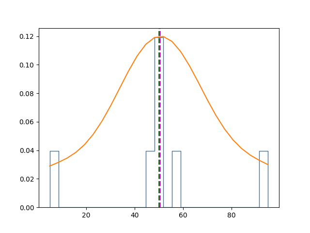
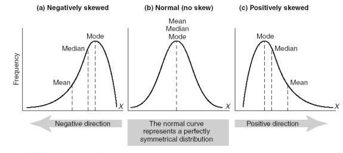

# Distribuição & Densidade de dados

## Conteúdo

 - [01 - Introdução e problema](#01)
 - [02 - Visualização gráfica de uma distribuição de dados](#02)
 - **03- Curva (linha) de Densidade:**
   - [03.1 - Introdução a Densidade (ou curva (linha) de densidade) Assimétrica](#03-1)
   - [03.2 - Introdução a Densidade (ou curva (linha) de densidade) Simétrica](#03-2)
 - **04 - Distribuição Normal:**
   - [04.1 - Analogia com arremessos de basquete (evento discreto)](#04-1)
   - [04.2 - Introdução & Caractetísticas de uma Distribuição Normal (Simétrica)](#04-2)
   - [04.3 - Probabilidade de acertar arremessos de basquete por faixa (evento contínuo)](#04-3)
   - [04.4 - Calculando a probabilidade da faixa que desejamos (Função Densidade de Probabilidade)](#04-4)

---

<div id='01'></div>

## 01 - Introdução e problema

Para entender melhor o conceito de **Distribuição & densidade** em um conjunto de dados vamos seguir com o seguinte exemplo...

> Por exemplo, suponha que você decida realizar um estudo sobre os salários comparativos de pessoas que se formaram na mesma escola.

Serão esses: 

| Nome     | Salário     |
|----------|-------------|
| Dan      | 50,000      |
| Joann    | 54,000      |
| Pedro    | 50,000      |
| Rosie    | 189,000     |
| Ethan    | 55,000      |
| Vicky    | 40,000      |
| Frederic | 59,000      |

Agora vamos transformar esse nosso exemplo em um **DataFrame Pandas**:

[example.py](src/example.py)
```python
def create_df(**df):
  my_df = {}
  import pandas as pd
  my_df = pd.DataFrame(df)
  return my_df

if __name__ =='__main__':
  students = {
    'Name': ['Dan', 'Joann', 'Pedro', 'Rosie', 'Ethan', 'Vicky', 'Frederic'],
    'Salary':[50000, 54000, 50000, 189000, 55000, 40000, 59000]
  }

  my_df = create_df(**students)
  print(my_df)
```

**OUTPUT:**  

```python
       Name  Salary
0       Dan   50000
1     Joann   54000
2     Pedro   50000
3     Rosie  189000
4     Ethan   55000
5     Vicky   40000
6  Frederic   59000
```

---

<div id='02'></div>

## 02 - Visualização gráfica de uma distribuição de dados

Geralmente é mais fácil ter uma noção de distribuição visualizando os dados. Vamos começar criando um histograma dos salários, destacando:

 - A média (mean) de salários;
 - Os salários medianos (median);
 - O min(), max() são bastante evidentes, um do lado esquerdo e o outro do lado direito, respectivamente **(você pode ver isso no eixo "x")**;
 - A moda é onde a barra está mais alta **(mesmo não desenhado uma linha, mas você pode ver que é onde tem mais dados frequentes)**.

[graph_model-01.py](src/graph_model-01.py)
```python
def create_df(**df):
  my_df = {}
  import pandas as pd
  my_df = pd.DataFrame(df)
  return my_df

if __name__ =='__main__':

  import matplotlib.pyplot as plt

  students = {
    'Name': ['Dan', 'Joann', 'Pedro', 'Rosie', 'Ethan', 'Vicky', 'Frederic'],
    'Salary':[50000, 54000, 50000, 189000, 59000, 40000, 59000]
  }

  my_df = create_df(**students)
  salary = my_df['Salary'] # Pega os salários do DataFrame e salva no objeto "salary".

  # Cria o plot/gráfico.
  salary.plot.hist(title='Salary Distribution', color='lightblue', bins=25) # Cria o Histogram a partir de "salary".
  plt.axvline(salary.mean(), color='magenta', linestyle='dashed', linewidth=2) # Adiciona mean() lane no plot.
  plt.axvline(salary.median(), color='green', linestyle='dashed', linewidth=2) # Adiciona median() lane no plot.
  plt.savefig('../images/plot-02.png', format='png')
  plt.show()
```

**OUTPUT:**  
  

A ***Média (mean)*** e a ***Mediana (median)*** são mostradas como linhas tracejadas. Observe o seguinte:

 - O salário é um valor de dados contínuo - os graduados poderiam potencialmente ganhar qualquer valor ao longo da escala, até mesmo uma fração de centavo;
 - O número de bins no histograma determina o tamanho de cada faixa salarial para a qual estamos contando as freqüências. **Menos bins significam juntar mais salários individuais para serem contados como um grupo**;
 - A maioria dos dados está no lado esquerdo do histograma, refletindo o fato de que a maioria dos formandos ganha entre 4**0.000** e **55.000**;
 - A média (mean) é um valor mais alto que a mediana(median) e a moda(mode);
 - Existem lacunas no histograma das faixas salariais que ninguém ganha.

---

<div id='03-1'></div>

## 03.1 - Introdução a Densidade (ou curva (linha) de densidade) Assimétrica

O histograma mostra a frequência relativa de cada faixa salarial, com base no número de bins. Também nos dá uma noção da ***densidade*** dos dados para cada ponto da escala salarial.

> Com pontos de dados suficientes e bins pequenas o suficiente, poderíamos ver essa ***densidade*** como uma linha que mostra a forma da distribuição de dados.

[density.py](src/density.py)
```python
def create_df(**df):
  my_df = {}
  import pandas as pd
  my_df = pd.DataFrame(df)
  return my_df


if __name__ =='__main__':

  import matplotlib.pyplot as plt
  import scipy.stats as stats

  students = {
    'Name': ['Dan', 'Joann', 'Pedro', 'Rosie', 'Ethan', 'Vicky', 'Frederic'],
    'Salary':[50000, 54000, 50000, 189000, 59000, 40000, 59000]
  }

  my_df = create_df(**students)
  salary = my_df['Salary'] # Pega os salários do DataFrame e salva no objeto "salary".
  density = stats.gaussian_kde(salary) # Pega a densidade dos salários.

  # Cria o plot/gráfico.
  n, x, _ = plt.hist(salary, histtype='step', density=True, bins=25) # Cria o Histograma.
  plt.plot(x, density(x)*5) # Cria a linha de densidade no plot.
  plt.axvline(salary.mean(), color='magenta', linestyle='dashed', linewidth=2) # Adiciona mean() lane no plot.
  plt.axvline(salary.median(), color='green', linestyle='dashed', linewidth=2) # Adiciona median() lane no plot.
  plt.savefig('../images/density-01.png', format='png')
  plt.show()
```

**OUTPUT:**  
  

Observe que a linha de densidade assume a forma de uma curva assimétrica que tem um *pico* à esquerda e uma cauda longa à direita
 
> Descrevemos esse tipo de distribuição de dados como distorcida; ou seja, os dados não são distribuídos simetricamente, mas sim "agrupados" de um lado.

Nesse caso, os dados são agrupados à esquerda, criando uma cauda longa à direita; e é descrito como sendo inclinado para a direita porque alguns valores altos que ocorrem raramente estão puxando a média para a direita.

Vamos dar uma olhada em outro conjunto de dados. Sabemos quanto dinheiro nossos alunos fazem, mas quantas horas por semana eles precisam trabalhar para ganhar seus salários? Aqui estão os dados:

| Name     | Hours |
|----------|-------|
| Dan      | 41    |
| Joann    | 40    |
| Pedro    | 36    |
| Rosie    | 30    |
| Ethan    | 35    |
| Vicky    | 39    |
| Frederic | 40    |


[density_hours.py](src/density_hours.py)
```python
def create_df(**df):
  my_df = {}
  import pandas as pd
  my_df = pd.DataFrame(df)
  return my_df

if __name__ =='__main__':

  import matplotlib.pyplot as plt
  import scipy.stats as stats

  students = {
    'Name': ['Dan', 'Joann', 'Pedro', 'Rosie', 'Ethan', 'Vicky', 'Frederic'],
    'Hours':[41, 40, 36, 30, 35, 39, 40]
  }

  my_df = create_df(**students)
  hours = my_df['Hours'] # Pega as horas trabalhadas por semana de cada aluno.
  density = stats.gaussian_kde(hours) # Pega a densidade das horas.

  # Cria o plot/gráfico.
  n, x, _ = plt.hist(hours, histtype='step', density=True, bins=25) # Cria o Histograma.
  plt.plot(x, density(x)*7) # Cria a linha de densidade no plot.
  plt.axvline(hours.mean(), color='magenta', linestyle='dashed', linewidth=2) # Adiciona mean() lane no plot.
  plt.axvline(hours.median(), color='green', linestyle='dashed', linewidth=2) # Adiciona median() lane no plot.
  plt.savefig('../images/density-02.png', format='png')
  plt.show()
```

**OUTPUT:**  
  

> Mais uma vez, a distribuição é distorcida, mas desta vez é distorcida a esquerda.

Note que a curva é assimétrica com a ***média (mean)*** à esquerda da ***mediana (median)*** e a **moda (mode)**; e a média de horas de trabalho semanais desviadas para a extremidade inferior.

---

<div id='03-2'></div>

## 03.2 - Introdução a Densidade (ou curva (linha) de densidade) Simétrica

Mais uma vez, Rosie parece estar recebendo o melhor do negócio. Ela ganha mais do que seus ex-colegas de classe por trabalhar menos horas. Talvez uma olhada nas pontuações do teste que os alunos alcançaram na nota final da escola possa ajudar a explicar seu sucesso:

| Name     | Grade |
|----------|-------|
| Dan      | 50    |
| Joann    | 50    |
| Pedro    | 46    |
| Rosie    | 95    |
| Ethan    | 50    |
| Vicky    | 5     |
| Frederic | 57    |

Vamos dar uma olhada na distribuição dessas notas:

[density_grade.py](src/density_grade.py)
```python
def create_df(**df):
  my_df = {}
  import pandas as pd
  my_df = pd.DataFrame(df)
  return my_df

if __name__ =='__main__':

  import matplotlib.pyplot as plt
  import scipy.stats as stats

  students = {
    'Name': ['Dan', 'Joann', 'Pedro', 'Rosie', 'Ethan', 'Vicky', 'Frederic'],
    'Grade': [50, 50, 46, 95, 50, 5,57]
  }

  my_df = create_df(**students)
  grade = my_df['Grade'] # Pega as notas/grades de todos os alunos.
  density = stats.gaussian_kde(grade) # Pega a densidade das notas.

  # Cria o plot/gráfico.
  n, x, _ = plt.hist(grade, histtype='step', density=True, bins=25) # Cria o Histograma.
  plt.plot(x, density(x)*7.5) # Cria a linha de densidade no plot.
  plt.axvline(grade.mean(), color='magenta', linestyle='dashed', linewidth=2) # Adiciona mean() lane no plot.
  plt.axvline(grade.median(), color='green', linestyle='dashed', linewidth=2) # Adiciona median() lane no plot.
  plt.savefig('../images/density-04.png', format='png')
  plt.show()
```

**OUTPUT:**  
  

> Desta vez, a distribuição é simétrica, formando uma curva ***"em forma de sino"***. A ***média (mean)***, ***mediana (median)*** e ***moda (mode)*** estão no mesmo local, e os dados caem uniformemente em ambos os lados de um pico central.

Os estatísticos chamam isso de uma **distribuição normal (ou às vezes uma distribuição gaussiana)**, e ocorre bastante comumente em muitos cenários devido a algo chamado `Teorema do Limite Central`, que reflete a maneira como a probabilidade contínua funciona.

---

<div id='04-1'></div>

## 04.1 - Analogia com arremessos de basquete (evento discreto)

Vamos imaginar que um jogador de Basquete fez 10 arremessos para acertar a cesta de basquete.

> **Qual a probabilidade dele acertar *1 arremesso*, *2 arremessos* ou até mesmo os *10 arremessos*?**

Suponha (é só um exemplo) que nós temos o seguinte gráfico que representar essa probabilidade:

  

**NOTE:**  
Seguindo a lógica do gráfico (barras/histograma) acima nós temos que entre os 10 arremessos as probabilidades de acerta de 1 a 10 arremessos são às seguintes:

 - A probabilidade de nós acertamos apenas 1 arremesso é de 5%;
 - A probabilidade de nós acertamos 2 arremessos é de 8%;
 - A probabilidade de nós acertamos 3 arremessos é de 12%;
 - A probabilidade de nós acertamos 4 arremessos é de 15%;
 - A probabilidade de nós acertamos 5 arremessos é de 20%:
   - **Essa é a maior probabilidade de todas: Acertar 5 arremessos de 10 = 20%**
 - A probabilidade de nós acertamos 6 arremessos é de 15%;
 - A probabilidade de nós acertamos 7 arremessos é de 12%;
 - A probabilidade de nós acertamos 8 arremessos é de 8%;
 - A probabilidade de nós acertamos 9 arremessos é de 5%;
 - A probabilidade de nós acertamos 10 arremesso é de 3% *(mais ou menos)*;

<div id="01-1"></div>

### Evento discreto

A primeira coisa que você tem que ter em mente é que esse tipo de evento que nós estamos imaginando (arremessos de basquete) é um **evento discreto**. Ou seja, não tem números intermediários entre um e outro. Por exemplo, não tem como arremessar uma bola e meia ou duas bolas e meia, vai ser sempre um número natural inteiro.

Agora imagine que o mesmo jogador agora está treinando para uma final de basquete e fez **100 arremessos** que nos resultou no seguinte gráfico *(é só um exemplo)*:

  

**OBSERVAÇÕES:**

 - Vejam que agora temos vários pontos que representam vários arremessos de **1** a **100**. Observem também que agora o meu ponto máximo de acertos *(50)* é de **2%**. O motivo disso é que agora eu tenho mais arremessos *(amostras)*.
 - Uma observação muito importante é que quanto mais arremessos *(amostras)* o jogador fizer menor vai ser a probabilidade do ponto máximo. Isso, porque o **eixo-y** vai diminuindo se formos aumentando o número de arremessos *(amostras)*. *Ou seja, a curva vai ficar cada vez mais baixa*.
 - Outra observação ainda mais importante é que quanto maior o número de arremessos *(amostras)*, mais difícil (menor a probabilidade) vai ser de acerta um número exato. Por exemplo, acertar **500** arremessos de **1000** ou **499** arremessos de **1000**.

---

<div id="04-2"></div>

## 04.2 - Introdução & Caractetísticas de uma Distribuição Normal (Simétrica)

Bem, no geral essa curva do nosso exemplo de 100 arremessos é o que nós conhecemos em estatística como ***Curva Simétrica (distribuição normal)***.

Veja a imagem abaixo:

  

Vejam que na distribuição normal *(o exemplo do meio)* nós temos:

 - Uma curva simétrica:
   - A parte da esquerda é exatamente igual a parte da direita.
 - A *média*, *mediana* e *moda* se localizam no meio (centro) da curva.

**NOTE:**  
Essas outras curvas de *distribuição não normal (assimétricas)* são apenas exemplos visuais para diferenciar de uma **Distribuição Normal (simétrica)**.

---

<div id="04-3"></div>

## 04.3 - Probabilidade de acertar arremessos de basquete por faixa (evento contínuo)

Voltando para o nosso problema de arremessos de basquete e partindo da última observação nós tinhamos o seguinte problema:

> Quanto maior o número de arremessos *(amostras)*, mais difícil (menor a probabilidade) vai ser de acerta um número exato. Por exemplo, acertar **500** arremessos de **1000** ou **499** arremessos de **1000**.

Sabendo disso, agora nós vamos seguir uma abordagem, onde, vamos focar em **faixas** de arremessos. Por exemplo:

> Qual a probabilida do jogador de basquete acertar entre **450** e **550** arremessos.

Seguindo essa abordagem nós teríamos um quadro similar ao primeiro e segundo exemplo (de 100 arremessos) simultaneamente, onde nós teríamos:

 - Os blocos (faixas);
 - Uma linha (curva) representando os 100 arremessos.

Algo parecido com isso:

  

**NOTE:**  
Vejam que nessa abstração nós estamos pensando em **faixas (ou blocos)** e não acertos exatos.

> Isso, porque quando nós temos muitos arremessos (amostras) faz mais sentido nós pensarmos em **faixas** e não valores específicos.

**NOTE:**  
Tudo bem que nós estamos pensando em arremessos de basquete e talvez não faça sentido quando aumentarmos para 1000 arremessos ou 1 milhão de arremessos. Mas, nós poderíamos está falando de:

 - Quantidade de pessoas que vivem na terra;
 - Interações moleculares...

**NOTE:**  
Para finalizar essa abordagem nós temos que ter em mente que essa abordagem para grandes numeros de arremessos (amostras) é o que nós chamamos de **evento contínua**.

---


---


<div id="04-4"></div>

## 04.4 - Calculando a probabilidade da faixa que desejamos (Função Densidade de Probabilidade)

Bem, para calcular a probabilidade da faixa que desejamor vamos seguir uma nova abordagem. Primeiramente, no **eixo-y** não vamos ter a *probabilidade* de acertar *x* arremessos e sim uma **Função Densidade de Probabilidade**.

Algo parecido com isso:

  

**NOTE:**  
Mas, por que **Função Densidade de Probabilidade**?

> Porque nós vamos calcular uma **área (faixa) específica da curva**.

Exemplo:

  

**NOTE:**  
O cálculo dessa **área (faixa) específica da curva** que vai nos dar a probabilidade dessa faixa da curva. Por exemplo, probabilidade de acertar 499 de 1000 arremessos.

> Mas como calcular essa **área (faixa) específica da curva**? Usando cálculo de ***Integral***.

---


---

<div id="outliers"></div>

## Outliers

  
  

 - Veja também na última imagem que os outliers tendem a puxar a curva do centro (para o lado esquerdo ou direito, dependendo do outlier)


---

**REFERENCES:**  
[Distribuição - Simétrica vs Assimétrica](https://www.youtube.com/watch?v=yhWyPiMi-i4)  
[Distribuição Normal](https://www.youtube.com/watch?v=MoGes4OzsIk)  
[Essential Math for Machine Learning: Python Edition](https://learning.edx.org/course/course-v1:Microsoft+DAT256x+2T2018/home)
[Entenda a essência da Distribuição Normal (de onde vem, para que serve)](https://www.youtube.com/watch?v=OtDgQuDBgGk)
