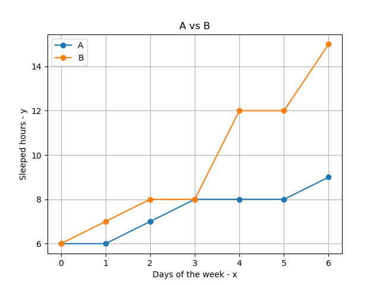

# Média vs Mediana

## Conteúdo

 - [01 - Analisando Média vs Mediana em um exemplo real](#01)

---

<div id='01'></div>

## 01 - Analisando Média vs Mediana em um exemplo real

Bem, agora vamos fazer uma comparação entre os métodos de **Média** e **Mediana** e analisar alguns casos.

> Suponha que nós estamos tirando a média de quantas horas de sono determinas pessoas dormem por semana.

Digamos que uma das nossas amostras (pessoa) teve as seguintes horas dormidas por semana:

| Sunday | Monday | Tuesday | Wednesday | Thursday | Friday | Saturday |
|--------|--------|---------|-----------|----------|--------|----------|
|   9    |    7   |    8    |     6     |    12    |    12  |    15    |  

O cálculo da média para esse exemplo vai ser algo parecido com isso:

  

O interessante de você trabalhar com o método da média é que ela considera todos os valores **(diferente da mediana que depois do valor do meio os dados são ignorados)**.

**Mas isso tem um impacto muito grande?**  
Claro, vamos demonstrar isso agora. Suponha que você tenha 2 amostras de 2 pessoas com suas respectivas horas dormidas por semana *(Vamos dá os dados já ordenados porque para trabalhar com a mediana primeiro devemos ordenar os dados)*:

**PESSOA "A":**  
| Sunday | Monday | Tuesday | Wednesday | Thursday | Friday | Saturday |
|--------|--------|---------|-----------|----------|--------|----------|
|   6    |    6   |    7    | **>>8**   |    8     |    8   |    9     |


**PESSOA "B":**  
| Sunday | Monday | Tuesday | Wednesday | Thursday | Friday | Saturday |
|--------|--------|---------|-----------|----------|--------|----------|
|   6    |    7   |    8    | **>>8**   |   *12*   |   *12* |   *15*   |

Veja que o nosso valor médio de uma Mediana para ambas as amostras das pessoas **"A"** e **"B"** é **8**. Mas tem um outro detalhe que nós não podemos deixar passar nessas 2 amostras:

> Na segunda amostra **(Pessoa B)** se você prestar atenção os valores depois da Mediana são bem maiores do que os da primeira amostra **(Pessoa A)**. Ou seja, a segunda pessoa dormiu bem mais.

**NOTE:**  
E o que isso que dizer?
 - **1ª -** Isso que dizer que os dados **não estão bem distribuídos**;
 - **2ª -** Nesse caso seria melhor aplicar a *Média* - **Já que ela considera TODOS os valores de amostras**.

Mas quando temos muitos dados para trabalhar talvez seja difícil ver essa diferença não é? Não porque nós temos os **gráficos (plots)** que nos dão uma ***abstração visual***.

Vamos criar um plot em Python para visualizar essas 2 amostras **A** e **B**:

[mean_median_graph.py](src/mean_median_graph.py)
```python
def create_df(**df):
  my_df = {}
  import pandas as pd
  my_df = pd.DataFrame(df)
  return my_df

if __name__ =='__main__':

  import matplotlib.pyplot as plt

  sleep_search = {
    'A': [6, 6, 7, 8, 8, 8, 9],
    'B': [6, 7, 8, 8, 12, 12, 15]
  }

  my_df = create_df(**sleep_search)
  print(my_df)

  plt.plot(my_df, marker='o')
  plt.title("A vs B")
  plt.xlabel("Days of the week - x")
  plt.ylabel("Sleeped hours - y")
  plt.legend(['A', 'B'])
  plt.savefig('../images/mean-median.png', format='png')
  plt.show()
```

**OUTPUT:**  
```
   A   B
0  6   6
1  6   7
2  7   8
3  8   8
4  8  12
5  8  12
6  9  15
```

  

**NOTE:**  
Viram como a médiana entre as duas amostras realmente batem, porém, depois da médiana os dados das amostras se distanciam muito um do outro - **Isso porque a segunda pessoa dormiu bem mais**.

Ok, então a média vai ser sempre melhor do que a mediana? Não. Suponha que nós temos um conjunto de dados relativamente distribuído, ou seja:

 - Os **valores menores** estarão sempre puxando para a **esquerda**;
 - E os **valores maiores** estarão sempre puxando para a **direita**;
 - E na mediana vão está os valores centrais.

Quando nós trabalharmos com esse conjunto distribuído a mediana tende a ignorar **dados muito distorcidos (Outliers)** - **Isso tende a ser uma vantagem em relação a Média porque ela considera todos os dados na amostra**.

> **OBS:** Lembre que isso é para uma *amostra bem distribuído* com *ALGUNS pontos fora da curva*.

É algo parecido com isso:


---

**REFERÊNCIAS:**  
[Myself](#)
