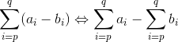

# Somatórios - Σ

# Contents

 - [01 - Introdução ao Somatório (Σ)](#01)
 - [02 - Exemplos Práticos](#02)

<div id='01'></div>

## 01 - Introdução ao Somatório (Σ)

Ok pessoas, agora vamos começar um estudo simples e fácil sobre somatórios - **Σ**.

  

A primeira impressão é que isso deve ser algo extretamente difícil, mas é mais fácil do que você imagina. Como exemplo, considere a seguinte **soma dos inteiros entre 1 e 5**:

```
1 + 2 + 3 + 4 + 5
```

Como isso pode ser expressado em um somatório?

  

 - A letra grega **sigma (Σ)** denota o somatório;
 - Neste caso, o número **1** é o **LIMITE INFERIOR** do somatório;
 - E o **5** é o **LIMITE SUPERIOR** do somatório;
 - A variável ***i*** é chamada de índice do somatório.

Vamos ver de novo como fica a nomenclatura depois da nossa explicação:

  

Também podemos *adicionar*, *subtrair* e *multiplicar* 2 somatórios. Veja a seguir para ficar mais claro:

  
  
  

<div id='02'></div>

## 02 - Exemplos Práticos

Ok, já sabemos como é fácil entender os somatórios, mas como trabalhar com eles na prática?

> Suponha que nós queremos somar os quadradros dos números entre 1 e 3:

  

Como eu represento isso em um somatório?  


Da para resolver isso com Python? Python é Python né galera...

[sum_squares.py](src/sum_squares.py)
```python
def sum_squares(i, n):
  s = []
  p = i
  while p <= n:
    s.append(p ** 2)
    p += 1
  s = sum(s)
  print("O somatório dos quadrados (n²) de {0} até {1} é {2}.".format(i, n, s))

if __name__ =='__main__':
  s = sum_squares(1, 10)
```

**OUTPUT:**  
```
O somatório dos quadrados (n²) de 1 até 3 é 14.
```

Viram que da um certo trabalho ter que fazer tudo isso manual né? E se fosse a soma dos quadradros entre 1 e 10, omg!!! Dá para resumir isso com somatório? É claro e já vimos isso antes:

  
  

Viram como é fácil? Para todos os valores no índice ***i*** vamos elevar ao quadrado; e sabemos que o limite inferior é i = 1; e o limite superior é 10, ou seja, de 1 até 10.

Vamos testar a soma dos quadradros de **1** até **10** com o nosso programa [sum_squares.py](src/sum_squares.py)?

**OUTPUT:**  
```
O somatório dos quadrados (i²) de 1 até 10 é 385.
```

---

**Rodrigo Leite** *- Software Engineer*
