# Matplotlib

# Contents

 - **Matplotlib - Part I:**
   - [01 - Instalando e adicionando o Matplotlib ao Ambiente Virtual](#01)
   - [02 - Plotando seu primeiro Gráfico](#02)
 - **Matplotlib - Part II:**
   - [01 - Estilo de linha e cor](#03)
   - [02 - Salvando uma figura](#04)
   - [03 - Subplots](#05)
   - [04 - Múltiplas figuras](#06)
   - [05 - Pylab vs Pyplot vs Matplotlib](#07)
   - [06 - Desenhando texto](#08)
   - [07 - Legendas](#09)
   - [08 - Escalas não lineares](#10)
   - [09 - Projeção polar](#11)
   - [10 - Projeção 3D](#12)
   - [11 - Linhas](#13)
   - [12 - Imagens](#14)
   - [13 - Gráfico de Dispersão - Scatter plot](#15)
   - [14 - Histograms](#16)
   - [15 - Construindo Plots](#17)
   - [16 - Gráficos de Barras - (Bar chart)](#18)
   - [17 - Scatterplot](#19)
   - [18 - Stack Plots](#20)
   - [19 - Pie Chart](#21)
   - [20 - Gráficos a partir do NumPy](#22)

<div id='01'></div>

## 01 - Instalando e adicionando o Matplotlib ao Ambiente Virtual

Bem, se você já viu nossos tutoriais sobre *NumPy* e *Pandas* vai ser fácil identificar nossos comandos de instalação e como adicionar nossas bibliotecas no [requirements.txt](../../../requirements.txt).

Então, vamos direto ao ponto para já partir para o mão na massa:

```python
pip install matplotlib==3.1
pip install --upgrade matplotlib

pip show matplotlib

Name: matplotlib
Version: 3.1.3
Summary: Python plotting package
Home-page: https://matplotlib.org
Author: John D. Hunter, Michael Droettboom
Author-email: matplotlib-users@python.org
License: PSF
```

Ok, já instalamos o Matplotlib agora basta adicionar no [requirements.txt](../../../requirements.txt):

```python
pip freeze > requirements.txt
```

<div id='02'></div>

## 02 - Plotando seu primeiro Gráfico

Bem, vamos começar plotando um gráfico bem simples só para começar. Veja o código abaixo:

[first_plot.py](src/first_plot.py)
```python
import matplotlib.pyplot as plt

plt.plot([1, 2, 4, 9, 5, 3])
plt.savefig('../images/fig-01.png', format='png')
plt.show()
```

**OUTPUT:**  
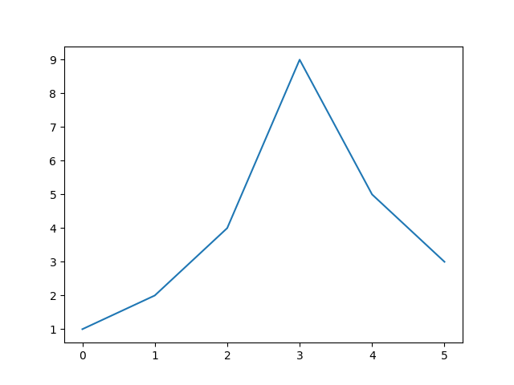

Então, o que está acontecendo? Vamos por partes:

 - **1ª -** Nós importamos o pacote *pyplot* da biblioteca *Matplotlib* com um apelido (ou alias) de *plst*;
 - **2ª -** Chamamos a função **plot()** responsável por criar um plot;
 - **3º -** Passamos como argumento como argumento uma lista de dados:
   - Essa lista vai plotar nos pontos x e y os mesmos dados visto que só passamos uma.
 - **4ª -** Salvamos a imagem da função plot() em um diretório específico
   - Também adicionamos um nome a imagem + formato da imagem.
 - **5º -** Utilizamos a função **show()** responsável por exibir o plot.

__NOTE:__  
Se a função __plot()__ receber um array de dados, ela usará como coordenadas:
 - No eixo vertical (y) os dados de entrada - No nosso caso = [1, 2, 4, 9, 5, 3]
 - E usará o índice de cada dado no array como a coordenada horizontal.

Você também pode fornecer dois arrays:
 - Um para o eixo horizontal - x
 - E um para o eixo vertical - y

[two_list_plot.py](src/two_list_plot.py)
```python
import matplotlib.pyplot as plt

plt.plot([-3, -2, 5, 0], [1, 6, 4, 3])
plt.savefig('../images/fig-02.png', format='png')
plt.show()

```

**OUTPUT:**  
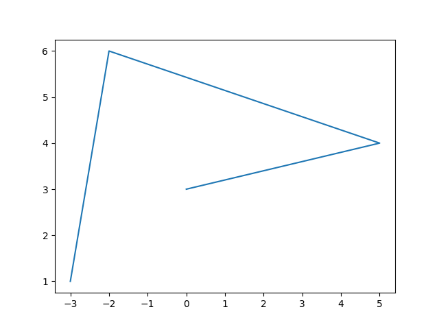

Os eixos correspondem automaticamente à extensão dos dados. E se você desejar dar um pouco mais de espaço ao gráfico, então vamos chamar a função __axis()__ para alterar a extensão de cada eixo __[xmin, xmax, ymin, ymax]__.

[test_axis.py](src/test_axis.py)
```python
import matplotlib.pyplot as plt

plt.plot([-3, -2, 5, 0], [1, 6, 4, 3])

# Eixo "x" = mínimo -4 e máximo 6
# Eixo "y" = mínimo 0 e máximo 7
plt.axis([-4, 6, 0, 7])

plt.savefig('../images/fig-03.png', format='png')
plt.show()
```

**OUTPUT:**  


Agora, vamos traçar uma função matemática:
 - Vamos utilizar a função __linspace()__ do NumPy para criar um array **x** contendo 500 floats variando de -2 a 2;
 - Depois vamos criar um segundo array **y** calculada como **o quadrado de x**.

[linspace_example.py](src/linspace_example.py)
```python
import numpy as np
import matplotlib.pyplot as plt

def create_graph(axes_x, axes_y):
  plt.plot(axes_x, axes_y)
  plt.savefig('../images/fig-04.png', format='png')
  plt.show()

if __name__ =='__main__':
  x = np.linspace(-2, 2, 500)
  y = x**2
  create_graph(x, y)
```

**OUTPUT:**  


**NOTE:**  
Isso é um pouco seco, vamos adicionar:
 - Um título;
 - Labels para os eixo **x** e **y**;
 - E desenhar um grid no plot.


[linspace_example.py](src/linspace_example.py)
```python
import numpy as np
import matplotlib.pyplot as plt

def create_graph(axes_x, axes_y):
  plt.plot(axes_x, axes_y)
  plt.title("Square Function")
  plt.xlabel("x")
  plt.ylabel("y = x**2")
  plt.grid(True)
  plt.savefig('../images/fig-04.png', format='png')
  plt.show()

if __name__ =='__main__':
  x = np.linspace(-2, 2, 500)
  y = x**2
  create_graph(x, y)
```

**OUTPUT:**  
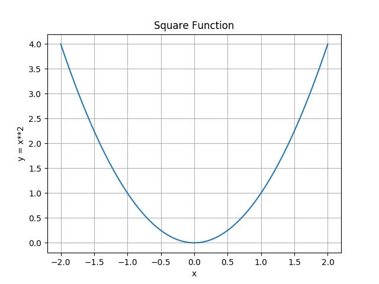

# NOTA

Como esse assunto já estava pronto (e hoje é domingo 16:25h e eu estou com MUITA preguiça ) a partir dos próximos exemplos não vamos criar códigos no diretório [src/](src). Agora vão ser só exemplos e figuras já prontas, mas nada impede de você pegar esse exemplos e criar seus próprios módulos/scripts Python.

# Matplotlib - Part II

<div id='03'></div>

## 01 - Estilo de linha e cor

Por padrão, o matplotlib desenha uma linha entre pontos consecutivos.


```python
plt.plot([0, 100, 100, 0, 0, 100, 50, 0, 100], [0, 0, 100, 100, 0, 100, 130, 100, 0])
plt.axis([-10, 110, -10, 140])
plt.show()
```


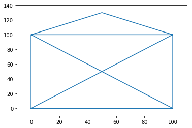


Você pode passar um terceiro argumento para alterar o estilo e a cor da linha. Por exemplo, __"g--"__ significa:
 - Linha tracejada -- 
 - Verde - g = Green


```python
plt.plot([0, 100, 100, 0, 0, 100, 50, 0, 100], [0, 0, 100, 100, 0, 100, 130, 100, 0], "g--")
plt.axis([-10, 110, -10, 140])
plt.show()
```


Você pode plotar várias linhas em um gráfico de maneira muito simples: basta passar `x1, y1, [style1], x2, y2, [style2], ...`

Por exemplo:


```python
plt.plot([0, 100, 100, 0, 0], [0, 0, 100, 100, 0], "r-", [0, 100, 50, 0, 100], [0, 100, 130, 100, 0], "g--")
plt.axis([-10, 110, -10, 140])
plt.show()
```


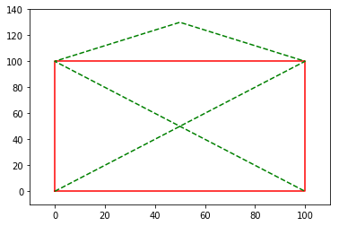


Você também pode desenhar pontos simples em vez de linhas. Aqui está um exemplo com:
 - Traços verdes
 - Linha pontilhada vermelha
 - E triângulos azuis


```python
x = np.linspace(-1.4, 1.4, 30)
plt.plot(x, x, 'g--', x, x**2, 'r:', x, x**3, 'b^')
plt.show()
```


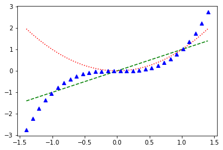

<div id='04'></div>

## 02 - Salvando uma figura

Salvar uma figura no disco é tão simples, basta chamar a função __savefig()__ com:
 - O nome do arquivo (ou um objeto de arquivo).
 - Os formatos de imagem disponíveis dependem do back-end gráfico que você usa.


```python
x = np.linspace(-1.4, 1.4, 30)
plt.plot(x, x**2)
plt.savefig("my_square_function.png")
```


Se você desejar salvar essa imagem como `transparente` basta utilizar: __transparent=True__


```python
x = np.linspace(-1.4, 1.4, 30)
plt.plot(x, x**2)
plt.savefig("my_square_function.png", transparent=True)
```


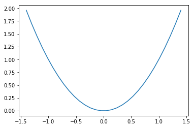

<div id='05'></div>

## 03 - Subplots

Um valor de figura no matplotlib pode conter várias subplots. Esses subplots são organizadas em uma grade. Para criar um subplot, basta chamar a função __subplot()__ e especificar o número de linhas e colunas na figura e o índice do subplot no qual você deseja desenhar (começando em 1, depois da esquerda para a direita e de cima para baixo).

Observe que o pyplot monitora o subplot ativo no momento (à qual você pode obter uma referência chamando `plt.gca()`), portanto, quando você chama a função __plot()__, ele desenha para você o subplot:


```python
x = np.linspace(-1.4, 1.4, 30)

plt.subplot(2, 2, 1)  # 2 linhas, 2 colunas, 1º subplot = superior esquerdo.
plt.plot(x, x)
plt.subplot(2, 2, 2)  # 2 linhas, 2 colunas, 2º subplot = superior direito.
plt.plot(x, x**2)
plt.subplot(2, 2, 3)  # 2 linhas, 2 colunas, 3º subplot = inferior esquerdo.
plt.plot(x, x**3)
plt.subplot(2, 2, 4)  # 2 linhas, 2 colunas, 4º subplot = inferior direito
plt.plot(x, x**4)
plt.show()
```


__NOTE:__  
Note que `subplot(223)` é uma forma abreviada de `subplot(2, 2, 3)`.

É fácil criar subplots que se espalham por várias células da grade da seguinte forma:


```python
plt.subplot(2, 2, 1)  # 2 linhas, 2 colunas, 1º subplot = superior esquerdo.
plt.plot(x, x)
plt.subplot(2, 2, 2)  # 2 linhas, 2 colunas, 2º subplot = superior direito.
plt.plot(x, x**2)
plt.subplot(2, 1, 2)  # 2 linhas, *1* coluna, 3º subplot = Esse vai ficar centralizado por conta do esquema.
plt.plot(x, x**3)
plt.show()
```


<div id='06'></div>

## 04 - Múltiplas figuras

Também é possível desenhar várias figuras. Cada figura pode conter um ou mais subplots. Por padrão, o matplotlib cria `figure(1)` automaticamente. Quando você muda de figura, o pyplot monitora a figura atualmente ativa (à qual você pode obter uma referência chamando `plt.gcf()`), e a sub-plotagem ativa dessa figura torna-se o subplot atual.


```python
x = np.linspace(-1.4, 1.4, 30)

plt.figure(1)
plt.subplot(211)
plt.plot(x, x**2)
plt.title("Square and Cube")
plt.subplot(212)
plt.plot(x, x**3)

plt.figure(2, figsize=(10, 5))
plt.subplot(121)
plt.plot(x, x**4)
plt.title("y = x**4")
plt.subplot(122)
plt.plot(x, x**5)
plt.title("y = x**5")

plt.figure(1)      # back to figure 1, current subplot is 212 (bottom)
plt.plot(x, -x**3, "r:")

plt.show()
```


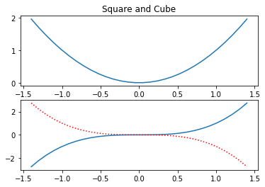


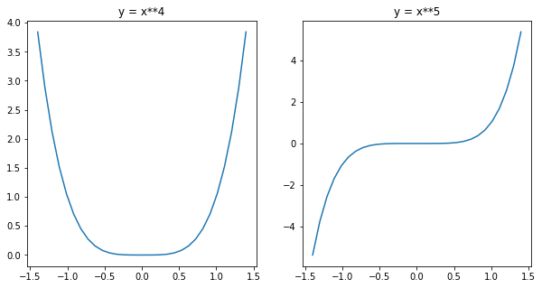


<div id='07'></div>

## 05 - Pylab *vs* Pyplot *vs* Matplotlib

Há alguma confusão em torno da relação entre __pylab__, __pyplot__ e __matplotlib__. É simples:

 - O matplotlib é a biblioteca completa, contém tudo, incluindo pylab e pyplot.
 - O Pyplot fornece várias ferramentas para plotar gráficos, incluindo a interface da máquina de estado com a biblioteca de plotagem orientada a objetos subjacente.
 - O Pylab é um módulo de conveniência que importa o matplotlib.pyplot e o NumPy em um espaço de nome único. Você encontrará muitos exemplos usando o pylab, mas ele não é mais recomendado (porque as importações `explícitas` são melhores que as `implícitas`).

<div id='08'></div>

## 06 - Desenhando texto
Você pode chamar a função __text()__ para adicionar um texto em qualquer local no gráfico. Basta especificar as coordenadas horizontais e verticais e o texto e, opcionalmente, alguns atributos extras.

Qualquer texto no matplotlib pode conter expressões de equações do TeX, veja a [documentação](http://matplotlib.org/users/mathtext.html) para mais detalhes.


```python
x = np.linspace(-1.5, 1.5, 30)
px = 0.8
py = px**2

plt.plot(x, x**2, "b-", px, py, "ro")

plt.text(0, 1.5, "Square function\n$y = x^2$", fontsize=20, color='blue', horizontalalignment="center")
plt.text(px - 0.08, py, "Beautiful point", ha="right", weight="heavy")
plt.text(px, py, "x = %0.2f\ny = %0.2f"%(px, py), rotation=50, color='gray')

plt.show()
```


__NOTE:__  
É bastante frequente anotar elementos de um gráfico, como o belo ponto acima. A função __annotate()__ torna isso fácil: basta indicar a localização do ponto de interesse e a posição do texto, além de, opcionalmente, alguns atributos extras para o texto e a seta. Veja como fazer isso abaixo:


```python
plt.plot(x, x**2, px, py, "ro")
plt.annotate("Beautiful point", xy=(px, py), xytext=(px-1.3,py+0.5),
                           color="green", weight="heavy", fontsize=14,
                           arrowprops={"facecolor": "lightgreen"})
plt.show()
```


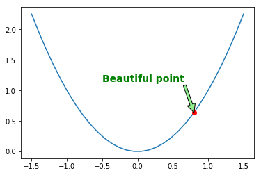


Você também pode adicionar uma caixa delimitadora ao redor do texto usando o atributo __bbox__:


```python
plt.plot(x, x**2, px, py, "ro")

bbox_props = dict(boxstyle="rarrow,pad=0.3", ec="b", lw=2, fc="lightblue")
plt.text(px-0.2, py, "Beautiful point", bbox=bbox_props, ha="right")

bbox_props = dict(boxstyle="round4,pad=1,rounding_size=0.2", ec="black", fc="#EEEEFF", lw=5)
plt.text(0, 1.5, "Square function\n$y = x^2$", fontsize=20, color='black', ha="center", bbox=bbox_props)

plt.show()
```


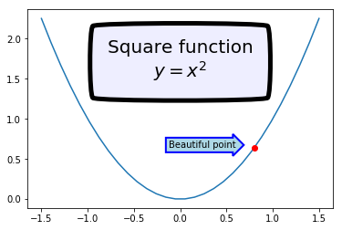

<div id='09'></div>

## 07 - Legendas

A maneira mais simples de adicionar uma legenda é definir um `label` em todas as linhas(ou plot) e depois chamar a função __legend()__:


```python
x = np.linspace(-1.4, 1.4, 50)
plt.plot(x, x**2, "r--", label="Square function")
plt.plot(x, x**3, "g-", label="Cube function")
plt.legend(loc="best")
plt.grid(True)
plt.show()
```


<div id='10'></div>

## 08 - Escalas não lineares

O Matplotlib suporta escalas não lineares, como escalas logarítmicas ou logit.


```python
x = np.linspace(0.1, 15, 500)
y = x**3/np.exp(2*x)

plt.figure(1)
plt.plot(x, y)
plt.yscale('linear')
plt.title('linear')
plt.grid(True)

plt.figure(2)
plt.plot(x, y)
plt.yscale('log')
plt.title('log')
plt.grid(True)

plt.figure(3)
plt.plot(x, y)
plt.yscale('logit')
plt.title('logit')
plt.grid(True)

plt.figure(4)
plt.plot(x, y - y.mean())
plt.yscale('symlog', linthreshy=0.05)
plt.title('symlog')
plt.grid(True)

plt.show()
```


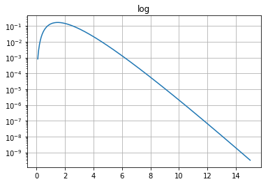


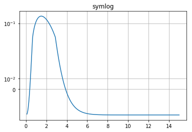

<div id='11'></div>

## 09 - Projeção polar

Desenhar um gráfico polar é tão fácil quanto definir o atributo `projection` com o argumento `"polar"`.


```python
radius = 1
theta = np.linspace(0, 2*np.pi*radius, 1000)

plt.subplot(111, projection='polar')
plt.plot(theta, np.sin(5*theta), "g-")
plt.plot(theta, 0.5*np.cos(20*theta), "b-")
plt.show()
```


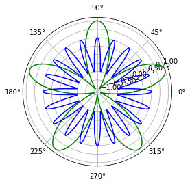

<div id='12'></div>

## 10 - Projeção 3D

Plotar gráficos 3D é bastante simples:

Primeiro ,você precisa importar `Axes3D`, que registra a projeção como `"3d"`:

&gt; from mpl_toolkits.mplot3d import Axes3D  
 
Em seguida, crie um subplot configurando a projeção para "3d". Isso retorna um objeto `Axes3DSubplot`, que você pode usar para chamar a função __plot_surface()__, fornecendo coordenadas `x`, `y` e `z`, além de atributos opcionais.


```python
from mpl_toolkits.mplot3d import Axes3D

x = np.linspace(-5, 5, 50)
y = np.linspace(-5, 5, 50)
X, Y = np.meshgrid(x, y)
R = np.sqrt(X**2 + Y**2)
Z = np.sin(R)

figure = plt.figure(1, figsize = (12, 4))
subplot3d = plt.subplot(111, projection='3d')
surface = subplot3d.plot_surface(X, Y, Z, rstride=1, cstride=1, cmap=matplotlib.cm.coolwarm, linewidth=0.1)
plt.show()
```


Outra maneira de exibir esses mesmos dados é por meio de um gráfico de contorno:


```python
plt.contourf(X, Y, Z, cmap=matplotlib.cm.coolwarm)
plt.colorbar()
plt.show()
```


<div id='13'></div>

## 11 - Linhas

Você pode desenhar linhas simplesmente usando a função __plot()__, como fizemos até agora. No entanto, geralmente é conveniente criar uma função de utilitaria que ploteie uma linha (aparentemente) infinita no gráfico, considerando uma inclinação e uma interceptação. Você também pode usar as funções __hlinese()__ e __vlines()__ que plotam segmentos de linhas horizontais e verticais. Por exemplo:


```python
from numpy.random import randn

def plot_line(axis, slope, intercept, **kargs):
    xmin, xmax = axis.get_xlim()
    plt.plot([xmin, xmax], [xmin*slope+intercept, xmax*slope+intercept], **kargs)

x = randn(1000)
y = 0.5*x + 5 + randn(1000)*2
plt.axis([-2.5, 2.5, -5, 15])
plt.scatter(x, y, alpha=0.2)
plt.plot(1, 0, "ro")
plt.vlines(1, -5, 0, color="red")
plt.hlines(0, -2.5, 1, color="red")
plot_line(axis=plt.gca(), slope=0.5, intercept=5, color="magenta")
plt.grid(True)
plt.show()
```


<div id='14'></div>

## 12 - Imagens

Ler, gerar e plotar imagens no matplotlib é bastante simples.  
  
Para ler uma imagem, basta importar o módulo __matplotlib.image__ e chamar sua função __imread()__, passando o nome do arquivo (ou objeto de arquivo). Isso retorna os dados da imagem, como um array NumPy. Vamos tentar isso com a imagem __my_square_function.png__ que salvamos anteriormente:


```python
import matplotlib.image as mpimg

img = mpimg.imread('my_square_function.png')
print(img.shape, img.dtype)
```

    (288, 432, 4) float32


Nós carregamos uma imagem 288x432. Cada pixel é representado por uma matriz de 4 elementos: níveis de vermelho, verde, azul e alfa, armazenados como floats de 32 bits entre 0 e 1. Agora tudo o que precisamos fazer é utilizar a função __imshow()__ para exibir nossa imagem (já carregada com a função __imread()__ é claro):


```python
plt.imshow(img)
plt.show()
```


Agora você pode querer esconder os eixos quando estiver exibindo uma imagem:


```python
plt.imshow(img)
plt.axis('off')
plt.show()
```


É tão fácil gerar sua própria imagem:


```python
img = np.arange(100*100).reshape(100, 100)
print(img)
plt.imshow(img)
plt.show()
```

    [[   0    1    2 ...   97   98   99]
     [ 100  101  102 ...  197  198  199]
     [ 200  201  202 ...  297  298  299]
     ...
     [9700 9701 9702 ... 9797 9798 9799]
     [9800 9801 9802 ... 9897 9898 9899]
     [9900 9901 9902 ... 9997 9998 9999]]


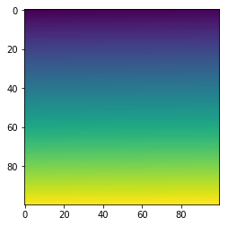


Como não fornecemos níveis RGB, a função __imshow()__ mapeia automaticamente os valores para um gradiente de cores. Por padrão, o gradiente de cor vai de azul (para valores baixos) a vermelho (para valores altos), mas você pode selecionar outro mapa de cores. Por exemplo:


```python
plt.imshow(img, cmap="hot")
plt.show()
```


Você também pode gerar uma imagem RGB diretamente:


```python
img = np.empty((20,30,3))
img[:, :10] = [0, 0, 0.6]
img[:, 10:20] = [1, 1, 1]
img[:, 20:] = [0.6, 0, 0]
plt.imshow(img)
plt.show()
```


Como a `img` matriz é muito pequena (20x30), quando a função __imshow()__ é exibida, ela aumenta a imagem para o tamanho da figura. Por padrão, usa a [interpolação bilinear](https://en.wikipedia.org/wiki/Bilinear_interpolation) para preencher os pixels adicionados. É por isso que as bordas parecem borradas. Você pode selecionar outro algoritmo de interpolação, como copiar a cor do pixel mais próximo:


```python
plt.imshow(img, interpolation="nearest")
plt.show()
```


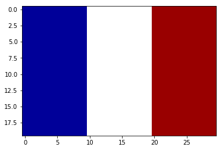

<div id='15'></div>

## 13 - Gráfico de Dispersão -  Scatter plot

Para desenhar um gráfico de dispersão (Scatter plot), simplesmente forneça as coordenadas `x` e `y` dos pontos.


```python
from numpy.random import rand
x, y = rand(2, 100)
plt.scatter(x, y)
plt.show()
```


Você também pode, opcionalmente, fornecer a escala de cada ponto.


```python
x, y, scale = rand(3, 100)
scale = 500 * scale ** 5
plt.scatter(x, y, s=scale)
plt.show()
```


E como de costume, há vários outros atributos que você pode definir, como as cores de preenchimento e de borda e o nível alfa.


```python
for color in ['red', 'green', 'blue']:
    n = 100
    x, y = rand(2, n)
    scale = 500.0 * rand(n) ** 5
    plt.scatter(x, y, s=scale, c=color, alpha=0.3, edgecolors='blue')

plt.grid(True)

plt.show()
```


<div id='16'></div>

## 14 - Histograms


```python
data = [1, 1.1, 1.8, 2, 2.1, 3.2, 3, 3, 3, 3]
plt.subplot(211)
plt.hist(data, bins = 10, rwidth=0.8)

plt.subplot(212)
plt.hist(data, bins = [1, 1.5, 2, 2.5, 3], rwidth=0.95)
plt.xlabel("Value")
plt.ylabel("Frequency")

plt.show()
```


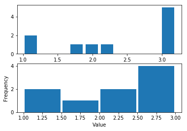


```python
data1 = np.random.randn(400)
data2 = np.random.randn(500) + 3
data3 = np.random.randn(450) + 6
data4a = np.random.randn(200) + 9
data4b = np.random.randn(100) + 10

plt.hist(data1, bins=5, color='g', alpha=0.75, label='bar hist') # default histtype='bar'
plt.hist(data2, color='b', alpha=0.65, histtype='stepfilled', label='stepfilled hist')
plt.hist(data3, color='r', histtype='step', label='step hist')
plt.hist((data4a, data4b), color=('r','m'), alpha=0.55, histtype='barstacked', label=('barstacked a', 'barstacked b'))

plt.xlabel("Value")
plt.ylabel("Frequency")
plt.legend()
plt.grid(True)
plt.show()
```


<div id='17'></div>

## 15 - Construindo Plots


```python
# O "matplotlib.pyplot" é uma coleção de funções e estilos que fazem com que o Matplotlib funcione como o Matlab.
import matplotlib as mpl
import matplotlib.pyplot as plt
%matplotlib inline
```


```python
# Importa a biblioteca NumPy.
import numpy as np
```


```python
# Verifica a versão do Matplotlib.
mpl.__version__
```


    '3.0.3'


### 1.1 linspace

A função linspace cria uma seqüência de números uniformemente espaçados entre os limites dados, opcionalmente incluindo o valor final (por default, esse é o comportamento). Esta função vai devolver um arranjo unidimensional que pode ser usado em qualquer operação que exija arranjos.


```python
# Cria uma sequência uniformemente do 0 ao 5 com espaçamento de 11.
x = np.linspace(0, 5, 11)
```


```python
# Exibe a sequência.
x
```


    array([0. , 0.5, 1. , 1.5, 2. , 2.5, 3. , 3.5, 4. , 4.5, 5. ])


```python
# O meu 'y' vai ser o meu 'x' ao quadrado.
y = x * x
```


```python
# Exibe a sequência 'Y'.
y
```


    array([ 0.  ,  0.25,  1.  ,  2.25,  4.  ,  6.25,  9.  , 12.25, 16.  ,
           20.25, 25.  ])


```python
# Cria um gráfico para representar nossas sequências no plano.
plt.plot(x, y)
```


    [<matplotlib.lines.Line2D at 0x7ff1df4e0160>]


### 1.2 Método show() do Matplotlib 
Esse gráfico só está sendo exibido porque no começo do arquivo nós especificamos __"%matplotlib inline"__. Caso contrário seria preciso utilizar o método __plot.show()__.


```python
# Cria um gráfico para representar nossas sequências no plano.
plt.plot(x, y)
# Exibe o gráfico.
plt.show()
```


Vejam que com o método __show()__ não teve um output, apenas foi exibido o gráfico.

### 1.3 Adicionando labels nos eixos 'X', 'Y' e 'título' no gráfico

Para adicionar esse labels e título nós utilizamos os métodos:

- xlabel()
- ylabel()
- title()

__NOTE:__  
Outro coisa interessante que podemos fazer é passar valores para o __color__. Com isso nós podemos passar cores para os nossos labels e títulos do __plot__.


```python
# Cria o plot.
plt.plot(x, y)

plt.xlabel('Eixo X', color='r') # Adiciona título para o Eixo 'X'.
plt.ylabel('Eixo Y', color='b') # Adiciona título para o Eixo 'Y'.

# Adiciona título ao plot.
plt.title('My Graph', color='orange')
```


    Text(0.5, 1.0, 'My Graph')


### 1.4 Método subplots()

Também podemos estar criando subplots(). Esse plots vão ser criados e representados em forma de Matrix.


```python
# Cria um plot 1x2 - 1 LINHA, 2 COLUNAS. 
plt.subplots(1, 2)
plt.show()
```


```python
# Cria um plot 2x2 - 2 LINHAS, 2 COLUNAS.
plt.subplots(2, 2)
plt.show()
```


### 1.5 Trabalhando com os subplots()

Para trabalhar com subplots() nós precisamos apenas passar o terceiro argumento para o método subplots() que via indica qual plot trabalhar.


```python
# Seta o PRIMEIRO plot como ativo.
plt.subplot(1, 2, 1)
# Trabalha com o PRIMEIRo plot, com linhas Red(vermelho) tracejadas.
plt.plot(x, y, 'r--')

# Seta o SEGUNDO plot como ativo.
plt.subplot(1, 2, 2)
# Trabalha com o SEGUNDO plot, com linhas Green(verde) tracejadas e asteriscos.
plt.plot(x, y, 'g*--')
plt.show()
```


```python
# O método plot() recebe como argumento se definido os eixos do gráfico: x e y.
plt.plot([1, 3, 5], [2, 5, 7])
plt.show()
```


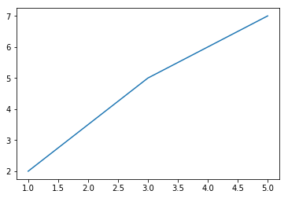


```python
# Cria uma lista que vai representar as coordenadas "x".
x = [1, 4, 5]
```


```python
# Cria uma lista que vai representar as coordenadas "y".
y = [3, 7, 2]
```


```python
# Cria um plot a partir das listas "x" e "y".
plt.plot(x, y)


plt.xlabel('Variável 1') # Adicione um título(title) para as coordenadas "x".
plt.ylabel('Variável 2') # Adicione um título(title) para as coordenadas "y".

# Adiciona um título para o plot.
plt.title('Teste Plot')
# Exibe o plot com o método show().
plt.show()
```


```python
# Cria mais DUAS listas que vão representar as coordenadas "x" e "y".
x2 = [1, 2, 3]
y2 = [11, 12, 15]
```


```python
# Cria um plot, porém, agora esse plot vai ter uma label definida já como argumento.
plt.plot(x2, y2, label = 'Primeira Linha')

plt.legend() # Você também pode passar a label(legenda) aqui como argumento.
plt.show() # Exibe o plot();
```


<div id='18'></div>

## 16 - Gráficos de Barras - (Bar chart)

O __"Bar chart"__ cria "BARRAS", onde as coordenadas "x" e "Y" se encontram.


```python
# Cria duas listas que vão representar as coordenadas "x" e "y" do "Bar chart".
x = [2,4,6,8,10]
y = [6,7,8,2,4]
```


```python
# Cria um "Bar chart" que recebe como argumento:
# - As listas que representam as coordenadas "x" e "y";
# - Um label(legenda) que vai aparecer no "Bar chart", no nosso caso é o nome "Barras";
# - O atributo "color" que vai ser responsável por dizer qual cor vai ter nosso "Bar chart".
plt.bar(x, y, label = 'Barras', color = 'r')

plt.legend(loc=0) # O argumento "loc" pode ser utilizad para mudar a label(legenda) de lugar.
plt.show() # Exibe o plot/gráfico.
```


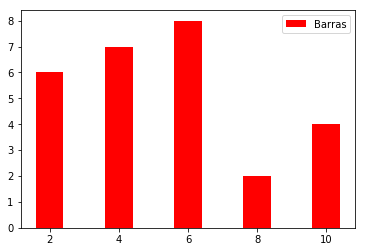


```python
# Cria mais DUAS listas para representar outras coordendas dentro de um "Bar chart".
x2 = [1,3,5,7,9]
y2 = [7,8,2,4,2]
```


```python
# Cria o PRIMEIRO "Bar chart" que vai receber:
# - As coordenadas das listas "x" e "y";
# - Um label(legenda);
# - Um atributo dizendo a cor do plot - 'r' - RED.
plt.bar(x, y, label = 'Barras1', color = 'r')

# Cria o SEGUNDO "Bar chart" que vai receber:
# - As coordenadas das listas "x2" e "y2";
# - Um label(legenda);
# - Um atributo dizendo a cor do plot - 'y' - YELLOW.
plt.bar(x2, y2, label = 'Barras2', color = 'y')

# Utiliza o método legend() para exibir as labels(legendas) no "Bar chart".
plt.legend()  # Você também pode passar a label(legenda) aqui como argumento.
# Exibe o "Bar chart" com o método show().
plt.show() # Exibe o plot/gráfico.
```


<div id='19'></div>

## 17 - Scatterplot

O __"Scatterplot"__ cria "BOLINHAS(pontos)", onde as coordenadas "x" e "Y" se encontram.


```python
# Cria duas listas que vão representar as coordenadas "x" e "y" do "Scatterplot".
x = [1,2,3,4,5,6,7,8]
y = [5,2,4,5,6,8,4,8]
```


```python
# Cria um "Scatterplot" que vai receber como argumento:
# - As coordenadas "x" e "y";
# - Um label(legenda);
# - Um atributo "color" 'r' - RED
# - Um argumento s = 100 - s = SIZE.
plt.scatter(x, y, label = 'Pontos', color = 'r', marker = 'o', s = 100)

plt.legend() # O argumento "loc" pode ser utilizad para mudar a label(legenda) de lugar - loc=1, loc=2
plt.show() # Exibe o plot/gráfico.
```


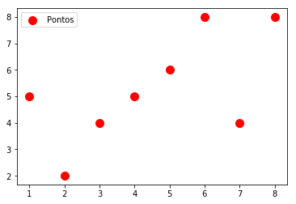

<div id='20'></div>

## 18 - Stack Plots

O __Stack Plots__ é muito conhecido como __"Gráfico de Área"__.


```python
# Cria listas que vão representar as coordenadas.
dias = [1,2,3,4,5]
dormir = [7,8,6,77,7]
comer = [2,3,4,5,3]
trabalhar = [7,8,7,2,2]
passear = [8,5,7,8,13]
```


```python
# O "stackplot" recebe como argumento:
# - Liastas;
# - Suas cores no gráfico.
plt.stackplot(dias, dormir, comer, trabalhar, passear, colors = ['m','c','r','k','b'])
plt.show()
```


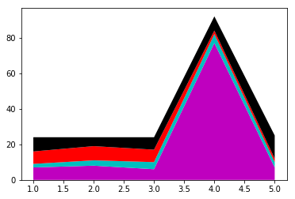

<div id='21'></div>

## 19 - Pie Chart

O __Pie Chart__ é o famoso __"gráfico de Pizza"__.


```python
# Cria uma lista que vai representar o TAMANHO DAS FATIAS DA PIZZA.
fatias = [7, 2, 2, 13]

# Cria uma lista que vai representar as LABELS DA FATIA - NOME DE CADA FATIA.
atividades = ['dormir','comer','trabalhar','passear']

# Cria uma lista que vai representar as CORES DE CADA FATIA.
colunas = ['c','m','r','k']
```


```python
# O método pie() vai receber os seguintes argumentos:
# - Uma lista que vai representar os TAMANHOS DAS FATIAS;
# - Uma lista de fatias que vai ser passada para o atributo "labels" - De cada fatia respectivamente;
# = Uma lista de cores que vai ser passada para o atributo "color";
plt.pie(fatias, labels = atividades, colors = colunas, startangle = 90, shadow = True, explode = (0,0.1,0,0))
plt.legend(loc=4) # Utiliza o atributo "loc=4" para move ro label(legenda) de lugar.
plt.show()
```


<div id='22'></div>

## 20 - Gráficos a partir do NumPy


```python
# Importa o pyplot da biblioteca Matplotlib.
import matplotlib.pyplot as plt
# Importa a biblioteca NumPy.
import numpy as np
%matplotlib inline
```


```python
# Cria um "scatter plot" a partir do NumPy e passa como argumentos os métodos:
# - np.arange();
# - np.random.randn().
plt.scatter(np.arange(50), np.random.randn(50), color='black')
plt.show()
```


```python
# Plot e Scatter - Cria dois gráficos paralelos.
fig = plt.figure()

ax1 = fig.add_subplot(1,2,1)
ax1.plot(np.random.randn(50), color='red')

ax2 = fig.add_subplot(1,2,2)
ax2.scatter(np.arange(50), np.random.randn(50))
plt.show()
```


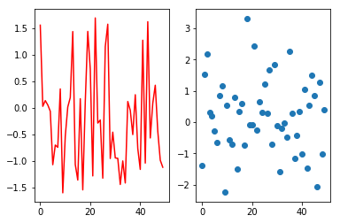


```python
# Plots diversos - Cria diversos tipos de plots paralelos.
_, ax = plt.subplots(2,3)

ax[0,1].plot(np.random.randn(50), color = 'green', linestyle = '-')
ax[1,0].hist(np.random.randn(50))
ax[1,2].scatter(np.arange(50), np.random.randn(50), color = 'red')
plt.show()
```


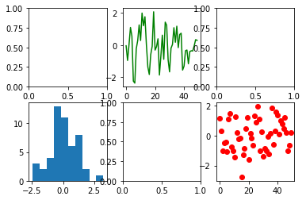


```python
# Histogramas
n = np.random.randn(100000)
fig, axes = plt.subplots(1, 2, figsize=(12,4))

axes[0].hist(n)
axes[0].set_title("Histograma Padrão")
axes[0].set_xlim((min(n), max(n)))

axes[1].hist(n, cumulative=True, bins=50)
axes[1].set_title("Histograma Cumulativo")
axes[1].set_xlim((min(n), max(n)));
```


---

**Rodrigo Leite** *- Software Engineer*
