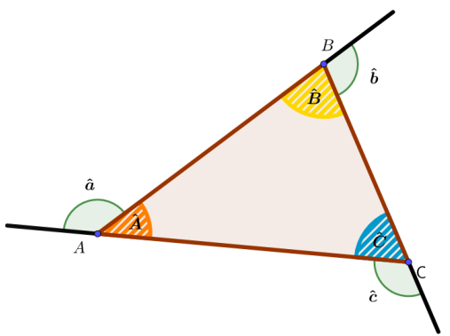
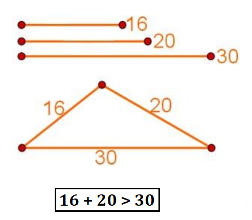
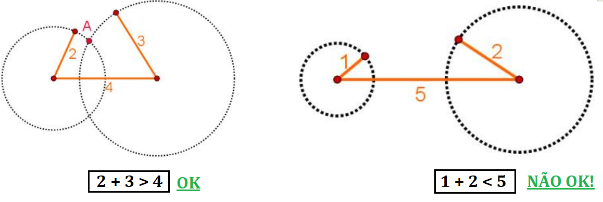
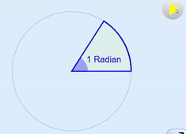
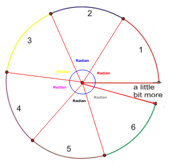
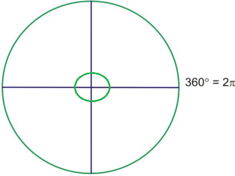
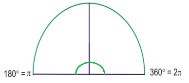
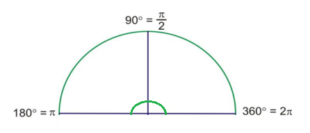
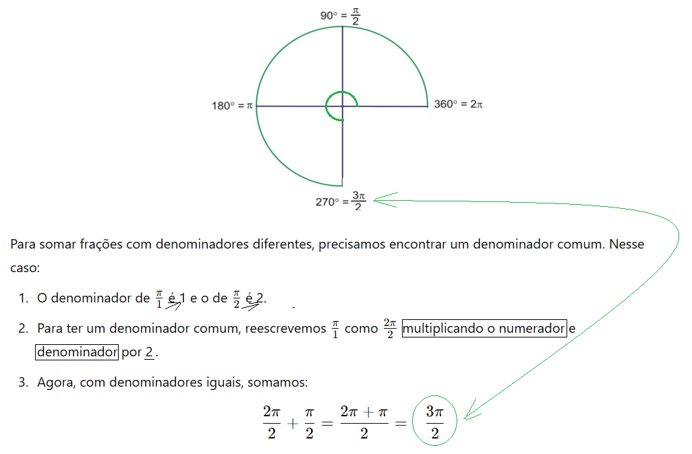
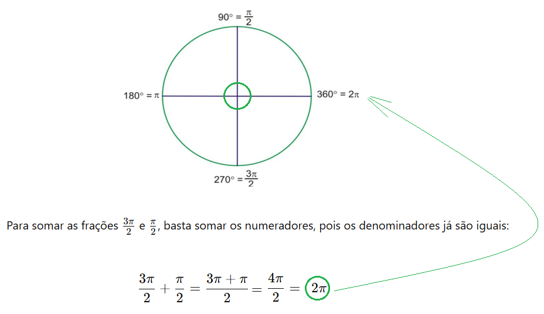

# Trigonometria

> **A Trigonometria é o ramo da Matemática que estuda as *relações* entre os `lados` e os `ângulos` de um *"triângulo"*.**  
> Essas *relações* podem ser usadas para `encontrar lados` ou `ângulos faltantes` de um triângulo.

## Contents

 - **Pré-Requisitos:**
   - [**Reta (Linha)**](#intro-to-retas)
     - [Semirreta](#intro-to-semirretas)
     - [Segmento de Reta](#intro-to-segmento-da-reta)
   - [**Raio**](#intro-to-raios)
   - [**Ângulo**](#intro-to-angulos)
     - [Ângulos podem ser representados por letras gregas](#angles-greek-letters)
   - [**Triângulo**](#intro-to-triangle)
     - [Regra de existência de um triângulo](#triangle-rule)
     - [A soma de todos os ângulos de "qualquer triângulo" = 180 graus (180°)](#tsaat)
   - [**Circunferência e Círculo**](#intro-to-circumference)
     - [Perímetro de uma Circunferência (+Formula)](#circumference-perimeter)
     - [Centro de uma Circunferência](#circumference-center)
     - [Raio de uma Circunferência](#circumference-radius)
     - [Reta Tangente de uma Circunferência](#circumference-tangent-line)
     - [Reta Secante de uma Circunferência](#circumference-secant-line)
     - [Corda de uma Circunferência](#circumference-chord)
     - [Arco de uma Circunferência](#circumference-arc)
     - [Diametro de uma Circunferência](#circumference-diameter)
     - [Razão entre o perímetro e o diâmetro de uma circunferência (Pi π)](#circumference-ratio)
     - [Área de um Círculo](#circle-area)
   - **Graus e Radiano**
     - [Radiano](#intro-to-radiano)
     - [Comparando Graus e Radianos no Círculo Unitário (Trigonométrico)](#comparing-graus-and-radianos)
 - [**Configurações**](#settings)
 - [**REFERÊNCIAS**](#ref)
<!---
[WHITESPACE RULES]
- Same topic = "20" Whitespace character.
- Different topic = "100" Whitespace character.
--->


<!--- ( Pré-Requisitos ) --->

---

<div id="intro-to-retas"></div>

## Reta (Linha)

 - Uma **"reta (linha)"** é um conjunto infinito de pontos que se estende infinitamente em ambas as direções.
 - Um **"reta (linha)"** não possui começo nem fim;

Tendo em vista que as **retas (linhas) possuem infinitos pontos**, conclui-se que elas também possuem comprimento infinito.

Por exemplo:

  

> **NOTE:**  
> No exemplo acima, caso prosseguíssemos desenhando a *"reta m"* em qualquer de suas direções, jamais terminaríamos, pois a reta é infinita.

---

<div id="intro-to-semirretas"></div>

## Semirreta

Para entender o que são **semirretas** melhor vamos parti do ponto que temos a seguinte **reta m**:

  

a partir dessa **reta m**, vamos determinar dois pontos, **"P"** e **"Q"**, em sua extensão:

  

Se considerarmos a parte **m** que tem uma origem em **"P"** e passa por **"Q"**, teremos uma *semirreta*, que indicaremo assim:

  

Vejam que, denotamos a semirreta de origem em **"P"** que passa pelo ponto **"Q"** com duas letras *maiúsculas* e uma *pequena seta acima*.

> **Essa semirreta termina no ponto *"Q"*?**  
> Não, ela passa pelo ponto **Q**.

  

---

<div id="intro-to-segmento-da-reta"></div>

## Segmento de Reta

Para entender o que é **Segmento de Reta** melhor vamos parti do ponto que temos a seguinte **reta m**:

  

Agora, vamos marcar alguns pontos nessa reta:

  

Agora, vamos traçar um caminho entre os pontos **"P"** e **"Q"**:

  

Continuando, vamos separar esse caminho da reta:

  

Vamos fazer o mesmo com os pontos **"R"** e **"S"**:

  

> **Então, qual a diferença de "Semirreta" e "Segmento de reta"?**

  

 - Esses **"pedaços da reta m"**, é que nós conhecemos como **"segmentos de reta"**.
 - **NOTE:** Isso porque eles tem **"início"** e **"fim"**.

  

> **NOTE:**  
> Vejam que nós também denotamos um *Segmento de reta* com letras maiúsculas, porém, agora utilizamos apenas uma **barra em cima das letras** ao *inves de uma seta*.


---

<div id="intro-to-raios"></div>

## Raio

> Um **"raio"** é a parte de uma reta (linha) que tem um ponto inicial (origem) e se estende infinitamente na direção oposta - **Como uma semirreta**.

Por exemplo:

  

Os **Raios** também podem ser exibidos dentro de uma linha:

  

**NOTE:**  
Quando dois **raios** *compartilham um ponto inicial (de origem) comum*, eles formam um ângulo:

  


---

<div id="intro-to-angulos"></div>

## Ângulo

> Um **Ângulo** a *"região delimitada por duas semirretas"*.

Por exemplo, veja a imagem abaixo:

  

 - As *semirretas* **"A"** e **"C"** formam o ângulo `α (alpha)`.
 - As semirretas **"C"** e **"B"** formam o ângulo `β (beta)`.

---

<div id="angles-greek-letters"></div>

## Ângulos podem ser representados por letras gregas

> **"Ângulos"** são frequentemente representados por **"letras gregas"**.

Por exemplo, vejamos algumas **"letras gregas"** comuns usadas para representar os ângulos:

| Letra Grega | Descrição |
|-------------|-----------|
| **α**       | Alfa      |
| **β**       | Beta      |
| **θ**       | Teta      |

  


---

<div id="intro-to-triangle"></div>

## Triângulo

Um triângulo é uma figura geométrica com:

 - 3 vértices (pontos);
 - 3 arestas (lados ou linhas);
 - 3 angulos (ângulos internos).

Por exemplo:

  

> **NOTE:**  
> Veja que nesse exemplos o triângulo também tem *"ângulos externos"*.

---

<div id="triangle-rule"></div>

## Regra de existência de um triângulo

**Pergunta:** Com 3 segmentos de retas, sempre vou conseguir desenhar um triângulo?  
**Resposta:** nem sempre!!  

Isso isso acontecer nós temos que ter a seguinte condição:

> A soma dos dois menores lados do triângulo **deve ser maior** do que a medida do **maior lado do triângulo**.

Por exemplo:

  

Vejamos outros exemplos:

  

> **REGRA:**  
> A soma dos dois menores lados do triângulo **deve ser maior** do que a medida do maior lado do triângulo.

---

<div id="tsaat"></div>

## A soma de todos os ângulos de "qualquer triângulo" = 180 graus (180°)

> A soma de todos os ângulos de `qualquer triângulo` *sempre* resultará em *180 graus (180°)*.

**EXEMPLO-01:**  
  

**EXEMPLO-02:**  
  


---

<div id="intro-to-circumference"></div>

## Circunferência e Círculo

### Circunferência

> Uma **circunferência** é uma linha fechada, em que qualquer um de seus pontos possui a mesma distância do ponto central.

Por exemplo:

  

### Círculo

Agora, e se vocês resolvessem preencher uma circunferência, ocupando todos os pontos do seu interior, será que ela ainda poderia ser chamada assim?

> **NOTE:**  
> Pois bem, uma *"circunferência preenchida"* é conhecida como **"círculo"**:

  

O **círculo** é uma superfície plana limitada por uma circunferência. Existe uma peça de metal muito conhecida e utilizada cujo formato é justamente o de um círculo, ou disco. Para lembrar do significado de um círculo, vocês podem associá-lo a uma moeda!

  

Basicamente:

 - Quando falamos em **circunferência**, nos referimos a uma linha fechada que possui uma única dimensão:
   - Por isso, é possível calcular apenas o comprimento da circunferência.
 - Contudo, quando se fala em **círculo**, tem-se em vista uma superfície que possui duas dimensões:
   - Dessa forma, é possível calcular a área do círculo.

---

<div id="circumference-perimeter"></div>

## Perímetro de uma Circunferência (+Formula)

O **perímetro** de uma **circunferência** é o comprimento total da linha que forma o círculo, ou seja, a distância ao redor dele:


> **NOTE:**  
> Ou seja, nesse contexto *"perimetro"* e *"circumference"* tem o mesmo significado.

O perímetro de um círculo (circunferência) pode ser calculado usando a fórmula:

```python
C = 2πr
```

---

<div id="circumference-center"></div>

## Centro de uma Circunferência

 - Em um **Círculo** existe um *ponto central* que é *equidistante de todos os pontos da borda (circunferência)* do círculo.
 - **NOTE:** Esse ponto é conhecido como **"centro da circunferência"**.

  

---

<div id="circumference-radius"></div>

## Raio de uma Circunferência

 - A distância do centro, até qualquer ponto da circunferência, é conhecida como **raio da circunferência**.
 - **NOTE:** Costuma-se representar o raio da circunferência pela letra **"R"**.

  

---

<div id="circumference-tangent-line"></div>

## Reta Tangente de uma Circunferência

Uma **Reta (Linha)** que *passa muito perto da circunferência*, e que a *toca em um único P*, é conhecida como **"reta tangente a circunferência"**.

  

---

<div id="circumference-secant-line"></div>

## Reta Secante de uma Circunferência

Uma **Reta (Linha)** que **corta a circunferência em dois pontos distintos *"A"* e *"B"*** é chamada de **"reta secante em relação a circunferência"**.

  

---

<div id="circumference-chord"></div>

## Corda de uma Circunferência

A parte da *reta secante* que é **interna a circunferência** é o que nós conhecemos como **"corda da circunferência"**.

  

---

<div id="circumference-arc"></div>

## Arco de uma Circunferência

 - Um **arco** de um Círculo é a **parte entre quaisquer dois pontos de uma circunferência**.
 - **NOTE:** Um arco costuma ser representado pela letra **l minúscula**.


---

<div id="circumference-diameter"></div>

## Diametro de uma Circunferência

Uma *circunferência* pode ter inúmeras *cordas (parte interna da reta (linha) entre dois pontos da circunferência)*, de diferentes tamanhos:

  

> **NOTE:**  
> Contudo, sem dúvida alguma, a *corda de maior comprimento* de uma *circunferência* sempre será aquela que passa pelo seu centro da circunferência:

  

 - Isso é o que nós conhecemos como **"diametro da circunferência"**.
 - **NOTE:** O *"diâmetro de uma circunferência"* mede `2r`, pois ele é formado pela **união de dois raios**.

> **Por que estamos multiplicando "2r" se é a união de dois raios?**

A notação `2r` é uma forma simples de expressar que o diâmetro é duas *"vezes o raio"*:

```python
r + r   = (igual)   2r
```

---

<div id="circumference-ratio"></div>

## Razão entre o perímetro e o diâmetro de uma circunferência (Pi π)

> A razão entre o *"perímetro"* de uma circunferência e seu *"diâmetro"* sempre resultará na constante `Pi π = 3,14`.

  

```python
π = 3,14159265358979323846…
```

> **Qual a vantagem de saber isso?**  
> Por que se nós soubermos o diâmetro nós conseguiremos encontrar o perímetro e vice-versa, apenas utilizando operações algébricas.

---

<div id="circle-area"></div>

## Área de um Círculo

Uma das vantagens de saber que o perímetro de uma circunferência dividida por seu diametro resultará sempre na constante `Pi π = 3,14` é que conseguimos calcular a *"Área"* de um círculo, apenas utilizando operações algébricas:

  


---

<div id="intro-to-radiano"></div>

## Radiano

> Um **"Radiano"** é o **"ângulo que gera um arco"** de **"comprimento igual ao do raio"**."

  

 - O comprimento do arco varia de acordo com o tamanho do raio.
 - **NOTE:** Mas o ângulo de 1 radiano sempre significa que *"comprimento do arco" = "comprimento do raio"*, qualquer que seja o valor do raio.


> **O que aconteceria se rodassemos ao redor do círculo adicionando outros radianos?**

  

Vejam que:

 - **Temos 6 radianos.**
   - E um pouquinho mais.
 - **Esses 6 radianos podem ser usados para medir ângulos:**
   - Ou seja, agora usamos *"radianos"* em vez de *"graus"* para medir ângulos.

---

<div id="comparing-graus-and-radianos"></div>

## Comparando Graus e Radianos no Círculo Unitário (Trigonométrico)

Para entender a relação de Graus e Radianos no Círculo Unitário (Trigonométrico) vamos considerar que uma rotação completa do círculo (circunferência) é:

 - **Graus:**
   - 360° (ou 360 graus)
 - **Radianos:**
   - `2π` (ou `2π` radianos)

  

> **Por que a volta em um circulo (circunferência) é *"2π"* radianos?**  
> Em geometria, usamos `2π` para representar uma volta completa em um círculo (circunferência) quando os ângulos são medidos em radianos (Por hora, vamos só lembrar disso).

Sabendo disso, também podemos dizer que a metade de um círculo (circunferência) é:

 - **360° (ou 360 graus) dividido por 2:**
   - 180° (ou 180 graus)
 - **2π (ou 2π radianos) dividido por 2:**
   - 1rad (ou 1π radiano) = π

  

> **E se eu dividir esses 180° (ou π) por 2?**

  

> **Agora se eu pegar esses 180° (ou π) e acrescentar 90° (ou π/2)?**

  

> **Para finalizar, se eu pegar esses 270° (ou 3π/2) e acrescentar mais 90° (ou π/2)?**

  


<!--- ( Configurações ) --->

---

<div id="settings"></div>

## Configurações

**CRIANDO O AMBIENTE VIRTUAL:**
```bash
python -m venv environment
```

**ATIVANDO O AMBIENTE VIRTUAL (LINUX):**
```bash
source environment/bin/activate
```

**ATIVANDO O AMBIENTE VIRTUAL (WINDOWS):**
```bash
source environment/Scripts/activate
```

**UPDATE PIP:**
```bash
python -m pip install --upgrade pip
```

**INSTALANDO AS DEPENDÊNCIAS:**  
```bash
pip install -U -v --require-virtualenv -r requirements.txt
```

**SALVANDO NOVAS DEPENDEÊNCIAS (OU ATUALIZAÇÕES):**
```bash
pip freeze > requirements.txt --require-virtualenv
```

**Agora, seja feliz!!!** 😬


<!--- ( REFERENCES ) --->

---

<div id="ref"></div>

## REFERÊNCIAS

 - **Geral:**
   - [ChatGPT](https://chat.openai.com/)
   - [Grok](https://grok.com/)
 - **Pré-Requisitos:**
   - **Reta (Linha):**
     - [O que é reta?](https://brasilescola.uol.com.br/o-que-e/matematica/o-que-e-reta.htm)
     - [Semirreta](https://www.todamateria.com.br/semirreta/)
   - **Raio:**
     - [Ray math](https://thirdspacelearning.com/us/math-resources/topic-guides/geometry/ray-math/)
   - **Ângulo:**
     - [Ângulos - brasilescola](https://brasilescola.uol.com.br/matematica/angulos.htm)
     - [Classificando ângulos](https://descompliqueamatematica.com.br/classificacao-de-angulos/)
   - **Triângulo:**
     - [Geometria - Triângulos](https://apppublico.com.br/educacao_cristais/pdf/20200531185510_6%207%20DG%20AULA%204.pdf)
   - **Circumferência e Círculo:**
     - [ELEMENTOS DA CIRCUNFERÊNCIA E DO CÍRCULO](https://blog.professorferretto.com.br/elementos-da-circunferencia-e-do-circulo/)
     - [CIRCUNFERÊNCIA E CÍRCULO](https://blog.professorferretto.com.br/conceitos-iniciais-sobre-a-circunferencia-e-o-circulo/)
   - **Radianos:**
   - **Triângulos:**

---

**Rodrigo** **L**eite da **S**ilva - **rodrigols89**
