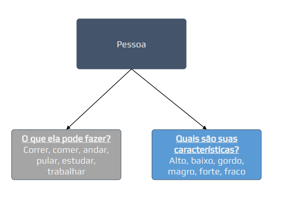
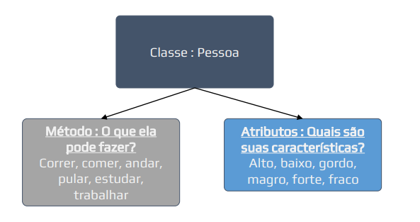

# Introdução à Orientação a Objetos (+Classes)

## Conteúdo

 - [01 - Introdução a Objetos](#intro-to-oop)
   - [01.1 - Objetos em Python](#obj-python-01)
   - [01.2 - Objetos em Java](#obj-java-01)

---

<div id="intro-to-oop"></div>

## 01 - Introdução a Objetos

Bem, objetos são basicamente uma abstração de algo no mundo real. Por exemplo, uma ***pessoa***:

 - **O que uma pessoa pode fazer?**
   - Correr;
   - Comer;
   - Andar;
   - Pular;
   - Estudar;
   - Trabalhar...
 - **Quais são as características de uma pessoa?**
   - Alto;
   - Baixo;
   - Gordo;
   - Magro;
   - Forte;
   - Fraco...

Podemos claramente perceber que essas duas perguntas possuem respostas muito claras.

**NOTE:**  
O que ela pode fazer em geral são ações desempenhadas pela pessoa, já as características simplesmente existem na pessoa. Ações como correr ou comer, podem afetar a característica de ser forte ou fraco, mas são coisas distintas.

Veja essa abstração abaixo de forma visual:

  

Usando o mesmo exemplo, vamos agora fingir que essa pessoa existe dentro de uma **Linguagem de Progração**:

 - Nesse caso, essa pessoa seria um **objeto** ou **classe**;
 - As ações, que essa **Classe**: **‘pessoa’** pode fazer são os **métodos**;
 - Já as **característica** são os **atributos**.

Mais uma vez vamos ver isso de uma forma visual para ficar mais claro:

  

---

<div id="obj-python-01"></div>

## 01.1 - Objetos em Python

> Bem, mas como eu posso representar esse objeto ***pessoa*** do mundo real em Python?

Em Python (como em outras linguagens de programação) nós utilizamos a **palavra-chave *class*** para declarar uma classe.

Veja como é simples:

[Person.py](src/python/Person.py)
```python
class Person:
  pass
```

**NOTE:**  
Ok, aqui nós apenas temos uma classe para representar uma pessoa, porém, se você olhar bem vai notar que essa representação ainda não tem nenhuma **Ação (método)** ou **Característica (Atributo)**.

---

<div id="obj-java-01"></div>

## 01.2 - Objetos em Java

Agora nós vamos aprender a estrutura básica para representar um Objeto do mundo real em Java. Não é nada de outro mundo se comparado com outra linguagem de programação, veja abaixo:

[Person.java](src/java/Person.java)
```java
class Person {
  // Attributes here...

  // Methods here... 
}
```

---

**REFERÊNCIAS:**  
[Python Impressionador: Curso de Python Completo](https://www.hashtagtreinamentos.com/curso-python)
